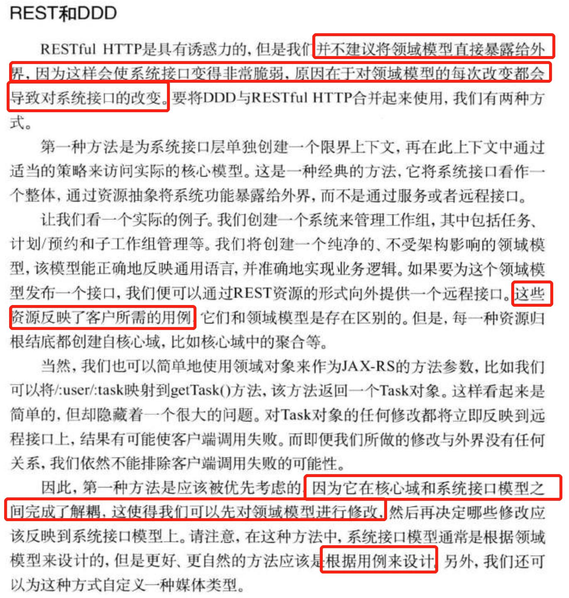

# REST API Design - Resource Modeling

[TOC]

## 概述

> “The key abstraction of information in REST is a resource. Any information that can be named can be a resource: a document or image, a temporal service (e.g. "today's weather in Los Angeles"), a collection of other resources, a non-virtual object (e.g. a person), and so on. In other words, any concept that might be the target of an author's hypertext reference must fit within the definition of a resource. A resource is a conceptual mapping to a set of entities, not the entity that corresponds to the mapping at any particular point in time.” - Roy Fielding’s dissertation.

资源构成了任何 REST API 设计的核心，其中包含了以下三个部分的设计：

- 资源的标识符，URI
- 资源的表示（Resource representations）
- 资源的操作方法（HTTP 方法）

对资源的设计，核心点在于：

- 选择正确的资源
- 选择正确的资源粒度a

资源可以是单例或集合：

- 集合：`/customers`
- 单例：`/customers/{customerId}`

资源也可能包含子资源：

- `/customers/{customerId}/accounts`
- `/customers/{customerId}/accounts/{accountId}`

选择资源的起点是分析您的业务领域并提取与您的业务需求相关的名词：

> The starting point in selection of resources is to analyze your business domain and extract the nouns that are relevant to your business needs.

当没有很好的名词可以映射到资源时，可以从领域中寻找：

> For example, we can easily use the “nouns in the domain” approach and identify low level resources such as Post, Tag, Comment, etc. in a blogging domain. Similarly, we can identify the nouns Customer, Address, Account, Teller, etc. as resources in a banking domain.

## 细粒度资源和粗粒度资源

细粒度和粗粒度的资源各有优劣：

- 细粒度资源的缺点：我们会为消费者提供一个过于啰嗦的 API，较难使用，同时暴露过多细节，甚至可能泄露业务逻辑。
- 粗粒度资源的缺点：可能没有足够的变化来支持所有 API 使用者的需求，难以复用和维护。

这里有个博客粗细粒度 API 的示例：

- 博客细粒度 API：设计多个 API，每个 API 分别用于博客文章（标题和内容）、图片附件、标签等。
- 博客粗粒度 API：设计一个 API，同时提交博客的文章、图片附件、标签。

## 防止将业务逻辑泄露到 API 使用者

如果使用细粒度的资源（最为极端情况就是对资源进行 CRUD 操作），将会有两大结果：

- 首先，API 消费者与 API 提供者的交互将非常频繁。
- 其次，业务逻辑将开始溢出到 API 消费者。

业务逻辑溢出到 API 消费者，又会带来困难：

- 可能会使数据处于不一致状态（要解决这个问题，需要额外提供底层 API，例如支持对数据加锁、回滚、提交等）。
- 同时产生维护问题（鉴于业务逻辑可能会发生变化，这种方法会增加维护工作，尤其是已经存量了巨大数量的 API 消费者时）。

一个示例：

例如有一个业务逻辑是：帖子有图片时，才能加图片标签。那么 API 消费者就需要先调用创建帖子的 API，再调用加图片的 API，最后调用加图片标签的 API。

如果不按照这个顺序，或者没有及时请求完，则文章的状态是无效的。从本质上讲，这意味着 API 消费者需要了解和应用 API 消费者端的业务逻辑。

在粗粒度 API 的情况下，业务逻辑保留在 API 提供者端，从而减少了前面讨论的数据不一致问题。API 使用者甚至可能不知道在服务器中应用的业务逻辑，并且在许多情况下不需要知道。

## 业务流程粗粒度聚合资源

使用粗粒度聚合资源，我们遇到的问题主要有：

- 如果我没有足够的名词怎么办？
- 如果我的服务正在处理多个（两个或更多）资源，并对这些资源进行大量操作，该怎么办？
- 如何做到有许多名词，少量动词的粗粒度交互？
- 如何避免类似 CRUD 的交互？

区分 REST API 中的资源和域驱动设计中的领域实体非常重要。

领域驱动设计适用于事物的实现方面（包括 API 实现），而 REST API 中的资源驱动 API 设计和契约。

因此**API 资源选择不应依赖于底层域实现细节。**

来自 DDD 理论一书中的观点：

### 避免 CRUD

避免 CRUD 的方法是创建业务操作或业务流程资源，或者我们可以称之为**意图**的资源，表达业务或领​​域级别的**想要某物的状态**或**接近结束的流程状态结果**。

避免 CRUD 意味着确保托管资源的服务是唯一可以直接更改其状态的代理。

### 名词与动词

考虑一个例子：在银行建立一个新客户。

此业务流程可以称为 EnrollCustomer（动词） 或 CustomerEnrollment（名词）。

使用 CustomerEnrollment 作为作为资源听起来更好，读起来也很好：“客户 xxxx 的客户注册号 2543”。

CustomerEnrollment 还具有维护业务相关、可独立查询和不断发展的状态的额外好处。这种资源的业务等价物是我们可能在业务中填写的典型表格，它会触发业务流程。

### 抽象概念的具体化

Reification 是：让抽象的东西更具体或更真实。

> Make (something abstract) more concrete or real.

通过专注于业务能力的粗粒度方法，我们将更多具体化的抽象概念建模为资源。实体化资源的一个很好的例子是我们之前讨论过的 CustomerEnrollment。我们使用的资源相当于**注册客户的请求**，而不是使用**客户资源**。

看另外两个示例：

- 银行账户现金存款：**客户将钱存入他的账户。**
  - 这涉及到：应用业务规则、新客户账户余额、添加交易条目、向客户的手机或电子邮件发送通知等操作。
  - 虽然我们在技术上可以使用这里的账户资源，更好的选择是具体化称为交易（或存款）的业务能力/抽象概念，并创建一个新的资源“交易”（Transaction，名词）。

- 两个银行账户之间的资金转账：**客户将资金从一个银行账户转移到另一个银行账户。**
  - 这涉及到：更新两个低级资源（“发件人”帐户和“收件人”帐户），还涉及业务验证、创建交易条目、发送通知等。如果“收件人”帐户在另一家银行，则可能会进行转帐通过中央银行或外部机构。
  - 这里抽象的概念是“汇款”交易（“money transfer” transaction，名词）。
  - 要转账，我们可以发布到 `/transactions` 或 `/accounts/343/transactions` 并创建一个新的“Transaction”（或“MoneyTransfer”）资源。

在这两种情况下，我们不是使用 Account 资源，而是使用相当于存款或转账命令的资源 - Transaction 资源（类似于前面提到的 CustomerEnrollment）。

这是一个好主意，特别是如果这可能是一个长期运行的过程（例如：汇款在完成之前可能涉及多个阶段）。

当然，这并不妨碍您拥有一个 Account 资源，甚至 Account 资源可以作为“Transaction”处理的结果而更新。

## 参考文献

1. [REST API 设计 - 资源建模](https://www.thoughtworks.com/insights/blog/rest-api-design-resource-modeling)