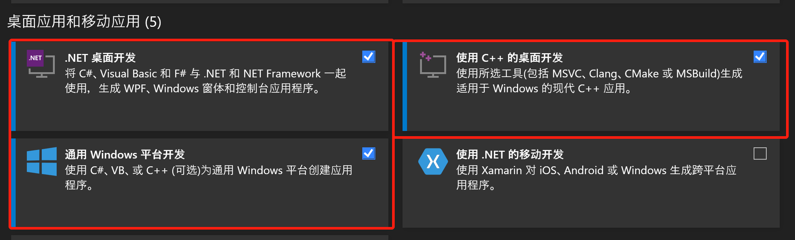
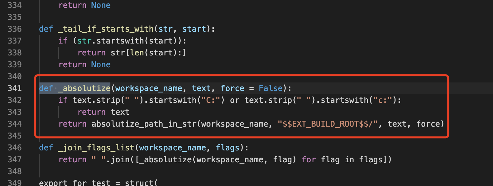
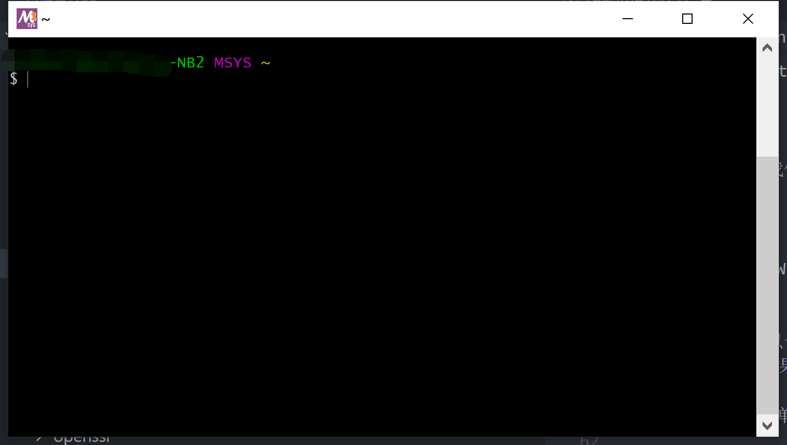
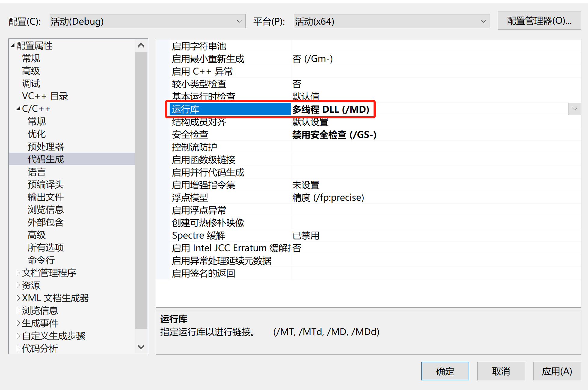
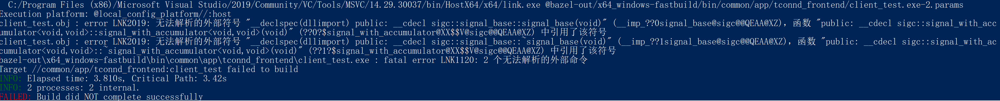
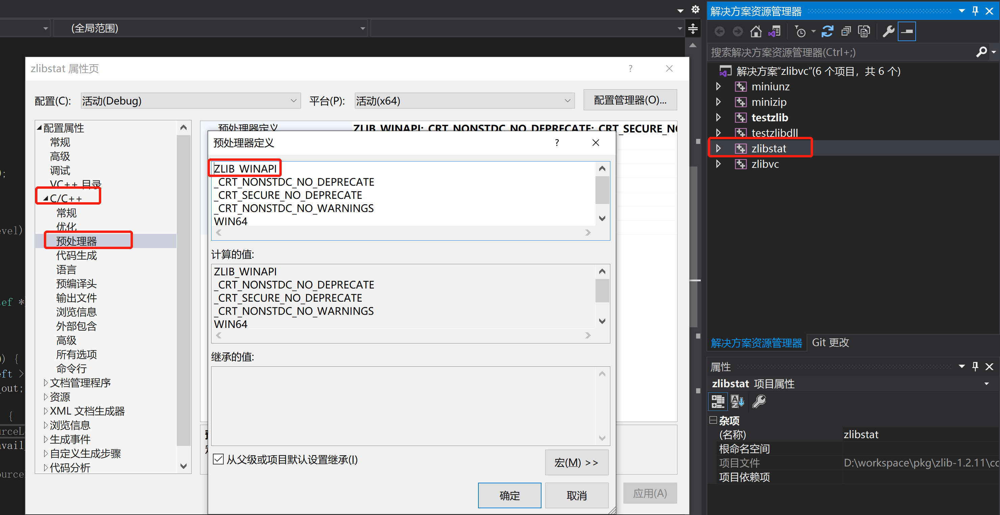

# Bazel C++ Compile In Windows

<!-- TOC -->

- [Bazel C++ Compile In Windows](#bazel-c-compile-in-windows)
    - [Overview](#overview)
    - [Installation](#installation)
        - [Bazelisk](#bazelisk)
        - [MSVC](#msvc)
        - [MSYS2](#msys2)
    - [CPLUSPLUS](#cplusplus)
        - [Predefined Macros](#predefined-macros)
        - [Pragma Comment](#pragma-comment)
    - [Bazel Build](#bazel-build)
        - [MSVC Options](#msvc-options)
            - [/std](#std)
            - [/MD|MT](#mdmt)
        - [Bazel Options](#bazel-options)
    - [Link](#link)
    - [More](#more)
        - [TGCPAPI Link Error](#tgcpapi-link-error)
        - [TGCPAPI WinSocket](#tgcpapi-winsocket)
        - [sigc++](#sigc)
        - [Protobuf Plugin](#protobuf-plugin)
        - [ZLIB](#zlib)
        - [WARN LNK4099](#warn-lnk4099)
    - [References](#references)

<!-- /TOC -->

## Overview

本文主要是讨论 Bazel 中在 Windows 下进行相关的编译，例如：

- 我们需要下载和安装哪些依赖
- 在 C++ 代码中如何去区分当前是否为 Windows 环境
- 在 Bazel 中又如何区分当前是否为 Windows 环境
- 链接失败应该注意什么，如何使用符号表解决链接问题

本文后面提到的命令行执行环境如非特别说明，否则均是指的 powershell。

## Installation

我们 Windows 下使用 Bazel 需要做什么安装其实在 Bazel 的文档中已经介绍过了：[Installing Bazel on Windows](https://docs.bazel.build/versions/main/install-windows.html)。

这里挑几个重要的地方阐述。

### Bazelisk

我们决定通过 bazelisk 来使用 Bazel，这种方式可以根据当前工程的 bazel 版本来下载对应的 bazel 进行编译，这样我们就可以忽略 bazel 版本对我们带来的影响。

安装 bazelisk 比较好的方式是使用 go 语言，因此我们首先需要安装 go 语言，最新版本即可。

接着，我们可以安装 bazelisk 了，直接在 powershell 中输入命令即可：

```sh
go get github.com/bazelbuild/bazelisk
```

也有其他的 bazelisk 安装方式，请参考：[Installing Bazel using Bazelisk](https://docs.bazel.build/versions/main/install-bazelisk.html)。

### MSVC

我们为了在 Windows 下编译和链接 C++ 代码，需要使用 MSVC。

我们选择 Visual Studio 2019，并开始安装，安装器可以很方便根据自己的使用场景进行安装，我们核心需要安装这三个：



我们需要选择 Visual Studio 2019 的安装目录为 C 盘。

**注意：**

- Visual Studio 2019 安装到 C 目录并非是 Bazel 所引入的问题，而是为了编译 CMAKE 工程引入了非官方规则 `rules_foreign_cc` 所导致的。该规则中如果编译器位于非 C 目录，可能导致 CMAKE 的相关的路径错误。

  

安装好 Visual Studio 2019 后，就已经可以使用 Bazel 来编译符合 C++ 语言标准的代码了，Bazel 会自己寻找当前可用的代码编译器和链接器。


除了 MSVC 外，我们也可以选择其他 C++ 平台下的编译器，但是个人不推荐，配置和使用起来更加麻烦。

### MSYS2

MSYS2 并非是在 Windows 下编译 C++ 必须要安装的，但为了 Bazel 可以更好的编译 C++，避免一些 Bash 脚本所导致的问题，我们需要安装它。

MSYS2 的安装可以让 Windows 可以支持 Bash 脚本的运行，这一点其实比较重要，因为 bazel 会生成一些 shell 脚本，并通过 shell 脚本做一些构造，如果 Windows 不支持 Bash 脚本，则无法实现一些 Bazel 的功能，导致某些工程无法编译成功。

安装 MYSY2 是简单的，请直接参考其官网的安装过程：[MSYS2](https://www.msys2.org/)。

安装了 MYSY2 后，我们的 Windows 就拥有了 Bash 运行环境，原生是一个黑框：



我们可以在 mysy2 的命令窗口中使用 bazel 进行编译，但是这并不方便，因为我们还是使用 Powershell 比较多，而且 Powershell 的窗口也更好看一些。

为了在 Powershell 支持 bash，我们需要配置 mysy2 的环境变量 PATH：

```text
<MSYS2_INSTALL_PATH>/usr/bin
```

将上述路径配置到 Windows 的环境变量 PATH 中即可。

在安装了 MYSY2 后，我们可以下载常用的 MYSY2 包，这是一些 Bazel 可能会用到的命令：

```sh
pacman -S zip unzip patch diffutils git
```

## CPLUSPLUS

我们在 C++ 代码中应该如何做才能正常的编译呢？

### Predefined Macros

我们在代码层面，通常会区分不同的平台，以支持在多个平台上的编译，我们为了区分 Linux 平台和 Windows 平台通常会使用预定义宏 `_WIN32`，该值为 1 时代表 Windows 平台，为 0 代表非 Windows 平台。

我们来看看更多的关于 `_WIN32` 的细节，该预定义宏并非是 Windows 给与的，而是 MSVC 编译器给与的，请参考：[MSVC Predefined macros](https://docs.microsoft.com/en-us/cpp/preprocessor/predefined-macros?view=msvc-160)。

虽然名为 WIN32，但即便是在 Windows 上用 MSVC 进行 x64 编译，该预定义宏仍然为 1。

如果想单独区分 x64，则可以使用 _WIN64 预定义宏。

MSVC 文档中对 _WIN32 的描述：

> _WIN32 Defined as 1 when the compilation target is 32-bit ARM, 64-bit ARM, x86, or x64. Otherwise, undefined.

MSVC 文档中对 _WIN64 的描述：

> _WIN64 Defined as 1 when the compilation target is 64-bit ARM or x64. Otherwise, undefined.

除了平台外，我们可能还会根据 MSVC 版本进行特定的操作，这时，我们可以使用 `_MSC_VER` 宏定义头：

> _MSC_VER Defined as an integer literal that encodes the major and minor number elements of the compiler's version number.

例如：

- Visual Studio 2015 (14.0) 的 _MSC_VER 为 1900
- Visual Studio 2019 version 16.8, 16.9 的 _MSC_VER 为 1928

### Pragma Comment

通过 MSVC 提供的注解，我们可以在链接期间做更多的事情，我们最重要的事情之一就是添加搜索的库，例如这将添加一个 emapi 库:

```cpp
#pragma comment(lib, "emapi")
```

## Bazel Build

bazel 编译 C++ 代码可以直接使用：

```sh
bazelisk build <label>
```

但是因为 Windows 中对 x86/64, 多线程版本，Debug/Relase 的区分，我们在 bazelisk buid 时往往需要指定编译和链接选项。

这些选项有的是 Bazel 的选项有的是 MSVC 编译器的选项，有的是 Bazel 自身的选项。

### MSVC Options

Bazel 提供了一些选项用以传递 MSVC 的提供链接选项和编译选项：

- `--cxxopt=<a string>` 提供 MSVC 的编译器选项，MSVC 的编译器选项可以参考：[MSVC 编译器选项](https://docs.microsoft.com/zh-cn/cpp/build/reference/compiler-options-listed-by-category?view=msvc-160)。
- `--linkopt=<a string>` 提供 MSVC 的[MSVC 链接器选项](https://docs.microsoft.com/zh-cn/cpp/build/reference/linker-options?view=msvc-160)。

#### /std

我们常用的 MSVC 编译器选项，首先是指定 C++ 标准的版本，我们现在多以 c++17 标准为主，因此我们在编译时可以指定 c++17 标准编译代码：

```sh
bazelisk build <label> --cxxopt='/std:c++17'
```

对于 `/std` 更多细节请参考 [/std (指定语言标准版本)](https://docs.microsoft.com/zh-cn/cpp/build/reference/std-specify-language-standard-version?view=msvc-160)。

**注意：**

- 默认取值为 `/std:c++14`。

#### /MD|MT

我们在编译时往往需要指定多线程库，不同的多线程库会使用不同的方式进行连接，通常存在两种：

- MD/MDd：使用 DLL 动态链接库方式链接多线程库，MD 为 Relase 版本，MDd 为 Debug 版本。
- MT/MTd：使用 LIB 静态链接库方式链接多线程库，MT 为 Relase 版本，MTd 为 Debug 版本。

MSVC 要求编译时所有依赖都属于相同的多线程库方式，如果我们依赖的第三方库是 MD 的，那就必须使用 MD 来编译当前工程，多个第三方库要求必须用同一种多线程库。

我们可以在编译时进行指定：

```sh
# Release
bazelisk build <label> --cxxopt='/std:c++17' --cxxopt='/MD'
bazelisk build <label> --cxxopt='/std:c++17' --cxxopt='/MT'

# Debug
bazelisk build <label> --cxxopt='/std:c++17' --cxxopt='/MDd'
bazelisk build <label> --cxxopt='/std:c++17' --cxxopt='/MTd'
```

更多细节可以参考 [/MD、/MT、/LD（使用运行时库）](https://docs.microsoft.com/zh-cn/cpp/build/reference/md-mt-ld-use-run-time-library?view=msvc-160)。

在 Visual Studio 2019 中可以通过 `运行库` 指定：



### Bazel Options

这是一些我们常用的 Bazel 选项：

- cxxopt
  - Additional option to pass to gcc when compiling C++ source files.
- linkopt
  - Additional option to pass to gcc when linking.
- cpu
  - 该选项在 Windows 上可以指定编译 x86 或是 x64，默认为 x64。

  ```text
  x64 (default): --cpu=x64_windows or no option
  x86: --cpu=x64_x86_windows
  ARM: --cpu=x64_arm_windows
  ARM64: --cpu=x64_arm64_windows
  ```

- compilation_mode
  - The --compilation_mode option (often shortened to -c, especially -c opt) takes an argument of fastbuild, dbg or opt, and affects various C/C++ code-generation options, such as the level of optimization and the completeness of debug tables. Bazel uses a different output directory for each different compilation mode, so you can switch between modes without needing to do a full rebuild every time.

## Link

在 Windows 编程中，有很多问题可能导致 lib 库链接失败，包括但不局限于以下几种：

- 工程使用的 Debug/Relase 版本和 lib 库的不匹配。
- 工程使用的 x86/64 和 lib 库的不匹配。
- 工程使用的多线程库和 lib 库的不匹配。

## More

这里会阐述我在编译 C++ 代码时遇到的更匪夷所思的问题。

### TGCPAPI Link Error

TGCPAPI 是我们 TConnd 内部的一个库，即便我们使用了正确的 lib 版本进行编译，仍然会存在以下链接问题：

```sh
libtgcpapi.lib(cryptlib.obj) : error LNK2001: 无法解析的外部符号 __imp_RegisterEventSourceW
libtgcpapi.lib(cryptlib.obj) : error LNK2001: 无法解析的外部符号 __imp_GetUserObjectInformationW
libtgcpapi.lib(cryptlib.obj) : error LNK2001: 无法解析的外部符号 __imp_MessageBoxW
libtgcpapi.lib(cryptlib.obj) : error LNK2001: 无法解析的外部符号 __imp___iob_func
libtgcpapi.lib(cryptlib.obj) : error LNK2001: 无法解析的外部符号 __imp_GetDesktopWindow
libtgcpapi.lib(cryptlib.obj) : error LNK2001: 无法解析的外部符号 __imp_DeregisterEventSource
libtgcpapi.lib(cryptlib.obj) : error LNK2001: 无法解析的外部符号 __imp__vsnwprintf
libtgcpapi.lib(cryptlib.obj) : error LNK2001: 无法解析的外部符号 __imp_GetProcessWindowStation
libtgcpapi.lib(cryptlib.obj) : error LNK2001: 无法解析的外部符号 __imp_vfprintf
libtgcpapi.lib(cryptlib.obj) : error LNK2001: 无法解析的外部符号 __imp_ReportEventW
```

这是因为我们没有导入会使用的库，我们通过 `#pragma comment()` 来进行导入，我们只需要在 cpp 中导入即可：

```cpp
#ifdef _WIN32
// tgcpapi lib 依赖了叫老版本的接口，但是这些接口已经被新版本的 msvc 废弃
// 为了保持兼容性，msvc 提供了 legacy_stdio_definitions.lib 由开发者显式引入
#pragma comment(lib, "legacy_stdio_definitions.lib")
#pragma comment(lib, "user32.lib")
#pragma comment(lib, "advapi32.lib")

// 这个库是为了支持 WinSocket
#pragma comment(lib, "ws2_32.lib")
#endif /* _WIN32 */
```

加入了上述库后，仍然存在一个问题：

```sh
libtgcpapi.lib(cryptlib.obj) : error LNK2001: 无法解析的外部符号 __imp___iob_func
```

这是因为早期 MSVC 的标准输入标准输出依赖了 __imp___iob_func，但是现在的版本中却没有这个，因此老版本 MSVC 编译的 lib 但凡使用了标准输入输出都会存在这个问题。该问题在这里有所讨论：[unresolved external symbol __imp__fprintf and __imp____iob_func, SDL2](https://stackoverflow.com/questions/30412951/unresolved-external-symbol-imp-fprintf-and-imp-iob-func-sdl2)。

解决方法：

```cpp
#ifdef _WIN32
#pragma comment(lib, "legacy_stdio_definitions.lib")
#pragma comment(lib, "user32.lib")
#pragma comment(lib, "advapi32.lib")
#pragma comment(lib, "ws2_32.lib")

#  if _MSC_VER >= 1900
FILE _iob[] = {*stdin, *stdout, *stderr};
extern "C" FILE* __cdecl __iob_func(void) { return _iob; }
#  endif /* _MSC_VER>=1900 */
#endif /* _WIN32 */
```

### TGCPAPI WinSocket

TGCPAPI 的链接问题解决后，可以编译链接生成二进制文件了，当时访问 Server 建立连接总是失败：

```text
client open failed: failed to tgcpapi_start_connection with code=-6(failed to connect peer)
```

这是由于 Windows 下使用 WinSocket 需要导入 DLL 链接，否则 WinSocket 无法正确使用，导入的方式使用 WSAStartup。

更多信息可以参考 [WSAStartup 函数 (winsock.h)](https://docs.microsoft.com/en-us/windows/win32/api/winsock/nf-winsock-wsastartup)。

为了使用 WSAStartup，我们应该导入头文件和相关宏定义：

```cpp
#ifdef _WIN32
#define WIN32_LEAN_AND_MEAN

#include <windows.h>
#include <winsock2.h>
#include <ws2tcpip.h>

#pragma comment(lib, "legacy_stdio_definitions.lib")
#pragma comment(lib, "user32.lib")
#pragma comment(lib, "advapi32.lib")
#pragma comment(lib, "ws2_32.lib")
#endif /* _WIN32 */

int main() {
  WSADATA wsaData;
  WORD wVersionRequested = MAKEWORD(2, 2);
  if ( int err = WSAStartup(wVersionRequested, &wsaData); err != 0) {
    printf("WSAStartup failed with error: %d\n", err);
    return 1;
  }
}
```

### sigc++

[sigc++](https://github.com/libsigcplusplus/libsigcplusplus) 是一个轻量的 Github 开源项目，用以提供方便的回调，我的项目中使用到 sigc++ 提供的发布订阅模式。

sigc++ 是一个 CMAKE 工程，如何在 Bazel 中编译一个 CMAKE 工程不在本文的介绍范畴中。

使用 sigc++ 的核心问题是，当我们编译 sigc++ 库后，进行链接，会报链接失败：



可以看到这是因为链接 sigc lib 时，lib 中的方法被声明为了 dll，可是我们编译明明是用的 lib 呀。

我们可以看到，所有的 sigc 方法都受到了 SIGC_API 这一宏的影响，而 SIGC_API 的取值来自于 SIGC_DLL 宏：在 SIGC_DLL 为 1 时， SIGC_API 会使用 dll 声明。

这一影响可以在 [sigc++config.h.cmake](https://github.com/libsigcplusplus/libsigcplusplus/blob/master/sigc%2B%2Bconfig.h.cmake) 中看到：

```h
#ifdef SIGC_DLL
# if defined(SIGC_BUILD) && defined(_WINDLL)
#  define SIGC_API __declspec(dllexport)
# elif !defined(SIGC_BUILD)
#  define SIGC_API __declspec(dllimport)
# else
#  define SIGC_API
# endif
#else /* !SIGC_DLL */
# define SIGC_API
#endif /* !SIGC_DLL */
```

但是令人匪夷所思的是，sigc 认为 WIN32 & MSVC 编译时，均认为属于 SIGC_DLL：

```h
#ifdef _WIN32
# if defined(_MSC_VER)
#  define SIGC_MSC 1
#  define SIGC_WIN32 1
#  define SIGC_DLL 1
```

为了避免这个问题，我们在 Bazel 编译时给 sigc 打了一个 patch，将 SIGC_API 强行删除 dll 声明：

```patch
-#ifdef SIGC_DLL
-# if defined(SIGC_BUILD) && defined(_WINDLL)
-#  define SIGC_API __declspec(dllexport)
-# elif !defined(SIGC_BUILD)
-#  define SIGC_API __declspec(dllimport)
-# else
-#  define SIGC_API
-# endif
-#else /* !SIGC_DLL */
-# define SIGC_API
-#endif /* !SIGC_DLL */
+//#ifdef SIGC_DLL
+//# if defined(SIGC_BUILD) && defined(_WINDLL)
+//#  define SIGC_API __declspec(dllexport)
+//# elif !defined(SIGC_BUILD)
+//#  define SIGC_API __declspec(dllimport)
+//# else
+//#  define SIGC_API
+//# endif
+//#else /* !SIGC_DLL */
+//# define SIGC_API
+//#endif /* !SIGC_DLL */
+#define SIGC_API
```

问题得以解决。

### Protobuf Plugin

Protobuf 插件在和 Bazel 配合使用时存在着一个匪夷所思的问题。为了使用 Bazel 去使用 Protobuf Plugin 去编译要给 proto 文件，我们会使用 `actions.run`：

```text
actions.run(outputs, inputs=[], unused_inputs_list=None, executable, tools=unbound, arguments=[], mnemonic=None, progress_message=None, use_default_shell_env=False, env=None, execution_requirements=None, input_manifests=None, exec_group=None, shadowed_action=None)
```

该命令用于去执行一个可执行文件，并带上相关参数，其中 outputs 参数表示该动作会生成什么文件，并且 Bazel 会校验生成的文件是否和 outputs 声明的一致。

如果生成的文件大于 outputs 声明的文件时，会发生什么事情呢？在 Windows 和 Linux 这个行为是不同的：

- Linux 中，会删掉多余的文件。
- Windows 中，会忽略多余的文件。

这样的差异导致 Protobuf 为 Windows 中使用带来了差异，我们需要小心。

Protobuf 编译时，通过参数 `PLUGIN_out=.` 来决定使用哪些插件来编译 proto，可以选择多个，当我们不需要使用某个时一定不能在参数中带入。我们要遵循 outputs 声明的输出和实际的输出尽量一致的规则，不能依赖 outputs 去删掉多余的文件，因为这会导致在 Windows 中编译时引入未知的结果。

### ZLIB

[zlib](http://www.zlib.net/) 提供了官方源码版本，当我们需要使用 zlib 时可以下载 zlib 源码并进行编译。

zlib 源码提供了 Visual Studio 项目，我们可以直接使用该项目编译 zlib，这样简单又方便。

但是这其实存在一个漏洞，编译出来的 lib 会链接失败：

```sh
error LNK2001: unresolved external symbol _deflateEnd
error LNK2001: unresolved external symbol _inflateInit2_
error LNK2001: unresolved external symbol _inflate
error LNK2001: unresolved external symbol _inflateEnd
error LNK2001: unresolved external symbol _deflate
error LNK2001: unresolved external symbol _deflateInit2_
```

这个问题是因为 zlib 工程中预定义头 ZLIB_WINAPI 所导致的，我们应该删除 zlib Visual Studio 中的 ZLIB_WINAPI 预定义头。

该问题在 StackOverflow 上也有过讨论 [Unresolved externals despite linking in zlib.lib](https://stackoverflow.com/questions/5424549/unresolved-externals-despite-linking-in-zlib-lib)。

删除预定义 zlib 头后重新编译再导入，即不会再出现这个链接错误了。



### WARN LNK4099

在 Windows 编译时会出现大量的 `WARN LNK4099` 告警：

```text
libtgcpapi.lib(rsa_pk1.obj) : warning LNK4099: 未找到 PDB“vc100.pdb”(使用“libtgcpapi.lib(rsa_pk1.obj)”或在“C:\users\_bazel\govxc2ry\execroot\simba\bazel-out\x64_windows-fastbuild\bin\echo\client\vc100.pdb”中寻找)；正在链接对象，如同没有调试信息一样

libtgcpapi.lib(md_rand.obj) : warning LNK4099: 未找到 PDB“vc100.pdb”(使用“libtgcpapi.lib(md_rand.obj)”或在“C:\users\_bazel\govxc2ry\execroot\simba\bazel-out\x64_windows-fastbuild\bin\echo\client\vc100.pdb”中寻找)；正在链接对象，如同没有调试信息一样
```

这是因为 PDB 文件找不到所致，可参考 MSVC 文档中对此的解释：[Linker Tools Warning LNK4099](https://docs.microsoft.com/en-us/cpp/error-messages/tool-errors/linker-tools-warning-lnk4099?view=msvc-160)。

在 Bazel 编译时我们如何解决这个问题呢？该问题并非是必须解决的，因为只是告警，并不影响最后的运行，但是这些告警看着很烦，也会降低链接的速度。

最简单的方式是禁用这告警，在 StackOverflow 中有相关讨论：[How to deal with 3rd party c++ libraries LNK4099 Warning in VisualStudio](https://stackoverflow.com/questions/37971324/how-to-deal-with-3rd-party-c-libraries-lnk4099-warning-in-visualstudio)。

Bazel 中的处理方式：

```sh
bazelisk build <label> --cxxopt='/std:c++17' --cxxopt='/MD' --linkopt='/ignore:4099'
```

## References

1. [Installing Bazel on Windows](https://docs.bazel.build/versions/main/install-windows.html)
1. [Using Bazel on Windows](https://docs.bazel.build/versions/main/windows.html)
1. [MSVC Predefined macros](https://docs.microsoft.com/en-us/cpp/preprocessor/predefined-macros?view=msvc-160)
1. [MSYS2](https://www.msys2.org/)
1. [MSVC 编译器选项](https://docs.microsoft.com/zh-cn/cpp/build/reference/compiler-options-listed-by-category?view=msvc-160)
1. [MSVC 链接器选项](https://docs.microsoft.com/zh-cn/cpp/build/reference/linker-options?view=msvc-160)
1. [Visual Studio 运行时库的选择的区别](https://www.cnblogs.com/citron/p/6135605.html)
1. [#ifdef 和 #if defined 的差别](https://blog.csdn.net/zhandoushi1982/article/details/5319058)
