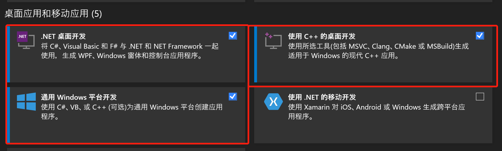
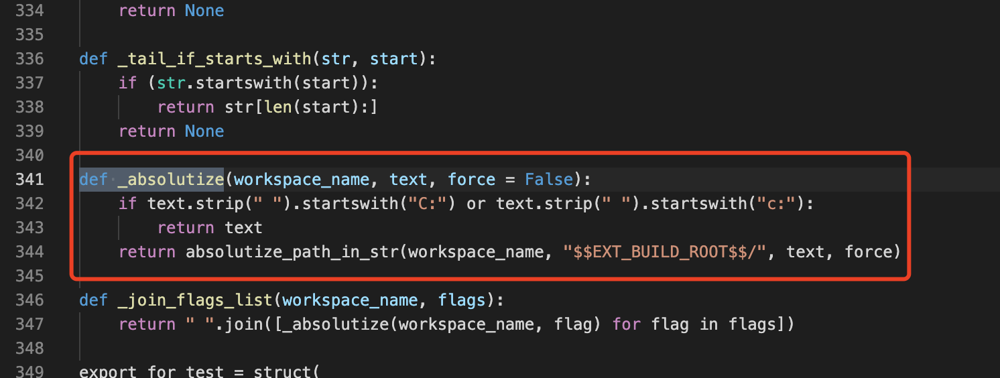
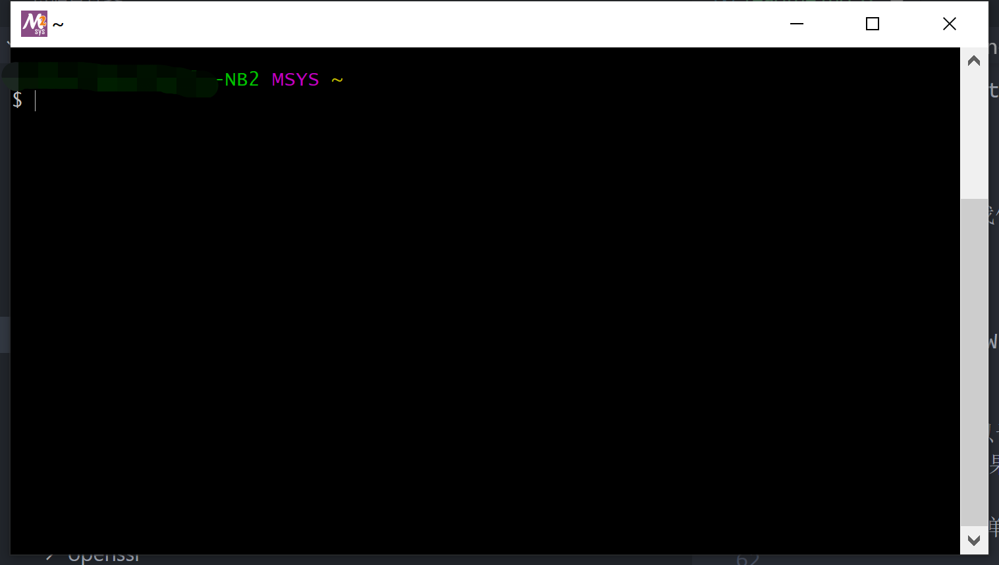
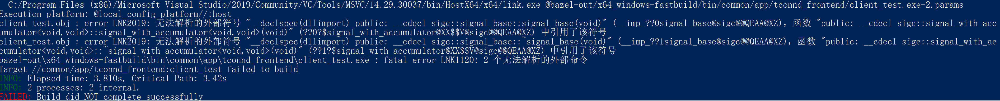

# Bazel C++ Compile In Windows

## Overview

本文主要是讨论 Bazel 中在 Windows 下进行相关的编译，例如：

- 我们需要下载和安装哪些依赖
- 在 C++ 代码中如何去区分当前是否为 Windows 环境
- 在 Bazel 中又如何区分当前是否为 Windows 环境
- 链接失败应该注意什么，如何使用符号表解决链接问题

本文后面提到的命令行执行环境如非特别说明，否则均是指的 powershell。

## Installation

我们 Windows 下使用 Bazel 需要做什么安装其实在 Bazel 的文档中已经介绍过了：[Installing Bazel on Windows](https://docs.bazel.build/versions/main/install-windows.html)。

这里挑几个重要的地方阐述。

### Bazelisk

我们决定通过 bazelisk 来使用 Bazel，这种方式可以根据当前工程的 bazel 版本来下载对应的 bazel 进行编译，这样我们就可以忽略 bazel 版本对我们带来的影响。

安装 bazelisk 比较好的方式是使用 go 语言，因此我们首先需要安装 go 语言，最新版本即可。

接着，我们可以安装 bazelisk 了，直接在 powershell 中输入命令即可：

```sh
go get github.com/bazelbuild/bazelisk
```

也有其他的 bazelisk 安装方式，请参考：[Installing Bazel using Bazelisk](https://docs.bazel.build/versions/main/install-bazelisk.html)。

### MSVC

我们为了在 Windows 下编译和链接 C++ 代码，需要使用 MSVC。

我们选择 Visual Studio 2019，并开始安装，安装器可以很方便根据自己的使用场景进行安装，我们核心需要安装这三个：



我们需要选择 Visual Studio 2019 的安装目录为 C 盘。

**注意：**

- Visual Studio 2019 安装到 C 目录并非是 Bazel 所引入的问题，而是为了编译 CMAKE 工程引入了非官方规则 `rules_foreign_cc` 所导致的。该规则中如果编译器位于非 C 目录，可能导致 CMAKE 的相关的路径错误。

  

安装好 Visual Studio 2019 后，就已经可以使用 Bazel 来编译符合 C++ 语言标准的代码了，Bazel 会自己寻找当前可用的代码编译器和链接器。


除了 MSVC 外，我们也可以选择其他 C++ 平台下的编译器，但是个人不推荐，配置和使用起来更加麻烦。

### MSYS2

MSYS2 并非是在 Windows 下编译 C++ 必须要安装的，但为了 Bazel 可以更好的编译 C++，避免一些 Bash 脚本所导致的问题，我们需要安装它。

MSYS2 的安装可以让 Windows 可以支持 Bash 脚本的运行，这一点其实比较重要，因为 bazel 会生成一些 shell 脚本，并通过 shell 脚本做一些构造，如果 Windows 不支持 Bash 脚本，则无法实现一些 Bazel 的功能，导致某些工程无法编译成功。

安装 MYSY2 是简单的，请直接参考其官网的安装过程：[MSYS2](https://www.msys2.org/)。

安装了 MYSY2 后，我们的 Windows 就拥有了 Bash 运行环境，原生是一个黑框：



我们可以在 mysy2 的命令窗口中使用 bazel 进行编译，但是这并不方便，因为我们还是使用 Powershell 比较多，而且 Powershell 的窗口也更好看一些。

为了在 Powershell 支持 bash，我们需要配置 mysy2 的环境变量 PATH：

```text
<MSYS2_INSTALL_PATH>/usr/bin
```

将上述路径配置到 Windows 的环境变量 PATH 中即可。

在安装了 MYSY2 后，我们可以下载常用的 MYSY2 包，这是一些 Bazel 可能会用到的命令：

```sh
pacman -S zip unzip patch diffutils git
```

## Code

我们在 C++ 代码中应该如何做才能正常的编译呢？

### Predefined Macros

我们在代码层面，通常会区分不同的平台，以支持在多个平台上的编译，我们为了区分 Linux 平台和 Windows 平台通常会使用预定义宏 `_WIN32`，该值为 1 时代表 Windows 平台，为 0 代表非 Windows 平台。

我们来看看更多的关于 `_WIN32` 的细节，该预定义宏并非是 Windows 给与的，而是 MSVC 编译器给与的，请参考：[MSVC Predefined macros](https://docs.microsoft.com/en-us/cpp/preprocessor/predefined-macros?view=msvc-160)。

虽然名为 WIN32，但即便是在 Windows 上用 MSVC 进行 x64 编译，该预定义宏仍然为 1。

如果想单独区分 x64，则可以使用 _WIN64 预定义宏。

MSVC 文档中对 _WIN32 的描述：

> _WIN32 Defined as 1 when the compilation target is 32-bit ARM, 64-bit ARM, x86, or x64. Otherwise, undefined.

MSVC 文档中对 _WIN64 的描述：

> _WIN64 Defined as 1 when the compilation target is 64-bit ARM or x64. Otherwise, undefined.

除了平台外，我们可能还会根据 MSVC 版本进行特定的操作，这时，我们可以使用 `_MSC_VER` 宏定义头：

> _MSC_VER Defined as an integer literal that encodes the major and minor number elements of the compiler's version number.

例如：

- Visual Studio 2015 (14.0) 的 _MSC_VER 为 1900
- Visual Studio 2019 version 16.8, 16.9 的 _MSC_VER 为 1928

### Pragma Comment

通过 MSVC 提供的注解，我们可以在链接期间做更多的事情，我们最重要的事情之一就是添加搜索的库，例如这将添加一个 emapi 库:

```cpp
#pragma comment(lib, "emapi")
```

## Bazel

## Link

在 Windows 编程中，有很多问题可能导致 lib 库链接失败，包括但不局限于以下几种：

- 工程使用的 Debug/Relase 版本和 lib 库的不匹配。
- 工程使用的 x86/64 和 lib 库的不匹配。
- 工程使用的多线程库和 lib 库的不匹配。

## More

这里会阐述我在编译 C++ 代码时遇到的更匪夷所思的问题。

### TGCPAPI

TGCPAPI 是我们 TConnd 内部的一个库，即便我们使用了正确的 lib 版本进行编译，仍然会存在以下链接问题：

```sh
libtgcpapi.lib(cryptlib.obj) : error LNK2001: 无法解析的外部符号 __imp_RegisterEventSourceW
libtgcpapi.lib(cryptlib.obj) : error LNK2001: 无法解析的外部符号 __imp_GetUserObjectInformationW
libtgcpapi.lib(cryptlib.obj) : error LNK2001: 无法解析的外部符号 __imp_MessageBoxW
libtgcpapi.lib(cryptlib.obj) : error LNK2001: 无法解析的外部符号 __imp___iob_func
libtgcpapi.lib(cryptlib.obj) : error LNK2001: 无法解析的外部符号 __imp_GetDesktopWindow
libtgcpapi.lib(cryptlib.obj) : error LNK2001: 无法解析的外部符号 __imp_DeregisterEventSource
libtgcpapi.lib(cryptlib.obj) : error LNK2001: 无法解析的外部符号 __imp__vsnwprintf
libtgcpapi.lib(cryptlib.obj) : error LNK2001: 无法解析的外部符号 __imp_GetProcessWindowStation
libtgcpapi.lib(cryptlib.obj) : error LNK2001: 无法解析的外部符号 __imp_vfprintf
libtgcpapi.lib(cryptlib.obj) : error LNK2001: 无法解析的外部符号 __imp_ReportEventW
```

这是因为我们没有导入会使用的库，我们通过 `#pragma comment()` 来进行导入，我们只需要在 cpp 中导入即可：

```cpp
#ifdef _WIN32
// tgcpapi lib 依赖了叫老版本的接口，但是这些接口已经被新版本的 msvc 废弃
// 为了保持兼容性，msvc 提供了 legacy_stdio_definitions.lib 由开发者显式引入
#pragma comment(lib, "legacy_stdio_definitions.lib")
#pragma comment(lib, "user32.lib")
#pragma comment(lib, "advapi32.lib")

// 这个库是为了支持 WinSocket
#pragma comment(lib, "ws2_32.lib")
#endif /* _WIN32 */
```

加入了上述库后，仍然存在一个问题：

```sh
libtgcpapi.lib(cryptlib.obj) : error LNK2001: 无法解析的外部符号 __imp___iob_func
```

这是因为早期 MSVC 的标准输入标准输出依赖了 __imp___iob_func，但是现在的版本中却没有这个，因此老版本 MSVC 编译的 lib 但凡使用了标准输入输出都会存在这个问题。该问题在这里有所讨论：[unresolved external symbol __imp__fprintf and __imp____iob_func, SDL2](https://stackoverflow.com/questions/30412951/unresolved-external-symbol-imp-fprintf-and-imp-iob-func-sdl2)。

解决方法：

```cpp
#ifdef _WIN32
#pragma comment(lib, "legacy_stdio_definitions.lib")
#pragma comment(lib, "user32.lib")
#pragma comment(lib, "advapi32.lib")
#pragma comment(lib, "ws2_32.lib")

#  if _MSC_VER >= 1900
FILE _iob[] = {*stdin, *stdout, *stderr};
extern "C" FILE* __cdecl __iob_func(void) { return _iob; }
#  endif /* _MSC_VER>=1900 */
#endif /* _WIN32 */
```

### sigc++

[sigc++](https://github.com/libsigcplusplus/libsigcplusplus) 是一个轻量的 Github 开源项目，用以提供方便的回调，我的项目中使用到 sigc++ 提供的发布订阅模式。

sigc++ 是一个 CMAKE 工程，如何在 Bazel 中编译一个 CMAKE 工程不在本文的介绍范畴中。

使用 sigc++ 的核心问题是，当我们编译 sigc++ 库后，进行链接，会报链接失败：



可以看到这是因为链接 sigc lib 时，lib 中的方法被声明为了 dll，可是我们编译明明是用的 lib 呀。

我们可以看到，所有的 sigc 方法都受到了 SIGC_API 这一宏的影响，而 SIGC_API 的取值来自于 SIGC_DLL 宏：在 SIGC_DLL 为 1 时， SIGC_API 会使用 dll 声明。

这一影响可以在 [sigc++config.h.cmake](https://github.com/libsigcplusplus/libsigcplusplus/blob/master/sigc%2B%2Bconfig.h.cmake) 中看到：

```h
#ifdef SIGC_DLL
# if defined(SIGC_BUILD) && defined(_WINDLL)
#  define SIGC_API __declspec(dllexport)
# elif !defined(SIGC_BUILD)
#  define SIGC_API __declspec(dllimport)
# else
#  define SIGC_API
# endif
#else /* !SIGC_DLL */
# define SIGC_API
#endif /* !SIGC_DLL */
```

但是令人匪夷所思的是，sigc 认为 WIN32 & MSVC 编译时，均认为属于 SIGC_DLL：

```h
#ifdef _WIN32
# if defined(_MSC_VER)
#  define SIGC_MSC 1
#  define SIGC_WIN32 1
#  define SIGC_DLL 1
```

为了避免这个问题，我们在 Bazel 编译时给 sigc 打了一个 patch，将 SIGC_API 强行删除 dll 声明：

```patch
-#ifdef SIGC_DLL
-# if defined(SIGC_BUILD) && defined(_WINDLL)
-#  define SIGC_API __declspec(dllexport)
-# elif !defined(SIGC_BUILD)
-#  define SIGC_API __declspec(dllimport)
-# else
-#  define SIGC_API
-# endif
-#else /* !SIGC_DLL */
-# define SIGC_API
-#endif /* !SIGC_DLL */
+//#ifdef SIGC_DLL
+//# if defined(SIGC_BUILD) && defined(_WINDLL)
+//#  define SIGC_API __declspec(dllexport)
+//# elif !defined(SIGC_BUILD)
+//#  define SIGC_API __declspec(dllimport)
+//# else
+//#  define SIGC_API
+//# endif
+//#else /* !SIGC_DLL */
+//# define SIGC_API
+//#endif /* !SIGC_DLL */
+#define SIGC_API
```

问题得以解决。

## References

1. [Installing Bazel on Windows](https://docs.bazel.build/versions/main/install-windows.html)
1. [Using Bazel on Windows](https://docs.bazel.build/versions/main/windows.html)
1. [MSVC Predefined macros](https://docs.microsoft.com/en-us/cpp/preprocessor/predefined-macros?view=msvc-160)
1. [MSYS2](https://www.msys2.org/)
1. [#ifdef 和 #if defined 的差别](https://blog.csdn.net/zhandoushi1982/article/details/5319058)