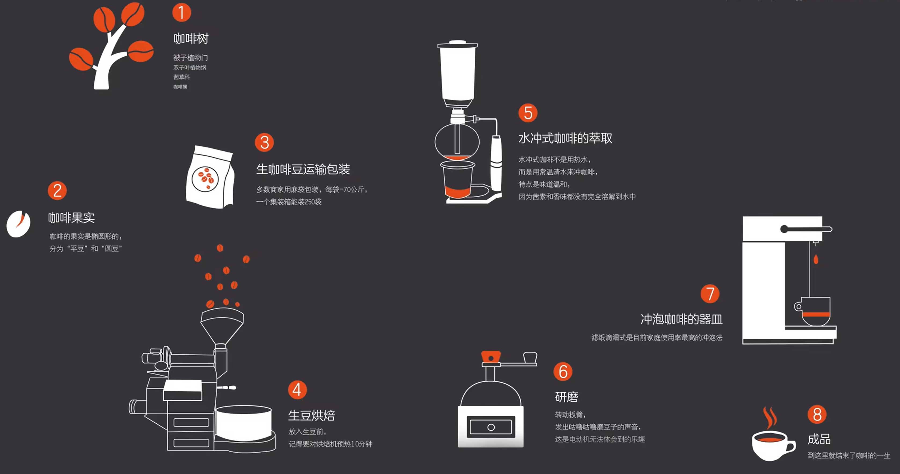

# 咖啡

[TOC]

## 概览

咖啡的一生：

## 萃取

## 意式浓缩

类似鸡尾酒以烈酒作为基酒配置各类酒类饮品一样，意式可以以咖啡作为基地，通过不同的手法和材料，调制出不同类型的咖啡味饮品。

### 咖啡基底

鸡尾酒的基酒多种多样，咖啡的基底也不是多变的，这些基底广义上都可以称为意式浓缩，但是狭义上他们又是有区别的。

基底 | 中文 | 描述 | 粉水比 | 特点 | 可配置饮品
-|-|-|-|-|-
Espresso | 意式浓缩 | 标准的意式浓缩，通常我们说的意式浓缩就是指的这个 ESP。| 1:2 | 口味丰富 | 美式咖啡、拿铁咖啡、卡布奇诺
Ristretto | 高浓度意式浓缩（短萃） | 相比于 ESP 浓度更高。| 1:1 | 浓度高易分层，味道醇厚，口味单一 | 澳白、Dirty（方便分层）
Lungo | 低浓度意识浓缩（长萃）| 相比于 ESP 浓度低。| 1:3 - 1:4 | 清淡，易入口，风味层次感更多 | -
Doppio | 双份 ESP | 其实就是 ESP，但是量更多 | - | - | -

**注意：**

- 上表中的粉水比并不是非常权威的，主要是参考了一些咖啡教程。
- 无论是 ESP 还是 Ristretto 或是 Lungo，都不代表过度萃取或者过少萃取。

> Ristretto, normale, and lungo are relative terms without exact measurements.Nevertheless, a rough guide is a brewing ratio grounds-to-liquid of 1:1 for ristretto, 1:2 for normale, and 1:3–1:4 for lungo.

## 手冲

## 参考

1. [零基础咖啡课程](https://www.bilibili.com/video/BV1d64y127EC)
1. [咖啡豆怎么选？](https://www.bilibili.com/video/BV1QQ4y1Q7qD)
1. [你清楚 ESPRESSO、RISTRETTO、LUNGO、DOPPIO、AMERICANO 的區別嗎？](https://caffes.me/2018/03/23/%E4%BD%A0%E6%B8%85%E6%A5%9Aespresso%E3%80%81ristretto%E3%80%81lungo%E3%80%81doppio%E3%80%81americano%E7%9A%84%E5%8D%80%E5%88%A5%E5%97%8E%EF%BC%9F/)
1. [Wiki Ristretto](https://en.wikipedia.org/wiki/Ristretto)
1. [Wiki Lungo](https://en.wikipedia.org/wiki/Lungo)
1. [Wiki Doppio](https://en.wikipedia.org/wiki/Doppio)
