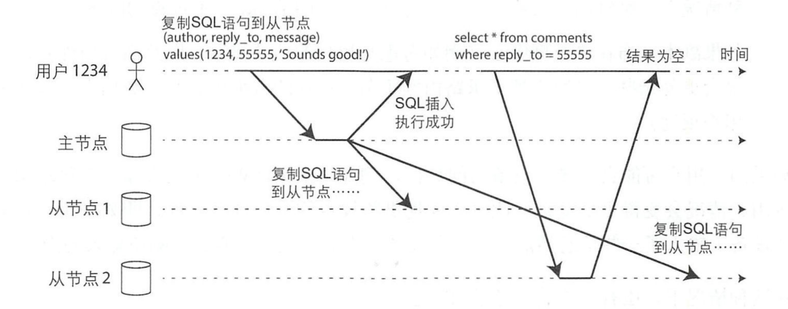

# Data Replication

[TOC]

## 概览

数据复制的目的：

- 使数据在地理位置上更接近用户。
- 部分组件故障，系统依然可以继续工作，提高可用性。
- 扩展堕胎机器以同时提供数据访问服务，提高读吞吐量。

Data Replication 的挑战都在于处理持续变更的数据。

这里会讨论三种 Data Replication 场景：

- 主从复制
- 多主节点复制
- 无主节点复制

## 主从复制

主从复制区分了主节点与从节点：

- 指定某一节点为`主节点`，客户写数据时，必须将写请求发送给主节点，主节点将新数据写入本地存储。
- 其他节点为`从节点`，主节点把数据写入本地存储后，会将数据变更发送给所有从节点。
- 客户读取数据时，可以从主节点和从节点读取。

**注意：**

- 从节点不接受写操作。
- 主节点、从节点在很多地方也被称为主副本、从副本。


### 同步复制与异步复制

通常情况下，主节点向从节点同步数据会非常快，但是并没有保证一定会在多长时间内复制完成，因此衍生出来了两种复制方式：

- 同步复制：主节点复制数据时，需要等待从节点确认。
- 异步复制：主节点复制数据时，不用等待从节点确认。

同步复制的缺点是，如果同步从节点无法完成确认，则写入不能成功，阻塞其后所有写操作，直到同步完成。

**注意：**

- 同步复制的问题远不止如此，例如有的更新成功，有的还未更新，或者更新失败，这存在不一致的情况，需要小心处理。

实践中，只会有一个从节点开启同步复制，其他从节点使用异步复制，这也叫做半同步：


### 处理节点失效

系统中的任何节点，都可能因为故障或维护导致终端甚至停机。

我们需要减少节点中断带来的影响：

**从节点失效：追赶式恢复**

从节点恢复比较容易，追赶主节点的复制的数据即可。

**主节点失效：节点切换**

主节点故障的处理：

- 选择某个从节点提升为主节点
- 客户端更新主节点的目标
- 其他节点要接受新的主节点变更数据

主节点故障可以进行手动切换，也可以采用自动方式：

1. 确认主节点失效
1. 选取新的主节点
1. 重新配置系统使新的主节点生效

但是这种方式存在很多变数：

- 如果是异步复制，在失效前，新主节点未收到原主节点的所有数据。
- 选举之后，原主节点又重新加入到集群，并向新主节点同步数据，新的主节点可能有冲突的写请求。
- 原主节点未完成的复制写请求就此丢弃，会违背数据更新持久化的承诺。
- 如何决定检测主节点的超时时间。
- ...

目前对于这些问题还没有一个简单有效的解决方法，因此很多团队愿意选择手动方式来切换。

### 复制的实现

通常有三种形式的复制方式：

- 基于语句的复制。
- 基于预写日志传输。
- 基于行的逻辑日志复制（例如 MySQL 的 binlog）。
- 基于触发器的复制。

### 复制滞后问题

复制滞后问题是异步复制所带来的，这里存在三个复制滞后可能出现的问题：

- 读自己的写
- 单调读
- 前缀一致性读

#### 读自己的写

用户写入不久，即查看数据，但是新数据可能还未同步到从节点。

这会导致从用户的角度看，刚刚的写入被误会是丢失了：



为了应对这样的情况，我们需要 `读写一致性`，存在一些可行方案，这些可行方案的根本是：用户访问可能被修改的数据，从主节点读取。

这要求在读数据前，通过某些方式知道内容是否可能会被修改。这里列出几个场景：

- 用户首页信息只能 owner 编辑，因此 owner 的读请求需要到主节点。访客的读请求，到从节点。
- 客户端跟踪最近的更新时间，有两种不同处理方式：
  - 在更新后一分钟之内，客户端都到主节点读取。这要求确保复制延迟小于一分钟。
  - 客户端读请求带上更新时间，系统确保该更新时间的数据已经接收到并生效，否则将请求转移给其他副本处理，或者阻塞等待。
- 跨设备的情况下，很难跟踪更新时间，因此需要考虑共享元数据。


#### 单调读

客户读请求可能会被分配到不同的从节点，但是从节点之间可能并不一致，这就看起来会有数据被 “回滚” 的效果：


为了应对这样的情况，我们要求 `单调读一致性`，避免看到回滚的情况。

实现单调读的方式很简单，我们需要确保一个用户总是从固定的同一副本执行读取。

#### 前缀一致读

前缀一致性读是`分区`主从复制情况下的特殊问题，简单说来：

- 写入操作 A 和 B，具有依赖关系，先 A 再 B。
- A 操作分区 1，B 操作分区 2。
- 分区 1 的从节点接收到 A 的时间为 TIMEa，分区 2 的从节点接收到 B 的时间为 TIMEb。
- 如果 TIMEa 晚于 TIMEb，则观察方可能会先看到 B 操作，后看到 A 操作。

一个简单的示例：


## 多主节点复制

主从复制存在明显的缺点：

- 只有 1 个主节点，写入操作都必须经过主节点，写操作很难水平扩展。

因此提出了多主节点复制，使用的场景：

- 多数据中心
  - 性能：客户端可以就近访问，数据中心异步复制数据。
  - 可用性：每个数据中心独立，主节点挂了后可以暂时用其他的数据中心顶住，故障的数据中心切换主节点后再恢复原数据中心的访问。
  - 网络：通过异步复制数据容忍网络问题。
- 离线客户端操作，设备本身可以看作是一个本地数据库。
- 协作编辑


### 处理写冲突

多主复制的最大难点是如何处理写冲突。


主从复制是不会有这样的问题的，因为：

- 主从复制的写操作都是到主节点，这些操作存在着顺序，也会顺序的同步给从节点。
- 多主复制请求并发的到多个主节点，这些操作是不存在顺序的。

我们有一些收敛方案：

- 每个写入都有一个唯一的 ID，并发冲突时，挑选最高 ID 的写入作为胜利者，其他写入丢弃。
- 每个副本分配一个唯一的 ID，并发冲突时，挑选用最高 ID 的副本数据作为胜利者。
- 以某种方式将这些值合并在一起。
- 保留所有冲突信息，由应用层去解决。

第一个和第二个方式，都会导致数据的丢失，最好还是应用层去解决冲突。

而应用层，可以选择不同的时机解决冲突：

- 在写入时解决
- 在读取时解决

## 无主节点复制

无主节点复制，选择放弃主节点，允许任何副本直接接受来自客户端的写请求。

无主节点的系统中，客户端会向所有的副本进行读写，例如（可能某些节点会失败）：


所有的数据中，都会包含一个版本号 Version，用于确认不同副本中同一个数据的版本谁更新。

### 读写 Quorum

如果有 n 个副本，写入有 w 个节点成功，读取有 r 个节点成功，则只要满足：

```text
w + r > n
```

则读取的节点一定包含最新 Version 的值。

通常会配置 w 和 r 相等，即：`w = r = (n + 1) / 2`。

我们的实现方式是：

- 读取和写入操作总是并行发送到所有的 n 个副本上。
- 参数 w 和 参数 r 只是决定要等待的成功节点数。即有多少个节点成功返回，我们就能判断出结果的正确性。

Quorum 存在着一些局限性：

- 如果某些节点上数据已经写入成功，而其他一些副本发生写入失败，且写入成功的副本数小于 w，这意味着写操作失败。但是读 r 个节点时，可能会读到新版本的数据，读方无法判断新版本的数据到底是不是写成功的。
- 写操作与读操作同时发生，写操作可能尽在一部分副本上完成，读取时返回旧值还是新值是不确定的。
- 两个写操作同时发生，无法明确先后顺序。

### 检测并发写

在无主节点的复制中，若只是单纯的覆盖原有的主键，则可能存在并发冲突，在冲突的情况下可能会导致相同的主键有不同的值分布在各个节点上：


在发生了上图的事件后，对于 X 的取值各节点为：

Node 1 | Node 2 | Node 3
-|-|-
A | B | A

为了实现最终收敛，有两种方式可以参考：

- 最后写入者获胜
- 客户端自定义冲突合并

在开始后面的介绍前，我们先定义一下并发：

- 如果两个操作并不需要意识到对方，我们即可声称它们是并发的。

意识到对方代表有依赖，例如操作 A 是 `int a = 5`, 操作 B 是 `a += 1`，那么操作 A 一定要先于操作 B，那 A 和 B 就不是并发操作。

### 最后写入者获胜

最后写入者获胜（LWW）是一种特殊并且简单的冲突合并方案：副本使用最新值，覆盖并丢弃旧的值。

为了让节点可以知道哪个值更新，可以强制对其排序，方案有很多，一个比较简单的是：

- 为每个写请求附加一个时间戳，节点选择最大时间戳的写请求，丢弃较早时间戳的写入。

这个方案简单且收敛，但是它牺牲了数据持久性作为代价：

- 如果一个主键有多个并发泄，即使这些并发写都想客户端报告成功（因为写入了 w 个副本），但只有最后一个写入值会存活下来。

在缓存系统这样的场景中，覆盖写是可以接受的。如果覆盖、丢失数据不可接受则 LWW 并非是一个好的选择。

### 客户端自定义冲突合并

为了让客户端可以自定义合并，系统需要将每个并发操作都进行记录，并且客户端可以获得系统当前所有发生过的并发操作。

为了简化理解，先看一下单节点怎么做：

- 服务器为每个主键维护一个版本号，每当主键新值写入时，版本号递增，并将新版本好与写入的值绑定在一起。
- 当客户端读取主键时，服务器必须返回所有当前值和最新版本号。
- 客户端写入主键，写请求必须包含之前读到的版本号、读到的新值、新值合并后的集合。写请求也会想读操作易用返回数据。
- 当服务器收到带有特定版本号的写入时，覆盖该版本号或更低版本号的所有值。

整个过程如下面的交互图所示，这里的客户端合并方式是将返回的集合进行合并：


对于多节点的情况，则每个节点都会维护一个这样的版本号。
