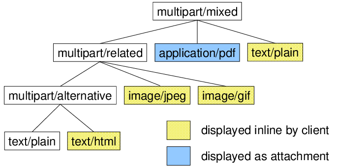
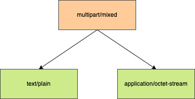
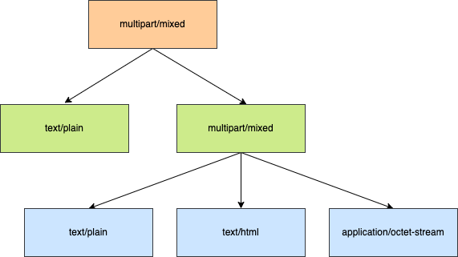

# MIME

<!-- TOC -->

- [MIME](#mime)
    - [Overview](#overview)
    - [MIME Headers](#mime-headers)
        - [MIME-Version](#mime-version)
        - [Content-Type](#content-type)
        - [Content-Disposition](#content-disposition)
        - [Content-Transfer-Encoding](#content-transfer-encoding)
        - [Others](#others)
    - [Header Encoded Word](#header-encoded-word)
    - [Multipart messages](#multipart-messages)
        - [Parts Boundary](#parts-boundary)
        - [Tree Structure](#tree-structure)
        - [Multipart Subtype](#multipart-subtype)
    - [References](#references)

<!-- /TOC -->

## Overview

在早起的邮件传输中（早期邮件消息遵循 [rfc822](https://datatracker.ietf.org/doc/html/rfc822)），只支持 ascii 码，这对多语言、二进制文件传输等带来了一些困难，因此就衍生出来 MIME（多用途互联网邮件扩展协议）：

> Multipurpose Internet Mail Extensions (MIME) is an Internet standard that extends the format of email messages to support text in character sets other than ASCII, as well as attachments of audio, video, images, and application programs.

随着互联网的发展，MIME 已经不再局限于邮件应用，而是已广泛应用于很多互联网场景，例如 [Wiki Mime](https://en.wikipedia.org/wiki/MIME) 中所提到的：

> Although the MIME formalism was designed mainly for SMTP, its content types are also important in other communication protocols. In the HyperText Transfer Protocol (HTTP) for the World Wide Web, servers insert a MIME header field at the beginning of any Web transmission.

MIME 会涉及到较多 RFC，这里列举几个重要的：

RFC | Description
-|-
[rfc2045](https://datatracker.ietf.org/doc/html/rfc2045) | (MIME) Part One: Format of Internet Message Bodies
[rfc2046](https://datatracker.ietf.org/doc/html/rfc2046) | (MIME) Part Two: Media Types
[rfc2047](https://datatracker.ietf.org/doc/html/rfc2047) | (MIME) Part Three: Message Header Extensions for Non-ASCII Text
[rfc2048](https://datatracker.ietf.org/doc/html/rfc2048) | (MIME) Part Four: Registration Procedures
[rfc2049](https://datatracker.ietf.org/doc/html/rfc2048) | (MIME) Part Five: Conformance Criteria and Examples

除此外，还有一些其他辅助型的 RFC，对 MIME 的内容进一步完善，例如 [rfc2183](https://www.ietf.org/rfc/rfc2183.txt)，主要描述 `Content-Disposition` 的使用。

本文会结合 MIME 的 RFC 和 WIKI，对 MIME 进行一些总结和梳理。

## MIME Headers

在早期邮件 [rfc822](https://datatracker.ietf.org/doc/html/rfc822) 协议中，就已经存在 Header 的概念，而 MIME 在此基础上添加了一些新的头部。

这些 MIME Headers 用于描述 MIME Entity 的内容。

### MIME-Version

包含这个头部的邮件消息，表示使用 MIME 格式，并指示其使用的版本：

```mime
MIME-Version: 1.0
```

虽然 MIME 已经有好几个版本了，但是该 Version 始终保持 `1.0`。

其原因根据 MIME 等联合作者 Nathaniel Borenstein 所述：

> The version number was introduced to permit changes to the MIME protocol in subsequent versions. However, Borenstein admitted short-comings in the specification that hindered the implementation of this feature: "We did not adequately specify how to handle a future MIME version. ... So if you write something that knows 1.0, what should you do if you encounter 2.0 or 1.1? I sort of thought it was obvious but it turned out everyone implemented that in different ways. And the result is that it would be just about impossible for the Internet to ever define a 2.0 or a 1.1.

### Content-Type

该 Header 指示了邮件消息所使用的类型，其由类型和子类型组成：

```mime
Content-Type: ${type}/${subtype}
```

例如：

```mime
Content-Type: text/plain
```

对于 Content-Type 的更多信息，请参考 [Media Types](#media-types)。

### Content-Disposition

Content-Disposition 用于指定对应 Part 的展示风格（Presentation Style），一个 Part 有两种展示方式：

- 内联风格（`inline content disposition`），内容再邮件中直接展示 Part。
- 附件风格（`attachment content disposition`），将 Part 显示成附件，需要用户进行某种操作才能打开显示 Part。

除了呈现样式之外，字段 Content-Disposition 还提供用于指定文件名称，创建日期和修改日期的参数。

一个附件类型的 Content Disposition：

```mime
Content-Disposition: attachment; filename=genome.jpeg;
  modification-date="Wed, 12 Feb 1997 16:29:51 -0500";
```

HTTP 中，响应头字段 `Content-Disposition:attachment` 通常用作提示客户端将响应正文作为为可下载文件，其原因就是来自于 MIME 的 `Content-Disposition`。

现在大多数客户端提供了附件预览的能力，即在邮件客户端中对于 `Content-Disposition:attachment` 的 Part 可以进行一定的解析以便预览。那么对于预览这样的能力，客户端是如何决定以什么类型解析 Part 的附件呢？

对于此，客户端如何预览附件并未在 [rfc2183](https://www.ietf.org/rfc/rfc2183.txt) 中明确指出，经个人调研后总结：

- 目前测试市面上常见的客户端，都是以文件名后缀来决定解析方式。
- 特别强调：绝大多数邮件客户端不会根据 `Content-Type` 来预览附件。`Content-Type` 通常指导 `inline` 场景下如何解析内容并显示。

### Content-Transfer-Encoding

Content-Transfer-Encoding 有两个作用：

- 如果需要从二进制转位 ascii 文本，则指示转化方法。以下取值代表需要做转换：
  - `quoted-printable`
  - `base64`
- 提供一些指示性作用。以下取值用于提供指示性作用：
  - `7bit`
  - `8bit`
  - `binary`

不同的 SMTP 服务器会对 Content-Transfer-Encoding 做不同程度的支持：

**对于标准 SMTP 服务器**

Content-Transfer-Encoding | Description
-|-
7bit | 代表内容是字节的序列，并且每个字节的取值范围为 1..127，同时每一行最多只能有 998 个字节，若超过则需要使用 CRCL 进行换行。
quoted-printable | 将任意字节序列编码成满足 7bit 规则的形式，转换方式为 [Quoted-printable](https://en.wikipedia.org/wiki/Quoted-printable)。
base64 | 类似于 quoted-printable，使用 Base64 的方式将任意字节序列编码成满足 7bit 规则的形式。

base64 和 quoted-printable 都比较常用，其中 base64 编码后是完全不可读的。

如果只有少部分字节非 7bit，则推荐使用 `quoted-printable`，因为可读性更好。

**对于支持 8BITMIME 扩展的 SMTP 服务器**

Content-Transfer-Encoding | Description
-|-
8bit | 代表内容是字节的序列，同时每一行最多只能有 998 个字节，若超过则需要使用 CRCL 进行换行。

**对于支持 BINARYMIME 扩展的 SMTP 服务器**

Content-Transfer-Encoding | Description
-|-
binary | 代表内容是字节的序列。

Stackoverflow 有一些关于此的讨论：[Content Transfer Encoding 7bit or 8 bit](https://stackoverflow.com/questions/25710599/content-transfer-encoding-7bit-or-8-bit)。

### Others

这里有个其他的常见的 Headers 列表：

域名 | 含义
-|-
Received | 传输路径
Return-Path | 回复地址
Delivered-To | 发送地址
Reply-To | 回复地址
From | 发件人地址
To | 收件人地址
Cc | 抄送地址
Bcc | 暗送地址
Date | 日期和时间
Subject | 主题
Message-ID | 消息 ID

## Header Encoded Word

在 [RFC 2047](https://tools.ietf.org/html/rfc2047) 中提出了 `MIME encoded-word` 用于针对邮件 Header 的编码。RFC 2047 中提到，对于邮件 Header 中，若存在非 ascii 的数据，则需要使用 `MIME encoded-word` 进行编码。

**注意：**

- RFC 2047 是一个关于 MIME Header 的协议，其全称为：`MIME (Multipurpose Internet Mail Extensions) Part Three: Message Header Extensions for Non-ASCII Text`。

编码的格式为：

```mime
=?${charset}?${encoding}?${encoded text}?=
```

参数 | 描述
-|-
charset | Any character set registered with IANA. Typically it would be the same charset as the message body.
encoding | 将二进制映射成 ascii 的规则。通常有两种取值：<br>`Q`：类似于 quoted-printable encoding；<br>`B`：即 Base64。
encoded text| 编码文本，即二进制数据经过 Q 或者 B 编码后的 ascii 文本。

**注意：**

- 这里编码后的结果不能超过 75 个字符，如果超过 75 个字符，则需要进行换行。

> An encoded-word may not be more than 75 characters long, including charset, encoding, encoded text, and delimiters. If it is desirable to encode more text than will fit in an encoded-word of 75 characters, multiple encoded-words (separated by CRLF SPACE) may be used.

这是来自 [RFC 2047](https://tools.ietf.org/html/rfc2047) 的规定：

> An 'encoded-word' may not be more than 75 characters long, including 'charset', 'encoding', 'encoded-text', and delimiters. If it is desirable to encode more text than will fit in an 'encoded-word' of 75 characters, multiple 'encoded-word's (separated by CRLF SPACE) may be used.

`Q encoding` 和 `quoted-printable encoding` 并不完全一致，这是因为因为编码格式中包含了 `=`、`?` 等符号，因此需要对其进行特殊处理：

特殊符号 | 处理方式
-|-
空格 | 用下划线替代。<br>(ASCII code for space may not be represented directly because it could cause older parsers to split up the encoded word undesirably.)
`=` | 使用 `=` 的 ascii 编码。
`?` | 使用 `?` 的 ascii 编码。

这是一些测试用例：

```mime
# 标题：hello world
# 解释：纯 ascii 字符，不用进行编码
Subject: hello world

# 标题：hello世界
# 解释：使用 GBK 进行编码，再使用 quoted-printable 方式将二进制打印
Subject: =?GBK?Q?hello=CA=C0=BD=E7?=

# 标题：hello你好 hello世界?
# 解释：空格被换成下环线，?会直接使用 ascii 码（0x3F）
Subject: =?GBK?Q?hello=C4=E3=BA=C3_hello=CA=C0=BD=E7=3F?=

# 标题：你好你好你好你好你好你好你好你好你好你好你好你好你好你好你好你好你好你好你好你好你好你好你好12345不看不看不看不看不看不看不看不看不看不看不看不看不看不看
# 解释：为了处理换行，邮箱服务器变成了 Base64 打印
Subject: =?GBK?B?xOO6w8TjusPE47rDxOO6w8TjusPE47rDxOO6w8TjusPE47rDxOM=?=
 =?GBK?B?usPE47rDxOO6w8TjusPE47rDxOO6w8TjusPE47rDxOO6w8TjusPE4w==?=
 =?GBK?B?usPE47rDxOO6w8TjusMxMjM0NbK7v7Syu7+0sru/tLK7v7Q=?=
 =?GBK?B?sru/tLK7v7Syu7+0sru/tLK7v7Syu7+0sru/tLK7v7Syu7+0sru/tA==?=
```

## Multipart messages

Content-Type  的 type 取值为 `multipart` 时，就成为了 Multipart Message。

Multipart Message 将邮件消息划分为多个部分，并且在逻辑上是一种树形的结构，每一个部分都有自己的 Content-Type，如下图所示：



该树的每个节点都是一个 Part，树结构具有以下的特征：

- 叶子节点的 Content-Type 类型不为 `multipart`。
- 非叶子结点的 Content-Type 类型保持为 `multipart`。

### Parts Boundary

Multipart Message 的每个 Part 之间都有分隔符，而分隔符其实就是一个字符串，该字符串在 Content-Type 中指出。例如下面有三个 Part，分隔符为 `frontier`：

```mime
MIME-Version: 1.0
Content-Type: multipart/mixed; boundary=frontier

This is a message with multiple parts in MIME format.
--frontier
Content-Type: text/plain

This is the body of the message.
--frontier
Content-Type: application/octet-stream
Content-Transfer-Encoding: base64

PGh0bWw+CiAgPGhlYWQ+CiAgPC9oZWFkPgogIDxib2R5PgogICAgPHA+VGhpcyBpcyB0aGUg
Ym9keSBvZiB0aGUgbWVzc2FnZS48L3A+CiAgPC9ib2R5Pgo8L2h0bWw+Cg==
--frontier--
```

该 MIME 会形成如下的树结构：



**注意：**

- 在首个 Part 中，其内容会被客户端忽略，对于不支持 MIME 的客户端，会显示该 Part 中的内容。通常固定填入 `This is a message with multiple parts in MIME format.`。
- 因为是通过分隔符来进行划分，因此邮件服务器通常需要确保 Part 的内容中不包含分隔符字符串。
- 分隔符通常会是一个很长的随机字符串。

### Tree Structure

一个 Content-Type 为 multipart 的 Part，后面可以继续跟多个 Part，看起来是一个像数组的平坦结构，那么如何构成树形结构呢？

很简单，其实若其中某个 Part 的 Content-Type 是 multipart 时，那么就会形成嵌套的 multipart，构成多叉树。

这是一个简单的示例：

```mime
MIME-Version: 1.0
Content-Type: multipart/mixed; boundary=frontier-1

This is a message with multiple parts in MIME format.
--frontier-1
Content-Type: text/plain

This is the body of the message.
--frontier-1
Content-Type: multipart/mixed; boundary=frontie-2

--frontier-2
Content-Type: text/plain

This is the body of the message.
--frontier-2
Content-Type: text/html
Content-Transfer-Encoding: base64

PGh0bWw+CiAgPGhlYWQ+CiAgPC9oZWFkPgogIDxib2R5PgogICAgPHA+VGhpcyBpcyB0aGUg
Ym9keSBvZiB0aGUgbWVzc2FnZS48L3A+CiAgPC9ib2R5Pgo8L2h0bWw+Cg==
--frontier-2
Content-Type: application/octet-stream
Content-Transfer-Encoding: base64

PGh0bWw+CiAgPGhlYWQ+CiAgPC9oZWFkPgogIDxib2R5PgogICAgPHA+VGhpcyBpcyB0aGUg
Ym9keSBvZiB0aGUgbWVzc2FnZS48L3A+CiAgPC9ib2R5Pgo8L2h0bWw+Cg==
--frontier-2

--frontier-1
```



### Multipart Subtype

Multipart 的 Content-Type 中，subtype 用于描述多个 Part 之间是什么关系：

```mime
Content-Type: multipart/mixed
```

常用的 subtype 如下表所示：

Subtype | Content-Type | Description
-|-|-
mixed | multipart/mixed | 当每个 Part 的 Content-Type 不相同时，都可以使用 `multipart/mixed`。
digest | multipart/digest | 是一种发送多条短信的简单方法。每个 Part 的默认 Content-Type 是 `message/rfc822`。
alternative | multipart/alternative | 表示每个部分都是相同内容的不同表示方式，它们之间可以相互替代。通常用作兼容性考虑，方便客户端选择自己可以理解的内容进行展示。
related | multipart/related | A multipart/related is used to indicate that each message part is a component of an aggregate whole.
report | multipart/report | 用户服务读取的数据。要求有两个 Part，一个是 `text/plain` 或其他易读的 Content-Type，另一个是 `message/delivery-status`。
signed | multipart/signed | 用于附加消息的签名。要求有两个 Part，一个是消息部分，一个是签名部分。<br>签名 Part 的 Content-Type 可能是 `application/pgp-signature` 或 `application/pkcs7-signature`。
encrypted | multipart/encrypted | 用于传输加密信息。要求有两个 Part，第一个 Part 解密所需要的控制信息，第二个部分是加密 Part。<br>第一个 Part 的 Content-Type 可能是 `application/pgp-encrypted` 或 `application/pkcs7-mime`。
form-data | multipart/form-data | 用于表示通过表单提交的值，在 Web 的场景中较为常见。
x-mixed-replace | multipart/x-mixed-replace | 是 HTTP 服务器推送技术的一部分，每个 Part 都具有相同的语义。当接收到一个 Part，应立即代替之前的 Part。<br>Clients should process the individual parts as soon as they arrive and should not wait for the whole message to finish.
byterange | multipart/byterange | 用于单个消息的非连续字节传输，常用于 HTTP 的场景中。

`multipart/alternative` 为 Client 提供的 Part，其推荐顺序是递增的（即高优先级的排在最后）。对于 `multipart/alternative` 的常见实践：

> Most commonly, multipart/alternative is used for email with two parts, one plain text (text/plain) and one HTML (text/html). The plain text part provides backwards compatibility while the HTML part allows use of formatting and hyperlinks. Most email clients offer a user option to prefer plain text over HTML; this is an example of how local factors may affect how an application chooses which "best" part of the message to display.

## References

1. [rfc2047](https://tools.ietf.org/html/rfc2047)
1. [rfc2183](https://www.ietf.org/rfc/rfc2183.txt)
1. [MIME 笔记](http://www.ruanyifeng.com/blog/2008/06/mime.html)
1. [WIKI MIME](https://en.wikipedia.org/wiki/MIME)
1. [通过 SMTP 方式发送带附件的邮件](https://support.i-search.com.cn/article/1570617194335)
1. [邮件 MIME 格式](https://www.cnblogs.com/crystalray/articles/3302427.html)
1. [Content Transfer Encoding 7bit or 8 bit](https://stackoverflow.com/questions/25710599/content-transfer-encoding-7bit-or-8-bit)
