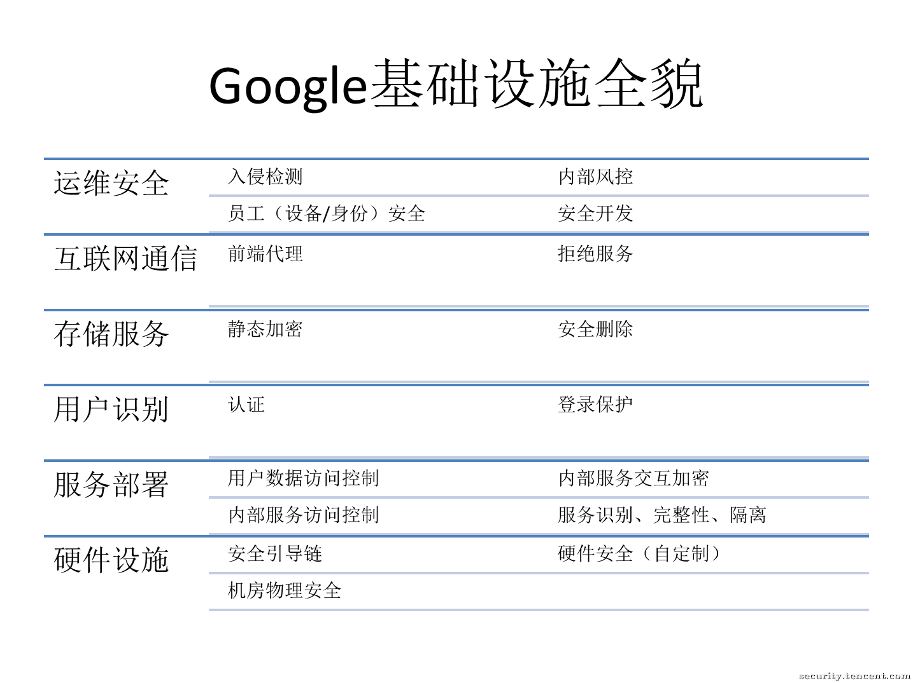

# Google 基础架构安全设计指南

[TOC]

## 概览

- Google 拥有全球规模的安全基础设施，可以处理全生命周期的安全能力，包括；
  - 安全的发布
  - 用户隐私保护
  - 数据安全存储
  - 服务之间（内部）的安全交互
  - 互联网通信安全
  - 运维安全
- Google 自身的服务使用了这些基础安全架构，包括：
  - Google 搜索引擎，Gmail 等 2C 业务
  - Google Cloud 等 2B 业务。
- 这套基础设施从数据中心的物理安全开始，自底向上，逐层涵盖硬件、软件、操作规范等方面。
- Google 投入了大量资源保护这些安全设施，包括大量的资金和工程师。

Google 基础架构安全纵深防御：

## 底层基础设施安全

基础设施安全主要包括：机房的物理安全，安全定制加固过的硬件，底层的软件引导栈。

### 机房物理安全

Google 自己设计数据中心，在数据中心里包含了多级的安全保护措施，并限制了只有`非常少的 Google 员工`才有权限访问。包括：

- 生物识别
- 金属探测
- 监控摄像头
- 路障
- 激光检测

通过各种安全措施确保可以接触自己服务器的人是可信的。

### 硬件安全

所有的服务器主板、网络设备都由 Google 自行设计。

Google 谨慎的选择每一个组件的供应商，精心挑选组件，并且和供应商一起审计、确认该组件所提供的安全属性是符合要求的。

Google 还自行设计芯片，包括一个硬件的安全芯片，该芯片被部署在服务器以及外围设备上，用于在硬件层面识别合法的 Google 自有设备。

### 安全加固与机器身份识别

Google 服务器使用多种技术来确保运行的软件引导栈是合法受信的。

我们使用加密签名的方式，对底层组件，诸如 BIOS、bootloader、内核、操作系统镜像进行签名。这些签名在每一次启动、更新的时候会被校验。而每一个上述组件都是完全由 Google 控制的（Google自行构建、加固），每一代硬件都会提升和加强安全能力。

数据中心里的每一台服务器都有它独特定制的身份标识（与硬件信任根绑定）。这个标识在底层的服务管理 API 调用中，会被用作源和目标的鉴权依据。

## 服务部署安全

“服务” 指的是由开发者编写的，运行在我们的基础设施上的应用程序，例如：Gmail 的 SMTP 服务程序、BigTable 存储服务程序、YouTube 视频转码程序。

们可能会在数千台机器运行相同的的副本。这些服务都运行在一个叫做 Borg 的集群调度系统上（也是 Google 的基础设施之一）。

如上所述，基础设施并没有赋予服务和服务之间任何的信任。

### 服务标识、完整性、隔离性

Google 内部的服务之间，仍然使用加密认证和授权机制来保障安全。在管理员和服务易于理解的前提下，提供了很强的访问控制能力。

- 服务标识：

每一个运行服务都拥有一个服务标识。向其它服务发起 RPC 调用或者接收 RPC 返回信息的时候，需要提供基于这个标识的加密凭据。这些标识对于 client 端来说，可以确保和自己通信的远程服务端是可信的，对于 server 端而言，则可用来限制仅有受信的 client 才能发起请求，或者只能访问特定的方法。

- 隔离性：

在同一台服务器上运行多个服务的时候，我们用了很多隔离和沙箱技术，来保护它们之间互不干扰。这些技术包括普通的 Linux 用户空间、语言和基于内核的沙箱以及硬件的虚拟化。

对于特别敏感的服务，例如集群管理、密钥管理服务，我们也会专机专用，作为额外的一层加固手段。

### 服务间访问管理

服务的负责人可以使用基础设施特别提供的访问控制管理功能，精确的限制哪些服务可以和自己的服务进行通信。例如，让特定的 API 只能被白名单范围的服务访问，只要配置白名单服务的标识，基础设施就会自动实现这些功能。

Google 的工程师访问这些服务，也同样需要独立的身份标识，做类似的配置，基础设施就可以自动实现对特定的人允许或者拒绝访问的能力。

所有这些身份标识（机器、服务、员工）都在一个全局的命名空间里，由基础设施进行维护。本文的后续部分会进一步解释，普通用户的凭据会有单独的处理方式。

### 服务间访问加密

基础设施在网络上提供了隐私加密能力和 RPC 数据的完整性保护能力。

从本质上来说，RPC 这样的机制给了应用层天然的隔离防御能力，并抛弃了对网络信道的安全依赖。内部服务之间的通讯加密，可以在网络被中间人劫持，或者网络设备被攻陷的时候，仍然是安全的。

每一个 RPC 的加密级别是可配置的：

- 对低敏感、低价值的数据，可以选择在机房内部通讯的时候，仅仅做完整性的检查。
- 为了对抗高级别的攻击方（比如有能力在公网上监听Google流量和隐私的对手），基础设施在所有跨机房的网络流量上，强制加密通讯。

### 终端用户数据的访问管理

服务间鉴权是不够的，因为 A 服务可以访问 B 服务的所有终端用户数据。这是一个例子：

用户在使用 Gmail 服务的时候，会跟联系人服务产生交互，以便访问这个用户的地址簿，获得所有联系人。所以 Contacts Service 会配置为仅 Gmail Service 服务。

但是，这仍然是一个非常宽松的权限管理级别，在此状态下，Gmail Service 可以随时请求任意用户的全部联系人数据。

所以，当 Gmail 发起 RPC 请求到 Contacts（联系人），要求查询某个特定的终端用户的数据时，基础设施要求 Gmail 出示终端用户权限票据（end user permission ticket），作为 RPC 请求的一部分。

该票据证明了 Gmail 正在为某个特定的终端用户提供服务，也确保了 Contacts（联系人）服务只会为合法票据所代表的用户提供对应数据的安全能力。

## 数据存储安全

现在开始讨论我们如何在基础设施上实现数据存储的安全。

### 静态加密

Google 的基础设施提供了多种存储服务，类似于 BigTable 和 Spanner，以及特定的密钥管理服务。

多数 Google 的应用不直接访问物理存储，而是通过存储服务替代。存储服务在实际写入物理硬盘之前，可以被配置为使用密钥（从特定的密钥管理服务中获取）完成加密数据。

密钥管理服务支持自动轮换，提供精确的审计日志，并且与前面提到的权限票据关联到特定的用户。

### 数据删除

在 Google，数据的删除通常是打上一个删除标记，表示该数据“即将被删除”，而不是真正的移除数据实体。

这允许我们有机会从不小心的删除误操作中恢复数据，不管用户发起的还是由于 bug 导致的。当数据被标记为“即将被删除”后，这个数据会被按服务预先配置的策略进行处理。

当一个终端用户删除了他的帐号实体，基础设施会通知服务处理该请求，找出该帐号关联的相关数据进行移除。

## Intelnet 通信安全

基础架构由许多通过 LAN 和 WAN 互连的物理机器组成。服务间通信的安全性不依赖于网络安全。

但是，我们将基础架构从互联网隔离到专用 IP 地址空间。我们只会将部分机器直接暴露给外部互联网流量，从而可以实现额外的保护，例如防御拒绝服务 (DoS) 攻击。

### Google 前端服务

当一个服务希望把自己提供给 Internet 访问时，它得去基础设施的 GFE（Google Front End）上进行注册。

GFE 确保所有的终端与自己的连接都正确的使用了 TLS 连接，用了正确的证书，并且遵循正确的安全策略。GFE 还提供了拒绝服务防御能力（后文会讨论）。GFE 收到互联网的请求后，通过前面介绍过的 RPC 安全协议转发到内部。

### 拒绝服务防御

从规模和体量上来说，Google 比较容易化解拒绝服务攻击。我们有多层级联的拒绝服务防御手段，以缓解或者阻止拒绝服务对 GFE 后方的服务的风险。

## 用户认证

下一层防御来自我们的中央认证服务。

这个服务对于终端用户而言，通常展现为登录页面。

除了询问简单的用户名和密码，该服务也会智能的根据用户的其它信息（比如是否从一个已知的安全设备、历史相似登录地点），判断风险等级并对应的做出风险控制的挑战确认。

通过鉴定后，认证服务会派发一个认证凭据（比如cookies、OAuth Token）以便后续的请求携带。

用户也可以在登录时选择类似于OTP或者防钓鱼的安全证书服务做二次验证。为了把这些安全能力提供给Google以外的公司，我们还跟 FIDO（安全密码联盟）共同协定了 U2F（通用二次认证）开放标准。

现在这些设备也可以在市场上买到，并且主流的 web 站点也跟随我们实现了对 U2F 的支持。

## 运维安全

怎么安全的写出基础设施软件，怎么保护雇员的机器和认证凭据，以及如何从内部和外部对抗基础设施的威胁。

### 安全开发

- 中央源代码控制
- 双人 review 机制
- 安全漏洞提供库和框架
- 代码扫描工具
- 开源 bug 解决，和开源引入的限制

### 保护雇员设备和认证凭据的安全

针对 Google 员工的高端复杂钓鱼攻击总是持续不断，为了对抗这种攻击，Google 强制员工帐号 OTP 口令认证方式更换成了支持 U2F 的安全密钥。

### 内部风控

我们严格限制并严密监控那些被赋予了基础设施管理员权限的Google员工。持续的评估一些特殊任务所需要的最小权限，鼓励自动化的安全可控的方式来完成工作。

这些手段包：

- 括双人审批机制。
- 在 debug 时使用受限的（脱敏的）API接口。

Google雇员访问终端用户的信息会被基础设施底层的Hook记录日志，安全团队据此监控异常数据，并对可疑的问题展开调查。

### 入侵检测

Google拥有成熟的数据处理管道，可以很好的集成每一台设备的主机、网络、服务的检测日志。

内置在这些管道上的安全策略会及时的向运维安全人员发出告警。

Google 的应急响应团队实施365天24小时的全天候待命。同时，Google 内部也经常实施红蓝军对抗，以不断的衡量和提高检测能力。

## 参考文献

1. [Google 基础设施安全设计概述翻译和导读](https://security.tencent.com/index.php/blog/msg/114)