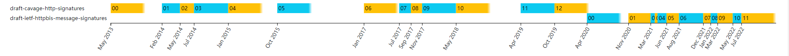

# Signing HTTP Messages

<!-- TOC -->

- [Signing HTTP Messages](#signing-http-messages)
    - [开始](#开始)
    - [概览](#概览)
        - [HTTP 请求中使用签名](#http-请求中使用签名)
        - [HTTP 响应中使用签名](#http-响应中使用签名)
    - [Signature 的组成](#signature-的组成)
        - [签名参数](#签名参数)
        - [签名字符串构造](#签名字符串构造)
        - [创建签名](#创建签名)
        - [验证签名](#验证签名)
    - ["Authorization" 方案](#authorization-方案)
        - [Authorization Header](#authorization-header)
            - [失败响应](#失败响应)
            - [RSA 示例](#rsa-示例)
            - [HMAC 示例](#hmac-示例)
    - ["Signature" 方案](#signature-方案)
        - [Signature 头部](#signature-头部)

<!-- /TOC -->

## 开始

本文参考于 [draft-cavage-http-signatures-12](https://datatracker.ietf.org/doc/html/draft-cavage-http-signatures-12)。

这是一份已经过期的 HTTP 签名方案草案，当前最新的草案是：[draft-ietf-httpbis-message-signatures-11](https://greenbytes.de/tech/webdav/draft-ietf-httpbis-message-signatures-11.html)。

这是一个发展的版本历史：



之所以写这篇记录，主要是感觉早期的 HTTP 签名方案更简单，也顺便了解下演变的历史。

HTTP 消息签名，使用 HTTP 协议通过 Internet 进行通信时，可能需要服务器或客户端对特定消息的发送者进行身份验证。

同时还可能希望确保消息在传输过程中不被篡改。 

本文档描述了服务器和客户端使用数字签名同时向 HTTP 消息添加身份验证和消息完整性的方法。

**注意：**

- 本文的规范整体而言不算太完善，甚至都没有讨论“安全考虑”，也没有随机字符串用于防重放。

## 概览

目前的一些身份验证和安全方案：

- HTTP 身份验证（HTTP Authentication）定义了基本和摘要身份验证机制。
- TLS 1.2 定义了加密的强传输层安全性。
- OAuth2.0 为 Web 服务请求的授权提供了一个完备的方案。

这些方法中的每一种都在当今的 Internet 上采用，具有不同程度的保护。但是，这些方案都没有设计为对 HTTP 消息本身进行加密签名，这是确保端到端消息完整性所必需的。

一些 Web 服务提供商已经发明了他们自己的 HTTP 消息签名方案，但迄今为止，还没有一个被标准化。

尽管该提案中没有任何技术比现有技术更新颖，但标准化一种简单且强大的机制以对 HTTP 消息进行数字签名是有用的。本规范介绍了两种具有不同目的的机制：

1. "Signature" 方案，为了让发送者断言所发消息内容是正确的，并且传输过程中没有任何变更（完整性）。任何阅读消息的一方，都能够独立确认消息签名的有效性。此方案与客户端/服务器方向无关，可用于验证 HTTP 请求、HTTP 响应。
1. "Authorization" 方案，发送者通过证明他们拥有某个密钥，以此来证明自己的身份，并访问一个或多个资源。该方案允许使用对称密钥、非对称密钥来实现。

很明显，"Authorization" 方案用于身份验证过程，而不是直接用于消息签名，消息签名只是身份验证的手段。因此 Authorization 标头通常由 HTTP 客户端生成，并由 HTTP 服务器验证。

### HTTP 请求中使用签名

数字签名被广泛用于提供身份验证和完整性保证，而无需共享密钥。

它们也不需要往返来验证客户端，并允许独立于传输（例如 TLS）验证消息的完整性。

### HTTP 响应中使用签名

HTTP 消息在通过 Internet 的基础设施时经常被更改，这些变更可能是温和。

但也因此，网关和代理出于操作原因添加、删除和更改标头，因此发送者不能依赖接收者准确接收传输的消息。

通过允许发送者对指定的头部进行签名，接收者或中间系统可以确认发送者的原始意图被保留，并且包括摘要头部也可以验证消息体没有被修改。

这使任何接收者都可以轻松地确认发件人的身份以及任何改变消息内容或含义的偶然或恶意更改（HTTP 响应，就是 Server 发送，Client 接收）。

## Signature 的组成

签名参数是非常重要的，整个 Signature 头部就是由多个签名参数组成的：

```txt
对于 "Signature" 方案：
Signature: [签名参数1]="[签名参数1值]",[签名参数2]="[签名参数2值]",[签名参数3]="[签名参数3值]"

对于 "Authorization" 方案：
Authorization: Signature [签名参数1]="[签名参数1值]",[签名参数2]="[签名参数2值]",[签名参数3]="[签名参数3值]"
```

例如：

```txt
对于 "Signature" 方案：
Signature: keyId="rsa-key-1",algorithm="hs2019",headers="(request-target) (created) host digest content-length"

对于 "Authorization" 方案：
Authorization: Signature keyId="rsa-key-1",algorithm="hs2019",headers="(request-target) (created) host digest content-length"
```

### 签名参数

签名的参数个数是有限的，当前规范规定了下述签名参数：

签名参数 | 态度 | 描述 | 示例
-|-|-|-
keyId | REQUIRED | `keyId` 字段是一个不透明的字符串，服务器可以使用它来查找验证签名所需的密钥数据。<br>同时该字段需要关联密钥元数据，例如加密算法。 | rsa-key-1
signature | REQUIRED | `signature` 参数是一个 base 64 编码的数字签名。 | Base64(HMAC-SHA512(signing string))
algorithm | RECOMMENDED | `algorithm` 参数用于指定签名字符串的构造机制。 | hs2019
created | RECOMMENDED | `created` 字段表示签名的创建时间。 该值必须是 Unix 时间戳整数值。 | 1402170695
expires | OPTIONAL | `expires` 字段表示签名何时不再有效。 该值必须是 Unix 时间戳整数值。 | 1402170695
headers | OPTIONAL | `headers` 参数用于指定生成消息签名时包含的 HTTP 标头列表。 | (request-target) (created) host date

**注意：**

- 对于 `algorithm` 字段，更多只是一种声明和可读性的方便，实现者应该从 `keyId` 标识的密钥元数据而不是从该字段中导出实现使用的数字签名算法。如果提供了`algorithm` 并且与 `keyId` 标识的密钥元数据不同，那么实现必须认为这是错误。这是因为可能会有黑客通过 `algorithm` 来启用有漏洞的算法。
- 对于 `headers` 字段
  - 如果指定，它的取值应该是一个小写的、带引号的 HTTP 标头字段列表，由单个空格字符分隔。
  - 顺序很重要，影响了以什么顺序来构造签名字符串。
  - `headers` 字段至少应该包括一个 HTTP Header，避免构造的签名字符串为空。
  - `headers` 虽然标识的是 OPTIONAL，但是其值是不能为空的，因此这里我理解应该是指的可以有默认值，默认值是什么又系统建设者确定。

### 签名字符串构造

HTTP 消息需要在通过网关、代理和其他实体的传输过程中可能存在一些微不足道的更改，同时这些变化通常没有什么后果，也常常对发送者或接收者不可见或无法检测到。

因此，简单地对发送者传输的整个消息进行签名是不可行的：即使是非常小的更改也会导致无法验证的签名。系统的可用性将会非常低。

为了解决该问题，该规范允许发送者通过将它们的名称包含在 `headers` 签名参数中来选择哪些标题是有意义的。然后使用此参数中出现的标头构造中间签名字符串。

这里，客户端必须使用 `headers` 签名参数中的每个 HTTP Headers 值，按照它们出现在 `headers` 签名参数中的顺序来构造签名字符串。

当然，headers 可以包含一些非 HTTP 头部的特殊信息。具体规则如下：

- 对于 headers 中使用 `(request-target)` 字段，生成 `[METHOD] [PATH]` 的字符串。
- 对于 headers 中使用 `(created)` 字段，采用签名的创建时间，即签名参数 `created` 所表示的值。
  - 如果指定了 `algorithm` 签名参数为 `rsa`、`hmac` 或 `ecdsa` 开头，则实现必须产生错误。
  - 如果未指定 `created` 签名参数，或者不是整数，则实现必须产生错误（当然，如果没有使用 `(created)`，那么没有带 created 签名参数，也不是错误）。
- 对于 headers 中使用 `(expired)` 字段，采用签名的过期时间，即签名参数 `expired` 所表示的值。
  - 如果指定了 `algorithm` 签名参数为 `rsa`、`hmac` 或 `ecdsa` 开头，则实现必须产生错误。
  - 如果未指定 `expired` 签名参数，或者不是整数，则实现必须产生错误。
- 针对 headers 中的每一项，需要创建一个 headers 字符串值，形如：`[header-item-name]: [header-item-value]`。如：`(created): 1402170695`、`host: example.org`。
  - 如果有多个相同的 header，那么这些 header 的值应该连接起来，并用 `, ` 分隔。
  - 如果 headers 中的一项是空字符串，那么该 header 格式应为：`[header-item-name]: `。
  - 不得对标头字段值进行任何其他修改。

为阐述上述规则，这里假设 `header` 签名参数取值为：

```txt
(request-target) (created) host date cache-control x-emptyheader x-example
```

同时，假设 HTTP 请求为：

```http
GET /foo HTTP/1.1
Host: example.org
Date: Tue, 07 Jun 2014 20:51:35 GMT
X-Example: Example header
    with some whitespace.
X-EmptyHeader:
Cache-Control: max-age=60
Cache-Control: must-revalidate
```

对于上述的 HTTP 请求，签名字符串是：

```txt
(request-target): get /foo
(created): 1402170695
host: example.org
date: Tue, 07 Jun 2014 20:51:35 GMT
cache-control: max-age=60, must-revalidate
x-emptyheader:
x-example: Example header with some whitespace.
```

### 创建签名

为了创建签名，客户端必须：

1. 使用 `headers` 和 `algorithm` 值以及 HTTP 消息的内容，创建签名字符串。
1. 使用与 `keyId` 关联的密钥在签名字符串上生成数字签名。
1. `signature` 然后由 base64 编码生成数字签名算法的输出（上一步的输出）。

### 验证签名

验证者自己构造签名进行比对。

## "Authorization" 方案

"Authorization" 方案，即签名认证方案，该方案中，客户端需要使用数字签名认证自己的身份，其中的数字签名使用对称密钥（例如：HMAC）或非对称私钥（例如：RSA）来生成。

该方案充分参数化，因此不绑定特定的密钥类型或签名算法。

### Authorization Header

客户端会发送 Authorization 头部，首先看一下 Authorization 头部的组成（参考 [Hypertext Transfer Protocol (HTTP/1.1): Authentication](https://datatracker.ietf.org/doc/html/rfc7235#section-4.1)）：

```txt
Authorization: [auth-scheme] [auth-param]
```

其中 `auth-scheme` 取值为 `Signature`，同时 `auth-param` 取值为签名参数。

本节其余部分使用下面这个 HTTP 氢气作为示例：

```http
 POST /foo HTTP/1.1
Host: example.org
Date: Tue, 07 Jun 2014 20:51:35 GMT
Content-Type: application/json
Digest: SHA-256=X48E9qOokqqrvdts8nOJRJN3OWDUoyWxBf7kbu9DBPE=
Content-Length: 18

{"hello": "world"}
```

**注意：**

- Digest 是 HTTP Body 的消息摘要，方便结合本文的签名方案来保障 HTTP Body 的完整性。
- 以下部分还假设客户端声明的 keyId="rsa-key-1" 是对服务器有意义的标识符。

#### 失败响应

当通过签名保护资源时，服务器可以通过错误响应客户端。

要启动此过程，服务器将返回客户端 401 响应代码对自己进行身份验证。

服务器可以选择通过在 `WWW-Authenticate` 标头中指定 `headers` 参数来指定它期望签名的 HTTP 标头。 例如：

```http
HTTP/1.1 401 Unauthorized
Date: Thu, 08 Jun 2014 18:32:30 GMT
Content-Length: 1234
Content-Type: text/html
WWW-Authenticate: Signature realm="Example",headers="(request-target) (created)"

...
```

#### RSA 示例

要进行签名，我们需要通过 headers 签名参数来确定哪些进行签名，这里示例为：

```txt
headers="(request-target) (created) host digest content-length"
```

客户端将会构造这样的签名字符串（依据 headers 参数）：

```txt
(request-target): post /foo
(created): 1402174295
host: example.org
digest: SHA-256=X48E9qOokqqrvdts8nOJRJN3OWDUoyWxBf7kbu9DBPE=
content-length: 18
```

Authorization HTTP 头部的最终结果如下：

```http
Authorization: Signature keyId="rsa-key-1",algorithm="hs2019",headers="(request-target) (created) host digest content-length",signature="Base64(RSA-SHA512(signing string))"
```

#### HMAC 示例

要进行签名，我们需要通过 headers 签名参数来确定哪些进行签名，这里示例为：

```txt
headers="(request-target) (created) host digest content-length"
```

```txt
(request-target): post /foo
(created): 1402174295
host: example.org
digest: SHA-256=X48E9qOokqqrvdts8nOJRJN3OWDUoyWxBf7kbu9DBPE=
content-length: 18
```

Authorization HTTP 头部的最终结果如下：

```http
Authorization: Signature keyId="hmac-key-1",algorithm="hs2019",headers="(request-target) (created) host digest content-length",signature="Base64(HMAC-SHA512(signing string))"
```

## "Signature" 方案

"Signature" HTTP 标头，提供了一种将 HTTP 消息标头关联到数字签名的机制。通过使用 "Digest" HTTP 标头，也可以将 HTTP 消息正文关联到数字签名。

签名的生成和校验可以使用共享密钥，或公私钥，同时允许接收方或任何中间系统校验消息的完整性。

### Signature 头部

发送者期望使用 HTTP 头部进行签名的传输，其中：

- `field-name` 为 Signature。
- `field-value` 为签名参数。

这是一个 HTTP 请求示例：

```http
POST /foo HTTP/1.1
Host: example.org
Date: Tue, 07 Jun 2014 20:51:35 GMT
Content-Type: application/json
Digest: SHA-256=X48E9qOokqqrvdts8nOJRJN3OWDUoyWxBf7kbu9DBPE=
Content-Length: 18

{"hello": "world"}
```

同时，假设签名参数 headers 的取值为：

```txt
headers="(request-target) (created) host date digest content-length"
```

RSA 签名的 Signature 头部为：

```txt
Signature: keyId="rsa-key-1",algorithm="hs2019",created=1402170695,headers="(request-target) (created) host date digest content-length",signature="Base64(RSA-SHA256(signing string))"
```

HMAC 签名的 Signature 头部为：

```txt
Signature: keyId="hmac-key-1",algorithm="hs2019",created=1402170695,headers="(request-target) (created) host digest content-length",signature="Base64(HMAC-SHA512(signing string))"
```
