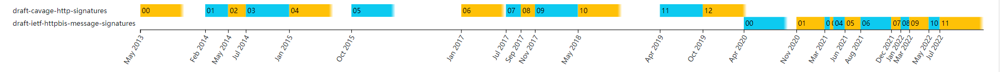

# HTTP 消息签名

<!-- TOC -->

- [HTTP 消息签名](#http-消息签名)
    - [开始之前](#开始之前)
    - [概览](#概览)
    - [HTTP 消息组件](#http-消息组件)
        - [HTTP 字段](#http-字段)
        - [派生组件](#派生组件)
            - [@signature-params](#signature-params)
            - [@method](#method)
            - [@target-uri](#target-uri)
            - [@authority](#authority)
            - [@scheme](#scheme)
            - [@request-target](#request-target)
            - [@path](#path)
            - [@query](#query)
            - [@query-param](#query-param)
            - [@status](#status)
        - [创建签名基](#创建签名基)
    - [安全考虑](#安全考虑)

<!-- /TOC -->

## 开始之前

不同的平台对开发者提供 HTTP API 时，通常会有不同的认证方式，签名方式是其中一种。

之所以想记录一下消息签名呢，是为了方便自己在做相关 HTTP 请求的认证设计时，可以将 RFC 的标准作为参考（虽然还只是 draft）。

首先，当前的 HTTP 签名方案并未完成标准化，而是出于草案状态，同时早期的 HTTP 签名草案其实叫做：[draft-cavage-http-signatures](https://datatracker.ietf.org/doc/html/draft-cavage-http-signatures-12)。

这是一个发展的版本历史：



这里 cavage 其实是早期草案的作者名称，目前从命名上可以看出，IETF 已经将签名方案逐步标准化，目测在不远的未来将形成最终 RFC。

## 概览

本文主要参考了 [draft-ietf-httpbis-message-signatures-11](https://greenbytes.de/tech/webdav/draft-ietf-httpbis-message-signatures-11.html)，这是一篇 RFC Draft，主要提供了 HTTP 消息上进行创建、编码和验证数字签名（消息认证码）的机制：

> This document describes a mechanism for creating, encoding, and verifying digital signatures or message authentication codes over components of an HTTP message.

安全的两个重要属性：

- 完整性：数据未经授权不能进行改变的特性（即一致性）。
- 真实性：请求数据源真实性（即身份认证）。

**注意：**

- 安全的属性除此外其实还有抗抵赖性、机密性等，这里在本文的 HTTP 签名中暂未提现。

应用程序开发人员通常会选择通过 TLS 来保证这些属性，但是：

- TLS 并非端到端，而是点到点。端到端可能会有多多段 TLS，或者有 TLS 转成普通 TCP。
- 某些操作环节并不允许 TLS。

本文档提供了一种机制，该机制可以提供端到端的 HTTP 消息组件的完整性和真实性，同时该机制允许只对重要的消息组件进行保障。

> This document defines a mechanism for providing end-to-end integrity and authenticity for components of an HTTP message. The mechanism allows applications to create digital signatures or message authentication codes (MACs) over only the components of the message that are meaningful and appropriate for the application.

本文的术语：

术语 | 英文 | 描述 | 示例
-|-|-|-
HTTP 消息组件 | HTTP Message Component | 能够被 HTTP 消息签名覆盖的 HTTP 消息的一部分。| -
派生组件 | Derived Component | 通过使用指定的算法或过程从 HTTP 消息派生的 HTTP 消息组件。| @query, @method
HTTP 消息组件名称 | HTTP Message Component Name | 标识 HTTP 消息组件源的字符串。| -
HTTP 消息组件标识符 | HTTP Message Component Identifier | - | -
HTTP 消息组件值 | HTTP Message Component Value | - | -
涵盖的组件 | Covered Components | - | -
签名基 | Signature Base | 签名者和验证者使用涵盖的组件和 HTTP 消息所生产的字节序列。<br>这些字节序列本质就是待签名串，将交给签名算法处理。 | "@method": POST<br>"@path": /foo
- | HTTP Message Signature Algorithm | - | -
密钥材料 | Key Material | 创建或验证签名所需的密钥材料。密钥材料通常用明确的密钥标识符标识，允许签名者向验证者指示使用了哪个密钥。 | -

## HTTP 消息组件

### HTTP 字段

HTTP 字段（HTTP Fields）。

HTTP 字段的组件名词，是该字段的小写形式：

- content-type
- date
- tag

这是一个 HTTP 消息片段示例（HTTP Header 非规范值）：

```http
Host: www.example.com
Date: Tue, 20 Apr 2021 02:07:56 GMT
X-OWS-Header:   Leading and trailing whitespace.
X-Obs-Fold-Header: Obsolete
    line folding.
Cache-Control: max-age=60
Cache-Control:    must-revalidate
Example-Dict:  a=1,    b=2;x=1;y=2,   c=(a   b   c)
```

下面是 HTTP Header 的规范化值示例：

```txt
"host": www.example.com
"date": Tue, 20 Apr 2021 02:07:56 GMT
"x-ows-header": Leading and trailing whitespace.
"x-obs-fold-header": Obsolete line folding.
"cache-control": max-age=60, must-revalidate
"example-dict": a=1,    b=2;x=1;y=2,   c=(a   b   c)
```

同时，允许使用空的 HTTP Header（`\` 在 RFC 8792 中代表的是换行）：

```http
X-Empty-Header: \
```

序列化后：

```txt
NOTE: '\' line wrapping per RFC 8792

"x-empty-header": \
```

**注意：**

- 这里使用 [RFC 8792](https://www.rfc-editor.org/rfc/rfc8792.html#name-the-single-backslash-strate) 中的换行算法显示这些内容，因为文档格式的限制会从文中去自动除尾随空格，所以加了个 `\` 作占位。

### 派生组件

除了 HTTP 字段之外，还有许多不同的组件可以从控制数据、处理上下文或正在签名的 HTTP 消息的其他方面派生。

派生组件名称必须以 `@` 字符开头，这是为了和 HTTP 字段名称区分开来。

本规范定义了以下派生组件：

派生组件 | 描述
-|-
@signature-params | 此签名的签名元数据参数。
@method | HTTP 请求的 Method。
@target-uri | 请求的完整目标 URI
@authority | -
@scheme | 请求 URI 的 scheme
@request-target | 请求目标。
@path | 请求的目标 URI 的绝对路径部分。
@query | 请求的目标 URI 的查询部分。
@query-param | 请求的目标 URI 的已解析查询参数。
@status | 响应的状态码。

#### @signature-params

该组件提供有关签名生成和验证的信息，包括有序的覆盖组件集和有序的参数集，包括：

- 签名创建的时间戳
- 验证密钥材料的标识符
- 其他实用信息

该组件需要出现在签名基的最后一行，这是规范所固定的。

签名参数组件，本质上就是提供或指明哪些信息需要进行签名，以保护这些信息的真实性、完整性。因此，签名参数组件的值，其实就是指出相关的组件，以及签名参数，例如包括：

- created：创建时间为整数 UNIX 时间戳值。推荐包含此参数。
- expires：作为整数 UNIX 时间戳值的过期时间。
- nonce：为此签名生成的随机唯一值，作为字符串值。
- alg：来自 HTTP 消息签名算法注册表的 HTTP 消息签名算法，作为字符串值。
- keyid：作为字符串值的密钥材料的标识符。

这是一个该组件值的示例：

```txt
("@target-uri" "@authority" "date" "cache-control");keyid="test-key-rsa-pss";alg="rsa-pss-sha512";created=1618884475;expires=1618884775
```

签名基为：

```txt
"@signature-params": ("@target-uri" "@authority" "date" "cache-control");keyid="test-key-rsa-pss";alg="rsa-pss-sha512";created=1618884475;expires=1618884775
```

#### @method

@method 派生组件指的是请求消息的 HTTP 方法。该组件的取值即为 HTTP 请求的 METHOD 的字符串值。

**注意：**

- 根据 [HTTP] 的第 9.1 节，方法名称区分大小写，并且常规标准化的方法名称是大写的 US-ASCII。

例如下面的请求示例：

```http
POST /path?param=value HTTP/1.1
Host: www.example.com
```

该派生组件取值为：

```txt
POST
```

Signature base line:

```txt
"@method": POST
```

#### @target-uri

@target-uri 派生组件指的是请求消息的目标 URI。组件值是请求的完整绝对目标 URI，可能由所有可用部分组装而成，包括 Authority 和请求 Target。

例如下述的 HTTP 请求：

```http
POST /path?param=value HTTP/1.1
Host: www.example.com
```

该示例的 @target-uri 派生组件取值为：

```txt
https://www.example.com/path?param=value
```

Signature base line:

```txt
"@target-uri": https://www.example.com/path?param=value
```

**注意：**

- 这是一个 URI 的组成：

  ```txt
  URI = scheme:[//authority]path[?query][#fragment]
  ```

#### @authority

@authority 派生组件是指 HTTP 请求消息的目标 URI 的 Authority 组件。

HTTP 中通常使用 [Host 标头](https://developer.mozilla.org/zh-CN/docs/Web/HTTP/Headers/Host) 来传达（Host 标头基本等价于 authority 的含义），而在 HTTP 2 和 HTTP 3 中，它使用 `:authority` 标头来传达。

例如下述的 HTTP 请求：

```http
POST /path?param=value HTTP/1.1
Host: www.example.com
```

该示例的 @authority 派生组件取值为：

```txt
www.example.com
```

Signature base line:

```txt
"@authority": www.example.com
```

**注意：**

- authority 的组成：

  ```txt
  authority = [userinfo@]host[:port]
  ```

- 还需要注意，上面的 "host" 不是 Host 的含义，请参考 [Host](https://www.rfc-editor.org/rfc/rfc2616#section-14.23)。

#### @scheme

@scheme 派生组件指的是 HTTP 请求消息的目标 URL 的 scheme。

例如下述的 HTTP 请求：

```http
POST /path?param=value HTTP/1.1
Host: www.example.com
```

该示例的 @scheme 派生组件取值为：

```txt
http
```

Signature base line:

```txt
"@scheme": http
```

#### @request-target

#### @path

@path 派生组件指的是 HTTP 请求消息的 Path 组件。

例如下述的 HTTP 请求：

```http
POST /path?param=value HTTP/1.1
Host: www.example.com
```

该示例的 @path 派生组件取值为：

```txt
/path
```

Signature base line:

```txt
"@path": /path
```

#### @query

@query 派生组件是指 HTTP 请求消息的 Query 组件，包括前导符 `?`。

例如下述的 HTTP 请求：

```http
POST /path?param=value&foo=bar&baz=batman HTTP/1.1
Host: www.example.com
```

该示例的 @query 派生组件取值为：

```txt
?param=value&foo=bar&baz=batman
```

Signature base line:

```txt
"@query": ?param=value&foo=bar&baz=batman
```

另外一个 HTTP 请求示例：

```http
POST /path?queryString HTTP/1.1
Host: www.example.com
```

该示例的 @query 派生组件取值为：

```txt
?queryString
```

Signature base line:

```txt
"@query": ?queryString
```

如果消息中没有查询字符串，则该组件的取值为 `?`：

```txt
"@query": ?
```

#### @query-param

@query-param 派生组件允许对单个查询参数进行获取。

一个 HTTP 请求示例：

```http
POST /path?param=value&foo=bar&baz=batman&qux= HTTP/1.1
Host: www.example.com
```

该派生组件的签名基：

```txt
"@query-param";name="baz": batman
"@query-param";name="qux": 
"@query-param";name="param": value
```

如果一个参数名称在请求中出现多次，则该名称的所有参数值必须按照参数在目标 URI 中出现的顺序包含在单独的签名基中。

通常建议使用 @query，而非使用 @query-param。

#### @status

### 创建签名基

签名基（Signature base），是一个 US-ASCII 字符串，其中包含签名所涵盖的规范化 HTTP 消息组件。

签名基会创建签名算法的输入（其本质就是待签名原串）。

这是一个非规范示例：

```http
POST /foo?param=Value&Pet=dog HTTP/1.1
Host: example.com
Date: Tue, 20 Apr 2021 02:07:55 GMT
Content-Type: application/json
Content-Digest: sha-512=:WZDPaVn/7XgHaAy8pmojAkGWoRx2UFChF41A2svX+TaPm+AbwAgBWnrIiYllu7BNNyealdVLvRwEmTHWXvJwew==:
Content-Length: 18

{"hello": "world"}
```

带有这些消息的签名基如下所示：

```txt
"@method": POST
"@authority": example.com
"@path": /foo
"content-digest": sha-512=:WZDPaVn/7XgHaAy8pmojAkGWoRx2UFChF41A2svX+TaPm+AbwAgBWnrIiYllu7BNNyealdVLvRwEmTHWXvJwew==:
"content-length": 18
"content-type": application/json
"@signature-params": ("@method" "@authority" "@path" "content-digest" "content-length" "content-type");created=1618884473;keyid="test-key-rsa-pss"
```

## 安全考虑
