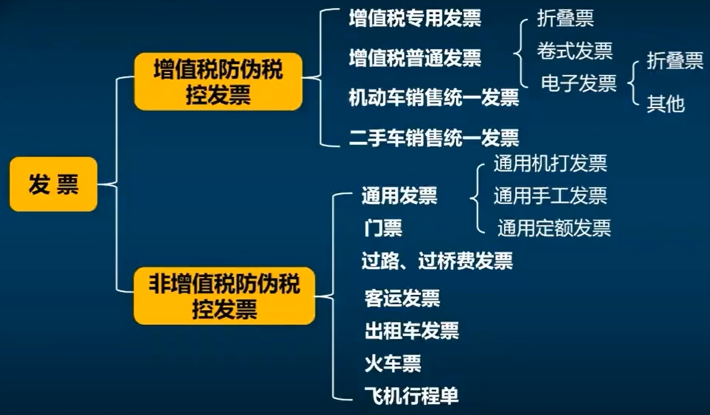

# 发票基础知识

<!-- TOC -->

- [发票基础知识](#发票基础知识)
  - [概述](#概述)
  - [发票的作用](#发票的作用)
  - [如何开具一张发票？](#如何开具一张发票)
  - [发票的联次](#发票的联次)
  - [发票种类](#发票种类)
    - [增值税专用发票](#增值税专用发票)
    - [增值税普通发票（折叠票）](#增值税普通发票折叠票)
    - [增值税普通发票（卷票）](#增值税普通发票卷票)
    - [增值税普通发票（电子发票）](#增值税普通发票电子发票)
    - [其他发票](#其他发票)
    - [通用定额发票](#通用定额发票)
  - [发票内容](#发票内容)
    - [发票章印](#发票章印)
  - [如何开具发票](#如何开具发票)
  - [如何废弃发票](#如何废弃发票)
  - [专票和普票的区别](#专票和普票的区别)
  - [增值税防伪税控新系统](#增值税防伪税控新系统)
  - [FAQ](#faq)
  - [附录：参考文献](#附录参考文献)

<!-- /TOC -->

## 概述

虽然当前电子发票已经越来越流行，但是本文并不局限于电子发票，而是面向整个发票业务的系统性梳理。

什么是发票？可以简单理解为发票就是交易的凭证，参考 [发票办理指南](http://shanghai.chinatax.gov.cn/bsfw/bszn/znfpbl/201911/t448996.html)：

> 发票是指在购销商品、提供或接受服务以及从事其他经营活动中，开具、收取的收付款凭证。

这是一张发票样图：

随着数字化和现代化的发展，已经从纸质发票进化出了电子发票：

> 电子发票具有与纸质发票同等的法律效力，并将在全国推行增值税电子普通发票。

在当前，现在电子发票进一步数字化，税务总局已经提出了`全电发票`：

> 全电发票，目前主要包括电子发票（增值税专用发票）、电子发票（普通发票），是全面数字化的发票，是与纸质发票具有同等法律效力的全新发票，不以纸质形式存在、不用介质支撑、不需申请领用。

电子发票是当前税局的重点发展目标，是在不断发展和变化中的，在撰写本文时全面数字化的电子发票的工作已经在逐步展开（[关于开展全面数字化的电子发票试点工作的公告](http://shanghai.chinatax.gov.cn/zcfw/zcfgk/swzsgl/202111/t461197.html)）。

## 发票的作用

## 如何开具一张发票？

## 发票的联次

一次交易产生的发票，我们称为**一份**发票，一份发票包含多个`联次`，每个联次为**一张**。

什么是发票的联次，为什么要区分发票的联次呢？

增值税电子普通发票只有一联，既可以作为发票联，也可以作为记账联使用。

**注意：**

- 联次本身就是为了方便一份发票的各方进行使用，使用电子发票已经拜托了纸质的限制，各方都可以直接使用，所以就不用再分联次了。

## 发票种类



**注意：**

- 非增值税防伪税控系统，并不是指 “非增值税” 发票，而是指的使用其他专业软件开具，而非使用 “增值税防伪税控系统”。

### 增值税专用发票

### 增值税普通发票（折叠票）

### 增值税普通发票（卷票）

### 增值税普通发票（电子发票）

### 其他发票

### 通用定额发票

手撕发票，开票快。

## 发票内容

### 发票章印

## 如何开具发票

## 如何废弃发票

冲红（负数开票）

## 专票和普票的区别

不管是专票还是普票，对于`开票方（销售方）`并没有什么区别，都是为了确认后入、结转成本、计算增值税。

专票和普票的区分，主要是对于`受票方（购买方）`身份来说的。

首先让我们搞清楚一般纳税人应纳增值税额，参考 [中华人民共和国增值税暂行条例](http://www.chinatax.gov.cn/n810341/n810765/n812171/n812680/c1190937/content.html)：

```txt
一般纳税人增值税额 = 当期应纳税额 - 进项税额
```

## 增值税防伪税控新系统

商户需要开发票，就需要使用税控系统，该系统有两个公司提供：

- 航天公司
- 百望公司

他们提供的开票能力是一样的，服务费也是一样的。他们会提供两个东西：

- 税务开票软件
- 税控盘（航天公司提供是白盘，百望公司提供的是黑盘）

电脑上下载一个软件，再向电脑插入税控盘（金税盘、税控盘、UKey）。

## FAQ

1. 一共有哪些发票？
1. 不同发票的作用，为什么要这个发票？
1. 发票历史发展？
1. 发票上的内容，章印的含义（发票监制章，发票专用章）
1. 发票和增值税的关系
1. 什么发票能够抵扣，什么不能抵扣，抵扣到底是抵扣啥
1. 专票和普票的区别
1. 销项税额、进项税额

## 附录：参考文献

1. [国家税务总局增值税发票查验平台](https://inv-veri.chinatax.gov.cn/)
1. [发票种类](https://inv-veri.chinatax.gov.cn/fpcs/fpzl.html)
1. [发票版式](https://inv-veri.chinatax.gov.cn/fpcs/fpbs.html)
1. [总局的税务辅导视频](https://12366.chinatax.gov.cn/nsrxt/videoondemand/main)
1. [中华人民共和国增值税暂行条例](http://www.chinatax.gov.cn/n810341/n810765/n812171/n812680/c1190937/content.html)
1. [关于增值税抵扣，所有抵扣方式全方面梳理](https://new.qq.com/omn/20201120/20201120A06O8700.html)
1. [关于开展全面数字化的电子发票试点工作的公告](http://shanghai.chinatax.gov.cn/zcfw/zcfgk/swzsgl/202111/t461197.html)
1. [电子发票在公司平台系统与税控开票系统中交互的产品思考](http://www.woshipm.com/pd/3452043.html)
