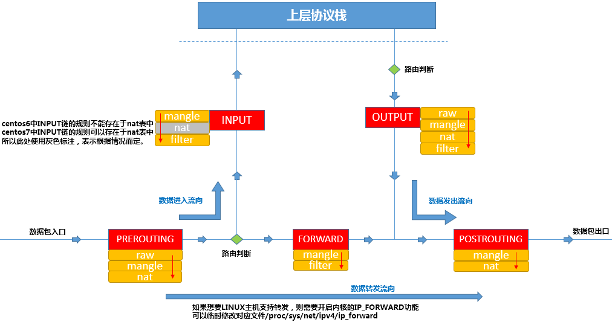
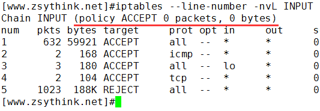
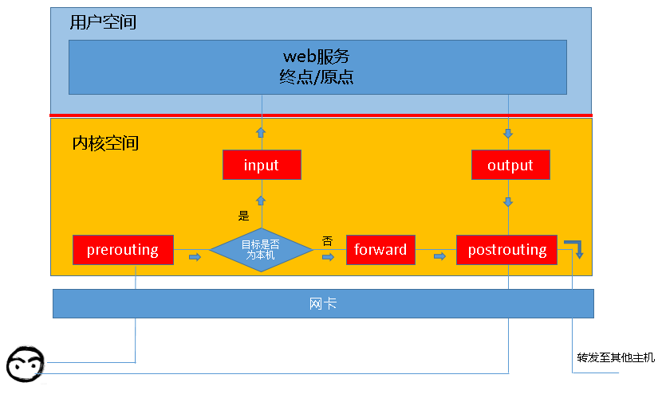

# IPtables 速记

[TOC]

## 概述

本文主要参考了 [iptables 详解](https://www.zsythink.net/archives/category/%e8%bf%90%e7%bb%b4%e7%9b%b8%e5%85%b3/iptables)，便于快速回忆，以及相关命令的使用。


IPTables 是 Linux 提供的一种包过滤机制，对网卡数据包进行路由、转发、拒绝等。

IPTables 主要分为两个部分：

- netfilter，是实际进行包过滤的内核进程。
- iptables，是对 netfilter 包过滤规则进行管理、配置的客户端程序。

为了方便，我们通常将 netfilter/iptables 统称为 iptables。

## 速记

为了方便快速回忆概念和操作，先给出常用的概念和相关命令。



### iptables 查询

```sh
# 列出指定 table 、指定 chain 的规则
# 若省略 chain 则列出所有 chain 指定 table 的规则
# 若省略 table 则默认为 filters
$ iptables -t [<table>] -L [<chain>]

# 查看详细信息
$ iptables -t [<table>] -vL [<chain>]

# 【推荐】不进行 ip 反查（性能更高）
$ iptables -t [<table>] -nvL [<chain>]

# 【推荐】可以打印规则编号
$ iptables -t [<table>] -nvL [<chain>] --line

# 可以显示更具体的数值（数值不使用 K、M、G 等单位）
$ iptables -t [<table>] -xnvL [<chain>]

# =============== Demo ===================
$ iptables -t filter -L FORWARD
Chain FORWARD (policy DROP)
target     prot opt source               destination         
DOCKER-USER  all  --  anywhere             anywhere            
DOCKER-ISOLATION-STAGE-1  all  --  anywhere             anywhere            
ACCEPT     all  --  anywhere             anywhere             ctstate RELATED,ESTABLISHED
DOCKER     all  --  anywhere             anywhere            
ACCEPT     all  --  anywhere             anywhere            
ACCEPT     all  --  anywhere             anywhere

$ iptables -t filter -nvL FORWARD
Chain FORWARD (policy DROP 0 packets, 0 bytes)
 pkts bytes target     prot opt in     out     source               destination         
 282K  200M DOCKER-USER  all  --  *      *       0.0.0.0/0            0.0.0.0/0           
 282K  200M DOCKER-ISOLATION-STAGE-1  all  --  *      *       0.0.0.0/0            0.0.0.0/0           
 180K  183M ACCEPT     all  --  *      docker0  0.0.0.0/0            0.0.0.0/0            ctstate RELATED,ESTABLISHED
  760 44352 DOCKER     all  --  *      docker0  0.0.0.0/0            0.0.0.0/0           
 102K   16M ACCEPT     all  --  docker0 !docker0  0.0.0.0/0            0.0.0.0/0           
    0     0 ACCEPT     all  --  docker0 docker0  0.0.0.0/0            0.0.0.0/0           
```

查询结果字段含义：

字段 | 描述
-|-
pkts | 对应规则匹配到的报文的个数。
bytes | 对应匹配到的报文包的大小总和。
target | 规则对应的target，往往表示规则对应的”动作”，即规则匹配成功后需要采取的措施。
prot | 表示规则对应的协议，是否只针对某些协议应用此规则。
opt | 表示规则对应的选项。
in | 表示数据包由哪个接口(网卡)流入，即从哪个网卡来。
out | 表示数据包将由哪个接口(网卡)流出，即到哪个网卡去。
source | 表示规则对应的源头地址，可以是一个IP，也可以是一个网段。
destination | 表示规则对应的目标地址。可以是一个IP，也可以是一个网段。

对于下图中的括号部分，代表的是 iptables 的默认处理策略，即该表中没有任何一个规则与数据包匹配时的处理策略：



### 管理规则

```sh
# 在链的末尾追加规则
$ iptables -t <table> -I <chain> <匹配条件> -j <action>
# 由源地址 192.168.1.146 发过来的包直接丢弃
$ iptables -t filter -I INPUT -s 192.168.1.146 -j DROP

# 在链的开头追加规则
$ iptables -t <table> -A <chain> <匹配条件> -j <action>

# 清空指定表、指定链的规则
$ iptables -t [<table>] -F <chain>

# 删除指定编号的规则
$ iptables -t [<table>] -D <chain> <规则编号>

# 删除匹配条件的规则（方便直接运行执行删除命令。通过编号删除在每个机器上都不太一样。）
$ iptables -D <chain> <匹配条件> -j <action>
$ iptables -D INPUT -s 192.168.1.146 -j DROP

# 对于修改规则，存在一些坑，因此避免使用修改规则的命令。需要修改规则，最好先移除规则，然后再新增规则。

# 修改默认策略。当没有任何一个匹配时，将执行 action
$ iptables -t [<table>] -P <chain> <action>

# 对 iptables 的修改，在节点重启后会失效，因此对于确认的修改应该进行保存
$ service iptables save                                     # CentOS 6
$ iptables-save > /etc/sysconfig/iptables                   # CentOS 7

# 如果需要恢复掉对 iptables 的修改（恢复到上一次保存的 iptables），可以重启 iptables
$ service iptables restart                                  # CentOS 6
$ iptables-restore < /etc/sysconfig/iptables                # CentOS 7
```

## 数据包流向

iptables 的路由配置可以发生在多个“关卡”（钩子），整个包的流向和关卡的关系如下图所示：



iptables 在每个阶段，为数据包的处理方式进行了分类，每个种类就是一个表。iptables 为我们提供了如下表：

表 | 优先级 | 描述 | 适用的链（内核钩子）
-|-|-|-
raw 表 | 0（最高） | 关闭 nat 表上启用的连接追踪机制。如：iptable_raw。| INPUT，FORWARD，OUTPUT
mangle 表 | 1| 拆解报文，做出修改，并重新封装的功能。如：iptable_mangle。 | PREROUTING，OUTPUT，POSTROUTING（centos7中还有INPUT，centos6中没有）
nat 表 | 2 | network address translation，网络地址转换功能。如内核模块：iptable_nat。| PREROUTING，INPUT，FORWARD，OUTPUT，POSTROUTING
filter 表 | 3（最低） | 负责过滤功能，防火墙。如内核模块：iptables_filter。 | PREROUTING，OUTPUT

将数据包流向中的表代入后，可得到如下图：


根据链的特性，链并不是所有表都可以配置的，具体而言链可以配置的表如下：

链 | 可配置规则的表
-|-
PREROUTING | raw 表、mangle 表、nat 表。
INPUT | mangle 表、filter 表（centos7中还有nat表，centos6中没有）。
FORWARD | mangle 表、filter 表。
OUTPUT | raw 表、mangle 表，nat 表、filter 表。
POSTROUTING | mangle 表、nat 表。

## 规则

规则是什么？

> 根据指定的匹配条件来尝试匹配每个流经此处的报文，一旦匹配成功，则由规则后面指定的处理动作进行处理。

很明显，规则由匹配条件和处理动作组成。

匹配条件：

类型 | 描述
-|-
简单匹配条件 | 源地址 Source IP，目标地址 Destination IP
扩展匹配条件 | 需要依赖对应的扩展模块，如 源端口 Source Port, 目标端口 Destination Port。

处理动作：

ACTION | 描述
-|-
ACCEPT | 允许数据包通过。
DROP | 直接丢弃数据包，不给任何回应信息，这时候客户端会感觉自己的请求泥牛入海了，过了超时时间才会有反应。
REJECT | 拒绝数据包通过，必要时会给数据发送端一个响应的信息，客户端刚请求就会收到拒绝的信息。
SNAT | 源地址转换，解决内网用户用同一个公网地址上网的问题。
MASQUERADE | 是 SNAT 的一种特殊形式，适用于动态的、临时会变的ip上。
DNAT | 目标地址转换。
REDIRECT | 在本机做端口映射。
LOG | 在 /var/log/messages 文件中记录日志信息，然后将数据包传递给下一条规则，也就是说除了记录以外不对数据包做任何其他操作，仍然让下一条规则去匹配。


