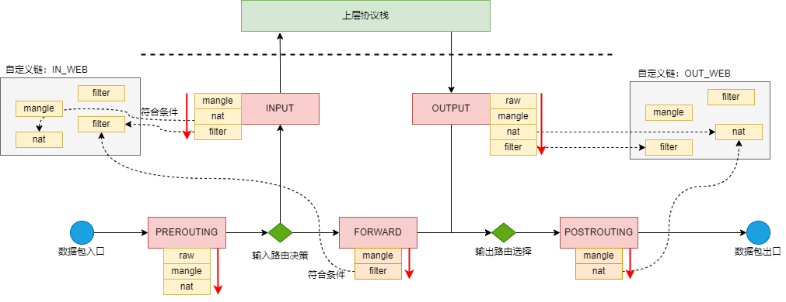

# IPtables 速记

[TOC]

## 概述

本文主要参考了 [iptables 详解](https://www.zsythink.net/archives/category/%e8%bf%90%e7%bb%b4%e7%9b%b8%e5%85%b3/iptables)，便于快速回忆，以及相关命令的使用。


IPTables 是 Linux 提供的一种包过滤机制，对网卡数据包进行路由、转发、拒绝等。

IPTables 主要分为两个部分：

- netfilter，是实际进行包过滤的内核进程。
- iptables，是对 netfilter 包过滤规则进行管理、配置的客户端程序。

为了方便，我们通常将 netfilter/iptables 统称为 iptables。

## 速记

为了方便快速回忆概念和操作，先给出常用的概念和相关命令。


一些相关命令：

```sh
# 查询路由表
$ route -n
```

### iptables 规则查询

```sh
# 列出指定 table 、指定 chain 的规则
# 若省略 chain 则列出所有 chain 指定 table 的规则
# 若省略 table 则默认为 filter
# -t 可以指定：raw mangle nat filter
# -L 可以指定：INPUT OUTPUT FORWARD PREROUTING POSTROUTING
$ iptables -t [<table>] -L [<chain>]
$ iptables -t filter -L

# 查看详细信息
$ iptables -t [<table>] -vL [<chain>]
$ iptables -t filter -vL

# 【推荐】不进行 ip 反查（性能更高）
$ iptables -t [<table>] -nvL [<chain>]
$ iptables -t filter -nvL

# 【推荐】可以打印规则编号
$ iptables -t [<table>] -nvL [<chain>] --line
$ iptables -t filter -nvL INPUT --line

# 可以显示更具体的数值（数值不使用 K、M、G 等单位）
$ iptables -t [<table>] -xnvL [<chain>]

# =============== Demo ===================
$ iptables -t filter -L FORWARD
Chain FORWARD (policy DROP)
target     prot opt source               destination         
DOCKER-USER  all  --  anywhere             anywhere            
DOCKER-ISOLATION-STAGE-1  all  --  anywhere             anywhere            
ACCEPT     all  --  anywhere             anywhere             ctstate RELATED,ESTABLISHED
DOCKER     all  --  anywhere             anywhere            
ACCEPT     all  --  anywhere             anywhere            
ACCEPT     all  --  anywhere             anywhere

$ iptables -t filter -nvL FORWARD
Chain FORWARD (policy DROP 0 packets, 0 bytes)
 pkts bytes target     prot opt in     out     source               destination         
 282K  200M DOCKER-USER  all  --  *      *       0.0.0.0/0            0.0.0.0/0           
 282K  200M DOCKER-ISOLATION-STAGE-1  all  --  *      *       0.0.0.0/0            0.0.0.0/0           
 180K  183M ACCEPT     all  --  *      docker0  0.0.0.0/0            0.0.0.0/0            ctstate RELATED,ESTABLISHED
  760 44352 DOCKER     all  --  *      docker0  0.0.0.0/0            0.0.0.0/0           
 102K   16M ACCEPT     all  --  docker0 !docker0  0.0.0.0/0            0.0.0.0/0           
    0     0 ACCEPT     all  --  docker0 docker0  0.0.0.0/0            0.0.0.0/0           
```

查询结果字段含义：

字段 | 描述
-|-
pkts | 对应规则匹配到的报文的个数。
bytes | 对应匹配到的报文包的大小总和。
target | 规则对应的 target，往往表示规则对应的”动作”，即规则匹配成功后需要采取的措施。如果需要由自定义链来处理，则也在 target 表示。
prot | 表示规则对应的协议，是否只针对某些协议应用此规则。
opt | 表示规则对应的选项。
in | 表示数据包由哪个接口(网卡)流入，即从哪个网卡来。
out | 表示数据包将由哪个接口(网卡)流出，即到哪个网卡去。
source | 表示规则对应的源头地址，可以是一个IP，也可以是一个网段。
destination | 表示规则对应的目标地址。可以是一个IP，也可以是一个网段。

对于下图中的括号部分，代表的是 iptables 的默认处理策略，即该表中没有任何一个规则与数据包匹配时的处理策略：


### iptables 规则管理

```sh
# 在链的末尾追加规则
$ iptables -t <table> -I <chain> <匹配条件> -j <action>
# 由源地址 192.168.1.146 发过来的包直接丢弃
$ iptables -t filter -I INPUT -s 192.168.1.146 -j DROP

# 在链的开头追加规则
$ iptables -t <table> -A <chain> <匹配条件> -j <action>
$ iptables -t filter -A INPUT -s 192.168.1.146 -j ACCEPT

# 清空指定表、指定链的规则
$ iptables -t [<table>] -F <chain>
$ iptables -t filter -F INPUT

# 删除指定编号的规则
$ iptables -t [<table>] -D <chain> <规则编号>
$ iptables -t filter -D INPUT 1

# 删除匹配条件的规则（方便直接运行执行删除命令。通过编号删除在每个机器上都不太一样。）
$ iptables -D <chain> <匹配条件> -j <action>
$ iptables -D INPUT -s 192.168.1.146 -j DROP

# 对于修改规则，存在一些坑，因此避免使用修改规则的命令。需要修改规则，最好先移除规则，然后再新增规则。

# 修改默认策略。当没有任何一个匹配时，将执行 action
$ iptables -t [<table>] -P <chain> <action>
$ iptables -t filter -P INPUT ACCEPT

# 对 iptables 的修改，在节点重启后会失效，因此对于确认的修改应该进行保存
$ service iptables save                                     # CentOS 6
$ iptables-save > /etc/sysconfig/iptables                   # CentOS 7

# 如果需要恢复掉对 iptables 的修改（恢复到上一次保存的 iptables），可以重启 iptables
$ service iptables restart                                  # CentOS 6
$ iptables-restore < /etc/sysconfig/iptables                # CentOS 7
```

基本匹配条件：

```sh
# 匹配源地址 -s
# 源地址可以填入多个，通过逗号分割
# 源地址可以使用网段
$ iptables ... -s <源地址> -j <执行动作>
$ iptables -t filter -I INPUT -s 192.168.1.111,192.168.1.118 -j DROP
$ iptables -t filter -I INPUT -s 192.168.1.0/24 -j ACCEPT
iptables -t filter -I INPUT ! -s 192.168.1.111 -j ACCEPT

# 匹配目标地址 -d
$ iptables ... -d <目标地址> -j <执行动作>
$ iptables -t filter -I OUTPUT -d 192.168.1.111 -j DROP
$ iptables -t filter -I OUTPUT -d 192.168.1.111,192.168.1.118 -j DROP
$ iptables -t filter -I INPUT -d 192.168.1.0/24 -j ACCEPT
$ iptables -t filter -I INPUT ! -d 192.168.1.0/24 -j ACCEPT

# 匹配协议 -p
# -p 协议可以指定：tcp, udp, udplite, icmp, icmpv6,esp, ah, sctp, mh
$ iptables ... -p <协议> -j <执行动作>
$ iptables -t filter -I INPUT -p tcp -s 192.168.1.146 -j ACCEPT
$ iptables -t filter -I INPUT ! -p udp -s 192.168.1.146 -j ACCEPT

# 匹配流入网卡 -i
$ iptables ... -t <输入网卡> -j <执行动作>
$ iptables -t filter -I INPUT -p icmp -i eth4 -j DROP

# 匹配输出网卡 -o
$ iptables ... -o <输出网卡> -j <执行动作>
$ iptables -t filter -I OUTPUT -p icmp -o eth4 -j DROP
```

TCP 模块的扩展匹配条件：

```sh
# 通过在命令中输入 -m <模块> 来引入外部模块。
# 如果使用了扩展匹配条件，又没有使用 -m，则默认引入和 -p 协议同名的外部模块进行处理。

# 匹配源端口 -m tcp --sport <源端口>
# 端口可以指定连续范围
$ iptables ... -m tcp --sport <源端口>
$ iptables -t filter -I OUTPUT -d 192.168.1.146 -p tcp -m tcp --sport 22 -j REJECT
$ iptables -t filter -I OUTPUT -d 192.168.1.146 -p tcp -m tcp --sport 22:80 -j REJECT
$ iptables -t filter -I OUTPUT -d 192.168.1.146 -p tcp --sport 22 -j REJECT

# 匹配目标端口 -m tcp --dport <目标端口>
# 端口可以指定连续范围
$ iptables ... -m tcp --dport <目标端口>
$ iptables -t filter -I INPUT -s 192.168.1.146 -p tcp -m tcp --dport 22 -j REJECT
$ iptables -t filter -I INPUT -s 192.168.1.146 -p tcp -m tcp --dport 22:80 -j REJECT
$ iptables -t filter -I INPUT -s 192.168.1.146 -p tcp --dport 22:80 -j REJECT
```

TCP 模块的协议标识匹配条件：

```sh
# 匹配 TCP 协议标识 -m tcp --tcp-flags <需要匹配的 TCP 标识> <匹配 TCP 标识为 1 的>
$ iptables -t filter -I INPUT -p tcp -m tcp --dport 22 --tcp-flags SYN,ACK,FIN,RST,URG,PSH SYN -j REJECT
# 上面这个代表匹配条件：数据包的 SYN 为 1，而 ACK、FIN、RST、URG、PSH 标识位为 0
$ iptables -t filter -I OUTPUT -p tcp -m tcp --sport 22 --tcp-flags SYN,ACK,FIN,RST,URG,PSH SYN,ACK -j REJECT
$ iptables -t filter -I INPUT -p tcp -m tcp --dport 22 --tcp-flags ALL SYN -j REJECT
$ iptables -t filter -I OUTPUT -p tcp -m tcp --sport 22 --tcp-flags ALL SYN,ACK -j REJECT

# 匹配 TCP 新建连接的请求报文 -m tcp --syn
# 等价于 –tcp-flags SYN,RST,ACK,FIN SYN
$ iptables -t filter -I INPUT -p tcp -m tcp --dport 22 --syn -j REJECT
```

### iptables 自定义链

用户可以自定义链，并将自定义链挂在到默认链上，当匹配条件时，可以转交给自定义链来进行处理：



```sh
# 查询自定义链（和查询默认链是一样的）
$ iptables -t <table> -L <自定义链>
$ iptables -t filter -L IN_WEB

# 创建自定义链，并指定其拥有的 table
# 如果一个自定义链作用了多个 table，则更换 table 进行创建命令的执行
$ iptables -t <table> -N <自定义链>
$ iptables -t filter -N IN_WEB
$ iptables -t filter -N IN_WEB; iptables -t raw -N IN_WEB

# 将自定义链添加到默认链中（其实是将<表>添加过去）
# 本质上将匹配条件的数据包，交给默认链处理
$ iptables -t filter -I INPUT -p tcp --dport 80 -j IN_WEB

# 删除自定义链
# 删除需要满足俩条件：
#  - 自定义链没有被引用
#  - 自定义链中没有任何规则
$ iptables -t <table> X <自定义链>
$ iptables -t nat -X IN_WEB
```

### NAT 配置

NAT 分为两种，其目的是不同的：

NAT 种类 | 描述 | 应用场景
-|-|-
SNAT | 源地址转换 |
DNAT | 目标地址转换 |

**注意：**

- 对于一个请求响应而言，必然会同时涉及到 SNAT 和 DNAT。例如：
  - 请求时做了 SNAT，修改了源地址从 A 到 B，那么对于响应报文的目标地址也会进行修改，即从 B 到 A，这样就做了 DNAT
- 我们一般说的 SNAT 或是 DNAT，是从请求的角度而言的，如果请求的数据包修改了源地址，则被称为 SNAT，如果请求的数据包修改了目标地址，则称为 DNAT。


NAT 命令速记：

```sh
# 如果需要主机支持 NAT 功能，则需要先开启转发功能：
$ echo 1 > /proc/sys/net/ipv4/ip_forward

# SNAT：对于匹配条件的数据包，将其源 IP 转换为指定的源 IP。
$ iptables -t nat -A POSTROUTING <匹配条件> -j SNAT --to-source <修改后的数据包源 IP>
$ iptables -t nat -A POSTROUTING -s 10.1.0.0/16 -j SNAT --to-source 192.168.1.146

# MASQUERADE：一种特殊的 SNAT，不用写死 --to-source。
# 为了避免每次本机 IP 修改后，都要调整 --to-source 源 IP，则可以使用 MASQUERADE，支持动态对应网卡上的 IP
# 避免写死 --to-source 修改后的源 IP
$ iptables -t nat -A POSTROUTING -s 10.1.0.0/16 -o <网卡> -j MASQUERADE
$ iptables -t nat -A POSTROUTING -s 10.1.0.0/16 -o eth0 -j MASQUERADE

# DNAT：对于匹配条件的数据包，将其目标 IP 和端口转换为指定的目标 IP和端口。
$ iptables -t nat -I PREROUTING -p tcp <匹配条件> -j DNAT --to-destination <修改后的数据包目标IP:端口号>
$ iptables -t nat -I PREROUTING -d 192.168.1.146 -p tcp --dport 8080 -j DNAT --to-destination 10.1.0.1:80
# DNAT 比较特殊，需要配置对应的 SNAT，它无法支持自动的 SNAT
$ iptables -t nat -A POSTROUTING -s 10.1.0.0/16 -j SNAT --to-source 192.168.1.146
```

### 路由表查询

这里分为两种路由表：

- IP 协议的路由表，使用 `route` 命令查询，主要是根据 IP 查询下一跳的 IP 地址。
- ARP 协议的路由表，使用 `arp` 命令查询，主要是确定 IP 地址在直连网段时，查询其 MAC 地址以直接发送。

```sh
# 查询路由表
# 第一条记录，代表发送给 10.0.8.x 的数据包，就在本网段，直接通过 eth0 发送给对应的主机。
#   即直接通过 ARP 表查询到对应 IP 的 MAC 地址进行组包。
# 第二条记录，代表发送给其他 IP 的数据包，转发送给网关 10.0.8.1，由网关进行路由。
#   即通过 ARP 表查询到对应的网关的 MAC 地址，传输给网关，网关则会根据 IP 包中的目标地址进行判断并进一步路由。
$ route -n
Kernel IP routing table
Destination     Gateway         Genmask         Flags Metric Ref    Use Iface
10.0.8.0        0.0.0.0         255.255.252.0   U     0      0        0 eth0
0.0.0.0         10.0.8.1        0.0.0.0         UG    100    0        0 eth0

# 查询到某一个 IP 时，如何进行路由
$ ip route get 8.8.8.8
8.8.8.8 via 10.0.8.1 dev eth0 src 10.0.8.10 uid 1002

# 查询 ARP 表
$ arp -n
Address                  HWtype  HWaddress           Flags Mask            Iface
169.254.0.34             ether   fe:ee:4d:f6:f2:fa   C                     eth1
169.254.128.8            ether   fe:ee:4d:f6:f2:fa   C                     eth1
9.134.13.236             ether   fe:ee:4d:f6:f2:fa   C                     eth1
```

## 数据包流向

iptables 的路由配置可以发生在多个“关卡”（钩子），整个包的流向和关卡的关系如下图所示：


iptables 在每个阶段，为数据包的处理方式进行了分类，每个种类就是一个表。iptables 为我们提供了如下表：

表 | 优先级 | 描述 | 适用的链（内核钩子）
-|-|-|-
raw 表 | 0（最高） | 关闭 nat 表上启用的连接追踪机制。如：iptable_raw。| INPUT，FORWARD，OUTPUT
mangle 表 | 1| 拆解报文，做出修改，并重新封装的功能。如：iptable_mangle。 | PREROUTING，OUTPUT，POSTROUTING（centos7中还有INPUT，centos6中没有）
nat 表 | 2 | network address translation，网络地址转换功能。如内核模块：iptable_nat。| PREROUTING，INPUT，FORWARD，OUTPUT，POSTROUTING
filter 表 | 3（最低） | 负责过滤功能，防火墙。如内核模块：iptables_filter。 | PREROUTING，OUTPUT

将数据包流向中的表代入后，可得到如下图：


根据链的特性，链并不是所有表都可以配置的，具体而言链可以配置的表如下：

链 | 可配置规则的表
-|-
PREROUTING | raw 表、mangle 表、nat 表。
INPUT | mangle 表、filter 表（centos7中还有nat表，centos6中没有）。
FORWARD | mangle 表、filter 表。
OUTPUT | raw 表、mangle 表，nat 表、filter 表。
POSTROUTING | mangle 表、nat 表。

## 规则

规则是什么？

> 根据指定的匹配条件来尝试匹配每个流经此处的报文，一旦匹配成功，则由规则后面指定的处理动作进行处理。

很明显，规则由匹配条件和处理动作组成。

匹配条件：

类型 | 描述
-|-
简单匹配条件 | 源地址 Source IP，目标地址 Destination IP
扩展匹配条件 | 需要依赖对应的扩展模块，如 源端口 Source Port, 目标端口 Destination Port。

处理动作：

ACTION | 描述
-|-
ACCEPT | 允许数据包通过。
DROP | 直接丢弃数据包，不给任何回应信息，这时候客户端会感觉自己的请求泥牛入海了，过了超时时间才会有反应。
REJECT | 拒绝数据包通过，必要时会给数据发送端一个响应的信息，客户端刚请求就会收到拒绝的信息。
SNAT | 源地址转换，解决内网用户用同一个公网地址上网的问题。
MASQUERADE | 是 SNAT 的一种特殊形式，适用于动态的、临时会变的 IP 上。
DNAT | 目标地址转换。
REDIRECT | 在本机做端口映射。
LOG | 在 /var/log/messages 文件中记录日志信息，然后将数据包传递给下一条规则，也就是说除了记录以外不对数据包做任何其他操作，仍然让下一条规则去匹配。

每个链（钩子）都有默认策略，即数据包不满足匹配条件时，执行的动作。默认策略执行的动作一般为 ACCEPT，不建议设置为 DROP，主要是为了避免不小心执行了规则清理，导致管理员无法连接主机。

## 扩展模块

当需要使用扩展条件时，需要引入扩展模块：

- 通过在命令中输入 -m <模块> 来引入外部模块。
- 如果使用了扩展匹配条件，又没有使用 -m，则默认引入和 -p 协议同名的外部模块进行处理。

这里只介绍部分扩展模块，关于更多常用扩展模块，请参考 [iptables 匹配条件总结之二（常用扩展模块）](https://www.zsythink.net/archives/1564)

### TCP 扩展模块

TCP 模块可以进行在简单匹配基础上，进行 TCP 协议端口的匹配：

```sh
# 匹配源端口 -m tcp --sport <源端口>
# 端口可以指定连续范围
$ iptables ... -m tcp --sport <源端口>
$ iptables -t filter -I OUTPUT -d 192.168.1.146 -p tcp -m tcp --sport 22 -j REJECT
$ iptables -t filter -I OUTPUT -d 192.168.1.146 -p tcp -m tcp --sport 22:80 -j REJECT
$ iptables -t filter -I OUTPUT -d 192.168.1.146 -p tcp --sport 22 -j REJECT

# 匹配目标端口 -m tcp --dport <目标端口>
# 端口可以指定连续范围
$ iptables ... -m tcp --dport <目标端口>
$ iptables -t filter -I INPUT -s 192.168.1.146 -p tcp -m tcp --dport 22 -j REJECT
$ iptables -t filter -I INPUT -s 192.168.1.146 -p tcp -m tcp --dport 22:80 -j REJECT
$ iptables -t filter -I INPUT -s 192.168.1.146 -p tcp --dport 22:80 -j REJECT
```

除了端口外，还可以进行 TCP 协议标识的匹配。先看一下 TCP 协议标识：


TCP 模块的协议标识匹配：

```sh
# 匹配 TCP 协议标识 -m tcp --tcp-flags <需要匹配的 TCP 标识> <匹配 TCP 标识为 1 的>
$ iptables -t filter -I INPUT -p tcp -m tcp --dport 22 --tcp-flags SYN,ACK,FIN,RST,URG,PSH SYN -j REJECT
# 上面这个代表匹配条件：数据包的 SYN 为 1，而 ACK、FIN、RST、URG、PSH 标识位为 0
$ iptables -t filter -I OUTPUT -p tcp -m tcp --sport 22 --tcp-flags SYN,ACK,FIN,RST,URG,PSH SYN,ACK -j REJECT
$ iptables -t filter -I INPUT -p tcp -m tcp --dport 22 --tcp-flags ALL SYN -j REJECT
$ iptables -t filter -I OUTPUT -p tcp -m tcp --sport 22 --tcp-flags ALL SYN,ACK -j REJECT

# 匹配 TCP 新建连接的请求报文 -m tcp --syn
# 等价于 –tcp-flags SYN,RST,ACK,FIN SYN
$ iptables -t filter -I INPUT -p tcp -m tcp --dport 22 --syn -j REJECT
```

### UDP 扩展模块

和 TCP 扩展模块基本一致，不过适用于 UDP 协议：

```sh
# --sport 指定源端口
# --dport 指定目标端口
iptables -t filter -I INPUT -p udp -m udp --dport 137 -j ACCEPT
iptables -t filter -I INPUT -p udp -m udp --dport 137:157 -j ACCEPT
```

### ICMP 扩展模块

ICMP 模块适用于 ping 命令。首先看一下 ICMP 协议中最重要的两个字段：type 和 code，用于标识 ICMP 协议数据包的作用或错误提示等。


type 标识数据包的作用，code 是对其进行具体的细分。例如：

- ping 请求的数据包，type=8/code=0；
- ping 正常响应的数据包，type=0/code=0；
- ping 响应主机不可到达，type=3/code=1；

在 iptables 中，使用 `--icmp-type <type>/<code>` 进行数据包的匹配：

```sh
# 如果 type 下只有个一类型，那么是可以省略 code 部分的
iptables -t filter -I INPUT -p icmp -m icmp --icmp-type 8/0 -j REJECT
iptables -t filter -I INPUT -p icmp --icmp-type 8 -j REJECT

iptables -t filter -I OUTPUT -p icmp -m icmp --icmp-type 0/0 -j REJECT
iptables -t filter -I OUTPUT -p icmp --icmp-type 0 -j REJECT
```

## 自定义链

这种方式的目的是为了避免规则太多，难以进行管理。通过自定义链，从业务维度管理规则。

和默认链不同的是，自定义链并不能直接使用，而是需要通过通过默认链进行引用才可以进行使用，具体而言需要在默认链中将匹配条件的行为关联到自定义链上，进而将数据包的处理转交给自定义链：


创建自定义链：

```sh
# iptables -t <表> -N <自定义链>
$ iptables -t filter -N IN_WEB

# 打印出来括号中的是引用次数
$ iptables -t filter -L IN_WEB
Chain IN_WEB (0 references)
target     prot opt source               destination       
```

**注意：**

- 链的引用次数是针对其中的表的。
- 链的默认策略为 RETURN，且不可修改。可参考 [iptables - default action at the end of user-defined chain](https://unix.stackexchange.com/questions/552075/iptables-default-action-at-the-end-of-user-defined-chain)。

添加自定义链到默认链中：

```sh
# 将自定义链添加到默认链中（其实是将<表>添加过去）
# 本质上将匹配条件的数据包，交给默认链处理
$ iptables -t filter -I INPUT -p tcp --dport 80 -j IN_WEB

$ iptables -t filter -nvL INPUT
Chain INPUT (policy ACCEPT 118 packets, 7153 bytes)
 pkts bytes target     prot opt in     out     source               destination         
    0     0 IN_WEB     tcp  --  *      *       0.0.0.0/0            0.0.0.0/0            tcp dpt:80
```

对于不需要使用的自定义链可以进行删除，但需要满足俩条件：

- 自定义链没有被引用
- 自定义链中没有任何规则

```sh
$ iptables -t <table> X <自定义链>
$ iptables -t nat -X IN_WEB
iptables: Too many links.
```

自定义链还可以进行重命名：

```sh
# 重命名自定义链
$ iptables -t <table> -E <原链名> <新链名>
$ iptables -t filter -E IN_WEB WEB
```

## 网络防火墙

综上，要将 iptables 主机作为网络防火墙时，只能在 **FORWARD** 链中进行对 filter 表进行过滤配置。

## NAT

iptables 一个特别广泛应用就是 NAT。

首先什么是 NAT？

> NAT 是 Network Address Translation的缩写，译为“网络地址转换”。NAT 说白了就是修改报文的 IP 地址，NAT 功能通常会被集成到路由器、防火墙、或独立的 NAT 设备中。

## 参考文献

1. [朱双印 iptables](https://www.zsythink.net/archives/category/%e8%bf%90%e7%bb%b4%e7%9b%b8%e5%85%b3/iptables)
1. [iptables - default action at the end of user-defined chain](https://unix.stackexchange.com/questions/552075/iptables-default-action-at-the-end-of-user-defined-chain)
1. [IP 路由原理](https://fasionchan.com/network/ip/routing/)