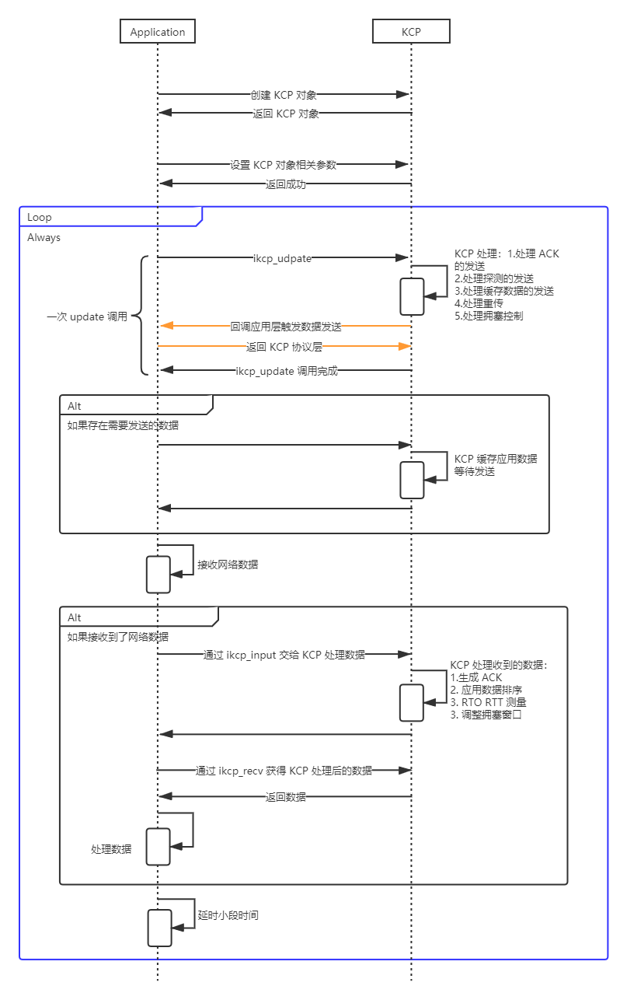

# KCP 指南

<!-- TOC -->

- [KCP 指南](#kcp-指南)
    - [概述](#概述)
    - [如何开始](#如何开始)
    - [工作模式](#工作模式)
        - [建立连接](#建立连接)
        - [数据传输](#数据传输)
        - [多路复用](#多路复用)
        - [Update 时机](#update-时机)
    - [KCP 对象](#kcp-对象)
        - [创建 KCP 对象](#创建-kcp-对象)
        - [KCP 发送回调函数](#kcp-发送回调函数)
        - [KCP Update](#kcp-update)
        - [KCP Send](#kcp-send)
        - [KCP Input](#kcp-input)
    - [消息](#消息)
        - [报文与分段](#报文与分段)
        - [消息类型](#消息类型)
        - [消息分段](#消息分段)
        - [接收窗口](#接收窗口)
        - [重传次数](#重传次数)
    - [缓存](#缓存)
        - [缓存结构](#缓存结构)
        - [发送缓存](#发送缓存)
        - [接收缓存](#接收缓存)
    - [ACK](#ack)
        - [ACK 消息](#ack-消息)
        - [ACK 的接收](#ack-的接收)
        - [ACK 的发送](#ack-的发送)
        - [ACKLIST](#acklist)
        - [UNA](#una)
    - [重传](#重传)
        - [重传缓存](#重传缓存)
        - [超时重传](#超时重传)
        - [快速重传](#快速重传)
        - [Duplicate Segment](#duplicate-segment)
    - [超时探测](#超时探测)
        - [RTT](#rtt)
        - [RTO](#rto)
        - [重传二义性](#重传二义性)
    - [窗口](#窗口)
        - [滑动窗口](#滑动窗口)
        - [发送窗口](#发送窗口)
        - [对端接收窗口](#对端接收窗口)
        - [拥塞窗口](#拥塞窗口)
        - [探测](#探测)
    - [总结](#总结)
        - [KCP 的优点](#kcp-的优点)
        - [KCP 的缺点](#kcp-的缺点)
    - [附录、KCP 对象结构](#附录kcp-对象结构)
    - [附录、参考文献](#附录参考文献)

<!-- /TOC -->

## 概述

参考 KCP 作者对 KCP 的介绍：

> KCP是一个快速可靠协议，能以比 TCP 浪费 10%-20% 的带宽的代价，换取平均延迟降低 30%-40%，且最大延迟降低三倍的传输效果。纯算法实现，并不负责底层协议（如UDP）的收发，需要使用者自己定义下层数据包的发送方式，以 callback的方式提供给 KCP。 连时钟都需要外部传递进来，内部不会有任何一次系统调用。

- KCP 是纯算法实现，不涉及系统调用，因此可以在任何系统中编译运行。
- KCP 与数据发送（和接收）的调用解耦，由应用决定如何发送和接收数据。
- KCP 包括但不局限于以下特性：
  - 封装和卸载 KCP 消息头
  - 发送和接收缓存
  - 数据的分段与合并
  - 丢包重传
  - 连续和有序的保证
  - 拥塞控制
  - 网络状况的评估（RTT 和拥塞窗口）

## 如何开始

KCP 除了编译用工具外（例如 gcc/g++），不需要安装其他工具。

1. 复制以下两个文件到本地：

   - <https://github.com/skywind3000/kcp/blob/master/ikcp.c>
   - <https://github.com/skywind3000/kcp/blob/master/ikcp.h>

1. 编写使用 KCP 的应用。
1. 直接使用 gcc/g++ 进行编译即可。

## 工作模式

KCP 的核心工作机制并非事件触发，而是定时触发，并由业务层获得传输数据交给 KCP 解析处理：



**注意：**

- 上图中最后会进行小段时间延时，这是因为 KCP 内部维护了进行 update 需要保持的时间间隔。请参考 [Update 时机](#update-时机)。

发送和接收的简易伪代码如下，主要是为了说明其工作机制：

```py

def transport_output(message):
    # 应用层决定如何发送数据，由 KCP 在 ikcp_update() 时进行发数据的触发
    sendto(addr, message)


def transport_input():
    # 应用层决定如何接收数据，由应用层自己触发
    return recv()


# conv 是 KCP 连接会话标识，通信双发需要一致。
kcp = ikcp_create(conv)
kcp.ikcp_setoutput(transport_output)

while True:
    # KCP 核心的驱动方法，将会进行 KCP 内部的众多处理，例如发送 ACK、负载、超时重传、拥塞窗口更新等。
    kcp.ikcp_udpate(current)

    # 如果存在需要发送的数据，则告知 KCP 进行数据发送
    if message:
        # 只是缓存起来，并不会立即发送。实际的发送是通过 ikcp_udpate 进行触发的
        kcp.ikcp_send(message)

    # 应用层自己决定如何获得数据
    transport_message = transport_input()
    if recv_message:
        # 应用层数据需要交给 KCP 进行数据的解析，例如处理 ACK，数据排序、RTT测量、拥塞窗口更新等。
        kcp.ikcp_input(transport_message)

    # 从 KCP 中的获得解析好的数据
    recv_message = kcp.ikcp_recv()
    if recv_message:
        # 交给应用处理收到的数据
        application_process(recv_message)

    # 进行小段时间的缓存
    sleep()
```

### 建立连接

KCP 是存在连接的概念的，但是 KCP 并不负责创建连接。KCP 连接标识即 conv，通信的双发需要一致的 conv。

应用层需要自行解决的双发 conv 如何达成一致的问题。

在 [Cooperate With Tcp Server](https://github.com/skywind3000/kcp/wiki/Cooperate-With-Tcp-Server) 中，作者描述了通过基于 TCP 建立连接让两个端点获得相同的 conv 后，再使用 KCP 通信。

### 数据传输

KCP 是一个纯协议实现，并没有涉及到具体的传输方法，采用什么方式进行数据传递完全由业务层决定。

### 多路复用

在现代网络编程中，通常会用 EPOLL 等多路 IO 复用的方式进行网络数据传输，这也可以和 KCP 进行结合使用。

KCP 原作者在 [KCP Best Practice](https://github.com/skywind3000/kcp/wiki/KCP-Best-Practice) 中提及：

> 比如你正在实现一套类 EPOLL 的机制，那么为了避免每秒钟对每个连接调用大量的调用 ikcp_update，我们可以使用 ikcp_check 来大大减少 ikcp_update 调用的次数。

对于 `ikcp_check` 是用于获得下次进行 `ikcp_update` 的时间点，`ikcp_check` 会考虑当前发送分段超时重传的时间。

> ikcp_check 返回值会告诉你需要在什么时间点再次调用 ikcp_update（如果中途没有 ikcp_send, ikcp_input）。若中途调用了 ikcp_send, ikcp_input的话，需要在下一次 interval 时调用 update。

因此对于使用 EPOLL 的场景，可以将下次调用 ikcp_update 的时间点注册到 EPOLL 超时时间中，使得 ikcp_update 可以被及时调用。

观察源码后，没发现 `ikcp_check()` 和 `ikcp_update()` 之间的关系是微妙的，请参考 [Update 时机](#update-时机)。

除了作者提供的建议外，还有一种较为极端的做法：

- 设置 `kcp->interval=0`，这样会让 `ikcp_update()` 被任意时间点调用（否则 ikcp_update 的调用受 interval 的约束，请参考 [Update 时机](#update-时机)）。
- 设置 EPOLL 超时时间为 x ms。
- 触发读事件：
  - 立即调用 `ikcp_input()` 通过 KCP 解析处理网络数据。
  - 随后立即调用 `ikcp_update()`，主要目的触发端点发送 ACK（因为读事件触发很可能受因为收到了数据，因此需要立刻返回 ACK）。
- EPOLL 超时：
  - 重置超时时间。
  - 调用 `ikcp_update()`：
    - 探测对端接收窗口。
    - 处理数据重发。
    - 处理发送缓冲区的数据。
- 应用需要发送数据：
  - 立即调用 `ikcp_send()`。
  - 随后立即调用 `ikcp_update()` 发送数据。

### Update 时机

KCP 需要通过 update 函数进行驱动，而 update 的调用时间间隔是非常重要的：

- 时间间隔过长，导致无法及时的进行数据传输。
- 时间间隔过短，导致 CPU 的占用率会增大。

在 KCP 的 Demo 和相关实践中可以看到通常设置的时间间隔是 1-10ms，或者 10-100ms。

KCP 对象中，存在 `kcp->interval` 来表示进行 update 的间隔，update 的调用会检查当前调用时间是否满足 `kcp->interval` 的约束：

- 如果下次调用 update 的时间间隔小于 `kcp->interval` 时，update 的调用会被忽略。

```s
  +------------------+------------------+------------------+------------------+
  |     interval     |     interval     |     interval     |     interval     |
  +------------------+------------------+------------------+------------------+
   ^          ^            ^                   ^         ^
   |          |            |                   |         |
 update     update       update              update    update
(accept)   (ignore)     (accept)            (accept)  (ignore)
```

KCP 作者称 `ikcp_check()` 函数会返回正确的 update 调用时机（check 会考虑重传超时时间），而 `ikcp_check()` 返回的时间戳会限制为小于 interval，这意味着：

- KCP 的 check 保障在一个 interval 内，至少需要进行一次 update。

即便 KCP 没有任何输入和任何输出，KCP 的 check 也应该保障 interval 中至少调用一次，这是为什么呢？因为需要**探测**。

- KCP 没有任何输入和输出，但是对端窗口接收窗口大小先前协商为 0 了，这会导致下次有数据需要发送时，无法立即发送。因此，即便没有数据需要发送和接收，也需要保持周期性的调用 update。

如果 KCP 存在输入和输出，不应该等待先前 check 的时间到期，而是应该在下一个 interval 开始的时候立即调用 update，以及时的处理发送数据和接收数据，这在 interval 的设置偏大的时候尤其重要。

```s
   +------------------+------------------+------------------+------------------+
   |     interval     |     interval     |     interval     |     interval     |
   +------------------+------------------+------------------+------------------+
   ^          ^          ^       ^       ^         ^
   |          |          |       |       |         |
 update     update     update    IO    update    update
(accept)   (ignore)   (accept)        (accept)  (ignore)
            check      check           for IO    check
```

对上述 update 的解释：

- 第一次 update，KCP 处理。
- 第二次 update，是 check 返回的时间点，因为在一个 interval 内，所以 KCP 忽略。
- 第三次 update，是 check 返回的时间点，因为在下一个 interval，所以 KCP 接受并进行处理。
- 发生了 IO 事件，需要在下一个 interval 立即处理，不能等到下一次 check 的时间点。这里的 IO 事件指的是接收到了数据，或者应用层 通过 `ikcp_send()` 发送数据。
- 第四次 update，是 IO 事件触发的。
- 第五次 update，是 check 返回的时间点，如果 IO 事件没有触发 update，则需要等到第五次 update 来处理 IO 事件，相对而言，处理不够及时。

在 [KCP Issues138](https://github.com/skywind3000/kcp/issues/138) 进行过相关讨论，但是作者没有给出最终的结论，以上是基于自己的理解。

## KCP 对象

KCP 对象是 KCP 算法协议的核心，维护了非常多的 KCP 状态信息。

KCP 对象结构请参考：[附录、KCP 对象结构](#附录kcp-对象结构)。

### 创建 KCP 对象

```c
ikcpcb *kcp = ikcp_create(conv, user);
```

函数的输入：

输入参数 | 描述
-|-
conv | conv为一个表示会话编号的整数，和 tcp 的 conv 一样，通信双方需保证 conv 相同，相互的数据包才能够被认可。
user | 由 KCP 回调应用层进行数据发送时的上下文指针。

函数的返回：

返回值 | 描述
-|-
非 NULL | 成功分配。
NULL | 分配 user 失败。

### KCP 发送回调函数

当 KCP 认为需要发送数据时，会回调应用层配置的回调。

```c
int kcp_callback_output(const char *buf, int len, ikcpcb *kcp, void *user)

// KCP 设置传输数据的回调函数
kcp->output = kcp_callback_output;
```

### KCP Update

KCP 的状态驱动依赖于对 KCP Update 的定时调用。

```c
void ikcp_update(ikcpcb *kcp, IUINT32 current)
```

函数的输入：

输入参数 | 描述
-|-
kcp | KCP 对象。
millisec | 当前时间点，毫秒。

该函数会处理发送 ACK、数据发送、数据重传、拥塞控制等。

### KCP Send

应用通过调用 `ikcp_send()` 函数进行数据的发送：

```c
int ikcp_send(ikcpcb *kcp, const char *buffer, int len)
```

函数的输入：

输入参数 | 描述
-|-
kcp | KCP 对象。
buffer | 数据地址。
len | 数据长度。

函数的返回值反应了对输入数据的处理情况：

返回值 | 描述
-|-
0 | 成功。
-1 | 参数异常。
-2 | 空间不足（例如内存分配失败）。

`ikcp_send()` 并不会立即发送数据，而是将数据进行缓存，等到 `ikcp_update()` 调用时，通过回调应用层的方式来触发数据的发送。

该函数会处理发送 ACK、数据发送、数据重传、拥塞控制等。

### KCP Input

KCP 对象状态驱动的另一个关键函数是 `ikcp_input()`，该函数由应用获得网络数据后交给该 KCP 对象进行处理、解析。

```c
int ikcp_input(ikcpcb *kcp, const char *data, long size)
```

函数的输入：

输入参数 | 描述
-|-
kcp | KCP 对象。
data | 数据地址。
size | 数据长度。

函数返回值反映了 KCP 对数据的处理情况：

返回值 | 描述
-|-
0 | KCP 正确处理了数据。
-1 | 参数错误，或者接收的数据与 KCP conv 不一致。

该函数会处理 ACK 的生成、乱序数据排列、拥塞控制、RTO 估算。

## 消息

KCP 消息由多个 Segment（分段）表示，单个 Segment 在本地的存储结构：

```c
struct IKCPSEG
{
    struct IQUEUEHEAD node;
    IUINT32 conv;
    IUINT32 cmd;
    IUINT32 frg;
    IUINT32 wnd;
    IUINT32 ts;
    IUINT32 sn;
    IUINT32 una;
    IUINT32 len;
    IUINT32 resendts;
    IUINT32 rto;
    IUINT32 fastack;
    IUINT32 xmit;
    char data[1];
};
```

字段描述：

字段 | 描述
-|-
node | 链表节点。
conv | 会话标识别。
cmd | 消息类型。
frg | 消息剩余分段个数。
wnd | 分段发送者的窗口大小。
ts | 分段发送时间。对于某些消息类型，ts 有其他用途，请参考[消息类型](#消息类型)。
sn | 分段递增序列号，用于标识唯一分段，也是接收方进行分段排序的依据。对于某些消息类型，sn 有其他用途，请参考[消息类型](#消息类型)。
una | 待接收的分段序列号。即发送者的接收缓冲区窗口最左端应该填充的分段。
len | 分段的数据长度（data 字段的长度，单位字节）。
resendts | 下次超时重传的时间戳。
rto | 发送方的 rto。KCP 接收方并不会用该字段的信息。
fastack | 表示该分段在收到 ACK 时被跳过的次数。发送分段后，N 个 ACK 都没有该分段的 ACK，则该分段 fastack 为 N。用于快速重传。
xmit | 重传次数。
data | 分段的负载数据。

**注意：**

- 上述字段基本都是 uint32，占用 4 字节空间，但是网络传输中上述字段并不一定是 4 字节。

KCP 包进行发送时，Segment 会将上述`部分`字段进行传输，网络中传输的 Segment 内存结构如下图：

```s
0                    4     5     6       8 (BYTE)
+--------------------+-----+-----+-------+
|        conv        | cmd | frg |  wnd  |
+--------------------+-------------------+   8
|         ts         |         sn        |
+--------------------+-------------------+   16
|         una        |         len       |
+--------------------+-------------------+   24
|             DATA (Optional)            |
+--------------------+-------------------+
```

### 报文与分段

在 KCP 中，为了增大网络传输效率，会尽力将 Segment 凑齐满一个 MTU 进行数据发送，因此一次网络传输中可能包含多个消息 Segment。

**注意：**

- 如果一次发送中，没有凑齐 MTU 大小的发送数据，会立即将剩余的数据进行数据传输，不会强制等待凑齐 MTU。

例如，如果通过 UDP 传输 KCP 消息：

- MTU 为 1400
- Segment 1 为 500 字节
- Segment 2 为 800 字节
- Segment 3 为 600 字节
- Segment 4 为 200 字节

则会发送两个 UDP 报文，分别为 Segment 1 + Segment 2， Segment 3 + Segment 4

```s
+---------------------------+---------------------------+
|     DATAGRAM 0 (1300)     |     DATAGRAM 1 (800)      |
+---------------------------|---------------------------+
|  Segment 1  |  Segment 2  |  Segment 3  |  Segment 4  |
+---------------------------+---------------------------+
```

**注意：**

- KCP 存在 Stream 模式，开启后所有的所有的 Segment 都会进行合并，一个 DATAGRAM 将会是一个 Segment（除了 ACK 和探测消息）。

### 消息类型

KCP 中消息分段的 `cmd` 是消息类型的标识。

消息类型分为以下 4 种类型：

```c
const IUINT32 IKCP_CMD_PUSH = 81;   // cmd: push data
const IUINT32 IKCP_CMD_ACK  = 82;   // cmd: ack
const IUINT32 IKCP_CMD_WASK = 83;   // cmd: window probe (ask)
const IUINT32 IKCP_CMD_WINS = 84;   // cmd: window size (tell)
```

类型 | 类型标识 | 描述
-|-|-
PUSH | 81 | 该类消息具有数据负载，用于数据传输。
ACK | 82 | 该类消息用于响应分段，告诉对端收到了某个分段，具体请参考 [ACK](#ack)。
WINDOW_ASK | 83 | 该类型消息用于主动询问对端窗口大小，具体请参考[窗口](#窗口)。
WINDOW_TELL | 84 | 该类型消息用于主动告诉对端自己的窗口大小，具体请参考[窗口](#窗口)。

不同的消息类型中，ts 和 sn 的含义是不一样的：

- PUSH
  - sn 表示消息分片序列号，用于标识别消息。
  - ts 表示消息分片的发送时间戳。
- ACK
  - sn 表示*响应*的消息分片序号。即告诉对端 sn 分片已经接收到。
  - ts 表示对应 sn 的发送时间戳，用于标识 ACK 所对应 Segment 的发送时间，便于接收 ACK 的端点计算 RTO。
- WINDOWS_ASK / WINDOWS_TELL
  - sn 无意义，值为 0。
  - ts 无意义，值为 0。

### 消息分段

调用 KCP 消息发送函数 `kcp_send()` 时，KCP 会根据 MSS（最大分段大小）计算消息的分段个数：

```c
int ikcp_send(ikcpcb *kcp, const char *buffer, int len)
{
    ...

    // len 即消息长度
    if (len <= (int)kcp->mss) count = 1;
    else count = (len + kcp->mss - 1) / kcp->mss;

    ...
}
```

如果现在设置 MSS 为 2，且先后通过 `ikcp_send` 插入两个分片：

```c
kcp->mss = 2
ikcp_send(kcp, "I-Love-You", 10);
ikcp_send(kcp, "Hello", 5);
```

最终生成的分段示意图：

```s
      +------+------+------+------+------+------+------+------+
sn    |   0  |   1  |   2  |   3  |  4   |  5   |  6   |   7  |
      +------+------+------+------+------+------+------+------+
frg:  |   4  |   3  |   2  |   1  |  0   |  2   |  1   |   0  |
      +------+------+------+------+------+------+------+------+
data  |  I-  |  Lo  |  ve  |  -Y  |  ou  |  He  |  ll  |   o  |
      +------+------+------+------+------+------+------+------+
```

**注意：**

- KCP 存在 Stream 模式，若开启 Stream 模式，则 frg 没有意义，全部填 0。

### 接收窗口

发送者每个分段数据都会告诉对端发送者的接收窗口大小，以此来限制对端数据的发送长度。

KCP 中每次进行分段数据的发送，都会通过 `ikcp_wnd_unused` 函数计算 wnd 的值：

```c
static int ikcp_wnd_unused(const ikcpcb *kcp)
{
    if (kcp->nrcv_que < kcp->rcv_wnd) {
        return kcp->rcv_wnd - kcp->nrcv_que;
    }
    return 0;
}
```

- `kcp->rcv_wnd`，KCP 当前接收窗口大小，KCP 在初始化时便确定了该值，并不会主动去变更（应用层可以自己变更）。
- `kcp->nrcv_que`，KCP 已接受到的数据缓存，等待应用层读取。

应用若无法及时读出 rcv_queue 中的数据，会导致接收缓冲区被写满，这会导致：

- KCP 会通知 Peer 接收窗口为 0，Peer 将不会再发送数据（除了探测消息和 ACK 消息）。

**注意：**

- KCP 中窗口的单位并非是字节，而是分段个数。
- 即便接收窗口已经被写满，但是并不会影响 KCP 接收数据，因此 KCP 并不会丢掉数据包。这是因为 KCP 接收数据缓存是用的 kcp_buf，而窗口限制的是 kcp_queue，两者的区别请参考[接收缓存](#接收缓存)。

### 重传次数

在分段中记录重传次数 `xmit` 是为了发送方判断连接是否断开：

- 当任何一个分段的重传次数达到 `dead_link` 时，就认为连接已断开。

```c
// const IUINT32 IKCP_DEADLINK = 20;
// kcp->dead_link = IKCP_DEADLINK;

if (segment->xmit >= kcp->dead_link) {
    kcp->state = (IUINT32)-1;
}
```

**注意：**

- KCP 并不会校验 kcp->state，而是将 kcp->state 的操作判断交由应用层。

## 缓存

KCP 的缓存有两层：

应用数据缓存：

- rcv_queue 用户通过 `ikcp_recv()` 函数，从 rcv_queue 中获得排序好的数据，并且会进行分段的消息合并。
- snd_queue 用户通过 `ikcp_send()` 函数，将消息进行分段，并存放到 snd_queue 结构中。

KCP 数据缓存：

- rcv_buf KCP 将接收到的数据缓存到 rcv_buf，这是乱序的数据缓存。
- snd_buf KCP 将下次进行发送、等待 ACK 的数据放到了 snd_buf 中。

### 缓存结构

KCP 的缓存本质上是一个链表，链表的每一项是一个 Segment。也就是说，KCP 通过链表以 Segment 为节点进行数据的缓存。

KCP 的链表仅包含两个指针：

- next，指向下一个链表节点。
- prev，指向上一个链表节点。

```c
struct IQUEUEHEAD {
    struct IQUEUEHEAD *next, *prev;
};

typedef struct IQUEUEHEAD iqueue_head;
```

链表节点中不包含应用数据，而是在应用数据中包含链表节点，再通过偏移量计算得到应用数据指针：

```c
#define IQUEUE_HEAD_INIT(name) { &(name), &(name) }

#define IQUEUE_HEAD(name) struct IQUEUEHEAD name = IQUEUE_HEAD_INIT(name)

#define IQUEUE_INIT(ptr) ((ptr)->next = (ptr), (ptr)->prev = (ptr))

#define IOFFSETOF(TYPE, MEMBER) ((size_t) &((TYPE *)0)->MEMBER)

#define ICONTAINEROF(ptr, type, member) ((type*)( ((char*)((type*)ptr)) - IOFFSETOF(type, member)) )

#define IQUEUE_ENTRY(ptr, type, member) ICONTAINEROF(ptr, type, member)
```

KCP 用于缓存的入口节点就存放在 kcp 对象里，也就是：

- rcv_queue
- snd_queue
- rcv_buf
- snd_buf

下面是链表的一个遍历：

```c
for (p = kcp->snd_buf.next; p != &kcp->snd_buf; p = next) {
    IKCPSEG *seg = iqueue_entry(p, IKCPSEG, node);
    ...
}
```

### 发送缓存

KCP 的发送缓存有两个：

- KCP 协议层次的： `snd_buf`
  - snd_buf 中存放了满足发送条件，以及发送中未被 ACK 的 Segment。
  - 重传是遍历 snd_buf 中满足条件的 Segment。
- 缓存应用层数据的： `snd_queue`
  - 应用层缓存 snd_queue 的数据移动到 snd_buf 中的条件是发送的窗口足够大。请参考[窗口](#窗口)

发送数据时，不满足窗口条件为什么不直接由 KCP 放弃传输呢？

原作者的回答是：

> 为什么 KCP在发送窗口满的时候不返回错误呢？这个问题当年设计时权衡过，如果返回希望发送时返回错误的 EAGAIN/EWOULDBLOCK 你势必外层还需要建立一个缓存，等到下次再测试是否可以 send。那么还不如 kcp直接把这一层缓存做了，让上层更简单些，而且具体要如何处理 EAGAIN，可以让上层通过检测 ikcp_waitsnd 函数来判断还有多少包没有发出去，灵活抉择是否向 snd_queue 缓存追加数据包还是其他。

### 接收缓存

KCP 的接收缓存有两个：

- KCP 协议层次的：`rcv_buf`。
  - 每当 KCP 接收到数据 Segment，都会将 Segment 的信息全部**拷贝**到一个新的 Segment，并放到 rcv_buf 链表中。
  - KCP 保障了 rcv_buf 中存放了顺序的（但是不一定连续）Segment。
- 应用层使用的：`rcv_queue`。
  - 在讲数据 Segment 放入 rcv_buf 后，KCP 会继续将 rcv_buf 中顺序且连续的 Segment 移动到 rcv_queue中。
  - 每当应用层调用 `ikcp_recv()` 接收数据时，会直接从 `rcv_queue` 中获取到连续且排序好的数据。

```s
Recv Segment 2
            +-----+-----+-----+-----+
rcv_buf     |  2  |     |     |     |
            +-----+-----+-----+-----+
rcv_queue   |     |     |     |     |
            +-----+-----+-----+-----+

Recv Segment 5
            +-----+-----+-----+-----+
rcv_buf     |  2  |  5  |     |     |
            +-----+-----+-----+-----+
rcv_queue   |     |     |     |     |
            +-----+-----+-----+-----+

Recv Segment 3
            +-----+-----+-----+-----+
rcv_buf     |  2  |  3  |  5  |     |
            +-----+-----+-----+-----+
rcv_queue   |     |     |     |     |
            +-----+-----+-----+-----+

Recv Segment 1
            +-----+-----+-----+-----+
rcv_buf     |  5  |     |     |     |
            +-----+-----+-----+-----+
rcv_queue   |  1  |  2  |  3  |     |
            +-----+-----+-----+-----+

Recv Segment 7
            +-----+-----+-----+-----+
rcv_buf     |  5  |  7  |     |     |
            +-----+-----+-----+-----+
rcv_queue   |  1  |  2  |  3  |     |
            +-----+-----+-----+-----+

Recv Segment 4
            +-----+-----+-----+-----+
rcv_buf     |  7  |     |     |     |
            +-----+-----+-----+-----+
rcv_queue   |  1  |  2  |  3  |  4  |
            +-----+-----+-----+-----+
```


## ACK

ACK 消息在 KCP 中非常重要，是 KCP 实现可靠传输的基础。

- 对于 Segment 发送方，在发送 Segment 后，Segment 会驻留在缓冲区（若存在丢包，则会重复缓冲区的 Segment），直到接收到对端发送的 ACK。
- 对于 Segment 接收方，在收到 Segment 后，需要通过 una & ack 消息通知发送方。

### ACK 消息

在 [消息](#消息) 中已经对 KCP 的消息进行了阐述，对于 ACK 消息，有些需要特别注意的，因为这是 KCP 协议实现的关键。

- sn，ACK 消息中的 sn。用来表示 ACK 的帧。Segment 发送方根据该需要进行如下操作：
  - 收到重复的 sn，应该去重。
  - 根据 sn 进行数据排序。
  - 释放发送缓冲区 sn 所对应 Segment 的内存。
- ts，ACK 消息中的 ts。响应的 sn 的 Segment 所对的时间。用于计算 rto。

### ACK 的接收

在 KCP 中，接收到的 ACK 包要经过三个关键的处理：

- `ikcp_update_ack()` 根据分片的收发时间差值，估算 rto。关于 rto，请参考[窗口](#窗口)。
- `ikcp_parse_ack()` 解析 ACK，从发送缓冲区 snd_buf 中删除对应的分片，释放内存，避免重传。
- `ikcp_shrink_buf()` 更新发送方的 snd_una（即对端的 UNA，对端期望接收到的下一个 Segment），是从发送方角度所感知到的对端需要接收的下一个 Segment。

```c
int ikcp_input(ikcpcb *kcp, const char *data, long size)
{
    ...

    while (1) {
        decode a segment;

        if (cmd == IKCP_CMD_ACK) {
            if (kcp->current >= ts) {
                ikcp_update_ack(kcp, kcp->current - ts);
            }

            ikcp_parse_ack(kcp, sn);
            ikcp_shrink_buf(kcp);
            ...
        }
    }
}
```

### ACK 的发送

ACK 的发送分为两个部分：

- 接收到 Segment 时将需要进行的 ACK 进行缓存。
- `ikcp_update()` 驱动 KCP 发送缓存的 ACK。

在接收到 Segment 后，该 Segment 的 ACK 并不会立即发送，而是会将 Segment 的序号和发送时间戳缓存到 acklist 中，在 `ikcp_update()` 驱动时发送。

接收 Segment，并缓存 ACK：

```c
int ikcp_input(ikcpcb *kcp, const char *data, long size)
{
    ...

    while (1) {
        decode a segment;

        if (cmd == IKCP_CMD_PUSH) {
            if (sn < kcp->rcv_nxt + kcp->rcv_wnd < 0) {
                // 缓存需要 ack 的 Segmetn sn 和 ts，该函数会写 acklist
                ikcp_ack_push(kcp, sn, ts);
                ....
            }
        }
    }
}
```

在 `ikcp_update()` 中会驱动调用 `ikcp_flush()` 将缓存的 ACK 信息全部发送：

```c
void ikcp_flush(ikcpcb *kcp)
{
    ...

    // flush acknowledges
    count = kcp->ackcount;
    for (i = 0; i < count; i++) {
        size = (int)(ptr - buffer);
        if (size + (int)IKCP_OVERHEAD > (int)kcp->mtu) {
            ikcp_output(kcp, buffer, size);
            ptr = buffer;
        }
        ikcp_ack_get(kcp, i, &seg.sn, &seg.ts);
        ptr = ikcp_encode_seg(ptr, &seg);
    }

    ...
}
```

### ACKLIST

在 [ACK 的发送](#ack-的发送)中提到了端点在接收到 Segment 时，会将对应 Segment 的 ACK 信息生成出来并缓存，在端点进行 `ikcp_update()` 时会根据缓存的 ACK 信息进行发送。

ACK 的缓存主要有两个变量：

- acklist 待发送的 ACK 数组，每当有一个 Segment 抵达 Endpoint，会在数组的末尾记录 Segment 的 sn 和 ts。
- ackcount 缓存的 ACK 的个数。
- ackblock acklist 可以存储的 ACK 个数。

KCP 对象中存储这两个变量：

```c
struct IKCPCB
{
    ...
    IUINT32 *acklist;
    IUINT32 ackcount;
    IUINT32 ackblock;
    ...
};
```

**注意：**

- acklist 数组长度不足时，KCP 会为其动态扩容。
- acklist 中缓存的 ACK 可能是乱序的，因为 Segment 可能是乱序抵到 Endpoint 的。
- 需要注意 acklist 中每个 ACK 占用两个元素，因此实际的 acklist 空间大小是两倍的 ackblock。

假设 Endpoint 当前的 ackblock 为 6，并顺序接收到如下 Segment：

- Segment sn=0 ts=10
- Segment sn=1 ts=11
- Segment sn=2 ts=12
- Segment sn=4 ts=14，这里存在乱序 Segment
- Segment sn=3 ts=13

会生成如下内存布局的 acklist：

```s
          +------------+------------+------------+------------+------------+------------+
          |    ACK 0   |   ACK 1    |   ACK 2    |   ACK 3    |   ACK 4    |   ACK 5    |
          +-----+------|-----+------|-----+------|-----+------|-----+------|-----+------+
field     |  sn |  ts  |  sn |  ts  |  sn |  ts  |  sn |  ts  |  sn |  ts  | sn  |  ts  |
          +-----+------|-----+------|-----+------|-----+------|-----+------|-----+------+
acklist   |  0  |  10  |  1  |  11  |  2  |  12  |  4  |  14  |  3  |  13  |     |      |
          +-----+------+-----+------+-----+------+-----+------+-----+------+-----+------+
```

### UNA

并不是只有 ACK 消息可以对发送方的分片进行 ACK，也可以通过 UNA 来完成 ACK。

UNA 即对端的待接收分段序列号，在 KCP 中，通信的双方约定好：

- 对端发送的 una，意味着对端已经正确处理了 una 之前的所有包。

在 KCP 中，所有消息都包含 UNA 信息，在区分消息类型进行处理前会同意进行 UNA 所带来的 ACK 处理：

- `ikcp_parse_una()` 根据 UNA 将发送缓冲区 snd_buf 中相应部分的分片进行内存释放。
- `ikcp_shrink_buf()` 更新 KCP 的 snd_una（即对端的 UNA，对端期望接收到的下一个 Segment）。

```c
int ikcp_input(ikcpcb *kcp, const char *data, long size)
{
    ...

    while (1) {
        decode a segment;

        ...
        data = ikcp_decode32u(data, &una);
        ...

        ikcp_parse_una(kcp, una);
        ikcp_shrink_buf(kcp);

        if (cmd == IKCP_CMD_ACK) {}
        else if (cmd == IKCP_CMD_PUSH) {}
        else if (cmd == IKCP_CMD_WASK) {}
        else if (cmd == IKCP_CMD_WINS) {}
        else {}
    }
}
```

采用 UNA 的好处是可以通过 UNA 对分段进行批量的确认，避免对每个分段都发送 ACK 消息。

例如，Endpoint 发送了 1、2、3、4、5、6 Segment，但是 Peer 只接收到了 1、2、3、6 Segment：

```s
    Endpoint                                     Peer

    Segment 1        -------->
    Segment 2        -------->
    Segment 3        -------->
    Segment 4        ----x--->
    Segment 5        ----x--->
    Segment 6        -------->
                                <--------    Any Segment UNA=4
```

很明显，Peer 只需要通过 UNA = 4 告知 Endpoint，Endpoint 就可以认为对端已经接收到了 1、2、3 Segment。

从 KCP 的实现上来讲，**所有的** Segment 都会传输 UNA，并且对接收到的任何 Push Segment 都会响应 ACK。

```s
    Endpoint                                     Peer

    Segment 1        -------->
    Segment 2        -------->
                                <--------    ACK sn=1 UNA=3
                                <--------    ACK sn=2 UNA=3
    Segment 3        -------->
    Segment 4        -------->
                                <---x----    ACK sn=3 UNA=5
                                <--------    ACK sn=4 UNA=5
    Segment 5        -------->
    Segment 6        -------->
    Segment 7        ----x--->
    Segment 8        ----x--->
    Segment 9        -------->
                                <---x----    ACK sn=5 UNA=7
                                <---x----    ACK sn=6 UNA=7
                                <--------    ACK sn=9 UNA=7
```

KCP 混合了 ACK 和 UNA 的方式，这样的好处是只要有一个 Segment 到对端，对端就可以知晓 ACK 情况，以避免 ACK 丢包导致 Segment 重传。

## 重传

KCP 中，数据以分段为单位进行网络传输，若业务采用 UDP 等不可靠的传输协议来投递分段，则传输过程中可能会分段丢失的情况，KCP 会检测到并对丢失的分段进行重传。

例如，Endpoint 发送 1 和 2 Segment，但是 Segment 2 丢失了，Peer 只会发送对 Segment 1 的 ACK，Endpoint 在`某个时刻`就会重传 Segment 2 的数据。

```s
    Endpoint                                     Peer

    Segment 1        --------->
    Segment 2        ----x---->
                                <---------    ACK sn=1 UNA=2
    sometime          resend
    Segment 2        --------->
```

根据重传策略会决定重传的时刻。

**注意：**

- 在 KCP 中，当重传次数达到 `kcp->dead_link` 阈值时，则认为网络不可用，并设置状态，可以参考 [重传次数](#重传次数)。

### 重传缓存

在阐述重传策略前，先看一下 KCP 对于发送分段的缓存，在 Endpoint 发送数据后，由于可能的丢包，Segment 存在重发的可能，因此 Endpoint 必须将 Segment 进行缓存。

KCP 中，通过链表的方式，将所有的发送 Segment 都缓存在了 `kcp->snd_buf` 中，并在周期触发的 `ikcp_flush()` 中判断 Segment 是否需要重传：

```c
void ikcp_flush(ikcpcb *kcp)
{
    for (segment in kcp->snd_buf) {

        // Segment 没有发送过，需要发送，这是首次发送，并非重传
        if (segment->xmit == 0) {}

        // 达到了 Segment 的超时重传阈值 resendts
        else if (current >= segment->resendts) {}

        // 达到了 Segment 的快速重传阈值 resent
        else if (segment->fastack >= resent) {}
    }
}
```

发送 Segment 的缓存会在收到了 ACK 或者 通过 UNA 进行确认时从链表中剔除掉，因为收到的 ACK 可是乱序的，因此 buf 中的剔除也可能是乱序的：

```s
     buf         Endpoint                                   Peer
+---+---+---+
| 1 |   |   |    Segment 1    ----x---->
+---+---+---+
| 1 | 2 |   |    Segment 2    --------->
+---+---+---+
| 1 | 2 | 3 |    Segment 3    --------->
+---+---+---+
| 1 |   | 3 |                               <---------    ACK sn=2 UNA=1
+---+---+---+
| 1 |   |   |    Segment 1    --------->
+---+---+---+
|   |   |   |                               <---------    ACK sn=1 UNA=4
+---+---+---+
|   |   |   |                               <---------    ACK sn=3 UNA=4
+---+---+---+
```

### 超时重传

如 [消息](#消息) 中所描述的，每个 Segment 的存储结构中，都存在一个 `resendts` 字段，该字段用于表示 Segment 的重传时间戳。

KCP 会在每次发送 Segment 时，更新 Segment 的下次超时时间戳。

```c
void ikcp_flush(ikcpcb *kcp)
{
    for (segment in kcp->snd_buf) {

        // 首次发送，并非重传
        if (segment->xmit == 0) {
            ...
            segment->rto = kcp->rx_rto;
            segment->resendts = current + segment->rto + rtomin;
        }

        // 超时重传
        else if (current >= segment->resendts) {
            ...
            if (nodelay == 0) {
                segment->rto += max(segment->rto, kcp->rx_rto);
            } else {
                IINT32 step = (nodelay < 2) ? segment->rto : kcp->rx_rto;
                segment->rto += step / 2;
            }
            segment->resendts = current + segment->rto;
        }

        // 快速重传
        else if (segment->fastack >= resent) {
            ...
            segment->resendts = current + segment->rto;
        }
    }
}
```

可以看到，不同的情况下，超时时间的设置是不同，并且 Segment 的超时时间时单独计算的，和其他 Segment 独立：

- 首次发送，超时重发时间为 current + rto + rtomin。
- 超时重传，超时重发时间为 current + seg_rto + rtomin，其中 seg_rto 会在原先的 seg_rto 上进行增加。
- 快速重传，超时重发时间为 current + seg_rto，其中 seg_rto 保持原值。

超时时间会受以下策略影响：

- nodelay，请参考 [nodelay](#nodelay)。
- RTO(Retransmission TimeOut) 和 RTOMIN，是根据 RTT 计算得到的，因此会动态变化。对于 RTO 和 RTT 的计算请参考 [超时探测](#超时探测)。

例如：发送 Segment 1、2、3、4，其中 Segment 2 丢失，ACK sn=4 丢失，则 Endpoint 需要超时重传 Segment 2 和 Segment 4。

在此基础上，若 Segment 2 的重传仍然丢失，则继续等待重传 Segment 2。

假设 rto 为 10，rtomin 为 5，则分片发送示意图如下所示（假设 rto 没有动态变化）：

```s
ts    Endpoint                                       Peer

00    Segment 1    --------->
01    Segment 2    ----x---->
                                <---------    ACK sn=1 UNA=2
02    Segment 3    --------->
03    Segment 4    --------->
                                <---------    ACK sn=3 UNA=2
                                <----x----    ACK sn=4 UNA=2
16    Segment 2    ----x---->
18    Segment 4    --------->
                                <---------    ACK sn=4 UNA=2
26    Segment 2    --------->
                                <---------    ACK sn=2 UNA=5
```

### 快速重传

在 KCP 中，接收到 ACK 时可能为乱序，KCP 会认为在该 ACK 前未被 ACK 的 Segment，极有可能丢失了，所以不需要等待超时，而是立即进行重传。

快速重传会在 Segment 超时前进行重传，为了避免过于轻易的重传加大网络拥塞情况，KCP 会对快速重传进行限制：

- 当 KCP 接收某个 Segment 后面的 ACK 多次时，就认为 Segment 丢失，需要进行快速重传。

对于 Segment 快速重传阈值，由应用层决定：

```c
// 默认 fastresend 为 0，不进行快速重传
kcp->fastresend = 2;
```

例如，Endpoint 发送了 Segment 1、2、3、4、5、6，其中 Segment 2 和 4 丢失了，则根据下图 ACK 的情况，并不会等待 Segment 2 和 Segment 4 超时，而是通过快速重传的方式进行恢复。

```s
Endpoint                                      Peer

Segment 1    --------->
Segment 2    ----x---->
Segment 3    --------->
Segment 4    ----x---->
Segment 5    --------->
Segment 6    --------->
                            <---------    ACK sn=1 UNA=2
                            <---------    ACK sn=3 UNA=2
                            <---------    ACK sn=5 UNA=2
Segment 2    --------->
                            <---------    ACK sn=2 UNA=4
                            <---------    ACK sn=6 UNA=4
Segment 4    --------->
                            <---------    ACK sn=4 UNA=7
```

### Duplicate Segment

因为 Segment 的重传，可能会导致 Peer 收到相同序列号的多个 Segment，导致 Peer 接收到重复分段的原因大概有：

- Peer 的 ACK 丢包，Endpoint 误认为对端没有收到 Segment。
- 网络延时过大，Endpoint 误认为对端没有收到 Segment。

因为不可避免的存在重复 Segment，所以 Peer 需要正确处理掉重复的分段。

## 超时探测

重传超时 RTO(Retransmission TimeOut) 是需要进行探测的，并且因为网络是波动的，因此 RTO 的探测也应该是实时的。

为了找到一个合理的 RTO，KCP 会对 RTT（往返延时：Round-Trip Time）进行探测，该值也反应了在 Endpoint 角度对当前网络状况的一个评估。

- RTO 远大于 RTT，则可能会导致有较大的延迟。
- RTO 远小于 RTT，则会导致发送非常多的重复包，浪费带宽，传输效率低。

在接收到 ACK 时，KCP 会通过 `ikcp_update_ack()` 函数使用当前时间和 ACK 中的 ts 计算 RTT 和 RTO：

```c
int ikcp_input(ikcpcb *kcp, const char *data, long size)
{
    ...
    if (IKCP_CMD_ACK) {
        rtt = kcp->current - ts
        if (rtt >= 0) {
            ikcp_update_ack(kcp, rtt);
        }
    }
}
```

### RTT

超时探测的核心是对 RTT 的估计，若 RTT 较大，则会设置较大的 RTO，否则会设置较小的 RTO。

KCP 中对于 RTT 的估计是在 Endpoint 接收到 ACK 包的时候，KCP 会通过 Segment N 和 ACK sn=N 这组 Segment 的发送和确认时间差进行 RTT 的计算。

```s
    Endpoint                                    Peer

^  Segment N     --------->
|  Segment N+1   --------->
|  Segment N+2   --------->
v                            <---------    ACK sn=N UNA=N+1
```

KCP 中用以下字段表示 RTT 及其相关的值：

```c
struct IKCPCB {
    ...
    // rx_rttval 估算的 rttval
    // rx_srtt 估算的 srtt
    IINT32 rx_rttval, rx_srtt;
    ...
};
```

- RTTVAL，是 RTT 的平均偏差，用于衡量 RTT 的波动情况。
- SRTT，平滑 RTT，是根据先前的 SRTT 和当前采集到的 RTT 进行估算的。

#### RTT 初始值

初始化时，rttval 和 srtt 值均为 0，直到收到第一个 ACK，根据 ACK 和对应 Segment 的发送时间进行 RTT 计算：

```c
kcp->rx_srtt = rtt;
kcp->rx_rttval = rtt / 2;
```

#### RTT 动态更新

每次收到 ACK，都能动态更新 RTT 和 RTTVAL：

```c
delta = abs(rtt - kcp->rx_srtt);

kcp->rx_rttval = (3 * kcp->rx_rttval + delta) / 4;

kcp->rx_srtt = (7 * kcp->rx_srtt + rtt) / 8;

if (kcp->rx_srtt < 1) kcp->rx_srtt = 1;
```

### RTO

在估算出 RTT 后，还需要再次基础上计算 RTO，RTO 通常略大于 RTT。

```c
rto = kcp->rx_srtt + max(kcp->interval, 4 * kcp->rx_rttval);
kcp->rx_rto = bound(kcp->rx_minrto, rto, IKCP_RTO_MAX);
```

对于存在 Segment 超时的情况，其 Segment 的 rto 是单独计算的，并且更加 nodelay 参数用不同的计算方式：

```c
if (kcp->nodelay == 0) {
    segment->rto += max(segment->rto, kcp->rx_rto);
} else {
    IINT32 step = (kcp->nodelay < 2) ?  (segment->rto) : kcp->rx_rto;
    segment->rto += step / 2;
}
segment->resendts = current + segment->rto;
```

- nodelay == 0，Segment 的 rto 翻倍。
- nodelay == 1，Segment 的 rto 增加 0.5 倍。
- nodelay >= 2，Segment 的 rto 增加 rx_rto / 2。

### 重传二义性

TCP 会计算 RTT，如果存在重传的情况，会导致 Endpoint 收到多个 ACK，但是 TCP 并不知道 ACK 对应的是哪个分段，因此导致 RTT 的估计困难。

```s
ts  Endpoint                                    Peer

0   Segment N     --------->
1   Segment N     --------->
                             <---------    ACK sn=N UNA=N+1
```

上图 TCP 在 0 和 1 的时间点发送了两个分段，在 TCP 接收到 ACK 后，TCP 并不知道该 ACK 是对应哪个时间点发送的 Segment N。TCP 中对于这种情况通常有以下两种处理方式：

- RTO 计算时忽略掉进行了重发的 Segment。
- 遇到超时重发的情况，会进行 RTO 指数退避，即 RTO 翻番。

在 KCP 中，接收到多个相同 Segment 的 ACK 时，并不需要找到对应的 Segment，因为 ACK 中的 ts 就是对应发送 Segment 的发送时间戳，因此可以直接使用当前时间和 ACK ts 进行 RTT 计算。

```s
ts  Endpoint                                    Peer

0   Segment N     --------->
1   Segment N     --------->
                             <---------    ACK sn=N UNA=N+1 ts=0
                             <---------    ACK sn=N UNA=N+1 ts=1
```

KCP 的 ACK 中带上了对应 Segment 的发送时间戳，因此 Endpoint 接收到 ACK 时就能非常方便的使用当前时间和 ACK 的 ts 进行计算了。

**注意：**

- 每次重发 Segment 时，都会以一个新的 ts 进行发送。
- ACK 收到 Segment 时，会取出 Segment 的 ts 组装到 ACK 中进行响应。

## 窗口

在数据发送时，为了根据当前网络拥塞情况以及对端的接收能力控制发送速度，KCP 中使用了窗口技术。

**注意：**

- 仅 PUSH 类的消息会受窗口限制。
- 仅 PUSH 类的消息会影响窗口大小。

在 `ikcp_flush()` 函数中进行数据发送时，会根据窗口范围，

```c
void ikcp_flush(ikcpcb *kcp)
{
    cwnd = ...

    // 下一次发送的索引位于窗口内
    while snd_nxt in [snd_una,  snd_una + cwnd) {

        // 从 snd_queue 中取出
        newseg = iqueue_entry(snd_queue.next, IKCPSEG, node);
        iqueue_del(&newseg->node);

        // 将 snd_queue 中的 Segment 移动到 snd_buf 中
        iqueue_add_tail(&newseg->node, snd_buf);
    }
}
```

下一个要发送的 Segment 满足了窗口条件后，会从 snd_queue 中移动到 snd_buf 中等待发送。

- 窗口左端是 snd_una，即等待对端 ACK 的下一个 Segment 序号。
- 窗口有段是 snd_una + cwnd，其中 cwnd 是根据多个窗口综合得到的值，分别有以下窗口进行综合：
  - 发送窗口
  - 对端接收窗口
  - 拥塞窗口

对于 cwnd 的计算方式是取所有窗口中的最小值：

```c
// 发送窗口和对端接收窗口的最小值
cwnd = min(kcp->snd_wnd, kcp->rmt_wnd);

// 开启了拥塞控制才将拥塞窗口囊如其中进行判断
if (kcp->nocwnd == 0) {
    cwnd = min(kcp->cwnd, cwnd);   
}
```

### 滑动窗口

在 KCP 中，发送缓冲区窗口的左边界时 snd_una，右边界是 snd_una + cwnd，而 snd_una 会随着对端确认的连续的 Segment 而递增，因此窗口呈滑动形式，也被称为滑动窗口。

需要注意，如果窗口的最左端 snd_una 始终没有被 ACK，则窗口中的其他数据全部都被 ACK 了，窗口也不会移动，这可能会导致无法发送数据，直到左端的 snd_una 被 ACK。

例如以下状态的发送缓冲区窗口：

- cwnd 为 5
- snd_nxt 为 4
- snd_una 为 2，即窗口为：[2, 7)

```s
                         nxt
                          |
                          v
        +---+---+---+---+---+---+---+---+---+
snd_buf | 0 | 1 | 2 | 3 |   |   |   |   |   |
        +---+---+---+---+---+---+---+---+---+
                  ^                   ^
                  |                   |
                 una               una+cwnd


Receive una=3
                         nxt
                          |
                          v
        +---+---+---+---+---+---+---+---+---+
snd_buf | 0 | 1 | 2 | 3 |   |   |   |   |   |
        +---+---+---+---+---+---+---+---+---+
                      ^                   ^
                      |                   |
                     una               una+cwnd


Send segment 4 5 6 7

                                         nxt
                                          |
                                          v
        +---+---+---+---+---+---+---+---+---+
snd_buf | 0 | 1 | 2 | 3 | 4 | 5 | 6 | 7 |   |
        +---+---+---+---+---+---+---+---+---+
                      ^                   ^
                      |                   |
                     una               una+cwnd

Send segment 8 and failed
```

### 发送窗口

发送窗口由 `kcp->snd_wnd` 进行表示，该值在 KCP 对象初始化时进行赋值，应用层可以修改，但是 KCP 自身不会去调节 snd_wnd。

发送窗口的大小可以由应用层通过 `ikcp_wndsize()` 函数进行控制。

应用层需要根据自身带宽情况选择一个合理的发送窗口。

对于发送窗口大小的设置，可以参考[如何避免缓存积累延迟](https://github.com/skywind3000/kcp/wiki/Flow-Control-for-Users)。

### 对端接收窗口

对端接收窗口由 `kcp->rmt_wnd` 进行表示，改值是在 KCP 接收数据时动态变化。

KCP 的消息中有一个表示窗口的字段 `wnd`，请参考[消息](#消息)，该字段用于告诉 Segment 的接收方窗口大小。

那么发送方在发送 Segment 时，如何填写 Segment 中的窗口大小呢？

发送方在初始化时，需要指定接收数据的窗口大小，用 `rcv_wnd` 进行表示。

在发送数据时，需要使用 `ikcp_wnd_unused()` 函数计算出一个 Endpoint 的接收缓冲区大小：

- 本质上就是 `可以接收的数量 = 接收窗口大小 - 已缓存的数量`。
- 已缓存的数量是指的在 rcv_queue 中缓存的数量。

```c
static int ikcp_wnd_unused(const ikcpcb *kcp)
{
    if (kcp->nrcv_que < kcp->rcv_wnd) {
        return kcp->rcv_wnd - kcp->nrcv_que;
    }
    return 0;
}
```

- rcv_wnd 即接收窗口大小。
- nrcv_que 即 rcv_queue 中的 Segment 个数，即缓存在 KCP 中已经连续且排序，且未被应用层取出的数据。对于 rcv_queue 请参考[接收缓存](#接收缓存)。

对于接收窗口大小的设置，可以参考[如何避免缓存积累延迟](https://github.com/skywind3000/kcp/wiki/Flow-Control-for-Users)。

**注意：**

- 发送缓冲区窗口控制 snd_buf 的增长，即 KCP 协议栈用于发送数据的缓冲区。
- 接收缓冲区窗口控制 rcv_queue 的增长，即用户直接获取的缓存区。

### 拥塞窗口

KCP 使用的拥塞窗口用 `kcp->cwnd` 表示，是根据发送和接收的状态进行动态变更的，并且 KCP 的拥塞窗口变更策略和 TCP NewReno 算法是类似的。

使用拥塞窗口的原因：

- 用户如果不考虑网络情况进行数据的发送，很可能导致数据过多网络拥塞，进而数据丢包（例如路由器可能无法处理这么高速率的转发，耗尽了路由器缓存队列）。
- 当网络中存在大量的发送方和接收方时，容易导致拥塞，大家发现拥塞后，需要相互让出带宽，尽量公平的让大家使用带宽。
- 如果以大于会导致拥塞的速率进行数据的传输，这会增加数据丢包几率。
- 如果以小于会导致用塞的速率进行数据的传输，可能无法充分利用带宽。

因此，KCP 希望找到一个合适的拥塞速率，并以这个速率为参考值进行数据的发送，这样可以充分利用带宽又尽可能的减少的网络丢包的情况。

拥塞窗口涉及到如下数据：

- `kcp->cwnd`，当前拥塞窗口大小。
- `kcp->ssthresh`，慢启动阈值。ssthresh 会反应当前网络拥塞情况。
- `kcp->incr`，本文提到的窗口大小均是以分段 MSS 为单位，incr 是实际窗口的字节数。

#### 拥塞窗口初始状态

#### 慢启动

当 `窗口大小 < 慢启动阈值` 时，处于慢启动阶段，KCP 每次接收数据且更新了 snd_una 时，将会进行窗口的递增：

```c
if (kcp->cwnd < kcp->ssthresh) {
    kcp->cwnd++;
    kcp->incr += mss;
}
```

很明显，初始时 KCP 会处于慢启动阶段。处于慢启动阶段时，每当发送一个 Segment 的数据并且被 UNA，都会让窗口大小递增。

#### 拥塞控制

当 `窗口大小 >= 慢启动阈值` 时，处于拥塞控制阶段，KCP 每次接收数据且更新 snd_una 时，将会**考虑**进行窗口的递增：

```c
// 慢启动
if (kcp->cwnd < kcp->ssthresh) {}

// 拥塞控制
else {
    if (kcp->incr < mss) kcp->incr = mss;

    kcp->incr += (mss * mss) / kcp->incr + (mss / 16);
    if ((kcp->cwnd + 1) * mss <= kcp->incr) {
        kcp->cwnd = (kcp->incr + mss - 1) / ((mss > 0)? mss : 1);
    }
}
```

窗口足够大时，会进入拥塞控制阶段，这有效的控制了窗口的增大速度。

#### Segment 超时

在 KCP 中，如果遇到了分段的 ACK 超时，则认为该分段丢失，网络拥塞，需要调整窗口大小和慢启动阈值。

因为分段超时重传在 `ikcp_flush()` 函数中进行判断，因此拥塞窗口的调整也是在该函数中进行判断的：

```c
void ikcp_flush(ikcpcb *kcp)
{
    ...
    // 如果丢失则调整 ssthresh 和 cwnd
    if (lost) {
        kcp->ssthresh = cwnd / 2;
        if (kcp->ssthresh < IKCP_THRESH_MIN)
            kcp->ssthresh = IKCP_THRESH_MIN;
        kcp->cwnd = 1;
        kcp->incr = kcp->mss;
    }
}
```

出现了丢失：

- `ssthresh = cwnd / 2`，用当前引起拥塞的窗口值除以 2，这其实是一种通过二分法期望快速找到会引起拥塞的窗口值。
- `cwnd = 1; incr = mss`，窗口值重置为 1，会再次进入慢启动阶段。

#### 快速恢复

当 Segment 触发了快速重传，认为 Segment 很有可能丢失了，也会进行拥塞窗口的调整：

```c
void ikcp_flush(ikcpcb *kcp)
{
    ...
    // 快速重传时，会设置 change 为 1
    if (change) {
        // 未确认的 Segment 个数
        IUINT32 inflight = kcp->snd_nxt - kcp->snd_una;

        kcp->ssthresh = inflight / 2;
        if (kcp->ssthresh < IKCP_THRESH_MIN)
            kcp->ssthresh = IKCP_THRESH_MIN;

        kcp->cwnd = kcp->ssthresh + resent;
        kcp->incr = kcp->cwnd * kcp->mss;
    }
}
```

Segment 毕竟没有超时，对于快速重传的场景，对窗口的调整力度并没有超时情况那么大。

### 探测

如果 Peer 的接收缓冲区满了，则 Endpoint 再也无法给对端发送数据（因为对端响应了 Segment 的 wnd=0，导致对端接收窗口为 0）。

Endpoint 在 Peer 的 rmt_wnd 为 0 时，需要发送特殊的探测 Segment，来感知对端接收缓冲区是否有空。

在 `ikcp_flush()` 进行发送数据时，会进行 rmt_wnt 的判断：

```c
void ikcp_flush(ikcpcb *kcp)
{
    if (kcp->rmt_wnd == 0) {
        if (kcp->probe_wait == 0) {
            kcp->probe_wait = IKCP_PROBE_INIT;
            kcp->ts_probe = kcp->current + kcp->probe_wait;
        }
        else {
            if (_itimediff(kcp->current, kcp->ts_probe) >= 0) {
                if (kcp->probe_wait < IKCP_PROBE_INIT) 
                    kcp->probe_wait = IKCP_PROBE_INIT;
                kcp->probe_wait += kcp->probe_wait / 2;
                if (kcp->probe_wait > IKCP_PROBE_LIMIT)
                    kcp->probe_wait = IKCP_PROBE_LIMIT;
                kcp->ts_probe = kcp->current + kcp->probe_wait;
                kcp->probe |= IKCP_ASK_SEND;
            }
        }
    } else {
        kcp->ts_probe = 0;
        kcp->probe_wait = 0;
    }

    // flush window probing commands
    if (kcp->probe & IKCP_ASK_TELL) {
        seg.cmd = IKCP_CMD_WINS;
        size = (int)(ptr - buffer);
        if (size + (int)IKCP_OVERHEAD > (int)kcp->mtu) {
            ikcp_output(kcp, buffer, size);
            ptr = buffer;
        }
        ptr = ikcp_encode_seg(ptr, &seg);
    }
}
```

当 Peer 接收到 ASK Segment，Peer 的下次 `ikcp_flush()` 就会发送 TELL Segment 告知 Endpoint 接收缓冲区窗口大小。

## 总结

除了作者在[技术特性](https://github.com/skywind3000/kcp/wiki/KCP-Feature) 中提到的一些特点外，这里基于自己的理解列举了部分优点和缺点（并不一定全面和准确）。

### KCP 的优点

- 实现了可靠的网络传输。
- 协议模型简单易懂。
- 简洁明了的代码，便于阅读和二次开发。
- 抽象了纯算法协议栈，与传输方式解耦，交由用户来决定使用何种方式传输数据。
- 为应用层发送提供了数据缓存 snd_queue，并且该缓存没有上限（但也尽量不要无限制但调用）。
- 会将多个小的 Segment 合并到一个 MSS 中进行传输，不足以合并为一个 MTU 的部分会立即进行传输。

### KCP 的缺点

- 没有连接建立的方式，需要应用采用额外的方式来建立连接。
- 定时驱动，有时候并没有那么容易确定驱动的时间。相比于事件驱动更加耗费 CPU。
- 无法自动合并 ACK，当一个 UDP 包中有多个小的 Segment 时，每个 Segment 都会有一个 ACK 消息。

## 附录、KCP 对象结构

KCP 对象结构注释：

```c
struct IKCPCB
{
    // conv     连接标识, 通信双方需保证 conv 相同, kcp 并不负责双方 conv 的 exchange
    // mtu      最大传输单元，默认数据为 1400，最小为 50;
    // ms       最大分片大小，不大于mtu;
    // stat KCP 连接状态，如果一个包重发次数超过 deadlink(默认为 20)，则认为连接已经端口，KCP 对象不再可用
    IUINT32 conv, mtu, mss, state;

    // snd_una  发送分片未被 ACK 的最小序号，也就是对端期望接收的分片序号。snd_una 前的 Segment 属于发送已确认
    // snd_nxt  下一次发送分片的序号
    // rcv_nxt  期望接收的下一个分片的序号
    IUINT32 snd_una, snd_nxt, rcv_nxt;

    // ssthresh 慢启动阈值
    IUINT32 ts_recent, ts_lastack, ssthresh;

    //
    IINT32 rx_rttval, rx_srtt, rx_rto, rx_minrto;

    // 窗口的单位是分片个数，而不是字节数
    // snd_wnd  发送窗口
    // rcv_wnd  接收窗口
    // rmt_wnd  对端窗口，是对端接收窗口和对端缓存数据的差值
    // cwnd     拥塞窗口
    IUINT32 snd_wnd, rcv_wnd, rmt_wnd, cwnd, probe;

    // current 最近一次调用 update 的时间，单位 ms
    // interval 应用层应该以 interval 的间隔调用 update
    // ts_flush 下一次进行 flush 发送数据处理的时间点
    // xmit KCP 连接上进行超时重传的次数，只做统计用
    IUINT32 current, interval, ts_flush, xmit;

    // nrcv_buf rcv_buf 的长度
    // nsnd_buf snd_buf 的长度
    IUINT32 nrcv_buf, nsnd_buf;

    // nrcv_que rcv_queue 的长度
    // nsnd_que snd_queue 的长度
    IUINT32 nrcv_que, nsnd_que;

    IUINT32 nodelay, updated;
    IUINT32 ts_probe, probe_wait;
    IUINT32 dead_link, incr;

    // 下面无论是 queue 或是 buf，其数据结构本质都是链表，每一个元素是一个分片
    // snd_queue    发送消息的链表，应用层数据会写入该链表，KCP 会控制该链表的数据写入到发送缓冲区
    // snd_buf      发送消息的缓冲区，该缓冲区中的数据是需要立即发往对端的，snd_una 增加时，才会把数据从缓冲区中移除
    // rcv_queue    接收消息的链表
    // rcv_buf      接收消息的缓冲区
    struct IQUEUEHEAD snd_queue;
    struct IQUEUEHEAD rcv_queue;
    struct IQUEUEHEAD snd_buf;
    struct IQUEUEHEAD rcv_buf;

    // acklist  已经接收到 Segment 后生成的 ACK 缓存，等待下次 flush 时发送
    // ackcount 需要发送的 ACK 个数
    // ackblock 通过 acklist 最大能缓存的 ack 个数，当达到上限时 KCP 会自动扩容
    IUINT32 *acklist;
    IUINT32 ackcount;
    IUINT32 ackblock;

    // 回调 output 和 writelog 时带上的应用层数据
    void *user;

    // 发送时都会用到的临时缓冲区，暂时存放需要发送的控制指令，如 ACK、Probe
    char *buffer;

    // 单个分片进行快速重传的阈值（seg->fastack 超过了该阈值才会进行快速重传）
    int fastresend;

    // 单个分片快速重传的限制值（seg->xmit 超过了该阈值便不会进行重传）默认值为 5
    int fastlimit;
    int nocwnd, stream;
    int logmask;

    // 两个回调函数
    // output   KCP 准备好需要发送的数据后，回调 output 进行发送，由业务层决定用什么方式传输数据
    // writelog 处理写日志的回调
    int (*output)(const char *buf, int len, struct IKCPCB *kcp, void *user);
    void (*writelog)(const char *log, struct IKCPCB *kcp, void *user);
};
```

## 附录、参考文献

1. [KCP Github](https://github.com/skywind3000/kcp)
1. [KCP Wiki](https://github.com/skywind3000/kcp/wiki)
1. [KCP Best Practice](https://github.com/skywind3000/kcp/wiki/KCP-Best-Practice)
1. [TCP/IP 详解 卷一：协议](https://book.douban.com/subject/1088054/)
