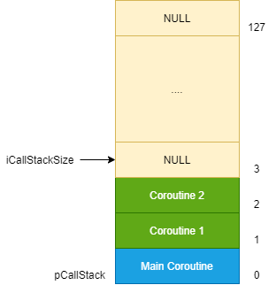
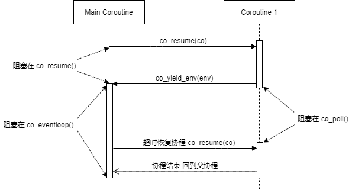
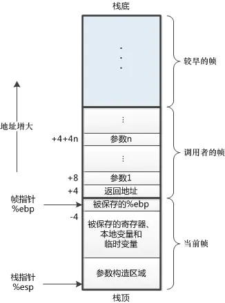
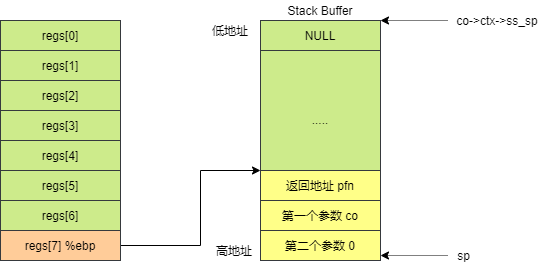
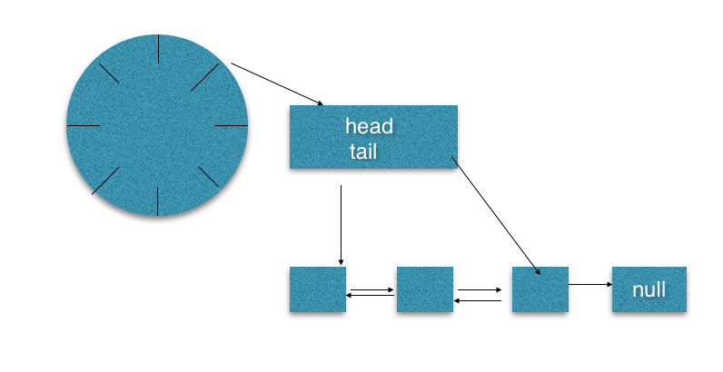
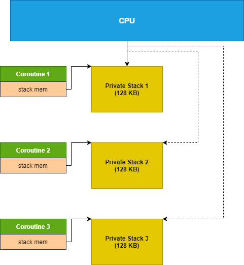
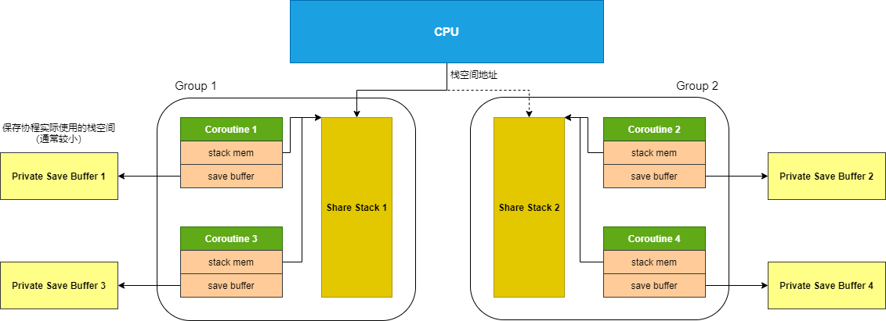

# Libco

<!-- TOC -->

- [Libco](#libco)
  - [Overview](#overview)
  - [APIs](#apis)
    - [co_create](#co_create)
    - [co_release](#co_release)
    - [co_resume](#co_resume)
    - [co_yield_ct](#co_yield_ct)
    - [co_poll](#co_poll)
    - [co_eventloop](#co_eventloop)
    - [Others](#others)
      - [co_enable_hook_sys](#co_enable_hook_sys)
      - [co_disable_hook_sys](#co_disable_hook_sys)
      - [co_get_epoll_ct](#co_get_epoll_ct)
      - [co_self](#co_self)
  - [Core](#core)
    - [Coroutine Swap](#coroutine-swap)
    - [Timeout](#timeout)
    - [Hook System Call](#hook-system-call)
    - [Share Stack](#share-stack)
  - [More](#more)
    - [Specific](#specific)
    - [Coroutine Cond](#coroutine-cond)
  - [References](#references)

<!-- /TOC -->

## Overview

Libco 是一个 C/C++ 协程库，目前被广泛的运用于 Tencent 的各个项目中，尤其是 WeChat 后台。正如 Libco 自己所提到的：

> Libco is a c/c++ coroutine library that is widely used in WeChat services. It has been running on tens of thousands of machines since 2013.

协程的历史已经非常悠久了，但近几年才开始逐步流行起来，目前已有相当多的计算机语言在语法层面就已经支持了协程，例如 Python、Go 等。

对于 C++ 而言，C++20 在标准层面已经对协程进行了支持：

> C++20 introduced standardized coroutines as stackless functions that can be suspended in the middle of execution and resumed at a later point. The suspended state of a coroutine is stored on the heap. Implementation of this standard is ongoing, with the G++ and MSVC compilers currently fully supporting standard coroutines in recent versions.

但目前存在大量的非 C++20 的项目，因此可以看到大多项目都是通过第三方库来实施 C++ 协程，而 Libco 就是其中一个优秀的 C++ 协程库。

本文已经假定读者具有基础的协程知识，并单纯的从源码层面看 Libco 是怎么实现协程的，因此不会对协程本身做太多解释。

另外，虽然 Libco 是使用 C++ 来进行编写的，但是其实现更加接近 C 语言面向过程的风格，因此本文也是通过面向过程的方式来解析这些相关的函数。

Libco 代码巧妙，但是并没有一个详细的接口文档，只能看头文件和 Exampels 来理解其每个接口的作用。本文为了方便浏览，这里给出了一个接口列表。

重要的接口：

APIs | Description
-|-
[int co_create(co, attr, routine, arg)](#co_create)| 创建协程。
[void co_release(co)](#co_release) | 释放协程。
[void co_resume(co)](#co_resume) | 运行目标协程。
[void co_yield_ct()](#co_yield_ct) | 当前协程让出。
[int co_poll(epoll_ctx, fds, nfds, timeout_ms)](#co_poll) | 通过协程重写的 poll 接口，处理非阻塞 fd，也可以进行延时。
[void co_eventloop(epoll_ctx, pfn, arg)](#co_eventloop) | 当前协程进入事件循环。
[stShareStack_t* co_alloc_sharestack(count, stack_size)](#share-stack) | 申请一个共享栈。

Hook 系统调用：

APIs | Description
-|-
[void co_enable_hook_sys()](#co_enable_hook_sys) | 当前协程启动系统调用 Hook、Libco 通过 Hook 机制重写了相关系统调用。
[void co_disable_hook_sys()](#co_disable_hook_sys) | 当前协程关闭系统调用 Hook。
[More System Hook](#hook-system-call) | 请点击 [More System Hook](#hook-system-call) 参考完整的被 Hook 的系统调用。

条件变量接口：

APIs | Description
-|-
[stCoCond_t* co_cond_alloc()](#coroutine-cond) | 生成一个协程条件变量。
[int co_cond_free(co_cond)](#coroutine-cond) | 释放一个协程条件变量。
[int co_cond_signal(co_cond)](#coroutine-cond) | 发送一个信号。
[int co_cond_broadcast(co_cond)](#coroutine-cond) | 对条件变量进行广播。
[int co_cond_timedwait(co_cond, timeout_ms)](#coroutine-cond) | 等待条件变量，直到超时。

辅助性接口：

APIs | Description
-|-
[stCoEpoll* co_get_epoll_ct()](#co_get_epoll_ct) | 获得当前线程使用的 Epoll 对象。
[stCoRoutine_t *co_self()](#co_self) | 获得当前运行的协程对象。

协程隔离接口：

APIs | Description
-|-
[CO_ROUTINE_SPECIFIC(class, object)](#specific) | 定义一个协程私有空间中的对象。
[void *co_getspecific(key)](#specific) | 返回协程私有空间指定 key 的 value。
[int co_setspecific(key, value)](#specific) | 设置协程私有空间指定 key 的 value。

## APIs

这里对 Libco 提供的接口进行挨个分析。

### co_create

通过 `co_create()` 函数创建协程对象。

函数原型：

```cpp
int co_create(stCoRoutine_t **ppco, const stCoRoutineAttr_t *attr, pfn_co_routine_t pfn, void *arg);
```

返回值：

- 固定返回 0

参数：

- `stCoRoutine_t **ppco`，创建的协程对象通过该参数进行返回。
- `stCoRoutineAttr_t *attr`，协程配置，可以设置栈大小，或者使用 Share Stack 模式（该模式在后面介绍）。传递 NULL 时，采用默认配置。结构如下 ：

  ```cpp
  struct stCoRoutineAttr_t {
    int stack_size;
    stShareStack_t*  share_stack;
    stCoRoutineAttr_t()
    {
      // 默认协程的栈大小为 128K，且不采用 Share Stack
      stack_size = 128 * 1024;
      share_stack = NULL;
    }
  }__attribute__ ((packed));
  ```

- `pfn_co_routine_t pfn`, 协程入口函数。

  ```cpp
  typedef void *(*pfn_co_routine_t)( void * );
  ```

- `void *arg`，协程入口函数参数。


一个简单的示例：

```cpp
void* RoutineFunc(void* arg) {
  return NULL;
}

int main() {
  stCoRoutine_t* co = NULL;
  co_create(&co, NULL, RoutineFunc, NULL);

  // 释放
  co_release(co);
  return 0;
}
```

我们可以看到 `co_create()` 的实现：

```cpp
// stCoRoutineEnv_t 是当前线程中的协程运行环境
// 该对象管理了线程中的事件循环，以及协程的启动关系等
// __thread 将该对象进行线程隔离，意味着每个线程都可以运行一个协程环境
static __thread stCoRoutineEnv_t* gCoEnvPerThread = NULL;
stCoRoutineEnv_t *co_get_curr_thread_env() {
  return gCoEnvPerThread;
}

int co_create(stCoRoutine_t **ppco, const stCoRoutineAttr_t *attr, pfn_co_routine_t pfn, void *arg) {
  // 首次进行协程创建，会构建当前协程环境
  if(!co_get_curr_thread_env()) {
    co_init_curr_thread_env();
  }

  // 创建协程，并返回新创建的协程对象
  stCoRoutine_t *co = co_create_env( co_get_curr_thread_env(), attr, pfn,arg );
  *ppco = co;
  return 0;
}
```

首次创建协程时比较特殊，会构建当前协程的运行环境，该环境包含以下信息：

- 协程的启动关系
- Epoll 事件循环对象

除此外，首次创建协程时，会构建一个主协程，也就是当前线程的根协程，由它来调用其他协程，代码如下：

```cpp
// 运行环境
struct stCoRoutineEnv_t {
  // 协程启动关系栈
  stCoRoutine_t *pCallStack[ 128 ];
  // 当前关系栈深度
  int iCallStackSize;
  // Epoll 事件循环对象
  stCoEpoll_t *pEpoll;

  // 为 Share Stack 做准备的，后面会进一步介绍
  stCoRoutine_t* pending_co;
  stCoRoutine_t* occupy_co;
};

void co_init_curr_thread_env() {
  // 准备好环境内存
  gCoEnvPerThread = (stCoRoutineEnv_t*)calloc( 1, sizeof(stCoRoutineEnv_t) );
  stCoRoutineEnv_t *env = gCoEnvPerThread;
  env->iCallStackSize = 0;
  env->pending_co = NULL;
  env->occupy_co = NULL;

  // 准备好环境需要的 Epoll
  stCoEpoll_t *ev = AllocEpoll();
  SetEpoll( env,ev );

  // 准备好主协程，初始化主协程的上下文，并且标识协程为 Main
  struct stCoRoutine_t *self = co_create_env( env, NULL, NULL,NULL );
  coctx_init(&self->ctx);
  self->cIsMain = 1;

  // 将主协程放在启动关系栈的栈底
  env->pCallStack[ env->iCallStackSize++ ] = self;
}

int coctx_init(coctx_t* ctx) {
  memset(ctx, 0, sizeof(*ctx));
  return 0;
}
```

对于协程上下文，这是用于准备协程切换的，在 [Coroutine Swap](#coroutine-swap) 部分会进行讲解。

协程的启动关系是一个栈结构，即 `env->pCallStack`，栈顶由 `env->iCallStackSize` 标识，例如存在以下代码：

```cpp
void* Routine2(void* arg) {
  return NULL;
}

void* Routine1(void* arg) {
  stCoRoutine_t* co2 = NULL;
  co_create(&co2, NULL, Routine1, NULL);
  co_resume(co2);

  // 释放
  co_release(co2);
  return NULL;
}

int main() {
  stCoRoutine_t* co1 = NULL;
  co_create(&co1, NULL, Routine1, NULL);
  co_resume(co1);

  // 释放
  co_release(co1);
  return 0;
}
```

将会生成如下的调用关系栈：



**注意：**

- 协程启动关系并非是函数调用，而是 [co_resume](#co_resume) 启动时的关系。
- 协程启动关系的长度最大为 128，当深度超过 128，就会 Core。
- 在通常应用中，并不会有很深的 [co_resume](#co_resume) 的关系链，因此不会有问题。我们需要避免很深的 [co_resume](#co_resume) 调用。

无论是 Main 协程，还是普通协程，核心都是通过 `co_create_env()` 函数进行创建的，我们再来看看这个协程的创建：

```cpp
struct stCoRoutine_t {
  // 协程运行环境
  stCoRoutineEnv_t *env;
  // 协程入口函数和参数
  pfn_co_routine_t pfn;
  void *arg;

  // 协程上下文，包括了寄存器、栈等指针
  coctx_t ctx;

  // 协程是否开始
  char cStart;
  // 协程是否结束
  char cEnd;
  // 协程是否为主协程
  char cIsMain;
  // 协程是否对系统调用进行 Hook
  char cEnableSysHook;
  // 协程是否使用了 Share Stack 模式
  char cIsShareStack;

  // 协程场景下的环境变量保存
  void *pvEnv;

  //char sRunStack[ 1024 * 128 ];
  stStackMem_t* stack_mem;


  // Share Stack 模式下，Stack 使用冲突时，对协程栈空间进行缓存
  char* stack_sp; 
  unsigned int save_size;
  char* save_buffer;

  // 协程独立的空间，用于模拟 threadlocal，但是是针对协程的
  stCoSpec_t aSpec[1024];

};

struct stCoRoutine_t *co_create_env(stCoRoutineEnv_t * env, const stCoRoutineAttr_t* attr,
                                    pfn_co_routine_t pfn,void *arg ) {
  stCoRoutineAttr_t at;
  if(attr) {
    memcpy( &at,attr,sizeof(at) );
  }

  // 对输入的栈空间参数进行校验和调整
  if( at.stack_size <= 0 ) {
    at.stack_size = 128 * 1024;
  } else if( at.stack_size > 1024 * 1024 * 8 ) {
    at.stack_size = 1024 * 1024 * 8;
  }

  if( at.stack_size & 0xFFF )  {
    at.stack_size &= ~0xFFF;
    at.stack_size += 0x1000;
  }

  // 初始化协程对象
  stCoRoutine_t *lp = (stCoRoutine_t*)malloc( sizeof(stCoRoutine_t) );
  memset( lp,0,(long)(sizeof(stCoRoutine_t))); 

  // 在协程中记录运行环境、协程入口、入口参数
  lp->env = env;
  lp->pfn = pfn;
  lp->arg = arg;

  // 获得协程的栈空间
  stStackMem_t* stack_mem = NULL;
  if( at.share_stack ) {
    // Share Stack 模式，后续章节阐述
    stack_mem = co_get_stackmem( at.share_stack);
    at.stack_size = at.share_stack->stack_size;
  } else {
    // Private Stack 模式，每个协程的栈独立
    stack_mem = co_alloc_stackmem(at.stack_size);
  }
  lp->stack_mem = stack_mem;

  // 构建协程运行时上下文，其中 ss_sp 指向栈空间的内存的首地址，可以认为是栈的最大地址（这个地址不是栈顶，也不是栈底）
  lp->ctx.ss_sp = stack_mem->stack_buffer;
  lp->ctx.ss_size = at.stack_size;

  // 标识协程的启动和结束
  lp->cStart = 0;
  lp->cEnd = 0;

  // 默认不是 Main 协程
  lp->cIsMain = 0;
  // 是否已经 Hook 系统调用，用于将阻塞接口转协程非阻塞，细节后面进行介绍
  lp->cEnableSysHook = 0;
  // 是否采用了 Share Stack 模式
  lp->cIsShareStack = at.share_stack != NULL;

  // 用于 Share Stack 模式下，对自己的栈进行保存
  lp->save_size = 0;
  lp->save_buffer = NULL;

  return lp;
}

stStackMem_t* co_alloc_stackmem(unsigned int stack_size) {
  stStackMem_t* stack_mem = (stStackMem_t*)malloc(sizeof(stStackMem_t));
  // 记录当前是哪个协程的栈在 stack_buffer 中，在 Share Stack 模式下有用
  stack_mem->occupy_co= NULL;

  // 栈空间的大小
  stack_mem->stack_size = stack_size;

  // 协程的栈空间是从堆中分配的
  stack_mem->stack_buffer = (char*)malloc(stack_size);
  stack_mem->stack_bp = stack_mem->stack_buffer + stack_size;
  return stack_mem;
}
```

可以看出，协程分为 Private Stack 和 Share Stack 两种模式，其区别是：

- Private Stack，每个协程都有自己的独立栈空间，协程切换速度快，但是比较费内存。
- Share Stack，协程之间可以共享栈空间，减少内存的消耗，但是切换时可能会涉及栈的复制保存，因此具有一定性能开销。

Share Stack 在 [Share Stack](#share-stack) 部分介绍。

### co_release

对协程的释放，相对而言比较简单，其只是单纯的释放内存空间、栈空间。

函数原型：

```cpp
void co_release(stCoRoutine_t *co);
```

返回值：

- 无返回值

参数：

- `stCoRoutine_t *co`，需要释放的协程。

参考其实现：

```cpp
void co_release(stCoRoutine_t *co) {
  co_free(co);
}

void co_free( stCoRoutine_t *co )
{
  if (!co->cIsShareStack)  {
    // Private Stack 模式
    
    // 直接释放栈空间即可   
    free(co->stack_mem->stack_buffer);
    free(co->stack_mem);
  } else {
    // Share Stack 模式
    
    // 需要释放 save_buff，它 Copy 了协程的栈空间进行保存
    if(co->save_buffer) {
      free(co->save_buffer);
    }

    if(co->stack_mem->occupy_co == co) {
      co->stack_mem->occupy_co = NULL;
    }
  }

  free( co );
}
```

**注意：**

- 虽然实现很简单，但是协程的释放非常重要，如果使用不当，会导致内存泄露。

### co_resume

通过 `co_resume()` 启动一个创建好的协程，或者恢复一个协程的运行。

函数原型：

```cpp
void co_resume(stCoRoutine_t *co);
```

返回值：

- 无返回值

参数：

- `stCoRoutine_t *co`，需要调度运行的协程。

当调用该函数后，CPU 就在对应的协程中进行运行了。这是一个简单的示例：

```cpp
void* RoutineFunc(void* arg) {
  printf("RoutineFunc: Run\n");
  return NULL;
}

int main() {
  printf("Main: Run\n");

  stCoRoutine_t* co = NULL;
  co_create(&co, NULL, RoutineFunc, NULL);

  co_resume(co);
  printf("Main: Back\n");

  // 释放
  co_release(co);
  return 0;
}

/*
$ ./test 
Main Run
RoutineFunc: Run
Main: Back
*/
```

参考其实现：

```cpp
void co_resume(stCoRoutine_t *co) {

  // 获取当前协程
  stCoRoutineEnv_t *env = co->env;
  stCoRoutine_t *curr_co = env->pCallStack[env->iCallStackSize - 1];

  // 构造目标协程的上下文，并且其封装了入口函数
  if( !co->cStart ) {
    coctx_make(&co->ctx, (coctx_pfn_t)CoRoutineFunc, co, 0);
    co->cStart = 1;
  }
  env->pCallStack[env->iCallStackSize++] = co;

  // 协程的切换核心，包括了对栈、寄存器的切换
  co_swap(curr_co, co);
}

// CoRoutineFunc 是协程的真正入口，是对 co_create() 指定的入口函数封装
// 封装了对结束标识的设置，以及在协程运行完成后，自动切换到父协程。
static int CoRoutineFunc(stCoRoutine_t *co, void *) {

  if( co->pfn ) {
    // 进入 co_create() 时指定的协程入口函数
    co->pfn(co->arg);
  }

  // 协程运行完毕
  co->cEnd = 1;

  // 切换到父协程
  co_yield_env(co->env);
  return 0;
}
```

`co_swap(curr_co, co)` 是协程切换的核心，我们暂时认为这是一个黑魔法，可以做到从 lpCurrRoutine，切换到目标协程 co。

除此外，co_yield_env 会回到父协程，在 [co_yield_ct](#co_yield_ct) 中会进行阐述。

**注意：**

- 很明显，当协程运行完成后，它所占用的内存仍然是存在的，它不会进行自动的销毁。

### co_yield_ct

协程通过 `co_yield_ct()` 让出自己对 CPU 的占用，以切换到父协上进行运行。当通过 `co_resume()` 恢复该协程的运行时，会恢复到之前换出的地方继续运行。

函数原型：

```cpp
void co_yield_ct();
```

返回值：

- 无返回值

参数：

- 无

这是一个简单的示例：

```cpp
void* RoutineFunc(void* arg) {
  printf("RoutineFunc: Run\n");
  co_yield_ct();
  printf("RoutineFunc: Back\n");
  return NULL;
}

int main() {
  printf("Main: Run\n");

  stCoRoutine_t* co = NULL;
  co_create(&co, NULL, RoutineFunc, NULL);

  co_resume(co);
  printf("Main: Back\n");

  co_resume(co);
  printf("Main: Back Again\n");

  // 释放协程
  co_release(co);
  return 0;
}

/*
$ ./test
Main: Run
RoutineFunc: Run
Main: Back
RoutineFunc: Back
Main: Back Again
*/
```

其实现如下：

```cpp
void co_yield_ct() {
  // 将当前协程换出，恢复父协程的运行
  co_yield_env(co_get_curr_thread_env());
}

void co_yield_env(stCoRoutineEnv_t *env) {
  // 拿到当前协程和父协程
  stCoRoutine_t *pare = env->pCallStack[env->iCallStackSize - 2];
  stCoRoutine_t *curr = env->pCallStack[env->iCallStackSize - 1];
  env->iCallStackSize--;

  // 恢复到父协程运行
  co_swap(curr, pare);
}
```

### co_poll

协程通过调用 `co_poll()` 可以进行 “阻塞” 的 IO 读写，或者延时。虽然在协程函数看起来调用是 “阻塞” 的，但其实 CPU 会切换到其他协程去工作，直到发生了相应的 IO 或超时事件，才回到该协程处继续执行。

函数原型：

```cpp
int	co_poll(stCoEpoll_t *ctx, struct pollfd fds[], nfds_t nfds, int timeout_ms);
```

返回值：

- 大于 0 时为触发的 fd 的个数。
- 等于 0 代表超时处理。
- 小于 0，意味着调用失败。

参数：

- `stCoEpoll_t *ctx`，是环境的全局 Epoll 对象。
- `struct pollfd fds[]`，poll 的描述符数组，这些描述符用于读写 IO。
- `nfds_t nfds`，描述符数组 fds 的大小。
- `int timeout_ms`，超时时间

该函数原型类似于 Linux 的 [poll()](https://man7.org/linux/man-pages/man2/poll.2.html) 函数，但其实底层是 epoll 实现（Mac OS 中是 kqueue 实现）。

猜想封装成 poll 的形式可能是两个原因：

- 更好的兼容性。
- 更简单的接口。

这是一个简单的使用示例，本示例仅延时超时处理的能力：

```cpp
void* RoutineFunc(void* arg) {
  printf("RoutineFunc: Run\n");

  // sleep one second
  co_poll(co_get_epoll_ct(), NULL, 0, 1000);
  printf("RoutineFunc: Back\n");

  return NULL;
}

int CheckEnd(void* arg) {
  stCoRoutine_t* co = (stCoRoutine_t*) arg;
  return co->cEnd ? -1 : 0;
}

int main() {
  printf("Main: Run\n");

  stCoRoutine_t* co = NULL;
  co_create(&co, NULL, RoutineFunc, NULL);
  co_resume(co); 
  printf("Main: Back\n");


  co_eventloop(co_get_epoll_ct(), CheckEnd, co);
  printf("Main: Fin\n");

  co_release(co);
  return 0;
}

/*
$ ./test
Main: Run
RoutineFunc: Run
Main: Back
RoutineFunc: Back
Main: Fin
*/
```

`co_poll()` 函数需要父协程配合 [co_eventloop](#co_eventloop) 进行使用，在 eventloop 函数中会进行 fd 事件及超时的相关判断。

**注意：**

- CheckEnd，用于判断 eventloop 是否结束，该函数返回 -1 代表结束，否则会一直阻塞。

上述代码的执行时序图是这样的：



参考 co_poll 的实现：

```cpp
int	co_poll(stCoEpoll_t *ctx, struct pollfd fds[], nfds_t nfds, int timeout_ms) {
  return co_poll_inner(ctx, fds, nfds, timeout_ms, NULL);
}

typedef int (*poll_pfn_t)(struct pollfd fds[], nfds_t nfds, int timeout);

// pollfunc 指的是原生的 poll 调用
int co_poll_inner(stCoEpoll_t *ctx,struct pollfd fds[], nfds_t nfds, int timeout, poll_pfn_t pollfunc) {
  // timeout 为 0 时，会走原系统调用
  if (timeout == 0) {
    return pollfunc(fds, nfds, timeout);
  }

  // timeout 小于 0 时，基本意味着永远等待
  if (timeout < 0) {
    timeout = INT_MAX;
  }

  int epfd = ctx->iEpollFd;
  stCoRoutine_t* self = co_self();

  // stPoll_t arg 代表了一次 poll 的参数，其结构后面解释
  stPoll_t& arg = *((stPoll_t*)malloc(sizeof(stPoll_t)));
  memset(&arg, 0, sizeof(arg));

  // 初始化 poll 参数
  arg.iEpollFd = epfd;
  arg.fds = (pollfd*)calloc(nfds, sizeof(pollfd));
  arg.nfds = nfds;

  // 初始化 pPollItems，它们用于记录 fd 的上下文
  arg.pPollItems = (stPollItem_t*)malloc(nfds * sizeof(stPollItem_t));
  memset(arg.pPollItems, 0, nfds * sizeof(stPollItem_t));

  // 当 poll 中的 fd 事件触发时，使用 OnPollProcessEvent 进行处理
  // OnPollProcessEvent 很重要，在这里面会恢复到协程中进行处理
  arg.pfnProcess = OnPollProcessEvent;
  arg.pArg = GetCurrCo( co_get_curr_thread_env() );
  
  // 将 poll 的描述符，添加到 epoll 的 fd 中去，方便后面使用 epoll_wait 进行监听
  for(nfds_t i=0; i<nfds; i++) {
    // 记录 epoll fd 的上下文，方便在 fd 事件触发时，获取这些上下文进行进一步处理
    arg.pPollItems[i].pSelf = arg.fds + i;
    arg.pPollItems[i].pPoll = &arg;
    arg.pPollItems[i].pfnPrepare = OnPollPreparePfn;

    // 将 poll 描述符添加到 epoll 中去
    if (fds[i].fd > -1) {
      // epoll event 结构
      struct epoll_event &ev = arg.pPollItems[i].stEvent;

      // ev.data.ptr 指向了上下文
      ev.data.ptr = arg.pPollItems + i;

      // 将 poll 描述符的事件转换成 epoll 事件
      ev.events = PollEvent2Epoll(fds[i].events);

      int ret = co_epoll_ctl(epfd, EPOLL_CTL_ADD, fds[i].fd, &ev);
      if (ret < 0 && errno == EPERM && nfds == 1 && pollfunc != NULL) {
        free( arg.pPollItems );
        arg.pPollItems = NULL;
        free(arg.fds);
        free(&arg);
        return pollfunc(fds, nfds, timeout);
      }
    }
    // if fail, the timeout would work
  }

  // 将其 stPoll_t 添加到超时队列中去
  unsigned long long now = GetTickMS();
  arg.ullExpireTime = now + timeout;
  int ret = AddTimeout(ctx->pTimeout, &arg, now);
  int iRaiseCnt = 0;
  if( ret != 0 ) {
    co_log_err("CO_ERR: AddTimeout ret %d now %lld timeout %d arg.ullExpireTime %lld",
               ret,now,timeout,arg.ullExpireTime);
    errno = EINVAL;
    iRaiseCnt = -1;
  } else {
    // 切换到父协程去执行，等待父协程唤醒该协程
    co_yield_env(co_get_curr_thread_env());

    // arg.iRaiseCnt 代表了本次 poll 触发了多少个 fd
    iRaiseCnt = arg.iRaiseCnt;
  }

  // 从超时队列中清理掉自己
  RemoveFromLink<stTimeoutItem_t, stTimeoutItemLink_t>(&arg);

  // 从 epoll 中清除 fd
  for(nfds_t i = 0;i < nfds;i++) {
    int fd = fds[i].fd;
    if( fd > -1 ) {
      co_epoll_ctl(epfd, EPOLL_CTL_DEL, fd, &arg.pPollItems[i].stEvent);
    }
    fds[i].revents = arg.fds[i].revents;
  }

  free( arg.pPollItems );
  arg.pPollItems = NULL;
  free(arg.fds);
  free(&arg);

  return iRaiseCnt;
}
```

**注意：**

- 如果 IO 事件触发，会从超时队列中清除掉自己：`RemoveFromLink<stTimeoutItem_t, stTimeoutItemLink_t>(&arg)`，避免触发超时处理。
- 如果等待 IO 超时，会触发对 epoll 相应 fd 的清理，避免 epoll_wait 时收到数据，触发事件处理（已经被超时处理过了）。
- `co_poll()` 可能同时触发多个 fd 事件，外层应该遍历 fd 数组，判断哪些 fd 的事件触发了，这和 Linux 的 poll() 处理是非常类似的。

这里面，非常重要的结构是 stPoll_t，它代表了一次 poll 的参数，同时它也会作为上下文交给 epoll event，方便在 fd 事件触发时进行处理。来看一下其结构：

```cpp
// stTimeoutItem_t 结构，用于处理超时
struct stTimeoutItem_t {
  enum {
    eMaxTimeout = 40 * 1000 //40s
  };

  stTimeoutItem_t *pPrev;
  stTimeoutItem_t *pNext;
  stTimeoutItemLink_t *pLink;

  unsigned long long ullExpireTime;

  OnPreparePfn_t pfnPrepare;
  OnProcessPfn_t pfnProcess;

  void *pArg; // routine 
  bool bTimeout;
};

// 因为 stPoll_t 是继承于 stTimeoutItem_t 的，因此它可以放在超时队列中进行超时的处理
struct stPoll_t : public stTimeoutItem_t  {
  // 本次 poll 的所有 fd
  struct pollfd *fds;
  nfds_t nfds;

  // 本次 poll 的所有 fd 上下文
  stPollItem_t *pPollItems;

  int iAllEventDetach;

  // poll 处理时底层的 epoll fd
  int iEpollFd;

  // 本次 poll io 处理的错误返回
  int iRaiseCnt;
};

struct stPollItem_t : public stTimeoutItem_t {
  struct pollfd *pSelf;
  stPoll_t *pPoll;
  // epoll event
  struct epoll_event stEvent;
};
```

Libco 对超时的处理是有点复杂的，这部分在 [Timeout](#timeout) 中进行阐述。

### co_eventloop

主协程中往往会通过调用 `co_eventloop()` 进入事件循环，对协程的超时、IO 事件进行驱动。该函数调用后，将会阻塞，在满足一定条件的情况下会返回。

函数原型：

```cpp
void co_eventloop(stCoEpoll_t *ctx, pfn_co_eventloop_t pfn, void *arg);
```

返回值：

- 无返回值。

参数：

- `stCoEpoll_t *ctx`，Epoll 对象。
- `pfn_co_eventloop_t pfn`，每次事件循环调用一次，返回 -1 时会结束事件循环。

  ```cpp
  typedef int (*pfn_co_eventloop_t)(void *);
  ```

- `void *arg`，pfn 的参数。

可以参考官方 Examples 的示例：[example_echocli](https://github.com/Tencent/libco/blob/master/example_echocli.cpp)。

参考其实现：

```cpp
void co_eventloop(stCoEpoll_t *ctx, pfn_co_eventloop_t pfn, void *arg) {
  if( !ctx->result ) {
    ctx->result =  co_epoll_res_alloc( stCoEpoll_t::_EPOLL_SIZE );
  }
  co_epoll_res *result = ctx->result;


  for(;;) {
    // epoll 监听的 fd 在 co_poll() 中进行了添加
    int ret = co_epoll_wait(ctx->iEpollFd, result, stCoEpoll_t::_EPOLL_SIZE, 1);

    // 使用队列来记录当前活跃和超时的事件，这些都是需要处理的
    stTimeoutItemLink_t *active = (ctx->pstActiveList);
    stTimeoutItemLink_t *timeout = (ctx->pstTimeoutList);

    memset( timeout,0,sizeof(stTimeoutItemLink_t) );

    // 对触发的 IO 事件进行一个预处理，这个预处理主要是：
    // 1. 将 IO 事件添加到 active 队列中，等待后面处理
    // 2. 将一个 poll 中的 fd 算成 1 次处理，并记录触发了该 poll 中多少个 fd
    // 3. 从超时队列中剔除
    // 4. 在 poll fd 中记录对应的事件触发
    for(int i=0; i<ret; i++) {
      stTimeoutItem_t *item = (stTimeoutItem_t*)result->events[i].data.ptr;

      if(item->pfnPrepare) {
        item->pfnPrepare(item, result->events[i], active);
      }
      else {
        AddTail(active, item);
      }
    }

    // 将超时的事件全部取出来，等待处理
    unsigned long long now = GetTickMS();
    TakeAllTimeout(ctx->pTimeout, now, timeout);

    // 将所有的超时事件设置超时标识
    stTimeoutItem_t *lp = timeout->head;
    while( lp ) {
      lp->bTimeout = true;
      lp = lp->pNext;
    }

    // 合并 timeout 和 active 队列
    Join<stTimeoutItem_t, stTimeoutItemLink_t>(active, timeout);

    lp = active->head;
    while( lp ) {

      // 取出第一个事件
      PopHead<stTimeoutItem_t,stTimeoutItemLink_t>(active);

      // 如果被标识为超时，但是其实没有超时，把它重新添加会超时队列
      // 为什么会有这样的逻辑，不理解为什么会存在误判
      if (lp->bTimeout && now < lp->ullExpireTime)  {
        int ret = AddTimeout(ctx->pTimeout, lp, now);
        if (!ret)  {
          lp->bTimeout = false;
          lp = active->head;
          continue;
        }
      }

      // 对事件进行处理，这里会回到子协程中进行处理
      if( lp->pfnProcess ) {
        lp->pfnProcess(lp);
      }

      lp = active->head;
    }

    // 调用 pfn，返回 -1 则认为事件循环结束
    if(pfn && -1 == pfn(arg)) {
      break;
    }
  }
}

// 对事件进行处理，回到子协程中
void OnPollProcessEvent(stTimeoutItem_t * ap) {
  stCoRoutine_t *co = (stCoRoutine_t*)ap->pArg;
  co_resume( co );
}

// 对事件的预处理
void OnPollPreparePfn(stTimeoutItem_t * ap, struct epoll_event &e, stTimeoutItemLink_t *active)
{
  stPollItem_t *lp = (stPollItem_t *)ap;

  // 转换到 poll fd 对应的事件
  lp->pSelf->revents = EpollEvent2Poll( e.events );

  // 记录本次 epoll_wait 触发了多少个 poll fd
  stPoll_t *pPoll = lp->pPoll;
  pPoll->iRaiseCnt++;

  // 已经添加到 active 队列中了，避免重复添加
  if( !pPoll->iAllEventDetach ) {
    pPoll->iAllEventDetach = 1;

    // 从超时队列中剔除
    RemoveFromLink<stTimeoutItem_t,stTimeoutItemLink_t>(pPoll);
    AddTail(active, pPoll);
  }
}
```

**注意：**

- pstActiveList 队列中不仅包含了 IO 事件，也包含了条件变量触发的事件。
- 如果 IO 事件和超时事件是同时的，会优先处理 IO 事件，并忽略超时事件。这是因为 IO 事件预处理的时候，会把它超时4列表中剔除掉。

### Others

#### co_enable_hook_sys

co_enable_hook_sys 相对简单，就是对 System Hook 进行标识设置。

```cpp
void co_enable_hook_sys() {
  stCoRoutine_t *co = GetCurrThreadCo();
  if( co ) {
    co->cEnableSysHook = 1;
  }
}
```

System Hook 机制详解请参考 [Hook System Call](#hook-system-call)。

#### co_disable_hook_sys

co_disable_hook_sys 相对简单，就是对 System Hook 进行标识设置。

```cpp
void co_disable_hook_sys() {
  stCoRoutine_t *co = GetCurrThreadCo();
  if(co) {
    co->cEnableSysHook = 0;
  }
}
```

System Hook 机制详解请参考 [Hook System Call](#hook-system-call)。

#### co_get_epoll_ct

co_get_epoll_ct 得到线程独立的 epoll，用于驱动事件循环。

```cpp
stCoEpoll_t *co_get_epoll_ct() {
  if( !co_get_curr_thread_env() ) {
    co_init_curr_thread_env();
  }
  return co_get_curr_thread_env()->pEpoll;
}
```

#### co_self

获得当前协程对象。

```cpp
stCoRoutine_t *co_self() {
  return GetCurrThreadCo();
}

stCoRoutine_t *GetCurrThreadCo( ) {
  stCoRoutineEnv_t *env = co_get_curr_thread_env();
  if(!env) return 0;
  return GetCurrCo(env);
}

stCoRoutine_t *GetCurrCo( stCoRoutineEnv_t *env ) {
  return env->pCallStack[env->iCallStackSize - 1];
}
```

## Core

这里对一些核心机制进行阐述。

### Coroutine Swap

上文中提到，当前协程和目标协程的切换依赖于 `co_swap()` 函数，我们这里对其实现进行分析。

这里涉及到一些概念：

- 栈帧，是指为一个函数调用单独分配的那部分栈空间。
- 栈空间，用于存放栈帧的内存空间。

并且这里有三个寄存器特别重要：

- EIP，存放 CPU 下一次执行的指令，代表了代码运行到哪里了。
- ESP，指向当前栈空间/栈帧的栈顶，入栈就是往 ESP 入，因为是往低地址增长，因此入栈会减少 ESP 的值。
- EBP，指向当前函数的栈帧底。

**注意：**

- 寄存器操作中，经常会看到 `%` 符号，这在 AT&T 汇编中的代表了寄存器前缀，例如 `%esp` 代表了 ESP 寄存器。
- EBP 和 ESP 的范围就是当前函数栈帧。

我们从下图可以理解一个函数的入栈过程：



这篇博客中有更加细节的入栈过程：[函数调用时的栈空间变化](https://blog.csdn.net/xi_niuniu/article/details/44978207)。

协程的切换，包括了栈空间的切换，EIP 指令运行的切换，这一切切换的实现，都是基于寄存器切换的。我们看一下 Libco 中，协程是怎么保存寄存器的：

因此，我们的每个协程，都必须由自己的这三个信息，在 Libco 中，这保存在协程的上下文中：

```cpp
struct stCoRoutine_t {
  // ...

  // 上下文
  coctx_t ctx;

  // ...
}

struct coctx_t {
  // 协程中的存放寄存器的值，包括 EIP、EBP 等寄存器
  void *regs[8];

  // 协程所在栈空间指针，指向的是 co->stack_mem->stack_buffer（这个不是栈顶，也不是栈底，而是栈的最大地址）
  size_t ss_size;
  char *ss_sp;
};

//----- --------
// 32 bit
// | regs[0]: ret |
// | regs[1]: ebx |
// | regs[2]: ecx |
// | regs[3]: edx |
// | regs[4]: edi |
// | regs[5]: esi |
// | regs[6]: ebp |
// | regs[7]: eax |  = esp
```

我们在看汇编如何切换寄存器数据时，先看一下是怎么构造这个上下文的：

```cpp
void co_resume(stCoRoutine_t *co) {
  // ...

  // 上下文的构造，在首次启动协程的时候
  if( !co->cStart ) {
    coctx_make(&co->ctx, (coctx_pfn_t)CoRoutineFunc, co, 0);
    co->cStart = 1;
  }

  // ...
}

int coctx_make(coctx_t* ctx, coctx_pfn_t pfn, const void* s, const void* s1) {
  // ctx->ss_sp 指向堆中申请的连续内存空间的首地址，对应的变量为 co->stack_mem->stack_buffer
  // ctx->ss_size 是该连续内存空间的字节数
  // ctx->ss_sp = co->stack_mem->stack_buffer
  // ctx->ss_size = co->stack_mem->stack_size;
  char* sp = ctx->ss_sp + ctx->ss_size - sizeof(coctx_param_t);
  sp = (char*)((unsigned long)sp & -16L);

  // 后面开始设置栈空间的数据

  // 1). 在栈空间中设置返回地址，函数返回时，EIP 将使用该地址作为跳转的目标
  void** ret_addr = (void**)(sp - sizeof(void*) * 2);
  *ret_addr = (void*)pfn;

  // 2). 在栈空间中设置参数，这两个参数位于栈空间的栈底，是切换到协程入口函数时的参数
  coctx_param_t* param = (coctx_param_t*)sp;
  param->s1 = s;
  param->s2 = s1;

  // 将寄存器中的所有内容初始化为 0
  memset(ctx->regs, 0, sizeof(ctx->regs));

  // kESP = 7，初始化栈顶指针，指向 stack buff 的栈顶，后面出栈就是从这里面出了
  ctx->regs[kESP] = (char*)(sp) - sizeof(void*) * 2;
  return 0;
}
```

在上面对上下文进出时候后，协程的上下文布局可能类似于下图（粗略，非严谨）：



后面 CPU 的 %ebp 寄存器将指向 `regs[7]` 的值，进而栈帧切换到协程的 Stack Buffer，并在返回的时候 eip 就会跳到 pfn，并且栈帧中存在对应的两个参数。

C/C++ 是很难做到控制寄存器信息的，因此我们需要借助汇编进行实现，在 Libco 中的切换汇编，因此进行了汇编调用声明，函数形式为：

```cpp
extern "C" {
  extern void coctx_swap(coctx_t* curr_co, coctx_t* pending_co) asm("coctx_swap");
};
```

`coctx_swap()` 函数就是汇编实现了，代码如下：

```s
.globl coctx_swap
.type  coctx_swap, @function

coctx_swap:
  # 保存当前寄存器到 regs 数组中
  # 获得第一个参数，即当前协程的上下文 curr_co
  movl 4(%esp), %eax            # eq: %eax = curr_co->regs[0]
  movl %esp,  28(%eax)          # eq: curr_co->regs[7] = %esp
  movl %ebp, 24(%eax)           # eq: curr_co->regs[6] = %ebp
  movl %esi, 20(%eax)           # eq: curr_co->regs[5] = %esi
  movl %edi, 16(%eax)           # eq: curr_co->regs[4] = %edi
  movl %edx, 12(%eax)           # eq: curr_co->regs[3] = %edx
  movl %ecx, 8(%eax)            # eq: curr_co->regs[2] = %ecx
  movl %ebx, 4(%eax)            # eq: curr_co->regs[1] = %ebx


  # 获得第二个函数入参，即目标协程的上下文 pending_co，由 %eax 指向
  movl 8(%esp), %eax            # eq: %eax = pending_co->regs[0]
  movl 4(%eax), %ebx            # eq: %ebx = pending_co->regs[1]
  movl 8(%eax), %ecx            # eq: %ecx = pending_co->regs[2]
  movl 12(%eax), %edx           # eq: %edx = pending_co->regs[3]
  movl 16(%eax), %edi           # eq: %edi = pending_co->regs[4]
  movl 20(%eax), %esi           # eq: %esi = pending_co->regs[5]
  movl 24(%eax), %ebp           # eq: %ebp = pending_co->regs[6]
  movl 28(%eax), %esp           # eq: %esp = pending_co->regs[7]

  ret
```

**注意：**

- 汇编代码看起来并没有保存 `%eax` 寄存器的值，我猜想是因为 `%eax` 是用于保存返回值的，这个场景中函数不需要返回值。

C/C++ 代码会调用这部分汇编实现（为了简简洁，这里仅给出 Private Stack 模式的逻辑）：

```cpp
// 逻辑非常简单，其实就说封装了一下对汇编的调用
void co_swap(stCoRoutine_t* curr, stCoRoutine_t* pending_co) {
  //swap context
  coctx_swap(&(curr->ctx),&(pending_co->ctx) );
}
```

### Timeout

Libco 的超时处理是有点复杂的，在我们开始阐述 Libco 是如何处理超时前，我们先认识下其原理。

Libco 存在一个时钟轮盘（我姑且叫做这个名称），一圈为 1 分钟，其中有个毫秒针，每个毫秒都会动一下。

其中每个毫秒，都是一个时间点，在一个时间点上可以挂载多个超时事件，这意味着这些事件都是相同的超时时间，并且这些事件在 Libco 中是通过链表来进行连接的：



当毫秒针指向某个时间点时，就需要将该时间点上的所有事件拿出来进行超时处理。

毫秒针的刷新和超时处理，都在 [co_eventloop](#co_eventloop) 函数中，简写如下：

```cpp
void co_eventloop(stCoEpoll_t *ctx, pfn_co_eventloop_t pfn, void *arg) {
  for(;;) {
    // timeout = 1ms
    int ret = co_epoll_wait( ctx->iEpollFd,result,stCoEpoll_t::_EPOLL_SIZE, 1 );

    // 记录超时队列
    stTimeoutItemLink_t *timeout = (ctx->pstTimeoutList);
    memset( timeout,0,sizeof(stTimeoutItemLink_t) );

    // 刷新毫秒针，以及将超时的事件都复制到 timeout 队列中
    unsigned long long now = GetTickMS();
    TakeAllTimeout(ctx->pTimeout, now, timeout);

    // ...
  }
}
```

那我们的时钟轮盘在代码中是什么样的呢？其实 `ctx->pTimeout` 就是我们的时钟轮盘：

```cpp
struct stCoEpoll_t {
  // ...

  // 时钟轮盘对象
  struct stTimeout_t *pTimeout;

  // ...
}


struct stTimeout_t {
  // 每一个 stTimeoutItemLink_t 都是 1 个毫秒时间点
  stTimeoutItemLink_t *pItems;
  // 时间点的个数，因为之前提到了轮盘是一分钟，因此时间点由 60000 个，这个是写死的
  int iItemSize;

  // 协程环境建立后，到现在的时间点
  // 一种类似于墙上时间的时间戳，毫秒级
  unsigned long long ullStart;

  // 毫秒指针走的次数，其实就是代表的毫秒针
  // 因为这是毫秒针走的次数，使用时都会对 iItemSize 进行求余，得到毫秒针的为止
  long long llStartIdx;
};

stCoEpoll_t *AllocEpoll() {
  // ...

  // 时间点个数为 60000 个，即 1 分钟
  ctx->pTimeout = AllocTimeout( 60 * 1000 );
  // ...
}

// 初始化时间轮盘
stTimeout_t *AllocTimeout( int iSize ) {
  stTimeout_t *lp = (stTimeout_t*)calloc( 1,sizeof(stTimeout_t) );	

  lp->iItemSize = iSize;
  lp->pItems = (stTimeoutItemLink_t*)calloc( 1,sizeof(stTimeoutItemLink_t) * lp->iItemSize );

  // 初始化毫秒时间和毫秒针，毫秒针最开始指向 0
  lp->ullStart = GetTickMS();
  lp->llStartIdx = 0;

  return lp;
}
```

之前提到轮盘上的时间点挂载了多个事件，在 Libco 是怎么表示的呢？其实就是一个链表：

```cpp
// 时间轮盘
struct stTimeout_t {
  // 时间点数组，每个时间点都是一个数组
  stTimeoutItemLink_t *pItems;
  // ...
};

// 这里是数组的首尾指针
struct stTimeoutItemLink_t {
  stTimeoutItem_t *head;
  stTimeoutItem_t *tail;
};

// 超时事件 Item
struct stTimeoutItem_t {

  enum {
    eMaxTimeout = 40 * 1000 // 40s
  };

  // 链表连接
  stTimeoutItem_t *pPrev;
  stTimeoutItem_t *pNext;
  stTimeoutItemLink_t *pLink;

  // 超时时间
  unsigned long long ullExpireTime;

  // 事件处理函数
  OnPreparePfn_t pfnPrepare;
  OnProcessPfn_t pfnProcess;

  // 事件处理上下文
  void *pArg;
  bool bTimeout;
};
```

我们现在超时事件对象了，我们再来看一下怎么把超时事件添加到轮盘时间点去：

```cpp
int AddTimeout(stTimeout_t *apTimeout,stTimeoutItem_t *apItem ,unsigned long long allNow) {
  // 前面有一些异常处理

  // 计算超时的间隔
  unsigned long long diff = apItem->ullExpireTime - apTimeout->ullStart;

  // 超时间隔不能超过 iItemSize，即 1 分钟
  if(diff >= (unsigned long long)apTimeout->iItemSize) {
    diff = apTimeout->iItemSize - 1;
  }

  // 将超时项挂到对应的超时点上去，即在对应的超市点链表中，增一个超时项
  AddTail(apTimeout->pItems + (apTimeout->llStartIdx + diff) % apTimeout->iItemSize, apItem );
  return 0;
}
```

接着，我们看一下获取轮盘上超时事件的方法，该方法会同时刷新轮盘毫秒针：

```cpp
inline void TakeAllTimeout(stTimeout_t *apTimeout, unsigned long long allNow, stTimeoutItemLink_t *apResult) {
  // 一些异常处理

  // 计算本次毫秒针划过了多少超时点
  int cnt = allNow - apTimeout->ullStart + 1;
  if( cnt > apTimeout->iItemSize ) {
    cnt = apTimeout->iItemSize;
  }

  for(int i = 0; i < cnt; i++) {
    // 计算超时点位置
    int idx = ( apTimeout->llStartIdx + i) % apTimeout->iItemSize;

    // 将超时点的超时项拼接起来，这些都触发了超时
    Join<stTimeoutItem_t,stTimeoutItemLink_t>( apResult,apTimeout->pItems + idx  );
  }

  apTimeout->ullStart = allNow;
  apTimeout->llStartIdx += cnt - 1;
}
```

### Hook System Call

Libco 将系统函数进行 Hook，以便对系统调用进行封装，这样可以支持将同步调用转协程异步。

系统调用的 Hook 方案采用了 dlysm，这是一种获得符号连接的函数，请参考 [dlysm](https://man7.org/linux/man-pages/man3/dlsym.3.html)。

我们可以在 [co_hook_sys_call](https://github.com/Tencent/libco/blob/master/co_hook_sys_call.cpp) 中看到当前 Hook 了哪些系统调用：

```cpp
// socket 函数
static socket_pfn_t g_sys_socket_func 	= (socket_pfn_t)dlsym(RTLD_NEXT,"socket");
static connect_pfn_t g_sys_connect_func = (connect_pfn_t)dlsym(RTLD_NEXT,"connect");
static close_pfn_t g_sys_close_func 	= (close_pfn_t)dlsym(RTLD_NEXT,"close");
static setsockopt_pfn_t g_sys_setsockopt_func  = (setsockopt_pfn_t)dlsym(RTLD_NEXT,"setsockopt");
static fcntl_pfn_t g_sys_fcntl_func 	= (fcntl_pfn_t)dlsym(RTLD_NEXT,"fcntl");

// IO 函数
static read_pfn_t g_sys_read_func 		= (read_pfn_t)dlsym(RTLD_NEXT,"read");
static write_pfn_t g_sys_write_func 	= (write_pfn_t)dlsym(RTLD_NEXT,"write");
static sendto_pfn_t g_sys_sendto_func 	= (sendto_pfn_t)dlsym(RTLD_NEXT,"sendto");
static recvfrom_pfn_t g_sys_recvfrom_func = (recvfrom_pfn_t)dlsym(RTLD_NEXT,"recvfrom");
static send_pfn_t g_sys_send_func 		= (send_pfn_t)dlsym(RTLD_NEXT,"send");
static recv_pfn_t g_sys_recv_func 		= (recv_pfn_t)dlsym(RTLD_NEXT,"recv");

// Poll 函数
static poll_pfn_t g_sys_poll_func 		= (poll_pfn_t)dlsym(RTLD_NEXT,"poll");
static __poll_pfn_t g_sys___poll_func = (__poll_pfn_t)dlsym(RTLD_NEXT, "__poll");

// 环境变量函数
static setenv_pfn_t g_sys_setenv_func   = (setenv_pfn_t)dlsym(RTLD_NEXT,"setenv");
static unsetenv_pfn_t g_sys_unsetenv_func = (unsetenv_pfn_t)dlsym(RTLD_NEXT,"unsetenv");
static getenv_pfn_t g_sys_getenv_func   =  (getenv_pfn_t)dlsym(RTLD_NEXT,"getenv");
static __res_state_pfn_t g_sys___res_state_func  = (__res_state_pfn_t)dlsym(RTLD_NEXT,"__res_state");

// host 函数
static gethostbyname_pfn_t g_sys_gethostbyname_func = (gethostbyname_pfn_t)dlsym(RTLD_NEXT, "gethostbyname");
static gethostbyname_r_pfn_t g_sys_gethostbyname_r_func = (gethostbyname_r_pfn_t)dlsym(RTLD_NEXT, "gethostbyname_r");
```

对 `dlsym()` 的调用其实并不以为着将系统调用做了什么封装，`dlsym()` 只是为了获得真正系统调用的函数地址，真正的 Hook 在于动态库加载顺序。

将系统调用进行 Hook 的原理：

1. 编写一个 c/cpp 文件，其中包含和系统调用同名的函数，例如 `read()`。
2. 将该 c/cpp 文件生成动态库。
3. 编写应用进程，应用进程加载动态库时，一定要让顺序符号搜索顺序高于系统调用的。
4. 如此，应用进程调用 `read()` 时，就走的是我们自己的逻辑，而不是系统调用的逻辑。

但是，这样做后，就永远无法去使用系统的 `read()` 了，我们在很多情况下还是需要使用系统的 `read()`。那该怎么办？

这时候 `dlsym()` 就排上用场了，它会返回符号的地址，并且当符号按顺序搜索到多个地址时，可以通过设置首个参数为 `RTLD_NEXT`，来获得第二次搜索到该符号的地址：

> Find the next occurrence of the desired symbol in the search order after the current object.  This allows one to provide a wrapper around a function in another shared object, so that, for example, the definition of a function in a preloaded shared object (see LD_PRELOAD in ld.so(8)) can find and invoke the "real" function provided in another shared object (or for that matter, the "next" definition of the function in cases where there are multiple layers of preloading).


这里给出一个简单的封装示例，假设我们想封装 `setenv`，我们应该怎样做：

```cpp
// setenvhook.c

#include <stdio.h>
#include <stdlib.h>
#include <dlfcn.h>

typedef int (*setenv_pfn_t)(const char *name, const char *value, int overwrite);

int setenv(const char *n, const char *value, int overwrite) {
  // 因为设置了 RTLD_NEXT，所以符号搜索顺序，返回第二个该符号的地址
  setenv_pfn_t sys_setenv = (setenv_pfn_t)dlsym(RTLD_NEXT,"setenv");

  printf("hello wrapper\n");
  return sys_setenv(n, value, overwrite);
}
```

我们将 `setenv_hook.cc` 编译成动态库 so 文件：

```sh
$ gcc --shared -fPIC -D_GNU_SOURCE -o libsetenvhook.so setenvhook.c
```

接着，我们再写个测试文件：

```cpp
#include <stdio.h>
#include <stdlib.h>

int setenv(const char *n, const char *value, int overwrite);
int main()
{
    printf("setenv() ret: %d\n", setenv("name", "arthur", 1));
    printf("getenv() ret: %s\n", getenv("name"));
    return 0;
}
```

这里 setenv 会调用我们 Hook 的 setenv 函数，并最终转交给了系统调用处理。我们编译最后的二进制文件：

```sh
# 搜索 setenv 符号的顺序是 libsetenvhook.so, 接着是 libc.so (setenv 系统调用在 libc.so 中)
# 因此 setenv 会使用 libsetenvhook.so 中的符号地址，并且 (setenv_pfn_t)dlsym(RTLD_NEXT,"setenv") 返回 libc.so 的符号地址
$ gcc -g -o hooktest test.c -L./ -lsetenvhook -lc -ldl -Wl,-rpath,./

# 检查一下 so 的搜索路径
$ ldd hooktest 
        linux-vdso.so.1 =>  (0x00007ffc8f7ce000)
        /$LIB/libonion.so => /lib64/libonion.so (0x00007fd653f05000)
        libsetenvhook.so => ./libsetenvhook.so (0x00007fd653bea000)
        libc.so.6 => /lib64/libc.so.6 (0x00007fd653826000)
        libdl.so.2 => /lib64/libdl.so.2 (0x00007fd653622000)
        /lib64/ld-linux-x86-64.so.2 (0x00007fd653dec000)

# 输出，很明显成功封装 setenv 系统调用
$ ./hooktest
hello wrapper
setenv() ret: 0
getenv() ret: arthur
```

那我们调整一下 so 的搜索路径，让 `libc.so` 先被搜索到，这样就不会去使用 `libsetenvhook.so` 中的 `setenv()` 函数了，hook 无法生效：

```sh
# 重新编译 hooktest 让 libc.so 先搜索，取消 libsetenvhook.so 对 setenv() 函数的封装
$ gcc -g -o hooktest test.c -L./ -lc -lsetenvhook -ldl -Wl,-rpath,./

# 检查一下 so 的搜索路径
$ ldd hooktest 
        linux-vdso.so.1 =>  (0x00007ffebcbc9000)
        /$LIB/libonion.so => /lib64/libonion.so (0x00007fb024b08000)
        libc.so.6 => /lib64/libc.so.6 (0x00007fb02462b000)
        libsetenvhook.so => ./libsetenvhook.so (0x00007fb024429000)
        libdl.so.2 => /lib64/libdl.so.2 (0x00007fb024225000)
        /lib64/ld-linux-x86-64.so.2 (0x00007fb0249ef000)

# 输出，此时为直接触发 setenv 系统调用
$ ./hooktest
setenv() ret: 0
getenv() ret: arthur
```

在 libco 中是怎么使用 dlsym 来封装系统调用，并和协程有机结合起来的呢？其中函数太多了，这里使用读 IO 作为例子。

```cpp
#define HOOK_SYS_FUNC(name) if( !g_sys_##name##_func ) { g_sys_##name##_func = (name##_pfn_t)dlsym(RTLD_NEXT,#name); }

ssize_t read( int fd, void *buf, size_t nbyte ) {
  // 获取系统调用的 read() 的符号地址
  HOOK_SYS_FUNC( read );

  // 判断当前协程是否开启了 System Hook，如果没有开启，则使用系统调用
  // Libco 中，所有协程初始化时，System Hook 都是没有开启的
  if( !co_is_enable_sys_hook() ) {
    return g_sys_read_func( fd,buf,nbyte );
  }

  rpchook_t *lp = get_by_fd( fd );
  if(!lp || (O_NONBLOCK & lp->user_flag)) {
    // 如果没有开启非阻塞，直接调用系统调用
    return g_sys_read_func( fd,buf,nbyte );
  }

  // 超时时间
  int timeout = ( lp->read_timeout.tv_sec * 1000 )  + ( lp->read_timeout.tv_usec / 1000 );

  // 通过 poll 等待读完成，这里会切换到父协程，父协程会在读事件/超时事件触发时回到该协程
  struct pollfd pf = { 0 };
  pf.fd = fd;
  pf.events = ( POLLIN | POLLERR | POLLHUP );
  int pollret = poll(&pf, 1, timeout);

  // 读取数据，调用的是系统调用，会判断是否读取成功
  ssize_t readret = g_sys_read_func(fd,( char*)buf, nbyte);
  if( readret < 0 ) {
    co_log_err("CO_ERR: read fd %d ret %ld errno %d poll ret %d timeout %d",
               fd,readret,errno,pollret,timeout);
  }

  return readret;
}

bool co_is_enable_sys_hook() {
  stCoRoutine_t *co = GetCurrThreadCo();
  return (co && co->cEnableSysHook);
}

// 强制限制了 fd 不能超过 102400
static rpchook_t *g_rpchook_socket_fd[102400] = { 0 };
static inline rpchook_t * get_by_fd(int fd)
{
  if(fd > -1 && fd < (int)sizeof(g_rpchook_socket_fd) / (int)sizeof(g_rpchook_socket_fd[0])) {
    return g_rpchook_socket_fd[fd];
  }
  return NULL;
}

// rpc hook 在申请内存时，就确定了读写固定超时时间为 1s
static inline rpchook_t * alloc_by_fd( int fd ) {
  if( fd > -1 && fd < (int)sizeof(g_rpchook_socket_fd) / (int)sizeof(g_rpchook_socket_fd[0]) ) {
    rpchook_t *lp = (rpchook_t*)calloc( 1,sizeof(rpchook_t) );
    lp->read_timeout.tv_sec = 1;
    lp->write_timeout.tv_sec = 1;
    g_rpchook_socket_fd[fd] = lp;
    return lp;
  }
  return NULL;
}
```

这里只给出了对 `read()` 函数的封装，但是其他封装都是类似的，直接看源码即可。

**注意：**

- libco 中，相关网络 IO 的超时时间是固定的，无法人为指定。
- 强制限制了 fd 的最大值不能超过 102400。可以通过 `ulimit -n` 查看系统单进程可以打开的最大 fd（可修改）：

  ```sh
  $ ulimit -n
  65535
  ```

- 协程需要开启了 System Hook，否则走的是默认系统调用：

  ```cpp
  void* Coroutine(void* arg) {
    co_enable_hook_sys();
    // do something
    printf("enable_sys_hook: %d\n", co_is_enable_sys_hook());
    co_disable_hook_sys();
    return NULL;
  }
  ```

### Share Stack

因为涉及道对 Stack 的拷贝复制，因此在 Libco 中，这种模式又被称为 Copy Stack。

我们知道，每个协程应该有自己的栈空间，Libco 的 Private Stack 模式下，会为每个协程生成自己的私有栈空间，栈空间大小可以人为指定，但是默认是 128K。

Private Stack 模式的初始化：

```cpp
struct stCoRoutineAttr_t
{
  int stack_size;
  stShareStack_t*  share_stack;
  stCoRoutineAttr_t()
  {
    // 默认为 128K，且使用 Private Stack 模式
    stack_size = 128 * 1024;
    share_stack = NULL;
  }
}__attribute__ ((packed));

int main() {
  stCoRoutineAttr_t attr;
  attr.stack_size = 128 * 1024;

  stCoRoutine_t co;
  co_create(&co, &attr, RoutineFunc, NULL);

  // 释放协程
  co_release(co);
  return 0;
}
```

Private Stack 模式下，栈空间是由 Libco 自动创建的，其架构图：



很明显，Private Stack 的缺点是 N 个协程，每个协程的栈空间为 M，就会导致创建 N*M 字节的栈空间。假设我要做到 C10K，每个协程会握有连接，所以就需要上万协程，每个协程有自己的 128K 栈空间，就会导致占用几个 G 的内存。

为了减少内存，支持上万协程，我们就可以使用 Share Stack 模式，让所有的协程都共享一个栈空间，协程自己则保存实际使用的栈空间（这个会远小于 128 KB）。

Share Stack 并非只有 1 个共享栈空间，而是可以给协程分组，每一组共享一个栈空间，类似于下图：



上图中有两个 Share Stack，分别将 4 个协程分为两组，这里有两种场景：

- Group 内的协程进行切换，需要将当前 Share Stack 的内容保存到当前协程的 Save Buffer 中。
  - 例如上图中的协程 1 切换至协程 3，因为它们是使用的同一个 Share Stack，因此必须要把此时 Share Stack 1 的内容取出来，复制到 Private Save Buffer 1 中。
- Group 间的协程进行切换，这里又分为 3 种情况：
  - 目标 Group 的 Share Stack 目前未被使用过，此时不需要进行栈数据的复制，直接切换 CPU 寄存器的栈地址即可。
  - 目标 Group 的 Share Stack 的内容已经是目标协程的栈空间了，此时不需要进行栈数据的复制，直接切换 CPU 寄存器的栈地址即可。
  - 目标 Group 的 Share Stack 的内容`不是`目标协程的栈空间，需要把当前目标 Group Share Stack 内容复制到占用该 Share Stack 的协程的 Save Buffer 中去，然后再把目标协程的 Save Buffer 恢复到 Share Stack 上去。

这是一个 Share Stack 的初始化：

```cpp
int main() {
  // 创建 Share Stack
  // Stack 个数为 1（也就是只有 1 个组，所有的协程共享同一个 Share Stack），且占用大小为 128K。
  stShareStack_t* share_stack = co_alloc_sharestack(1, 1024 * 128);
  stCoRoutineAttr_t attr;
  attr.stack_size = 0;
  attr.share_stack = share_stack;

  stCoRoutine_t* co;
  co_create(&co, &attr, RoutineFunc, NULL);
  return 0;
}

struct stShareStack_t {
  // 分配给协程的次数，每次创建协程进行分配，变量加 1，实际效果是轮流分配到各个 Group
  unsigned int alloc_idx;
  // 一个 Share Stack 的大小
  int stack_size;
  // Share Stack 的个数
  int count;
  // 所有的 Share Stack
  stStackMem_t** stack_array;
};

struct stStackMem_t
{
  // 记录当前占用该 Share Stack 的协程
  stCoRoutine_t* occupy_co;
  int stack_size;
  char* stack_bp; // stack_buffer + stack_size
  char* stack_buffer;
};

// 分配一个指定 Group 数量的 Share Stack
stShareStack_t* co_alloc_sharestack(int count, int stack_size) {
  stShareStack_t* share_stack = (stShareStack_t*)malloc(sizeof(stShareStack_t));
  share_stack->alloc_idx = 0;
  share_stack->stack_size = stack_size;

  //alloc stack array
  share_stack->count = count;
  stStackMem_t** stack_array = (stStackMem_t**)calloc(count, sizeof(stStackMem_t*));

  // 分配 count 个 Share Stack，即将协程分成 count 个组
  for (int i = 0; i < count; i++) {
    stack_array[i] = co_alloc_stackmem(stack_size);
  }
  share_stack->stack_array = stack_array;
  return share_stack;
}
```

每次创建协程时，会为这个协程配置 Share Stack：

```cpp
struct stCoRoutine_t *co_create_env( stCoRoutineEnv_t * env, const stCoRoutineAttr_t* attr,
    pfn_co_routine_t pfn,void *arg )
{
  // ...

  stCoRoutine_t *lp = (stCoRoutine_t*)malloc( sizeof(stCoRoutine_t) );

  // 为协协程分配 Share Stack
  if( at.share_stack )
  {
    stack_mem = co_get_stackmem( at.share_stack);
    at.stack_size = at.share_stack->stack_size;
  }

  lp->stack_mem = stack_mem;

  // ...

  return lp;
}

static stStackMem_t* co_get_stackmem(stShareStack_t* share_stack) {
  if (!share_stack) {
    return NULL;
  }
  // 分配到的 Share Stack 编号（对应的 Group）
  int idx = share_stack->alloc_idx % share_stack->count;
  share_stack->alloc_idx++;

  // 求余，即进行轮流 Group 分配
  return share_stack->stack_array[idx];
}
```

我们搞清楚协程如何分配对应的 Share Stack 后，再来看一下协程交换时，对 Share Stack 做了什么动作：

```cpp
// 为了方便展示，下面仅给出 Share Stack 的处理逻辑

void co_swap(stCoRoutine_t* curr, stCoRoutine_t* pending_co)
{
   stCoRoutineEnv_t* env = co_get_curr_thread_env();

  // 获得当前栈顶地址，方便未来计算已用的栈空间
  char c;
  curr->stack_sp= &c;


  env->pending_co = pending_co;

  // 目标协程的 Share Stack 当前被哪个协程占用
  // 如果 Share Stack 被其他协程占用，则需要让将 Share Stack 复制到占用的协程 save_buffer 中
  stCoRoutine_t* occupy_co = pending_co->stack_mem->occupy_co;
  if (occupy_co && occupy_co != pending_co) {
    // 将 Share Stack 的内容复制到 occupy_co 协程中的 save buffer 进行保存
    save_stack_buffer(occupy_co);
  }

  // 标识 Share Stack 已被目标协程占用
  pending_co->stack_mem->occupy_co = pending_co;

  // 缓存一下之前占用 Share Stack 的协程
  env->occupy_co = occupy_co;

  //swap context
  coctx_swap(&(curr->ctx),&(pending_co->ctx) );

  stCoRoutineEnv_t* curr_env = co_get_curr_thread_env();

  // 之前占用 Share Stack
  stCoRoutine_t* update_occupy_co =  curr_env->occupy_co;

  // 切换的目标协程（其实已经是当前协程了）
  stCoRoutine_t* update_pending_co = curr_env->pending_co;

  // 切换到目标线程去后，还需要将目标线程的 save buffer 内容复制到 Share Stack 去，恢复栈空间
  if (update_occupy_co && update_pending_co && update_occupy_co != update_pending_co) {
    // 恢复 save buffer 到 Share Stack
    if (update_pending_co->save_buffer && update_pending_co->save_size > 0) {
      memcpy(update_pending_co->stack_sp, update_pending_co->save_buffer, update_pending_co->save_size);
    }
  }
}

void save_stack_buffer(stCoRoutine_t* occupy_co) {
  // Share Stack 内存空间，并且计算得到实际已用的栈空间大小：栈底(stack_bp) - 栈顶(stack_sp)
  stStackMem_t* stack_mem = occupy_co->stack_mem;
  int len = stack_mem->stack_bp - occupy_co->stack_sp;

  // 将 save buffer 原本的内容进行释放
  if (occupy_co->save_buffer) {
    free(occupy_co->save_buffer), occupy_co->save_buffer = NULL;
  }

  // 申请新的 save buffer 用来保存栈空间
  occupy_co->save_buffer = (char*)malloc(len);
  occupy_co->save_size = len;
  memcpy(occupy_co->save_buffer, occupy_co->stack_sp, len);
}
```

## More

这里对一些 Libco 辅助机制进行探讨，包括：

- 协程私有数据
- 协程条件变量

### Specific

Specific 代表了协程的私有数据（不清楚为什么叫 Specific 名称），可以参考官方示例 [example_specific](https://github.com/Tencent/libco/blob/master/example_specific.cpp)。

我们需要通过 `CO_ROUTINE_SPECIFIC(Class, object)` 来声明一个 object 对象，该 object 对象是协程隔离的。

为了做到协程隔离，这里生成的 object 并非是 Class 类型，而是某个 Proxy 类型，这个 Proxy 代理了从协程私有空间获取数据的逻辑。

我们来看一下是怎么声明协程私有 object 的：

```cpp
#define CO_ROUTINE_SPECIFIC( name,y )                                             \
                                                                                  \
static pthread_once_t _routine_once_##name = PTHREAD_ONCE_INIT;                   \
static pthread_key_t _routine_key_##name;                                         \
static int _routine_init_##name = 0;                                              \
static void _routine_make_key_##name()                                            \
{                                                                                 \
   (void) pthread_key_create(&_routine_key_##name, NULL);                          \
}                                                                                 \
template <class T>                                                                \
class clsRoutineData_routine_##name                                               \
{                                                                                 \
public:                                                                           \
  inline T *operator->()                                                          \
  {                                                                               \
    if( !_routine_init_##name )                                                   \
    {                                                                             \
      pthread_once( &_routine_once_##name,_routine_make_key_##name );             \
      _routine_init_##name = 1;                                                   \
    }                                                                             \
    T* p = (T*)co_getspecific( _routine_key_##name );                             \
    if( !p )                                                                      \
    {                                                                             \
      p = (T*)calloc(1,sizeof( T ));                                              \
      int ret = co_setspecific( _routine_key_##name,p) ;                          \
            if ( ret )                                                            \
            {                                                                     \
                if ( p )                                                          \
                {                                                                 \
                    free(p);                                                      \
                    p = NULL;                                                     \
                }                                                                 \
            }                                                                     \
    }                                                                             \
    return p;                                                                     \
  }                                                                               \
};                                                                                \
                                                                                  \
static clsRoutineData_routine_##name<name> y;
```

从上面逻辑中，可以看出 `y->` 会从协程私有空间中获取真实的对象，因为是从协程私有空间获取的，因此是协程隔离的。

协程私有空间的读写：

```cpp
// 读私有空间
void *co_getspecific(pthread_key_t key) {
  stCoRoutine_t *co = GetCurrThreadCo();
  if(!co || co->cIsMain) {
    return pthread_getspecific( key );
  }
  return co->aSpec[ key ].value;
}

// 写私有空间
int co_setspecific(pthread_key_t key, const void *value) {
  stCoRoutine_t *co = GetCurrThreadCo();
  if( !co || co->cIsMain ) {
    return pthread_setspecific( key,value );
  }

  co->aSpec[ key ].value = (void*)value;
  return 0;
}
```

### Coroutine Cond

协程条件变量的实现还是比较简单的，可以直接参考官方示例 [example_cond.cpp](https://github.com/Tencent/libco/blob/master/example_cond.cpp)。

我们来看一下它的实现，首先是条件变量对象结构体：

```cpp
// 条件对象就是一个队列，队列中的每一项代表了一个等待的协程
struct stCoCond_t {
  stCoCondItem_t *head;
  stCoCondItem_t *tail;
};

struct stCoCondItem_t 
{
  stCoCondItem_t *pPrev;
  stCoCondItem_t *pNext;
  stCoCond_t *pLink;

  // 这个保存了当前项对应的协程
  stTimeoutItem_t timeout;
};

stCoCond_t *co_cond_alloc() {
  return (stCoCond_t*)calloc( 1,sizeof(stCoCond_t) );
}

int co_cond_free(stCoCond_t * cc) {
  free( cc );
  return 0;
}
```

很明显，一个条件变量就是一个队列，这个队列就是当前阻塞等待的所有协程，唤醒时就是从队列中取出协程进行恢复。

协程等待一个条件变量其本质就是往队列中添加一项，并阻塞等待条件触发：

```cpp
// 等待一个条件变量，直到超时
int co_cond_timedwait(stCoCond_t *link, int ms) {
  // 队列中 push 一项，并记录协程信息
  stCoCondItem_t* psi = (stCoCondItem_t*)calloc(1, sizeof(stCoCondItem_t));
  psi->timeout.pArg = GetCurrThreadCo();
  psi->timeout.pfnProcess = OnSignalProcessEvent;   // 条件触发时，进行 co_resume 恢复协程的执行

  // 如果有超时事件，则在超时队列中添加，以便进行超时处理
  if(ms > 0) {
    unsigned long long now = GetTickMS();
    psi->timeout.ullExpireTime = now + ms;

    int ret = AddTimeout(co_get_curr_thread_env()->pEpoll->pTimeout, &psi->timeout, now);
    if( ret != 0 )
    {
      free(psi);
      return ret;
    }
  }

  // 往队列中添加一项，然后等待条件触发
  AddTail(link, psi);
  co_yield_ct();

  // 条件已触发，从条件变量队列中删除自己
  RemoveFromLink<stCoCondItem_t, stCoCond_t>(psi);
  free(psi);

  return 0;
}
```

通过条件变量，唤醒一个协程：

```cpp
int co_cond_signal( stCoCond_t *si )
{
  // 取出一个等待的协程
  stCoCondItem_t * sp = co_cond_pop( si );
  if(!sp) {
    return 0;
  }

  // 从超时队列中删除该协程，避免超时回调
  RemoveFromLink<stTimeoutItem_t,stTimeoutItemLink_t>(&sp->timeout);

  // 添加到 active 队列，在 eventloop 下次中会触发协程的运行
  AddTail(co_get_curr_thread_env()->pEpoll->pstActiveList, &sp->timeout);

  return 0;
}
```

通过条件变量，唤醒多个协程：

```cpp
int co_cond_broadcast( stCoCond_t *si ) {
  // 遍历取出所有的等待协程，全都放到 active 队列，等待 eventloop 中进行处理
  for(;;) {
    stCoCondItem_t * sp = co_cond_pop( si );
    if( !sp ) return 0;
    RemoveFromLink<stTimeoutItem_t,stTimeoutItemLink_t>( &sp->timeout );

    AddTail( co_get_curr_thread_env()->pEpoll->pstActiveList,&sp->timeout );
  }

  return 0;
}
```

**注意：**

- 对条件变量进行通知时，并不会立即取其中的协程运行，而是直到 eventloop 处理时才会回到协程。

## References

1. [Libco](https://github.com/Tencent/libco)
1. [微信开源 C++ 协程库 Libco –- 原理与应用](https://blog.didiyun.com/index.php/2018/11/23/libco/)
1. [函数调用时的栈空间变化](https://blog.csdn.net/xi_niuniu/article/details/44978207)
1. [poll()](https://man7.org/linux/man-pages/man2/poll.2.html)
1. [dlysm](https://man7.org/linux/man-pages/man3/dlsym.3.html)
