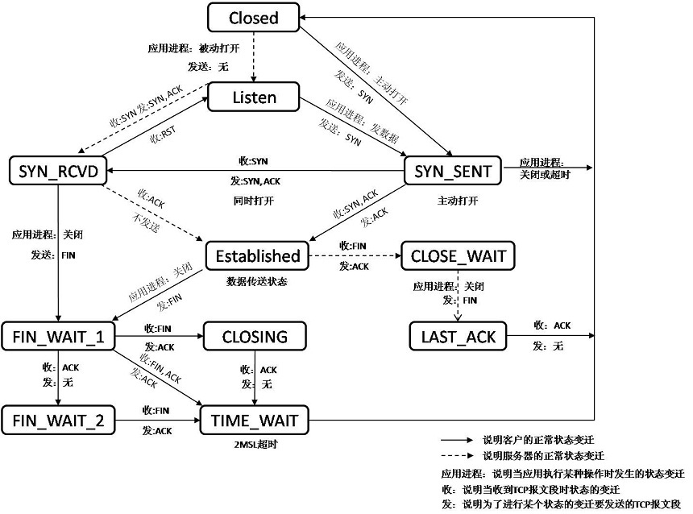
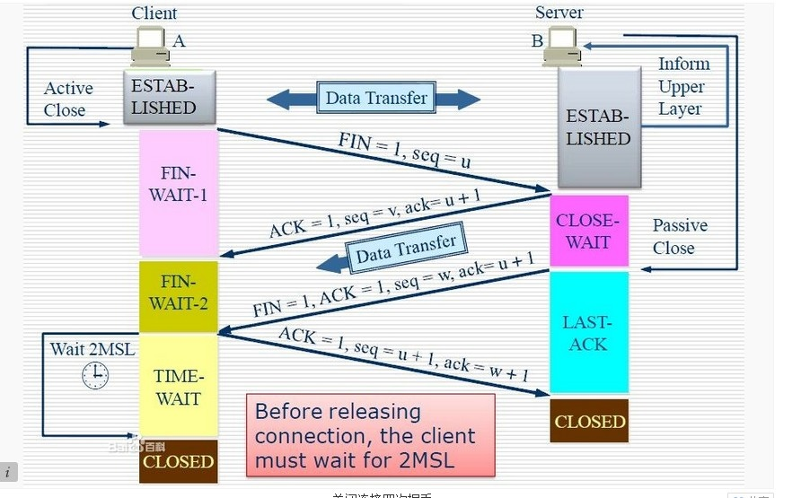
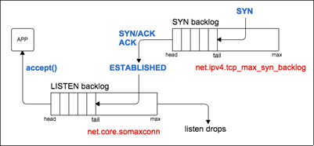

# Network

<!-- TOC -->

- [Network](#network)
    - [常用 Linux 命令](#常用-linux-命令)
        - [netstat](#netstat)
        - [路由表](#路由表)
        - [ifconfig](#ifconfig)
        - [ss](#ss)
        - [arp](#arp)
        - [sar](#sar)
        - [nmap](#nmap)
        - [ping](#ping)
    - [网络协议分层体系](#网络协议分层体系)
        - [链路层](#链路层)
        - [网络层](#网络层)
        - [传输层](#传输层)
    - [Socket](#socket)
        - [常用相关参数](#常用相关参数)
        - [listen](#listen)
        - [syn flood](#syn-flood)
        - [文件描述符限制](#文件描述符限制)
    - [TCP核心点](#tcp核心点)
        - [建立链接](#建立链接)
        - [断开链接](#断开链接)
        - [连接队列](#连接队列)
    - [附录、工作中遇到的问题](#附录工作中遇到的问题)
        - [响应 502 问题](#响应-502-问题)
        - [CURL 域名解析耗时大](#curl-域名解析耗时大)
    - [附录二、参考文献](#附录二参考文献)

<!-- /TOC -->

## 常用 Linux 命令

整理了常用的判断网络问题的 Linux 命令。

### netstat

```sh
netstat -antp
```

- a, 显示全部
- -n, 避免反向解析ip名称
- -t, 只显示tcp套接字
- -p, 显示进程相关信息

```sh
$ netstat -antp

Active Internet connections (servers and established)
Proto Recv-Q Send-Q Local Address           Foreign Address         State       PID/Program name
tcp        0      0 0.0.0.0:9999            0.0.0.0:*               LISTEN      31258/python3.6
tcp        0      0 0.0.0.0:80              0.0.0.0:*               LISTEN      -
tcp        0      0 0.0.0.0:22              0.0.0.0:*               LISTEN      -
tcp        0      0 0.0.0.0:8888            0.0.0.0:*               LISTEN      20567/python3.6
tcp        0      0 0.0.0.0:8889            0.0.0.0:*               LISTEN      11735/python3.6
tcp        0      0 0.0.0.0:443             0.0.0.0:*               LISTEN      -
tcp        0      0 172.26.175.115:35619    172.26.175.116:8888     TIME_WAIT   -
tcp        0      0 172.26.175.115:443      139.207.107.151:35436   ESTABLISHED -
tcp        0      0 172.26.175.115:27701    172.26.175.116:3306     ESTABLISHED 20572/python3.6
tcp        0     36 172.26.175.115:22       183.14.135.253:64234    ESTABLISHED -
tcp        0      0 172.26.175.115:17751    172.26.175.115:8888     TIME_WAIT   -
tcp        0      0 172.26.175.115:27749    172.26.175.116:3306     ESTABLISHED 20576/python3.6
tcp        0      0 172.26.175.115:443      112.10.89.167:6956      ESTABLISHED -
```

- Proto, 表示套接字的协议，我们通常观察tcp套接字
- 对于 listen 的 socket
  - Recv-Q, accept queue中存在的全连接socket
  - Send-Q, accept queue的长度
- 对于非 listen 的 socket:
  - Recv-Q, socket的内核接收缓冲区
    - 接收缓冲区满后, 没有读出来, 可能会导致对端的发送缓冲区撑满，进而对端的同步发送函数会阻塞。
    - 接收缓冲区空时，同步socket的读函数会阻塞。
  - Send-Q, socket的内核发送缓冲区
    - 写socket的函数返回后，代表用户态数据交给了内核发送缓冲区，但是不代表数据已经发送到对端。
    - 发送缓冲区满后，会导致同步socket写函数阻塞
- Local Address, socket的本地地址
- Foreign Address, socket的对端地址
- state, socket所处的状态
- PID/Program name, 持有该socket的进程信息

可以通过 `-s` 参数查看系统协议栈的全局情况：

```sh
$ netstat -s

# 只列出部分
Ip:
    526292759 total packets received
    0 forwarded
    0 incoming packets discarded
    526292756 incoming packets delivered
    527972404 requests sent out
    2 reassemblies required
    1 packets reassembled ok
Tcp:
    22351239 active connections openings
    17901288 passive connection openings
    510539 failed connection attempts
    1683211 connection resets received
    149 connections established
    522163853 segments received
    556769841 segments send out
    14052066 segments retransmited
    52950 bad segments received.
    3385536 resets sent
    InCsumErrors: 8325
...
```

### 路由表

路由表的命令有两种:

- `ip route show table ${table}`, 显示指定路由表。
  - table表示路由表, 通常可选:local, default, main, all, 其中all表示显示全部路由表。
  - 不指定table时, 默认选手main路由表的信息, 这个表中有回环的路由信息, 优先级最高。
  - `/etc/route2/tb_tables`, 保存了当前Linux的所有路由表.
  - `ip rule`, 显示当前路由表的选择策略.不仅可以根据源ip选择使用哪个路由表, 也可以显示各个表的路由表优先级。值越小优先级越高。
- `route -n`, 查路由表。
- 在一个路由表中, 可能一个目标地址有多个匹配，路由表会采取最精确匹配。

### ifconfig

查网卡状态

### ss

netstat 被 ss 代替了, ss 的执行速度更快。ss 的参数兼容 netstat，也有自己的一套命令参数。

### arp

查看arp缓存, `arp -n`可以直接显示 ip。

### sar

- `sar -n DEV 1`, 查看网卡相关的收发包信息
- `sar -n TCP 1`, 查看TCP相关的收发包信息
- `sar -n IP 1`, 查看IP相关的收发包信息

### nmap

这个不是linux自带的，centos需要通过`yum -y install nmap`来进行安装。该命令可以用于扫描端口。

`nmap -sT -p ${port} ${ip}`, -sT表示建立TCP的三次握手。

### ping

主要讲几个参数:

- -f, flood, 洪水一般的发包, 尽可能多的发包。
- -s, 指定一个包的长度。

## 网络协议分层体系

ISO/OSI网络模型:

- 应用层
- 会话层
- 表现层
- 传输层
- 网络层
- 链路层
- 物理层

TCP/IP协议模型:

- 应用层
- 传输层
- 表现层
- 链路层
- 物理层, TCP/IP协议模型不包括该层, 但是承认该层存在。

### 链路层

解决网络拓扑结构问题，我们常用的是总线型结构。不同的组网形式，底层的通信协议不一致，链路层将底层通信协议输入输出接口统一, 也约定了不同的组网如何进行通信。

需要注意arp既不属于链路层，也不属于网络层。

链路层称数据为Frame, 帧。

### 网络层

链路层确定了各个局部的组网, 网络层将不同的组网联系起来。网络层称数据为Packet, 报文。

### 传输层

解决传输的质量问题。传输层称数据为Segment, 段。

## Socket

socket属于内核空间。

```c
int socket(domain, type, protocol)
```

- domain，通过 `AP_INET` 指定 IPvs 类型的 socket。
- type，选择 udp（`SOCKET_DGRAM`）和 tcp（`SOCKET_STREAM`）。
- protocol，基于 ip 协议，通常填 0。

### 常用相关参数

创建完 socket 后，可以在程序里可以控制一下参数 `setsocket()`:

- `SO_LINGER`, 用于控制socket函数close和shutdown的行为.
  - 正常情况下， linger关闭, 关闭者发起FIN包，走正常的四次挥手关闭。
  - linger配置打开，关闭者直接发RST包，自己就关闭了，不走四次挥手。可以作为`time_wait`过多时的第二方案。
  - 直接发rst进行关闭，会直接忽略内核发送缓冲区的数据，直接进行关闭。
- `SO_RCVBUF`, socket的内核接收缓存
  - 若建立socket没有指定rcvbuf大小，会采用`/proc/sys/net/core/rmem_default`的大小
  - 若人为设定了值，实际使用的是该值翻倍后的大小，但是不能超过`/proc/sys/net/core/rmem_max`，若超过了会被限幅。
- `SO_SNDBUF`, socket的内核发送缓存
  - 若建立socket没有指定rcvbuf大小，会采用`/proc/sys/net/core/wmem_default`的大小
  - 若人为设定了值，实际使用的是该值翻倍后的大小，但是不能超过`/proc/sys/net/core/wmem_max`，若超过了会被限幅。
- `SO_REUSEPORT`, 新版本内核的配置，让多个进程可以在同一个socket上监听，老版本如果多个进程监听同一个socket，会有惊群现象。

### listen

```c
int listen(int sockfd, int backlog);
```

主要是强调下backlog参数, 这个是AcceptQueue队列的大小，即全连接队列的大小。`listen_sock.accept()`就是在AcceptQueue中获取全连接状态的socket的。

- `/proc/sys/net/core/somax_conn` 中记录了AcceptQueue队列长度的最大值, backlog参数若超过该值则实际队列大小取该值。
- 补充下 `/proc/sys/net/ipv4/tcp_max_syn_backlog` 记录了SynQueue队列长度的最大值。这个状态是很占内存的，不能设置太大。

### syn flood

在建立三次连接的时候，客户端发送了syn包，服务器将会维持半连接，并将半连接的socket放在SynQueue空间中, 半连接状态非常耗费内存。

消耗内存的原因是，半连接要维护客户端的相关信息，等到客户端响应ack的时候，方便根据客户端的信息取出正确的半连接socket。

若恶意的客户端只发送syn包，不发送ack包，则服务器将会始终维护半连接socket，直到超时。客户端发起大量的syn包，撑满服务器的SynQueue，则服务器将会拒绝别的正常用户的syn包，无法和正常用户建立三次握手。

为了解决这样的问题，需要配置`/proc/sys/net/ipv4/tcp_syncookies`, 可以将客户端的连接匹配信息进行md5，避免消耗那么大的内存, 这样就能保存大量的半连接socket了。只会在SynQueue撑满时，才会进行md5的处理。

### 文件描述符限制

因为socket其实也是文件描述符，这里给出文件描述符的个数限制：

- `/proc/sys/fs/file-max`, 定义了最多的文件描述符个数
- `/proc/sys/file-nr`, 显示了 3 个数字: `${已经使用的 fd 个数} ${可以被回收的 fd 个数} ${最多的 fd 个数}`
- `ulimit -n`

## TCP核心点



### 建立链接

### 断开链接

断开连接是一个4次挥手的过程，目的在于通信双发都确定自己通信结束，并且数据包在网络中不再存在。



**TIME_WAIT**

- TIME_WAIT 的目的
  - 确保对端发送的数据在连接关闭前全部接收到。
  - TIME_WAIT 的持续时间通常是 2MSL，这是因为如果 ACK 丢包，会让对端重新发送 FIN 包，两个包一共的存活时间是 2MSL。
- 相关配置
  - `/proc/sys/net/ipv4/tcp_max_tw_buckets`, 限制了timewait状态的socket个数。
    - 需要注意，timewait的socket虽然不怎么占资源，但是timewait的socket在内部维护了红黑树，为了平衡红黑树的代价会很大，内核占cpu的比例会上升。
    - 为了避免内核占cpu的比例上升，可以把这个值改小。改小后，可能会导致不可靠关闭的可能性增加，另一端的等待延时可能会增加。
  - `/proc/sys/net/ipv4/tcp_tw_recyle`
  - `/proc/sys/net/ipv4/tcp_tw_reuse`

**LAST_ACK**

被动关闭的一端在发送FIN后，会进入 LAST_ACK，等待请求关闭的一方发送 ACK，这时候有如下情形：

- 接收到 ACK，正式关闭连接。
- 重新发送 FIN，根据对端不同的状态会有不同的处理：
  - 对端处于 FIN_WAIT_2 状态或者 TIME_WATI 状态，都会发送 ACK 包。
  - 对端处于已经关闭的状态，会发送 RST 包，接收到后关闭。
- FIN 包始发出去后一直没有响应，LAST_ACK 在持续一段时间后，会自动关闭连接。
  - 对端如果接收到过 FIN 包，说明对端已经进入 TIME_WAIT 了，打开最后都进行了关闭。
  - 对端如果没有接收到过 FIN 包，则自己重发 FIN 包，因为连接已经关闭，所以收到一个 RST，自己也就随之关闭。

### 连接队列

连接队列分为两种:

- 半连接队列, 服务器接收到客户端发送的SYN包后就会建立半连接，并将半连接放入`syns queue`。
- 全连接队列, 服务器接收到客户端响应的ACK包后，会将连接从`syns queue`移动到`accept queue`。
- 上面两种均统称backlog。

状态变更和队列:



- syns queue的大小由`net.ipv4.tcp_max_syn_backlog`参数决定
- accept queue的大小由`listen(fd, backlog)`中的backlog参数和`net.core.somaxconn`参数一同决定，取最小值。

- syns queue如果满了
  - `syncookies=0` 且 `tcp_abort_on_overflow=0`, 服务器会直接忽略掉新的SYN包。
  - `syncookies=0` 且 `tcp_abort_on_overflow=1`, 服务器会响应RST包。
  - `syncookies=1` 服务器会对客户端信息进行hash以映射到半连接socket，理论上此时可以无限制半连接个数。
- accept queue如果满了
  - `tcp_abort_on_overflow=0`, 则会直接忽略掉三次握手最后的ACK, 但是不会从syn queue中删除。会重发syn+ack，触使客户端重发ack，若此时accept queue有空则将连接设置为全连接。若多次重试也没有empty，则最终服务器发送RST。
  - `tcp_abort_on_overflow=1`, 服务器会直接响应RST，拒绝连接。

## 附录、工作中遇到的问题

只做个人记录

### 响应 502 问题

- 问题背景: 现网 A 请求返回 502。
- 问题特征:
  1. ngx 的错误日志记录后台 upstream server 没有一个可用。`no live upstreams while connecting to upstream`
  1. ngx 没有 core, server 也没有 core，502 响应为偶现。
  1. 人为循环发起该请求，可以复现 502 响应，1 分钟会出现 10 次左右。
  1. 测试环境不会响应 502。
  1. server 的 TIME WAIT 状态的 socket 量很大。
- 问题原因
  1. 定位后发现，server 有大量的 B 请求响应 404。server并未在http上注册对请求B的处理。
  1. 大部分 http 服务器对响应 404 的连接会直接断开，实际上就是断开的 server 和 ngx 的连接，导致 server 存在大量 TIME WAIT。
  1. server 频繁断开连接，TIME WAIT 过多，对应 ip 和端口的 socket 被耗尽, 导致 ngx 无法重新连接 server, 该 server 的其他请求会直接在 ngx 返回502 。
- 问题解决：
  1. ngx 直接拒绝掉 B 请求。
  1. 或可以在服务器上注册请求 B, 进行返回错误的处理。若业务没有特殊需要，建议使用上一种解决方法。

### CURL 域名解析耗时大

通过下面的命令请求时，CURL 的 DNS 解析很慢。

```sh
$ curl -o output.txt -s -w time_namelookup:"\t"%{time_namelookup}"\n"time_connect:"\t\t"%{time_connect}"\n"time_appconnect:"\t"%{time_appconnect}"\n"time_pretransfer:"\t"%{time_pretransfer}"\n"time_starttransfer:"\t"%{time_starttransfer}"\n"time_total:"\t\t"%{time_total}"\n"time_redirect:"\t\t"%{time_redirect}"\n" "https://login.wegame.com.cn/web/oauth2.0/token"

time_namelookup:        2.511
time_connect:           2.517
time_appconnect:        2.612
time_pretransfer:       2.612
time_starttransfer:     2.627
time_total:             2.627
time_redirect:          0.000
```

但是 ping、dig 的解析却很快，甚至用 wget 请求也能很快获得响应。采用 dns 解析抓包：

```sh
$ tcpdump -i eth0 -nt -s 500 port domain

tcpdump: verbose output suppressed, use -v or -vv for full protocol decode
listening on eth0, link-type EN10MB (Ethernet), capture size 500 bytes
IP 192.168.0.84.40988 > 100.100.2.136.domain: 28740+ A? login.wegame.com.cn. (37)
IP 100.100.2.136.domain > 192.168.0.84.40988: 28740 1/0/0 A 58.247.205.101 (53)
IP 192.168.0.84.58245 > 100.100.2.136.domain: 62560+ AAAA? login.wegame.com.cn. (37)
```

可以观察到 curl 和 wget 发起请求时，发起了 A 和 AAAA 解析，但是 AAAA 解析非常慢，但是 curl 会等待 A 和 AAAA 都返回时才会发起请求，wget 会选择最先返回的记录发起请求。再通过 dig 对域名进行解析：

```sh
# A 记录很快返回
dig @100.100.2.136 A login.wegame.com.cn

# AAAA 记录超时
dig @100.100.2.136 AAAA login.wegame.com.cn

# 8.8.8.8 解析 AAAA 记录很快返回
dig @8.8.8.8 AAAA login.wegame.com.cn
```

`100.100.2.136` 是阿里云的 DNS Resolver，联系阿里云后反馈是权威 DNS 返回慢导致的。联系 `login.wegame.com.cn` 负责人后，刷新了域名的 SOA 记录，AAAA 记录解析正常。

## 附录二、参考文献

- [TCP 半连接队列和全连接队列](https://www.itcodemonkey.com/article/5834.html)
- [使用 curl 命令分析请求的耗时情况](https://cizixs.com/2017/04/11/use-curl-to-analyze-request/)
