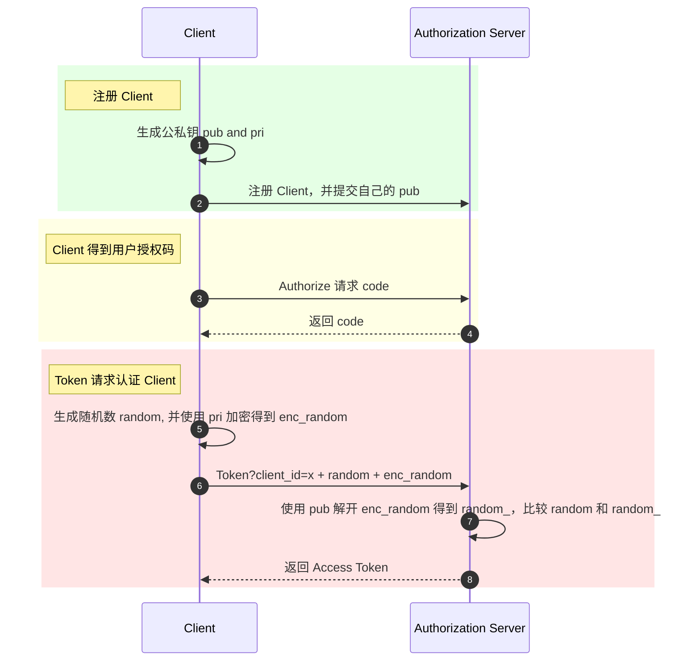
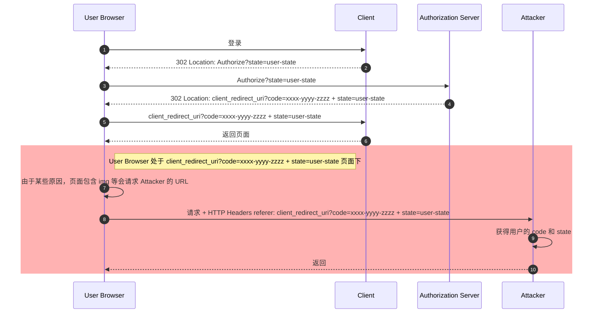
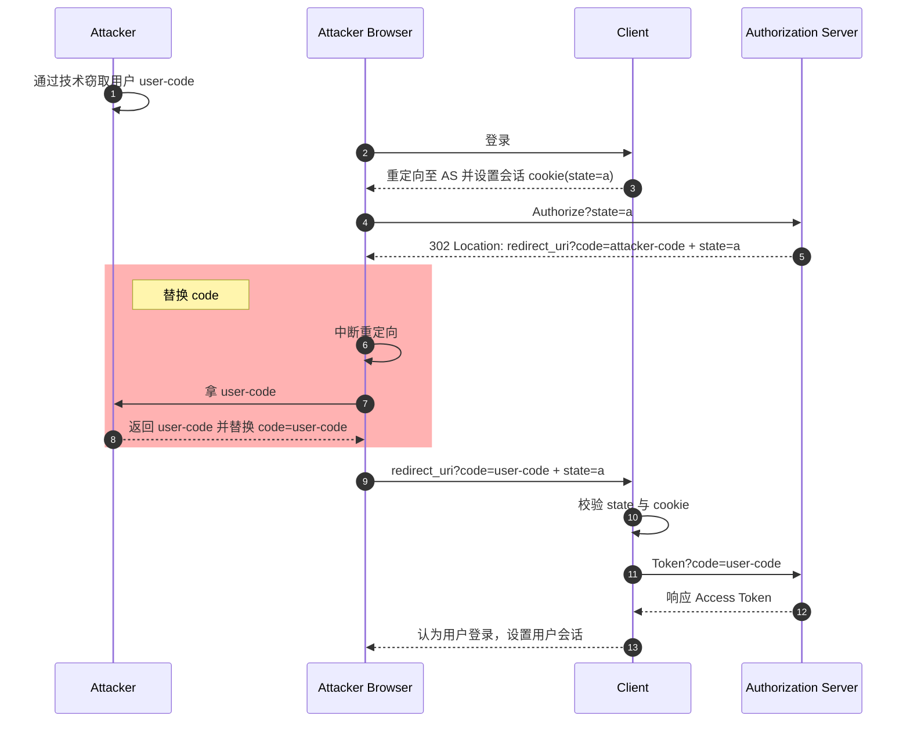
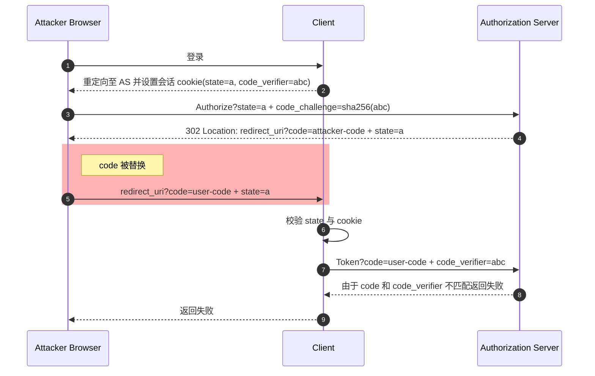
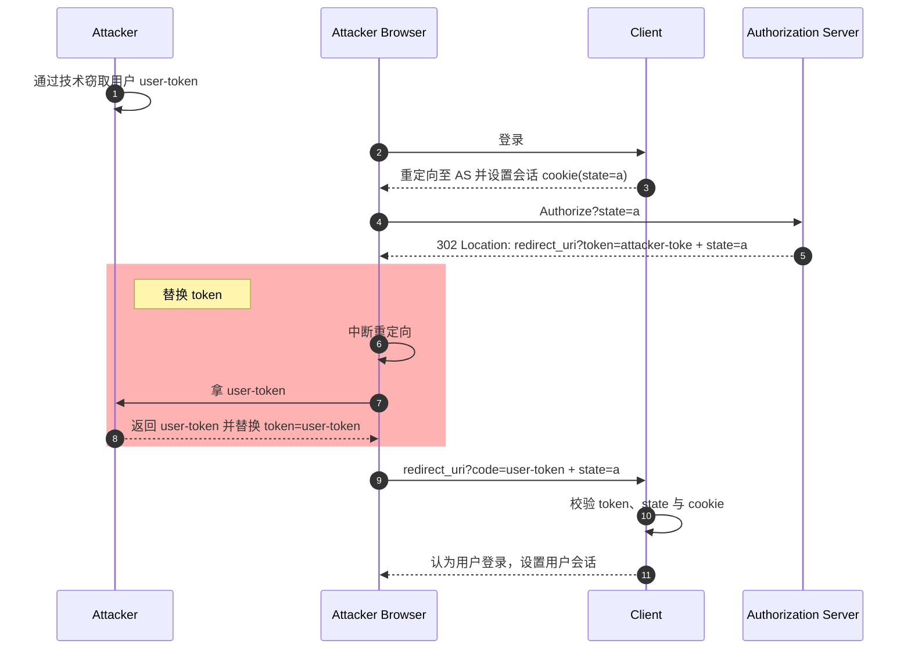
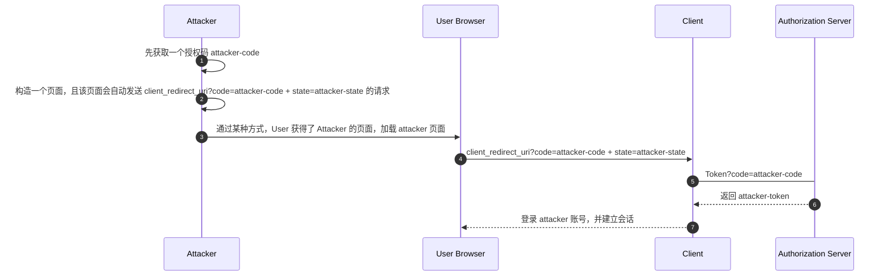
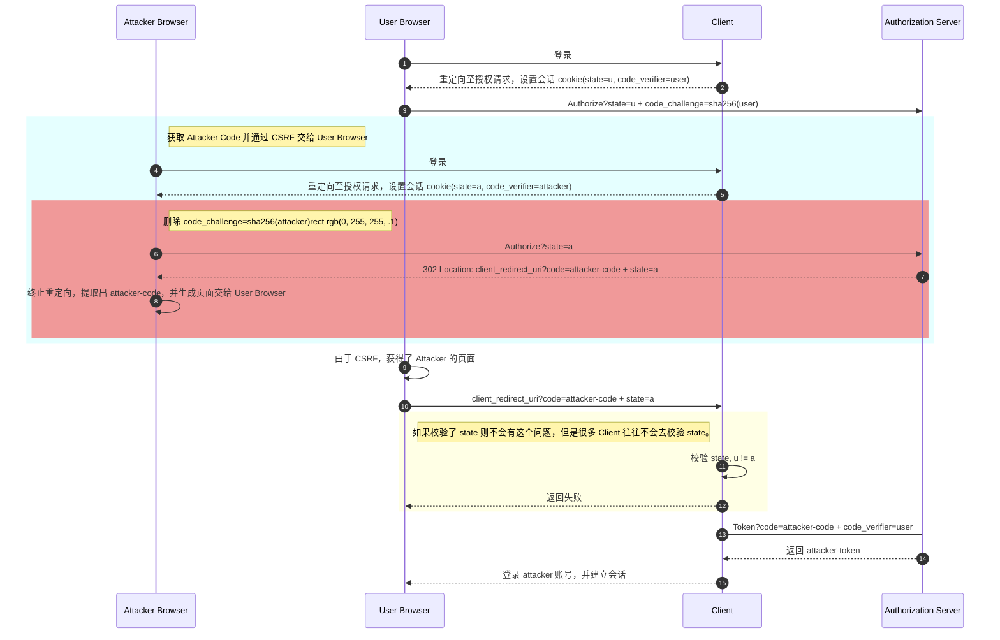
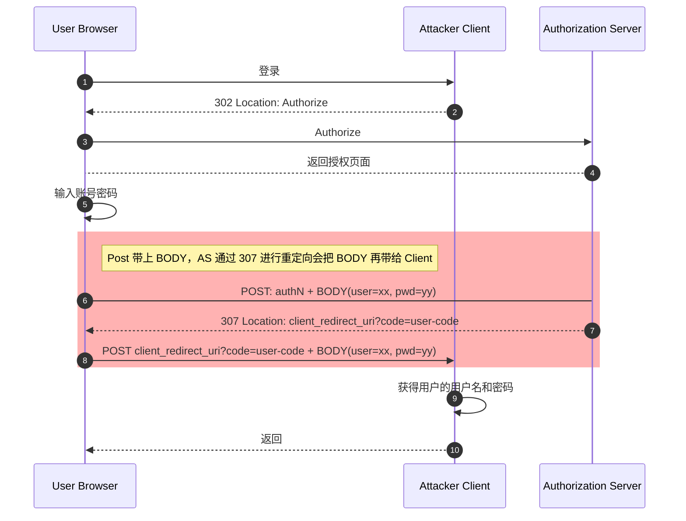
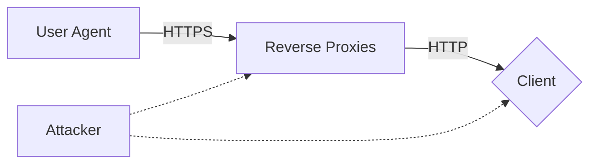

# OAuth 2.0 Security Best Current Practice

<!-- TOC -->

- [OAuth 2.0 Security Best Current Practice](#oauth-20-security-best-current-practice)
    - [Overview](#overview)
    - [Recommendations](#recommendations)
        - [Protecting Redirect-Based Flows](#protecting-redirect-based-flows)
        - [Token Replay Prevention](#token-replay-prevention)
        - [Access Token Privilege Restriction](#access-token-privilege-restriction)
        - [Resource Owner Password Credentials Grant](#resource-owner-password-credentials-grant)
        - [Client Authentication](#client-authentication)
        - [Other Recommendations](#other-recommendations)
    - [The OAuth 2.0 Attacker Model](#the-oauth-20-attacker-model)
    - [Attacks and Mitigation](#attacks-and-mitigation)
        - [Insufficient Redirect URI Validation](#insufficient-redirect-uri-validation)
        - [Credential Leakage via Referer Headers](#credential-leakage-via-referer-headers)
        - [Credential Leakage via Browser History](#credential-leakage-via-browser-history)
        - [Mix-Up Attacks](#mix-up-attacks)
        - [Authorization Code Injection](#authorization-code-injection)
        - [Access Token Injection](#access-token-injection)
        - [Cross Site Request Forgery](#cross-site-request-forgery)
        - [PKCE Downgrade Attack](#pkce-downgrade-attack)
        - [Access Token Leakage at the Resource Server](#access-token-leakage-at-the-resource-server)
        - [Open Redirection](#open-redirection)
        - [307 Redirect](#307-redirect)
        - [TLS Terminating Reverse Proxies](#tls-terminating-reverse-proxies)
        - [Refresh Token Protection](#refresh-token-protection)
        - [Client Impersonating Resource Owner](#client-impersonating-resource-owner)
        - [Click jacking](#click-jacking)
    - [References](#references)

<!-- /TOC -->

## Overview

本文主要参考 [draft-ietf-oauth-security-topics-18](https://datatracker.ietf.org/doc/html/draft-ietf-oauth-security-topics)，并对其进行总结和梳理。

该文档会涵盖 OAuth2.0 最新的最佳安全实践。

本文的一些术语：

Term | Description
-|-
Client | 本文提到的 Client 若没有特殊提及，均指的是在 OAuth 注册的 Client
AS | Authorization Server，授权服务器
RS | Resource Server，资源服务器
RO | Resource Owner，资源所有者

其他相关术语均来自 [The OAuth 2.0 Authorization Framework](https://www.rfc-editor.org/rfc/rfc6749.html)。

## Recommendations

这部分是 OAuth 工作小组推荐的 OAuth 实施方式，这里面涉及到的一些攻击会在 [Attacks and Mitigation](#attacks-and-mitigation) 部分提到。

### Protecting Redirect-Based Flows

保护基于重定向的流程。

当比较 Client 授权请求的 Redirect URI 和注册的 URI 时，一定要使用完全匹配的方式。这样的措施可以减少授权码 code 和 Access Token 泄漏的可能。请参考 [Insufficient Redirect URI Validation](#insufficient-redirect-uri-validation)。

Client 和 AS 一定不能提供 Open Redirector，否则容易导致 Code 和 Token 的泄漏，也容易导致构造钓鱼网站，请参考 [Open Redirection](#open-redirection)。

Client 必须要防止 CSRF 攻击：

- 如果 AS 支持 PKCE 可以使用 PKCE 机制来提供 CSRF 保护。
- 如果 AS 支持 OpenID Connect，则可以使用 nonce 提供 CSRF 保护。
- 如果都不支持，可以使用 state 来提供 CSRF 保护，请参考 [Cross Site Request Forgery](#cross-site-request-forgery)。

**授权码流程**

Client 必须防止 code 的注入攻击：

- 对于 Public Client 可以使用 PKCE 来防止注入攻击。
- 对于机密 Client 同样可以使用 PKCE，除此外也可以使用 OIDC 的 nonce 来防注入。

AS 也必须防止 PKCE 降级攻击，请参考 [PKCE Downgrade Attack](#pkce-downgrade-attack)。

**隐式流程**

Implicit Flow 相比于授权码流程更容易泄漏 Access Token，请参考 [Insufficient Redirect URI Validation](#insufficient-redirect-uri-validation)、[Credential Leakage via Referer Headers](#credential-leakage-via-referer-headers) 和 [Credential Leakage via Browser History](#credential-leakage-via-browser-history)。

此外，不存在某种方式将 Implicit Flow 响应的 Access Token 和 Client 进行绑定，进而无法在 RS 上对 Access Token 进行重放攻击的防范。

综上，应该尽量避免使用 Implicit Flow 分发 Access Token。

### Token Replay Prevention

对于 Token 的重放攻击的预防。

#### Access Token

授权服务器或资源服务器应该使用 sender-constraining 的 Access Token 来避免 Token 重放，例如 Mutual TLS for OAuth 2.0。

可参考 [Access Token Leakage at the Resource Server](#access-token-leakage-at-the-resource-server) 的讨论。

#### Refresh Tokens

刷新令牌防重放攻击，需要考虑对 sender-constraining 或者使用 Refresh Token Rotation 的策略。

可参考 [Refresh Token Protection](#refresh-token-protection) 的讨论。

### Access Token Privilege Restriction

Access Token 的特权应该被限制为应用所需要的最低限度，这样可以阻止 Client 获得超出所有者授权范围的特权，也可以防止用户超出各自安全策略的授权。

特权限制有助于减少 Access Token 泄漏带来的危害。

特别的，Access Token 应该被限制到某个具体的 RS 上。为此，授权服务器应该将 Access Token 与 RS 关联起来（一般通过 Audience 进行关联）。每个 RS 也应该验证 Access Token 是否可以应用在该 RS 上。

Clients 和 AS 可以利用参数 scope 和 resource 指定 Access Token 权限范围以及可以访问的资源服务器。

**注意：**

- resource 参数由文档 [draft-ietf-oauth-resource-indicators](https://datatracker.ietf.org/doc/html/draft-ietf-oauth-resource-indicators-08) 提出。

### Resource Owner Password Credentials Grant

一定不能使用资源所有者的 Password Credential 授权方式，这种方式将不安全的向 Client 暴露资源所有者的 Credential，即便这是一个良性的 Client。

### Client Authentication

Authorization servers 应该尽可能的去验证 Client 的身份。

推荐的方式是采用非对称密钥（基于公钥），例如 [mTLS](https://www.rfc-editor.org/rfc/rfc8705.html) 和 [private_key_jwt](https://openid.net/specs/openid-connect-core-1_0.html#ClientAuthentication)。

这是一个非标准流程，一种简单的 Client 认证方式：



### Other Recommendations

[OAuth Metadata](https://www.rfc-editor.org/rfc/rfc8414.html) 的使用可能会帮助提升 OAuth 部署时的安全性：

- 确保相关安全特性和新的 OAuth 特性可以自动的兼容相关软件库。
- 减少 Client 错误配置的机会，例如配置了错误的 endpoint URLs。
- 便于加密密钥的 Rotation。

建议 AS 根据 [OAuth Metadata](https://www.rfc-editor.org/rfc/rfc8414.html) 发布 Metadata 信息，并由 Client 获取这些信息配置自己。

建议使用端到端的 TLS，如果在中间人终止 TLS，请参考 [TLS Terminating Reverse Proxies](#tls-terminating-reverse-proxies)。

## The OAuth 2.0 Attacker Model

攻击者模型描述了可能存在的攻击者。

OAuth 必须确保 Resource Owner(RO) 在 Authorization Server(AS) 的授权，以及后续的使用 Access Token  访问 Resource Server(RS) 受到保护，以抵御以下攻击者的攻击：

Attacker | Description
-|-
A1 | Web Attackers，可以控制任意数量的网络端点（包括浏览器和服务器，RO、AS 和 RS 除外）。A1 可能会设置 RO 所访问的网站，操作用户代理以及传输协议。
A2 | Network Attackers，可以窃听、操作和欺骗网络消息，除非这些消息受 TLS 保护。A2 也可以阻止任意消息。
A3 | 能够读取，但是不能修改授权`响应`的攻击者。
A4 | 能够读取，但是不能修改授权`请求`的攻击者。
A5 | 攻击者可以获得 AS 颁发的访问令牌。

对攻击者模型更详细的阐述请参考 [The Updated OAuth 2.0 Attacker Model](https://www.ietf.org/archive/id/draft-ietf-oauth-security-topics-18.html#name-the-updated-oauth-20-attack)。

## Attacks and Mitigation

后面介绍 OAuth 常见攻击和保护策略。

### Insufficient Redirect URI Validation

重定向 URI 验证不足。

某些 AS 服务器允许 Client 注册重定向 URI Pattern（例如正则表达式），而不是完整的重定向 URI。AS 在收到 Authorize 请求时会将 redirect_uri 参数与注册的 Redirect URI Pattern 进行匹配。这种方式的好处是允许 Client 将一些 runtime 参数放到 redirect_uri 中，一个注册可以使用多个不同的 redirect_uri。

与精确匹配相比，这种方式实现更加复杂，并且易于引入错误。重定向 URI 验证不足，可能使得对 Client 的认证不充分，并导致 Attacker 获取授权码 Code 甚至 Access Token。

**授权码流程的重定向 URI 验证攻击**

对于使用授权码流程的 Client，可能会遭受如下攻击：

1. Client 注册了 Redirect URI Pattern: `https://*.somesite.example/*`，目的是允许所有的 `.somesite.example` 子域名 URI 都是 Client 有效的 Redirect URI。
1. AS 愚蠢的没有对域名中的 `*` 进行限制，而是理解成任意字符串，进而 AS 可能会认为 `https://attacker.example/.somesite.example` 这是一个有效的重定向 URI。
1. Attacker 可能进行如下攻击：
   1. Attacker 诱惑用户打开其特制的页面：`https://www.evil.example`。
   1. 该 URL 向 AS 发起授权请求，并且使用的 Client ID 来自于合法的 Client。

    ```text
    GET /authorize?response_type=code&client_id=s6BhdRkqt3&state=9ad67f13
        &redirect_uri=https%3A%2F%2Fattacker.example%2F.somesite.example HTTP/1.1
    Host: server.somesite.example
    ```

    1. 用户会看到由 AS 下发的授权页面，并且该页面显示为合法的且用户已知的 Client 授权。用户不认识重定向 URI，也无法感知到重定向 URI 指向 Attacker。
    1. 用户授权后，Attacker 会拿到授权码 code。

对于 Public Client，Attacker 将会直接拿到用户的 Token。

对于 Confidential Client，Attacker 会进一步使用 Code 注入攻击，请参考 [Authorization Code Injection](#authorization-code-injection)。

即便是 AS 限制了域名中的 `*` 只能匹配域名，其实仍然可能存在问题：

>  If an attacker manages to establish a host or subdomain in somesite.example, he can impersonate the legitimate client. This could be caused, for example, by a subdomain takeover attack subdomaintakeover, where an outdated CNAME record (say, external-service.somesite.example) points to an external DNS name that does no longer exist (say, customer-abc.service.example) and can be taken over by an attacker (e.g., by registering as customer-abc with the external service).

**隐式流程的重定向 URI 验证攻击**

上述攻击同样适用于隐式流程，即如果 Attacker 可以使得授权响应发送到 Attacker 控制的 URI，则 Attacker 可以从 Fragment 中拿到 Access Token。

对于隐式流程，用户则可能会进一步受到攻击，该攻击依赖于一个事实和一个前提：

- 一个事实：如果重定向的 Location 中不包含 Fragment，则会使用原始请求中的 Fragment。
- 一个前提，Client 是一个 Open Redirector，请参考 [Open Redirection](#open-redirection)。
  - 即 Client 公开了一个 Redirector，可以允许重定向到任何 URL。
  - 例如 Client 允许 `https://client.somesite.example/cb?redirect_to=https://attacker.example/cb` 重定向到 `https://attacker.example/cb`。

攻击流程 如下：

1. Client 注册的 Redirect URL Pattern 是 `https://client.somesite.example/cb?*`。
1. Attacker 诱惑用户打开其特制的页面：`https://www.evil.example`。
1. 该 URL 向 AS 发起授权请求，并且使用的 Client ID 来自于合法的 Client。

   ```text
   GET /authorize?response_type=token&state=9ad67f13
        &client_id=s6BhdRkqt3
        &redirect_uri=https%3A%2F%2Fclient.somesite.example
                      %2Fcb%26redirect_to%253Dhttps%253A%252F%252Fattacker.example%252F HTTP/1.1
   Host: server.somesite.example
   ```

1. AS 在进行授权请求校验后，将 Access Token 重定向至 Redirect URI：

   ```text
   HTTP/1.1 303 See Other
   Location: https://client.somesite.example/cb?
               redirect_to%3Dhttps%3A%2F%2Fattacker.example%2Fcb
               #access_token=2YotnFZFEjr1zCsicMWpAA&...
   ```

1. 因为 Open Redirector 的存在，Client 进一步重定向：

   ```text
   HTTP/1.1 303 See Other
   Location: https://attacker.example/
   ```

1. 因为 Location 中没有包含 Fragment，这导致使用原始请求中的 Fragment，所以实际的重定向请求是：

   ```text
   https://attacker.example/#access_token=2YotnFZFEjr1z..
   ```

1. 最终 Attacker 拿到了用户的 Access Token。


**应对措施**

- 首要建议是使用精确的 Redirect URI 匹配来避免这些问题，避免可能存在的异常场景。
- 接收 OAuth 重定向请求的 Redirect URI 一定不能提供 Redirector。
- Client 在重定向时，可以使用任意 Fragment 来屏蔽掉原始请求的 Fragment，例如 `#_`。
- Client 应该使用授权码流程，而非 Implicit Flow。

### Credential Leakage via Referer Headers

机密信息可能会由于 Referer 头泄露给 Attacker。以下信息可能会泄露：

- code / access_token。
- state，这可能会导致 csrf 防御措施失效。

**Leakage from the OAuth Client**

作为一个成功授权请求的结果，Client 很可能会直接渲染一个页面，页面可能会：

- 包含了 Attacker 的页面连接，并且用户可能点击该链接。
- 包含了 Attacker 的 iframe、img 等。

一旦用户浏览器请求到了 Attacker，Attacker 便容易从 referer 中提取到 code 和 state，甚至可能有 access_token（例如 Implicit Flow）。

例如浏览器可能在以下 URL 渲染一个页面：

```text
https://your.site.com/auth/callback?code=xxxx-yyyy-zzzz&state
```

在该页面发起的请求 referer 中会包含 `https://your.site.com/auth/callback?code=xxxx-yyyy-zzzz&state` 内容。



**Leakage from the Authorization Server**

类似的方法，如果 Authorization Endpoint 如果包含了到 Attacker 的链接，则 Attacker 将会获取到 state。

例如浏览器可能在以下 URL 渲染一个页面：

```text
https://oauth.authorization.endpoint.com/oauth/v1/authorize?client_id=xxx&response_type=code&state=123456
```

在该页面发起的请求 referer 中会包含 `https://oauth.authorization.endpoint.com/oauth/v1/authorize?client_id=xxx&response_type=code&state=123456` 内容。

**Countermeasures**

解决措施有：

- 使用适当的 Referrer Policy 来抑制 Referer 的发送。

  ```text
  // 整个 Referer  首部会被移除。访问来源信息不随着请求一起发送。
  Referrer-Policy: no-referrer

  // 在没有指定任何策略的情况下用户代理的默认行为。
  // 在同等安全级别的情况下，引用页面的地址会被发送(HTTPS->HTTPS)，但是在降级的情况下不会被发送 (HTTPS->HTTP)。
  Referrer-Policy: no-referrer-when-downgrade

  // 在任何情况下，仅发送文件的源作为引用地址。
  // 例如  https://example.com/page.html 会将 https://example.com/ 作为引用地址。
  Referrer-Policy: origin

  // 对于同源的请求，会发送完整的URL作为引用地址，但是对于非同源请求仅发送文件的源。
  Referrer-Policy: origin-when-cross-origin

  // 对于同源的请求会发送引用地址，但是对于非同源请求则不发送引用地址信息。
  Referrer-Policy: same-origin

  // 在同等安全级别的情况下，发送文件的源作为引用地址(HTTPS->HTTPS)，但是在降级的情况下不会发送 (HTTPS->HTTP)。
  Referrer-Policy: strict-origin

  // 对于同源的请求，会发送完整的URL作为引用地址；
  // 在同等安全级别的情况下，发送文件的源作为引用地址(HTTPS->HTTPS)；在降级的情况下不发送此首部 (HTTPS->HTTP)。
  Referrer-Policy: strict-origin-when-cross-origin

  // 无论是同源请求还是非同源请求，都发送完整的 URL（移除参数信息之后）作为引用地址。
  Referrer-Policy: unsafe-url
  ```

- 避免使用 Implicit Flow 导致 Access Token 泄露。
- 使用 PKCE，让 Attacker 缺少 Code Verifier。
- code 不可反复使用，使用一次后应立即失效。
- 使用 `post response mode`，避免 URL 中存在相关参数。

### Credential Leakage via Browser History

授权码 code 和 Access Token 可能出现在浏览器访问过的 URL 历史中。

当浏览器由 AS 的重定向响应导航至 `client.example/redirection_endpoint?code=abcd`，则授权码 code 会出现在浏览器历史记录中，拥有访问该设备权限的 Attacker 可以获取到该 code。应对策略：

- 避免 code 重放攻击。
- 使用 `post response mode`，避免 URL 中存在相关参数。

如果客户端已经拥有了 Access Token，则可能由于到 RS 的请求导致 Token 出现在历史记录中，例如：`provider.com/get_user_profile?access_token=abcdef`。不鼓励这样的做法，更好的方式应该是放在 HTTP Headers 中。

在 Implicit Flow 中，AS 的重定向响应导航至 `client.example/redirection_endpoint#access_token=abcdef`，则 Token 也会出现在浏览器历史记录中。应对策略主要是：

- 使用 `post response mode`，避免 URL 中存在相关参数。
- 使用 PKCE。

### Mix-Up Attacks

混合攻击，如果存在多个 AS 需要考虑预防这样的攻击。这种场景较少，本文暂且忽略，若要了解请直接参考 [Mix-Up Attacks](https://www.ietf.org/archive/id/draft-ietf-oauth-security-topics-18.html#name-mix-up-attacks)。

### Authorization Code Injection

授权码注入攻击，Attacker 会尝试窃取授权码并注入到 Attacker 自己与 Client 的会话中。简而言之就是 Attacker 截获到用的 Code 后，Attacker 使用该 Code 与 OAuth2.0 Client（例如用 code 回调 Client 的 Redirect URI） 建立会话。

如果 Attacker 不能使用授权码换取 Access Token，则这种攻击会很有效。

**攻击描述**

攻击步骤如下：

1. Attacker 在授权码流程中获取到了授权码。
1. Attacker 在自己的设备上进行 OAuth 的常规流程。
1. Attacker 向合法客户端注入自己窃取的授权码 Code（例如调用 Client 的 Callback 接口）。
1. 合法客户端向 AS 发起 Token 请求，拿到 Access Token。
1. 最终导致 Attacker 与合法客户端的会话关联到了受害者的资源上（关联到受害者的 Access Token，并可以获得受害者资源）。



**应对措施**

有两个技术方案可以解决这个问题：

- PKCE，动态生成的 code_verifier 不容易被 Attacker 获取。
- Nonce
  - 即 OIDC 的 nonce，该 nonce 是一次性使用的，由 Client 创建，并绑定到 User Agent 的会话上。
  - nonce 会通过 Authorize 请求发送给 OpenID Provider，并在 id_token 中返回该 nonce。
  - 若 Attacker 无法拿到用户 User Agent 中绑定的会话，那么注入 code 给 Client 时，就无法匹配 nonce，并被 Client 拒绝。

PKCE 是当今 OAuth 最主流的解决方案（起初只是用于 Native Application），而 nonce 适用于 OIDC Client。

PKCE 预防流程：



### Access Token Injection

Access Token 的注入攻击是指的 Attacker 尝试向合法 Client 中注入窃取的 Access Token，这意味着 Attacker 利用 Access Token 伪造某个用户进行登录。

为了实施这样的攻击，Attacker 向 Client 发起了 Implicit Flow，并替换 AS 颁发的 Access Token 来修改授权响应。



无法在 OAuth 协议级别检测到这样的攻击，因此建议使用授权码模式进行登录，而对授权码注入攻击的考虑在 [Authorization Code Injection](#authorization-code-injection) 中阐述。

**注意：**

- 这不是 CSRF 攻击，Client 只会收到 Access Token 和 state，而 Access Token 和 state 之间没有绑定关系，所以 Client 无法判断。
- 这是针对 Access Token 注入，若是扩展一下到 ID Token，可以依赖其 nonce 来进行检测 ID Token 是否被注入。

### Cross Site Request Forgery

Attacker 可能通过受害者设备向 Client 的重定向 URL 注入请求，以此让受害者访问攻击者的资源。



**应对措施**

- 传统方案是使用 CSRF Token，并将 Token 关联到 User Agent 会话上，并将 CSRF Token 作为 state 参数传递至 AS。
- PKCE 的 code_verifier 需要绑定 User Agent 绘画上，可以提供 CSRF 攻击的保护。可能受 PKCE 降级攻击，请参考 [PKCE Downgrade Attack](#pkce-downgrade-attack)。
- OIDC 授权请求的 nonce 需要绑定 User Agent 会话上，因此和 state 类似，提供了相同程度的保护。

[前端安全系列（二）：如何防止CSRF攻击？](https://tech.meituan.com/2018/10/11/fe-security-csrf.html) 该文有一些针对 CSRF 攻击及预防的讨论。

**注意：**

- state 用于承载状态，其完整性是一个问题，Client 必须防止 state 的篡改和替换，这可以将 state 绑定到 User Agent 会话中，或者进行加密或者签名。
- 或许会感觉很奇怪，为什么用户要登录 attacker，这对 attacker 有什么好处？
  - User 可能会上传资料，这可能会上传至 attacker 的 RS 中。
  - 很多 Client 有自己的账号体系，并用 OAuth 提供快捷登录，这种方式可能导致用户的账号的快捷登录方式绑定到了 Attacker，后续 Attacker 可以使用快捷登录方式登录到用户账号。

### PKCE Downgrade Attack

PKCE 降级攻击：对于那些实现了 PKCE 机制，但未强制要求的 AS，或者未检测当前的流程是否属于 PKCE 的 AS，具有潜在 PKCE 降级攻击的可能。

简单的说，这个攻击属于 CSRF 攻击的一个变种，其目标也是让受害者访问攻击者的资源。

具体的说，CSRF 攻击可以使用 PKCE 来进行抵御，但这种抵御可能会遭受 PKCE 降级攻击，导致 PKCE 无法抵御 CSRF 攻击。

此攻击有两个前提条件：

- Client 并未很好的使用 state 进行检查。
- AS 的 PKCE 会因为某些参数未填而关闭掉（例如没有填 code_challenge 默认不开启 PKCE 流程）。

**攻击步骤**

1. 用户使用 AS 的 Client 启动了 OAuth 会话，并且 Client 使用了 code_challenge=sha256(abc) 的 PKCE 流程，Client 正在等待 AS 的授权响应（经过 User Agent）。
1. Attacker 在自己的设备上开启 OAuth 会话，并且 Client 使用了 code_challenge=sha256(xyz)，但 Attacker 自己改造请求，删除了 code_challenge，这将导致 AS 响应的 code 没有使用 PKCE 机制。
1. Attacker 现在通过用户的 User Agent 将自己的 code 注入到 Client 的重定向 URL 上，client 会使用 code_verifier=abc 去 AS 获取 Token。
1. AS 因为判断 code 没有处于 PKCE 流程，会忽略了 code_verifier 参数，进而颁发了 Attacker 的 Access Token，完成了 CSRF 攻击。

code_verifier 通常会和 User Agent 会话绑定，因此第一步是必然的，否则 User Agent 中没有包含 code_verifier 的会话，Client 自己可能会拒绝。



**应对措施**

- state 可以很好的解决这个问题，但是 state 依赖于 Client 的实现，并且实践表明大部分 Client 都未能很好的检测 state。
- code 中必须包含 PKCE 的标识，如果开启了 PKCE，则要求 code_verifier 参数必须存在，如果没有开启 PKCE，则要求 code_verifier 一定不能存在。

### Access Token Leakage at the Resource Server

某些情况下，Access Token 可能会从资源服务器 RS 上泄漏。

Attacker 可能并诱使 Client 向其他 RS 发送有效的访问令牌，如果 Client 有效的 Access Token 被发送到了 RS，但：

- 该 RS 是 Attacker 自己的 RS
- Attacker 污染了 RS，可以拿到 RS 的部分权限

Attacker 会拿到 Access Token，进而访问用户资源。很明显，该攻击基于了如下的假设：

- Client 在 development-time（开发期间）没有绑定当某个具体的 RS。
- Client 在 runtime 期间被提供 RS 的 URL

这种后期绑定 RS 的典型场景主要是由 User 或者 Admin 为 Client 配置 Service，并使用标准 API 进行访问（例如 email、日历）等。

**应对措施**

可以从几个方面避免或减少这样的攻击：

- Metadata
  - AS 可以向 Client 提供 Metadata 以指示 Client 可以安全使用的 RS 范围，这是一个 Metadata 的示例：

    ```text
    HTTP/1.1 200 OK
    Content-Type: application/json

    {
        "issuer":"https://server.somesite.example",
        "authorization_endpoint": "https://server.somesite.example/authorize",
        "resource_servers":[
            "email.somesite.example",
            "storage.somesite.example",
            "video.somesite.example"
        ]
        ...
    }
    ```
  - AS 也可以返回 Access Token 时返回一个 RS URL：

    ```text
    HTTP/1.1 200 OK
    Content-Type: application/json;charset=UTF-8
    Cache-Control: no-store
    Pragma: no-cache

    {
        "access_token":"2YotnFZFEjr1zCsicMWpAA",
        "access_token_resource_server": "https://hostedresource.somesite.example/path1",
        ...
    }
    ```

  - 这种方式缺点是我们不能假设 Client 正确使用了 Metadata，我们无法对 Client 具体实现做要求。
- Sender-Constrained Access Tokens
  - 受限制的发送者令牌，具体而言发送令牌会绑定到某个明确的 Sender 上，Sender 有责任了解某个 secret，以作为 RS 接收 Access Token 的前提条件。
  - 这里是一些 OAuth 工作小组推荐的方式：
    - [OAuth 2.0 Mutual-TLS Client Authentication and Certificate-Bound Access Tokens](https://www.rfc-editor.org/rfc/rfc8705.html)
    - [DPoP](https://datatracker.ietf.org/doc/html/draft-ietf-oauth-dpop-02)
    - [OAuth Token Binding](https://datatracker.ietf.org/doc/html/draft-ietf-oauth-token-binding-08)
    - [Signed HTTP Requests](https://datatracker.ietf.org/doc/html/draft-ietf-oauth-signed-http-request-03)
    - [JWT Pop Tokens](https://datatracker.ietf.org/doc/html/draft-sakimura-oauth-jpop-05)
  - OAuth Mutual TLS 是目前实施最广泛，也是唯一的标准化的 Sender-Constrained 方案。因此，建议使用OAuth Mutual TLS。
- Audience Restricted Access Tokens
  - 受众限制是将 Access Token 限定为只能访问特定的 RS。
- 避免在 RS 的日志中记录 Access Token。

### Open Redirection

若 AS 或 Client 支持 Open Redirector 时，会潜藏着被攻击的可能。

Open Redirector 可以将用户 User Agent 转发到从查询字符串参数中获得的任意 URI 端点。

**Client 是一个 Open Redirector**

Client 一定不能暴露 Open Redirector。Attacker 可能使用 Open Redirector 机制生成一个 Client 的合法 URL，但是会被 Client 重定向到 Attacker 的 URL，这会导致：

- Attacker 利用这个方式拿到 Implicit Flow 下的 Access Token，请参考 [Insufficient Redirect URI Validation](#insufficient-redirect-uri-validation)。
- 用户看到是 Client 的 URL 会信任，Attacker 可以用其进行钓鱼。


若 Client 必须要提供这样的能力，必须对 Redirect URL 参数进行白名单筛选。

**AS 是一个 Open Redirector**

与 Client 类似，Attacker 可能利用首用户信任的 AS 进行用户钓鱼。

应该允许 AS 重定向 User Agent 到另外一个网站（OAuth Client），但是这必须以安全的方式： 对于错误的 client_id 和 Redirect URL 组合是一定不能重定向的。

然而，Attacker 可以自己申请一个合法 Client，并且构造一个 URL 引导用户访问，该 URL 会发起授权请求，且始终用一个错误的 scope，从而让 AS 将 User Agent 重定向到网络钓鱼站点。

对于这样的情况，最好不允许任何错误的请求重定向至 Redirect URL，而是由 AS 的错误页面告知用户错误原因。

### 307 Redirect

对于 AS，其提供的授权页面通常要求用户输入自己的账号密码凭证，并发送 POST 请求进行登录，并由 AS 进行认证后向 Client 发送重定向请求以此为 Client 授权。

HTTP 状态码 302 通常用于此重定向，但 OAuth2.0 允许 `any other method available via the user-agent to accomplish this redirection is allowed`，此时需要对 307 重定向有所警惕。



这是因为 307 重定向不会修改原始请求的 Method 和 Body，这可能导致将用户的账号密码发给 Client。进一步，如果 Client 是 Attacker 申请的合法 Client，诱导用户进行 OAuth 登录，这将导致用户的账号密码泄露给了 Attacker。

在 HTTP 标准中，只有 303 明确要求浏览器将 HTTP POST 重写为 HTTP GET，包括流行的 302 重定向也没有明确指定该行为（虽然绝大部分浏览器对于非 307 的重定向都会 POST 转 GET）。

因此 AS 实现时，一定不能使用 307 进行重定向，而是应该尽量使用 303 重定向。

MDN 中对 302 状态码的解释：

> 规范要求浏览器在重定向时保证请求方法和请求主体不变，但并不是所有的用户代理都会遵循这一点，你依然可以看到有缺陷的软件的存在。所以推荐仅在响应 GET 或 HEAD 方法时采用 302 状态码，而在其他时候使用 307 Temporary Redirect 来替代。在确实需要将重定向请求的方法转换为 GET的场景下，可以使用 303 See Other。

### TLS Terminating Reverse Proxies

TLS 终止的反向代理，这属于 HTTPS 的常见部署体系：

- Client 通常隐藏在反向代理后面。
- 反向代理处会终止 TLS，向 Client 转发信息使用 HTTP。

如果 Attacker 可以访问反向代理和 Client 所在的网络，一定要思考如何保护反向代理和 Client 之间的通信连接，以防止消息的窃听、注入和重放。



### Refresh Token Protection

Refresh Token 是一种简单且友好的方式便于 Client 去获取一个新的 Access Token。Refresh Token 的存在也允许 Access Token 的过期时间尽可能短，以减小泄露 Access Token 带来的影响。

Attacker 经常会以 Refresh Token 作为目标，因为 Refresh Token 代表了 RO(Resource Owner) 委派给 Client 总体授权，如果 Attacker 获取到了 Refers Token 并能够重播，那么 Attacker 就可以获取到 Access Token，并访问 RS。

在 [The OAuth 2.0 Authorization Framework](https://www.rfc-editor.org/rfc/rfc6749.html) 中对 Refresh Token 提出了基本的要求：

1. 对 Refresh Token 的传输和存储要求是机密的。
1. Client 和 AS 之间基于 TLS 进行传输。
1. AS 维护并检查 Refresh Token 与 Client ID 的绑定关系。
1. 令牌刷新的时候对 Client 身份进行验证。
1. Refresh Token 无法人为生成、修改和猜测。

除此外，AS 必须使用下述方法之一来检测对 Public Client 的 Refresh Token 重播：

- Sender-constrained refresh tokens，AS 通过 [OAuth 2.0 Mutual-TLS Client Authentication and Certificate-Bound Access Tokens](https://www.rfc-editor.org/rfc/rfc8705.html) 或 [draft-ietf-oauth-token-binding-08](https://datatracker.ietf.org/doc/html/draft-ietf-oauth-token-binding-08) 机制，加密绑定 Refresh Token 到一个固定的 Client。这种方式即便 Refresh Token 被导出，重放，也可以很好的被 AS 所拒绝。
- Refresh token rotation，AS 颁发一个新的 Refresh Token 后，先前的 Refresh Token 需要强制失效。如果 Attacker 获取到了一个 Refresh Token，并且和 Client 同时去 AS 刷新，其中一个必然是无效的 Refresh Token，而 AS 并不知道谁才是真正的 Client，此时需要 AS 撤销活跃 Refresh Token，强制让 Client 重新授权。

对于以下事件，AS 可以主动撤销 Refresh Token：

- 用户修改密码
- AS 提供 Revoke 的接口

### Client Impersonating Resource Owner

客户端冒充资源所有者。

Resource Server 会根据 AS 返回的 Token 提取出其中的用户标识，即 Sub Claim，并根据该标识进行访问控制的决策。

如果 Client 在 OAuth 注册时，可以自行选择 Client ID，则可能存在与特权用户使用相同 Sub Claim 的可能，进而 Client 使用 Client Credential 拿到的 Token 中 Sub Claim 就是特权用户的 sub。如果 RS 没有做其他特别的区分，Client 可以使用该 Token 模拟特权用户的请求。

解决方法：

- 不应该允许 Client 可以自行决定 Client ID 或者 Token 中的 Sub 值。
- RS 应该区分 Token 是 Resource Owner 本身的令牌还是 Client Credential 的令牌。

### Click jacking

AS 可能受到点击劫持的影响，点击劫持通常是在 AS 的授权页面使用 iframe 所带来的问题，攻击方式如下：

1. Attacker 申请一个合法的 Client。
1. Attacker 在自己的页面中通过 iframe 嵌入 AS 的授权页面。
1. Attacker 用某种方式吸引用户点击 Attacker Client 的某个图片，该图片下面是 AS 的授权接口。
1. 用户点击图片后，将会在用户不自知的情况下为 Attacker Client 授权，以此 Attacker 可以获得用户的 Access Token，访问其资源。

AS 必须阻止点击劫持攻击，需要利用浏览器的安全机制，主要在返回授权页面时返回安全相关的 HTTP Headers，如下：

- X-Frame-Options，设置 iframe 的嵌入策略。
- 使用 Content Security Policy (CSP) level 2 [CSP-2](https://www.w3.org/TR/CSP2/) 或更高的安全级别.

这是一个非标准示例：

```text
HTTP / 1.1 200 OK 
Content-Security-Policy: frame-ancestors https://ext.example.org:8000 
Content-Security-Policy: script-src'self'
X-Frame-Options: ALLOW-FROM https://ext.example.org:8000 
```

## References

1. [draft-ietf-oauth-security-topics-18](https://datatracker.ietf.org/doc/html/draft-ietf-oauth-security-topics)
1. [OAuth 2.0 Threat Model and Security Considerations](https://www.rfc-editor.org/rfc/rfc6819.html)
1. [The OAuth 2.0 Authorization Framework](https://www.rfc-editor.org/rfc/rfc6749.html)
1. [draft-ietf-oauth-token-binding-08](https://datatracker.ietf.org/doc/html/draft-ietf-oauth-token-binding-08)
1. [OAuth 2.0 Mutual-TLS Client Authentication and Certificate-Bound Access Tokens](https://www.rfc-editor.org/rfc/rfc8705.html)
1. [OAuth 2.0 Demonstrating Proof-of-Possession at the Application Layer](https://datatracker.ietf.org/doc/html/draft-ietf-oauth-dpop-02)
1. [draft-ietf-oauth-signed-http-request-03](https://datatracker.ietf.org/doc/html/draft-ietf-oauth-signed-http-request-03)
1. [draft-sakimura-oauth-jpop-05](https://datatracker.ietf.org/doc/html/draft-sakimura-oauth-jpop-05)
1. [OAuth 2.0 Authorization Server Metadata](https://www.rfc-editor.org/rfc/rfc8414.html)
1. [draft-ietf-oauth-resource-indicators-08](https://datatracker.ietf.org/doc/html/draft-ietf-oauth-resource-indicators-08)
1. [CSP-2](https://www.w3.org/TR/CSP2/)
