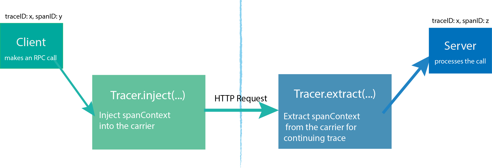
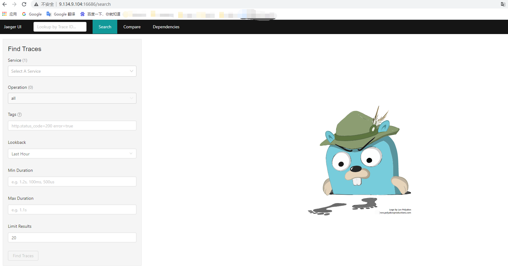

# Open Tracing


<!-- TOC -->

- [Open Tracing](#open-tracing)
    - [Overview](#overview)
    - [Concepts](#concepts)
        - [Span](#span)
        - [Tags](#tags)
        - [Logs](#logs)
        - [SpanContext](#spancontext)
    - [Tracer](#tracer)
        - [Setting up a Tracer](#setting-up-a-tracer)
        - [Starting a new Trace](#starting-a-new-trace)
        - [Propagating a Trace with Inject/Extract](#propagating-a-trace-with-injectextract)
    - [Specification](#specification)
        - [The OpenTracing Data Model](#the-opentracing-data-model)
    - [Semantic Conventions](#semantic-conventions)
        - [Standard span tags table](#standard-span-tags-table)
        - [Standard log fields table](#standard-log-fields-table)
    - [Python Demo](#python-demo)
    - [References](#references)

<!-- /TOC -->
## Overview

早期不同的 Tracer 实现具有不同的 API，并有着自己独立的语义，虽然他们大体而言都是类似的。

OpenTracing 提供了一个开放、一致的 Tracer API，用于描述分布式事务，尤其是相关的语义、时序、因果关系。

> OpenTracing provides an open, vendor-neutral standard API for describing distributed transactions, specifically causality, semantics and timing.

OpenTracing 对不同的 Tracer 实现进行了抽象，这意味着开发人员无论使用什么 Tracer，使用方式都保持不变。

## Concepts

### Span

[What is a Span?](https://opentracing.io/docs/overview/spans/) 中提到，span 是分布式 trace 中的主要构建块，代表了分布式系统中的独立工作单元。

> The “span” is the primary building block of a distributed trace, representing an individual unit of work done in a distributed system.

Span 是整个工作流中的一部分，它具有操作名称和操作耗时。

> Each component of the distributed system contributes a span - a named, timed operation representing a piece of the workflow.

Span 根据 OpenTracing 规范，具有以下属性：

- An operation name
- A start timestamp and finish timestamp
- A set of key:value span Tags
- A set of key:value span Logs
- A SpanContext

Span Example:

```text
    t=0            operation name: db_query               t=x

     +-----------------------------------------------------+
     | · · · · · · · · · ·    Span     · · · · · · · · · · |
     +-----------------------------------------------------+

Tags:
- db.instance:"customers"
- db.statement:"SELECT * FROM mytable WHERE foo='bar'"
- peer.address:"mysql://127.0.0.1:3306/customers"

Logs:
- message:"Can't connect to mysql server on '127.0.0.1'(10061)"

SpanContext:
- trace_id:"abc123"
- span_id:"xyz789"
- Baggage Items:
  - special_id:"vsid1738"
```

### Tags

Tags 是一个用户自定义的 key:value，能够对 span 进行注视，方便查询、筛选和理解跟踪的数据。

> Tags are key:value pairs that enable user-defined annotation of spans in order to query, filter, and comprehend trace data.

Tags 的 key 必须是字符串，而 value 支持 string、bool、numeric。

> The keys must be strings. The values may be strings, bools, or numeric types.

[Semantic Conventions](#semantic-conventions) 给出了 Tags 常见场景中的相关命名。

例如：

- `db.instance` 标识一个 Database Host。
- `http.status_code` 标识 HTTP response code.
- `error` 标识了 span 操作是否失败。

### Logs

Logs 是一个 key:value，便于对 span 的日志数据进行捕获，以及输出其他的一些调试信息。

> Logs are key:value pairs that are useful for capturing span-specific logging messages and other debugging or informational output from the application itself.

Logs 的 key 必须是 string 类型，而 value 可以是任何类型，但是并非所有的 OpenTracing 实现都支持任意类型的 value。

### SpanContext

SpanContext 携带这跨进程的数据，例如 RPC 调用，在请求的接收方可以解析出 tracing 的上下文。

SpanContext 包含两个部分：

- An implementation-dependent state to refer to the distinct span within a trace.
- Any Baggage Items. 这是一种是跨进程的 key:value。

## Tracer

Tracer 需要提供接口进行 Spans 的创建，并且了解如何跨进程的元数据进行 Inject 预计 Extract。

> The Tracer interface creates Spans and understands how to Inject (serialize) and Extract (deserialize) their metadata across process boundaries.

Tracer 需要有具有以下接口：

- Start a new Span
- Inject a SpanContext into a carrier
- Extract a SpanContext from a carrier

### Setting up a Tracer

Tracer 是对 OpenTracing 的实现，它将记录 Spans 并在某处发布它们。

### Starting a new Trace

当创建一个新的且没有 Parent 的 span 时，就意味着创建了一个新的 Trace。

当创建一个 Span 时，应该指定操作名称，该名称是任意格式的字符串，用于识别 span。

Trace 的下一个 span 可能是一个 Child Span，可以看作是 Main Span 的内部子行为。这两个 Span 是 `ChildOf` 关系。更多的关系请参考 [Specification](#specification)。

### Propagating a Trace with Inject/Extract

为了支持跨进程的分布式 Trace，Client 需要将 Trace 信息发送给 Service，Service 也应该能够从中解析出 Trace 信息，并继续使用该 Trace。

OpenTracing 提供了：

- inject 用于编码 span 上下文到 carrier（负载数据）中。
- extract 进行反向操作，即从 carrier 解析出 span 上下文。



## Specification

OpenTracing 规范参考 [The OpenTracing Semantic Specification](https://opentracing.io/specification/)。

OpenTracing 使用 `Major.Minor` 形式的版本号，很显然，它没有 `.Patch` 部分。

### The OpenTracing Data Model

OpenTracing 中，Traces 由 Span 隐式定义（即没有 Parent 的 Span 代表一个 Trace）。Trace 是由 Spans 组成的有向无环图（DAG），Span 是 Trace 中的节点，Span 之间的关系是 Trace 中的边：

```text
        [Span A]  ←←←(the root span)
            |
     +------+------+
     |             |
 [Span B]      [Span C] ←←←(Span C is a `ChildOf` Span A)
     |             |
 [Span D]      +---+-------+
               |           |
           [Span E]    [Span F] >>> [Span G] >>> [Span H]
                                       ↑
                                       ↑
                                       ↑
                         (Span G `FollowsFrom` Span F)
```

有时候使用时间轴的可视化 Trace 更简单：

```text
––|–––––––|–––––––|–––––––|–––––––|–––––––|–––––––|–––––––|–> time

 [Span A···················································]
   [Span B··············································]
      [Span D··········································]
    [Span C········································]
         [Span E·······]        [Span F··] [Span G··] [Span H··]
```

每个 Span 都包含饿了以下信息：

- 一个操作名称（operation name）。
- 一个开始时间戳（start timestamp）。
- 一个结束时间戳（end timestamp）。
- 零个或者多个 key:value 的 Span Tags。
- 零个或者多个 key:value 的 Span Logs。
- 一个 SpanContext。
- 零个或多个 Span 引用（即该 Span 引用的 Span）。

一个 SpanContext 包含以下数据：

- Any OpenTracing-implementation-dependent state (for example, trace and span ids) needed to refer to a distinct Span across a process boundary
- Baggage Items, which are just key:value pairs that cross process boundaries

## Semantic Conventions

参考文献 [OpenTracing Semantic Conventions](https://opentracing.io/specification/conventions/)。

### Standard span tags table

Spans Tags 适用于整个 Span 的时间范围，而不是 Span 下的某个时间范围（这种场景适合于 Spans Logs）。

Span tag name | Type | Notes and examples
-|-|-
component | string | The software package, framework, library, or module that generated the associated Span. E.g., "grpc", "django", "JDBI".
db.instance | string | 数据库实例名称. 例如：对于名为 `customers` 的 Databse，取值为 "customers"。
db.type | string | 数据库类型。对于 SQL，取值为 "sql"，对于其他则采用小写进行标识，例如："redis"。
db.user | string | 访问数据库的用户名。
db.statement | string | 给定数据库类型的访问语句。例如："SELECT * FROM wuser_table"。
error | bool | 当应用认为 Span 操作失败时，取值为 true。不存在或者为 false，则认为 Span 成果。
http.method | string | Span 操作的 HTTP 方法。例如："GET"。
http.status_code | integer | Span 操作的 HTTP 状态码。例如：200。
http.url | string | 在对应的 Trace 中的请求 URL。例如："https://domain.net/path/to?resource=here"。
message_bus.destination | string | An address at which messages can be exchanged. E.g. A Kafka record has an associated "topic name" that can be extracted by the instrumented producer or consumer and stored using this tag.
peer.address | string | Remote “address”, suitable for use in a networking client library. This may be a "ip:port", a bare "hostname", a FQDN, or even a JDBC substring like "mysql://prod-db:3306"
peer.hostname | string | Remote hostname. E.g., "opentracing.io", "internal.dns.name"
peer.ipv4 | string | 对端 IPv4 地址。例如："127.0.0.1"。
peer.ipv6 | string | 对端 IPv6 地址。例如："2001:0db8:85a3:0000:0000:8a2e:0370:7334"。
peer.port | integer | 对端端口。例如：80。
peer.service | string | Remote service name (for some unspecified definition of "service"). E.g., "elasticsearch", "a_custom_microservice", "memcache"
sampling.priority | integer | If greater than 0, a hint to the Tracer to do its best to capture the trace. If 0, a hint to the trace to not-capture the trace. If absent, the Tracer should use its default sampling mechanism.
span.kind | string | Either "client" or "server" for the appropriate roles in an RPC, and "producer" or "consumer" for the appropriate roles in a messaging scenario.

### Standard log fields table

Span log field name | Type | Notes and examples
-|-|-
error.kind | string | The type or “kind” of an error (only for event="error" logs).
error.object | object | For languages that support such a thing (e.g., Java, Python), the actual Throwable/Exception/Error object instance itself.
event | string | A stable identifier for some notable moment in the lifetime of a Span. For instance, a mutex lock acquisition or release or the sorts of lifetime events in a browser page load described in the Performance.timing specification.
message | string | A concise, human-readable, one-line message explaining the event.
stack | string | A stack trace in platform-conventional format; may or may not pertain to an error.


## Python Demo

为了方便理解和查阅，提供了 Python 使用 OpenTracing 的 Demo：

- [python-demo/hello.py](python-demo/hello.py)
- [python-demo/hello-relationships.py](python-demo/hello-relationships.py)
- [python-demo/hello-rpc.py](python-demo/hello-rpc.py)

在 Demo 开始前，应该在本机安装 Tracing Server：Jaeger：

```cpp
docker run \
  --rm \
  -p 6831:6831/udp \
  -p 6832:6832/udp \
  -p 16686:16686 \
  jaegertracing/all-in-one:1.7 \
  --log-level=debug
```

Jaeger 运行起来后可以直接通过 `ip:port` 的方式进行访问：

```text
http://9.134.9.104:16686/search
```



## References

1. [What is Distributed Tracing?](https://opentracing.io/docs/overview/what-is-tracing/)
1. [OpenTracing 中文文档](https://wu-sheng.gitbooks.io/opentracing-io/content/)
1. [The OpenTracing Semantic Specification](https://opentracing.io/specification/)
1. [OpenTracing Python](https://opentracing.io/guides/python/)
1. [Jaeger Getting Started](https://www.jaegertracing.io/docs/1.22/getting-started/)
1. [OpenTracing Tutorials](https://github.com/yurishkuro/opentracing-tutorial)
1. [OpenTracing Best Practices](https://opentracing.io/docs/best-practices/)
1. [OpenTracing Semantic Conventions](https://opentracing.io/specification/conventions/)
