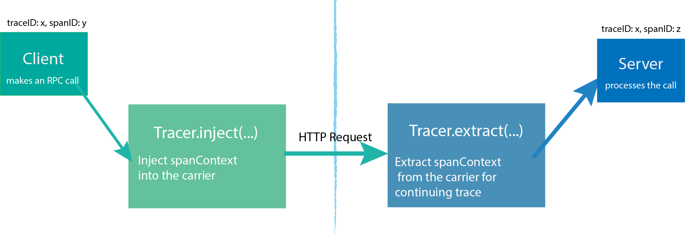

# Open Tracing


<!-- TOC -->

- [Open Tracing](#open-tracing)
    - [Overview](#overview)
    - [Concepts](#concepts)
        - [Span](#span)
        - [Tags](#tags)
        - [Logs](#logs)
        - [SpanContext](#spancontext)
        - [Baggage](#baggage)
        - [Tracer](#tracer)
    - [Specification](#specification)
        - [The OpenTracing Data Model](#the-opentracing-data-model)
        - [References between Spans](#references-between-spans)
        - [The OpenTracing API](#the-opentracing-api)
            - [Tracer API](#tracer-api)
            - [Span API](#span-api)
            - [SpanContext API](#spancontext-api)
    - [Semantic Conventions](#semantic-conventions)
        - [Standard span tags table](#standard-span-tags-table)
        - [Standard log fields table](#standard-log-fields-table)
    - [Python Demo](#python-demo)
    - [References](#references)

<!-- /TOC -->
## Overview

早期不同的 Tracer 实现具有不同的 API，并有着自己独立的语义，虽然他们大体而言都是类似的。

OpenTracing 提供了一个开放、一致的 Tracer API，用于描述分布式事务，尤其是相关的语义、时序、因果关系。

> OpenTracing provides an open, vendor-neutral standard API for describing distributed transactions, specifically causality, semantics and timing.

OpenTracing 对不同的 Tracer 实现进行了抽象，这意味着开发人员无论使用什么 Tracer，使用方式都保持不变。

## Concepts

下图描绘了 OpenTracing 中的主要组件和关系：


### Span

[What is a Span?](https://opentracing.io/docs/overview/spans/) 中提到，span 是分布式 trace 中的主要构建块，代表了分布式系统中的独立工作单元。

> The “span” is the primary building block of a distributed trace, representing an individual unit of work done in a distributed system.

Span 是整个工作流中的一部分，它具有操作名称和操作耗时。

> Each component of the distributed system contributes a span - a named, timed operation representing a piece of the workflow.

Span 根据 OpenTracing 规范，具有以下属性：

- An operation name
- A start timestamp and finish timestamp
- A set of key:value span Tags
- A set of key:value span Logs
- A SpanContext

Span Example:

```text
    t=0            operation name: db_query               t=x

     +-----------------------------------------------------+
     | · · · · · · · · · ·    Span     · · · · · · · · · · |
     +-----------------------------------------------------+

Tags:
- db.instance:"customers"
- db.statement:"SELECT * FROM mytable WHERE foo='bar'"
- peer.address:"mysql://127.0.0.1:3306/customers"

Logs:
- message:"Can't connect to mysql server on '127.0.0.1'(10061)"

SpanContext:
- trace_id:"abc123"
- span_id:"xyz789"
- Baggage Items:
  - special_id:"vsid1738"
```

### Tags

Tags 是一个用户自定义的 key:value，能够对 span 进行注视，方便查询、筛选和理解跟踪的数据。

> Tags are key:value pairs that enable user-defined annotation of spans in order to query, filter, and comprehend trace data.

Tags 的 key 必须是字符串，而 value 支持 string、bool、numeric。

> The keys must be strings. The values may be strings, bools, or numeric types.

[Semantic Conventions](#semantic-conventions) 给出了 Tags 常见场景中的相关命名。

例如：

- `db.instance` 标识一个 Database Host。
- `http.status_code` 标识 HTTP response code.
- `error` 标识了 span 操作是否失败。

### Logs

一个 Log 拥有一个时间戳，以及多个 `key:value`，Log 便于对 span 的数据进行记录，以及输出其他的一些调试信息。

> Logs are key:value pairs that are useful for capturing span-specific logging messages and other debugging or informational output from the application itself.

Logs 的 key 必须是 string 类型，而 value 可以是任何类型，但是并非所有的 OpenTracing 实现都支持任意类型的 value。

### SpanContext

SpanContext 携带这跨进程的数据，例如 RPC 调用，在请求的接收方可以解析出 tracing 的上下文。

SpanContext 包含两个部分：

- An implementation-dependent state to refer to the distinct span within a trace.
- Any Baggage Items. 这是一种是跨进程的 key:value。

### Baggage

Baggage 是一系列 key:value 对，Baggage 应用于给定的 Span，并在生产的 SpanContex 中也会包含 Baggage。

若某个 Span 拥有 Baggage，则引用该 Span 的其他 Span（例如 Child Span）同样会具有相同 Baggage 的拷贝。

跨进程通信时，carrier 中会包含 Baggage，因此 Baggage 会在 Trace 的网络中进行传输，这回增大网络和 CPU 开销，因此使用 Baggage 时应该谨慎。

### Tracer

Tracer 需要提供接口进行 Spans 的创建，并且了解如何跨进程的元数据进行 Inject 预计 Extract。

> The Tracer interface creates Spans and understands how to Inject (serialize) and Extract (deserialize) their metadata across process boundaries.

Tracer 需要有具有以下接口：

- Start a new Span
- Inject a SpanContext into a carrier
- Extract a SpanContext from a carrier

**Setting up a Tracer**

Tracer 是对 OpenTracing 的实现，它将记录 Spans 并在某处发布它们。

**Starting a new Trace**

当创建一个新的且没有 Parent 的 span 时，就意味着创建了一个新的 Trace。

当创建一个 Span 时，应该指定操作名称，该名称是任意格式的字符串，用于识别 span。

Trace 的下一个 span 可能是一个 Child Span，可以看作是 Main Span 的内部子行为。这两个 Span 是 `ChildOf` 关系。更多的关系请参考 [Specification](#specification)。

**Propagating a Trace with Inject/Extract**

为了支持跨进程的分布式 Trace，Client 需要将 Trace 信息发送给 Service，Service 也应该能够从中解析出 Trace 信息，并继续使用该 Trace。

OpenTracing 提供了：

- inject 用于编码 span 上下文到 carrier（负载数据）中。
- extract 进行反向操作，即从 carrier 解析出 span 上下文。



## Specification

OpenTracing 规范参考 [The OpenTracing Semantic Specification](https://opentracing.io/specification/)。

OpenTracing 使用 `Major.Minor` 形式的版本号，很显然，它没有 `.Patch` 部分。

### The OpenTracing Data Model

OpenTracing 中，Traces 由 Span 隐式定义（即没有 Parent 的 Span 代表一个 Trace）。Trace 是由 Spans 组成的有向无环图（DAG），Span 是 Trace 中的节点，Span 之间的关系是 Trace 中的边：

```text
        [Span A]  ←←←(the root span)
            |
     +------+------+
     |             |
 [Span B]      [Span C] ←←←(Span C is a `ChildOf` Span A)
     |             |
 [Span D]      +---+-------+
               |           |
           [Span E]    [Span F] >>> [Span G] >>> [Span H]
                                       ↑
                                       ↑
                                       ↑
                         (Span G `FollowsFrom` Span F)
```

有时候使用时间轴的可视化 Trace 更简单：

```text
––|–––––––|–––––––|–––––––|–––––––|–––––––|–––––––|–––––––|–> time

 [Span A···················································]
   [Span B··············································]
      [Span D··········································]
    [Span C········································]
         [Span E·······]        [Span F··] [Span G··] [Span H··]
```

每个 Span 都包含饿了以下信息：

- 一个操作名称（operation name）。
- 一个开始时间戳（start timestamp）。
- 一个结束时间戳（end timestamp）。
- 零个或者多个 key:value 的 Span Tags。
- 零个或者多个 key:value 的 Span Logs。
- 一个 SpanContext。
- 零个或多个 Span 引用（即该 Span 引用的 Span）。

一个 SpanContext 包含以下数据：

- Any OpenTracing-implementation-dependent state (for example, trace and span ids) needed to refer to a distinct Span across a process boundary.
- Baggage Items, which are just key:value pairs that cross process boundaries.

### References between Spans

Span 可以引用零个或多个 Span，当前 OpenTracing 提供了两种因果关系引用：

- ChildOf：一个 Span 是另一个 Span 的孩子。在 ChildOf 的引用关系中，Parent Span 会依赖于 Child Span 的结果。以下场景均可以构成 ChildOf 关系：
  - 若 Span A 代表 RPC Server，Span B 代表 RPC Client，则 Span A 通过 ChildOf 引用 Span B。
  - 若 Span A 代表 SQL insert 操作，Span B 代表 ORM save 方法，则 Span A 通过 ChildOF 引用 Span B。
  - 许多独立并发操作的 Span 可能会有同一个 Parent Span，在 Parent Span 中对并发 Span 的结果进行合并处理。

  ```text
    [-Parent Span---------]
         [-Child Span----]

    [-Parent Span--------------]
         [-Child Span A----]
          [-Child Span B----]
        [-Child Span C----]
         [-Child Span D---------------]
         [-Child Span E----]
  ```

- FollowsFrom：Parent Span 并不依赖于 Child Span 的结果，在这种场景中，Child Span 通过 FollowsFrom 引用 Parent Span。虽然其仍然具有父子关系，但会用 FollowsFrom 来表示这类场景。

  ```text
    [-Parent Span-]  [-Child Span-]


    [-Parent Span--]
     [-Child Span-]


    [-Parent Span-]
                [-Child Span-]
  ```

对 FollowsFrom 的概念暂时还无法很好的把握，猜想是不是类似于 Nginx proxy_pass 的动作。

### The OpenTracing API

OpenTracing 中有三个至关重要，又相互关联的对象：

- Tracer
- Span
- SpanContext

#### Tracer API

Tracer 的接口需要能够创建 Spans，并且可以 Inject 和 Extract 跨进程的上下文。

**Start a new span**

Tracer 需要有一个接口创建 Span，参数如下:

Field | Required | Description
-|-|-
operation name | Y | 一个易读的操作名称，代表 Span 完成的工作。操作名称应该是通用字符串。
references | N | Span 的零个或多个引用，引用关系可能是 ChildOf 或 FollowsFrom。
start timestamp | N | Span 操作的开始时间，如果没有指定则用当前时间。
tags | N | 零个或多个 Tags。Tags 的概念请参考 [Tags](#tags)。

接口返回：

Field | Description
-|-
span | 一个已经开始，但没有结束的 Span。

**Inject a SpanContext into a carrier**

Tracer 需要有将 SpanContext 序列化的接口，该接口叫做 Inject，参数如下：

Field | Required | Description
-|-|-
span_context | Y | Span 上下文实例。
format | Y | format 取值决定了 Tracer 如何将 SpanContext 编码到 carrier 中。
carrier | Y | carrier 的类型和 format 有直接关系。Tracer 根据 format 将 SpanContext 编码到 carrier 中。

**Extract a SpanContext from a carrier**

Tracer 在拥有 carrier 后需要从中提取 SpanContext，该接口叫做 Extract，参数如下:

Field | Required | Description
-|-|-
format | Y | 告诉 Tracer 如何从 carrier 中解码出 SpanContext。
carrier | Y | Tracer 将会从 carrier 中解析出 SpanContext。

接口返回：

Field | Description
-|-
span_context | SpanContext 实例，也代表了 Trace 上的 Span，可以用作 Tracer 创建新 Span 的引用。

Injection 和 Extract 中都以来了 format 参数，该参数是可扩展的，它决定了 carrier 的类型，同时决定了如何在 carrier 中编码 SpanContext。所有的 Tracer 都必须支持这三种 format：

- Text Map: 任意字符串到字符串的映射。可以是 `key=value`，也可以是 `key:value`。
- HTTP Headers: 具有适用于 HTTP 标头的键和值的字符串到字符串映射。相比于 Text Map，这种针对 HTTP Headers 格式更加具体。
- Binary: 表示 SpanContext 的二进制数据。

#### Span API

Span 在 Finish 后，只能调用 `Retrieve the Spans SpanContext`，其他方法不能再使用。

**Retrieve the Spans SpanContext**

获得 Span 的上下文。

接口参数：无。

接口响应：SpanContext，即便 Span 在 Finish 后依然可以调用。

**Overwrite the operation name**

重写 Span 的操作名称，覆盖创建时确定的名称。

接口参数:

Field | Required | Description
-|-|-
operation name | Y | 新的操作名称。

**Finish Span**

结束一个 Span。

接口参数:

Field | Required | Description
-|-|-
finish timestamp | N | Span 操作的结束时间，如果没有指定则用当前时间。

**Set a span tag**

设置 Span 的 Tag。

接口参数:

Field | Required | Description
-|-|-
tag key | Y | 必须是字符串。
tag value | Y | 可以是字符串、bool、numeric。

**Log structured data**

接口参数:

Field | Required | Description
-|-|-
key:value | Y | 一个或多个键值对，key 必须是字符串，value 是任意类型。
timestamp | N | 指明 Log 的时间戳。如果指定，必须位于 span 的开始时间和结束时间之间。

**Set a baggage item**

设置 Baggage 到 Span 中。

接口参数：

Field | Required | Description
-|-|-
baggage key | Y | 字符串。
baggage value | Y | 字符串。

**Get a baggage item**

从 Span 中获得 Baggage。

接口参数:

Field | Required | Description
-|-|-
baggage key | Y | 字符串。

接口返回：

Field | Description
-|-
baggage value | 返回相应的 value 值。

#### SpanContext API

SpanContext 对使用者而言是一个接近透明的存在，很少会直接它的接口，大多用于作为参数或返回值：

- 在创建 Span 时，指定引用的 SpanContext。
- 向 carrier 注入时，指定需要注入的 SpanContext。
- 从 carrier 解析时，返回解析后的 SpanContext。

SpanContext 会暴露一个迭代 Baggage 的接口给使用者。

## Semantic Conventions

参考文献 [OpenTracing Semantic Conventions](https://opentracing.io/specification/conventions/)。

Semantic Conventions 提供了标准化的 Span tags 和 logging keys 字段。

### Standard span tags table

Spans Tags 适用于整个 Span 的时间范围，而不是 Span 下的某个时间范围（这种场景适合于 Spans Logs）。

以下是标准字段：

Span tag name | Type | Notes and examples
-|-|-
component | string | 指明由何种组件生产的 Span，例如："grpc", "django", "JDBI"。
db.instance | string | 数据库实例名称. 例如：对于名为 `customers` 的 Databse，取值为 "customers"。
db.type | string | 数据库类型。对于 SQL，取值为 "sql"，对于其他则采用小写进行标识，例如："redis"。
db.user | string | 访问数据库的用户名。
db.statement | string | 给定数据库类型的访问语句。例如："SELECT * FROM wuser_table"。
error | bool | 当应用认为 Span 操作失败时，取值为 true。不存在或者为 false，则认为 Span 成果。
http.method | string | Span 操作的 HTTP 方法。例如："GET"。
http.status_code | integer | Span 操作的 HTTP 状态码。例如：200。
http.url | string | 在对应的 Trace 中的请求 URL。例如："https://domain.net/path/to?resource=here"。
message_bus.destination | string | 用于消息交换的地址。
peer.address | string | 对端远程地址。可能是一个 "ip:port"，也可能是一个 "hostname"。
peer.hostname | string | 对端 hostname。例如："opentracing.io", "internal.dns.name"。
peer.ipv4 | string | 对端 IPv4 地址。例如："127.0.0.1"。
peer.ipv6 | string | 对端 IPv6 地址。例如："2001:0db8:85a3:0000:0000:8a2e:0370:7334"。
peer.port | integer | 对端端口。例如：80。
peer.service | string | 远程服务名称，对于未指定的则直接取值 `"service"`。例如："elasticsearch", "a_custom_microservice", "memcache"。
sampling.priority | integer | 如果大于 0，Tracer 应该尽全力采样该 Trace。如果为 0，不捕获该 Trace。如果缺失，则采用默认采样机制。
span.kind | string | Span 所处系统中的角色，对于 RPC，可以有 "client" 或 "service"。对于消息中间件，可以是 "producer" 或 "consumer"。

### Standard log fields table

每个 Span Log 都有一个时间戳（必须介于 Span 的起止时间之间），以及多个 `key:value`。

以下是标准字段：

Span log field name | Type | Notes and examples
-|-|-
error.kind | string | 错误的类型，当 `event=true` 时该字段存在。
error.object | object | 语言特定的 Exception 对象序列化内容，通常是错误的原因字符串。
event | string | 对 Span 生命周期中某个重要时刻的稳定标识。
message | string | 解释 event 的简洁、易懂的字符串。
stack | string | 调用栈，可能与 error 有关，便于定位问题。也可以与 error 无关，此时可能是 Log 函数调用时的调用栈。

## Python Demo

为了方便理解和查阅，提供了 Python 使用 OpenTracing 的 Demo：

- [python-demo/hello.py](python-demo/hello.py)
- [python-demo/hello-relationships.py](python-demo/hello-relationships.py)
- [python-demo/hello-rpc.py](python-demo/hello-rpc.py)

在 Demo 开始前，应该在本机安装 Tracing Server：Jaeger：

```cpp
docker run \
  --rm \
  -p 6831:6831/udp \
  -p 6832:6832/udp \
  -p 16686:16686 \
  jaegertracing/all-in-one:1.7 \
  --log-level=debug
```

Jaeger 运行起来后可以直接通过 `ip:port` 的方式进行访问：

```text
http://9.134.9.104:16686/search
```


## References

1. [What is Distributed Tracing?](https://opentracing.io/docs/overview/what-is-tracing/)
1. [OpenTracing 中文文档](https://wu-sheng.gitbooks.io/opentracing-io/content/)
1. [The OpenTracing Semantic Specification](https://opentracing.io/specification/)
1. [OpenTracing Python](https://opentracing.io/guides/python/)
1. [Jaeger Getting Started](https://www.jaegertracing.io/docs/1.22/getting-started/)
1. [OpenTracing Tutorials](https://github.com/yurishkuro/opentracing-tutorial)
1. [OpenTracing Best Practices](https://opentracing.io/docs/best-practices/)
1. [OpenTracing Semantic Conventions](https://opentracing.io/specification/conventions/)
