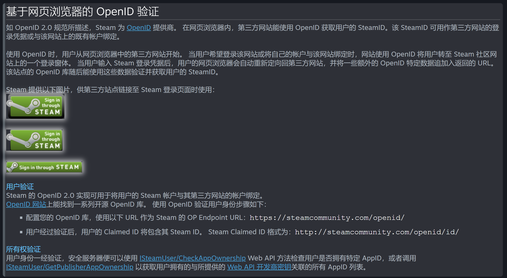
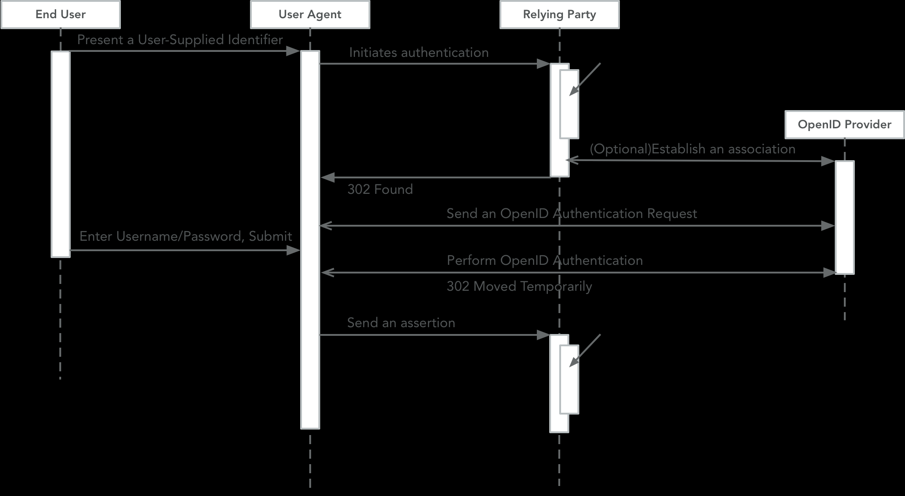

# OpenID Authentication 2.0

## Overview

OpenID Auth 2.0 是一个用户身份认证协议，在互联网早期有不少平台会使用该协议做第三方登录，例如 Steam：[基于网页浏览器的 OpenID 验证](https://partner.steamgames.com/doc/features/auth#website)。

OpenID Auth 2.0 协议规范实际上是属于过时协议，openid 基金会并不推荐大家继续使用 OpenID Auth 2.0，取而代之的是使用 [OpenID Connect](https://openid.net/connect/)。

因为工作原因，使用了 OpenID Auth 2.0，因此为这个已经过时的协议做一个简单的梳理和总结，本文主要参考 [OpenID Authentication 2.0 - Final](https://openid.net/specs/openid-authentication-2_0.html)。

### Terminology

这里是对 OpenID Auth2.0 涉及名词的解释：

Term | Description | Sample
-|-|-
Identifier | 标识符是 HTTP 或 HTTPS 的 URI |
User-Agent | 终端用户的网页浏览器 | Chrome/FireFox/IE
Relying Party(RP) | 希望认证终端用户身份的网页应用 | [饥荒网页应用](https://accounts.klei.com/login)
OpenID Provider(OP) | OpenID Auth Server，RP 使用 OP 对用户身份进行认证 | Steam Platform
OP Endpoint URL | 接受 OpenID 身份验证协议消息的 URL，该值必须是绝对的 HTTP 或 HTTPS URL |
OP Identifier | OpenID Provider 的标识符 | http://steamcommunity.com/openid
User-Supplied Identifier | | http://steamcommunity.com/openid/id/76561198268973239
Claimed Identifier | |
OP-Local Identifier | | -

### Flow

协议流程如下所示：

1. 用户通过浏览器传递 User-Supplied Identifier 到 RP，以启动 [initiates authentication](#initiation)。
1. 在对 User-Supplied Identifier 进行 [normalizing]() 后，RP 使用 [perform discovery]() 获得用于用户身份认证的 OP 端点 URL，这个 URL 可能是一个 OP Identifier。
1. （可选）RP 和 OP 之间建立关联：使用 Diffie-Hellman 密钥交换建立共享密钥。后续 OP 将使用共享密钥签名消息，RP 使用共享密钥验证消息。
1. RP 使用 OpenID 身份验证请求，将用户的浏览器重定向到 OP。
1. OP 判断用户是否能够进行 OpenID Authentication 以及用户身份真的希望这样做（OP 提供一个页面提示用户）。
1. OP 将用户的浏览器重定向回 RP，并带有被批准的断言或认证失败消息。
1. RP 校验从 OP 返回的消息，验证的方式包括：
   - 使用 RP 和 OP 建立关系时生成的共享密钥。
   - 直接向 OP 发送请求来验证。

这是一个流程时序图：

## Initiation