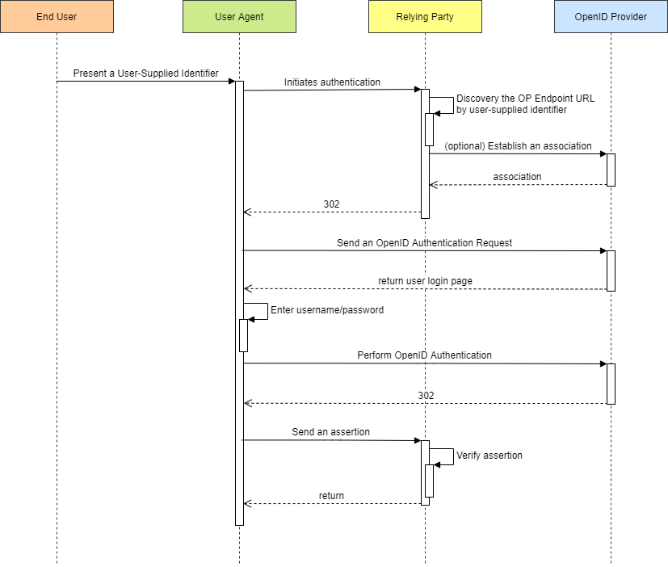

# OpenID Authentication 2.0

<!-- TOC -->

- [OpenID Authentication 2.0](#openid-authentication-20)
    - [Overview](#overview)
        - [Terminology](#terminology)
        - [Flow](#flow)
    - [Initiation and Discovery](#initiation-and-discovery)
        - [Initiation](#initiation)
        - [Normalization](#normalization)
        - [Discovery](#discovery)
    - [Establishing Associations](#establishing-associations)
        - [Association Session Request](#association-session-request)
        - [Association Session Response](#association-session-response)
    - [Requesting Authentication](#requesting-authentication)
        - [Realms](#realms)
    - [Responding to Authentication Requests](#responding-to-authentication-requests)
    - [Appendix: Data Formats](#appendix-data-formats)
        - [Protocol Messages](#protocol-messages)
        - [Key-Value Form Encoding](#key-value-form-encoding)
        - [HTTP Encoding](#http-encoding)
        - [Integer Representations](#integer-representations)
    - [Appendix: Communication Types](#appendix-communication-types)
        - [Direct Request](#direct-request)
        - [Indirect Request](#indirect-request)

<!-- /TOC -->

## Overview

OpenID Auth 2.0 是一个用户身份认证协议，在互联网早期有不少平台会使用该协议做第三方登录，例如 Steam：[基于网页浏览器的 OpenID 验证](https://partner.steamgames.com/doc/features/auth#website)。


OpenID Auth 2.0 协议规范实际上是属于过时协议，openid 基金会并不推荐大家继续使用 OpenID Auth 2.0，取而代之的是使用 [OpenID Connect](https://openid.net/connect/)。

因为工作原因，使用了 OpenID Auth 2.0，因此为这个已经过时的协议做一个简单的梳理和总结，本文主要参考 [OpenID Authentication 2.0 - Final](https://openid.net/specs/openid-authentication-2_0.html)。

### Terminology

这里是对 OpenID Auth2.0 涉及名词的解释：

Term | Description | Sample
-|-|-
Identifier | 标识符是 HTTP 或 HTTPS 的 URI | -
User-Agent | 终端用户的网页浏览器 | Chrome/FireFox/IE
Relying Party(RP) | 希望认证终端用户身份的网页应用 | [饥荒网页应用](https://accounts.klei.com/login)
OpenID Provider(OP) | OpenID Auth Server，RP 使用 OP 对用户身份进行认证 | Steam Platform
OP Endpoint URL | 接受 OpenID 身份验证协议消息的 URL，该值必须是绝对的 HTTP 或 HTTPS URL | https://steamcommunity.com/openid/login
OP Identifier | OpenID Provider 的标识符 | https://steamcommunity.com/openid
Claimed Identifier | 用户声称其拥有的 Identifier，OpenID Auth 2.0 规范的目标就是为了验证 Claimed Identifier | https://steamcommunity.com/openid/id/76561198268973239
User-Supplied Identifier | 可以是用户的 Claimed Identifier 或者 OP Identifier | https://steamcommunity.com/openid/id/76561198268973239 or <br> https://steamcommunity.com/openid
OP-Local Identifier | | -

### Flow

协议流程如下所示：

1. 用户通过浏览器传递 User-Supplied Identifier 到 RP，以启动 [initiates authentication]()。
2. 在对 User-Supplied Identifier 进行 [normalizing]() 后，RP 使用 [perform discovery]() 获得用于用户身份认证的 OP 端点 URL，这个 URL 可能是一个 OP Identifier。
3. （可选）RP 和 OP 之间建立关联：使用 Diffie-Hellman 密钥交换建立共享密钥。后续 OP 将使用共享密钥签名消息，RP 使用共享密钥验证消息。
4. RP 使用 OpenID 身份验证请求，将用户的浏览器重定向到 OP。
5. OP 判断用户是否能够进行 OpenID Authentication 以及用户身份真的希望这样做（OP 提供一个页面提示用户）。
6. OP 将用户的浏览器重定向回 RP，并带有被批准的断言或认证失败消息。
7. RP 校验从 OP 返回的消息，验证的方式包括：
   - 使用 RP 和 OP 建立关系时生成的共享密钥。
   - 直接向 OP 发送请求来验证。

这是一个流程时序图：



## Initiation and Discovery

### Initiation

要启动 OpenID Authentication，RP 需要为用户提供一个 Form 表单，这个表单中用户可以输入 User-Supplied Identifier。

表单的 name 属性取值应该为 `openid_identifier`，以便浏览器知悉这是一个 OpenID Auth 表单。如果设置的不对，则支持 OpenID Auth 的浏览器扩展可能无法正常工作。

### Normalization

用户的输入必须规范化为一个 Identifier，这是一个示例：


User's Input | Identifier | Type | Discussion
-|-|-|-
example.com | http://example.com/ | URL | A URI with a missing scheme is normalized to a http URI
http://example.com | http://example.com/ | URL | An empty path component is normalized to a slash
https://example.com/ | https://example.com/ | URL | https URIs remain https URIs
http://example.com/user | http://example.com/user | URL | No trailing slash is added to non-empty path components
http://example.com/user/ | http://example.com/user/ | URL | Trailing slashes are preserved on non-empty path components
http://example.com/ | http://example.com/ | URL | Trailing slashes are preserved when the path is empty
=example | =example | XRI | Normalized XRIs start with a global context symbol
xri://=example | =example | XRI | Normalized XRIs start with a global context symbol

### Discovery

## Establishing Associations

RP 和 OP 之间会建立关联，建立关系的本质其实是为了共享密钥，这是为了校验后续协议消息，并减少消息往返。

建议 RP 尽可能建立关联，如果 RP 无法创建关联或存储关联，则提供了一种无状态的模式替代验证机制。

### Association Session Request

关联会话请求由 RP 向 OP Endpoint URL 直接发起，并且 `openid.mode=associate`。

以下是 associate 请求的通用参数：

Parameters | Required | Description
-|:-:|-
openid.ns | Y | 固定为 "http://specs.openid.net/auth/2.0"。
openid.mode | Y | 固定为 "associate"。
openid.assoc_type | Y | 首选 associate 类型，定义了用于对后续消息进行签名的算法。
openid.session_type | Y | 首选 associate session 类型，定义了用于加密传输的 MAC 密钥的方法。

请求中 openid.assoc_type 的取值如下表所述：

Association Types | Description
-|-
HMAC-SHA1 | An association of type "HMAC-SHA1" uses the HMAC-SHA1 signature algorithm.
HMAC-SHA256 | An association of type "HMAC-SHA256" uses the HMAC-SHA256 signature algorithm.

请求中 openid.session_type 的取值如下表所述：

Association Session Types | Description
-|-
no-encryption | The OP sends the association MAC key in plain-text to the Relying Party. 除非使用 TLS，否则不得使用该方式。
DH-SHA1 | Diffie-Hellman Key Exchange to securely transmit the shared secret. Hash function - 160 bits (20 bytes).
DH-SHA256 | Diffie-Hellman Key Exchange to securely transmit the shared secret. Hash function - 256 bits (32 bytes).

当 `openid.session_type=DH-SHA1` 或 `openid.session_type=DH-SHA256` 时，采用 Diffie Hellman 方式交换密钥，此时还需要使用额外的参数来对该流程做支持：

Parameters | Required | Description
-|:-:|-
openid.dh_modulus | N | base64(btwoc(p)), 默认值为 [Diffie-Hellman Key Exchange Default Value](https://openid.net/specs/openid-authentication-2_0.html#pvalue)。
openid.dh_gen | N | base64(btwoc(g)), 默认为 2。
openid.dh_consumer_public | Y | base64(btwoc(g ^ xa mod p))。

### Association Session Response

OP 以 Key-Value 形式直接响应 RP，以下是响应参数：

Parameters | Required | Description
-|:-:|-
ns | Y | 固定为 "http://specs.openid.net/auth/2.0"。
assoc_handle | Y | 关联句柄用作在后续消息中引用此关联的密钥。
session_type | Y | 请求中的 `openid.session_type`，如果 OP 不愿意或不能支持这种关联类型，它必须返回一个不成功的响应。
assoc_type | Y | 请求中的 `openid.assoc_type`，如果 OP 不愿意或不能支持这种关联类型，它必须返回一个不成功的响应。
expires_in | Y | associate 的生命周期，超过该时间戳不可继续使用该 associate 返回的密钥。

当 `openid.session_type=no-encryption` 时，直接响应中会直接包含密钥 Key：

Parameters | Required | Description
-|:-:|-
mac_key | N | The MAC key (shared secret) for this association, Base 64 encoded.

当 `openid.session_type=DH-SHA1` 或 `openid.session_type=DH-SHA256` 时，会返回用于计算 MAC Key 的参数：

Parameters | Required | Description
-|:-:|-
dh_server_public | Y | The OP's Diffie-Hellman public key.
enc_mac_key | Y | The MAC key (shared secret), encrypted with the secret Diffie-Hellman value. H is either "SHA1" or "SHA256" depending on the session type.

## Requesting Authentication

当 RP 成功完成 Discovery 并（可选）创建与 OP 的关联后，就可以向 OP 发送认证请求，以获得用户断言。认证请求是`间接请求`。

请求参数：

Parameters | Required | Description
-|:-:|-
openid.ns | Y | 固定为 "http://specs.openid.net/auth/2.0"。
openid.mode | Y | "checkid_immediate" 或 "checkid_setup"，通常使用 "checkid_setup"。
openid.claimed_id | N | The Claimed Identifier.
openid.identity | N | The OP-Local Identifier.
openid.assoc_handle | N | 填入 associate 的句柄，以便 OP 使用 associate 的 MAC Key 做签名。未填时，采用无状态模式。
openid.return_to | N |
openid.realm | N | OP 要求浏览器信任的 URL，默认值为 `openid.return_to`。如果省略 `openid.return_to`，则必填。

这是一个饥荒发起的 OpenID Auth2.0 请求：

```sh
https://steamcommunity.com/openid/login
```


### Realms

OP 在为用户提供登录页时，需要将 `openid.realm` 的值展示给用户，让用户知道现在请求认证身份的 RP 是谁。


## Responding to Authentication Requests

当 OP 正确识别用户将会返回 Positive Assertions，包含了以下参数：

Parameters | Required | Description
-|:-:|-
openid.ns | Y | 固定为 "http://specs.openid.net/auth/2.0"。
openid.mode | Y | 固定为 "id_res"。
openid.op_endpoint | Y | The OP Endpoint URL.
openid.claimed_id | N | The Claimed Identifier.
openid.identity | N | The OP-Local Identifier.
openid.return_to | N | 取值为请求中的 `openid.return_to`。
openid.response_nonce | Y | 对于此特定的成功身份验证响应必须是唯一的。
openid.invalidate_handle | N | 如果 RP 发送了一个无效的关联 Handle，则包含在此处。无效的原因可能是不存在，或者过期。
openid.assoc_handle | Y | 用于签署该断言的关联句柄。
openid.signed | Y |
openid.sig | Y | 签名的 Base 64 编码。

这是 Steam OpenID Auth2.0 向饥荒返回的断言响应：


## Appendix: Data Formats

这里对 OpenID Auth2.0 的数据形式进行阐述。这是一个示例：

- Protocol Messages

  ```text
  Key     | Value
  --------+---------------------------
  mode    | error
  error   | This is an example message
  ```

- Key-Value Form encoded:

  ```text
  mode:error
  error:This is an example message
  ```

- HTTP Encoding(POST)

  ```text
  openid.mode=error&openid.error=This%20is%20an%20example%20message
  ```

### Protocol Messages

OpenID Authentication Message 是一个映射，Key 和 Value 均为纯文本，并使用完整的 Unicode 字符集，当需要对其进行编码时，**必须**使用 UTF-8 编码。

本文中，除非特别声明为 optional，否则所有的参数都是必须的。

**注意：**

- Message 不能包含同名的 Key。

### Key-Value Form Encoding

Key-Value 形式的消息是一系列行。

每行以一个 Key 开始，后跟一个冒号，以及与 Key 相关的 Value。

该行由单个换行符终止（\n）。 Key 和 Value 不得包含换行符，Key 也不得包含冒号。

### HTTP Encoding

OpenID Auth2.0 的请求消息是有特殊要求的：

- 所有 Key 都必须以 "openid." 为前缀。此前缀可防止干扰与 OpenID 身份验证消息一起传递的其他参数。
- 当消息作为 POST 发送时，OpenID 参数必须只在 POST 正文中发送和提取。
- 作为 HTTP 请求（GET 或 POST）发送的所有消息必须包含以下字段：

Parameters | Value | Description
-|-|-
openid.ns | http://specs.openid.net/auth/2.0 | 表示使用 OpenID Auth2.0 请求。
openid.mode | Specified individually for each message type. | 允许接收者知道它正在处理什么类型的消息。如果不存在，处理方应该假设请求不是一个 OpenID 消息。

这个 HTTP 请求方式适用于 User-Agent 到 OP 和 RP，也适用于 RP 到 OP。

### Integer Representations

OpenID Auth2.0 中整数也是有特殊要求的，例如：

```text
Base 10 number | btwoc string representation
---------------+----------------------------
0              | "\x00"
127            | "\x7F"
128            | "\x00\x80"
255            | "\x00\xFF"
32768          | "\x00\x80\x00"
```

## Appendix: Communication Types

OpenID Auth2.0 中有以下几种通信方式：

- 直接通信，直接使用 HTTP 请求。
- 间接通信，通过重定向间接请求。

### Direct Request

直接请求必须使用 HTTP POST。

直接请求的响应由 Key-Value 组成，且 `Content-Type` 应该是：`text/plain`。

所有的消息中必须包含以下参数：

Parameters | Value | Description
-|-|-
ns | http://specs.openid.net/auth/2.0 | 表示使用 OpenID Auth2.0 请求。

若是一个失败的响应，则响应状态码为 400，且包含以下参数：

Parameters | Required | Description
-|-|-
ns | Y | http://specs.openid.net/auth/2.0，表示使用 OpenID Auth2.0 请求。
error | Y | 易读的错误消息。
contact | N | 服务器管理员的联系地址。
reference | N | 一个令牌，便于服务器管理员定位问题。

### Indirect Request

若是一个失败的响应，OP 必须将用户代理重定向到 "openid.return_to" 的 URL，并提供以下参数：

Parameters | Required | Description
-|-|-
openid.ns | Y | http://specs.openid.net/auth/2.0，表示使用 OpenID Auth2.0 请求。
openid.mode | Y | 固定为 "error"。
openid.error | Y | 易读的错误消息。
openid.contact | N | 服务器管理员的联系地址。
openid.reference | N | 一个令牌，便于服务器管理员定位问题。

openid.return_to 不存在或其值不是有效的 URL，则服务器应该向 End User 返回一个响应，指示错误并且它不能继续。