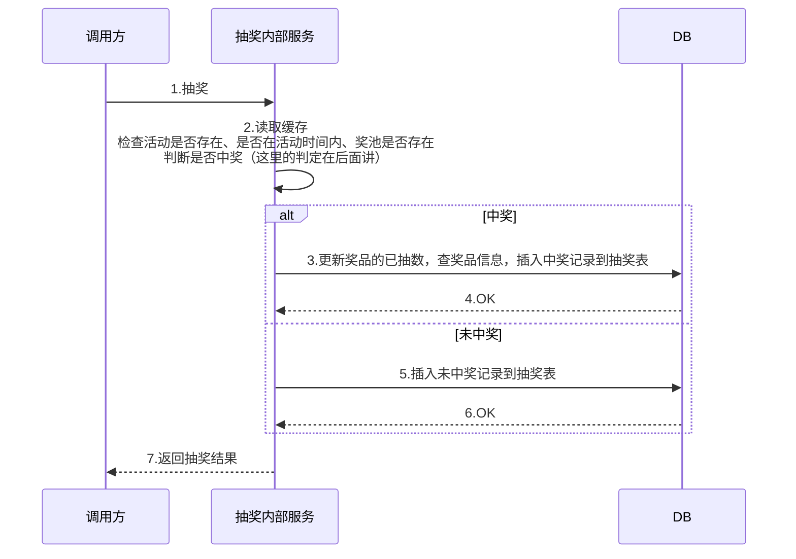

```mermaid
sequenceDiagram
participant cli as 调用方
participant svr as 抽奖内部服务
participant db as DB
cli ->> svr:1.抽奖
svr ->> svr:2.读取缓存<br/>检查活动是否存在、是否在活动时间内、奖池是否存在<br/>判断是否中奖（这里的判定在后面讲）
alt 中奖
	svr ->> db:3.更新奖品的已抽数，查奖品信息，插入中奖记录到抽奖表
	db -->> svr:4.OK
else 未中奖
	svr ->> db:5.插入未中奖记录到抽奖表
	db -->> svr:6.OK
end
svr -->> cli:7.返回抽奖结果
```
