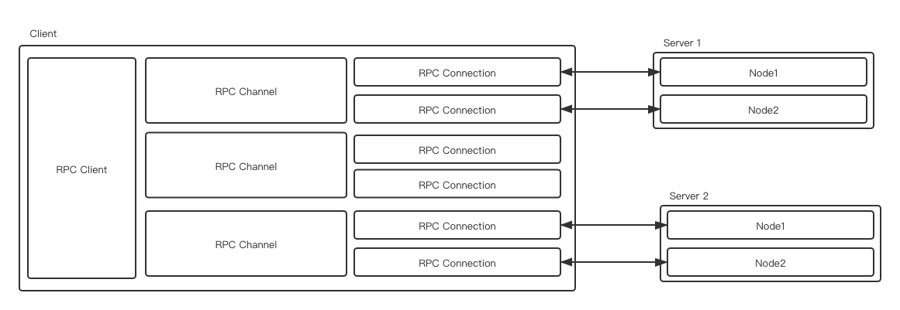
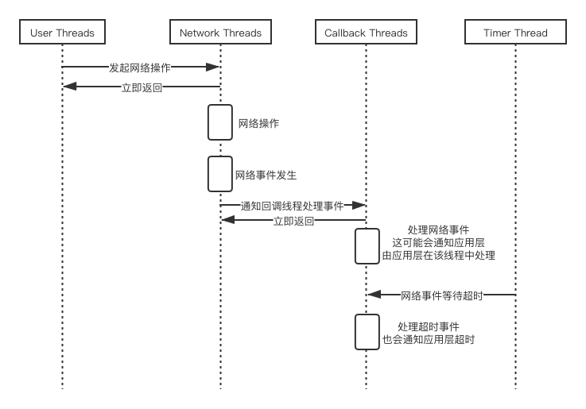

# POPPY RPC

<!-- TOC -->

- [POPPY RPC](#poppy-rpc)
    - [概述](#概述)
    - [基本架构](#基本架构)
    - [RPC 通信协议](#rpc-通信协议)
        - [握手](#握手)
        - [心跳](#心跳)
        - [RPC 请求和响应](#rpc-请求和响应)
    - [RPC Client](#rpc-client)
        - [RPC Client 线程模型](#rpc-client-线程模型)
        - [RPC Client 类关系](#rpc-client-类关系)
        - [RPC Clinet 配置项](#rpc-clinet-配置项)
        - [RPC Client Credential](#rpc-client-credential)
    - [RPC Server](#rpc-server)
    - [网络框架](#网络框架)
        - [net.http](#nethttp)
        - [net.frame](#netframe)
    - [Poppy 对 HTTP 的支持](#poppy-对-http-的支持)
        - [HTTP <---> RPC Server](#http-----rpc-server)
        - [HTTP Server](#http-server)

<!-- /TOC -->

## 概述

## 基本架构

RPC Client 角度：



一个 Client 可以和多个 Server 建立连接，并且 Client 和每个 Server 之间的连接用 RPC Channel 表示。

一个 Server 可能有多个节点，Channel 通过和每个节点建立 TCP 连接来维系和 Server 之间的连接。

向 Server 发送数据时，会从 Channel 中随机选择一个 RPC Connection 发送数据。

**注意：**

- 若对一个 Server 重复建立 Channel，有两种策略，具体使用何种策略由 RpcChannelOptions.use_channel_cache 决定。
  - 复用之前的 Channel，进而复用已有的连接，默认策略。
  - 创建新的 Channel，创建新的连接。

## RPC 通信协议

Poppy RPC 使用一套自定义协议与格式进行通信，

需要注意：Poppy 也是支持 HTTP 协议的，可以参考 [HTTP 支持](#http-支持)。

Poppy RPC 通信时序可以简单总结为：

```txt
  Client                                          Server
           <------- TCP Build Connection ------>

  HSK REQ ------------->
  Heartbeat REQ ------->
                            <----------------   HSK RSP
                            <----------------   Heartbeat RSP

  RPC REQ  ------------>
                            <----------------   RPC RSP

  Heartbeat REQ ------->
                            <----------------   Heartbeat RSP
```

### 握手

Poppy RPC 并非以 TCP 三次握手结束作为 Poppy RPC Connection 的握手结束，这非常特别，Poppy RPC 在三次握手建立连接后，还需要使用一个特殊的协议进行握手，其目的是交换一些传参数，例如认证信息，数据压缩方式等。

握手请求数据格式如下：

```http
POST /__rpc_service__ HTTP/1.1
Cookie: POPPY_AUTH_TICKET=
X-Poppy-Compress-Type: 0,1
X-Poppy-Tos: 96
```

- POPPY_AUTH_TICKET：Poppy 身份票据信息。
- X-Poppy-Compress-Type：告诉对端自己支持的压缩类型。

  ```proto
  enum CompressType {
      CompressTypeNone = 0;
      CompressTypeSnappy = 1;
  }
  ```

- X-Poppy-Tos：[Type of Service](https://en.wikipedia.org/wiki/Type_of_service)，由 RpcChannelOptions.tos 指定。

握手响应数据如下：

```http
HTTP/1.1 200 OK
X-Poppy-Compress-Type: 0,1.
```

- X-Poppy-Compress-Type：告诉对端自己支持的压缩类型。

可以看到 Poppy RPC 作为一个自定义传输协议，采用我的握手方式竟然是标准的 HTTP 1.1 协议的方式进行数据传输。归根结底，这与 Poppy RPC 底层依赖的是 HTTP 框架有关，相关内容可以参考 [net.http](#nethttp)。

### 心跳

RPC Client 心跳的目的是维持连接，并及时感知到连接是否异常。Poppy RPC 一定要在心跳完成后才能发起真正的 RPC 请求。

心跳请求和响应包的结构和 [RPC 请求和响应](#rpc-请求和响应) 中普通的请求和响应格式完全一致，其 Data 负载数据 proto：

```proto
// 心跳请求负载
message EmptyRequest {
}

// 心跳响应负载
message HealthResponse {
    required string health = 1;
}
```

心跳包和普通数据的区别在于，心跳包的 RpcMeta.method 为 `poppy.BuiltinService.Health`。

针对 Client 端，心跳请求发生在两个时刻：

- Client 感知到 TCP 三次握手完成的瞬间。
- RPC Client 定期发送（写死每秒）。

针对 Server 端，心跳请求本质上是对应了一个 Poppy 内置服务接口：

```proto
service BuiltinService {
    ...
    rpc Health(EmptyRequest) returns(HealthResponse);
    ...
}
```

### RPC 请求和响应

RPC 请求和响应的协议格式是一致，一个请求/响应的包中，包括如下部分：

- Meta Length, 长度为 8 字节，指示 Meta 部分的长度。
- Meta，请求的元数据，包括序列号、Metadata、错误码等等。
- Data Length，长度为 8 字节，指示 Data 部分的长度。
- Data，应用层负载数据。如果配置了压缩，则 Data 部分是应用层负载的压缩数据。

```txt
+----------------+
|   Meta Length  |
+----------------+
|      Meta      |
+----------------+
|   Data Length  |
+----------------+
|      Data      +
+----------------+
```

对于 RPC Meta 部分为如下 proto 结构：

```proto
package poppy;

message RpcMeta {
    enum Type {
        REQUEST = 0;
        RESPONSE = 1;
    };

    message Metadata {
        optional string key = 1;
        optional string value = 2;
    }

    optional Type type = 1;
    required int64 sequence_id = 2;

    // metadata在请求和响应中透传
    repeated Metadata metadata = 3;

    optional string method = 100;
    optional int64 timeout = 101;

    optional bool failed = 200;
    optional bool canceled = 201;
    optional int32 error_code = 202;
    optional string reason = 203;
    optional CompressType compress_type = 204;
    optional CompressType expected_response_compress_type = 205;
}
```

## RPC Client

类与职责：

- RpcClient 应用层直接使用的 client 类，主要是对 RpcClientImpl 调用的封装
- RpcClientImpl

RPC Client 简单使用示例：

```cpp
// 创建 RPC Client
poppy::RpcClientOptions options;
poppy::RpcClient rpc_client(options);

// 在 RPC Client 基础上创建 RPC Client Channel
rpc_channel_ = new poppy::RpcChannel(rpc_client, FLAGS_my_server_name);
my_server_stub_ = new MyServer::Stub(rpc_channel_);

// 发起请求 (Syn)
poppy::RpcController* controller = new poppy::RpcController();
MyServerEchoRequest* rpc_request = new MyServerEchoRequest();
MyServerEchoResponse* rpc_response = new MyServerEchoResponse();

rpc_request->content("hello world");
my_server_stub_.Echo(controller, rpc_request, rpc_response);

printf("%s\n", rpc_response->content().c_str());
```

应用层使用 stub 进行请求的发送，实际上 stub 对象中使用了 channel 对象，stub 的数据发送均是交给 channel 完成的，这是一个 stub 编译出来发起请求的源码：

```cpp
void MyServer_Stub::Echo(::google::protobuf::RpcController* controller,
                         const ::MyServerEchoRequest* request,
                         ::MyServerEchoResponse* response,
                         ::google::protobuf::Closure* done) {
  channel_->CallMethod(descriptor()->method(0), controller, request, response, done);
}
```

### RPC Client 线程模型

RPC Client 有 5 类线程：

- 用户线程：应用层线程。
- Network 线程：负责处理网络事件和数据，每个网络线程都是一个 EPOLL 大循环。由 `common/netframe/work_thread.cpp` 创建线程并维护 epoll。
- Callback 线程：网络线程触发事件后，会将事件交给回调线程进行处理，这是为了避免事件处理耗时过大，导致网络线程处理速率降低。
- Timeout 线程：对连接建立、请求超时进行处理的线程，若连接、请求超时会立即进行回调，并通知应用层错误（超时事件也是会交给回调线程进行处理）。
- DNS 线程：本质上是一个定时器线程，会定期对域名进行解析，以及时感知到域名记录的变化，并更新 RPC Client 到 Server 节点的连接。

线程数量存在以下关系：

- 用户线程视应用情况而定，若应用开启了使用多线程模型，则存在多个用户线程。很多情况下应用仅一个主线程。
- Timeout 线程均只有一个。
- Network 和 Callback 线程数量由 RpcClientOptions 配置。
- DNS 解析线程数量视解析器数量而定，例如有 Domain 解析和 CC 解析两种解析器，则有两个线程。需要注意的是，并非每个解析器都有线程，例如纯 IP 解析器就不会有个线程，因为已经知道 IP 了，并不需要使用线程进行定期更新。

线程交互图如下：



上图中省略了 DNS 线程，这是因为 DNS 线程和其他线程基本上没有任何交互，只是单纯的定期 DNS 检查，若必要时进行更新连接，这些操作都是在 DNS 线程中完成的。

### RPC Client 类关系

RPC Clint 会涉及到以下重要的类：

- RpcClient 应用层直接使用的 client 类，主要是对 RpcClientImpl 调用的封装。一个 RpcClient 可以创建到多个 Server 的 Channel，不同的 Server 以不同的名字（例如域名）进行区分。
- RpcClientImpl。
- RpcChannel 应用层（或 stub）直接使用的 Channel 类，主要是对 RpcChannelImpl 的调用封装。每个 Channel 会创建到不同 Server 节点的多个连接（一个节点只会创建一个连接）。
- RpcChannelImpl。
- RpcConnection，由 RpcChannel 所创建的连接逻辑对象。具备以下职责：
  - 可以感知连接上的 Poppy RPC 事件。
  - 根据当前连接上的事件修改 RpcChannel 上的连接状态。
  - 处理响应数据的回调。根据响应 meta 中的 sequence_id 找到回调上下文，使用响应的数据进行回调。
  - 负责数据的发送（其实也并非 RpcConnection 直接发送，而是递交给 HttpClientConnection 进行数据的发送），并将 Protobuf 数据序列化 / 压缩。
- RpcHandler，感知 TCP 连接事件，具备以下职责：
  - 根据 TCP 事件计算当前的 RPC 事件，并通知 RpcConnection。
  - 解析 Poppy RPC 数据包。
  - 推测 Poppy RPC 数据包大小，方便底层进行沾包。

### RPC Clinet 配置项

RPC Client 配置结构 Proto：

```proto
// poppy/rpc_client_option_info.proto

package poppy;

message RpcClientOptions {
    // Whether own netframe.
    // used only by the ctors which support user provided non-NULL netframe
    // parameter, in any other case, this field is ignored.
    optional bool own_netframe = 1;

    // Number of work threads for internal created netframe
    // If not set, number of system cores will be used
    optional int32 work_thread_number = 2;

    // RpcClient mentain a internal channel cache for same address to avoid
    // connect/disconnect frequently.
    // If noy set, RpcClient::kDefaultChannelCacheSize will be used
    optional int32 channel_cache_size = 3;

    // Number of threads in thread pool to execute async complete callnacks
    // If not set, 8 will be used defaultly.
    optional int32 callback_thread_number = 4;
}
```

RPC Client Channel 配置 Proto

```proto
package poppy;

message RpcChannelOptions {
    // Type of Service http://en.wikipedia.org/wiki/Type_of_service
    optional int32 tos = 1;

    // keepalive time (idle connections will be closed after this time).
    // if there isnot payload in 79 seconds, disconnect the connection.
    // 79 is just a prime number.
    optional int32 keepalive_time = 2 [default = 79000]; // milliseconds

    // channel connection timeout, if a request can't get an healthy
    // connection after a connect_timeout milliseconds, it will fail
    // and return to the caller
    optional int32 connect_timeout = 3 [default = 10000]; // milliseconds

    // whether use channel cache to avoid create multiple RpcChannel
    // to same address, if true, multile RpcChannels to same address
    // will share only one RpcChannelImpl instance, otherwise,
    // we will create different RpcChannelImpl instance for each RpcChannel
    optional bool use_channel_cache = 4 [default = true];
}
```

### RPC Client Credential

## RPC Server

## 网络框架

### net.http

### net.frame

## Poppy 对 HTTP 的支持

Poppy Server 对 HTTP 有以下两种场景的支持：

1. Poppy RPC Server 可以接受 HTTP 请求并进行处理。
1. Poppy 可以直接创建 HTTP Server，接受 HTTP 请求进行处理。

### HTTP <---> RPC Server

由于 HTTP 协议比 Poppy 协议具有更多的信息，因此在第一种 HTTP 转 RPC 的处理中，势必会忽略掉 HTTP 协议中的部分信息（例如 HTTP Method），第一种对 HTTP 请求的处理属于一种降级。

### HTTP Server

Poppy HTTP Server 可以完整的支持 HTTP 协议的请求。
