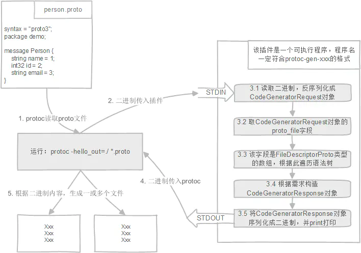

# Protobuf Plugin Program

<!-- TOC -->

- [Protobuf Plugin Program](#protobuf-plugin-program)
    - [Overview](#overview)
    - [Working](#working)
    - [Quick Start](#quick-start)
    - [Compile Protobuf Plugin C++](#compile-protobuf-plugin-c)
    - [How To Use Plugin](#how-to-use-plugin)
    - [Protobuf Plugin API](#protobuf-plugin-api)
        - [CodeGeneratorRequest](#codegeneratorrequest)
        - [CodeGeneratorResponse](#codegeneratorresponse)
    - [Appendix: References](#appendix-references)

<!-- /TOC -->

## Overview

Protobuf 官方似乎并没有提供详细的插件编程入门指导和示例，因此要进行 Protobuf 插件编程是具有一定门槛的，例如：

- 插件的工作机制是怎么样的。
- 我们如何去编译插件代码。
- 我们如何在 protoc 运行时，指定运行我们的 protobuf 插件。
- 插件代码如何去解析 Protobuf 文件，Protobuf 为插件开发者提供了什么接口。

本文将带着这些问题，对 Protobuf 插件编程进行总结和梳理。

对于 Protobuf 的使用，protoc 的原生编译，请参考 [Protobuf Overview](https://developers.google.com/protocol-buffers/docs/overview)。

## Working

Protobuf Plugin 的工作流程方式是非常简单的：

- protoc 进程解析 `.proto` 文件后，会通过子进程的方式拉起插件进程。
- protoc 进程通过标准输入和输出与子进程进行通信。
- 插件子进程通过标准输入获得 protoc 提供的 `.proto` 数据结构，并通过标准输出，告诉 protoc 进程如何生成文件。
- protoc 进程获悉子插件进程提供的数据。
- protoc 进程生成文件。



从上述可以看出，Protobuf Plugin 并不会限制到底用什么语言，什么方式去实现插件，只需要提供一个进程，该进程通过标准输入获得解析的 proto 结构，再通过标准输出，将希望生成的内容交给 protoc 进程。因此，通常 Protoc 插件有两种方式：

- 通过 Python 等脚本实现插件进程，这种方式开发简单方便，但是要求机器上安装了相应的解释器，以及安装相应的 Python 包。
- 通过 C++ 编译一个插件进程，这种方式开发复杂，编译复杂，但是一旦编译好后就可以使用，依赖较少。

## Quick Start

在 Quick Start 中，我们提供一种 Python 脚本（其实任意语言都可以）的方式来进行 Protoc 的插件编译，因为采用 Python 脚本，因此并不需要我们编译插件，即写即用（但是需要安装 Protobuf 的 Python 依赖包）。

Protoc 在解析 `.proto` 文件后，会拉起 Plugin 子进程，并通过 stdin，将相关解析数据交给 Plugin 子进程进行处理。

- 首先，安装相关依赖：

  ```sh
  # Demo 中使用 virtualenv 生成解释器，使用 Python3.6
  $ virtualenv venv --python=python3.6
  $ source ./venv/bin/activate

  # 安装 Python 对 Protobuf 插件编程的依赖
  $ pip install protobuf
  ```

- 接着，我们提供一个简单的 `.proto` 文件，请参考 [hello.proto](quic-start/hello.proto)。
- 我们提供 Python 脚本 [protoc-gen-custom](quic-start/protoc-gen-custom)：

  ```py
  #!/data/workspace/proto/venv/bin/python

  import sys

  from google.protobuf.compiler import plugin_pb2 as plugin
  from google.protobuf.descriptor_pb2 import DescriptorProto, EnumDescriptorProto


  def generate_code(request, response):
      parts = []
      for f in request.proto_file:
          parts.append(f.name + "\n")
          parts.append("  Messages: \n")
          for m in f.message_type:
              parts.append("    " + m.name + "\n")
          parts.append("  Services: \n")
          for s in f.service:
              parts.append("    " + s.name + "\n")
      content = "".join(parts)

      # 打印调试信息, 因为标准输出是给 protoc 父进程获取用的，因此这里使用标准错误输出进行打印
      sys.stderr.write(content)

      # 生成文件和内容
      response.file.add()
      response.file[0].name = 'proto.profile'
      response.file[0].content = content


  if __name__ == '__main__':
      # 从标准输入中获取二进制数据，并解析成 CodeGeneratorRequest 结构
      data = sys.stdin.buffer.read()
      request = plugin.CodeGeneratorRequest()
      request.ParseFromString(data)

      # 构建 CodeGeneratorResponse，用于设置响应
      response = plugin.CodeGeneratorResponse()
      generate_code(request, response)

      # 序列化 CodeGeneratorResponse，通过标准输出返回给 protoc 父进程。
      output = response.SerializeToString()
      sys.stdout.buffer.write(output)

  ```

- 最后，我们可以在 protoc 运行时指定插件进程（这里 Python 插件脚本名叫 `protoc-gen-custom`，文件名没有 `.py` 后缀）：

  ```sh
  protoc --plugin=protoc-gen-custom=./protoc-gen-custom --custom_out=. hello.proto 
  ```

- 运行后，我们可以看到如下输出:

  ```sh
  $ protoc --plugin=protoc-gen-custom=./protoc-gen-custom --custom_out=. hello.proto 
  hello.proto
    Messages: 
      FooRequest
      FooResponse
      Hello
    Services: 
      Foo
  
  # 也生成了 proto.profile
  $ cat proto.profile
  hello.proto
    Messages: 
      FooRequest
      FooResponse
      Hello
    Services: 
      Foo
  ```

更多 protoc 使用插件的内容，请参考 [How To Use Plugin](#how-to-use-plugin)。

对于 CodeGeneratorRequest 和 CodeGeneratorResponse 所暴露的接口可以参考 [protobuf plugin.pb.h](https://developers.google.com/protocol-buffers/docs/reference/cpp/google.protobuf.compiler.plugin.pb?hl=ja)。

## Compile Protobuf Plugin C++

编译 Protobuf C++ 插件是比较麻烦的，这里建议使用 Bazel 进行 Protobuf C++ 插件的编译。如果嫌编译麻烦，可以用 Python 脚本提供 Protobuf 插件。

Bazel 是 Google 提供的编译工具，很多工程中我们都会使用 Bazel 进行编译。这不是一个 Bazel 的教程，对于 Bazel 的更多信息请访问 [Bazel](https://bazel.build/)。

在 Protoc Plugin 中，我们期望使用 Bazel 解决问题：

- 如何使用 Bazel 编译 Protobuf Plugin C++？

首先，在 Bazel 的 WORKSPACE 中引入编译依赖的 protobuf、zlib 等仓库:

```bazel
load("@bazel_tools//tools/build_defs/repo:git.bzl", "git_repository")
load("@bazel_tools//tools/build_defs/repo:http.bzl", "http_archive")

git_repository(
  name = "protobuf",
  remote = "https://github.com/google/protobuf",
  branch = "master"
)

http_archive(
    name = "rules_python",
    url = "https://github.com/bazelbuild/rules_python/releases/download/0.2.0/rules_python-0.2.0.tar.gz",
    sha256 = "778197e26c5fbeb07ac2a2c5ae405b30f6cb7ad1f5510ea6fdac03bded96cc6f",
)

http_archive(
  name = "zlib",
  build_file = "@protobuf//:third_party/zlib.BUILD",
  sha256 = "c3e5e9fdd5004dcb542feda5ee4f0ff0744628baf8ed2dd5d66f8ca1197cb1a1",
  strip_prefix = "zlib-1.2.11",
  urls = [
    "https://mirror.bazel.build/zlib.net/zlib-1.2.11.tar.gz",
    "https://zlib.net/zlib-1.2.11.tar.gz",
  ],
)

http_archive(
  name = "bazel_skylib",
  urls = [
    "https://github.com/bazelbuild/bazel-skylib/releases/download/1.0.3/bazel-skylib-1.0.3.tar.gz",
    "https://mirror.bazel.build/github.com/bazelbuild/bazel-skylib/releases/download/1.0.3/bazel-skylib-1.0.3.tar.gz",
  ],
  sha256 = "1c531376ac7e5a180e0237938a2536de0c54d93f5c278634818e0efc952dd56c",
)
load("@bazel_skylib//:workspace.bzl", "bazel_skylib_workspace")
bazel_skylib_workspace()
```

再在 Bazel 的 BUILD 中指定插件的依赖和编译规则：

```bazel
cc_binary(
  name = "protoc-gen-demo",
  srcs = ["protoc-gen-demo.cc"],
  deps = [
    "@protobuf//:protobuf",
    "@protobuf//:protoc_lib",
  ],
)
```

接着提供插件代码 `protoc-gen-demo.cc` 就能进行编译了，现在提供一个处理 `.proto` 固定出错的一个插件代码：

```cpp
#include <iostream>

#include "google/protobuf/compiler/code_generator.h"
#include "google/protobuf/compiler/plugin.h"
#include "google/protobuf/compiler/plugin.pb.h"
#include "google/protobuf/descriptor.h"

class DemoGenerator : public google::protobuf::compiler::CodeGenerator {
 public:
  bool Generate(const google::protobuf::FileDescriptor* file, const std::string& parameter,
                google::protobuf::compiler::GeneratorContext* context,
                std::string* error) const override {
    error->append("========= IT IS A TEST ========");
    return false;
  }
};

int main(int argc, char* argv[]) {
  DemoGenerator generator;
  return google::protobuf::compiler::PluginMain(argc, argv, &generator);
}
```

最后，我们可以进行 bazel 的编译了：

```sh
$ bazel build :protoc-gen-demo
INFO: Analyzed target //plugin:protoc-gen-demo (0 packages loaded, 0 targets configured).
INFO: Found 1 target...
Target //plugin:protoc-gen-demo up-to-date:
  bazel-bin/plugin/protoc-gen-demo
INFO: Elapsed time: 0.063s, Critical Path: 0.00s
INFO: 1 process: 1 internal.
INFO: Build completed successfully, 1 total action
```

同样，我们也提供了一个简单的 `.proto` 文件 [hello.proto](bazel-compile-plugin/hello.proto)。

我们使用这个 `protoc-gen-demo` 插件编译 `.proto` 文件：

```sh
$ protoc --plugin=protoc-gen-demo=bazel-bin/protoc-gen-demo --demo_out=. hello.proto 
--custom_out: hello.proto: ========= IT IS A TEST ========
```

具体代码可以参考 [bazel-compile-plugin](bazel-compile-plugin/readme.md)。

## How To Use Plugin

将 Plugin 的进程文件准备好后，需要在 protoc 编译时进行使用，有两种方式指定插件：

- 通过 `--plugin` 参数，指定插件二进制文件路径：

  ```sh
  # 以下 NAME 是插件的名称
  protoc --plugin=protoc-gen-NAME=path/to/mybinary --NAME_out=OUT_DIR
  # e.g. NAME = xrpc, PATH = /data/workspace/xrpc-plugin/xrpc_cpp_plugin
  protoc --plugin=protoc-gen-xrpc=/data/workspace/xrpc-plugin/xrpc_cpp_plugin --xrpc_out=OUT_DIR
  ```

- 将 Plugin 的二进制文件放置到环境变脸 PATH 的任意路径下，并且将二进制文件命名为 `protoc-gen-NAME` (NAME 是插件名称)，这样就不用通过 `--plugin` 参数指定使用的插件：

  ```sh
  protoc --NAME_out=OUT_DIR
  # e.g. NAME = xrpc
  protoc --xrpc_out=OUT_DIR
  ```

## Protobuf Plugin API

这里列出 [protobuf plugin.pb.h](https://developers.google.com/protocol-buffers/docs/reference/cpp/google.protobuf.compiler.plugin.pb?hl=ja) 中提供的部分内容，插件所用的 API 就是这些 protobuf 所提供的。

### CodeGeneratorRequest

CodeGeneratorRequest 是为插件提供的 protobuf 解析内容数据结构。

```proto
message CodeGeneratorRequest {
  // 在命令行中明确列出的 .proto 文件。 
  // 插件应该只为这些文件生成代码。 
  // 每个文件的=描述符将包含在下面的 proto_file 中。
  repeated string file_to_generate = 1;
  optional string parameter = 2;                    // 通过命令行传递的参数
  optional Version compiler_version = 3;            // Protobuf 编译器版本
  repeated FileDescriptorProto proto_file = 15;
}

// Protobuf 文件解析的数据结构
message FileDescriptorProto {
  optional string name = 1;                 // file name, relative to root of source tree
  optional string package = 2;              // 包名，例如 "foo", "foo.bar", etc.
  repeated string dependency = 3;           // 该文件所导入的 protobuf (imported)
  repeated int32 public_dependency = 10;
  repeated int32 weak_dependency = 11;

  // All top-level definitions in this file.
  repeated DescriptorProto message_type = 4;      // message Message {}
  repeated EnumDescriptorProto enum_type = 5;     // enum Enum {}
  repeated ServiceDescriptorProto service = 6;    // service Service {}
  repeated FieldDescriptorProto extension = 7;

  optional FileOptions options = 8;               // option x = y
  optional SourceCodeInfo source_code_info = 9;
  optional string syntax = 12;                    // "proto2" or "proto3".
}

// Message 语句块解析的数据结构
message DescriptorProto {
  optional string name = 1;

  repeated FieldDescriptorProto field = 2;
  repeated FieldDescriptorProto extension = 6;
  repeated DescriptorProto nested_type = 3;       // 嵌套的 Message，例如 message Message { message Message2 {} }
  repeated EnumDescriptorProto enum_type = 4;

  message ExtensionRange {
    optional int32 start = 1;  // Inclusive.
    optional int32 end = 2;    // Exclusive.

    optional ExtensionRangeOptions options = 3;
  }
  repeated ExtensionRange extension_range = 5;
  repeated OneofDescriptorProto oneof_decl = 8;
  optional MessageOptions options = 7;

  // Range of reserved tag numbers. Reserved tag numbers may not be used by
  // fields or extension ranges in the same message. Reserved ranges may
  // not overlap.
  message ReservedRange {
    optional int32 start = 1;  // Inclusive.
    optional int32 end = 2;    // Exclusive.
  }
  repeated ReservedRange reserved_range = 9;
  // Reserved field names, which may not be used by fields in the same message.
  // A given name may only be reserved once.
  repeated string reserved_name = 10;
}

message ServiceDescriptorProto {
  optional string name = 1;
  repeated MethodDescriptorProto method = 2;
  optional ServiceOptions options = 3;
}

message MethodDescriptorProto {
  optional string name = 1;
  optional string input_type = 2;
  optional string output_type = 3;

  optional MethodOptions options = 4;

  optional bool client_streaming = 5 [[]default = false];
  optional bool server_streaming = 6 [[]default = false];
}


message ServiceOptions {
  optional bool deprecated = 33 [[]default = false];
  repeated UninterpretedOption uninterpreted_option = 999;
  extensions 1000 to max;
}

message MethodOptions {
  optional bool deprecated = 33 [[]default = false];
  optional IdempotencyLevel idempotency_level = 34 [[]default = IDEMPOTENCY_UNKNOWN];
  repeated UninterpretedOption uninterpreted_option = 999;
  extensions 1000 to max;
}

message UninterpretedOption {
  message NamePart {
    required string name_part = 1;
    required bool is_extension = 2;
  }
  repeated NamePart name = 2;

  optional string identifier_value = 3;
  optional uint64 positive_int_value = 4;
  optional int64 negative_int_value = 5;
  optional double double_value = 6;
  optional bytes string_value = 7;
  optional string aggregate_value = 8;
}
```

### CodeGeneratorResponse

CodeGeneratorResponse 是插件生成的，指示 protoc 生成是否失败，以及如何生成文件。

```proto

message CodeGeneratorResponse {
  // File 表示了生成的单个文件
  message File {
    optional string name = 1;
    optional string insertion_point = 2;
    optional string content = 15;
    optional GeneratedCodeInfo generated_code_info = 16;
  }

  // 错误信息，若非空则认为生成失败
  // protoc 判断 error 非空，会以非 0 错误码退出，并打印 error 字符串内容
  optional string error = 1;
  optional uint64 supported_features = 2;
  repeated File file = 15;
}
```

## Appendix: References

- [protobuf plugin.pb.h](https://developers.google.com/protocol-buffers/docs/reference/cpp/google.protobuf.compiler.plugin.pb?hl=ja)
- [protobuf plugin.h](https://developers.google.com/protocol-buffers/docs/reference/cpp/google.protobuf.compiler.plugin)
- [Protoc 及其插件工作原理分析(精华版)](https://www.hitzhangjie.pro/blog/2017-05-23-protoc%E5%8F%8A%E6%8F%92%E4%BB%B6%E5%B7%A5%E4%BD%9C%E5%8E%9F%E7%90%86%E5%88%86%E6%9E%90%E7%B2%BE%E5%8D%8E%E7%89%88/)
- [Protobuf 第三方扩展开发指南](https://www.jianshu.com/p/6f24de5f0f93)
- [通过 C++ 接口为 Protobuf 实现第三方扩展](https://www.jianshu.com/p/a9b93dea96ed)
- [Pod Plugin](https://github.com/snow1313113/pod_plugin)
- [A demo protoc plugin](https://github.com/vsco/protoc-demo)
