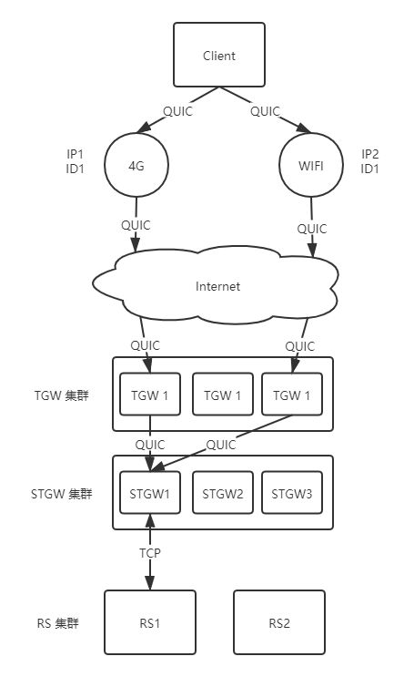

# Game QUIC Explore

<!-- TOC -->

- [Game QUIC Explore](#game-quic-explore)
    - [概述](#概述)
    - [现状](#现状)
        - [主流的游戏网络协议](#主流的游戏网络协议)
        - [QUIC 的标准化](#quic-的标准化)
        - [游戏引擎对 QUIC 的支持](#游戏引擎对-quic-的支持)
        - [QUIC Lib](#quic-lib)
        - [QUIC 闭源生态](#quic-闭源生态)
    - [QUIC Perf](#quic-perf)
    - [附录、参考文献](#附录参考文献)

<!-- /TOC -->

## 概述

游戏中使用何种网络协议可以得到最小的延时和阻塞，提升用户的体验，这是值得我们思考的。

QUIC 作为新兴的网络协议存在无限的可能，本文目的在于探究 QUIC 是否适合于应用于游戏。

QUIC 存在两个分支：

- Google QUIC（下称 GQUIC），由 Google 设计实现，是 IQUIC 的原型。
- IETF QUIC（下称 IQUIC），Google QUIC 的成功推动了 QUIC 的标准化进程，发展除了 IETF QUIC。

**注意：**

- IQUIC 和 GQUIC 

## 现状

### 主流的游戏网络协议

### QUIC 的标准化

> QUIC (pronounced "quick") is a general-purpose transport layer network protocol initially designed by Jim Roskind at Google, implemented, and deployed in 2012, announced publicly in 2013 as experimentation broadened, and described to the IETF.

最早有 Google 开始进行 QUIC 的设计和实现，Google 实现的 QUIC 版本已到了 Q50。从 Chromium 源码上看，早期的 Google QUIC 已经废弃，无法使用。

IETF QUIC 的草案开始于 2016 年，如今仍未结束，从 2016 年的 Draft 00，如今已经到了 Draft 34。

GQUIC 和 IQUIC 之间的区别是巨大的，其中包括：

- 对于 Connection
  - IQUIC 仅支持单连接 ID，GQUIC 支持多个连接 ID，并且 Server 和 Client 具有自己的连接 ID。
- 对于连接迁移
  - GQUIC 的文档并没有描述 GQUIC 的连接迁移细节以及如何校验新 IP 的安全性。IQUIC 通过 PATH_CHALLENGE 和 PATH_RESPONSE 帧进行连接迁移。
- 对于握手
  - GQUIC 使用在 Stream 的基础上进行握手。在 GQUIC 中使用 stream id 为 1 的特殊 stream 进行握手相关操作。IQUIC 使用 Initial 和 Handshake Packet 进行握手。
- 关于文档
  - GQUIC 的文档由 Chromium 维护，并且文档并非足够完善。
  - IQUIC 文档目前由 IETF 维护，对 QUIC 的方方面面进行了详尽的阐述。

### 游戏引擎对 QUIC 的支持

受限于 QUIC 协议本身标准化仍未完成，主流游戏引擎也并未对 QUIC 做任何支持。

这是一些相关的讨论：

- [QUIC in Unity](https://forum.unity.com/threads/quic-in-unity.793914/)

  > Is QUIC even finalized in terms of specs? I don't think we're there yet. Would be cool though.

- [Are there any game clients/engines, or server libraries/frameworks that take advantage of QUIC?](https://www.reddit.com/r/gamedev/comments/eglknu/are_there_any_game_clientsengines_or_server/)
- [Question about QUIC viability for multiplayer gaming](https://www.reddit.com/r/networking/comments/gjiohd/question_about_quic_viability_for_multiplayer/fqlainn/)

也有一些对 QUIC 在游戏中的应用持有消极看法：

- <https://news.ycombinator.com/item?id=18518336>

  > These make no sense for a game engine. If we have a sequence of player movements, lets say their X position [1, 2, 3], but we miss a packet [1, -, 3] we're fine, we only want their most recent packet. But the protocol will require acknowledgment and that packet to be resent, so it will require 8 different packets be sent, instead of 3! We don't even need the packet!

- [QUIC Network Preformance Improvements](https://www.reddit.com/r/starcitizen/comments/eih33j/quic_network_preformance_improvements_dev_response/?sort=old)

  > Having quickly read through the IETF draft I don't think QUIC would be suitable for our needs because it is a stream-based protocol and provides full reliable transport of all stream data. When a connection is suffering from high packet loss, reliable stream transport can lead to head-of-line-blocking causing high latency due to the receiver needing to process all packets in the order they were sent, and any lost packets having to be re-sent before the receiver can continue processing the stream.

- [UDP for games](http://ithare.com/udp-for-games-security-encryption-and-ddos-protection/)

  > QUIC is inherently stream-oriented, and we cannot use it “as is” for fast-paced state sync stuff.

总结：

- QUIC 协议的标准化尚未完成，游戏引擎并不支持 QUIC。
- 游戏领域对 QUIC 普遍不太看好，因为 QUIC 是基于流且可靠的协议，而大部分网络游戏不太依赖于协议层提供可靠性。

### QUIC Lib

市面上目前主流的 QUIC Lib 可以参考 [wiki-quic-source-code](https://en.wikipedia.org/wiki/QUIC#Source_code)。

以下是各个 QUIC 截止目前 (2021 年 3 月 23 日) 对各版本 QUIC 协议和平台的支持情况：

Lib | Language | Supported IQUIC Versions | Supported GQUIC Versions | Supported Platform | Complex
-|-|-|-|-|-
[Chromium](https://www.chromium.org/quic) | C | I27,29 | Q43,46,50 | Most | Hard
[msquic](https://github.com/microsoft/msquic) | C | I29 | - | Linux Windows | Middle
[mvfst](https://github.com/facebookincubator/mvfst) | C++ | I27 I29 | - | Linux Android iOS | Middle
[ngtcp2](https://github.com/ngtcp2/ngtcp2) | C | I22-32 | - | Linux | Middle
[quicly](https://github.com/h2o/quicly) | C | I27 | - | Most | Easy
[lsquic](https://github.com/litespeedtech/lsquic) | C | I27,29,34 | Q43,46,50 | Linux MacOS Android Windows | Middle
[picoquic](https://github.com/private-octopus/picoquic) | C | I27 | - | Linux Windows | Middle
[rawquic](https://github.com/sonysuqin/RawQuic) | C | I27,29 | Q43,46,50 | Most | Hard
[aioquic](https://github.com/aiortc/aioquic) | Python | I29,30,31,32 | - | Most | Easy
[quic-go](https://github.com/lucas-clemente/quic-go) | GO | I29,32,34  | - | Most | Unknown
[quiche](https://github.com/cloudflare/quiche) | RUST | I27,28,29  | - | Most | Unknown
`t****c` | C++ | - | Q43,46,50 | Linux Windows MacOS Android iOS | Hard
`a****a` | C++ | I27,29 | Q43,46,50 | Linux MacOS Android iOS | Hard

**注意：**

- 对于 lsquic，虽然其 [readme.md](https://github.com/litespeedtech/lsquic/blob/master/README.md) 中提到支持 Linux MacOS Android Windows 等平台，但是在 [Issues242](https://github.com/litespeedtech/lsquic/issues/242) 和 [Issues3](https://github.com/litespeedtech/lsquic/issues/3) 中其作者提到 lsquic 仅对 Linux 进行支持，其他平台并非官方提供并不做任何承诺。
- picoquic 是 QUIC 协议的极简实现，代码仍在开发中。
- quickly 提供的是纯协议栈算法，数据收发由开发人员控制，类似于 KCP，因此和环境是剥离的，但是需要开发人员写代码支持。
- 其中某些 QUIC 库是对 Chromium 的封装： rawquic, `t****c` 和 `a****a`。
- `t****c` 为 Chromium 的封装，但是没有做到对 IQUIC 的协议支持，主要原因是其需要 checkout 较老版本的 Chromium 源码，其和当前的协议存在兼容性问题。

总结：

- GQUIC 是落后的，原因有二：
  - 市面上主流 QUIC 协议栈
  - IETF QUIC 是标准，没有人愿意去实现 Google 那套。即便 Google QUIC 的 文档中也提及：
  > QUIC is now an IETF spec and its cryptographic handshake is now based on TLS 1.3 rather than this work. Thus this document is only of historical interest.
- QUIC 协议库对 IQUIC 27 和 29 的支持是最多的。
- QUIC 协议库均对 Linux 支持的较好，Chromium 对绝大多数平台支持的较好。

### QUIC 闭源生态

TEG 提供了 QUIC 接入方案：

- Server，提供 STGW 作为 QUIC 的入口和代理并通过 TCP 连接到 RS，简化 RS 开发的复杂度。
- Client，提供 `t****c` 作为开发的 SDK（同时 WXG 也提供了自己的 QUIC SDK：`a****a`）。

STGW 支持的 QUIC 协议有：

- Q43,46,50
- I27,29,31

STGW QUIC 方案架构图：

- 第一层 TGW 仅负责解析 QUIC 包中的连接 ID，并根据连接 ID 将请求转发给 STGW 集群节点。转发规则为根据连接 ID 的 Hash 值。
- 第二层 STGW 节点实际的解析 QUIC 包中的数据，并建立到 RS 的连接。
- 第三层 RS 集群为业务提供，业务只需要使用简单的 TCP Server 即可处理客户端过来的 QUIC 包。

总结：

- 生态优势：
  - 避免重复造轮子。
  - 减少服务器运维成本，方便进行扩缩容。
  - `t****c` 支持明文模式。
  - `t****c` 天生支持 QUIC 降级，即 QUIC 通信失败会自动降级为 TCP。
- 生态劣势：
  - `t****c` 对 IQUIC 的支持非常差，名义上是支持的，但是实际上建立连接会失败，这是由于 `t****c` 依赖了不兼容版本的 Chromium 所致。
  - STGW 依赖了 `t****c` 进行实现，所以其对 IQUIC 的支持较差，但是其却实际上可以进行连接和通信。
  - STGW 只能对 Q043 支持连接迁移。

**注意：**

- 腾讯云的 CLB 和 STGW 使用的是相同的底层技术，STGW 支持的 CLB 也会支持。
- CLB 和 STGW使用的底层技术版本可能存在不同，通常会先更新 STGW 版本，在更新 CLB 的版本。

## QUIC Perf

## 附录、参考文献

1. [wiki-quic](https://en.wikipedia.org/wiki/QUIC)
1. [IETF QUIC WG Base Draft](https://github.com/quicwg/base-drafts/wiki/Implementations)
1. [UDP for games – security (encryption and DDoS protection)](http://ithare.com/udp-for-games-security-encryption-and-ddos-protection/)
1. [Google QUIC](https://github.com/lsj9383/blog/blob/master/posts/quic/gquic/readme.md)
