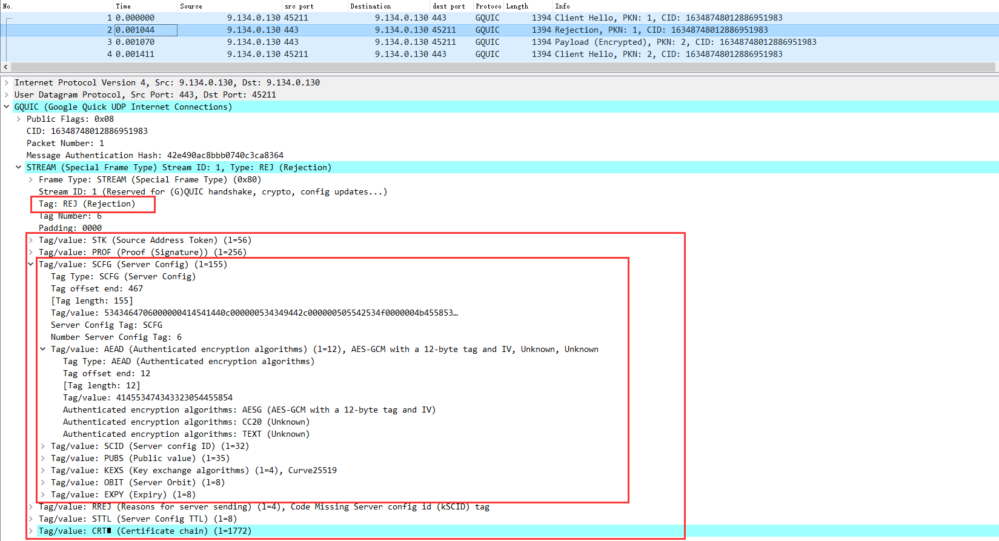
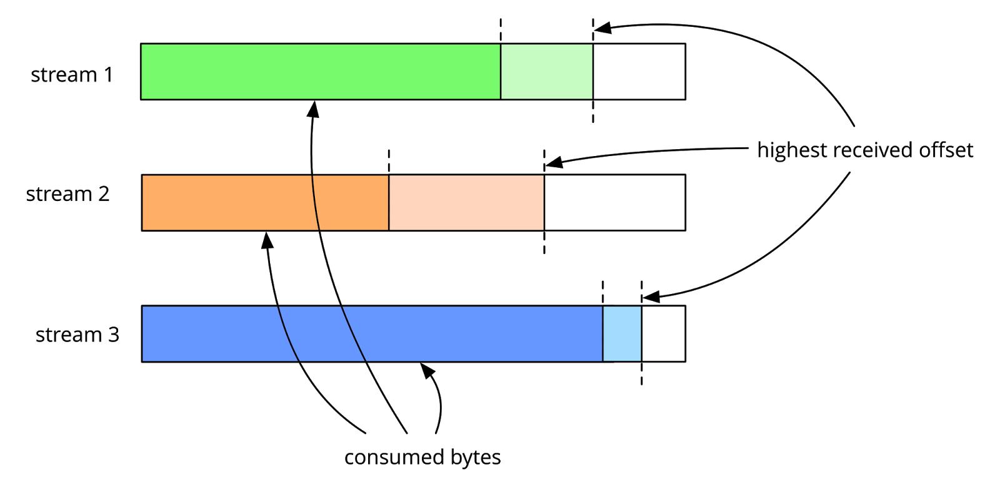

# Google QUIC

<!-- TOC -->

- [Google QUIC](#google-quic)
    - [概述](#概述)
    - [连接与流](#连接与流)
        - [版本协商](#版本协商)
        - [建立连接](#建立连接)
        - [断开连接](#断开连接)
            - [正常关闭](#正常关闭)
            - [超时关闭](#超时关闭)
            - [异常关闭](#异常关闭)
        - [创建流](#创建流)
        - [断开流](#断开流)
    - [GQUIC 握手与加密](#gquic-握手与加密)
        - [两个问题](#两个问题)
        - [客户端 Hello](#客户端-hello)
        - [服务器 Hello](#服务器-hello)
    - [流量控制](#流量控制)
        - [Stream 流控](#stream-流控)
        - [Stream 流控更新策略](#stream-流控更新策略)
        - [Connection 流控](#connection-流控)
        - [Connection 流控更新策略](#connection-流控更新策略)
        - [RST 考虑](#rst-考虑)
        - [与 TCP 流控的差异](#与-tcp-流控的差异)
    - [丢失恢复和拥塞控制](#丢失恢复和拥塞控制)
        - [与 TCP 的差异](#与-tcp-的差异)
        - [GQUIC Loss Recovery](#gquic-loss-recovery)
        - [GQUIC 拥塞控制](#gquic-拥塞控制)
        - [GUIQC RTO](#guiqc-rto)
    - [协议结构](#协议结构)
        - [Packet](#packet)
            - [Version Negotiation Packet](#version-negotiation-packet)
            - [Public Reset Packet](#public-reset-packet)
            - [Regular Packet](#regular-packet)
        - [Frame](#frame)
            - [STREAM Frame](#stream-frame)
            - [ACK Frame](#ack-frame)
            - [STOP_WAITING Frame](#stop_waiting-frame)
            - [WINDOW_UPDATE Frame](#window_update-frame)
            - [BLOCKED Frame](#blocked-frame)
            - [CONGESTION_FEEDBACK Frame](#congestion_feedback-frame)
            - [PADDING Frame](#padding-frame)
            - [RST_STREAM Frame](#rst_stream-frame)
            - [PING Frame](#ping-frame)
            - [CONNECTION_CLOSE Frame](#connection_close-frame)
            - [GOAWAY Frame](#goaway-frame)
        - [传输参数](#传输参数)
        - [Error Code](#error-code)
    - [向 IETF QUIC 过渡](#向-ietf-quic-过渡)
    - [附录、参考文献](#附录参考文献)

<!-- /TOC -->

## 概述

Google QUIC 又称为 GQUIC（后面统称为 GQUIC），是由 Google 设计并进行实践的。

由于 Google QUIC 的成功，开始了 QUIC 的标准化流程，标准化的 QUIC 被称为 IETF QUIC（IQUIC）。对于 IQUIC 的细节，在 [AIOQUIC](../lib/aioquic/readme.md) 中进行了阐述。

IQUIC 和 GQUIC 之间的差异是巨大的，从协议的实现角度来看，它们是完全不同的，并且是无法相互兼容的。为了让 GQUIC 逐步向 IQUIC 靠拢和兼容，新的 GQUIC 协议开始采用和 IQUIC 类似的协议结构了（请参考 [向 IETF QUIC 过渡](#向-ietf-quic-过渡)）。

GQUIC 的特点：

- Connection establishment latency
- Flexible congestion control
- Multiplexing without head-of-line blocking
- Authenticated and encrypted header and payload
- Stream and connection flow control
- Connection migration

本文主要参考 [QUIC Wire Layout Specification](https://docs.google.com/document/d/1WJvyZflAO2pq77yOLbp9NsGjC1CHetAXV8I0fQe-B_U/edit#) 而进行的总结，该文档的版本范围适用于 Q043 及其以下版本。

对于 Q043 以上的版本，在 Google QUIC 官网中并没有详细文档，我猜想这是由于 IQUIC 开始逐步替代 GQUIC 所致。

## 连接与流

GQUIC 不同于传统 TCP 通过五元组对连接（Connection）进行标识，而是通过一个随机的 Connection ID 进行标识。

本质上，当连接 ID 两端达成一致，即可认为连接建立。对于应用层而言，连接建立（通信双发达成一致的 Connection ID）并不代表连接可用，而是需要版本、加密、传输等参数也达成一致，这一过程通过握手来完成。

在 GQUIC 中，一个 Connection 可以创建非常多的流（Stream），每个 Stream 之间是独立的，且可以安全的发送数据，某个流丢包导致阻塞并不会影响 Connection 上其他 Stream 的使用。

### 版本协商

QUIC 的版本是非常多的，即便是 GQUIC 目前版本也超过了 50，客户端和服务器之间进行 QUIC 通信，首先第一步就是需要确认版本。

GQUIC 中存在一种 Special Packet，客户端通过 Special Packet 告诉服务器希望使用的版本，而服务器接受则可以继续通信，否则会返回类似的 Special Packet，并带上服务器支持的版本号，客户端收到后需要选择服务器支持的版本号重发 QUIC Packet。

```txt
     Endpoint                                 Peer

Packet(version_flag ON,
       version=G040)   --------->
                       <---------      Version Negotiation(version_flag ON,
                                                           versions=G043 G046 G050)

Packet(version_flag ON,
       version=G043)   --------->
                       <---------      Packet(version_flag OFF)
```

### 建立连接

首次建立连接需要 1-RTT，首先发送 Inchoate Client Hello，并等待 Server 返回 Reject，该 Reject 中包含了进行完整 Client Hello 的相关信息。

Client 得到 Reject 后进行信息验证，验证成功后发起完整的 Client Hello。

Reject 中的信息可以让 Client 构建非前向安全的 Keys，因此 Client Hello 发送后可以使用该 Keys 紧接着发送应用层数据，以此在 1-RTT 的时候就发送数据。

```txt
     Endpoint                                                     Peer

(Inchoate Client Hello)
ClientHello(STREAM<s=1>, PADDING)   --------->
                                                  <---------   Reject(STREAM<s=1, Server Config>)
                                                  <---------   Packet(STREAM<s=1, remain crt>)

[Verify Server Config]

(Full Client Hello)
ClientHello(STREAM<s=1>, PADDING)   --------->
Packet(STREAM<s=3>)                 --------->
                                                  <---------   ServerHello(STREAM<s=1>)

========================================= 完成握手 ====================================================================

Packet(STREAM<s=3>)                 --------->
                                                  <---------   Packet(STREAM<s=3>)
```

握手完成后，两端都拿到了前向安全的 Keys，后续会切换为前向安全的 Keys 加密发送 Packet。

后续如果有需要再和 Server 握手，因为先前已经校验过 Server Config 了，因此可以直接发起完整 Client Hello 建立连接，此时是 0-RTT 发送数据。

```txt
(Full Client Hello)
ClientHello(STREAM<s=1>, PADDING)   --------->
Packet(STREAM<s=3>)                 --------->
                                                  <---------   ServerHello(STREAM<s=1>)

========================================= 完成握手 ====================================================================

Packet(STREAM<s=3>)                 --------->
                                                  <---------   Packet(STREAM<s=3>)
```

### 断开连接

连接一旦建立，有三种断开连接的方式：

- 正常关闭，通过发送 CONNECTION_CLOSE Frame。
- 超时关闭，GQUIC 连接空闲时间过长会触发超时关闭。
- 异常关闭，通过 PACKET 的 REST Flag 可以将连接进行异常终止。这个关闭方式类似于 TCP RST。

#### 正常关闭

通过发送 CONNECTION_CLOSE Frame 进行关闭，并且所有的 Stream 将会被关闭。

```txt
     Endpoint                        Peer

Packet   --------->
                       <---------   Packet
Packet   --------->
                       <---------   Packet

                       <---------   Packet(CONNECTION_CLOSE)
```

这看起来是没有问题的，但是其实最佳的做法是在发送 CONNECTION_CLOSE 前，应该显示的关闭所有的 Stream：

```txt
     Endpoint                                              Peer

Packet(STREAM<s=3>)        --------->
                                        <---------   Packet(STREAM<s=3>)
                                        <---------   Packet(STREAM<s=2>)

                                        <---------   Packet(STREAM<s=3, FIN>)
                                        <---------   Packet(STREAM<s=2, FIN>)
Packet(STREAM<s=3, FIN>)   --------->
Packet(STREAM<s=2, FIN>)   --------->
                                        <---------   Packet(CONNECTION_CLOSE)
```

如果收到 CLOSE_CONNECTION 时，还存在者活跃的 Stream，则 CLOSE_CONNECTION 的接收方应该认为这是一个异常的关闭。

#### 超时关闭

GQUIC 连接默认空闲超时为 30s，该超时时间为连接协商中的必需参数 `ICSL`，且最多设置为 10min。

GQUIC 在连接超时关闭时可以有两种选择：

- 可以发送 CONNECTION_CLOSE Frame 给对方告知连接关闭。
- 不发送 CONNECTION_CLOSE Frame，进行静默关闭。这种关闭策略主要是为了避免移动端无线电网络的唤醒，节约用电。


```txt
     Endpoint                              Peer

       Packet   --------->
                             <---------   Packet
       Packet   --------->
                             <---------   Packet

==================================== Time out ====================================

                             <---------   optional Packet(CONNECTION_CLOSE)
```

#### 异常关闭

通过 REST Packet 可以立即终止一个 Connection，这可能是由于某些错误的状态或者错误的协议所致。REST Packet 和 TCP 中的 RST 关闭很类似。

为了避免被恶意第三方通过构造 REST Packet 关闭连接，需要对 REST Packet 进行认证。

### 创建流

Stream 的创建是非常简单的，只需要使用某个 Stream ID 发送数据，则接收方在收到后默认创建该 Stream。

Stream 的 Stream ID 是有讲究的，为了避免两端同时创建流，并使用了相同的 Stream ID，导致 Stream ID 冲突。客户端创建的 Stream ID 必须为奇数，服务器创建的 Stream ID 必须为偶数。

如果接收到 Stream 一端不希望接收该 Stream，可以立即发送 RST_STREAM Frame。不接受 Stream 的原因可能是因为发送过 GOAWAY Frame 所致。

### 断开流

流在以下三种情况会进行关闭：

- 正常关闭，通过 STREAM Frame 中的 FIN Flag，表示该 Stream 的某个方向进行半关闭。当两个方向都进行关闭后，Stream 进行真正的关闭。
- 异常关闭，通过 RST_STREAM Frame。
- 连接关闭，当 Connection 关闭时，将隐式关闭连接中所有的 Stream。

## GQUIC 握手与加密

本章节主要参考 [QUIC Crypto](https://docs.google.com/document/d/1g5nIXAIkN_Y-7XJW5K45IblHd_L2f5LTaDUDwvZ5L6g/edit)。

需要引起注意的是，GQUIC 是较早期 Google 实施的，而 GQUIC 采用的是 Google 自己的一套加密方案。QUIC 标准化后，采用的加密方式已经换位了 TLS 1.3，因此 GQUIC 的加密方式在 IQUIC 中是完全不适用的。

在 Google QUIC Crypto 文献中也提及：

> The QUIC crypto protocol is the part of QUIC that provides transport security to a connection. The QUIC crypto protocol is destined to die. It will be replaced by TLS 1.3 in the future, but QUIC needed a crypto protocol before TLS 1.3 was even started.

GQUIC 的握手中最重要的是需要协商出进行加密的参数。

GQUIC 提供了 0-RTT 握手，相比于 TCP + TLS 的方式，握手的效率更高。

### 两个问题

TCP 和 TLS 的握手会交换两个非常重要的随机数：

- TCP 的序列号，可以防 IP 地址欺骗。
- TLS 的加密随机数（client_random 和 server_random），用于防重放攻击。

任何期望减少、消除往返开销的握手协议都应该考虑这里两个安全问题。

在 GUQIC 中，通过 Server 颁发 Source-address token 给特定的 Client 以此来防 IP 地址欺骗：

- 在 Source-address token 由 Client Address 和时间戳等信息加密而成。
- Client 后续发送的 Hello 数据包应该带上 Client Address，以此让 Server 校验 Client Address。
- Source-address token 并非必要的，若确认没有 IP 地址欺骗，可以不使用。
- 连接迁移时，需要 Server 重新发放 Source-address token（GQUIC 的连接迁移流程并没有详细的文档可以参考）。

在 GQUIC 握手时通过 Server 和 Client 发放随机数的方式以防重放攻击，这看起来和 TLS 的方式比较类似。

### 客户端 Hello

GQUIC 握手均是通过 0-RTT 发起的，只是首次 0-RTT 握手由于缺乏服务器的信息，会被服务器 REJECT，此时服务器会返回一些帮助客户端握手的信息。

客户端使用服务器 REJECT 时返回的信息重试握手，通过这样的方式，对于首次握手会从 0-RTT 退化至 1-RTT。


对于 0-RTT 握手，客户端需要有经过验证的 Server Config，并发送 Client Hello。

对于首次握手，由于缺失经过验证的 Server Config，会发送 Inchoate Client Hello，以触发服务器的 Server Config 下发。

**注意：**

- 为了避免源地址欺骗导致的放大攻击，Server 不会对未经验证的客户端发送大量的数据，因此这可能导致几轮 Inchoate Client Hello 的发送（Inchoate Client Hello 是会用 PADDING 进行填充的，目的是为了 Server 一次发送尽可能多的数据）。

Client Hello 会先给 Message 贴上 CHLO 标签，并通过 Tag/Value 的方式发送自己的信息，Client Hello 常用一下 Tag：

- SNI：Server Name Indication (optional)，服务器的 DNS 名称。
- STK：Source-address token (optional)，服务器 Server Hello 时下发的 token，是服务器进行源地址校验的根据。对于 Inchoate Client Hello 是不填的。
- PDMD：Proof demand，以优先顺序描述可接受的证明类型的标签列表。当前仅定义 X509。
- CCS：Common certificate sets (optional)，客户端拥有的一系列 64 位 FNV-1a 哈希集。
- CCRT：Cached certificates (optional)，服务器的一系列 64 位 FNV-1a 高速缓存的证书的哈希。
- VER：Version，指定 QUIC 协议的版本。本质上是 GQUIC Packet 中 Version 的镜像。
- XLCT：Client 希望 Server 使用的叶子证书的 FNV-1a 的 Hash 值。

**注意：**

- 针对 VER Tag 需要做一下说明：如果 Server 不支持版本触发了版本协商，Client 第二次发送 Packet 时，Client Hello 中的 VER Tag 仍然保持第一次使用的版本。这是因为 Server 需要校验 VER Tag 来确保是真的由于不支持协议导致的降级，而不是由于人为引起的恶意降级攻击（降级攻击通常是由中间人发起，试图将 Client 和 Server 两端的通信协议降级，降级后可以使用一些老旧的漏洞解密用户的信息）。

这是一个 GQUIC Inchoate Client Hello 抓包图：


当 Server 通过 Server Hello 下发了自己的信息后，Client 应该重新发起握手，并且带上如下 Tag/Value ：

- SCID：Server config ID，由 Server Hello 中的 Server Config 指定的。
- AEAD：Authenticated encryption，用于 AEAD 算法。
- KEXS：Key exchange，指明 Key 交换算法。
- NONC：客户端随机数。由4个字节的时间戳，8个字节的 Server Orbit 和20个字节的随机数据组成。
- SNO：Server nonce (optional): 回显 Server 下发的随机数。
- PUBS：Public value，对于密钥交换算法使用的公钥。
- CETV：Client encrypted tag-values (optional)，该消息将包含更多的加密标记值对，用于指定客户端证书，ChannelID 等。

这是一个 GQUIC Client Hello 抓包图：


发送完整的 Client Hello 后，Client 拥有非前向安全的密钥，这个密钥被称为初始密钥，用于发送 0-RTT 的数据（对于首次握手属于 1-RTT 数据）。

该非前向安全的密钥是根据 Server Config 和 PUBS 中的值来进行计算的。


### 服务器 Hello

对于 Inchoate Client Hello，Server 会返回 REJ 并且附带后续进一步握手的消息，对于 REJ Message 会贴上 REJ 标签，且常用的 Tag/Value 有：

- SCFG：Server config (optional)，Server Config 的序列化内容，其中又包括了子 Tag/Value：
  - SCID：Server config ID，Server Config 标识。
  - KEXS：Key exchange algorithms，服务器支持的密钥交换算法。
  - AEAD：Authenticated encryption algorithms，列出服务器支持的 AEAD 算法。
  - PUBS：一组公共值。
  - ORBT：orbit，一个 8 字节的值，客户端会用 orbit 生成随机数。
  - EXPY：Expiry，Server Config 的过期时间。
  - VER：Versions (optional)，服务器支持的版本列表，以确认未发生服务器降级。
- STK：Source-address token (optional)，Client Hello 应该带上的 Token。
- SNO：Server nonce (optional)，Server 设置的随机数，Client 应在任何将来的 Client Hello 消息中回显该随机数。
- STTL：服务器配置有效持续时间。
- CRT：Certificate chain (optional)：Server 证书链，经压缩。
- PROF：Proof of authenticity (optional)，对于 X.509，用子节点证书的公钥对 Server Config 进行签名，以便客户端校验 Server Config 的真实性。

这是一个 GQUIC REJ 抓包图：



在发送 REJ 后，Server 可以拥有非前向安全的 Keys，此时需要等待完整的 Client Hello，以得到前向安全的 Keys。

Client 发送完整的 Client Hello 后，Server 获得了 Public Value，两端可以计算前向安全的 Keys，随后 Server 可以切换为使用前向安全的 Keys 发送 Packet。

Client 必须等待 Server Hello，Server Hello 处理 REJ 的 Tag/Value 外，还需要发送一下 Tag/Value：

- PUBS：密钥交换算法所需要使用的公钥值。

这是一个 GQUIC Server Hello 抓包图：


## 流量控制

GQUIC 的流控有两个层面：

- Connection 的流控。
- Stream 的流控。

任何一个接收端都存在这数据的接收缓冲区，协议库对于接收缓冲区通常有两种实现：

- 不限制接收缓冲区大小（接收到的数据全部在协议栈中进行缓存）。对于这样的实现，流控可以避免应用层消费数据速度较慢时内存无限制增长。
- 限制接收缓冲区大小。流控可以避免由于接收缓冲区满时导致的丢包重传。

初始流控限制在握手时的传输参数中给出，后续如果流控限制变化，则通过 WINDOW_UPDATE 帧告知，如果 Endpoint 发送的数据会超过 Peer 的流控限制，则发送 BLOCKED 帧告知，整体流程如下图所示：

```txt
     Endpoint                                 Peer

HKS(SFCW=10,CFCW=20)       --------->
                           <---------      STREAM(len=3)
                           <---------      STREAM(len=7)
                           <---------      BLOCKED
                           <---------      BLOCKED

-consume stream data-

WINDOW_UPDATE(offset=20)   --------->
                           <---------      STREAM(len=5)
```

通常来说，如果 Server 的应用层处理的很快，或者不构成瓶颈，可以将限制放的很大（例如 100MB）。

### Stream 流控


### Stream 流控更新策略

每次在应用层消费接收缓冲区数据时，应该判断 Stream 流控窗口是否应该更新，更新条件如下：

```c
bool send_update = (flow_control_receive_offset - consumed_bytes) < (max_receive_window / 2);
```

即消费缓冲区时，如果接收缓冲区过小（小于流控限制的一半），则需要发送 WINDOW_UPDATE 帧更新对流控限制。新的限制如下所示：

```c
new_max_receive_window = (consumed_bytes + max_receive_window)
```

对于更加自动和只能的流控更新策略，涉及到了窗口的动态变化，细节可以参考 [Flow control in QUIC](https://docs.google.com/document/d/1F2YfdDXKpy20WVKJueEf4abn_LVZHhMUMS5gX6Pgjl4/edit#heading=h.hcm2y5x4qmqt) 中最后一节：Auto-tuning max receive window。

### Connection 流控

Connection 流控是将 Connection 中的所有 Stream 进行聚合考虑的：

- Connectoin 已接收的字节数是所有 Stream 已接收字节数的和。
- Connection 已消耗的字节数是所有 Stream 已消耗字节数的和。



上图进行 Stream 聚合后如下图所示：


### Connection 流控更新策略

在消费数据时判断是否满足更新流控限制的条件，若满足则进行更新。更新策略和 Stream 是一致的，只是会将 Connection 中的所有 Stream 进行聚合来判断。

### RST 考虑

这一切都看着很好，但是当遇到 RST 当极端情况时我们应该小心。正如 [断开连接](#断开连接) 中提到的，当 Endpoint 接收到了 STREAM_RST 后，Stream 被重置，需要完全忽略该流上未来的数据，这就意味着：

- Peer 在发送 X 字节后发送了 RST，而 Endpoint 在接收 Y 字节后就收到了 RST，其中 Y <= X（因为 RST 可能先抵达 Endpoint），而 Endpoint 忽略了 Y 字节后的部分（X - Y）。如此，Endpoint 的连接认为我接收到了 +Y 字节，而 Peer 认为对端收到了 +X 字节，导致两端对数据量认知不一致。如下图所示

  ```txt
       Endpoint                             Peer

                        <---------      STREAM(len=3)
                        <----x----      STREAM(len=7)
                        <---------      RST_STREAM

  (认为自己接收了 3 个字节)            (认为 Endpint 接收了 10 个字节)
  ```

- Endpint 在发送 A 字节后接收到了 RST，之前发送的 A 字节不会进行任何缓存和丢包重传了，Peer 接收到了 B 字节，其中 A - B 字节由于丢包导致丢失。如此，Endpoint 认为连接发送了 +A 字节，而 Peer 认为连接上收到了 +B 字节。

  ```txt
       Endpoint                            Peer

    STREAM(len=3)       --------->
    STREAM(len=7)       -----x--->
                        <---------      RST_STREAM
  (认为自己发送了 10 个字节)           (认为自己接收了 3 个字节)
  ```

对于第一个问题，通过在 STREAM_RST 中告知已发送的字节数（即 X），来告诉 Endpoint 对端在发送 RST 前发送了多少数据。

对于第二个问题，Endpoint 在收到 RST 后需要向对端回一个 FIN 或者 RST 告知 Peer 自己发送了多少字节。

> Therefore the protocol requires that on stream termination each endpoint must send either a RST or a data frame with FIN.

### 与 TCP 流控的差异

TCP 和 GQUIC 的流控的目的其实都是一样的：

- 控制数据的发送速率，以适配接收端的数据消费速率，尽可能的内存溢出或数据丢包的问题。

但是它们之间是存在差异的：

- TCP
  - 发送的是接收缓冲区的窗口大小，本质就是接收缓冲区大小。
  - Endpoint 发送的每个 Segment 中都会带上接收 Endpoint 的接收缓冲区大小。
- GQUIC
  - 发送的是接收数据的总大小，本质上就是 已消费数据 + 接收缓冲区大小。
  - Endpint 并不会每个 Segment 中带上接收缓冲区大小，而是在需要变更的时候才会带上接收缓冲区大小。

## 丢失恢复和拥塞控制

该节主要参考了 [QUIC Loss Recovery And Congestion Control](https://tools.ietf.org/id/draft-tsvwg-quic-loss-recovery-00.html)。

GQUIC 的所有传输均依赖于 Packet，而 Packet 均包含了一个序列号：Packet Number（Special Packet 除外），这些 Packet Number 在 Connection 的生命周期中是不会重复的，并且单调递增，因此当 Packet 丢失导致 Packet 重传时会启用新的 Packet Number。

GQUIC 中的 Packet 和 Frame 有以下的机制（这对于丢失恢复和拥塞控制较为重要）：

- STREAM Frame 包含了应用数据。加密握手数据同样是作为 STREAM Frame 进行发送的。
- ACK Frame 帧包含对 Packet 的确认信息。GQUIC 基于 NACK 机制，这让 GQUIC 会通过 ACK 告知收到的最大包含，即 Largest Acked Number。小于 Largest Acked Number 但是未收到的 Packet，会将 Packet Number 放到 NACK Ranges 中。

**注解：**

- NACK 指的是 Negative ACK，是一种负向反馈。在接收方把所有未收到的包序号通过反馈报文通知到发送方进行重传。

### 与 TCP 的差异

- GQUIC 单调增加序列号
- GQUIC 没有 SACK 取消
- GQUIC 具有更多 NACK 范围
- GQUIC 具有显式更正延迟

**注解：**

- SACK 指的是 Selective ACK。在 TCP 中，开启 SACK 选项后，receiver 会将自己收到了哪些包，没收到哪些包的信息记录在 sack 段中告诉给 sender，这样 sender 便可以一次性重传所有的丢包。

### GQUIC Loss Recovery

在发送数据时，可以根据以下策略设置重传计时器：

- 如果握手尚未完成，启动握手计时器，计时器将 1.5 倍 SRTT作为超时时间，并具有指数补偿。
- 如果存在未完成 Packet 被 NACK 过，设置丢失定时器。通常为 0.25 RTT。
- 如果有小于两个 TLPs 被发送，开启 TLP 定时器。
- 如果已经发送了两个 TLPs，则开启 RTO 定时器，且超时时间为：`max(200ms, SRTT + 4*RTTVAR)`

**注意：**

- TLP tail loss probes，即拖尾丢失检测，可以参考 [TCP Tail Loss Probe(TLP)](http://perthcharles.github.io/2015/10/31/wiki-network-tcp-tlp/)。


在接收到 ACK 时，进行以下动作：

1. 验证 ACK，包括忽略乱序 ACK。
1. 根据 ACK 的 Delay 时间，更新 RTT 测量。
1. 对所有的小于等于 Largest Acked Number，且未在 NACK Range 中的 Packet 为 ACKED 状态。
1. 对所有小于 Largest Acked Number，且在 NACK Range 中的 Packet，其 missing_reports 递增（missing_reports 这是跟随每个 Packet 的变量，表示对于一个 Packet，收到 ACK 时，且处于 NACK Range 中的次数）。
1. Packet 中 missing_reports > Threshold 的 Packet 被标记为重传（Threshold 默认为 3）。
1. 如果存在 NACK Range，并且 Largest Acked Number 就是发送的最大 Packet，则重传定时器设置为 0.25 RTT，这能促使快速进行重传。
1. 如果完成了所有 Packet，则停止定时器。

设置定时器的时候会给予其状态，在定时器超时后，不同的状态会导致不同的超时动作：

- Handshake state，重传所有握手的 Packet。
- Loss timer state:
  - 丢失处于 NACK Range 中的 Packet。
  - 向拥塞控制器进行报告，以更新拥塞窗口。
  - 尽可能多的重传拥塞控制允许范围内的 Packet。
- TLP state:
  - 重传最小的可重传（标记为重传的）Packet。
  - 在 ACK 到达前，不允许将任何 Packet 标记为丢失。
  - 重新启动 TLP 或者 RTO 定时器。
- RTO state:
  - 重传两个最小的可重传（标记为重传的）Packet。
  - 重新启动 RTO 定时器。

> QUIC implements the algorithm for early loss recovery described in the FACK paper (and implemented in the Linux kernel.) QUIC uses the packet sequence number to measure the FACK reordering threshold. Currently QUIC does not implement an adaptive threshold as many TCP implementations(ie: the Linux kernel) do.

### GQUIC 拥塞控制

GQUIC 的拥塞控制是可插拔的，默认的拥塞控制是类似于 TCP NewReno 的方案。

> QUIC only reduces its CWND once per congestion window, in keeping with the NewReno RFC. It tracks the largest outstanding packet at the time the loss is declared and any losses which occur before that packet number are considered part of the same loss event. It’s worth noting that some TCP implementations may do this on a sequence number basis, and hence consider multiple losses of the same packet a single loss event.

### GUIQC RTO

GQUIC 的 RTO 计算机制类似于 TCP。

> QUIC calculates SRTT and RTTVAR according to the standard formulas. An RTT sample is only taken if the delayed ack correction is smaller than the measured RTT (otherwise a negative RTT would result), and the ack’s contains a new, larger largest observed packet number. min_rtt is only based on the observed RTT, but SRTT uses the delayed ack correction delta.


## 协议结构

### Packet

GQUIC 的 Packet 指的是 UDP 报文负载，因此在 GQUIC 中，一个 UDP 报文就是传输一个 QUIC Packet（这不同于 IQUIC）。

因为 Packet 就是 UDP 的负载，因此 Packet 的大小不应导致 IP 分片。

GQUIC 的 PMTU 似乎并没有进展，这在 [QUIC Wire Layout Specification](https://docs.google.com/document/d/1WJvyZflAO2pq77yOLbp9NsGjC1CHetAXV8I0fQe-B_U/edit#) 中提及：

> Path MTU discovery is a work in progress, and the current QUIC implementation uses a 1350-byte maximum QUIC packet size for IPv6, 1370 for IPv4.  Both sizes are without IP and UDP overhead.

GQUIC Packet 有两大类：

- Special Packets，这类 Packet 不包含帧（Frame）。
  - Negotiation Packets
  - Public Reset Packets
- Regular Packets，这类 Packet 包含帧。

对于 Packet 的头部格式如下：

```txt
     0        1        2        3        4            8
+--------+--------+--------+--------+--------+---    ---+
| Public |    Connection ID (64)    ...                 | ->
|Flags(8)|      (optional)                              |
+--------+--------+--------+--------+--------+---    ---+

     9       10       11        12   
+--------+--------+--------+--------+
|      QUIC Version (32)            | ->
|         (optional)                |                           
+--------+--------+--------+--------+


    13                             ....                             44
+--------+--------+--------+--------+--------+--------+--------   ------+
|                        Diversification Nonce     ...                  | ->
|                              (optional)                               |
+--------+--------+--------+--------+--------+--------+--------   ------+


    45      46       47        48       49       50
+--------+--------+--------+--------+--------+--------+
|           Packet Number (8, 16, 32, or 48)          |
|        (variable length, only regular packet)       |
+--------+--------+--------+--------+--------+--------+
```

- Public Flags
  - 0x01 = PUBLIC_FLAG_VERSION
    - 客户端发送 Packet 时，若该标识为 1，则代表 Header 中有 QUIC Version，用以告知 Peer 自己使用的 GQUIC 版本。
    - 服务器发送 Packet 时，若该标识为 1，则代表这是版本协商包（Version Negotiation Packet）。
  - 0x02 = PUBLIC_FLAG_RESET，表示这是一个 REST Packet。
  - 0x04，表示 Header 中存在 32 个字节的 Diversification Nonce。
  - 0x08，表示有 8 字节的连接 ID，所有的 Packet 中都应设置。
  - 0x30，这两个 bit 用于表示 Packet Number 的大小。
    - 0x30，表示 Packet Number 占 6 字节。
    - 0x20，表示 Packet Number 占 4 字节。
    - 0x10，表示 Packet Number 占 2 字节。
    - 0x00，表示 Packet Number 占 1 字节。
  - 0x40，保留暂未使用。
  - 0x80，未使用，必须为 0。
- Connection ID，由客户端选择的一个 64 bit 随机数。连接 ID 标识了一个连接，可以在 Socket 变更时保持同一个连接（连接迁移）。
- QUIC Version，表示使用的 QUIC 版本。
- Packet Number，每个 Regular 都有 Packet Number（Special Packet 没有 PN），Endpoint 发送的第一个 Packet 的 PN 为 1，并且 PN 应该是单调递增的。

#### Version Negotiation Packet

只会由服务器下方，Public Flags 中 PUBLIC_FLAG_VERSION (0x01) 和 连接 ID 标识 (0x08) 都会被设置为 1。随后紧跟 Connection ID 字段和版本字段。

具体格式如下：

```txt
     0        1        2        3        4        5        6        7       8
+--------+--------+--------+--------+--------+--------+--------+--------+--------+
| Public |    Connection ID (64)                                                 | ->
|Flags(8)|                                                                       |
+--------+--------+--------+--------+--------+--------+--------+--------+--------+

     9       10       11        12       13      14       15       16       17
+--------+--------+--------+--------+--------+--------+--------+--------+---...--+
|      1st QUIC version supported   |     2nd QUIC version supported    |   ...
|      by server (32)               |     by server (32)                |             
+--------+--------+--------+--------+--------+--------+--------+--------+---...--+
```

#### Public Reset Packet

Public Flags 中 PUBLIC_FLAG_RESET (0x02) 和 连接 ID 标识 (0x08) 都会被设置为 1。随后紧跟 Connection ID 字段和 rest 信息。

具体格式如下：

```txt
     0        1        2        3        4         8
+--------+--------+--------+--------+--------+--   --+
| Public |    Connection ID (64)                ...  | ->
|Flags(8)|                                           |
+--------+--------+--------+--------+--------+--   --+

     9       10       11        12       13      14       
+--------+--------+--------+--------+--------+--------+---
|      Quic Tag (32)                |  Tag value map      ... ->
|         (PRST)                    |  (variable length)                         
+--------+--------+--------+--------+--------+--------+---
```

Tag Value Map 包含以下 tag：

- RNON (public reset nonce proof) - a 64-bit unsigned integer. Mandatory.
- RSEQ (rejected packet number) - a 64-bit packet number. Mandatory.
- CADR (client address) - the observed client IP address and port number. This is currently for debugging purposes only and hence is optional.\

**注意：**

- PRST 是固定是值，指明这个 Message 是用于 REST 的。

#### Regular Packet

Regular Packet 是经过认证和加密的，Header 部分仅验证但是未加密，在 Header 后的负载是经过 AEAD 的数据。

解析 Header 后的 AEAD 的数据后，将会得到一组明文的 Frame。

### Frame

Frame 是 Packet 中承载的有效数据，而一个 Packet 中可能会有多个 Frame，但是一个 Frame 只会在一个 Packet 中，Frame 是不允许跨 Packet 的。

每个 Frame 的第一个字节都是 Type 字段，用于表明这个 Frame 的类型，在 GQUIC 中，Frame 分为以下类型：

- Special Frame

  ```txt
   +------------------+-----------------------------+
   | Type-field value |     Control Frame-type      |
   +------------------+-----------------------------+
   |     1fdooossB    |  STREAM                     |
   |     01ntllmmB    |  ACK                        |
   |     001xxxxxB    |  CONGESTION_FEEDBACK        |
   +------------------+-----------------------------+
  ```

- Regular Frame

  ```txt
  +------------------+-----------------------------+
   | Type-field value |     Control Frame-type      |
   +------------------+-----------------------------+
   | 00000000B (0x00) |  PADDING                    |
   | 00000001B (0x01) |  RST_STREAM                 |
   | 00000010B (0x02) |  CONNECTION_CLOSE           |
   | 00000011B (0x03) |  GOAWAY                     |
   | 00000100B (0x04) |  WINDOW_UPDATE              |
   | 00000101B (0x05) |  BLOCKED                    |
   | 00000110B (0x06) |  STOP_WAITING               |
   | 00000111B (0x07) |  PING                       |
   +------------------+-----------------------------+
  ```

**注意：**

- Special Frame 指的是 Type 字段中存在 Flag 标识的，这些 Flag 会决定 Frame 的一些属性。

#### STREAM Frame

STREAM 是隐式创建的，并用于传输应用层数据。

```txt
     0        1       …               SLEN
+--------+--------+--------+--------+--------+
|Type (8)| Stream ID (8, 16, 24, or 32 bits) |
|        |    (Variable length SLEN bytes)   |
+--------+--------+--------+--------+--------+

  SLEN+1  SLEN+2     …                                         SLEN+OLEN   
+--------+--------+--------+--------+--------+--------+--------+--------+
|   Offset (0, 16, 24, 32, 40, 48, 56, or 64 bits) (variable length)    |
|                    (Variable length: OLEN  bytes)                     |
+--------+--------+--------+--------+--------+--------+--------+--------+

  SLEN+OLEN+1   SLEN+OLEN+2
+-------------+-------------+
| Data length (0 or 16 bits)|
|  Optional(maybe 0 bytes)  |
+------------+--------------+
```

- Frame Type，格式为 `1fdooossB`:
  - 最高位必须为 1，表示这是个 STREAM 帧。
  - `f`， 发送端在该 Stream 的最后一个 STREAM 帧，此后发送端将不再该 Stream 上发送数据，Stream 进入了半关闭状态。
  - `d`，指示 Strema 中是否存在 Data length 字段。如果该标示为 0，意味着该 Stream 的数据直至 Packet 的结尾。
  - `ooo`，Offset 的长度，一共有 8 种长度：0, 16, 24, 32, 40, 48, 56, or 64 bit。
  - `ss`，Stream ID 的长度，一共有 4 种长度：8, 16, 24, or 32 bit。
- Stream ID，流的唯一标识。
- Offset，数据在该 Stream 的数据偏移，这也是 STREAM 接收端进行数据排序的根据。
- Data length，STREAM Frame 中的数据长度。

Stream Frame 后续紧接负载数据。

#### ACK Frame

对于接收到 Packet 后，应该发送一个新的 Packet，并包含 ACK Frame 以对收到 Packet 进行确认响应。

ACK 均是对 Packet 为单位进行响应的，并且提供了 ACK Range 的方式，对范围进行确认。

GQUIC 的 ACK 信息是不可以变更的，即一旦 ACK 了某个 Packet，即便后续该 Packet 出现在 ACK Range 的 Gap 中，也认为该 Packet 已经被 ACK 了。

ACK 往往需要和 [STOP_WAITING Frame](#stop_waiting-frame) 进行配合使用。

```txt
     0                            1  => N                     N+1 => A(aka N + 3)
+---------+-------------------------------------------------+--------+--------+
|   Type  |                   Largest Acked                 |  Largest Acked  |
|   (8)   |    (8, 16, 32, or 48 bits, determined by ll)    | Delta Time (16) |
|01nullmm |                                                 |                 |
+---------+-------------------------------------------------+--------+--------+


     A             A + 1  ==>  A + N
+--------+----------------------------------------+              
| Number |             First Ack                  |
|Blocks-1|           Block Length                 |
| (opt)  |(8, 16, 32 or 48 bits, determined by mm)|
+--------+----------------------------------------+

  A + N + 1                A + N + 2  ==>  T(aka A + 2N + 1)
+------------+-------------------------------------------------+
| Gap to next|              Ack Block Length                   |
| Block (8)  |   (8, 16, 32, or 48 bits, determined by mm)     |
| (Repeats)  |       (repeats Number Ranges times)             |
+------------+-------------------------------------------------+
     T        T+1             T+2                 (Repeated Num Timestamps)
+----------+--------+---------------------+ ...  --------+------------------+  
|   Num    | Delta  |     Time Since      |     | Delta  |       Time       |
|Timestamps|Largest |    Largest Acked    |     |Largest |  Since Previous  |
|   (8)    | Acked  |      (32 bits)      |     | Acked  |Timestamp(16 bits)|
+----------+--------+---------------------+     +--------+------------------+
```

- Frame Type: 格式为 `01ntllmmB`。
  - 最高两位 `01` 表示这是一个 ACK Frame。
  - `n`，表示该 ACK 是否有超过 1 个 ACK Range。
  - `u`，未使用。
  - `ll`，Largest Acked 的唱的。
  - `mm`，The two 'mm' bits encode the length of the Missing Packet Sequence Number Delta field as 1, 2, 4, or 6 bytes long. 
- Largest Acked: 表示接收到的最大的 Packet Number。
- Largest Acked Delta Time: Largest Acked 的 Packet Number 从接受到发送该 ACK 所经历的时间，方便接收 ACK 的一方进行 RTT 的计算。
- Ack Block Section:
  - Num Blocks: Ack Range 的数量。`n` 为 1 时存在。
  - Ack block length: Ack Range 的范围。
  - Gap to next block: ACK Range 间的 Packet 数量，这些 Packet 时没有被 ACK 的。

#### STOP_WAITING Frame

Endpoint 作为 Packet 的发送方，会等待 Peer 的 ACK，并且 Endpoint 会在本地记录 Least UNA（Least unacked number, 即最小的未 ACK 的 PN）。

而 Endpoint 可以通过 STOP_WAITING Frame 来提升 Least UNA，即不再等待某个 Packet 的 ACK 了。

这是因为如果由于丢包导致 Packet 重传，Packet Number 会用一个新的 PN，而老的就 PN 将不再使用，Endpoint 也是等待新的 PN，而不会等待老的 PN。

```txt
     0        1        2        3         4       5       6  
+--------+--------+--------+--------+--------+-------+-------+
|Type (8)|   Least unacked delta (8, 16, 32, or 48 bits)     |
|        |                       (variable length)           |
+--------+--------+--------+--------+--------+--------+------+
```

- Frame Type: 指定这是一个 STOP_WAITING Frame（00000110B 0x06）。
- Least Unacked Delta: 长度可变的包号增量，其长度与 Packet Header 中的 PN 长度一致。

```c
stop_wait_pn = current_pn - least_unacked_delta
```

Endpoint 发送 STOP_WAITING，将 Least UNA 提升至 stop_wait_pn。

通常而言，STOP_WATING Frame 的发送方应该设置 stop_wait_pn 为自己收到 ACK 中的 Largest Packet Number。

STOP_WAITING Frame 也应该进行定期发送：

> the peer periodically sends STOP_WAITING frames that signal the receiver to stop acking packets below a specified sequence number, raising the "least unacked" packet number at the receiver. 

#### WINDOW_UPDATE Frame

WINDOW_UPDATE Frame 用于告知对方自己接收流控窗口的增加。

当 Stream ID 为 0 时，作用于 Connection 级别的流控，当 Stream ID 非 0 时，作用于 Stream 级别的流控。

```txt
    0         1                 4        5                 12
+--------+--------+-- ... --+-------+--------+-- ... --+-------+
|Type(8) |    Stream ID (32 bits)   |  Byte offset (64 bits)   | 
+--------+--------+-- ... --+-------+--------+-- ... --+-------+
```

- Frame Type: 指定这是一个 WINDOW_UPDATE Frame（00000100B 0x04）。
- Stream ID: 指定需要进行流控的 Stream，当 Stream ID 为 0 则是对 Connection 的流控。
- Byte offset: 指示流控可以发送的最大字节偏移。


#### BLOCKED Frame

因为会实时通过发送 WINDOW_UPDATE 帧来控制接收缓冲区大小，所以 BLOCKED 帧理论上并不会传输的频繁。BLOCKED 最大的作用是调试和监控，参考 [Flow control in QUIC](https://docs.google.com/document/d/1F2YfdDXKpy20WVKJueEf4abn_LVZHhMUMS5gX6Pgjl4/edit#)：

> BLOCKED frames have been invaluable for debugging and monitoring purposes.

在实际应用中，当接收到一个 BLOCKED Frame 时，应该简单的抛弃该 Frame。

> This is a purely informational frame, which is extremely useful for debugging purposes. A receiver of a BLOCKED frame should simply discard it (after possibly printing a helpful log message).

```txt
     0        1        2        3         4
+--------+--------+--------+--------+--------+
|Type(8) |          Stream ID (32 bits)      |  
+--------+--------+--------+--------+--------+
```

- Frame Type: 指定这是一个 BLOCKED Frame（00000101B 0x05)。
- Stream ID: 指示由于流控原因导致被阻塞的流，若 Stream ID 为 0，表示是因为连接的流控限制所导致。

#### CONGESTION_FEEDBACK Frame

CONGESTION_FEEDBACK Frame 用于提供拥塞信息的反馈，该类型的帧仍属于实验性质：

> The CONGESTION_FEEDBACK frame is an experimental frame currently not used. It is intended to provide extra congestion feedback information outside the scope of the standard ack frame.

#### PADDING Frame

PADDING Frame 是填充帧，填充值为 0x00，且一直填充至 Packet 末尾。

由于 PADDING 的 Frame Type 为 0x00，因此该帧的所有数据均为 0x00。

#### RST_STREAM Frame

通过 RST_STREAM Frame 可以将 Stream 进行异常关闭。Stream 的创建者和接收方都可以发送 RST_STREAM。

```txt
+-------+--------+-- ... ----+--------+-- ... ------+-------+-- ... ------+
|Type(8)| StreamID (32 bits) | Byte offset (64 bits)| Error code (32 bits)|
+-------+--------+-- ... ----+--------+-- ... ------+-------+-- ... ------+
```

- Frame Type: 指定这是一个 RST_STREAM Frame（00000001B 0x01）。
- Stream ID: 指定 REST 关闭的 Stream。
- Byte offset: 指示 RST 发送者在该 Stream 上发送的总数居偏移（发送的数据总量）。
- Error code: 32 bit 的 Stream 关闭原因错误码。

#### PING Frame

PING Frame 用于验证对方是否存在，PING Frame 除了 Frame Type 外不含额外数据。

PING Frame 的接收者只需要对该 PING Frame 所在的 Packet 进行 ACK 即可。

PING Frame 默认 15s 发送一次，该 Frame 除了验证对方是否存在以及连接的有效性外，还可以避免 NAT 超时。

#### CONNECTION_CLOSE Frame

CONNECTION_CLOSE Frame 用于告知连接关闭，并且会隐式关闭所有的 Stream。

```txt
     0        1             4        5        6       7       
+--------+--------+-- ... -----+--------+--------+--------+----- ...
|Type(8) | Error code (32 bits)| Reason phrase   |  Reason phrase  
|        |                     | length (16 bits)|(variable length)
+--------+--------+-- ... -----+--------+--------+--------+----- ...

- Frame Type: 指定这是一个 CONNECTION_CLOSE Frame（00000010B 0x02）。
- Error Code: 一个 32 bit 的 Code 指示关闭的原因。
- Reason Phrase Length: 连接关闭的原因详情长度。
- Reason Phrase: 连接关闭的原因详情，该字段是 Human-readable。

```

#### GOAWAY Frame

GOAWAY Frame 告知连接应停止使用，将来可能会终止。相比于关闭连接而言，GOAWAY 并不会真正的关闭连接，也不会关闭 Stream，但是连接不应该在新建 Stream。

```txt
     0        1             4      5       6       7      8
+--------+--------+-- ... -----+-------+-------+-------+------+
|Type(8) | Error code (32 bits)| Last Good Stream ID (32 bits)| ->
+--------+--------+-- ... -----+-------+-------+-------+------+

      9        10       11  
+--------+--------+--------+----- ... 
| Reason phrase   |  Reason phrase
| length (16 bits)|(variable length)
+--------+--------+--------+----- ...
```

- Frame type: 指定这是一个 GOAWAY Frame（00000011B 0x03）。
- Error Code: 一个 32 bit 的 Code 指示关闭的原因。
- Last Good Stream ID: GOAWAY Frame 发送时的最后一个 Steam ID，如果并没有 Stream，则 Stream ID 填 0。
- Reason Phrase Length: 连接关闭的原因详情长度。
- Reason Phrase: 连接关闭的原因详情，该字段是 Human-readable。


### 传输参数

QUIC 握手时会为 QUIC 协商各种连接参数：

The handshake is responsible for negotiating a variety of transport parameters for a QUIC connection.

- 必要参数：
  - SFCW - Stream 流控窗口。
  - CFCW - Connection 流控窗口。
- 可选参数：
  - SRBF - Socket 接收缓冲区大小（这是 Socket 缓冲区大小，而流控限制的是协议栈的缓冲区大小）。
  - TCID - Connection ID 截断. 如果由 Peer 发送，则表示 Peer 支持截断 Connection ID，即在 Packet 中不传递 Connection ID，仅仅通过 Socket 区分连接。这对于临时连接，不用考虑连接迁移的场景非常游泳。
  - COPT - 该字段包含客户端或服务器请求的所有连接选项。 这些通常用于实验，并且会随着时间的推移而发展。


### Error Code

列举了 [QUIC Wire Layout Specification](https://docs.google.com/document/d/1WJvyZflAO2pq77yOLbp9NsGjC1CHetAXV8I0fQe-B_U/edit#heading=h.w9dp16sr91ee) 中所描述的 QuicErrorCodes：

ERROR CODE | Description
-|-
QUIC_NO_ERROR | There was no error. This is not valid for RST_STREAM frames or CONNECTION_CLOSE frames
QUIC_STREAM_DATA_AFTER_TERMINATION | There were data frames after the a fin or reset.
QUIC_SERVER_ERROR_PROCESSING_STREAM | There was some server error which halted stream processing.
QUIC_MULTIPLE_TERMINATION_OFFSETS | The sender received two mismatching fin or reset offsets for a single stream.
QUIC_BAD_APPLICATION_PAYLOAD | The sender received bad application data.
QUIC_INVALID_PACKET_HEADER | The sender received a malformed packet header.
QUIC_INVALID_FRAME_DATA | The sender received an frame data. The more detailed error codes below are prefered where possible.
QUIC_INVALID_FEC_DATA | FEC data is malformed.
QUIC_INVALID_RST_STREAM_DATA | Stream rst data is malformed
QUIC_INVALID_CONNECTION_CLOSE_DATA | Connection close data is malformed.
QUIC_INVALID_ACK_DATA | Ack data is malformed.
QUIC_DECRYPTION_FAILURE | There was an error decrypting.
QUIC_ENCRYPTION_FAILURE | There was an error encrypting.
QUIC_PACKET_TOO_LARGE | The packet exceeded MaxPacketSize.
QUIC_PACKET_FOR_NONEXISTENT_STREAM | Data was sent for a stream which did not exist.
QUIC_CLIENT_GOING_AWAY | The client is going away (browser close, etc.)
QUIC_SERVER_GOING_AWAY | The server is going away (restart etc.)
QUIC_INVALID_STREAM_ID | A stream ID was invalid.
QUIC_TOO_MANY_OPEN_STREAMS | Too many streams already open.
QUIC_CONNECTION_TIMED_OUT | We hit our pre-negotiated (or default) timeout
QUIC_CRYPTO_TAGS_OUT_OF_ORDER | Handshake message contained out of order tags.
QUIC_CRYPTO_TOO_MANY_ENTRIES | Handshake message contained too many entries.
QUIC_CRYPTO_INVALID_VALUE_LENGTH | Handshake message contained an invalid value length.
QUIC_CRYPTO_MESSAGE_AFTER_HANDSHAKE_COMPLETE | A crypto message was received after the handshake was complete.
QUIC_INVALID_CRYPTO_MESSAGE_TYPE | A crypto message was received with an illegal message tag.
QUIC_SEQUENCE_NUMBER_LIMIT_REACHED | Transmitting an additional packet would cause a packet number to be reused.

## 向 IETF QUIC 过渡

对于 IQUIC 的细节，已经在 [AIOQUIC](../lib/aioquic/readme.md) 中进行了描述。

本节主要参考了[Use IETF Packet Header Wire Format in Google QUIC](https://docs.google.com/document/d/1FcpCJGTDEMblAs-Bm5TYuqhHyUqeWpqrItw2vkMFsdY/edit) 的内容。

从 Q046 开始，从 Packet Header 兼容 IQUIC：

> As part of making QUIC IETF compatible, the QUIC packet header is changing to one of two formats, starting in Google QUIC version 46.

区分 IQUIC 和 GQUIC 的 Packet：

> Client side is trivial, as it starts with one version. When a server receives a packet, use both the most significant bit and the demultiplexing bit (0x40) of the first byte to determine whether this is a Google QUIC or IETF QUIC packet. If the significant bit is set, this packet is considered as an IETF long header packet. Else if demultiplexing bit is set, this packet is considered as an IETF short header packet. Else the packet is considered as a Google QUIC packet.

## 附录、参考文献

1. [QUIC, a multiplexed stream transport over UDP](https://www.chromium.org/quic)
1. [QUIC Wire Layout Specification](https://docs.google.com/document/d/1WJvyZflAO2pq77yOLbp9NsGjC1CHetAXV8I0fQe-B_U/edit?usp=sharing)
1. [draft-tsvwg-quic-protocol-02](https://tools.ietf.org/html/draft-tsvwg-quic-protocol-02)
1. [Use IETF Packet Header Wire Format in Google QUIC](https://docs.google.com/document/d/1FcpCJGTDEMblAs-Bm5TYuqhHyUqeWpqrItw2vkMFsdY/edit#)
1. [Flow control in QUIC](https://docs.google.com/document/d/1F2YfdDXKpy20WVKJueEf4abn_LVZHhMUMS5gX6Pgjl4/edit#)
1. [QUIC Loss Recovery And Congestion Control](https://tools.ietf.org/id/draft-tsvwg-quic-loss-recovery-00.html)
1. [Congestion Control and Loss Recovery](https://docs.google.com/presentation/d/1T9GtMz1CvPpZtmF8g-W7j9XHZBOCp9cu1fW0sMsmpoo/edit#slide=id.gb7cc33ba7_25_74)
1. [QUIC Crypto](https://docs.google.com/document/d/1g5nIXAIkN_Y-7XJW5K45IblHd_L2f5LTaDUDwvZ5L6g/edit)
1. [Parsing QUIC Client Hellos](https://docs.google.com/document/d/1GV2j-PGl7YGFqmWbYvzu7-UNVIpFdbprtmN9tt6USG8/preview#)
1. [TCP Tail Loss Probe(TLP)](http://perthcharles.github.io/2015/10/31/wiki-network-tcp-tlp/)
