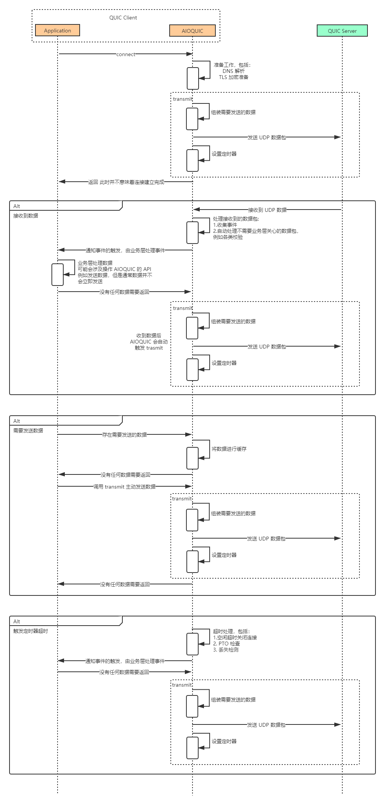

# AIOQUIC Transport

<!-- TOC -->

- [AIOQUIC Transport](#aioquic-transport)
    - [概览](#概览)
        - [QUIC 版本](#quic-版本)
        - [基本使用](#基本使用)
    - [Connection](#connection)
    - [Stream](#stream)
    - [Packet 与 Frame](#packet-与-frame)
        - [Long Header Packet](#long-header-packet)
        - [Short Header Packet](#short-header-packet)
        - [Packet Number](#packet-number)
        - [Frame](#frame)
        - [Datagram Size](#datagram-size)
    - [AIOQUIC 工作机制](#aioquic-工作机制)
    - [建立连接](#建立连接)
        - [版本协商](#版本协商)
        - [地址验证](#地址验证)
        - [传输参数](#传输参数)
        - [1-RTT 连接握手](#1-rtt-连接握手)
        - [0-RTT 连接握手](#0-rtt-连接握手)
    - [数据传输](#数据传输)
        - [创建 Stream](#创建-stream)
        - [关闭 Stream](#关闭-stream)
        - [数据发送与接收](#数据发送与接收)
        - [ACK](#ack)
        - [路径校验](#路径校验)
        - [地址迁移](#地址迁移)
        - [更换连接 ID](#更换连接-id)
        - [探测](#探测)
    - [连接关闭](#连接关闭)
        - [立即关闭](#立即关闭)
        - [空闲超时](#空闲超时)
        - [无状态重置](#无状态重置)
    - [流量控制](#流量控制)
        - [限流处理](#限流处理)
        - [提升流控上限](#提升流控上限)
    - [丢失探测](#丢失探测)
        - [估算往返时间](#估算往返时间)
        - [丢失检测](#丢失检测)
            - [Packet 丢失](#packet-丢失)
            - [探测超时](#探测超时)
    - [拥塞控制](#拥塞控制)
        - [初始状态](#初始状态)
        - [慢启动](#慢启动)
        - [拥塞避免](#拥塞避免)
        - [对于丢失的处理](#对于丢失的处理)
        - [持续拥塞](#持续拥塞)
        - [Pacing](#pacing)
    - [错误处理](#错误处理)
        - [连接错误](#连接错误)
        - [Stream 错误](#stream-错误)
        - [错误码](#错误码)
    - [存在的一些问题](#存在的一些问题)
    - [附录、Packet Types](#附录packet-types)
    - [附录、Frame Types](#附录frame-types)
    - [附录、IP 分片](#附录ip-分片)
    - [附录、参考文献](#附录参考文献)

<!-- /TOC -->

## 概览

QUIC 是一种基于 UDP 的多路复用安全传输协议，本文描述了 QUIC 协议的细节及其一种实现：AIOQUIC。

AIOQUIC 是一个使用 Python 语言实现 QUIC 协议的第三方库：

> aioquic is a library for the QUIC network protocol in Python. It features a minimal TLS 1.3 implementation, a QUIC stack and an HTTP/3 stack.

### QUIC 版本

QUIC 版本是指的 QUIC Draft 的版本号，截止目前（2021/01/23），QUIC Draft 版本已经到了 34（版本号从 00 开始）。其中的 33 和 34 版本 不允许进行部署使用：

> DO NOT DEPLOY THIS VERSION OF QUIC UNTIL IT IS IN AN RFC. This version is still a work in progress. For trial deployments, please use earlier versions.

AIOQUIC 的最新版本已经可以支持 QUIC Draft 32。

由于本人安装的 AIOQUIC 版本最高支持 QUIC Draft 29，因此本文主要是讨论 QUIC Draft 29 和 AIOQUIC 的实现。

如若没有特别指出，后文中的 `QUIC Draft` 代表的是 `QUIC Draft 29`。

### 基本使用

AIOQUIC 的需要 Python 3.6+ 以上版本解释器的支持。

安装是非常简单：

```sh
pip install aioquic
```

使用 AIOQUIC 发起请求也是非常容易的：

```py
async def client_run(addr, port, **kwargs):
    # QUIC 配置，包括：
    # - 指定 Server 证书的 CA 文件
    # - 指定 secrets_log_file 便于抓包并用于 wireshark 解密分析
    configuration = QuicConfiguration(is_client=True)
    configuration.load_verify_locations(cadata=None, cafile=SERVER_CACERTFILE)
    configuration.secrets_log_file = open("keys.log.txt", "a")
    # 除此外，还能指定使用的 QUIC 版本、使用的 session_ticket
    # 更多配置信息可以参考 https://aioquic.readthedocs.io/en/latest/quic.html#module-aioquic.quic.configuration

    # 发起连接，传递目标 ip 和 port 以及配置文件
    # 对于 retry 和 session_ticket 的处理函数也是通过 connect 参数进行控制
    # 更多连接信息可以参考 https://aioquic.readthedocs.io/en/latest/quic.html#module-aioquic.quic.connection
    async with connect(addr, port, configuration=configuration, **kwargs) as cn:
        await cn.wait_connected()

        reader, writer = await cn.create_stream()
        writer.write(message.encode("utf-8"))
        writer.write_eof()
        response = await reader.read()

    # 等待 AIOQUIC 连接关闭完成
    await cn.wait_closed()


def main():
    loop = asyncio.get_event_loop()
    loop.run_until_complete(client_run("127.0.0.1", 443))


if __name__ == "__main__":
    main()
```

AIOQUIC 也支持通过重写 QuicConnectionProtocol 来支持更多底层操作，例如捕获事件，控制传输等。

## Connection

QUIC 的连接过程本质是通信的双发协商出一致的连接 ID：

元素 | 含义
-|-
scid | 源连接 ID
dcid | 目标连接 ID

**注意：**

- 和 TCP 通过四元组标识连接不同，QUIC 的连接是通过连接 ID 标识的。
- QUIC 虽然很快就能协商出一致的连接 ID，但是出于安全和通信考虑，还需要等待 TLS 加密参数和通信参数协商完成。

初始时，发起连接的 Endpoint 并不知晓 Peer 的 dcid，而是随机生成一个 dcid 请求到 Peer，Peer 随机会生成自己的 cid，并通过 Initial 告诉 Peer：

```s
        Endpoint                                                Peer

scid=0 dcid=x Packet(Initial)  -------->
                                            <-------- scid=10 dcid=0 Packet(Initial)
scid=0 dcid=10 Packet(Any)     -------->
```

在握手完成后，Endpoint 和 Peer 会各自通过 NCI（New Connection ID） 数据包通知自己支持的连接 ID：

```s
    Endpoint                                                    Peer

dcid=10 Packet(NCI<new_cid=1>)   -------->
dcid=10 Packet(NCI<new_cid=2>)   -------->
dcid=10 Packet(NCI<new_cid=3>)   -------->
                                            <--------   dcid=0 Packet(NCI<new_cid=11>)
                                            <--------   dcid=0 Packet(NCI<new_cid=21>)
                                            <--------   dcid=0 Packet(NCI<new_cid=31>)
```

此时从 Endpoint 的角度来看：

- 有效的 scid 有：0、1、2、3
- 有效的 dcid 有：10、11、21、31

此时从 Peer 的角度来看：

- 有效的 scid 有：10、11、21、31
- 有效的 dcid 有：0、1、2、3

所以一个连接并非只有一个 scid 和 dcid：

```s
    Endpoint                                       Peer

+---------------+                            +---------------+
| Available CID |                            | Available CID |
+---------------+------- Connection -------- +---------------+
|    0 1 2 3    |                            |  10 11 21 31  |
+---------------+                            +---------------+
```

因此，如果有 N 个 scid 和 M 个 dcid，有 N*M 个的二元组 (scid, dcid) 指向了同一个连接。

这样设计的初衷是为了保障在连接迁移时的隐私性，QUIC Draft 建议在进行连接迁移时，使用另一个可用的 dcid 进行请求。

QUIC Draft 原文对连接迁移时使用新的连接 ID 的建议：

> An endpoint that moves between networks might not wish to have their activity correlated by any entity other than their peer, so different connection IDs are used when sending from different local addresses.

每一个连接 ID 都和一个连接序列号绑定在一起，并且是 1:1 的关系：

- 新增一个连接 ID 就会新增一个连接序号。
- 连接序列号是从 0 开始，每次增加 1。

给连接 ID 绑定一个递增加 1 的连接序列号，目的是为了方便进行批量的连接 ID 剔除。

## Stream

QUIC 的应用层数据的传输是基于 Stream 来完成的，在 QUIC 连接建立起来后，可以为连接在逻辑上分配多个 Stream，每个 Stream 之间是尽可能独立的。

不同的 Stream 通过底层数据包中的 Stream ID 来进行标识和划分：

```txt
Endpoint                                      Peer
  │                                             │
  │ ┌───────────── Connection 0 ──────────────┐ │
  │ │                                         │ │
  │ ├──────────── Stream c=0 s=0 ─────────────┤ │
  │ │                                         │ │
  │ ├──────────── Stream c=0 s=1 ─────────────┤ │
  │ │                                         │ │
  │ └──────────── Stream c=0 s=2 ─────────────┘ │
  │                                             │
  │                                             │
  │ ┌───────────── Connection 1 ──────────────┐ │
  │ │                                         │ │
  │ ├──────────── Stream c=1 s=0 ─────────────┤ │
  │ │                                         │ │
  │ └──────────── Stream c=2 s=1 ─────────────┘ │
  │                                             │
```

正如 QUIC Draft 中提到的:

> Streams are identified within a connection by a numeric value, referred to as the stream ID. A stream ID is a 62-bit integer (0 to 2^62-1) that is unique for all streams on a connection.

- 不同的 Connection 中，Stream ID 是隔离的。
- 同一个 Connection 中，Stream ID 是唯一的。
- Stream ID 的取值范围是：0 to 2^62-1。

TCP 在传输数据时，也可以引入 Stream ID，做到 TCP Stream（例如 HTTP 2.0 中的 Stream），但是这和 QUIC Stream 有本质上的区别。

在 TCP 中使用 Stream 传输数据：

```s
    Endpoint                            Peer

Stream Data s=0   -------->     Recv and process stream 0
Stream Data s=1   ----x--->     LOSS
Stream Data s=2   -------->     Recv but block stream 2
Stream Data s=3   -------->     Recv but block stream 3
```

由于 TCP 会保障 Peer 应用层拿到的数据是顺序的，因此即便是 s=2 和 s=3 的数据抵到了 Peer，但是由于 s=1 的丢失，这会导致 1、2、3 的 Stream 均被阻塞。

在 QUIC 中使用 Stream 传输数据：

```s
    Endpoint                            Peer

Stream Data s=0   -------->     Recv and process stream 0
Stream Data s=1   ----x--->     LOSS
Stream Data s=2   -------->     Recv and process stream 2
Stream Data s=3   -------->     Recv and process stream 3
```

QUIC 中使用 UDP 传输数据，而 UDP 的包之间是独立的，任何一个 UDP 包的丢失均不影响其他 UDP 包的接收和处理。因此即便是丢失了 s=1 的包，但是接收到了 s=2 和 s=3 的包，Stream 1 和 2 则可以正常处理，仅 Stream 1 会被阻塞。

## Packet 与 Frame

在 QUIC 网络通信的物理层面，具有 Packet 和 Frame 两个概念：

- Packet，QUIC Endpoint 之间通过交换 Packet 进行通信，是数据发送和应答的基本单位。Packet 具有机密性和完整性保护。
- Frame，是 Packet 所传输的负载，Frame 是没有编号的。Frame 又有两种：
  - 拥有 Stream ID 的 Frame，在逻辑上给 Frame 划分了 Stream，传输和控制着对应的 Stream。
  - 缺少 Stream ID 的 Frame，这通常是用于控制连接的，例如握手、ACK 等。

一个 UDP 报文中会包含至少一个 Packet，而一个 Packet 中**通常**会包含一个 Frame（有的 Packet 并不会有 Frame）：

```s
+---------------------------+---------------------------+---------------------------+---------------------------+
|                       DATAGRAME                       |                       DATAGRAME                       |
+---------------------------+---------------------------+---------------------------+---------------------------+
|         Packet 0          |          Packet 1         |         Packet 2          |          Packet 3         |
+---------------------------|---------------------------+---------------------------|---------------------------+
|  Frame s=1  |  Frame s=2  |    Frame    |  Frame s=1  |  Frame s=2  |  Frame s=1  |  Frame s=3  |    Frame    |
+---------------------------+---------------------------+---------------------------+---------------------------+
```

**注意：**

- 上述 Packet 0，标识 Packet 的 PN（Packet Number） 为 0。
- 上述 Frame s=1 标识 Frame 属于 Stream ID = 1。
- 上述纯 Frame 字样标识 Frame 不属于某个 Stream。

Frame 区分了不同的数据类型，例如传输数据的 STREAM Frame，流控的 MAX_DATA Frame。

一直有一个疑惑，为什么 QUIC 不能直接传输 Frame，而是需要用 Packet 来传递 Frame，用 Packet 聚合 Frame 的原因是什么？

这在 QUIC Draft 中并没有给出标准答案，我个人的理解是为了区分不同的数据加密类型，不同类型的 Packet 使用的加密方式是不同的，甚至有的 Packet 是不需要加密的。

Stream 是在 Frame 的 Stream ID 上划分出的逻辑概念，Packet 是 Frame 的传输媒介，Packet 又是基于 UDP 来进行传输，因此按分层形式划分，他们之间的层级关系如下：

```s
+------------+
|  STREAM    |
+------------+
|  FRAME     |
+------------+
|  PACKET    |
+------------+
|  DATAGRAM  |
+------------+
```

Packet 将大体上分为 Header 和 Payload 两个部分：

- Header 包含协议、连接相关的信息，例如连接 ID、使用的 QUIC 协议版本。
- Payload 负载数据，视 Packet 类型的不同，Payload 是不同的，例如 Retry Packet 的 Payload 是 Retry Token，对于 Initial Packet，Payload 是 Frame 数据。

其 Packet 结构可以如下简化：

```s
   Packet
+-----------+
|  Header   |
+-----------+
|  Payload  |
+-----------+
```

**注意：**

- QUIC 中并没有明确的 Header 和 Payload 的定义，上述划分只是为了方便理解进行的一个粗糙的划分。

QUIC 根据连接建立前后不同的传输场景，会使用不同长度的 Header，进一步将 Packet 分为 Long Header Packet 和 Short Header Packet：

- Long Header Packet 通常用于发起连接、连接建立中、通信双发的协商，因此会在 Header 中包含较多的连接相关信息，所以导致是 “长” Header。
- Short Header Packet 通常用于连接建立完成后，双发稳定通信的场景，Short Header 的头部信息非常少，只有必要包类型标识以及 DCID。

这两者 Packet 可以简单的看成如下的关系：

```s
    Endpoint                                     Peer

Long Header Packet --------->
                                <---------- Long Header Packet

before
---------------------- Connection & Handshake Done ---------------------------
after

Short Header Packet --------->
                                <---------- Short Header Packet
```

### Long Header Packet

对于 Long Header Packet，其通用的 Header 如下所示：

```txt
Long Header Packet {
  Header Form (1) = 1,
  Fixed Bit (1) = 1,
  Long Packet Type (2),
  Type-Specific Bits (4),
  Version (32),
  Destination Connection ID Length (8),
  Destination Connection ID (0..160),
  Source Connection ID Length (8),
  Source Connection ID (0..160),
  ...
}
```

**注意：**

- 这是 Long Header Packet 的通用 Header，并非是 Packet Header 的全部，因为不同的 Packet 会有些不同。
- Long Header Packet 的**通用** Header 长度大小范围为：7 - 47 个字节。

通过 Packet 的第一个 bit 是否为 1，可以判断是否属于 Long Header Packet。

通过 Version 来告知 Peer 自己使用的版本。

通过 Type 和 Version 可以判断当前 Packet 类型：

Type | Version | 名称 | 描述
-|-|-|-
0x0 | - | Initial | 用于建立连接，两端协商连接 ID，并发起 QUIC-TLS 握手。
0x1 | - | 0-RTT | 用于握手完成前，Client 将 early data 传递给 Server。
0x2 | - | Handshake | Initial Packet 后会通过 Handshake 继续进行 QUIC-TLS 握手。
0x3 | - | Retry | 服务器端要求地址验证，请参考[地址验证](#地址验证)。
\- | 0x0 | Version Negotiation | 这是一种特殊的 Packet，不由 Type 决定，而是由 Version 决定，用于通信双发协商使用的 QUIC 版本，请参考[版本协商](#版本协商)。

可以看出，上述 Packet Header 中缺少了两个关键信息：

- Packet 负载的长度。
- Packet 的编号，即 Packet Number。

这是因为有的 Long Header Packet 不需要这两个信息，以下 Long Header Packet 不需要这两个信息：

- Retry
- Version Negotiation

因为 QUIC 是基于 Packet Number 进行 ACK 的，所以没有 Packet Number 的 Packet 是不需要进行 ACK。

如果需要参考 Packet 的具体结构，可以参考 [附录、Packet Types](#附录packet-types)。

### Short Header Packet

Short Header Packet 没有其他类型，因此这里直接给出 Short Header Packet 的定义：

```txt
Short Header Packet {
  Header Form (1) = 0,
  Fixed Bit (1) = 1,
  Spin Bit (1),
  Reserved Bits (2),
  Key Phase (1),
  Packet Number Length (2),
  Destination Connection ID (0..160),
  Packet Number (8..32),
  Packet Payload (..),
}
```

其中 Header 部分占了 9 - 32 字节，视 Packet Number 和 DCID 长度而变化。

### Packet Number

Packet 都有一个 Packet Number（除了版本协商和 Retry），简称 pn，用于标识发送的 Packet。如果数据重发会额外使用新的 Packet Number。

Packet Number 根据不同种类的 Packet，会划分空间，目前 QUIC 划分了这 3 中 Packet Number 空间：

- Initial space: All Initial packets are in this space.
- Handshake space: All Handshake packets are in this space.
- Application data space: All 0-RTT and 1-RTT encrypted packets are in this space.

每个 Packet 空间的 Packet Number 都是递增的（没有要求必须加 1 方式递增）。

AIOQUIC 实现时划分了 Packet 空间，但是所有的 Packet 空间，其 Packet Number 是共有的同一个加一递增变量。

### Frame

Frame 中包含了实际的数据，包括建立连接的，握手的，传输数据的，关闭连接的，流控的等等。

因为 Frame 类型众多，这里仅简单列举 QUIC 拥有的 Frame 以及作用：

Type Value | Frame Type Name | Packets | Description
-|-|-|-
0x00 | PADDING | IH01 | PADDING 用于扩充数据包大小。通常给 Initial Packet 扩充空间。请参考 [建立连接](#建立连接)。
0x01 | PING | IH01 | 验证其 Peer 仍然存在或检查对等方的可达性。请参考 [探测](#探测)。
0x02 - 0x03 | ACK | IH_1 | 将其已接收和处理的数据包通知发送方。请参考 [ACK](#ack)
0x04 | RESET_STREAM | __01 | 终止流的发送部分。请参考 [流的关闭](#流的关闭)。
0x05 | STOP_SENDING | __01 | 请求对等方停止流上的传输。请参考 [流的关闭](#流的关闭)。
0x06 | CRYPTO | IH_1 | 用于传输加密握手消息。请参考 [建立连接](#建立连接)。
0x07 | NEW_TOKEN | ___1 | 用于提供地址验证的 Token，以便将来连接使用。请参考 [建立连接](#建立连接)。
0x08 - 0x0f | STREAM | __01 | 用于发送应用层数据。请参考 [数据的发送与接收](#数据的发送与接收)。
0x10 | MAX_DATA | __01 | 控制连接上可以发送的最大数据量。请参考 [流控](#流控)。
0x11 | MAX_STREAM_DATA | __01 | 控制流上可以发送的最大数据量。请参考 [流控](#流控)。
0x12 - 0x13 | MAX_STREAMS | __01 | 控制连接上可以建立的流的上限。请参考 [流控](#流控)。
0x14 | DATA_BLOCKED | __01 | 因为连接的流控导致不能发送数据，会发送 DATA_BLOCKED 通知对端。请参考 [流控](#流控)。
0x15 | STREAM_DATA_BLOCKED | __01 | 因为 Stream 的流控导致不能发送数据，会发送 STREAM_DATA_BLOCKED 通知对端。请参考 [流控](#流控)。
0x16 - 0x17 | STREAMS_BLOCKED | __01 | 因为创建流达到上限，会发送 STREAMS_BLOCKED 通知对端。请参考 [流控](#流控)。
0x18 | NEW_CONNECTION_ID | __01 | 用于告诉对端新的可用的连接 ID，Peer 将会设置该连接 ID 为有效的 DCID。请参考 [发放连接 ID](#发放连接-id)。
0x19 | RETIRE_CONNECTION_ID | __01 | 用于告诉对端希望连接 ID 不再可用，Peer 将会设置这些连接 ID 为。请参考 [发放连接 ID](#发放连接-id)。
0x1a | PATH_CHALLENGE | __01 | 发起地址校验，通常用于地址迁移时，发送方地址发生了迁移，接收方会校验路径的可达性。请参考 [地址迁移](#地址迁移)。
0x1b | PATH_RESPONSE | __01 | 响应地址校验。请参考 [地址迁移](#地址迁移)。
0x1c - 0x1d | CONNECTION_CLOSE | ih01 | 连接关闭。请参考 [连接关闭](#连接关闭)。
0x1e | HANDSHAKE_DONE | ___1 | 握手确认信号。该 Frame 不会包含任何内容。请参考[建立连接](#建立连接)

上述 Packets 中各个符号的含义可以参考：

- I: Initial
- H: Handshake
- 0: 0-RTT
- 1: 1-RTT
- ih: A CONNECTION_CLOSE frame of type 0x1d cannot appear in Initial or Handshake packets.

### Datagram Size

QUIC 在物理层传输时采用的是 UDP 协议，QUIC Draft 中对 UDP 报文大小的建议是一定不能触发 IP 分片：

> UDP datagrams MUST NOT be fragmented at the IP layer. In IPv4 ([IPv4]), the DF bit MUST be set if possible, to prevent fragmentation on the path.

IP 分片相关内容参考 [附录、IP 分片](#附录ip-分片)，更详细的内容也可以查阅 [TCP/IP 详解 卷一：协议](https://book.douban.com/subject/1088054/)。

QUIC Draft 中除了对 UDP 报文大小要求不能分片外，也对报文大小的最大值做了要求，最大值不能少于 1200 Bytes，但是**未解释原因**：

> The maximum datagram size MUST be at least 1200 bytes.

**注意：**

- 这只是对最大大小的要求，与“不能分片”的要求并不矛盾。

在 AIOQUIC 的实现中，最大报文大小（UDP 负载的大小）限制在了 1200 字节：

```py
# AIOQUIC 中，Packet Max Size 就是指的 UDP 最大报文大小（即 UDP 负载的大小）

PACKET_MAX_SIZE = 1280
```

对于 AIOQUIC，如果算上 IP 头部和 UDP 头部，则数据限制在了 1280 + 8 + 20 => 1308 Bytes。

## AIOQUIC 工作机制

AIOQUIC 的工作机制核心是如何处理连接、接收数据、发送数据以及超时，下图提供了一个整体的工作流程概览：



AIOQUIC 的 Application 使用了协程进行驱动，因此在使用 AIOQUIC 编写简单的应用时并不需要向上图中如此复杂，也不需要通过回调进行事件的处理。

## 建立连接

在 [Connection](#connection) 中提及了 QUIC 中连接的本质，但是对于业务层而言，连接建立完成其实是一个非常复杂的过程。

因为业务层要安全的使用一个连接，该连接绝不能仅仅只是一个标识符，一定要等待连接的版本、传输参数、加密参数等协商完毕。

### 版本协商

版本协商是指的 QUIC 的使用版本，更具体而言，因为 QUIC 目前处于 Draft 阶段，不同 Draft 的细节是不一样的，通过版本协商的方式让 Endpoint 两端使用相同版本的 QUIC Draft（Draft 的编号就是 QUIC 的版本号）。

在建立连接时使用 Long Header Packet，在该结构中一定会有 Version 版本号，QUIC 通过该版本号指出所用的版本，如果对端不接受该版本，会返回 VNP（[Version Negotiation Packet](version-negotiation-packet)），以告诉对端自己所支持的版本：

```s
    Endpoint                                            Peer

Packet(Initial<version=a>)  --------->
                                        <------- Packet(VNP<supported_versions=29,28,27>)
Packet(Initial<version=29>) --------->
```

在建立连接时 Endpoint 会选择自己所支持的最高 QUIC 版本发送 Initial Packet，Peer 如果不支持就会通过 VNP 返回一个 supported_versions 列表，告诉 Endpoint 支持的版本，Endpoint 收到后，如果从第一个开始判断是否支持，如果支持则用该版本重新发起 Initial Packet。

最新 AIOQUIC 支持的版本范围是 [27, 32]：

```py
supported_versions: List[int] = field(
    default_factory=lambda: [
        QuicProtocolVersion.DRAFT_32,
        QuicProtocolVersion.DRAFT_31,
        QuicProtocolVersion.DRAFT_30,
        QuicProtocolVersion.DRAFT_29,
        QuicProtocolVersion.DRAFT_28,
        QuicProtocolVersion.DRAFT_27,
    ]
)
```

**注意：**

- 在 QUIC-TLS 中还会 ALPN（Application-Layer Protocol Negotiation），该字段协商的是 QUIC 运行在什么应用层协议之上，例如 HTTP 3.0。如果 QUIC 没有使用应用层协议，是不会传 ALPN 字段的。

### 地址验证

地址验证是为了防止放大攻击。QUIC Draft 的描述如下：
> Address validation ensures that an endpoint cannot be used for a traffic amplification attack. In such an attack, a packet is sent to a server with spoofed source address information that identifies a victim. If a server generates more or larger packets in response to that packet, the attacker can use the server to send more data toward the victim than it would be able to send on its own.

放大攻击类似下图所示，Attacker 用非常小的数据导致 Server 给 User 的机器疯狂发数据，这可能冲垮 User 的机器。

```s
               (192.168.0.3)            (192.168.04)             (192.168.0.5)
                  Attacker                 Server                     User
                     |                       |                          |
                     |                  (port:4433)                     |
                     |                       |                          |
                     |                       |                          |
                     |                       |                          |
(192.168.0.5:12345)  +------- little ------->+----------- large ------->+ (port:12345)
```

QUIC 中为了避免这样的问题，会针对没有做过地址验证的 IP PORT 限制发送数据大小（可以发送的数据量是从该地址收到数据大小的三倍）。

地址验证完成通常可以在两个地方：

- 正常握手的流程完成即可以认为地址验证是成功。握手流程请参考 [连接握手](#连接握手)。
- 通过 Retry 数据包。

Retry 地址验证的功能在大部分 QUIC Server 实现时是可选的，在 AIOQUIC 的 Retry 地址验证打开方式：

```py
async def run_server():
    server = await serve(host=host,
                         port=server_port,
                         configuration=configuration,
                         retry=True,
                         create_protocol=partial(EchoServerConnectionProtocol, app),
                         **kwargs)
    ...
```

对于一个 Retry 地址验证的流程如下所示：

```s
        Endpoint                              Peer

Initial(token=None) --------->
                                <---------- Retry(retry-token=abcd)
Initial(token=abcd) --------->
```

很明显，如果 Attacker 伪造 IP 地址后，用 12345 端口发起放大攻击：

- Peer 会返回 Retry Packet 给 User 的 12345 端口。
- User 的 12345 端口并不会处理数据包，因此该数据包会直接被丢弃。
- 地址验证失败，Attacker 无法过度放大流量。

上述流程中有一个前提，即 Peer 发放的 retry-token 是一个随机数，否则 Attacker 能够猜到 retry-token，则地址验证成功，仍然无法避免遭受放大攻击。

在 AIOQUIC 中，retry-token 的生成和校验机制伪代码：

```py
def create_token(key, addr, dcid, scid):
    message = addr + dcid + scid
    key.public_key.encrypt(sha256(message))


def validate_token(key, addr, dcid, scid, token):
    encoded_addr = key.private_key.decode(token)
    message = addr + dcid + scid
    if encoded_addr != sha256(message):
            return False
    return True
```

### 传输参数

传输参数是 QUIC 传输连接的控制信息，以及一些初始化信息。在建立连接期间，两个端点都需要对自己的传输参数进行声明。

两个端点均是在 Initial Packet 中传输自己的传输参数的：

- Client 是在 Initial Packet 的 CRYPTO 帧中传输，并位于 CRYPTO 帧中的 Client Hello Extensions 中。
- Server 是在 Initial Packet 的 CRYPTO 帧中传输，并位于 CRYPTO 帧中的 Server Hello Extensions 中。

```s
        Endpoint                                            Peer

Initial(CRYPTO<transport_parameters>,
        PADDING)  ---------------->
                                        <---------------- Initial(CRYPTO<transport_parameters>)
```

[name-transport-parameter](https://tools.ietf.org/id/draft-ietf-quic-transport-29.html#name-transport-parameter-definit) 给出了所有的 QUIC 传输参数定义。

### 1-RTT 连接握手

QUIC 连接握手是同时进行的，由 QUIC 的 CRYPTO Frame 来封装 TLS 的交换信息。

需要注意，Client 发起连接的时候一定要填充 Initial Packet 至少 1200 字节，这是因为往往服务器包含证书信息，要返回给 Client 的数据量较大，而此时又因为没有完成地址验证（除非开启了 Retry 地址验证），所以 Server 无法返回足够的握手数据给 Client，这将会导致无法握手成功。

QUIC Draft 相关阐述：

> Clients MUST ensure that UDP datagrams containing Initial packets have UDP payloads of at least 1200 bytes, adding padding to packets in the datagram as necessary. A client that sends padded datagrams allows the server to send more data prior to completing address validation.

```s
        Endpoint                                                    Peer

Initial(CRYPTO<ClientHello>,
        PADDING)  ------------------->
                                                              Initial(ACK, CRYPTO<ServerHello>)
                                        <-------------------  Handshake(CRYPTO<EncryptedExtensions, Certificate-1>)

                                        <-------------------  Handshake(CRYPTO<Certificate-2, CertificateVerify, Finished>)
Initial(ACK)
Handshake(ACK) ------------------->

Handshake(ACK,
          CRYPTO<Finished>)
Packet(NCI*7)  ------------------->
                                        <-------------------  Packet(SHDONE, NCI*7)
```

AIOQUIC 的 Client 是在接收到 Server 的 Finished 时，就返回应用层连接建立成功了，此时 Client 还需要做一些收尾处理，返回 ACK，以及 Client 的 Finished。

Server 在接收到 Client 的 Finished 时，就返回应用层连接建立成功了，此时 Server 还会有一些收尾处理，发送 HandShakeDone。

**注意：**

- 之所以 Initial 会用 PADDING 进行填充，是因为 Server 的数据发送量收到了地址校验的限制，使用 PADDING 填充可以让 Server 发送尽可能多的数据。
- 不同 Packet 空间的 Packet Number 是独立的，因此 Client 对 Initial 和 HandShake 会单独各有一个 ACK。
- AIOQUIC 保障 SCID 和 DCID 都有 8 个，因此双方会互发 New Connection ID 帧 7 个（Initial Packet 已经各生产了 1 个）。

连接握手 TLS 以及 0-RTT 握手更详细的信息可以参考 [AIOQUIC-TLS](aioquic-tls.md)。

### 0-RTT 连接握手

QUIC 如果在 1-RTT 建立连接时，使用了 psk 则 Server 会下发 NewSessionTicket，旨在下次 AIOQUIC 发起连接建立时可以支持 0-RTT。

1-RTT 是 Client 获取 NewSessionTicket 的流程：

```s
        Endpoint                                                Peer

Initial(CRYPTO<ClientHello>,
        PADDING) ------------------->
                                                           Initial(ACK, CRYPTO<ServerHello>)
                                        <----------------- Handshake(CRYPTO<EncryptedExtensions, Certificate-1>)
                        
                                                            Handshake(CRYPTO<Certificate-2, CertificateVerify, Finished>)
                                        <------------------ Packet(CRYPTO<NewSessionTicket>)

Initial(ACK)
Handshake(ACK) -------------------->

Handshake(ACK,
          CRYPTO<Finished>)
Packet(NCI*7) --------------------->
                                        <------------------ Packet(SHDONE, NCI*7)
                        
```

**注意：**

- Server 判断是否返回 NewSessionTicket 的条件是 ClientHello 的 Extensions 中是否存在 psk_exchange_modes。

在 AIOQUIC 实现中，需要配置 NewSessionTicket 的存储方法 `session_ticket_handler`，Client 才会发送 psk_exchange_modes。

在 AIOQUIC 实现中，需要配置 NewSessionTicket 的存储和获取方法，Server 才会在连接建立完成后返回 Client 一个 NewSessionTicket（并且要求 ClientHello 中存在 psk_exchange_modes）。

```py
# Endpoint
def endpoint_connect(host, port, configuration):
    with open("session_ticket.key", "rb") as fp:
        configuration.session_ticket = pickle.load(fp)

    loop = asyncio.get_event_loop()
    async with connect(host,
                       port,
                       configuration=configuration,
                       session_ticket_handler=save_session_ticket) as cn:
        pass

# Peer
def peer_connect(host, port, configuration):
    class SessionTicketStore:
        def __init__(self):
            self.tickets = {}

        def add(self, ticket):
            self.tickets[ticket.ticket] = ticket

        def pop(self, label):
            return self.tickets.pop(label, None)

    ticket_store = SessionTicketStore()

    server = await serve(host=host,
                         port=server_port,
                         configuration=configuration,
                         session_ticket_fetcher=ticket_store.pop,
                         session_ticket_handler=ticket_store.add,)
    pass
```

0-RTT 传递 NewSessionTicket 建立连接的流程：

```s
        Endpoint                                                Peer

Initial(CRYPTO<ClientHello>,
        PADDING) ------------------->
                                                            Initial(ACK, CRYPTO<ServerHello>)
                                                            Handshake(CRYPTO<EncryptedExtensions, Finished>)
                                        <------------------ Handshake(CRYPTO<NewSessionTicket>)
Packet(ACK, NCI*7) ---------------->
                                        <------------------- Packet(SHDONE, NCI*7)
```

**注意：**

- Endpoint 可以通过 ClientHello 中的 pre_shared_key 扩展来传递之前获得 NewSessionTicket 的信息。
- Peer 会在返回时传递一个新的 NewSessionTicket，以便 Endpoint 下次使用。
- AIOQUIC 虽然支持 0-RTT，但是并不支持传递 early data，如果需要支持真正的 0-RTT 传输数据则需要进行二次开发。
- 由于 AIOQUIC 并不支持 0-RTT 传递数据，因此 AIOQUIC 的 0-RTT 相比于 1-RTT 唯一的优势是省略了对于证书的传输和校验。

## 数据传输

在连接建立完成后，就可以由应用层进行数据传输了。

### 创建 Stream

应用层数据的传输是基于 Stream 的，因此在需要应用首先创建流。

Stream 的创建是自动的，并不需要特殊标识：

- 对于发送方，自己生成一个没有使用过的 Stream ID 就认为流创建了。
- 对于接收方，当收到一个未曾有过的 Stream ID 的数据，就认为流创建了。

### 关闭 Stream

有三种方式终止流：

- 发送 STREAM 帧时，在 STREAM 帧中添加 FIN 标识。
- 发送 RESET STREAM 帧，由发送方终止 Stream 上数据的发送。
- 发送 STOP STREAM 帧，由接收方终止 Stream 上数据的接收。

AIOQUIC 的处理：

- AIOQUIC 在处理 STREAM FIN 时，会自动记录 STREAM 的结尾符，此后该 Stream 不允许再写入数据。
- AIOQUIC 在处理 RESET STREAM 帧时：
  - 记录 Stream 上的最终数据大小。
  - 向业务层传递 RESET 的事件，交给业务层处理。
  - 后续无法在该 Stream 上发送数据或者接收超出最终大小的数据。
- AIOQUIC 在处理 STOP STREAM 帧时，除了记录日志，并不会做其他动作。

### 数据发送与接收

QUIC 中的数据发送与接收非常简单，只需要在 Packet 中添加 STREAM 帧，并通过 STREAM 承载数据即可，当然 STREAM 帧需要指定对应的 Stream ID，以便 QUIC 将相应的 Stream 上的数据交给应用层处理。

```s
    Endpoint                                                        Peer

Packet(STREAM<0>) ------------------>
Packet(STREAM<4>) ------------------>
                                        <------------------- Packet(STREAM<0>, STREAM<4>)
```

**注意：**

- 不同 Stream 的帧可以放在一个 Packet 中通过一个 UDP 报文传输，也可以放在不同的 Packet 中通过不同的 UDP 报文传输。
- UDP 虽然是 DATAGRAM 形式的数据，但是 QUIC Stream 提供给应用层的是流式数据。

### ACK

基本所有的可靠传输，ACK 都非常重要，是可靠传输的基本。

QUIC 的 ACK 方案结合了 SACK 和延时 ACK 的优点。QUIC ACK 具有以下特点：

- ACK 帧是通过 Packet Number 告知对方确认信息，因此 ACK 的基本单位是 Packet。
- 在 QUIC 中，每一个 Packet 都需要被 ACK，但是某些 Packet 的 ACK 可以无限期延后，有些 Packet 则不需要 ACK。
  - Retry Packet 和 Version Negotiation Packet 因为没有 Packet Number，所以是不需要 ACK 的。
  - 对于仅包含以下 Frame 的 Packet 约定好是不需要 ACK 的，这些 Packet 也不需要超时重发。
    - ACK。否则会导致 ACK-of-ACK
    - PADDING。
    - CONNECTION_CLOSE。
- ACK 帧通过 Range 的方式告诉对端确认的范围。
- ACK 可以进行延时，收集一部分数据后统一进行 ACK，减少网络带宽耗费。
- 由于 ACK 是通过 Packet Number 进行确认的，而 Packet Number 是有 Packet 空间的，因此不同 Packet 空间的 ACK 需要用相应的 Packet 空间的 Packet 发送 ACK。

对于 ACK Delay，

```s
               Endpoint                                     Peer
        
                                                        Packet pn=1
    ^                                           <------ Packet pn=2
    |
    |                                           <------ Packet pn=3
    |                                                   
 ack delay
    |                                           <------ Packet pn=4
    |
    |
    |
    |
    v  Packet(ACK<largest_pn=4
                  first_range=3
                  ack_delay=10>) ------>                    
```

如果 Packet 存在丢失，则可以通过 ACK Range 指出可能丢失的部分以及已经明确 ACK 的部分。

```s
        Endpoint                                 Peer

                                                Packet pn=1
                                        <--x--- Packet pn=2
                        
                                        <--x--- Packet pn=3
                                        
                                        <--x--- Packet pn=4
                                        
                                                Packet pn=5
                                        <------ Packet pn=6
        
Packet(ACK<largest_pn=6
           first_range=1
           range_count=1
           [gap=1, range=1]>) ------>                    
```

### 路径校验

路径校验主要的目的是有两个方面：

- Endpoint 发生地址迁移时，由 Peer 通过路径校验来确定连通性。
- 用来判断是否存在 Attacker 进行源 IP 欺骗攻击。

```s
    Endpoint                                                Peer

                                        <--------- Packet(PathChallenge challenge=abcd, STREAM)
Packet(PathResponse<challenge=abcd>,
        STREAM)            --------->
```

路径校验的帧时可以和其他帧一起发送的。

AIOQUIC 中路径迁移使用的 challenge 值是一个 8 字节的随机二进制数组：

```py
challenge = os.urandom(8)
```

### 地址迁移

通信中的任何一方的 IP 或 PORT 发生了变化，但是连接 ID 没有变化，则认为在该连接上发生了地址迁移。

地址迁移的流程如下：

```s
    Endpoint                                                Peer

src=x dcid=a Packet(STREAM) ------------>
src=x dcid=a Packet(STREAM) ------------>
                                            <--------- dst=x dcid=b Packet(STREAM)

[ADDRESS MIGRATE]

src=y dcid=a Packet(STREAM) ------------>
src=y dcid=a Packet(STREAM) ------------>
                                            <--------- dst=y dcid=b Packet(PATH_CHALLENGE)
                                            <--------- dst=y dcid=b Packet(STREAM)
src=y dcid=aPacket(PATH_RESPONSE) ----->
                                            <--------- dst=y dcid=b Packet(STREAM)
```

**注意：**

- 在 AIOQUIC 的实现中，如果 Peer 的 PATH_CHALLENGE 验证不通过（即路径不通），仅会限制 Peer 发送的字节数以及重试 PATH_CHALLENGE，Peer 并不会切换回原来的 Endpoint 地址进行数据发送。
- 在 AIOQUIC 的实现中，如果 Endpoint 在地址迁移后，又切换回原来的地址，则不用再次地址验证，Peer 是会缓存之前已经验证过的地址。
- 在 AIOQUIC 的实现中，如果 PATH_CHALLENGE 和 PATH_RESPONSE 丢包后，是不会重发的。严重的后果是地址验证永远无法完成。
- QUIC Draft 中建议路径迁移时，使用新的 CONNECTION ID，但是 AIOQUIC 中实现时并没有强制要求，即便使用旧的 CONNECTION ID 也可以成功完成地址迁移。

### 更换连接 ID

在 [Connection](#connection) 中提到，一个连接是有多个 dcid 和 scid 的，可以使用任意的一对在该连接上进行通信。

在 AIOQUIC 为应用层提供的接口中 `change_connection_id()` 函数可以切换当前使用的目标连接 ID。

在 AIOQUIC 中，scid 和 dcid 的池子各自都至少为 8 个，在通过 `change_connection_id()` 进行切换的时候，会把当前正在使用的 dcid 进行 retire，并更好一个新的 dcid 进行数据的发送：

```py
def change_connection_id(self) -> None:
    if self._peer_cid_available:
        # retire previous dcid
        self._retire_peer_cid(self._peer_cid)

        # 从 dcid 池中找出一个新的 dcid 进行使用
        self._consume_peer_cid()
```

当 Peer 接收到 retire 的请求时，会剔除掉对应的连接 ID，并用 NCI 下发一个新的 Connection ID 给 Endpoint，以保障 Endpoint 的 dcid 的个数维持为固定数目。

AIOQUIC 的连接 ID 更换流程如下：

```s
    Endpoint                                                Peer

dcid=a Packet(STREAM) ------------->
                                        <--------- dcid=b Packet(STREAM)

[CHANGE DCID]

dcid=c Packet(RCI) ---------------->
dcid=c Packet(STREAM) ------------->
                                        <--------- dcid=b Packet(NCI)
                                        <--------- dcid=b Packet(STREAM)
```

### 探测

在 QUIC 中，如果连接长时间没有通信会触发超时关闭，请参考[空闲超时](#空闲超时)。

如果需要始终保持连接，可以通过定期发送 PING 帧来维持连接。

除了长连接的保持外，也用于 PTO，请参考 [探测超时](#探测超时)。

## 连接关闭

一个建立好的 QUIC 连接可以被以下三种方式关闭：

- 空闲超时。
- 立即关闭。
- Stateless Reset（AIOQUIC 没有实现）。

在 AIOQUIC 中，Endpoint 为了能够正确处理连接关闭，有三种状态：

- CLOSING 连接关闭中。
- DRAINING 接收到连接关闭请求。
- TERMINATED 连接已关闭。

```py
END_STATES = frozenset(
    [
        QuicConnectionState.CLOSING,
        QuicConnectionState.DRAINING,
        QuicConnectionState.TERMINATED,
    ]
)
```

### 立即关闭

Endpoint 通过发送 CONNECTION_CLOSE 帧以立即关闭终止连接，这也会导致所有的 Stream 被关闭。

发起连接关闭时，会告知对端连接关闭的原因，便于感知是否存在异常。对于异常关闭的更多信息请参考 [错误处理](#错误处理)。

在 AIOQUIC 中，通过 `close()` 方法发起请求关闭，其目的是为了生成 Terminated 事件，生成后并不会立即告知应用层，而是需要等待超时事件（3 倍 PTO）。

```py
def close(
    self,
    error_code: int = QuicErrorCode.NO_ERROR,
    frame_type: Optional[int] = None,
    reason_phrase: str = "",
) -> None:
    if self._state not in END_STATES:
        self._close_event = events.ConnectionTerminated(
            error_code=error_code,
            frame_type=frame_type,
            reason_phrase=reason_phrase,
        )
        self._close_pending = True
```

- CLOSING, Endpoint 发起立即关闭会进入 CLOSING 状态，在 CLOSING 状态下仅仅是等待 3 倍 PTO 超时后告知业务层。
- DRAINING, Peer 在接收到 Endpoint 的 CONNECTION_CLOSE 帧会立即进入 DRAINING 状态，在 DRAINING 状态下仅仅是等待 3 倍 PTO 超时后告知业务层。

```py
self._close_at = now + 3 * self._loss.get_probe_timeout()
if send connection_close:
    self._set_state(QuicConnectionState.CLOSING)
elif recv connection_close:
    self._set_state(QuicConnectionState.DRAINING)
```

AIOQUIC 请求立即关闭流程：

```s
            Endpoint                                   Peer

     Packet(CONNECTION_CLOSE) -------->
        ^ Enter CLOSING State                    Enter DRAINING State
        |
 3 PTO  |    [ignore]                    <--------- Any Packets
        |
        v Enter TERMINATED State                 Enter TERMINATED State
```

进入 CLOSING 状态后，AIOQUIC 不会再发送任何包，这也是 Draft 中所规定的：
> While closing, an endpoint MUST NOT send packets unless they contain a CONNECTION_CLOSE frame

```py
def datagrams_to_send(self, now: float) -> List[Tuple[bytes, NetworkAddress]
    # 发送数据时，如果处于 END_STATES 则直接退出，不会进行任何数据的发送。
    # 在进入该状态前，AIOQUIC 实际上已经发送了 CONNECTION_CLOSE 帧
    if self._state in END_STATES:
        return []
```

处于 CLOSING 状态后，AIOQUIC 不会在处理任何接收到的包：

```py
def receive_datagram(self, data: bytes, addr: NetworkAddress, now: float) -> None:
    # 接收数据时，不会进行任何收到数据的处理。
    if self._state in END_STATES:
            return
```

AIOQUIC 放弃所有接收到的包这并不符合 Draft 的做法，在 Draft 中推荐的做法是：
> Send a packet containing a CONNECTION_CLOSE in response to any UDP datagram that is received.

AIOQUIC 放弃处理所有接收到的包，这会导致的问题时如果 CONNECTION_CLOSE 帧如果丢失，则 Peer 并无法关闭连接，在 Peer 发起请求的时候 Endpoint 理应重新发送 CONNECTION_CLOSE 帧通知 Peer 连接已经关闭。

当时间抵达达到 3 PTO 后，就会进入 TERMINATED 状态，并上报给应用连接终止事件：

```py
# 定时器触发后进入
def handle_timer(self, now: float) -> None:
    if now >= self._close_at:
        return self._close_end()


def _close_end(self) -> None:
    self._close_at = None
    self._events.append(self._close_event)
    self._set_state(QuicConnectionState.TERMINATED)
```

### 空闲超时

空闲超时指的时连接上长时间没有数据传输，Endpoint 或 Peer 自动认为连接已经关闭。在接收数据

通常 Endpoint 需要配置自己的空闲超时时间，这也会作为传输参数 `max_idle_timeout` 告知对端自己的空闲超时时间。

如果连接正常运行，在接收数据时会刷新空闲超时时间点，当然在连接建立的时候是首次给刷新时间点赋值：

```py
def _connect(self, now: float) -> None:
    self._close_at = now + self._configuration.idle_timeout


def receive_datagram(self, data: bytes, addr: NetworkAddress, now: float) -> None:
    ...
    # update idle timeout
    self._close_at = now + self._configuration.idle_timeout
```

```s
                Endpoint                        Peer

                Packet  -------->
             ^  [recv]              <--------- Packet
             |
idle timeout |
             |
             v  Enter TERMINATED 
```

如果需要始终维持连接，AIOQUIC 要求由应用层的两个端点互发 PING 帧来完成。

在 AIOQUIC 的实现中，空闲连接超时会直接进入 TERMINATED 状态，并且并不会告知对端自己已经关闭。

AIOQUIC 的空闲超时时间并没有按 Draft 中的实现，在 Draft 中两个 Endpoint 会通过连接时的传输参数来协商一个公共的空闲关闭超时时间时间（两个 Endpoint 超时时间的最小值）：
> Each endpoint advertises a max_idle_timeout, but the effective value at an endpoint is computed as the minimum of the two advertised values.

根据 AIOQUIC 的实现，每个 Endpoint 只知晓自己是否已经超时关闭，并不知道对端是否已经超时关闭，我认为这是 AIOQUIC 实现的 **BUG**。

### 无状态重置

无状态重置（Stateless Rest）是在无法访问连接时，进行异常通知的最后选择，这会让接收方关闭掉连接。这类似于 TCP 中的 RST。

在 QUIC 中，CONNECTION_CLOSE 帧是加密的，因此需要连接的加密信息才能进行关闭。如果连接没有加密信息，需要关闭连接，则可以选择使用无状态重置。

无状态重置是使用一个特别的 Packet，这是一种特殊的 Short Header Packet：

```txt
Stateless Reset {
  Fixed Bits (2) = 1,
  Unpredictable Bits (38..),
  Stateless Reset Token (128),
}
```

因为无状态重置没有进行加密，因此为了避免被黑客伪造并发起了，需要一个与连接相关的 Stateless Reset Token，而该 Token 通过以下方式传递：

- 传输参数
- NCI

无状态重置的工作流程如下：

```s
Endpoint                                            Peer

Initial(CRYPTO)  -------------->
                                    <--------- Initial(CRYPTO<transport_parameters[reset_token=x]>)

Packet(NCI<
stateless_reset_token=y>) ----->

----------------------------------------------------------
if Peer lost connection state

Packet(Any)  ------------------>
                                    <--------- StatelessReset(stateless_reset_token=x)
```

**注意：**

- Endpoint 并不会在传输参数中传递 stateless_reset_token，因为 Initial Packet 中的传输参数无法保障机密性。
- AIOQUIC 中的 stateless_reset_token 是随机生成的。

为了避免连接被恶意重置，因此需要一个无法预测的 stateless_reset_token，这个 token 在传输参数和下发连接 ID 时被一同下发。

因为 token 和连接 ID 有相关性，为了仅靠连接 ID 就能推导出 token（否则的话就是有状态的，且需要存储连接 ID 和 token 的映射），QUIC Draft 建议使用 HMAC 或 HKDF 的方式用连接 ID + 静态 Key 生成 token：
> An endpoint could use HMAC [RFC2104] (for example, HMAC(static_key, connection_id)) or HKDF [RFC5869] (for example, using the static key as input keying material, with the connection ID as salt).

**注意：**

- AIOQUIC 虽然实现了 stateless_reset_token 在传输参数和 NCI 中的传递，但是并没有实现对于无状态重置的处理。

## 流量控制

在 QUIC 中为了避免发送方无节制的发送数据，导致接收方的缓冲区爆满，因此 QUIC 中使用了流量控制。

QUIC 的流量控制并不是像 TCP 如此采用滑动窗口，之所以 QUIC 中不采用滑动窗口的形式，是为了避免存在丢包的情况时，影响其他 Stream 的数据传输。

QUIC 在以下传输参数中 Endpoint 将初始的连接和流上的接收数据大小告知对端，QUIC 中存在以下的传输参数进行流控：

- initial_max_data
- initial_max_stream_data_bidi_local
- initial_max_stream_data_bidi_remote
- initial_max_stream_data_uni
- initial_max_streams_bidi
- initial_max_streams_uni

在后续如果需要修改流控参数，则通过以下 Frame 进行：

- MAX_DATA
- MAX_STREAM_DATA
- MAX_STREAM

由于 QUIC 它不是通过窗口来进行流控的，因此它通过以上 Frame 用以传输一个可以接收数据的绝对值。由于传输的是绝对值，所以当前告知的可以接收的数据量不能比之前的小。

每个 Endpoint 都会计算在连接上自己发送的数据量是否达到 Peer 的限制，如果达到限制 Endpoint 仍然需要发送数据，则发送 STREAM_DATA_BLOCKED 或 DATA_BLOCKED 帧告知对端。

QUIC Draft 指出，应当在适当的时候通过 MAX_DATA 和 MAX_STREAM_DATA 帧来控制流量：

- 为避免阻塞通信，应该及时发送 MAX_DATA 和 MAX_STREAM_DATA 以增大流量。
- 不要频繁发送 MAX_DATA 和 MAX_STREAM_DATA，这会增加连接的开销。

```s
    Endpoint                                                                Peer

Initial(trans_parameter)    -------->                   [Know Endpoint MAX_DATA / MAX_STREAM / MAX_STREAM_DATA]
[Know Peer MAX_DATA / MAX_STREAM / MAX_STREAM_DATA]      <--------- Initial(trans_parameter) & Handshake
Packet  ---------------------------->
                                                        <--------- Packet

Packet(MAX_STREAM_DATA) ------------>                   [Update Endpoint MAX_STREAM_DATA]
[Update Peer MAX_DATA]                                  <--------- Packet(MAX_DATA)

Expect Send Data but limited by MAX_STREAM_DATA
Packet(STREAM_DATA_BLOCKED) --------->
Packet(STREAM_DATA_BLOCKED) --------->
Packet(STREAM_DATA_BLOCKED) --------->

[Update Peer MAX_STREAM_DATA]                           <--------- Packet(MAX_STREAM_DATA)
Packet(STREAM) ---------------------->
```

对于 AIOQUIC，个人认为其流控实现的非常不完善，主要原因有：

- Stream 或 Connection 发送的数据量达到上限时，不会发送 BLOCKED 帧，而是不发送任何数据。
- AIOQUIC 接收到 BLOCKED 帧后基本不会进行任何处理。
- AIOQUIC 的接收缓冲区是一个无限长的队列，可以在内存存在的情况一直堆积数据，这会让 AIOQUIC 无法针对应用的处理速度来进行流控。

### 限流处理

在 AIOQUIC 中，Endpoint 处于以下场景会发送 BLOCKED 相关的帧：

- 当 Endpoint 发送数据需要创建流时，会根据 Stream ID 判断是否已经超过 MAX_STREAM 的限制，若超过了则发送 STREAM_BLOCKED 帧。在 STREAM 被 BLOCKED 期间，Endpoint 不能用该 Stream 发送数据，该 Stream 上发送的数据会全部缓存起来等待可用。
- 当 Stream 上的数据或连接上的数据抵达发送限制时，AIOQUIC 并不会发送 BLOCKED 相关帧，而是直接不发送数据。

在 AIOQUIC 中，由于流控的原因，Endpoint 开始发送 BLOCKED 相关的帧，AIOQUIC 会进行如下处理：

- 对于 DATA_BLOCKED 帧，AIOQUIC 接收到后会直接忽略，不会进行任何实际的处理。
- 对于 STREAM_DATA_BLOCKED 帧，AIOQUIC 接收到后会检查流是否存在，如果不存在会创建流，不会进行其他处理。
- 对于 STREAM_BLOCKED 帧，AIOQUIC 接收到后会直接忽略，不会进行任何实际的处理。

**注意：**

- 发送方抵达流控上限，通过 BLOCKED 帧来通知和探测对方，对端通过 ACK 来和发送方保持连接，并且对端在有能力处理更多数据时会发送 MAX 帧来提升流控上限。
- AIOQUIC 接收到 BLOCKED 相关帧时，并不会做实际操作。这也就导致了 BLOCKED 除了用来触发对端返回 ACK，没有其他任何作用。
- AIOQUIC 根本不会发送 MAX_DATA_BLOCKED 和 MAX_STREAM_DATA_BLOCKED 帧，如果满了 AIOQUIC 会直接停止发送。

### 提升流控上限

在 AIOQUIC 中，初始的流控上限在连接传输参数中给出，后续通信时，若接收方判断接收的数据即将抵达为对端设置的流控上限时，则应该考虑发送相关的帧增加流控上限，避免阻塞的数据发送。

- 对于连接的信用增加：当本地已接收数据 / 创建的 STREAM 个数，超过 MAX_DATA / MAX_STREAM 的一半时，会发送 MAX_DATA / MAX_STREAM 帧，以提升流控上限。
- 对与流的信用增加：当本地已接收数据超过 MAX_STREAM_DATA 的一半时，会发送 MAX_STREAM_DATA，以提升流控上限。

AIOQUIC 会通过 `_write_connection_limits()` 和 `_write_stream_limits()` 函数来判断并适当更新 Peer 的流控上限，这两个函数在每次发送数据时都会执行。

```py
def datagrams_to_send(self, now: float) -> List[Tuple[bytes, NetworkAddress]]:
    # MAX_DATA and MAX_STREAMS
    self._write_connection_limits(builder=builder, space=space)

    # stream-level limits
    for stream in self._streams.values():
        self._write_stream_limits(builder=builder, space=space, stream=stream)
```

**注意：**

- AIOQUIC 在实现时，接收缓冲区是一个无限长的队列，因此 AIOQUIC 的流控除了减缓对端的发送速度外，并不会针对应用的处理速度来控制流控。

在 AIOQUIC 中，收到流信用增加的帧，会更新本地缓存的 Peer 相关上限值。

- 对于 MAX_DATA 帧，AIOQUIC 会更新本地缓存的 remote_max_data 的值。
- 对于 MAX_STREAM_DATA 帧，AIOQUIC 会更新本地缓存的 remote_max_stream_data 的值。
- 对于 MAX_STREAM 帧，AIOQUIC 会更新本地缓存的 remote_max_streams 的值，并且设置所有的 STREAM 都不是 BLOCKED 状态。

## 丢失探测

丢失探测用于 QUIC 的数据包重传，也是 QUIC 可靠性的基石。

### 估算往返时间

往返时间，即 RTT，代表数据在网络路径上来回所消耗的时间。超时重传的超时时间通常是在 RTT 的基础上估算的：

- 超时时间远大于 RTT，无法及时的重试。
- 超时时间远小于 RTT，重试频繁，带宽消耗大，网络更容易拥塞。

QUIC 的 RTT 相关参数有：

- latest_rtt, 最近一次的 RTT 采样值。
- adjust_rtt, 根据 latest_rtt 调整后的采样值。
- min_rtt, 最小的 RTT 采样值。
- smoothed_rtt, 平滑的 RTT 采样值。
- rttvar, RTT 平均偏差。

在 QUIC 中，Endpoint 的 RTT 采样和计算是有条件的（且关系）：

- Endpoint 接收到 ACK 才能进行采样。
- Endpoint 接收到的 ACK 中，相应的最大包好的 Packet 是最新被 ACK 的。
- 被 ACK 的 Packets 中属于 ack-eliciting Packet。

RTT 的估算是基于 ACK 中的最大包号的 Packet 来进行。

对于 RTT 相关参数的估算：

- latest_rtt, `Latest_rtt = ack_time-send_time_of_largest_acked`
- adjust_rtt, `adjusted_rtt = latest_rtt - ack_delay`
- min_rtt，用min_rtt来拒绝难以置信的小 rtt 样本：
  - 首个 min_rtt：`min_rtt = latest_rtt`
  - 后续 min_rtt：`min_rtt = min(min_rtt, latest_rtt)`
- smoothed_rtt：
  - 首个 smoothed_rtt：`smoothed_rtt = rtt_sample`
  - 后续 smoothed_rtt：

    ```txt
    ack_delay = min(Ack Delay in ACK Frame, max_ack_delay)
    adjusted_rtt = latest_rtt
    if (min_rtt + ack_delay < latest_rtt):
        adjusted_rtt = latest_rtt - ack_delay
    smoothed_rtt = 7/8 * smoothed_rtt + 1/8 * adjusted_rtt
    ```

- rttvar
  - 首个 rttvar：`rttvar = rttsample / 2`
  - 后续 rttvar：

    ```txt
    rttvar_sample = abs(smoothed_rtt - adjusted_rtt)
    rttvar = 3/4 * rttvar + 1/4 * rttvar_sample
    ```

在 AIOQUIC 的实现中，RTT 探测由 `QuicPacketRecovery` 负责，在接收到 ACK Packet 的时候会触发 RTT 相关参数的更新：

```py
def on_ack_received(
        self,
        space: QuicPacketSpace,
        ack_rangeset: RangeSet,
        ack_delay: float,
        now: float,
    ) -> None:
    
    ...

    # largest_acked 是 ACK 中的最大包号
    # largest_newly_acked 是 Endpoint 中这次有效 ACK 的最大包号（有效 ACK 指的是之前没有被 ACK 过）
    # is_ack_eliciting 为 True 代表这批被 ACK 的 Packet 中有 ack-eliciting 的 Packet

    if largest_acked == largest_newly_acked and is_ack_eliciting:
        # largest_sent_time 就是 largest_acked 的发送时间
        latest_rtt = now - largest_sent_time

        # limit ACK delay to max_ack_delay
        ack_delay = min(ack_delay, self.max_ack_delay)

        # update RTT estimate, which cannot be < 1 ms
        self._rtt_latest = max(latest_rtt, 0.001)
        if self._rtt_latest < self._rtt_min:
            self._rtt_min = self._rtt_latest
        if self._rtt_latest > self._rtt_min + ack_delay:
            self._rtt_latest -= ack_delay

        if not self._rtt_initialized:
            self._rtt_initialized = True
            self._rtt_variance = latest_rtt / 2
            self._rtt_smoothed = latest_rtt
        else:
            self._rtt_variance = 3 / 4 * self._rtt_variance + 1 / 4 * abs(
                self._rtt_min - self._rtt_latest
            )
            self._rtt_smoothed = (
                7 / 8 * self._rtt_smoothed + 1 / 8 * self._rtt_latest
            )

    ...
```

### 丢失检测

在 QUIC Draft 中指出，QUIC 的发送者使用 ACK 来探测丢失的数据包，使用探测超时以确保 ACK 被接收。

**注意：**

- 通常 Packet 的丢失是通过 ACK 来判断的。
- ACK 的丢失是通过探测超时完成的。

#### Packet 丢失

在收到 ACK 时，若满足以下条件（且关系），则认为 Packet 丢失：

- 某个 Packet 未被 ACK，处于传输中。
- Packet 是较早发送的，过早是依据以下判断条件（或关系）：
  - Packet Number 小于某个阈值（最大包号减 kPacketThreshold）。
  - Packet 发送时间小于某个阈值（当前时间 - 时间阈值）。

对于 kPacketThreshold，初始取值推荐为 3:
> The RECOMMENDED initial value for the packet reordering threshold (kPacketThreshold) is 3, based on best practices for TCP loss detection. Implementations SHOULD NOT use a packet threshold less than 3, to keep in line with TCP.

在 AIOQUIC 的实现中，kPacketThreshold 取值固定为 3。

对于时间阈值，

```txt
max(kTimeThreshold * max(smoothed_rtt, latest_rtt), kGranularity)
```

在 AIOQUIC 的实现中，时间阈值的计算并没有完全按照上述公示。

AIOQUIC 通过 `QuicPacketRecovery` 的 `_detect_loss` 方法来检查丢失，该方法在 ACK 接收时调用：

```py
# _detect_loss 在接收到一个 ACK 的时候触发调用

def _detect_loss(self, space: QuicPacketSpace, now: float) -> None:
    loss_delay = K_TIME_THRESHOLD * (
        max(self._rtt_latest, self._rtt_smoothed)
        if self._rtt_initialized
        else self._rtt_initial
    )
    packet_threshold = space.largest_acked_packet - K_PACKET_THRESHOLD
    time_threshold = now - loss_delay

    lost_packets = []
    space.loss_time = None
    for packet_number, packet in space.sent_packets.items():
        if packet_number > space.largest_acked_packet:
            break

        if packet_number <= packet_threshold or packet.sent_time <= time_threshold:
            # 如果 Packet 属于丢失，则添加到数组中
            lost_packets.append(packet)
        else:
            # 如果存在怀疑丢包的 Packet 会被纳入定时器管理，由定时器触发检查这些 Packet 的丢包情况。
            packet_loss_time = packet.sent_time + loss_delay
            if space.loss_time is None or space.loss_time > packet_loss_time:
                space.loss_time = packet_loss_time

    # 处理所有丢失的 Packet
    self._on_packets_lost(lost_packets, space=space, now=now)
```

需要特别指出，虽然 QUIC 没有通过超时的方式来判断丢包（通过 ACK 来判断丢包），但是 ACK 判断丢包时，某些怀疑对象会被纳入定时器管理，通过定时器再来检查这些被怀疑的 Packet 是否丢包。

因此其实存在由接收到 ACK 触发的丢包超时检查。

#### 探测超时

在 QUIC Draft 中指出，探测超时（PTO，Probe Timeout）会在以下两个条件满足其中之一，触发一个或两个探测报文（AIOQUIC 中的实现时用 PING 帧探测）的传递：

- ack-eliciting Packet 没有收到 ACK。
- 存在没有经过地址验证的客户端地址。

PTO 并不意味着 Packet 丢失，一定不能将之前未 ACK 的 Packet 标记为丢失。PTO 最初来源于 TCP 的 Tail Loss Probe。

当发送一个 ack-eliciting Packet 时，发送方将会按如下公示设置 PTO 超时时间：

```txt
PTO = smoothed_rtt + max(4*rttvar, kGranularity) + max_ack_delay
```

Endpoint 由于丢失报文，没有响应，导致导致 PTO，进而发送探测帧，如果 Peer 接收到探测帧，则会回复 ACK，以此方式触发丢包检测。

当 PTO 计时器到期时，必须增加 PTO 补偿，导致PTO周期设置为其当前值的两倍。收到 ACK 后，将重置 PTO 退避系数。

PTO 方法的优点：

- 如果存在丢包，不会大量的重发数据包，而是发送数据量很小的 PING，减小网络拥塞情况。

PTO 方法的缺点：

- 相比于其他可靠传输协议，QUIC 的 PTO 机制可能无法及时重传数据。

```s
            Endpoint                            Peer

    ^   Packet(STREAM) -----x-->
    |
    |
PTO |
    |
    |
    v 
    ^   Packet(PING)   -----x-->
    |
    |
PTO |
    |
    |
    v   Packet(PING)   -------->
                                    <--------- Packet(ACK)
        Packet(STREAM) -------->
```

PTO 方法的优点：

- 如果存在丢包，不会大量的重发数据包，而是发送数据量很小的 PING，减小网络拥塞情况。

PTO 方法的缺点：

- 可能无法及时重传数据。

## 拥塞控制

流控主要是避免因为应用过忙，无法及时获取缓存的数据进行处理，导致缓存无限制的积累。

拥塞控制是避免因为路由器转发的流量过大，数据在路由器堆积过多，导致数据被丢失。

在 QUIC 中，ACK 和 CONNECTION_CLOSE 是不受拥塞控制的。

QUIC 的流控可以由使用者决定使用何种算法，在 [QUIC-Recovery](https://tools.ietf.org/id/draft-ietf-quic-recovery-29.html#name-congestion-control) 中介绍了类似 TCP NewReno 的拥塞控制算法。

当 Endpoint 正在传输中的字节数（即没有确认的 Packet 的总字节数）小于拥塞窗口大小时，Endpoint 将不再发送数据。

QUIC RewReno 类似 TCP RewReno，存在以下两个阶段：

- 慢启动阶段，当拥塞窗口大小 < 慢启动阈值 ssthresh 时处于该阶段，拥塞窗口呈指数增长。
- 拥塞避免阶段，当拥塞窗口大小 > 慢启动阈值 ssthresh 时处于该阶段，拥塞窗口呈线性增长。

### 初始状态

QUIC NewReno 建议 QUIC：

- 初始拥塞窗口值为 10 倍的 MAX_DATAGRAM_SIZE。
- 最小拥塞窗口值为 2 倍的 MAX_DATAGRAM_SIZE。
- 初始状态位于慢启动阶段。

AIOQUIC 中的实现符合 QUIC Recovery 的建议：

```py
K_MAX_DATAGRAM_SIZE = 1280
K_INITIAL_WINDOW = 10 * K_MAX_DATAGRAM_SIZE
K_MINIMUM_WINDOW = 2 * K_MAX_DATAGRAM_SIZE
```

QUIC NewReno 并没有说明慢启动阈值 ssthresh 的初始的取值，在 AIOQUIC 中 ssthresh 的初始值为 None，并且 ssthresh 为 None 时按照慢启动来处理。

因此，AIOQUIC 不会主动进入拥塞避免阶段，只要数据没有丢包，就会一直处于慢启动阶段。这和其他 RewReno 的实现有所区别

### 慢启动

在慢启动阶段，在收到 ACK 时窗口将会增加 ACK 确认的字节数，若将窗口的数据全部发送出去，并且收到全部的 ACK，窗口则增加了一倍，因此拥塞窗口呈指数增长。

在 AIOQUIC 中拥塞窗口在慢启动时的增长实现符合 QUIC Recovery 的约定：

```py
def on_packet_acked(self, packet: QuicSentPacket) -> None:
    ...
    # ssthresh 初始为 None
    if self.ssthresh is None or self.congestion_window < self.ssthresh:
        # slow start
        self.congestion_window += packet.sent_bytes
    else
        # congestion avoidance
    ...
```

### 拥塞避免

拥塞避免阶段中，使用 AIMD 的方法，该方法在 ACK 确认的字节数达到一个拥塞窗口大小时，拥塞窗口大小增加一个 MAX_DATAGRAM_SIZE。

在 AIOQUIC 中拥塞窗口在拥塞避免时的增长实现符合 QUIC Recovery 的约定：

```py
def on_packet_acked(self, packet: QuicSentPacket) -> None:
    ...
    if self.ssthresh is None or self.congestion_window < self.ssthresh:
        # slow start
        self.congestion_window += packet.sent_bytes
    else:
        # congestion avoidance
        self._congestion_stash += packet.sent_bytes
        count = self._congestion_stash // self.congestion_window
        if count:
            self._congestion_stash -= count * self.congestion_window
            self.congestion_window += count * K_MAX_DATAGRAM_SIZE
    ...
```

### 对于丢失的处理

QUIC Recovery 指出，如果出现 Packet 丢失的情况，则将拥塞窗口减半，并设置慢启动阈值 ssthresh 为新的拥塞窗口。

AIOQUIC 中这部分的实现是符合 QUIC Recovery 约定的：

```py
# K_LOSS_REDUCTION_FACTOR = 0.5

def on_packets_lost(self, packets: Iterable[QuicSentPacket], now: float) -> None:
    self.congestion_window = max(
        int(self.congestion_window * K_LOSS_REDUCTION_FACTOR), K_MINIMUM_WINDOW
    )
    self.ssthresh = self.congestion_window
```

这和其他可靠传输协议有所区别，TCP、KCP 的实现中，拥塞窗口可能减半（快速重传导致），也可能直接减到 1（RTO 导致）。

AIOQUIC 中，若是位于慢启动阶段，出现丢失的情况，就会进入拥塞避免阶段，因为拥塞窗口肯定是大于等于慢启动阈值的。

### 持续拥塞

如果一个 ACK 包有两个 Packet 被探测到丢失，就存在持续拥塞的可能，若满足以下条件（且关系），则触发持续拥塞：

- all packets, across all packet number spaces, sent between these two send times are declared lost;
- the duration between the send times of these two packets exceeds the persistent congestion duration;
- a prior RTT sample existed when both packets were sent.

Persistent Congestion Duration 计算公示如下：

```txt
duration = (smoothed_rtt + max(4*rttvar, kGranularity) + max_ack_delay) *
                kPersistentCongestionThreshold
```

持续拥塞触发时，会将拥塞窗口降低到最小值（这类似 TCP 的 RTO 丢失），这个时候是会重新进入慢启动阶段的。

**注意：**

在 AIOQUIC 中并未实现持续拥塞机制。

### Pacing

Pacing 是 QUIC Draft 中提到的一种速度控制机制，该机制的出发点是突然的大流量发送可能造成短暂的拥塞和丢包：

> Sending multiple packets into the network without any delay between them creates a packet burst that might cause short-term congestion and losses.

通过 Pacing 可以更均匀的发送数据包，其速率的计算方式是：

```txt
rate = N * congestion_window / smoothed_rtt
```

也可以表示为 Packet 间隔时间：

```txt
interval = packet_size / rate = smoothed_rtt * packet_size / congestion_window / N
```

在 AIOQUIC 的实现中，N=1，且 packet_size 为 1280 字节（即一个 UDP 报文的负载最大值）。

**注意：**

- Pacing 的速控对 ACK 无效，ACK 需要及时返回。

## 错误处理

Endpoint 探测到一个错误时，应该通过 CONNECTION_CLOSE 或 RESET_STREAM 通知 Peer。

对于错误处理，除非万不得已，否则一定不能使用无状态重置：
> A stateless reset is not suitable for any error that can be signaled with a CONNECTION_CLOSE or RESET_STREAM frame. A stateless reset MUST NOT be used by an endpoint that has the state necessary to send a frame on the connection.

如何理解 “Endpoint 状态信息足够时，一定不能使用无状态重置” ？

对此个人的理解：

- CONNECTION_CLOSE 是需要在 Short Header Packet 中进行加密发送的，如果加密相关的状态信息不足，则无法发送 CONNECTION_CLOSE 帧。
- 无状态重置不需要加密即可发送，仅需要一个 `Stateless Reset Token`，具体请参考[无状态重置](#无状态重置)。

### 连接错误

导致连接无法使用的错误（例如 QUIC 协议使用错误），Endpoint 可以使用 CONNECTION_CLOSE 来发出信号。

Endpoint 发送的 CONNECTION_CLOSE 发送的 Packet 可能丢失，这种情况下 Endpoint 可能会继续接收到 Peer 的数据，对此：

- 若在 3 倍 PTO 时间内收到 Peer 数据，应该重传 CONNECTION_CLOSE。（连接关闭会延缓 3 倍 PTO 时间，具体请参考 [立即关闭](#立即关闭)）为了避免一直丢包导致无法关闭连接，可以限制重传次数和时间。
- 若在 3 倍 PTO 时间外收到 Peer 数据，应该发送无状态重置。这是因为 Endpoint 已经关闭连接了，此时并没有连接的相应状态，无法发送 CONNECTION_CLOSE。

**注意：**

- AIOQUIC 即不重传 CONNECTION_CLOSE，也不会发送无状态重置。这是非常严重的缺陷。

### Stream 错误

如果错误仅影响单个 Stream，则可以发送 RESET_STREAM 帧。

AIOQUIC 对于 RESET_STREAM 帧的处理会设置 Stream 已经接收到最终的数据，并添加 Reset Stream 事件通知业务层。具体可以参考 [关闭 Stream](#关闭-stream)。

### 错误码

CONNECTION_CLOSE 和 RESET_STREAM Frame 中会传递错误码，需要注意的是，错误码分为两种：

- 传输错误码，QUIC 定义，这会影响整个连接：
  - CONNECTION_CLOSE(type=0x1c) 使用该错误码关闭连接。
- 应用错误码，QUIC 并未定义该错误码，而是由应用层自己决定：
  - CONNECTION_CLOSE(type=0x1d) 使用该错误码关闭连接。
  - RESET_STREAM 使用该错误码关闭流。

错误 | 错误码 | 描述
-|-|-
NO_ERROR | 0x0 | 没有任何错误的情况下关闭连接。
INTERNAL_ERROR | 0x1 | Endpoint 遇到内部错误，无法继续。
CONNECTION_REFUSED | 0x2 | 拒绝接受新连接。
FLOW_CONTROL_ERROR | 0x3 | Endpoint 接收到超出流控限制所允许的数量。
STREAM_LIMIT_ERROR | 0x4 | Endpoint 接收到超出流控限制所允许的 Stream ID。
STREAM_STATE_ERROR | 0x5 | Endpoint 接收到 Stream 相关的帧，但是 Stream 的状态异常。
FINAL_SIZE_ERROR | 0x6| 端点接收到一个 STREAM Frame，其中包含的数据超过了先前确定的最终大小。
FRAME_ENCODING_ERROR | 0x7 | Endpoint 接收到格式错误的 Frame。
TRANSPORT_PARAMETER_ERROR | 0x8 | Endpoint 接收到格式错误的传输参数。
CONNECTION_ID_LIMIT_ERROR | 0x9 | Peer 提供的连接 ID 的数量超过了传输参数公布的 active_connection_id_limit。
PROTOCOL_VIOLATION | 0xA | Endpoint 检测到协议的错误。
INVALID_TOKEN | 0xB | Peer 收到 Initial 中收到无效的 Retry Token。
APPLICATION_ERROR | 0xC | 应用程序或应用程序协议导致连接被关闭。
CRYPTO_BUFFER_EXCEEDED | 0xD | Endpoint 在 CRYPTO 帧中收到的数据量超出其缓冲能力。
CRYPTO_ERROR | 0x1XX | 加密握手失败。保留 256 个值的范围，以携带特定于所使用的加密握手的错误码。

## 存在的一些问题

AIOQUIC 实现的 UDP 其实有较多问题，如果需要在生产环境中使用可能会需要对其做一些改进和优化，并且也需要针对场景修改 AIOQUIC 的实现。

- 0-RTT 不支持传输 early data 数据。
- PTO 无法进行丢失检测，减少了重传的速率，可能导致较大的延时。
- 出现丢包时，不会再进入慢启动阶段。
- AIOQUIC 无法有效且及时的感知到连接是否有效。
- 如果 PATH_CHALLENGE 和 PATH_RESPONSE 丢包后，是不会重发的。严重的后果是地址验证永远无法完成。
- 关闭连接的 CONNECTION_CLOSE 丢失后，对端会继续发送数据，但是请求关闭方会直接无视接收的数据。请求关闭方接收到数据，理应继续发送 CONNECTION_CLOSE。
- 无法有效的处理无状态重置，这会导致有些异常连接无法关闭。

## 附录、Packet Types

- Long Header Packet
  - Initial Packet
  
    ```txt
    Initial Packet {
        Header Form (1) = 1,
        Fixed Bit (1) = 1,
        Long Packet Type (2) = 0,
        Reserved Bits (2),
        Packet Number Length (2),
        Version (32),
        Destination Connection ID Length (8),
        Destination Connection ID (0..160),
        Source Connection ID Length (8),
        Source Connection ID (0..160),
        Token Length (i),
        Token (..),
        Length (i),
        Packet Number (8..32),
        Packet Payload (..),
    }
    ```
  
  - Handshake Packet
  
    ```txt
    Handshake Packet {
        Header Form (1) = 1,
        Fixed Bit (1) = 1,
        Long Packet Type (2) = 2,
        Reserved Bits (2),
        Packet Number Length (2),
        Version (32),
        Destination Connection ID Length (8),
        Destination Connection ID (0..160),
        Source Connection ID Length (8),
        Source Connection ID (0..160),
        Length (i),
        Packet Number (8..32),
        Packet Payload (..),
    }
    ```
  
  - 0-RTT Packet
  
    ```txt
    0-RTT Packet {
        Header Form (1) = 1,
        Fixed Bit (1) = 1,
        Long Packet Type (2) = 1,
        Reserved Bits (2),
        Packet Number Length (2),
        Version (32),
        Destination Connection ID Length (8),
        Destination Connection ID (0..160),
        Source Connection ID Length (8),
        Source Connection ID (0..160),
        Length (i),
        Packet Number (8..32),
        Packet Payload (..),
    }
    ```
  
  - Version Negotiation Packet
  
    ```txt
    Version Negotiation Packet {
        Header Form (1) = 1,
        Unused (7),
        Version (32) = 0,
        Destination Connection ID Length (8),
        Destination Connection ID (0..2040),
        Source Connection ID Length (8),
        Source Connection ID (0..2040),
        Supported Version (32) ...,
    }
    ```
  
  - Retry Packet
  
    ```txt
    Retry Packet {
        Header Form (1) = 1,
        Fixed Bit (1) = 1,
        Long Packet Type (2) = 3,
        Unused (4),
        Version (32),
        Destination Connection ID Length (8),
        Destination Connection ID (0..160),
        Source Connection ID Length (8),
        Source Connection ID (0..160),
        Retry Token (..),
        Retry Integrity Tag (128),
    }
    ```

- Short Header Packet

  ```txt
  Short Header Packet {
      Header Form (1) = 0,
      Fixed Bit (1) = 1,
      Spin Bit (1),
      Reserved Bits (2),
      Key Phase (1),
      Packet Number Length (2),
      Destination Connection ID (0..160),
      Packet Number (8..32),
      Packet Payload (..),
  }
  ```
  - Stateless Reset Token

    ```txt
    Stateless Reset {
        Fixed Bits (2) = 1,
        Unpredictable Bits (38..),
        Stateless Reset Token (128),
    }
    ```

## 附录、Frame Types

Frame 类型非常多，不在附录中罗列，请参考 [Frame Types and Formats](https://tools.ietf.org/id/draft-ietf-quic-transport-32.html#name-frame-types-and-formats)。

## 附录、IP 分片

链路层的节点通常对每个帧的最大长度有一个上限，IP 层引入了分片和重组，让 IP 层之上的通信协议不需要操心链路层最大传输长度所导致的分片问题。

当 IP 层要发送一个 IP 数据报时，会判断从哪个设备接口发送出去，以及判断对应的 MTU 是多少，若 MTU 比 IP 数据报大时，则需要进行分片。

不同的设备 MTU 是不一样的，例如：

```sh
$ ifconfig
lo: flags=73<UP,LOOPBACK,RUNNING>  mtu 65536
    inet 127.0.0.1  netmask 255.0.0.0
    ...

eth1: flags=4163<UP,BROADCAST,RUNNING,MULTICAST>  mtu 1500
    inet 9.134.9.104  netmask 255.255.240.0  broadcast 9.134.15.255
    ...
```

在使用本地回环设备测试 UDP 分包时需要注意：通常本地回环设备的 MTU 是 65536。

这是一个 MTU=1500 的 UDP 分包的示例（该示例来自 [TCP/IP 详解 卷一：协议](https://book.douban.com/subject/1088054/)）：

```s
+----------------------------------------------------------------------+
|                                 IPv4                                 |
+----------------------------------------------------------------------+
|  IPv4 Header  |  UDP Header  |              UDP Payload              |
+---------------+--------------+---------------------------------------+
    offset=0    |              |                                       |
    MF=1        |              |<------- UDP Payload 1472 Bytes ------>|
                |                                                      |
                |<--------------- IP Payload 1480 Bytes -------------->|


+----------------------------------------------------------------------+
|                                 IPv4                                 |
+----------------------------------------------------------------------+
|  IPv4 Header  |                     UDP Payload                      |
+---------------+------------------------------------------------------+
    offset=185  |                                                      |
    MF=1        |<--------------- UDP Payload 1480 Bytes ------------->|
                |                                                      |
                |<--------------- IP Payload 1480 Bytes -------------->|


+--------------------------------------------------+
|                       IPv4                       |
+--------------------------------------------------+
|  IPv4 Header  |             UDP Payload          |
+---------------+----------------------------------+
    offset=370  |                                  |
    MF=0        |<----- UDP Payload 40 Bytes ----->|
                |                                  |
                |<----- IP Payload 40 Bytes ------>|
```

上述示例中，一共需要发送 2992 UDP 数据，但是由于 MTU=1500 的原因，被 IP 分成了三个分片进行数据传递。

上图中的后两个 IP 报的负载部分即属于 IP 负载，有属于 UDP 负载：

- 归类为 IP 负载，是从 IP 层的角度来看的。
- 归类于 UDP 负载，是从 IP 头部的 Protocol 来看的，其值会填写 17（UDP）。

IP 头中存在 offset 和 MF 用来指示分片在原始数据的偏移，以及是否为结尾分片。

接收终端在收到第一个 IP 分片后就开始计时，根据 IP 头部的信息对数据进行重组，若重组超时则认为 UDP 丢包。

很显然，如果传输一个大的 UDP 包，导致了 UDP 数据分片，这会导致数据包的丢失几率增大，因此在使用 UDP 时，应用层应该尽量避免使用大 UDP 包。

对于可靠 UDP 协议（例如 QUIC），虽然其重传机制可以让丢包的 UDP 数据重传，但是仍然不能传大的 UDP 包，因为这会导致重传时发送较大的 UDP 数据，因此通常可靠 UDP 协议会对应用层数据进行分片，在可靠 UDP 层来管理小片 UDP 数据的重传。

## 附录、参考文献

1. [aioquic](https://aioquic.readthedocs.io/en/latest/)
1. [draft-ietf-quic-transport-29](https://tools.ietf.org/html/draft-ietf-quic-transport-29)
1. [draft-ietf-quic-recovery-29](https://tools.ietf.org/html/draft-ietf-quic-recovery-29)
1. [draft-ietf-quic-tls-29](https://tools.ietf.org/html/draft-ietf-quic-tls-29)
1. [TCP/IP 详解 卷一：协议](https://book.douban.com/subject/1088054/)
1. [TCP Tail Loss Probe](http://perthcharles.github.io/2015/10/31/wiki-network-tcp-tlp/)
1. [放大倍数超 5 万倍的 Memcached DDoS 反射攻击](https://mp.weixin.qq.com/s/VuioGvgIRU4LkrIZuW5uQg)
1. [Connection Migration in QUIC](https://tools.ietf.org/id/draft-tan-quic-connection-migration-00.html)
