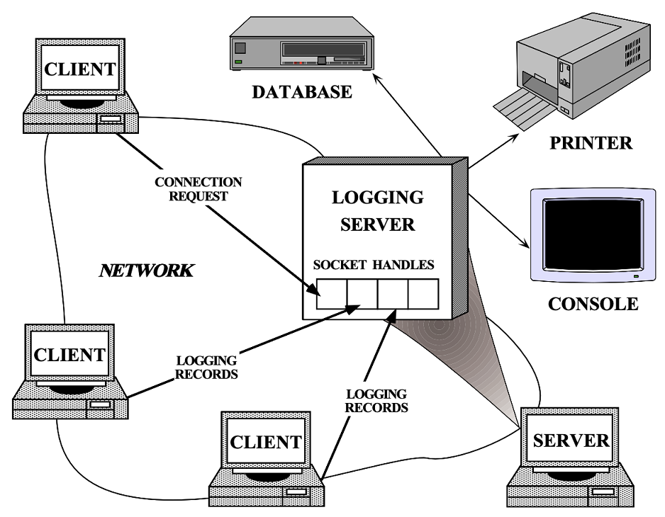
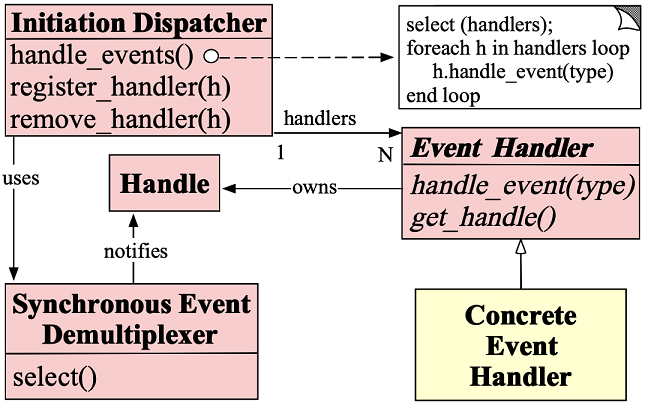
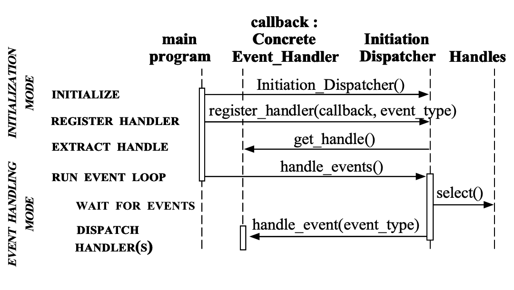
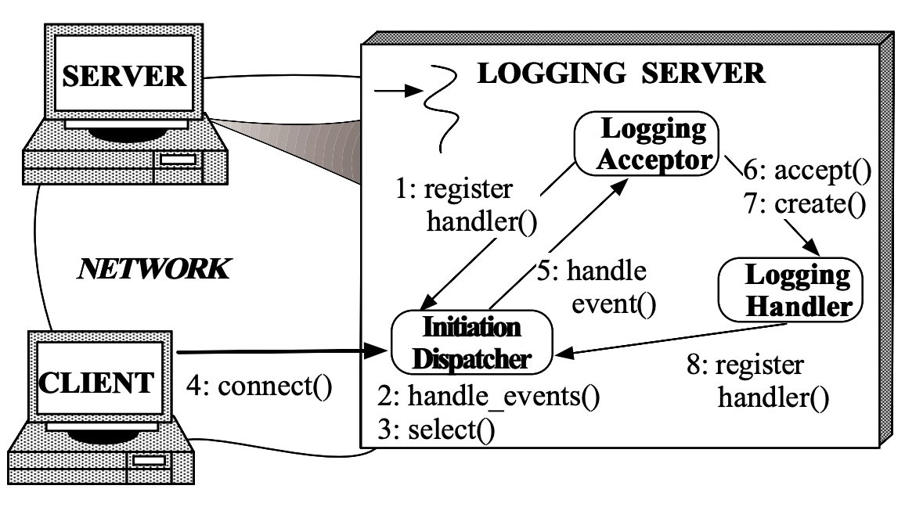
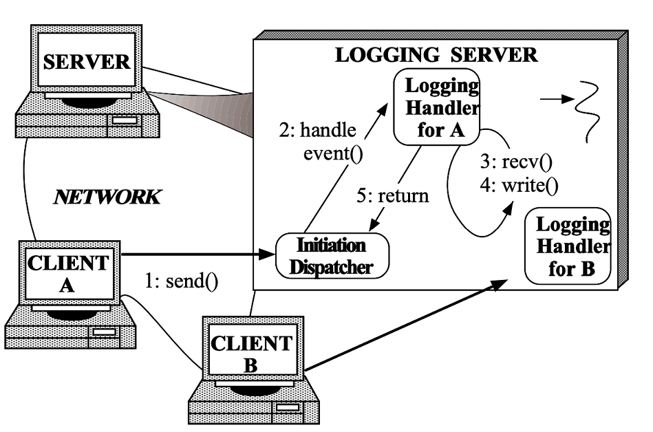

# Reactor

## Overview

本文是对 [Reactor](http://www.dre.vanderbilt.edu/~schmidt/PDF/reactor-siemens.pdf) 一文的梳理和总结。

## Example

### Bad Implementation

### Problem

## Reactor Roles

Role | Description
-|-
Handles | 句柄，标识操作系统资源，例如：网络连接、打开的文件、定时器等等。`Synchronous Event Demultiplexer` 可以等待 `Handles` 发生事件。
Synchronous Event Demultiplexer | Blocking 集合 Handles 上的事件发生，例如 Linux 的 `select()`, `epoll()`。
Initiation Dispatcher | 定义了一个可以注册、删除、分发 `Event Handler` 的接口。Synchronous Event Demultiplexer 检测到事件时，会由 `Initiation Dispatcher` 进行事件分发处理。
Event Handler | 提供了 Hook 接口，在事件发生时触发 Hook 进行处理。该对象是抽象表示，具体如何处理由 `Concrete Event Handler` 实现。
Concrete Event Handler | 实现 `Event Handler` 的 Hook 接口。将 `Concrete Event Handler` 注册到 `Initiation Dispatcher` 中，当 Event 发生，由 `Initiation Dispatcher` 回调 `Concrete Event Handler` 的 Hook 进行处理。

## Collaborations

Reactor 工作方式：

1. 应用程序注册 `Concrete Event Handler` 到 `Initiation Dispatcher` 上，意味着 `Concrete Event Handler` 希望 `Initiation Dispatcher` 在观察到关联的 `Handle` 相应事件类型发生时通知 `Concrete Event Handler` 进行处理。
1. 一个 `Handle` 映射到一个 `Event Handler`，所以 `Initiation Dispatcher` 可以根据 Handle 找到 `Event Handle`，并通知处理事件。
1. 应用程序调用 `Initiation Dispatcher` 的 `handle_events()` 开启循环。在这个时候，`Initiation Dispatcher` 会使用 `Synchronous Event Demultiplexer` 等待注册的 Handle 集合事件发生。
1. 当 `Synchronous Event Demultiplexer` 感知到 Handle 事件发生，将会通知 `Initiation Dispatcher`。
1. `Initiation Dispatcher` 根据准备好的 Handle 作为 Key，找到 `Event Handler`。
1. `Initiation Dispatcher` 调用 `Event Handler` 的 `handle_event` 处理 Handle 的事件。

### Client Connects Scenarios

### Client Sends Scenarios

## Implementation

## References

- [Reactor - An Object Behavioral Pattern for Demultiplexing and Dispatching Handles for Synchronous Events](http://www.dre.vanderbilt.edu/~schmidt/PDF/reactor-siemens.pdf)
- [Wiki Reactor pattern](https://en.wikipedia.org/wiki/Reactor_pattern)
- [图码解说网络编程中的 Reactor 模式](https://km.woa.com/group/906/articles/show/267670)
- [Reactor Pattern 理解，并用 select() 实现 Reactor 模式](https://blog.csdn.net/bumingchun/article/details/81751204)
- [Reactor 模式详解](http://www.blogjava.net/DLevin/archive/2015/09/02/427045.html)
