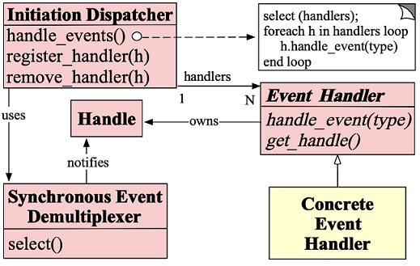
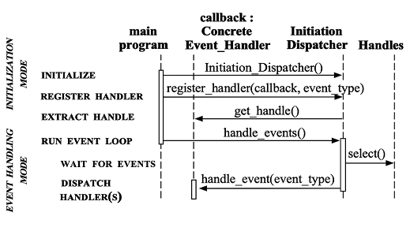
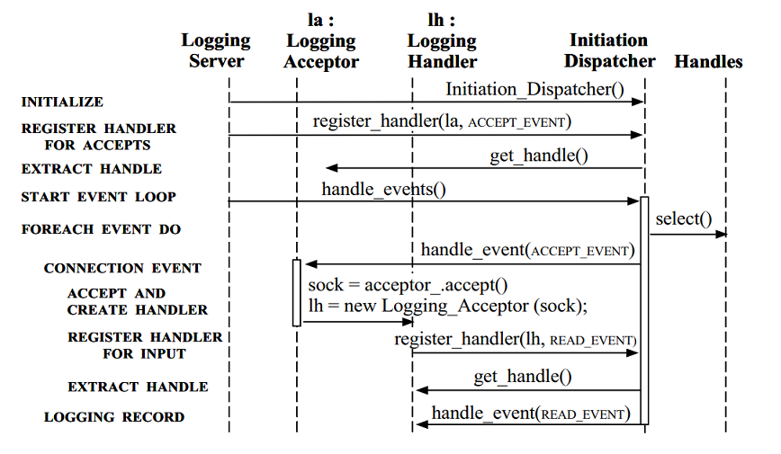

# Reactor: An Object Behavioral Pattern

<!-- TOC -->

- [Reactor: An Object Behavioral Pattern](#reactor-an-object-behavioral-pattern)
    - [Overview](#overview)
        - [Example](#example)
        - [Bad Implementation](#bad-implementation)
        - [Target](#target)
    - [Reactor Roles](#reactor-roles)
    - [Collaborations](#collaborations)
        - [Client Connects Scenarios](#client-connects-scenarios)
        - [Client Sends Scenarios](#client-sends-scenarios)
    - [Implementation](#implementation)
        - [Synchronous Event Demultiplexer Mechanism](#synchronous-event-demultiplexer-mechanism)
        - [Initiation Dispatcher](#initiation-dispatcher)
        - [Define the Event Handling Interface](#define-the-event-handling-interface)
        - [Implement the Concrete Event Handlers](#implement-the-concrete-event-handlers)
        - [Implement the Server](#implement-the-server)
    - [References](#references)

<!-- /TOC -->

## Overview

本文是对 [Reactor](http://www.dre.vanderbilt.edu/~schmidt/PDF/reactor-siemens.pdf) 一文的梳理和总结。

Reactor 的含义参考 Wiki 的解释：

> The reactor design pattern is an event handling pattern for handling service requests delivered concurrently to a service handler by one or more inputs. The service handler then demultiplexes the incoming requests and dispatches them synchronously to the associated request handlers.

### Example

为了阐述 Reactor，考虑下图的事件驱动 Logging Server 示例：


Client 使用 Logging Server 记录信息，这些信息可能包括：

- debugging traces
- error notifications
- performance reports

Logging Server 接收到 Client 信息后，通过多种方式输出到设备，例如控制台、文件或者一个网络数据库。

### Bad Implementation

大概直观的实现方法类似于下图：


Logging Server 使用多线程处理多个客户端，每个连接都会赋予一个线程进行处理。

这种实现方法并非无法完成功能，但是却对以下问题很棘手：

Problem | Description
-|-
Efficiency | 由于上下文切换、同步和数据的移动，多线程的处理效果可能不佳。
Programming simplicity | 可能需要复杂的并发控制方案。
Portability | 线程可能并非在所有操作系统上都可用。

由于这些缺点，多线程通常不是开发 Logging Server 的最有效或最不复杂的解决方案。

### Target

Reactor Pattern 期望实现这些目标：

Target | Description
-|-
Availability | Server 可以处理当前输入的请求，即便此时还有请求等待到达。
Efficiency | Server 必须最小化延时、最大化吞吐量、避免不必要的占用 CPU。
Programming simplicity | Server 的设计应该简化并发策略的使用。
Adaptability | 可以方便的集成新的服务或优化服务，对现有代码的维护成本和修改成本小。
Portability | 将服务器移植到新的OS平台上不需要花费很多精力

## Reactor Roles

Role | Description
-|-
Handles | 句柄，标识操作系统资源，例如：网络连接、打开的文件、定时器等等。Synchronous Event Demultiplexer 可以等待 `Handles` 发生事件。
Synchronous Event Demultiplexer | 组塞等待 Handles 集合上的事件发生，例如 Linux 的 `select()`, `epoll()`。
Initiation Dispatcher | 定义了一个可以注册、删除、分发 Event Handler 的接口。Synchronous Event Demultiplexer 检测到事件时，会由 `Initiation Dispatcher` 进行事件分发处理。
Event Handler | 提供了 Hook 接口，在事件发生时触发 Hook 进行处理。该对象是抽象表示，具体如何处理由 Concrete Event Handler 实现。
Concrete Event Handler | 实现 Event Handler 的 Hook 接口。将 `Concrete Event Handler` 注册到 Initiation Dispatcher 中，当 Event 发生，由 Initiation Dispatcher 回调 `Concrete Event Handler` 的 Hook 进行处理。



## Collaborations

Reactor 工作方式：

1. 应用程序注册 Concrete Event Handler 到 Initiation Dispatcher 上，意味着 Concrete Event Handler 希望 Initiation Dispatcher 在观察到关联的 Handle 相应事件类型发生时通知 Concrete Event Handler 进行处理。
1. 一个 Handle 映射到一个 Event Handler，所以 Initiation Dispatcher 可以根据 Handle 找到 Event Handle，并通知处理事件。
1. 应用程序调用 Initiation Dispatcher 的 `handle_events()` 开启`事件循环`。在这个时候，Initiation Dispatcher 会使用 Synchronous Event Demultiplexer 等待注册的 Handle 集合事件发生。
1. 当 Synchronous Event Demultiplexer 感知到 Handle 事件发生，将会通知 Initiation Dispatcher。
1. Initiation Dispatcher 根据准备好的 Handle 作为 Key，找到 Event Handler。
1. Initiation Dispatcher 调用 Event Handler 的 `handle_event()` 处理 Handle 的事件。



### Client Connects Scenarios

Client 向 Logging Server 新建连接请求的场景可简化为下图所示：


步骤如下:

1. Logging Server 在 Initiation Dispatcher 中注册 Logging Acceptor 来处理客户端 TCP 连接请求。
1. Logging Server 调用 Initiation Dispatcher 的 `handle_events()` 方法。
1. Initiation Dispatcher 会调用 Synchronous Event Demultiplexer 的 `select()` 方法，等待连接请求抵达 Loggin Server。
1. Client 发起一个连接
1. Initiation Dispatcher 通过 Synchronous Event Demultiplexer 监听到该新建连接请求，并通知 Logging Acceptor 处理。
1. Logging Acceptor 通过 `accept()` 获得新连接。
1. Logging Acceptor 创建 Logging Handler，并且 Handle 为新连接。该 Logging Handler 为客户端的数据请求服务。
1. Logging Handler 注册到 Initiation Dispatcher 上，并指定当 Handle 可读时通知 Logging Handler 进行处理。

### Client Sends Scenarios

Client 向 Logging Server 发送数据的场景可简化为下图所示：


步骤如下：

1. Client 通过 `send()` 发送数据到 Logging Server。
1. Initiation Dispatcher 感知到 Handle 可读，并通知关联的 Logging Handler 进行处理。
1. 数据通过非阻塞的 `recv()` 接口进行获取，若数据不完整，需要重复步骤 2 和 步骤 3，直到数据获取完整。
1. Logging Handler 处理数据，并将数据打印到标准输出上。
1. Logging Handler 返回 Initiation Dispatcher 的事件循环上。

## Implementation

[Reactor](http://www.dre.vanderbilt.edu/~schmidt/PDF/reactor-siemens.pdf) 一文中提供了 Reactor Pattern 的 C++ 实现示例，这里同样进行演示。

### Synchronous Event Demultiplexer Mechanism

Synchronous Event Demultiplexer 同步等待一个或多个事件发生，这通常使用操作系统提供的多路复用系统实现，例如 `select()`。

通常来说，Synchronous Event Demultiplexer 使用的多路复用系统依赖于操作系统提供的能力，而不需要 Reactor 实现者去开发。

### Initiation Dispatcher

在开发 Initiation Dispatcher 时，以下内容是需要去思考的：

- **Implement the Event Handler table**
  - 一个 Initiation Dispatcher 需要维护一张存放 Concrete Event Handlers 的 Table。initiation Dispatcher 提供了方法可以实时向 Table 注册或删除 Event Handler。Table 的实现方式没有限制，可以是 Hash、线性查找等等。
- **Implement the event loop entry point**
  - Initiation Dispatcher 需要通过 `handle_events()` 方法提供事件循环的入口。该方法不但执行 Synchronous Event Demultiplexer 的多路复用检测 Handle，同时也进行 Event Handler 的分发通知。当事件发生，Initiation Dispatcher 从 Synchronous Event Demultiplexer 的调用中返回，并将 ready 状态的 Handle 去查询出 `Event Handler`，再调用 `handle_event()` 接口进行处理。
- **Implement the necessary synchronization mechanisms**
  - 如果应用程序在单线程中使用 Reactor Pattern 模式，则不需要任何同步技术。
  - 当然，Initiation Dispatcher 同样可以将事件分发到多线程中进行处理，避免阻塞事件循环，这种情况需要考虑使用同步技术共享数据。
- **Determine the Number of Initiation Dispatchers in an Application**
  - 大多应用会使用单实例的 Reactor Pattern，此时只会有一个 Initiation Dispatcher。
  - 然而一些操作系统会限制单个线程可以使用并等待的 Handles 个数。在这种情况下，创建多线程，每个线程拥有自己的 Reactor Pattern（都包含一个 Initiation Dispatcher）。

下面的 C++ 代码描述了 Initiation Dispatcher 提供的核心方法：

```cpp
enum Event_Type
  // = TITLE
  // Types of events handled by the
  // Initiation_Dispatcher.
  //
  // = DESCRIPTION
  // These values are powers of two so
  // their bits can be efficiently ‘‘or’d’’
  // together to form composite values.
{
  ACCEPT_EVENT = 01,
  READ_EVENT = 02,
  WRITE_EVENT = 04,
  TIMEOUT_EVENT = 010,
  SIGNAL_EVENT = 020,
  CLOSE_EVENT = 040
};

class Initiation_Dispatcher {
 public:

  // Register an Event_Handler of a particular
  // Event_Type (e.g., READ_EVENT, ACCEPT_EVENT,
  // etc.).
  int register_handler (Event_Handler *eh, Event_Type et);

  // Remove an Event_Handler of a particular
  // Event_Type.
  int remove_handler (Event_Handler *eh, Event_Type et);

  // Entry point into the reactive event loop.
  int handle_events (Time_Value *timeout = 0);
};
```

### Define the Event Handling Interface

Event Handler 的定义通常有两种方式：

- **A single-method interface**，Event Handler 通过单一接口 `event_handle()` 进行处理事件，由 Initiation Dispatcher 进行调用。这种方式的优点是，如果添加了新的事件类型，不用修改接口。但是这种方式需要在 `handle_event()` 使用 `if` 或 `switch` 语句来进行事件类型的判断并处理。
- **A multi-method interface**，Event Handler 为每种事件类型都定义一个 Hook 接口。好处是便于 Concrete Event Handlers 进行实现时针对需要的事件进行重写。

这是一个 `Single Method Interface`：

```cpp
class Event_Handler
  // = TITLE
  // Abstract base class that serves as the target of the Initiation_Dispatcher.
{
 public:

  // Hook method that is called back by the Initiation_Dispatcher to handle events.
  virtual int handle_event (Event_Type et) = 0;

  // Hook method that returns the underlying I/O Handle.
  virtual Handle get_handle (void) const = 0;
};
```

这是一个 `Multi Method Interface`：

```cpp
class Event_Handler
{
 public:

  // Hook methods that are called back by
  // the Initiation_Dispatcher to handle
  // particular types of events.
  virtual int handle_accept (void) = 0;
  virtual int handle_input (void) = 0;
  virtual int handle_output (void) = 0;
  virtual int handle_timeout (void) = 0;
  virtual int handle_close (void) = 0;

  // Hook method that returns the underlying I/O Handle.
  virtual Handle get_handle (void) const = 0;
};
```

### Implement the Concrete Event Handlers

Concrete Event Handlers 由开发人员进行构建，并且针对事件编写处理程序。

下面为 Logging Server 提供了两种 Concrete Event Handlers:

- Logging Acceptor
- Logging Handler

#### Implement Logging Acceptor

Logging Acceptor 是 Acceptor 的示例组件，该组件监听端口，并注册到 Initiation Dispatcher 中，并在接收到新连接时，由该组件构建连接对应的 Logging Handler。

```cpp
class Logging_Acceptor : public Event_Handler
  // = TITLE
  // Handles client connection requests.
{
 public:
  // Initialize the acceptor_ endpoint and
  // register with the Initiation Dispatcher.
  Logging_Acceptor (const INET_Addr &addr) : acceptor_(addr) {
    Initiation_Dispatcher::instance()->register_handler(this, ACCEPT_EVENT);
  }

  // Factory method that accepts a new
  // SOCK_Stream connection and creates a
  // Logging_Handler object to handle logging
  // records sent using the connection.
  virtual void handle_event (Event_Type et) {
    assert (et == ACCEPT_EVENT);

    // Accept the connection.
    SOCK_Stream new_connection;
    acceptor_.accept(new_connection);

    // Create a new Logging Handler.
    Logging_Handler *handler = new Logging_Handler(new_connection);
  }

  // Get the I/O Handle (called by the
  // Initiation Dispatcher when
  // Logging_Acceptor is registered).
  virtual HANDLE get_handle (void) const {
    return acceptor_.get_handle ();
  }

 private:
  // Socket factory that accepts client connections.
  SOCK_Acceptor acceptor_;
};
```

#### Implement Logging Handler

Logging Handler 用于接收 Client 的数据。

```cpp
class Logging_Handler : public Event_Handler
  // = TITLE
  // Receive and process logging records
  // sent by a client application.
{
 public:
  // Initialize the client stream.
  Logging_Handler (SOCK_Stream &cs) {
    Initiation_Dispatcher::instance()->register_handler(this, READ_EVENT);
  }

  // Hook method that handles the reception
  // of logging records from clients.
  virtual void handle_event (Event_Type et) {
    if (et == CLOSE_EVENT) {
      peer_stream_.close();
      Initiation_Dispatcher::instance()->remove_handler(this, READ_EVENT);
      delete (void *) this;
    }

    if (et == READ_EVENT) {
      Log_Record log_record;
      peer_stream_.recv((void *) log_record, sizeof log_record);
      // Write logging record to standard output.
      log_record.write(STDOUT);
    }
  }

  // Get the I/O Handle (called by the
  // Initiation Dispatcher when
  // Logging_Handler is registered).
  virtual HANDLE get_handle (void) const {
    return peer_stream_.get_handle ();
  }

 private:
  // Receives logging records from a client.
  SOCK_Stream peer_stream_;
};
```

### Implement the Server

Logging Server 提供了一个 `main()` 入口函数，并使用单线程方式运行 Reactor。

```cpp
// Server port number.
const u_short PORT = 10000;
int main (void) {

  // Logging server port number.
  INET_Addr server_addr(PORT);

  // Initialize logging server endpoint and register with the Initiation_Dispatcher.
  Logging_Acceptor la(server_addr);

  // Main event loop that handles client logging records and connection requests.
  for (;;) {
    Initiation_Dispatcher::instance()->handle_events();
  }

  /* NOTREACHED */
  return 0;
}
```

下面的时序图展示了各个组件之间的协作：



## References

- [Reactor - An Object Behavioral Pattern for Demultiplexing and Dispatching Handles for Synchronous Events](http://www.dre.vanderbilt.edu/~schmidt/PDF/reactor-siemens.pdf)
- [Wiki Reactor pattern](https://en.wikipedia.org/wiki/Reactor_pattern)
- [图码解说网络编程中的 Reactor 模式](https://km.woa.com/group/906/articles/show/267670)
- [Reactor Pattern 理解，并用 select() 实现 Reactor 模式](https://blog.csdn.net/bumingchun/article/details/81751204)
- [Reactor 模式详解](http://www.blogjava.net/DLevin/archive/2015/09/02/427045.html)
- [Comparing Two High-Performance I/O Design Patterns](https://www.artima.com/articles/comparing-two-high-performance-io-design-patterns)
