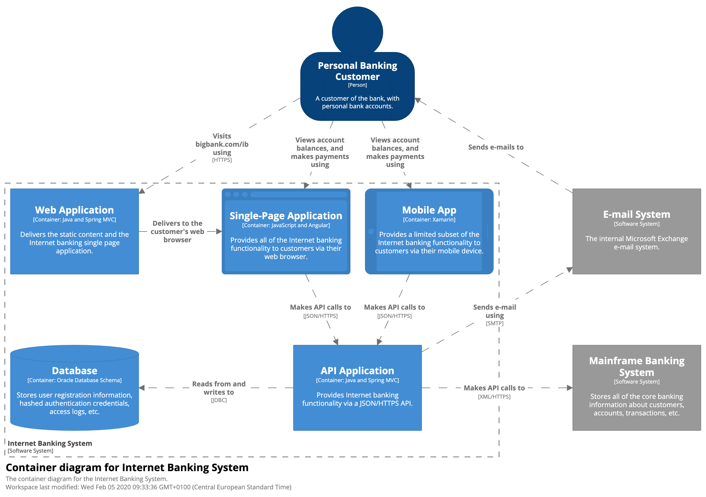
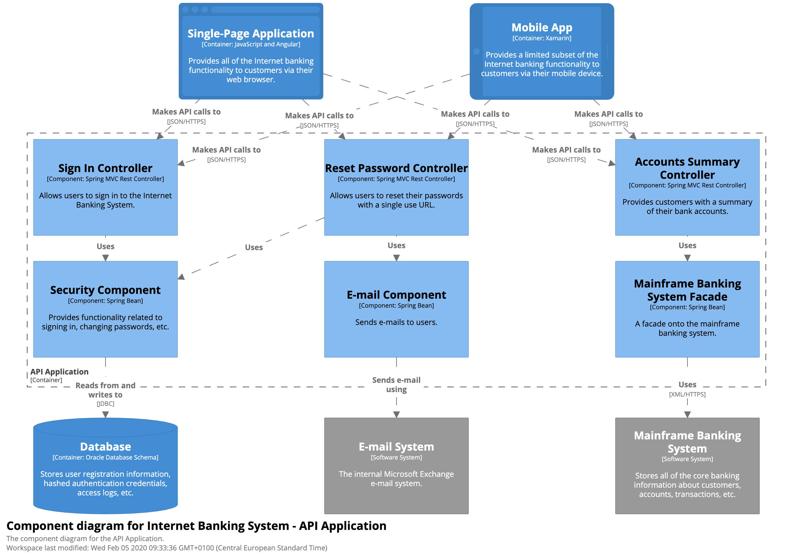

# C4 Model

<!-- TOC -->

- [C4 Model](#c4-model)
  - [Overview](#overview)
  - [Concepts](#concepts)
    - [Person](#person)
    - [Software System](#software-system)
    - [Container](#container)
    - [Component](#component)
  - [Core Diagrams](#core-diagrams)
    - [Level 1: System Context diagram](#level-1-system-context-diagram)
    - [Level 2: Container diagram](#level-2-container-diagram)
    - [Level 3: Component diagram](#level-3-component-diagram)
    - [Level 4: Code](#level-4-code)
  - [Supplementary diagrams](#supplementary-diagrams)
    - [System Landscape diagram](#system-landscape-diagram)
    - [Dynamic diagram](#dynamic-diagram)
    - [Deployment diagram](#deployment-diagram)
  - [Notation](#notation)
  - [Tools](#tools)
  - [References](#references)

<!-- /TOC -->

## Overview

C4 Model 是一种方法论，用于帮助软件开发团队描述和交流软甲架构。C4 Model 可以创建代码地图，并具有不同的缩放级别（地图可以放大放小，就像 Google 地图可以对详细程度进行缩放），而不同的缩放级别会站在不同的层面描述设计。

> The C4 model was created as a way to help software development teams describe and communicate software architecture, both during up-front design sessions and when retrospectively documenting an existing codebase. It's a way to create maps of your code, at various levels of detail, in the same way you would use something like Google Maps to zoom in and out of an area you are interested in.

C4 Model 核心存在四个缩放级别：

- Context，由多个相关联的软件系统组成，描述系统之间的关系。
- Containers，一个软件系统有多个 Containers，每个 Containers 都是一个可以单独运行的进程，描述一个系统中不同进程的交互和运行方式。
- Components，一个 Container 有多个 Components，描述一个进程所使用的组件与技术细节。
- Code，描述的是 Component 中的类关系，通常用 UML 类图进行表示。

## Concepts

这里描述在 C4 Model 中存在的基本概念和角色。

### Person

Person 代表了你所设计的软件系统的人类用户。

> A person represents one of the human users of your software system (e.g. actors, roles, personas, etc).

### Software System

软件系统是最高级别的抽象，并为用户传递有价值的东西。这包括了你正在构建的软件系统，以及依赖的软件系统。

> A software system is the highest level of abstraction and describes something that delivers value to its users, whether they are human or not. This includes the software system you are modelling, and the other software systems upon which your software system depends (or vice versa). In many cases, a software system is "owned by" a single software development team.

### Container

C4 Model 中的容器并不意味着 Docker 等等的容器化技术，一个容器表示了一个`应用程序`或者`数据存储`。容器运行后，整个软件系统才能正常工作。

以下是常见的容器：

Container | Description
-|-
Server-side web application | 运行在 Apache Tomcat 上的 Java EE Web 程序，运行在 Microsoft IIS 上的 ASP.NET MVC 应用程序等等。
Client-side web application | 使用 Angular、Backbone.JS、jQuery 等在 Web 浏览器中运行的 JavaScript 应用程序。
Client-side desktop application | 使用 WPF 编写的 Windows 桌面应用程序、使用 Objective-C 编写的 OS X 桌面应用程序、使用 JavaFX 编写的跨平台桌面应用程序等。
Mobile app | Apple iOS 应用程序、Android 应用程序、Microsoft Windows Phone 应用程序等。
Server-side console application | 一个独立的批处理应用程序。
Serverless function | 一个 serverless function。
Database | 关系数据库管理系统、文档存储、图形数据库等中的模式或数据库。
Blob or content store | Blob 存储或内容交付网络。
File system | 完整的本地文件系统或较大的网络文件系统的一部分。
Shell script | 用 Bash 等编写的单个 shell 脚本。

**注意：**

- Server-side web application，可以直接理解成 Server 应用进程。
- Client-side web application，可以直接立即成 Web Javascript 程序。

### Component

组件是封装在明确接口后面的一组相关功能。如果您使用的是 Java 或 C# 之类的语言，那么可以认为组件是类的集合（一个组件不是一个类，而是一系列类的集合）。

C4 Model 中，组件不可以单独部署（容器可以）。

## Core Diagrams

### Level 1: System Context diagram

系统上下文图，用于描述各个软件系统和用户之间的关系，是文档可视化的一个良好的开端。

在这类图中，重点应该放在表述人与软件系统的关系上，而不应该花精力在技术、协议、实现细节上。

Views | Description
-|-
Scope | A single software system.
Primary elements | 范围内的软件系统。
Supporting elements | 与范围内软件系统有直接连接关系的所有 People 和其他依赖的软件系统。通常，这些软件系统在你的软件系统外，你对其没有所有权和责任。
Intended audience | 软件开发团队内外的所有人，包括技术和非技术。
Recommended for most teams | Yes.

### Level 2: Container diagram

通过 [Level 1: System Context diagram](#level-1-system-context-diagram) 了解你的系统环境后，下一步是放大你的系统边界，绘制一个`容器视图`。

软件系统由多个容器组成，一个容器可以是 Server-side web application、Client-side web application 等等，请参考 [Container](#container)。

容器是可以单独进行运行和部署的单元，它们执行代码或存储数据。

容器视图显示较高程度的软件架构，并且也描述了各个容器的职责。除此外，它也显示了主要的技术选型，以及容器之间的通信方式。这是一个简单的，以技术为重点的视图。

Views | Description
-|-
Scope | A single software system.
Primary elements | 软件系统范围内的容器。
Supporting elements | 直接使用容器的人和其他软件系统。
Intended audience | 软件开发团队内外的所有人，包括软件架构师、开发人员和运营/支持人员。
Recommended for most teams | Yes.

### Level 3: Component diagram

通过进一步放大和分解容器，以确定容器中的组件及相互作用。

组件图显示了容器是如何由多个组件构成的，这些组件是什么，它们的职责以及实现细节。

Views | Description
-|-
Scope | A single software system.
Primary elements | 容器范围内的组件。
Supporting elements | 容器再加上直接连接到组件的人和系统。
Intended audience | 软件架构师和开发人员。
Recommended for most teams | No, only create component diagrams if you feel they add value, and consider automating their creation for long-lived documentation.

### Level 4: Code

正如 [Component](#component) 所说，组件是类的集合，当放大一个组件，本质上就是观察类和类之间的关系，因此在这一层级使用 UML 图、实体关系图或类似的其他表示类关系的可视化方（推荐 UML 图，常用且直观）。

除了最重要或最复杂的组件外，不建议将这种详细程度用于任何其他组件。

Views | Description
-|-
Scope | A single component.
Primary elements | 代码元素（例如类、接口、对象、函数、数据库表等）。
Intended audience | 软件架构师和开发人员。
Recommended for most teams | No, only create component diagrams if you feel they add value, and consider automating their creation for long-lived documentation.

## Supplementary diagrams

在对 [Core Diagrams](#core-diagrams) 有了了解后，可以对 C4 Model 进行补充，以展示你设计系统的其他方面。

### System Landscape diagram

C4 Model 提供了对单一软件系统的描述，现实中软件系统之间并非是孤立的（虽然 C4 Model 的软件系统之间确实存在关系，但是仍然是将其各自单独看待），而是彼此之间互为一个整体，特别是如果你负责一组软件系统的设计室，这种软件系统的整体性更为突出。

为此，只需要在 C4 Model 的最外层，添加一个框，将联系紧密的软件系统组成一个整体。通过这样的方式可以显示组织的边界，内部外部用户，以及内部外部系统。

Views | Description
-|-
Scope | An enterprise.
Primary elements | 企业范围内相关的人和软件系统。
Intended audience | 软件开发团队内外的技术和非技术人员。

### Dynamic diagram

动态图用于显示静态模型中的元素如何协作，以描述相关示例、系统功能等。

动态图基于 UML 通信图，其作用有点类似于 UML 时序图。

Views | Description
-|-
Scope | An enterprise, software system or container.
Primary elements | 企业范围内相关的人和软件系统。
Intended audience | 软件开发团队内外的技术和非技术人员。

### Deployment diagram

部署图用于说明静态模型中的软件系统和容器如何映射到基础设施。

部署图类似于 UML 部署图，但 C4 Model 的部署图更为简化。

部署节点常见的有：

- 物理基础设施（例如物理服务器或设备）
- 虚拟化基础设施（例如 IaaS、PaaS、虚拟机）
- 容器化基础设施（例如 Docker 容器）
- 执行环境（例如数据库服务器、Java EE web/应用服务器、Microsoft IIS）等。

Views | Description
-|-
Scope | One or more software systems.
Primary elements | 部署节点、软件系统实例、容器实例。
Intended audience | 软件开发团队内外的技术人员。

## Notation

C4 Model 并没有规定任何特定符号，但不同的 C4 Model 绘制可能会自定义相关的符号。

一种简单的适用于白板、纸张、便签的符号如下（这并非规定，而是一个示例）：

尽管 C4 Model 没有对符号做规定，但还是应该使用可以一目了然的符号，且图表中的符号具有意义。

在使用图表符号时，要求每个图表都应该具有 Key/说明，使得图表符号明确，因为不是每个人都知道所使用的符号。

这是一种常用的图标符号和 Key/说明：

## Tools

使用 Draw.io 画 C4 Model 是简单和美丽的，有两种简单的使用 draw.io 的方式：

- 浏览器地址栏输入 <https://app.diagrams.net/> 或 <draw.io>
- 使用 vscode 的 draw.io 插件：`Draw.io Integration`。

## References

1. [The C4 model for visualising software architecture](https://c4model.com/)
