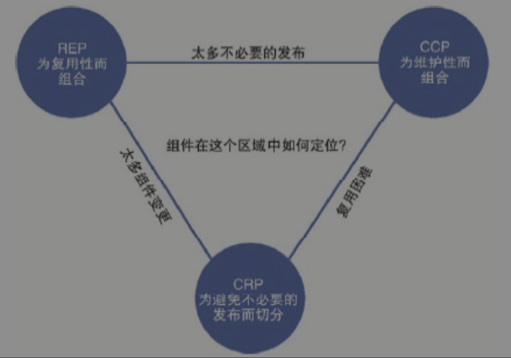
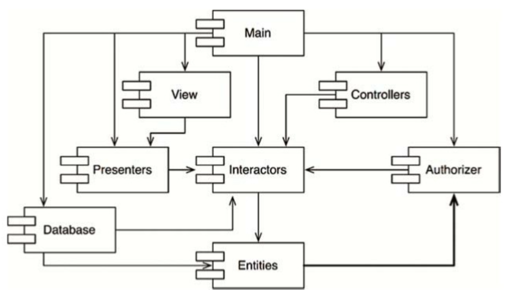
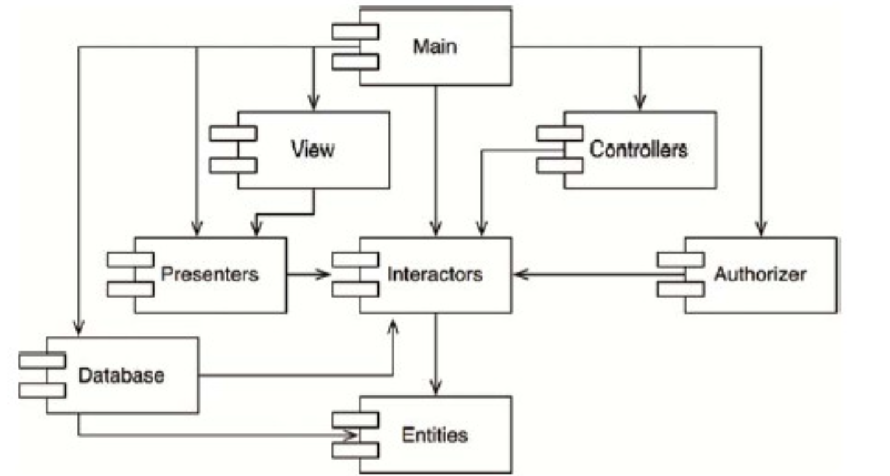
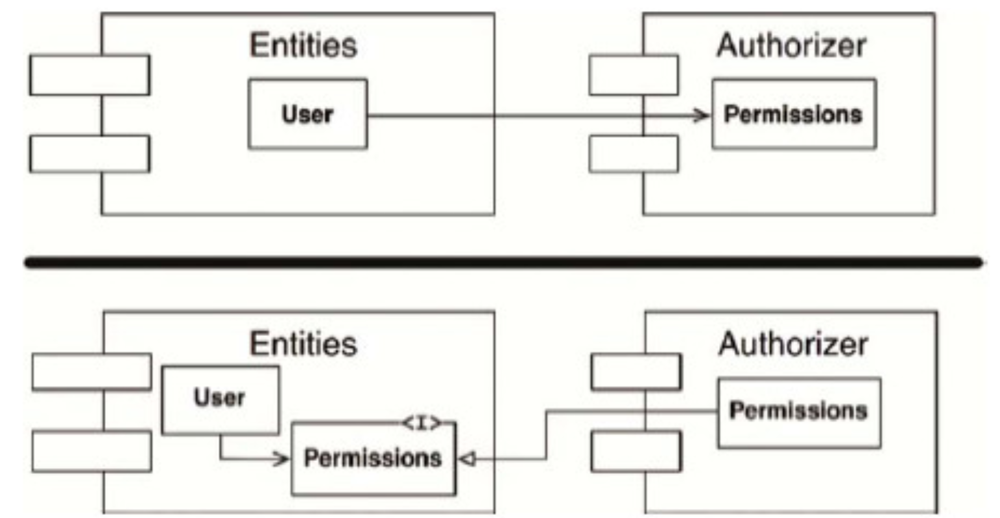
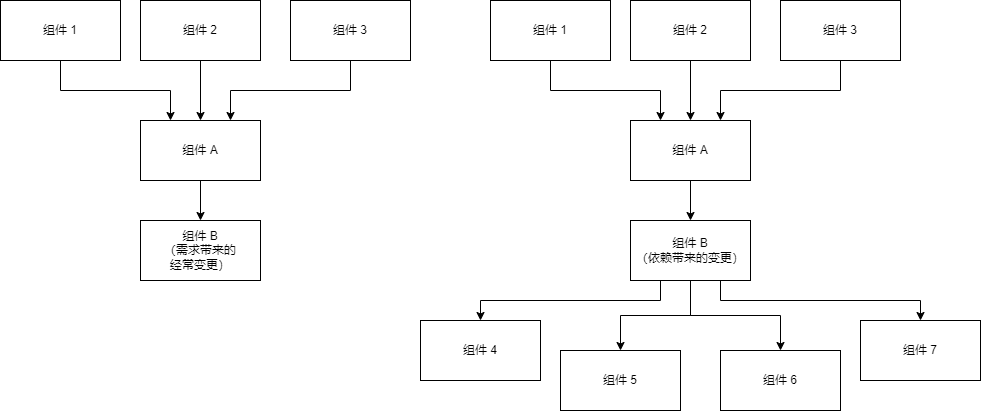

# 组件构建原则

[TOC]

## 概述

组件是什么？这也是一个和 “架构” 一样，被用烂掉的词，在不同的环境、上下文中，组件的含义是不一样的。

在《架构整洁之道》中提到的组件，指的是：

> 组件是软件的部署单元，是整个软件系统在部署过程中可以独立完成部署的最小实体。

一些例子：

- C/C++ 中，组件就类似于静态库、动态库。
- Java 中，组件就类似于 Jar 包。
- Python 中，组件就类似于 package。

我们可以将多个组件构（链接）建成一个可执行文件。

组件构建主要讨论两部分内容：

- 组件聚合。即哪些类应该被组成一个组件，而哪些不应该。
- 组件耦合。如何将组件和组件拼接起来，构建一个系统。

## 组件聚合（组件构建）

《架构整洁之道》中如此提到组件的聚合：

> 究竟是哪些类应该被组合成一个组件呢？这是一个非常重要的设计决策，应该遵循优秀的软件工程经验来行事。但不幸的是，很多年以来，我们对于这么重要的决策经常是根据当下面临的实际情况临时拍脑门决定的。

### 复用/发布等同原则（REP）

什么是 REP（Reuse/Release Equivalence Principle）？

> 软件复用的最小粒度应等同于其发布的最小粒度。

这句话看的有点云里雾里的，那么到底是什么意思呢？我理解：一个组件要复用，那么该组件应该是可发布的，遵循发布机制。

那什么是发布机制呢？通常发布机制有这些特征：

1. 组件的发布，需要有版本号进行跟踪。
1. 每个发布的组件，其中的类之间是相互关联且兼容的，不至于某个类依赖当前版本，而另外一个类依赖上一个版本。
1. 有组件文档进行说明和维护。

从软件设计和架构设计的角度来看，REP 原则就是指：

- 组件中的类与模块必须是彼此紧密相关的。
- 也就是说，一个组件不能由一组毫无关联的类和模块组成，它们之间应该有一个共同的主题或者大方向。

违反 REP 的例子：

### 共同闭包原则（CCP）

什么是 CCP（Common Closure Principle）？

> 我们应该将那些会同时修改，并且为相同目的而修改的类放到同一个组件中，而将不会同时修改，并且不会为了相同目的而修改的那些类放到不同的组件中。

探究 CCP 的本质：

- CCP 希望将一个变更原因，聚合在一个组件中。其他变更原因的类，放在其他组件中。
- CCP 可以避免一个变更原因，导致多个组件的修改。
- 指导思想：
  - **根据变更原因进行聚合**。

很明显，CCP 非常类似于 SRP，即组件应该单一职责，只因为相同的原因而变化。如果组件中有不同原因变化的部分，应该进行分拆。这两条的本质都是：*将由于相同原因而修改，并且需要同时修改的东西放在一起。将由于不同原因而修改，并且不同时修改的东西分开。*。

CCP 的目标是为了**易维护**：

- 对大部分应用程序来说，可维护性的重要性要远远高于可复用性。
- 如果某程序中的代码必须要进行某些变更，那么这些变更最好都体现在同一个组件中，而不是分布于很多个组件中。
- 因为如果这些变更都集中在同一个组件中，我们就只需要重新部署该组件，其他组件则不需要被重新验证、重新部署了。

违反 CCP，那么就意味着两方面的含义：

- 一个组件中存在多个变更原因的类。
- 一个变更原因分散在不同的组件中。

这两者都代表一个组件容易被变更，以及一个变更需要修改多个组件。这会导致一个变更需求来了后，修改多处组件，他们之间的兼容性、发布顺序等需要着重考虑。

### 共同复用原则（CRP）

什么是 CRP（Common Reuse Principle）？

> 不要强迫一个组件的用户依赖他们不需要的东西。

探究 CRP 的本质：

- CRP 希望组件中的类，都会被复用。
- CRP 会避免组件中某些类容易被复用，某些类不容易被复用。
- 指导思想：
  - **根据复用频率进行拆分**。统计组件中类的复用情况，将基本不怎么用到的类单独用个组件进行隔离，避免他们的发生变化时，影响其他所有的依赖方。
  - **根据复用场景进行拆分**。即便是被高频复用的类，在不同场景下的复用分布也是不一样的。例如 I 类场景只复用 A/B/C 类，而 II 类场景只复用 D/E/F 类，那么也需要拆分成两个组件。

很明显，CRP 非常类似于 ISP（接口隔离原则），CRP 这里就是对组件里面的类做隔离。这两条的本质都是：*不要依赖不需要用到的东西*。

违反 CCP，那么意味着依赖方会有很多压根不用的类，当这些类发送变化时，会导致依赖方的重新编译、测试和发布。即：导致过多的无用发布。

### 组件聚合张力图

非常明显，REP、CCP、CRP 之间是互相制约的，不可能全部同时满足：

- REP 和 CCP 原则是黏合性原则，它们会让组件变得更大。
- 而 CRP 原则是排除性原则，它会尽量让组件变小。

软件架构师的任务就是要在这三个原则中间进行取舍。

**注意：**

- 虽然 CCP 也提到了不同的变更原因需要进行拆分，但是这个是非常模糊的标准。一个变更需求，可能只修改其中某个类，是非常正常的，不可能随便就拆掉。因此并非说 CCP 就没有指导拆分，而是指 CCP 在组织类时，更具指导性。

## 组件耦合

我们的软件系统需要将组件进行耦合，如何进行耦合也是十分重要的。这里主要有三个耦合原则：

- 无依赖环原则
- 稳定依赖原则
- 稳定抽象原则

### 无依赖环原则（ADP）

什么是无依赖环原则？其实顾名思义：

> 组件依赖关系图中不应该出现环。

无依赖环原则脱胎于这样一个背景：**一觉醒来综合征**。

> 当你花了一整天的时间，好不容易搞定了一段代码，第二天上班时却发现这段代码莫名其妙地又不能工作了。这通常是因为有人在你走后修改了你所依赖的某个组件。我给这种情况起了个名字——“一觉醒来综合征”。

业界为了解决 *一觉醒来综合征*，有两种处理方式：

解决方式 | 描述 | 优点 | 缺点 | 适用范围
-|-|-|-
每周构建 | 在每周的前四天中，让所有的程序员在自己的私有库上工作，忽略其他人的修改，也不考虑互相之间的集成问题； 然后在每周五要求所有人将自己所做的变更提交，进行统一构建。 | 简单 | 周五的集成难度大，尤其是对大项目。 减少构建次数，也会对项目交付带来阻塞。 | 中小型项目。
无依赖环原则 | 将项目切分成组件，按组件版本号进行发布。团队自主决定是否立即集成最新版本的组件。| 开发效率高。 | 发布流程复杂，梳理依赖关系。 | 通用方案。

**注意：**

- 这里引入版本号，并非说让所有的组件依赖不同的版本。这里引入版本号，只是为了避免每周五进行集成，而是让每个组件可以自行选择集成时间，这本质上是减少集成难度，均摊集成成本。
- 最终目标，作为一个软件系统，还是需要所有组件都有最新版本的。

即便使用了版本号，但是如果存在循环依赖，仍然有 *一觉醒来综合征*。为什么这么说呢：

例如下图的循环依赖：

很明显：Interactors -> Entities -> Authorizer -> Interactors 这个依赖形成了环状。

这会带来一下问题：

问题 | 描述
-|-
难集成 | 例如有 Entities 的变更且发布时，那么需要考虑对 Interactors 的影响，可能导致对 Interactors 的变更，而 Interactors 的变更可能引起 Authorizer 的变更，进而又引起对 Entities 的又一次变更，导致各个组件的版本号无节制的螺旋上升。
难发布 | 例如有一个变更，导致 Entities、Authorizer、Interactors 都有修改，我们需要仔细思考哪个组件应该先发布： - 我们不能先发布 Entities，因为它依赖了 Authorizer 的新功能； - 我们也不能先发布 Authorizer，因为它依赖了 Interactors 的新功能； - 我们也不能先发布 Interactors，因为它依赖了 Entities 的新功能。 这样的依赖关系，决定了这三个组件必须同时发布，本质上是将三个组件变成了一个大组件。

一个好的依赖关系，是一个有向无环图（DAG）:

有向无环图的依赖关系：

- 易集成。
- 易发布（容易确定发布顺序）。
- 减少影响（例如：Main 组件的变更，只会影响 Main 组件，也只需要测试 Main 组件）。

总体而言，DAG 的依赖关系，让系统更容易维护。

那我们如何打破循环依赖呢？也很简单，一般用 DIP 就够了，将依赖关系进行反转：

### 稳定依赖原则（SDP）

什么是稳定依赖原则？

> 依赖关系必须要指向更稳定的方向。

在理解这条原则前，我们需要理解什么是**稳定性**：

> 稳定指的是“很难移动”。所以稳定性应该与变更所需的工作量有关。

《架构整洁之道》中提到，一枚竖起的硬币是稳定的么？大家通常会感觉它不是稳定的。但是没有任何外力，硬币就会一直竖起，那么为什么大家感觉它不稳定呢？正是因为少量的外力，就能让它改变，所以它不稳定。

因此我们认为变更某个组件的成本、工作量、风险等很大时，该组件就很稳定。反之，组件不稳定。因此稳定性和变更原因没有关系，而更多的是变更成本：变更成本小，即便没有原因让它变化，它依然是不稳定的。

如何让一个组件变得稳定呢？很简单：

> 让软件组件难于修改的一个最直接的办法就是让很多其他组件依赖于它。带有许多入向依赖关系的组件是非常稳定的，因为它的任何变更都需要应用到所有依赖它的组件上。

这样，我们就可以更好的理解稳定依赖原则了：

> 任何一个我们预期会经常变更的组件都不应该被一个难于修改的组件所依赖，否则这个多变的组件也将会变得非常难以被修改。

违反这个原则，会是个什么现象呢：

对此因此：

- 组件 B 是容易变更的，这里容易变更有两种可能：
  - 左图，B 本身是需求导致它容易变更，但是 B 本身是高度稳定的。
  - 有图，B 本身是依赖导致它容易变更，因此 B 本身不算稳定的。
- 无论是哪种，组件 B 都容易变更，这可能可能导致给组件 A 带来了风险，而组件 A 的风险会传递给更多的组件。

这就是违反了稳定依赖原则所导致的问题：

- 不稳定的组件的变更，可能会让稳定的组件出现风险，扩散给更多的组件。

《架构整洁之道》中，定义了稳定性公式：

- Fan-in：入向依赖，这个指标指代了组件外部类依赖于组件内部类的数量。
- Fan-out：出向依赖，这个指标指代了组件内部类依赖于组件外部类的数量。
- I：不稳定性，I=Fan-out/(Fan-in+Fan-out)。
  - 该指标的范围是 [0,1]。
  - I=0 意味着组件是最稳定的，I=1 意味着组件是最不稳定的。

稳定依赖原则 (SDP) 的要求是让每个组件的I指标都必须大于其所依赖组件的 I 指标。也就是说：

> 组件结构依赖图中各组件的 I 指标必须要按其依赖关系方向递减。

很明显，这句话的含意思，上层组件应该是不稳定的，下层组件应该是稳定的（视觉效果而言，就像一朵花一样）。

如果说一个稳定的组件，依赖了一个易变的组件，应该怎么处理呢？

我们仍然可以用依赖倒置原则的方式：

### 稳定抽象原则（SAP）

什么是稳定抽象原则？

> 一个组件的抽象化程度应该与其稳定性保持一致。

稳定性我们知道了，那到底什么是抽象化程度呢？其实就是看组件中的抽象类数量，当组件中抽象类数量占比高的时候，则认为其抽象化程度高。

SAP 的本质就是说，如果一个稳定的组件需要变更，那么就要需要提供尽较多的抽象类来支撑其扩展，这种扩展其实就是一种开闭原则的思路。

> 开闭原则(OCP)为我们提供了答案。这个原则告诉我们：创造一个足够灵活、能够被扩展，而且不需要修改的类是可能的，而这正是我们所需要的。哪一种类符合这个原则呢？答案是抽象类。

为什么稳定的组件需要使用尽可能抽象程度高的设计思路呢？因为稳定的组件意味着依赖方较多，变更阻力大，但是并不代表它就不会改变。因此为了支撑起改变，所以需要提供尽较高抽象程度的接口。

同时，另我一个方面，对于不稳定的组件，抽象程度应该需要低，因为不稳定的组件中通常需要进行具体的实现。

> 一方面，该原则要求稳定的组件同时应该是抽象的，这样它的稳定性就不会影响到扩展性。另一方面，该原则也要求一个不稳定的组件应该包含具体的实现代码，这样它的不稳定性就可以通过具体的代码被轻易修改。

如果违反了这个规则：

- 稳定的组件不抽象：那么意味着组件很难变更，风险和成本很高。
- 不稳定的组件非常抽象：这些抽象类很难发挥实际的作用，甚至没意义。

衡量抽象化程度：假设 A 指标是对组件抽象化程度的一个衡量，它的值是组件中抽象类与接口所占的比例。

- Nc：组件中类的数量。
- Na：组件中抽象类和接口的数量。
- A：抽象程度，A=Na÷Nc。
  - A 指标的取值范围是从 0 到 1。
  - 值为 0 代表组件中没有任何抽象类。
  - 值为 1 就意味着组件中只有抽象类。

结合抽象程度和不稳定性，这里形成了三个区域：

区域 | 本质 | 描述 | 例子 | 备注
-|-|-|-|-
痛苦区 | 稳定且不抽象的组件 | 这样的组件在设计上是不佳的，因为它很难被修改，这意味着该组件不能被扩展。| 标准库 std::string | 不可变组件落在(0,0)这一区域中是无害的，因为它们不太可能会发生变更（例如标准库）。
无用区 | 不稳定且非常抽象的组件 | 因为这些组件通常是无限抽象的，但是没有被其他组件依赖，这样的组件往往无法使用。| 一些历史债务导致抽象类或者接口没有被实现 | 大量无用代码。
主序列区 | 即稳定性和抽象程度成正比 | 这是期望散落在的区域。| - | 不可能完全线性，我们只要追求让这些组件位于主序列线上，或者贴近这条线即可。
