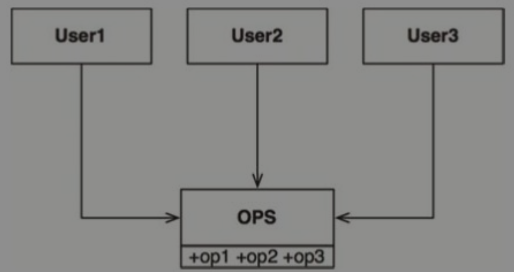
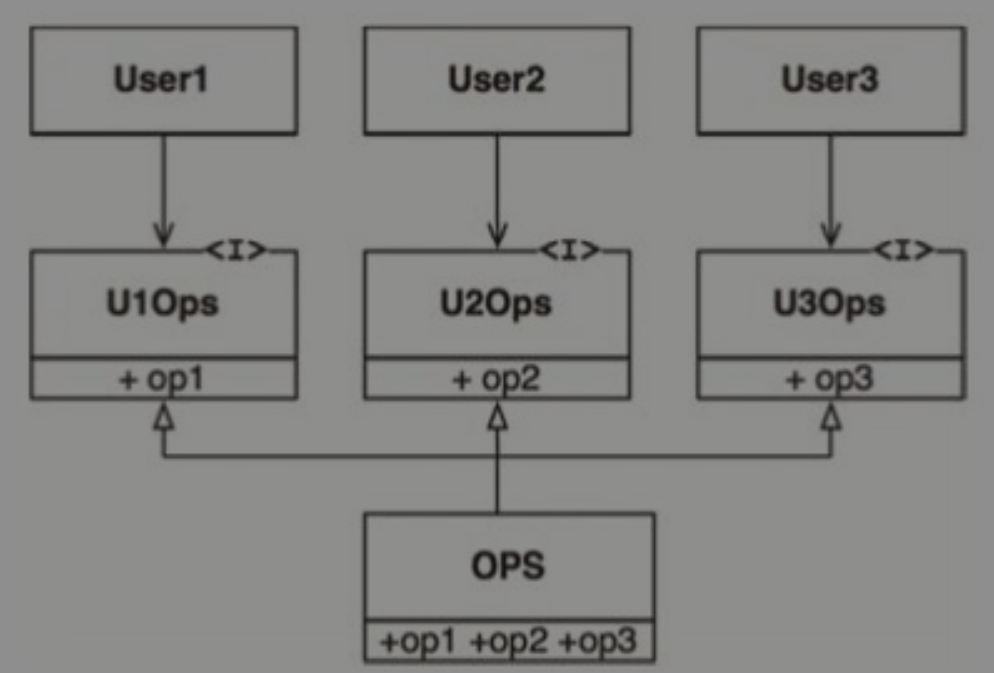
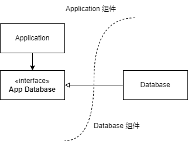
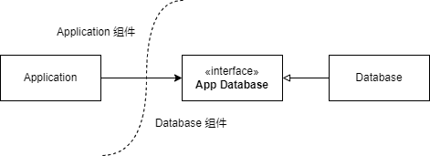

# 设计原则

[TOC]

## 概述

OOA、OOD、OOP 的最基本元素就是对象，以及对象的抽象：类。

这里提到的设计原则，本质上就是对类的设计的原则：SOLID。

提到原则，那么没有目标是不行的，这些原则都是围绕着设计目标服务的：

- 易修改
- 可读性好
- 可复用

原则 | 缩写 | 描述
-|-|-
单一职责原则 | SRP | 基于康威定律的一个推论：一个软件系统的最佳结构依赖于**开发**这个系统的组织的内部结构。这样，每个软件模块都有一且只有一个需要被改变的理由。
开闭原则 | OCP | 如果软件想要被容易改变，那么设计就应该允许新增代码来修改系统行为，**而非只能**修改原来的代码。
里氏替换原则 | LSP | 如果想用可替换的组件来构建软件系统，那么这些组件就必须遵守同一个约定，以便让这些组件可以相互替换。
接口隔离原则 | ISP | 告诫软件设计师应该在设计中避免不必要的依赖。
依赖反转原则 | DIP | 高层策略性的代码不应该依赖实现底层细节的代码，恰恰相反，那些实现底层细节的代码应该依赖高层策略性的代码。

**注意：**

- 我认为上述对 SRP 的描述不够准确，上述对 SRP 的描述局限于开发人员组织内部结构了，但是看下面的 SRP 章节可以知道，这更多是从用户，或者涉众（Actor）的角度来看的。
- 开发人员组织内部结构的人员，只能认为是涉众的一部分。

## 单一职责原则（SRP）

这是一个经常被误会的原则，很多时候会听到：“每个模块都应该只做一件事”。

但是很抱歉，这是错误的。最本质的理解是：

> 任何一个软件模块都应该有且仅有一个被修改的原因。

这里的软件模块一般是指的一个源代码文件，或者一组紧密相关的函数、数据结构、类。

“仅有一个被修改的原因”，也很难理解，那什么才是被修改的原因呢？通常是系统的用户用着不爽了，所以才让修改，因此更白话的说：

> 任何一个软件模块都应该只对一个用户（User）或系统利益相关者（Stakeholder）负责。

只要这些人希望对系统进行的变更是相似的，就可以归为一类：

- 一个或多个有共同需求的人。
- 通常，我们将其称为 *执行者（Actor）* 。
  
因此，SRP 最终变为：

> 任何一个软件模块都应该只对某一类执行者（Actor） 负责。

其本质上，就是对不同类型的用户，用不同的软件模块来实现他们的用例。例如：管理员和普通用户，即便是相同的功能，也要用不同的软件模块来实现，才能被成为 SRP。

**注意：**

- 这里不同类型的用户（执行者），并非是指的不同的角色。例如对于微信支付商户，可以为员工定义很多角色，但是其实都是属于“商户员工”这一类用户。
- 有时候**执行者**和**角色**的概念比较模糊，需要注意的是，角色更多强调的是对权限的管理，是一种技术手段引申而来的，而执行者反应的是领域概念。

## 开闭原则（OCP）

什么是开闭原则？

> 软件实体（类、模块、函数等）应该对扩展开放，但对修改关闭。

**开闭原则**，是个非常抽象的概念，比较难理解，这里到底什么是开放，什么是关闭，为什么要遵循开闭原则？

在《架构整洁之道》中并未给出非常明确的答案，而简化为了：

> 设计良好的计算机软件应该易于扩展，同时抗拒修改。

这里我们参考 [Open–closed principle](https://en.wikipedia.org/wiki/Open%E2%80%93closed_principle)：

- 一个软件模块，能够修改、扩展，我们则称其为*开放*。
- 一个软件模块，被其他模块所依赖，我们称其为*关闭*。

为什么这种*关闭的*、*被依赖的*模块需要去抗拒修改呢？是因为修改和变更对下游模块存在影响，当依赖方过多，则影响很大，甚至风险不可控。

那怎么去修改如此**稳定（很难被修改）**的软件模块呢？通常而言，我们去依赖接口，不依赖具体实现就可以了，需要增加新功能时避免对原有的修改，而是进行继承进行扩展。

## 里氏替换原则（LSP）

LSP 的原生含义：

> 这里需要的是一种可替换性：如果对于每个类型是 S 的对象 o1 都存在一个类型为 T 的对象 o2，能使操作 T 类型的程序 P 在用 o2 替换 o1 时行为保持不变，我们就可以将 S 称为 T 的子类型。

原生的 LSP 含义更多的是一种继承关系的理解，但是在当下面向对象如此普及的今天，单纯的继承关系已经无需更多强调了。

现如今 LSP 发挥了更多在指导接口与其实现方式的设计原则：

> 一旦违背了可替换性，该系统架构就不得不为此增添大量复杂的应对机制。

这里违背可替换原则，实际上就是指的接口前后不兼容。

## 接口隔离原则（ISP）

ISP 的原生含义（参考 [Interface segregation principle](https://en.wikipedia.org/wiki/Interface_segregation_principle)）：

> 不应强制任何代码依赖于它不使用的方法。

原生 ISP 更多是类和接口层面的设计指导，即：

> 避免大而全宽类/接口。

例如，下面这是一种宽类：

在这个场景中，假设：

- User1 只会用到 op1
- User2 只会用到 op2
- User3 只会用到 op3

对接口进行隔离后，对于依赖方更易用，同时隔离掉不需要的依赖（OPS 中的 op2 的变更不会导致 User1 和 User3 的重编）：

在架构层面，ISP 同样有意义，这个原则告诉我们：

> 任何层次的软件设计如果依赖了它并不需要的东西，就会带来意料之外的麻烦。

## 依赖反转原则（DIP）

什么是依赖反转？

> 如果想要设计一个灵活的系统，在源代码层次的依赖关系中就应该多引用抽象类型，而非具体实现。

对于一个软件模块，或者一个类，我们建议提供一个稳定的抽象层，因为：

- 我们每次修改抽象接口的时候，一定也会去修改对应的具体实现。
- 但反过来，当我们修改具体实现时，却很少需要去修改相应的抽象接口。
- 所以我们可以认为接口比实现更稳定。

依赖反转，到底是什么反转？为什么要做反转？

在《架构整洁之道》中指出，依赖反转，是依赖方向和控制流方向进行反转。

在常规设计（不加考虑的设计）中，控制流方向就是依赖方向，例如 Application 组件需要使用 Database 组件，那么 Application 组件就会控制 Database 组件：

我们在 Application 组件中构造一个 Database 接口类，里面提供 Application 对象需要使用的 Database 接口，并在 Database 组件中去实现这个接口：

虽然从代码逻辑流来看，还是从 Application 对象跳转到的 Database 对象，但是依赖上已经反转了，这样 Application 就不用依赖 Database 的具体实现了。

有的人可能会有疑惑，为什么不把 *App Database* 接口放在 Database 组件中，这样其实 Application 对象还是依赖的接口，没有依赖具体实现，例如这样：

大家有这样的困惑是可以理解的，但是：

- 控制流和依赖流是一致的，仍然是 Application 组件依赖 Database 组件，根本不是*依赖反转*。
- 站在 Database 组件的角度，并不知道依赖方到底有谁，需要提供什么接口，那么就会提供一个大而全的接口，这样违反了 ISP。
- *App Database* 接口一定是在 Application 组件内的，反应的是 Application 实现核心逻辑需要的方法，同时 Application 组件里面有着应用的核心领域逻辑，对外部的实现细节依赖完全解耦。
- 组件提供接口是可以的，也是常见的，但是这种叫*信息隐藏*，而不是叫*依赖反转*。
- 当一个稳定的组件（被大量依赖的组件），需要提供扩展性时，那么就需要尽可能的对外提供接口。因为核心领域逻辑应该是稳定的，那么接口也应该大量的被放在 Application 组件中。

这是一个抽象工厂的依赖反转：

