# 《整洁架构之道》笔记

[TOC]

## 概览

本文是对[《整洁架构之道》](https://weread.qq.com/web/bookDetail/480322f072021a3248038c8)一书的学习记录。

### 设计与架构

我们为什么要设计一个好的架构？目标是什么？

> 软件架构的终极目标是，用最小的人力成本来满足构建和维护该系统的需求。

那我们为什么需要减少成本呢？很明显，我们做一个事情的目的其实就是：**赚钱**。

> 利润 = 收入 - 成本

这里收入是因业务发展带来的，成本则是对系统的维护成本，因此我们要尽可能多的获得利润，就需要尽可能多的减少成本。

通常而言，在项目早期，因为业务发展较快，往往会忽略成本（也应该忽略，避免过度设计），但是随着时间的发展，历史债务越积越高，而当收入趋于稳定时就很难 cover 住成本了。

每行变更成本：

我们知道为什么要进行架构设计了，那么“架构”这个词，到底代表什么意思呢？

这是个很有趣的问题，《架构整洁之道》全书都在提架构，甚至自己也问出了 *架构是什么？* 这样的问题，但是从未给过答案。

**架构**一词，在软件工程业界似乎从未达成过一致。

在 [Architectural Styles and the Design of Network-based Software Architectures](https://www.ics.uci.edu/~fielding/pubs/dissertation/top.htm) 一文中提及：

> 尽管软件架构作为一个研究领域吸引了很多人的兴趣，但是对于什么应该被纳入架构的定义，研究者们几乎从未达成过共识。

另外，在《企业应用架构模式》中也提到：

> 很多人试图给“架构”下定义，而这些定义本身很难统一。

对于**架构**，人们的潜在共识只有两点：

1. 较高层面的系统分解或视图
1. 系统中不容易变化的部分

### 两个价值维度

正如前面提到的：`利润 = 收入 - 成本`。

这本质上可以划分成两个不同的价值维度：

价值维度 | 本质 | 到底是什么？| 价值
-|-|-|-
行为价值 | 收入 | 业务需求 | 紧急，但是不一定都重要。
架构价值 | 成本 | 灵活性（易修改、易维护）| 重要，但是不一定都紧急。

看起来一开始就设计一个好的架构是非常重要的，这看起来和当下的 MVP（最简可行产品） 理念冲突，但是本质上并不冲突，因为：

- MVP 就代表了未来有极大的变化可能，留足灵活性，以及足够的考虑，才能应对未来的变化。

就像书中提到的：

> 如果某程序可以正常工作，但是无法修改，那么当需求变更的时候它就不再能够正常工作了，我们也无法通过修改让它能继续正常工作。因此，这个程序的价值将成为 0。

但是其实很多人认为（包括我），并不需要预先就选择非常灵活且完备的架构，而是选择适合当下且应对未来足够长时间（例如一年）的一种架构即可，例如当前数据较小用单库单表就能支撑，但是未来可能会进行分库分表，这就会涉及到**数据架构**的调整。但是：

- 《架构整洁之道》一书这里有做取巧，因为它并没有说架构到底是什么，分库分表到底算架构吗？还是算一种实现？在书中其实可以看出，对数据库、对框架的选型其实没有算在架构里面，而是一种实现细节。
- 这个取巧可以认为有道理，也可以认为没道理，因为没有人能说清楚架构到底是什么，只知道架构是一种比较重要、高层面的东西，但是到底多高层面算高呢？只能由架构设计者来说明了。

## 编程范式

## 设计原则

OOA、OOD、OOP 的最基本元素就是对象，以及对象的抽象：类。

这里提到的设计原则，本质上就是对类的设计的原则：SOLID。

提到原则，那么没有目标是不行的，这些原则都是围绕着设计目标服务的：

- 易修改
- 可读性好
- 可复用

原则 | 缩写 | 描述
-|-|-
单一职责原则 | SRP | 基于康威定律的一个推论：一个软件系统的最佳结构依赖于**开发**这个系统的组织的内部结构。这样，每个软件模块都有一且只有一个需要被改变的理由。
开闭原则 | OCP | 如果软件想要被容易改变，那么设计就应该允许新增代码来修改系统行为，**而非只能**修改原来的代码。
里氏替换原则 | LSP | 如果想用可替换的组件来构建软件系统，那么这些组件就必须遵守同一个约定，以便让这些组件可以相互替换。
接口隔离原则 | ISP | 告诫软件设计师应该在设计中避免不必要的依赖。
依赖反转原则 | DIP | 高层策略性的代码不应该依赖实现底层细节的代码，恰恰相反，那些实现底层细节的代码应该依赖高层策略性的代码。

**注意：**

- 我认为上述对 SRP 的描述不够准确，上述对 SRP 的描述局限于开发人员组织内部结构了，但是看下面的 SRP 章节可以知道，这更多是从用户，或者涉众（Actor）的角度来看的。
- 开发人员组织内部结构的人员，只能认为是涉众的一部分。

### 单一职责原则（SRP）

这是一个经常被误会的原则，很多时候会听到：“每个模块都应该只做一件事”。

但是很抱歉，这是错误的。最本质的理解是：

> 任何一个软件模块都应该有且仅有一个被修改的原因。

这里的软件模块一般是指的一个源代码文件，或者一组紧密相关的函数、数据结构、类。

“仅有一个被修改的原因”，也很难理解，那什么才是被修改的原因呢？通常是系统的用户用着不爽了，所以才让修改，因此更白话的说：

> 任何一个软件模块都应该只对一个用户（User）或系统利益相关者（Stakeholder）负责。

只要这些人希望对系统进行的变更是相似的，就可以归为一类：

- 一个或多个有共同需求的人。
- 通常，我们将其称为 *执行者（Actor）* 。
  
因此，SRP 最终变为：

> 任何一个软件模块都应该只对某一类执行者（Actor） 负责。

其本质上，就是对不同类型的用户，用不同的软件模块来实现他们的用例。例如：管理员和普通用户，即便是相同的功能，也要用不同的软件模块来实现，才能被成为 SRP。

**注意：**

- 这里不同类型的用户（执行者），并非是指的不同的角色。例如对于微信支付商户，可以为员工定义很多角色，但是其实都是属于“商户员工”这一类用户。
- 有时候**执行者**和**角色**的概念比较模糊，需要注意的是，角色更多强调的是对权限的管理，是一种技术手段引申而来的，而执行者反应的是领域概念。

### 开闭原则（OCP）

什么是开闭原则？

> 软件实体（类、模块、函数等）应该对扩展开放，但对修改关闭。

**开闭原则**，是个非常抽象的概念，比较难理解，这里到底什么是开放，什么是关闭，为什么要遵循开闭原则？

在《整洁架构之道》中并未给出非常明确的答案，而简化为了：

> 设计良好的计算机软件应该易于扩展，同时抗拒修改。

这里我们参考 [Open–closed principle](https://en.wikipedia.org/wiki/Open%E2%80%93closed_principle)：

- 一个软件模块，能够修改、扩展，我们则称其为*开放*。
- 一个软件模块，被其他模块所依赖，我们称其为*关闭*。

为什么这种*关闭的*、*被依赖的*模块需要去抗拒修改呢？是因为修改和变更对下游模块存在影响，当依赖方过多，则影响很大，甚至风险不可控。

那怎么去修改如此**稳定（很难被修改）**的软件模块呢？通常而言，我们去依赖接口，不依赖具体实现就可以了，需要增加新功能时避免对原有的修改，而是进行继承进行扩展。

### 里氏替换原则（LSP）

LSP 的原生含义：

> 这里需要的是一种可替换性：如果对于每个类型是 S 的对象 o1 都存在一个类型为 T 的对象 o2，能使操作 T 类型的程序 P 在用 o2 替换 o1 时行为保持不变，我们就可以将 S 称为 T 的子类型。

原生的 LSP 含义更多的是一种继承关系的理解，但是在当下面向对象如此普及的今天，单纯的继承关系已经无需更多强调了。

现如今 LSP 发挥了更多在指导接口与其实现方式的设计原则：

> 一旦违背了可替换性，该系统架构就不得不为此增添大量复杂的应对机制。

这里违背可替换原则，实际上就是指的接口前后不兼容。

### 接口隔离原则（ISP）

ISP 的原生含义（参考 [Interface segregation principle](https://en.wikipedia.org/wiki/Interface_segregation_principle)）：

> 不应强制任何代码依赖于它不使用的方法。

原生 ISP 更多是类和接口层面的设计指导，即：

> 避免大而全宽类/接口。

例如，下面这是一种宽类：

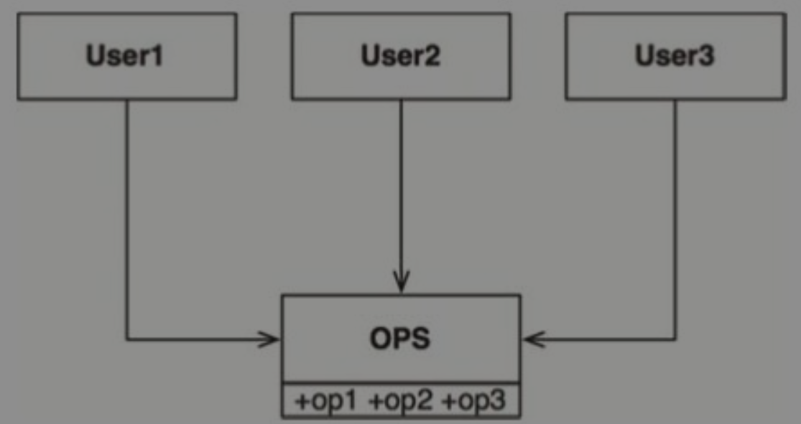

在这个场景中，假设：

- User1 只会用到 op1
- User2 只会用到 op2
- User3 只会用到 op3

对接口进行隔离后，对于依赖方更易用，同时隔离掉不需要的依赖（OPS 中的 op2 的变更不会导致 User1 和 User3 的重编）：

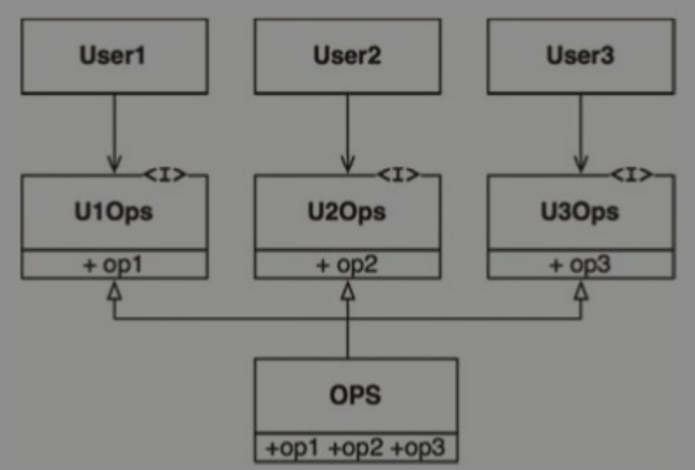

在架构层面，ISP 同样有意义，这个原则告诉我们：

> 任何层次的软件设计如果依赖了它并不需要的东西，就会带来意料之外的麻烦。

### 依赖反转原则（DIP）

什么是依赖反转？

> 如果想要设计一个灵活的系统，在源代码层次的依赖关系中就应该多引用抽象类型，而非具体实现。

对于一个软件模块，或者一个类，我们建议提供一个稳定的抽象层，因为：

- 我们每次修改抽象接口的时候，一定也会去修改对应的具体实现。
- 但反过来，当我们修改具体实现时，却很少需要去修改相应的抽象接口。
- 所以我们可以认为接口比实现更稳定。

依赖反转，到底是什么反转？为什么要做反转？

在《整洁架构之道》中指出，依赖反转，是依赖方向和控制流方向进行反转。

在常规设计（不加考虑的设计）中，控制流方向就是依赖方向，例如 Application 组件需要使用 Database 组件，那么 Application 组件就会控制 Database 组件：

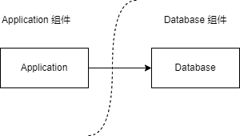

我们在 Application 组件中构造一个 Database 接口类，里面提供 Application 对象需要使用的 Database 接口，并在 Database 组件中去实现这个接口：

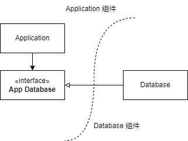

虽然从代码逻辑流来看，还是从 Application 对象跳转到的 Database 对象，但是依赖上已经反转了，这样 Application 就不用依赖 Database 的具体实现了。

有的人可能会有疑惑，为什么不把 *App Database* 接口放在 Database 组件中，这样其实 Application 对象还是依赖的接口，没有依赖具体实现，例如这样：

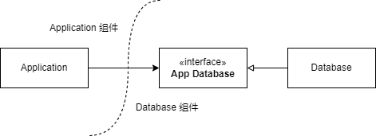

大家有这样的困惑是可以理解的，但是：

- 控制流和依赖流是一致的，仍然是 Application 组件依赖 Database 组件，根本不是*依赖反转*。
- 站在 Database 组件的角度，并不知道依赖方到底有谁，需要提供什么接口，那么就会提供一个大而全的接口，这样违反了 ISP。
- *App Database* 接口一定是在 Application 组件内的，反应的是 Application 实现核心逻辑需要的方法，同时 Application 组件里面有着应用的核心领域逻辑，对外部的实现细节依赖完全解耦。
- 组件提供接口是可以的，也是常见的，但是这种叫*信息隐藏*，而不是叫*依赖反转*。
- 当一个稳定的组件（被大量依赖的组件），需要提供扩展性时，那么就需要尽可能的对外提供接口。因为核心领域逻辑应该是稳定的，那么接口也应该大量的被放在 Application 组件中。

这是一个抽象工厂的依赖反转：

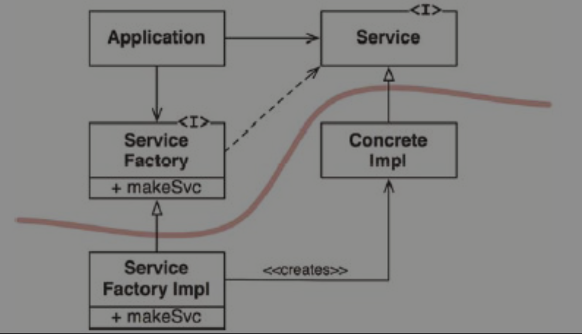

## 组件构建原则

组件是什么？这也是一个和 “架构” 一样，被用烂掉的词，在不同的环境、上下文中，组件的含义是不一样的。

在《整洁架构之道》中提到的组件，指的是：

> 组件是软件的部署单元，是整个软件系统在部署过程中可以独立完成部署的最小实体。

一些例子：

- C/C++ 中，组件就类似于静态库、动态库。
- Java 中，组件就类似于 Jar 包。
- Python 中，组件就类似于 package。

我们可以将多个组件构（链接）建成一个可执行文件。

组件构建主要讨论两部分内容：

- 组件聚合。即哪些类应该被组成一个组件，而哪些不应该。
- 组件耦合。如何将组件和组件拼接起来，构建一个系统。

### 组件聚合（组件构建）

《整洁架构之道》中如此提到组件的聚合：

> 究竟是哪些类应该被组合成一个组件呢？这是一个非常重要的设计决策，应该遵循优秀的软件工程经验来行事。但不幸的是，很多年以来，我们对于这么重要的决策经常是根据当下面临的实际情况临时拍脑门决定的。

#### 复用/发布等同原则（REP）

什么是 REP（Reuse/Release Equivalence Principle）？

> 软件复用的最小粒度应等同于其发布的最小粒度。

这句话看的有点云里雾里的，那么到底是什么意思呢？我理解：一个组件要复用，那么该组件应该是可发布的，遵循发布机制。

那什么是发布机制呢？通常发布机制有这些特征：

1. 组件的发布，需要有版本号进行跟踪。
1. 每个发布的组件，其中的类之间是相互关联且兼容的，不至于某个类依赖当前版本，而另外一个类依赖上一个版本。
1. 有组件文档进行说明和维护。

从软件设计和架构设计的角度来看，REP 原则就是指：

- 组件中的类与模块必须是彼此紧密相关的。
- 也就是说，一个组件不能由一组毫无关联的类和模块组成，它们之间应该有一个共同的主题或者大方向。

违反 REP 的例子：

#### 共同闭包原则（CCP）

什么是 CCP（Common Closure Principle）？

> 我们应该将那些会同时修改，并且为相同目的而修改的类放到同一个组件中，而将不会同时修改，并且不会为了相同目的而修改的那些类放到不同的组件中。

探究 CCP 的本质：

- CCP 希望将一个变更原因，聚合在一个组件中。其他变更原因的类，放在其他组件中。
- CCP 可以避免一个变更原因，导致多个组件的修改。
- 指导思想：
  - **根据变更原因进行聚合**。

很明显，CCP 非常类似于 SRP，即组件应该单一职责，只因为相同的原因而变化。如果组件中有不同原因变化的部分，应该进行分拆。这两条的本质都是：*将由于相同原因而修改，并且需要同时修改的东西放在一起。将由于不同原因而修改，并且不同时修改的东西分开。*。

CCP 的目标是为了**易维护**：

- 对大部分应用程序来说，可维护性的重要性要远远高于可复用性。
- 如果某程序中的代码必须要进行某些变更，那么这些变更最好都体现在同一个组件中，而不是分布于很多个组件中。
- 因为如果这些变更都集中在同一个组件中，我们就只需要重新部署该组件，其他组件则不需要被重新验证、重新部署了。

违反 CCP，那么就意味着两方面的含义：

- 一个组件中存在多个变更原因的类。
- 一个变更原因分散在不同的组件中。

这两者都代表一个组件容易被变更，以及一个变更需要修改多个组件。这会导致一个变更需求来了后，修改多处组件，他们之间的兼容性、发布顺序等需要着重考虑。

#### 共同复用原则（CRP）

什么是 CRP（Common Reuse Principle）？

> 不要强迫一个组件的用户依赖他们不需要的东西。

探究 CRP 的本质：

- CRP 希望组件中的类，都会被复用。
- CRP 会避免组件中某些类容易被复用，某些类不容易被复用。
- 指导思想：
  - **根据复用频率进行拆分**。统计组件中类的复用情况，将基本不怎么用到的类单独用个组件进行隔离，避免他们的发生变化时，影响其他所有的依赖方。
  - **根据复用场景进行拆分**。即便是被高频复用的类，在不同场景下的复用分布也是不一样的。例如 I 类场景只复用 A/B/C 类，而 II 类场景只复用 D/E/F 类，那么也需要拆分成两个组件。

很明显，CRP 非常类似于 ISP（接口隔离原则），CRP 这里就是对组件里面的类做隔离。这两条的本质都是：*不要依赖不需要用到的东西*。

违反 CCP，那么意味着依赖方会有很多压根不用的类，当这些类发送变化时，会导致依赖方的重新编译、测试和发布。即：导致过多的无用发布。

### 组件聚合张力图

非常明显，REP、CCP、CRP 之间是互相制约的，不可能全部同时满足：

- REP 和 CCP 原则是黏合性原则，它们会让组件变得更大。
- 而 CRP 原则是排除性原则，它会尽量让组件变小。

软件架构师的任务就是要在这三个原则中间进行取舍。

**注意：**

- 虽然 CCP 也提到了不同的变更原因需要进行拆分，但是这个是非常模糊的标准。一个变更需求，可能只修改其中某个类，是非常正常的，不可能随便就拆掉。因此并非说 CCP 就没有指导拆分，而是指 CCP 在组织类时，更具指导性。

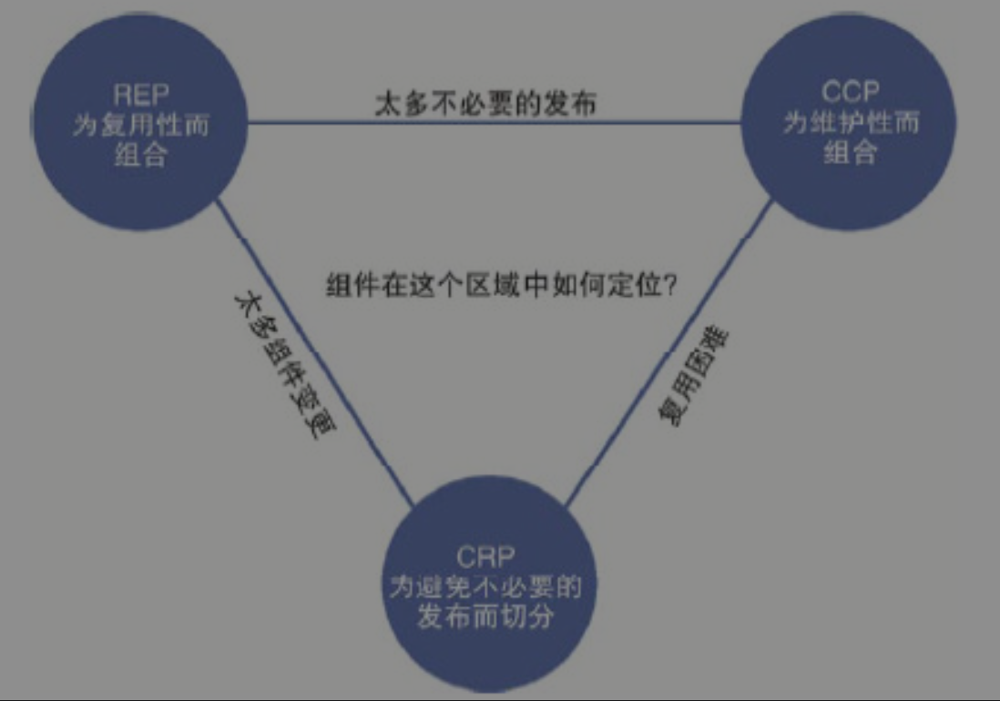

### 组件耦合

我们的软件系统需要将组件进行耦合，如何进行耦合也是十分重要的。这里主要有三个耦合原则：

- 无依赖环原则
- 稳定依赖原则
- 稳定抽象原则

#### 无依赖环原则（ADP）

什么是无依赖环原则？其实顾名思义：

> 组件依赖关系图中不应该出现环。

无依赖环原则脱胎于这样一个背景：**一觉醒来综合征**。

> 当你花了一整天的时间，好不容易搞定了一段代码，第二天上班时却发现这段代码莫名其妙地又不能工作了。这通常是因为有人在你走后修改了你所依赖的某个组件。我给这种情况起了个名字——“一觉醒来综合征”。

业界为了解决 *一觉醒来综合征*，有两种处理方式：

解决方式 | 描述 | 优点 | 缺点 | 适用范围
-|-|-|-
每周构建 | 在每周的前四天中，让所有的程序员在自己的私有库上工作，忽略其他人的修改，也不考虑互相之间的集成问题； 然后在每周五要求所有人将自己所做的变更提交，进行统一构建。 | 简单 | 周五的集成难度大，尤其是对大项目。 减少构建次数，也会对项目交付带来阻塞。 | 中小型项目。
无依赖环原则 | 将项目切分成组件，按组件版本号进行发布。团队自主决定是否立即集成最新版本的组件。| 开发效率高。 | 发布流程复杂，梳理依赖关系。 | 通用方案。

**注意：**

- 这里引入版本号，并非说让所有的组件依赖不同的版本。这里引入版本号，只是为了避免每周五进行集成，而是让每个组件可以自行选择集成时间，这本质上是减少集成难度，均摊集成成本。
- 最终目标，作为一个软件系统，还是需要所有组件都有最新版本的。

即便使用了版本号，但是如果存在循环依赖，仍然有 *一觉醒来综合征*。为什么这么说呢：

例如下图的循环依赖：

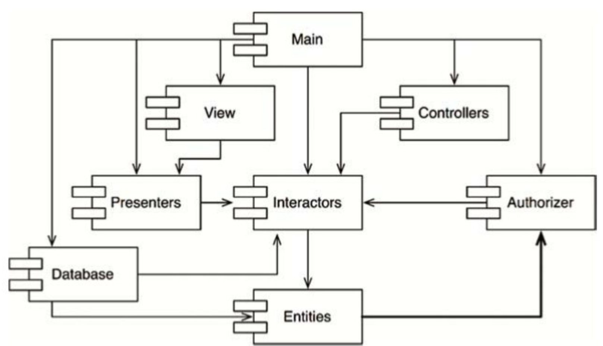

很明显：Interactors -> Entities -> Authorizer -> Interactors 这个依赖形成了环状。

这会带来一下问题：

问题 | 描述
-|-
难集成 | 例如有 Entities 的变更且发布时，那么需要考虑对 Interactors 的影响，可能导致对 Interactors 的变更，而 Interactors 的变更可能引起 Authorizer 的变更，进而又引起对 Entities 的又一次变更，导致各个组件的版本号无节制的螺旋上升。
难发布 | 例如有一个变更，导致 Entities、Authorizer、Interactors 都有修改，我们需要仔细思考哪个组件应该先发布： - 我们不能先发布 Entities，因为它依赖了 Authorizer 的新功能； - 我们也不能先发布 Authorizer，因为它依赖了 Interactors 的新功能； - 我们也不能先发布 Interactors，因为它依赖了 Entities 的新功能。 这样的依赖关系，决定了这三个组件必须同时发布，本质上是将三个组件变成了一个大组件。

一个好的依赖关系，是一个有向无环图（DAG）:

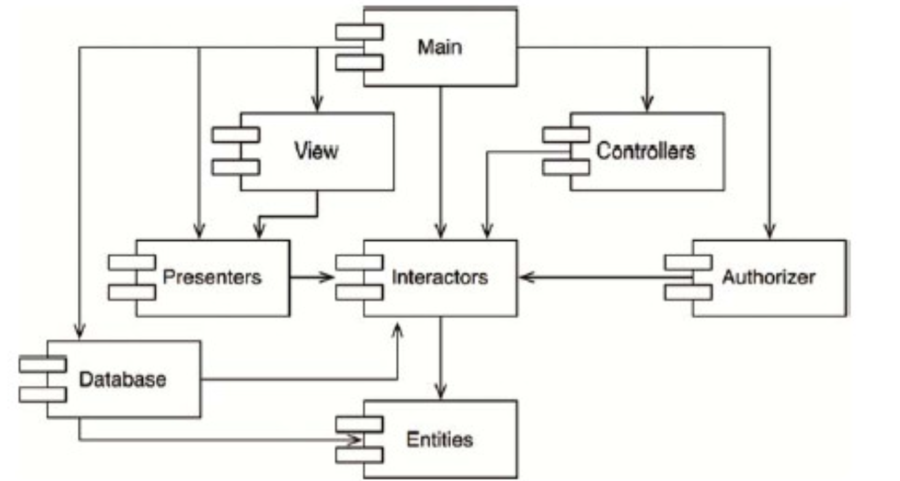

有向无环图的依赖关系：

- 易集成。
- 易发布（容易确定发布顺序）。
- 减少影响（例如：Main 组件的变更，只会影响 Main 组件，也只需要测试 Main 组件）。

总体而言，DAG 的依赖关系，让系统更容易维护。

那我们如何打破循环依赖呢？也很简单，一般用 DIP 就够了，将依赖关系进行反转：

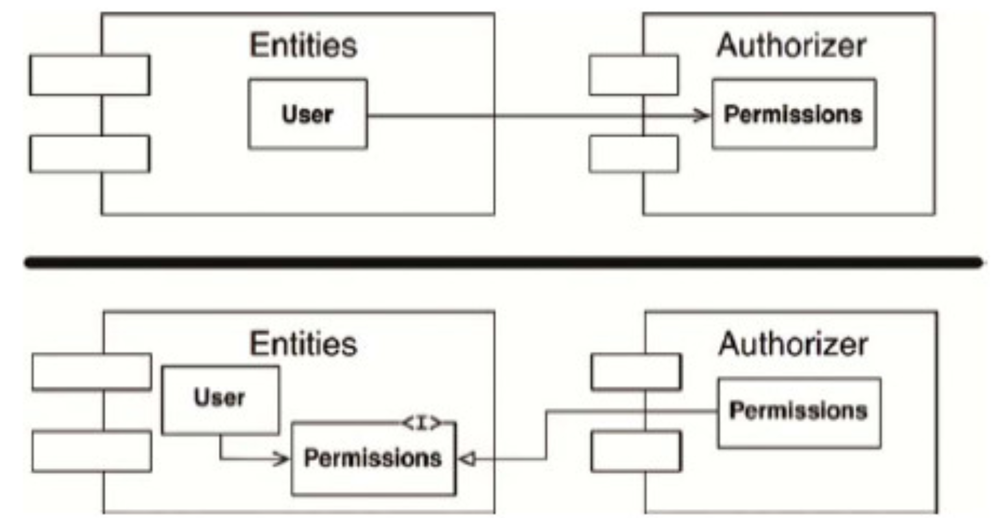

#### 稳定依赖原则（SDP）

什么是稳定依赖原则？

> 依赖关系必须要指向更稳定的方向。

在理解这条原则前，我们需要理解什么是**稳定性**：

> 稳定指的是“很难移动”。所以稳定性应该与变更所需的工作量有关。

《整洁架构之道》中提到，一枚竖起的硬币是稳定的么？大家通常会感觉它不是稳定的。但是没有任何外力，硬币就会一直竖起，那么为什么大家感觉它不稳定呢？正是因为少量的外力，就能让它改变，所以它不稳定。

因此我们认为变更某个组件的成本、工作量、风险等很大时，该组件就很稳定。反之，组件不稳定。因此稳定性和变更原因没有关系，而更多的是变更成本：变更成本小，即便没有原因让它变化，它依然是不稳定的。

如何让一个组件变得稳定呢？很简单：

> 让软件组件难于修改的一个最直接的办法就是让很多其他组件依赖于它。带有许多入向依赖关系的组件是非常稳定的，因为它的任何变更都需要应用到所有依赖它的组件上。

这样，我们就可以更好的理解稳定依赖原则了：

> 任何一个我们预期会经常变更的组件都不应该被一个难于修改的组件所依赖，否则这个多变的组件也将会变得非常难以被修改。

违反这个原则，会是个什么现象呢：

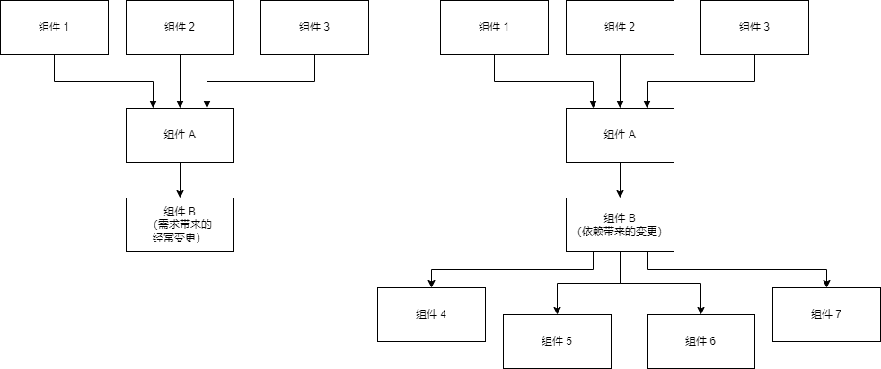

对此因此：

- 组件 B 是容易变更的，这里容易变更有两种可能：
  - 左图，B 本身是需求导致它容易变更，但是 B 本身是高度稳定的。
  - 有图，B 本身是依赖导致它容易变更，因此 B 本身不算稳定的。
- 无论是哪种，组件 B 都容易变更，这可能可能导致给组件 A 带来了风险，而组件 A 的风险会传递给更多的组件。

这就是违反了稳定依赖原则所导致的问题：

- 不稳定的组件的变更，可能会让稳定的组件出现风险，扩散给更多的组件。

《整洁架构之道》中，定义了稳定性公式：

- Fan-in：入向依赖，这个指标指代了组件外部类依赖于组件内部类的数量。
- Fan-out：出向依赖，这个指标指代了组件内部类依赖于组件外部类的数量。
- I：不稳定性，I=Fan-out/(Fan-in+Fan-out)。
  - 该指标的范围是 [0,1]。
  - I=0 意味着组件是最稳定的，I=1 意味着组件是最不稳定的。

#### 稳定抽象原则

## 附录：参考文献

1. [整洁架构之道](https://weread.qq.com/web/bookDetail/480322f072021a3248038c8)
1. [Architectural Styles and the Design of Network-based Software Architectures](https://www.ics.uci.edu/~fielding/pubs/dissertation/top.htm)
1. [Open–closed principle](https://en.wikipedia.org/wiki/Open%E2%80%93closed_principle)
1. [Interface segregation principle](https://en.wikipedia.org/wiki/Interface_segregation_principle)
1. [The Reuse/Release Equivalence Principle (REP)](https://stackoverflow.com/questions/63142/the-reuse-release-equivalence-principle-rep)
