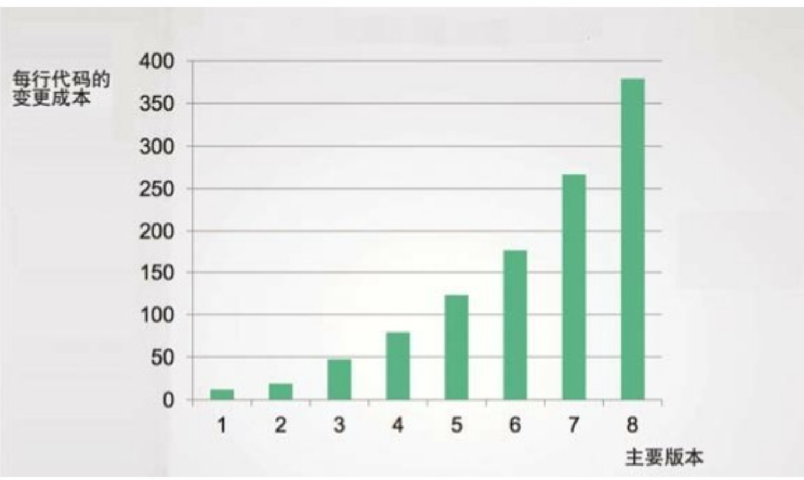
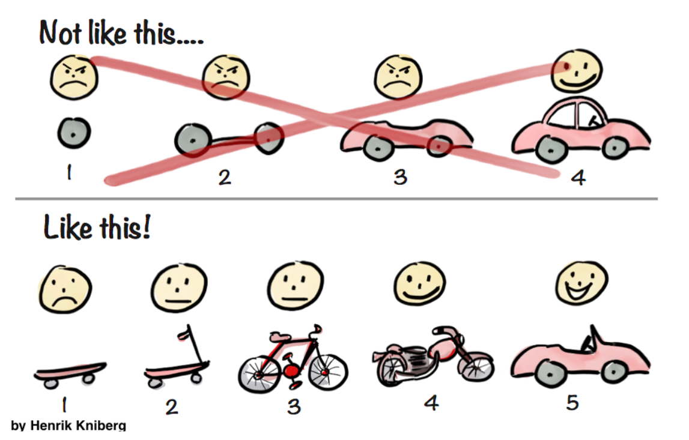

# 《整洁架构之道》笔记

[TOC]

## 概览

本文是对[《整洁架构之道》](https://weread.qq.com/web/bookDetail/480322f072021a3248038c8)一书的学习记录。

### 设计与架构

我们为什么要设计一个好的架构？目标是什么？

> 软件架构的终极目标是，用最小的人力成本来满足构建和维护该系统的需求。

那我们为什么需要减少成本呢？很明显，我们做一个事情的目的其实就是：**赚钱**。

> 利润 = 收入 - 成本

这里收入是因业务发展带来的，成本则是对系统的维护成本，因此我们要尽可能多的获得利润，就需要尽可能多的减少成本。

通常而言，在项目早期，因为业务发展较快，往往会忽略成本（也应该忽略，避免过度设计），但是随着时间的发展，历史债务越积越高，而当收入趋于稳定时就很难 cover 住成本了。

每行变更成本：

我们知道为什么要进行架构设计了，那么“架构”这个词，到底代表什么意思呢？

这是个很有趣的问题，《架构整洁之道》全书都在提架构，甚至自己也问出了*架构是什么？*这样的问题，但是从未给过答案。

**架构**一词，在软件工程业界似乎从未达成过一致。

在 [Architectural Styles and the Design of Network-based Software Architectures](https://www.ics.uci.edu/~fielding/pubs/dissertation/top.htm) 一文中提及：

> 尽管软件架构作为一个研究领域吸引了很多人的兴趣，但是对于什么应该被纳入架构的定义，研究者们几乎从未达成过共识。

另外，在《企业应用架构模式》中也提到：

> 很多人试图给“架构”下定义，而这些定义本身很难统一。

对于**架构**，人们的潜在共识只有两点：

1. 较高层面的系统分解或视图
1. 系统中不容易变化的部分

### 两个价值维度

正如前面提到的：`利润 = 收入 - 成本`。

这本质上可以划分成两个不同的价值维度：

价值维度 | 本质 | 到底是什么？| 价值
-|-|-|-
行为价值 | 收入 | 业务需求 | 紧急，但是不一定都重要。
架构价值 | 成本 | 灵活性（易修改、易维护）| 重要，但是不一定都紧急。

看起来一开始就设计一个好的架构是非常重要的，这看起来和当下的 MVP（最简可行产品） 理念冲突，但是本质上并不冲突，因为：

- MVP 就代表了未来有极大的变化可能，留足灵活性，以及足够的考虑，才能应对未来的变化。

就像书中提到的：

> 如果某程序可以正常工作，但是无法修改，那么当需求变更的时候它就不再能够正常工作了，我们也无法通过修改让它能继续正常工作。因此，这个程序的价值将成为 0。

但是其实很多人认为（包括我），并不需要预先就选择非常灵活且完备的架构，而是选择适合当下且应对未来足够长时间（例如一年）的一种架构即可，例如当前数据较小用单库单表就能支撑，但是未来可能会进行分库分表，这就会涉及到**数据架构**的调整。但是：

- 《架构整洁之道》一书这里有做取巧，因为它并没有说架构到底是什么，分库分表到底算架构吗？还是算一种实现？在书中其实可以看出，对数据库、对框架的选型其实没有算在架构里面，而是一种实现细节。
- 这个取巧可以认为有道理，也可以认为没道理，因为没有人能说清楚架构到底是什么，只知道架构是一种比较重要、高层面的东西，但是到底多高层面算高呢？只能由架构设计者来说明了。

## 编程范式

## 设计原则

OOA、OOD、OOP 的最基本元素就是对象，以及对象的抽象：类。

这里提到的设计原则，本质上就是对类的设计的原则：SOLID。

提到原则，那么没有目标是不行的，这些原则都是围绕着设计目标服务的：

- 易修改
- 可读性好
- 可复用

原则 | 缩写 | 描述
-|-|-
单一职责原则 | SRP | 基于康威定律的一个推论：一个软件系统的最佳结构依赖于**开发**这个系统的组织的内部结构。这样，每个软件模块都有一且只有一个需要被改变的理由。
开闭原则 | OCP | 如果软件想要被容易改变，那么设计就应该允许新增代码来修改系统行为，**而非只能**修改原来的代码。
里氏替换原则 | LSP | 果想用可替换的组件来构建软件系统，那么这些组件就必须遵守同一个约定，以便让这些组件可以相互替换。
接口隔离原则 | ISP | 告诫软件设计师应该在设计中避免不必要的依赖。
依赖反转原则 | DIP | 高层策略性的代码不应该依赖实现底层细节的代码，恰恰相反，那些实现底层细节的代码应该依赖高层策略性的代码。

**注意：**

- 我认为上述对 SRP 的描述不够准确，上述对 SRP 的描述局限于开发人员组织内部结构了，但是看下面的 SRP 章节可以知道，这更多是从用户，或者涉众（Actor）的角度来看的。
- 开发人员组织内部结构的人员，只能认为是涉众的一部分。

### 单一职责原则（SRP）

这是一个经常被误会的原则，很多时候会听到：“每个模块都应该只做一件事”。

但是很抱歉，这是错误的。最本质的理解是：

> 任何一个软件模块都应该有且仅有一个被修改的原因。

这里的软件模块一般是指的一个源代码文件，或者一组紧密相关的函数、数据结构、类。

“仅有一个被修改的原因”，也很难理解，那什么才是被修改的原因呢？通常是系统的用户用着不爽了，所以才让修改，因此更白话的说：

> 任何一个软件模块都应该只对一个用户（User）或系统利益相关者（Stakeholder）负责。

只要这些人希望对系统进行的变更是相似的，就可以归为一类：

- 一个或多个有共同需求的人。
- 通常，我们将其称为 *执行者（Actor）* 。
  
因此，SRP 最终变为：

> 任何一个软件模块都应该只对某一类执行者（Actor） 负责。

其本质上，就是对不同类型的用户，用不同的软件模块来实现他们的用例。例如：管理员和普通用户，即便是相同的功能，也要用不同的软件模块来实现，才能被成为 SRP。

**注意：**

- 这里不同类型的用户（执行者），并非是指的不同的角色。例如对于微信支付商户，可以为员工定义很多角色，但是其实都是属于“商户员工”这一类用户。
- 有时候**执行者**和**角色**的概念比较模糊，需要注意的是，角色更多强调的是对权限的管理，是一种技术手段引申而来的，而执行者反应的是领域概念。
