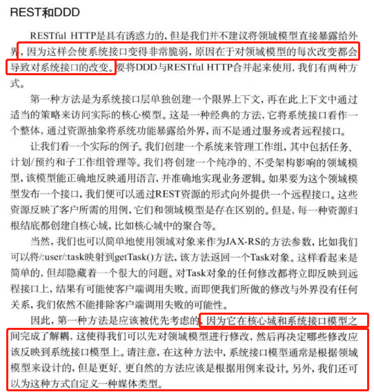
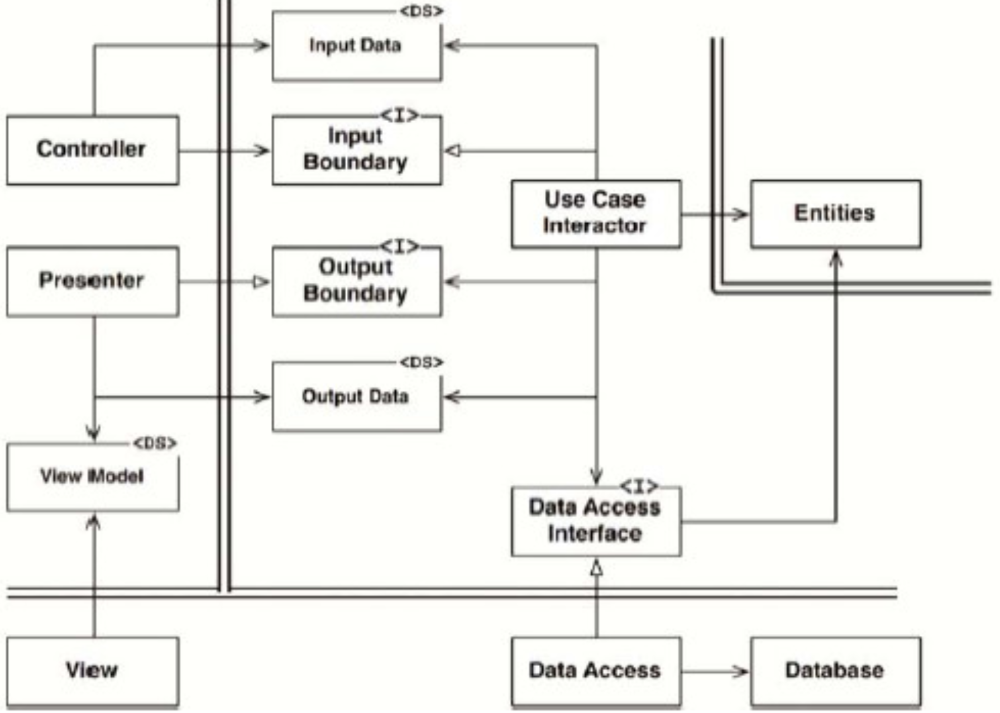

## 软件架构

[TCO]

## 概述

正如前面所提到的，“架构” 一次的共识之一就是在讨论某些重要的事情。在《架构整洁之道》中也提到：

> “架构”这个词给人的直观感受就充满了权力与神秘感，因此谈论架构总让人有一种正在进行责任重大的决策或者深度技术分析的感觉。

要看什么是软件架构，其实需要看架构设计者的目的，不同的目的架构的含义是不一样的。《架构整洁之道》目的是：

- 可扩展性
- 可维护性

至于性能怎么样、可用性怎么样、安全性怎么样、一致性怎么样，不是《架构整洁之道》的考虑范畴，因此这里的“架构”自然不会包括数据架构、网络架构、安全架构等等。

## 什么是软件架构？

那到底什么是软件架构呢？具体工作是什么呢？什么时候进行软件架构设计呢？

这些问题，《架构整洁之道》完全没有回答第一个问题。

## 独立性

为什么我们需要设计和保持各个系统中的独立性？那我们又该如何落地呢？

这可以给我们带来以下好处：

- 将彼此的影响分开
- 将变更集中在某处
- 更好的分工，加快开发效率
- 更好的部署和运行

### 按层解耦

架构师可以通过采用单一职责原则(SRP)和共同闭包原则(CCP)，以及既定的系统设计意图来隔离那些变更原因不同的部分，集成变更原因相同的部分。

一个软件系统，不考虑其他任何用例实现，根据变更原因，就可以划分出非常明显的层次结构：

- 用户界面，变更原因肯定和业务逻辑是不相关的。
- 应用程序，变更原因和业务逻辑紧密相连。
- 领域程序，变更原因是不常变化的领域逻辑。
- 数据库，以及其所采用的查询语言，甚至表结构，这些都是系统的技术细节信息，它们与业务规则或 UI 毫无关系。

这是一个粗略的分成形式：

- UI 界面
- 应用独有的业务逻辑
- 领域普适的业务逻辑
- 基础设施

在后面的 “整洁架构” 中，会给出更加完善的架构分层。

### 按用例解耦

我们从整体通用软件结构的角度根据变更原因进行分层了，这是不够的，我们还需要考虑业务本身的变更原因。

业务本身是什么？就是**用例**！

为什么我们要根据用例来进行拆分呢？

- 用例是天然的功能隔离，也是天然的变更原因的隔离。
- 用例的变更速率不同。
- 用例的重要程度不同。

因此，用例其实是在水平分层的基础上进行了垂直解耦：

> 每个用例都会用到一些UI、特定应用的业务逻辑、应用无关的业务逻辑以及数据库功能。因此，我们在将系统水平切分成多个分层的同时，也在按用例将其切分成多个垂直切片。

通过这样的形式，用例之间完全可以互不影响，各自根据业务场景进行变更。

**注意：**

- 完全垂直的分层，会导致组件及其多，完全无法复用。
- 我们希望上层易变，底层少变，因此最终可能会是这样：

### 重复

> 架构师们经常会钻进一个牛角尖——害怕重复。

在软件领域，经常提到“消除冗余”，或者“消除重复”：

- 类似的显示应该用相同的方式来实现，方便复用
- 类似的代码应该合并起来，方便复用
- ...

大家讨厌重复造轮子。但是：

> 重复也存在着很多种情况。其中有些是真正的重复，在这种情况下，每个实例上发生的每项变更都必须同时应用到其所有的副本上。

如果有两段看起来重复的代码，它们走的是不同的演进路径，也就是说它们有着不同的变更速率和变更缘由，那么这两段代码就不是真正的重复。等我们几年后再回过头来看，可能就会发现这两段代码是非常不一样的了。正是由于这样的原因，我们必须加倍小心地避免让这两个用例复用同一段代码，否则，未来再想将它们分开会面临很大的挑战。

### 解耦的模式

解耦的模式是指的什么？

> 如何将软件系统的各个部分分解开来，以及如何连接它们。

通常而言，我们有这些解耦方式：

解耦方式 | 描述 | 示例
-|-|-
源码层次 | 控制源代码模块之间的依赖关系，以此来实现一个模块的变更不会导致其他模块也需要变更或重新编译。 | 静态库
部署层次 | 控制部署单元之间的依赖关系，以此来实现一个模块的变更不会导致其他模块的重新构建和部署。| 动态库
服务层次 | 将组件间的依赖关系降低到数据结构级别，然后仅通过网络数据包来进行通信。 | RPC、微服务

没有哪种解耦方式是最好的，而只有根据业务场景和发展现状来决定使用解耦方式：

> 一个设计良好的架构在上述过程中还应该能保护系统的大部分源码不受变更影响。对整个系统来说，解耦模式也应该是一个可选项。我们在进行大型部署时可以采用一种模式，而在进行小型部署时则可以采用另一种模式。

## 业务逻辑

什么是业务逻辑？业务逻辑非常重要，但是常常被程序员轻视，甚至自嘲 “我不过是写业务逻辑而已”：

> 严格地讲，业务逻辑就是程序中那些真正用于赚钱或省钱的业务逻辑与过程。更严格地讲，无论这些业务逻辑是在计算机上实现的，还是人工执行的，它们在省钱/赚钱上的作用都是一样的。

业务逻辑中，最重要的我们称其为 “关键业务逻辑”，关键业务逻辑使用的数据我们称为“关键业务数据”，对于这些关键业务逻辑和数据，它们和计算机系统无关（并不是因为有了计算机后才能用这个来赚钱，人来做也是可以赚钱的）。

### 业务实体

关键业务逻辑和关键业务数据是紧密相关的，所以它们很适合被放在同一个对象中处理。我们将这种对象称为“业务实体(Entity)”。

业务实体，就是在将软件中具体实现了该关键业务的部分聚合在一起，将其与自动化系统中我们所构建的其他部分隔离区分。

- 这个类独自代表了整个业务逻辑，它与数据库、用户界面、第三方框架等内容无关。
- 该类可以在任何一个系统中提供与其业务逻辑相关的服务，它不会去管这个系统是如何呈现给用户的，数据是如何存储的，或者是以何种方式运行的。

在当下，“业务实体”被“领域实体”所代替，表征业务领域的核心逻辑。

### 用例

并不是所有的业务逻辑都是一个纯粹的业务实体，例如**用例**：

> 用例本质上就是关于如何操作一个自动化系统的描述，它定义了用户需要提供的输入数据、用户应该得到的输出信息以及产生输出所应该采取的处理步骤。

用例所描述的是**某种特定应用情景下**的业务逻辑，它并非业务实体中所包含的关键业务逻辑。

这是一个业务用例的示例：

**注意：**

- 用例除非正式地描述了数据流入/流出接口以外，并不详细描述用户界面。
- 用例并不描述系统与用户之间的接口，它只描述该应用在某些特定情景下的业务逻辑，这些业务逻辑所规范的是用户与业务实体之间的交互方式，它与数据流入/流出系统的方式无关。
- 其实用例对象就是使用业务实体串流程的，本质上和《软件方法》中提到的 Controller 实体类似。

业务实体本身也不知道是哪个用例在使用它们，因为业务实体不依赖用例，但是用例依赖业务实体。所以：

- 业务实体属于高层概念，而用例属于低层概念。

### 请求和响应

用例类的请求和响应：

- 接收的输入应该是一个简单的**请求性数据结构**。
- 返回输出的应该是一个简单的**响应性数据结构**。

这在现在业界主要做法就是用 Protobuf。

**需要注意的是**，业务实体中也包含了关键性数据，有些开发者可能会直接使用业务实体作为请求/响应的数据结构。

毕竟，业务实体与请求/响应模型之间有很多相同的数据，但是，请一定不要这么做：

- 这两个对象存在的意义是非常、非常不一样的。随着时间的推移，这两个对象会以不同的原因、不同的速率发生变更。
- 将它们以任何方式整合在一起都是对共同闭包原则(CCP)和单一职责原则(SRP)的违反。
- 这样做的后果，往往会导致代码中出现很多分支判断语句和中间数据。

这一个比较明显的例子是 Restful 资源和领域实体（本质上就是业务实体）应该隔离：

## 尖叫的软件架构

一个软件系统的架构应该可以反映出来这个系统是一个做什么事情的系统（尖叫一般的说出自己为什么服务）。

在建筑行业找一些例子，例如：

- 如果这是一幅单户住宅的建筑架构图，那么我们可能会先看到一个大门，然后是一条连接到起居室的通道，同时可能还会看到一个餐厅。当我们阅读这个架构图时，应该不会怀疑这是一个单户住宅。几乎整个设计都在尖叫着告诉你：这是一个“家”。
- 如果这是一幅图书馆的建筑设计图，那么我们可能会先看到一个超大入口，然后是一个用于签到/签出的办公区，接下来是阅读区、小型会议室，以及一排排的书架区。几乎整个设计都在尖叫着跟你说：这是一个“图书馆”。

当软件系统架构，如何喊出来呢？我们查看它的顶层架构时，它们究竟是在喊“健康管理系统”、“账务系统”、“库存管理系统”，还是在喊：“Rails”、“Spring/Hibernate”、“ASP”这样的技术名词呢？

### 架构设计的主题

《Object Oriented Software Engineering》 一书中提到：

> 软件的系统架构应该为该系统的用例提供支持。这就像住宅和图书馆的建筑计划满篇都在非常明显地凸显这些建筑的用例一样，软件系统的架构设计图也应该非常明确地凸显该应用程序会有哪些用例。

因此，架构应该体现出对用例的支持，这样才能让架构尖叫的说自己是什么系统：

- 架构设计不是与框架相关的，这件事不应该是基于框架来完成的。对于我们来说，**框架只是一个可用的工具和手段，而不是一个架构所规范的内容**。
- 如果我们的架构是基于框架来设计的，它就不能基于我们的用例来设计了。

### 架构设计的核心目标

和建筑设计类似，首要目标应该是满足住宅的使用需求，而不是确保一定要用砖来构建这个房子。

> 一个良好的架构设计应该围绕着用例来展开，这样的架构设计可以在脱离框架、工具以及使用环境的情况下完整地描述用例。

良好的架构设计应该尽可能地允许用户推迟和延后决定采用什么框架、数据库、Web 服务以及其他与环境相关的工具。框架应该是一个可选项，良好的架构设计应该允许用户在项目后期再决定是否采用 Rails、Spring、Hibernate、Tomcat、MySQL 这些工具。

### 框架是工具而不是生活信条

《整洁架构之道》有个非常有意思的观点：

> 框架作者往往对自己写出的框架有着极深的信念，他们所写出来的使用手册一般都是从如何成为该框架的虔诚信徒的角度来描绘如何使用这个框架的。甚至这些框架的使用者所写的教程也会出现这种传教士模式。他们会告诉你某个框架是能包揽一切、超越一切、解决一切问题的存在。

但是作者始终在提醒读者：**这不应该成为你的观点**。

我们一定要带着怀疑的态度审视每一个框架。是的，采用框架可能会很有帮助，但采用它们的成本呢？我们一定要懂得权衡如何使用一个框架，如何保护自己。无论如何，我们需要仔细考虑如何能保持对系统用例的关注，避免让框架主导我们的架构设计。

### 可测试的架构设计

如果系统架构的所有设计都是围绕着用例来展开的，并且在使用框架的问题上保持谨慎的态度，那么我们就应该可以在不依赖任何框架的情况下针对这些用例进行单元测试。

## 整洁架构

我们设计架构时，应遵循以下的考虑：

- 独立于框架：这些系统的架构并不依赖某个功能丰富的框架之中的某个函数。框架可以被当成工具来使用，但不需要让系统来适应框架。
- 可被测试：这些系统的业务逻辑可以脱离UI、数据库、Web服务以及其他的外部元素来进行测试。
- 独立于 UI：这些系统的UI变更起来很容易，不需要修改其他的系统部分。例如，我们可以在不修改业务逻辑的前提下将一个系统的UI由Web界面替换成命令行界面。
- 独立于数据库：我们可以轻易将这些系统使用的 Oracle、SQL Server 替换成 Mongo、BigTable、CouchDB 之类的数据库。因为业务逻辑与数据库之间已经完成了解耦。
- 独立于任何外部机构：这些系统的业务逻辑并不需要知道任何其他外部接口的存在。

综上，我们得到一个整洁架构理念：

非常明显，这里分为了四层：

- 系统级业务逻辑（关键业务逻辑、领域实体）
- 应用级业务逻辑（用例）
- 接口适配器
- 框架与驱动程序

### 依赖关系规则

心圆分别代表了软件系统中的不同层次，通常越靠近中心，其所在的软件层次就越高。基本上：

- 外层圆代表的是机制
- 内层圆代表的是策略

> 源码中的依赖关系必须只指向同心圆的内层，即由低层机制指向高层策略。

### 整洁架构分层

分层 | 本质 | 描述 | 变更
-|-|-|-
系统级业务逻辑 | 业务实体 | 封装了该应用中最通用、最高层的业务逻辑。不包括非功能性需求（例如导航方式、安全问题的修改不应该涉及这些对象） | 核心逻辑，基本不变。
应用级业务逻辑 | 用例 | 满足特定应用场景下的业务逻辑，获得输入并通过对业务实体的组织得到相应的输出。| 变更不影响业务实体，同时也不希望用例受外部因素影响。
接口适配器 | - | 将数据从对用例和业务实体而言最方便操作的格式，转化成外部系统（譬如数据库以及Web）最方便操作的格式。| 这个已经较为细节了，放在较外层。
框架与驱动程序 | - | 编写一些与内层沟通的黏合性代码 | 将这些细节放在最外层，这样它们就很难影响到其他层了。

### 跨越边界

在整洁架构的右下侧有一个架构中跨越边界的例子：

这里存在两个方向：

- 控制流方向：它从控制器开始，穿过用例，最后执行展示器的代码。
- 源码依赖方向：向内指向用例。

本质上可以这么理解：

- **用例的输入**，提供用例交互的接口
- **用例交互**，实现用例的输入，并对接口进行实现，同时使用**用例的输出**，将数据返回出去。
- **用例的输出**，提供了用例交互的输出数据。
- 展示器，继承了用例的输出，对数据进行展示。
- 控制器，使用用例的输入提供的接口，将数据交给用例交互进行处理。

需要注意，跨越边界的数据应该是简单的，不要投机取巧地直接传递业务实体或数据库记录对象。同时，这些传递的数据结构中也不应该存在违反依赖规则的依赖关系。

这是一个常见的场景：

