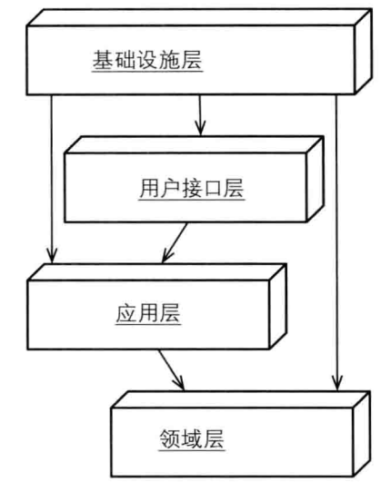
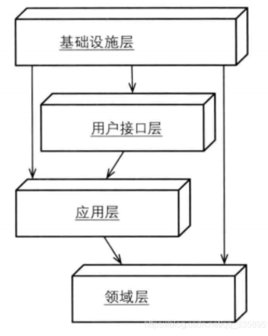
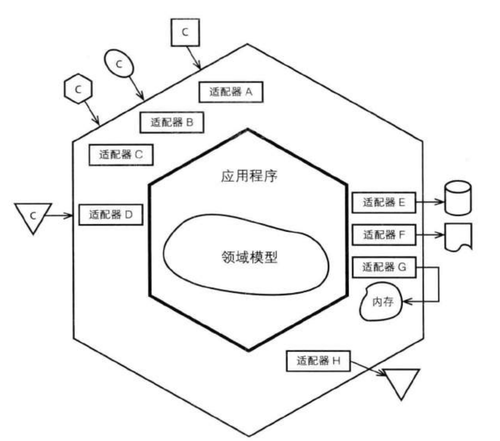
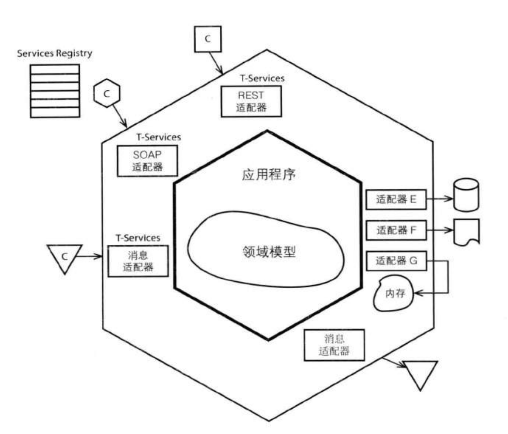
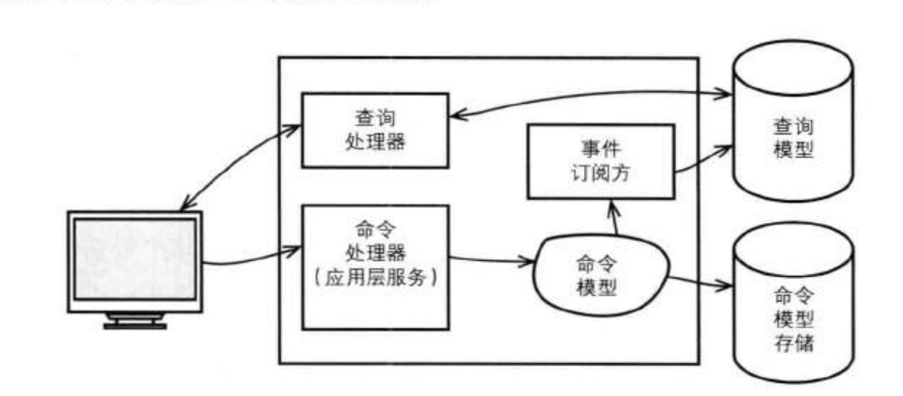
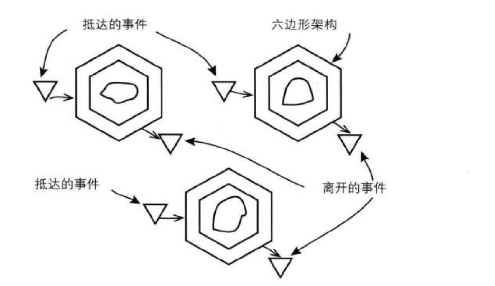
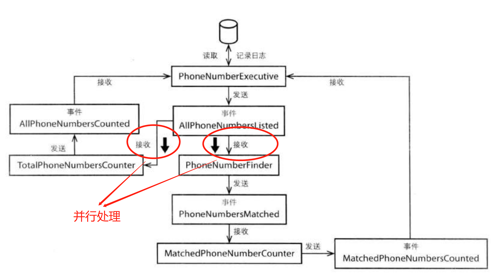
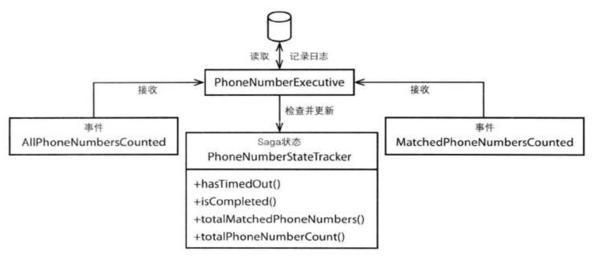
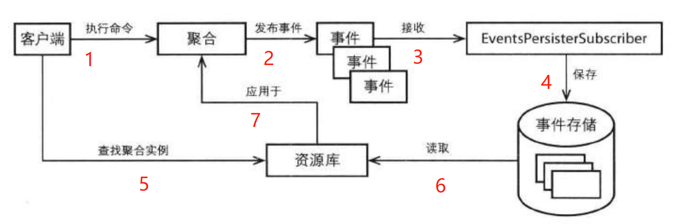

# 架构

[TOC]

## 概览

架构中经常会听到两个名词：

- 架构风格，用于阐述如何实现某种架构。
- 架构模式，关注架构中的某个方面。

一般而言不必过于计较这两者的区别，需要明白的是，DDD 可以使用多种架构。

## 分层

分层架构模式基本上是所有架构的始祖。分层架构的原则：每层只能与位于其下方的层发生耦合。

基于分层架构的原则，也分为两种分层架构：

- 严格的分层架构：某层只能与直接下方的层发生耦合。
- 松散的分层架构：某层能与任意下方的层发生耦合。

下图显示的是一种松散的分层架构：



分层 | 中文| 描述
-|-|-
User Interface | 用户界面层（用户接口层） | 根据请求放的不同，用户界面层的处理方式是不同的：<br>1）对于人类用户，该层处理用户显示所需要的数据和用户请求；<br>2）对于外部系统，采用开放主机服务的方式对外提供 API。<br>用户界面层是应用层的直接客户。
Application Layer | 应用层 | 协调领域对象，通过驱动领域对象来完成用例。在很多地方也称呼此为流程服务。应用服务应该足够轻量，如果应用服务的逻辑非常复杂，则意味着大量的业务逻辑泄露到了应用服务。<br>需要新聚合时，应用服务会使用工厂实例化对象，并通过资源库进行持久化。<br>应用服务可以使用领域服务完成相关任务操作。
Domain Layer | 领域层 | 领域对象，领域服务，仓储位于该层。
Infrastructure Layer | 基础设施层 | 实现 UI、持久化机制等基础设施。

一个应用层的示例：

```java
// 翻译
// tenant: 租户
// backlog: 代办项
// sprint: 冲刺

// 向一个冲刺中提交一个代办项
@Transactional
public void commitBacklogItemToSprint(String aTenantId, String aBacklogItemId, String aSprintId) {
  // 租户 ID
  TenantId tenantId = new TenantId(aTenantId);

  // 获取代办项
  BacklogItem backlogItem = backlogItemRepository.backlogItemOfId(tenantId, new BacklogItemId(aBacklogItemId));

  // 获取冲刺
  Sprint sprint = sprintRepository.sprintOfId(tenantId, new SprintId(aSprintId));

  backlogItem.commitTo(Sprint);
}
```

## 依赖倒置原则

传统分层模式存在缺陷，领域层依赖的基础设施层，这会导致领域层逻辑难以测试，同时基础设施也难以替换。

有一种方式可以改进分层架构：`依赖倒置原则`。

> 高层模块不应该依赖于底层模块，两者都应该依赖于抽象。抽象不应该依赖于细节，细节应该依赖于抽象。

使用依赖倒置后的分层架构如下所示：



如此，我们可以在领域层定义资源库接口，然后再基础设施层实现该接口。下面代码是在基础设施层实现领域层的接口：

```java
// 翻译
// agilepm: 敏捷管理

package com.saasovation.agilepm.infrastructure.persistence;

import com.saasovation.agilepm.domain.model.product.*;

public class HibernateBacklogItemRepository implements BacklogItemRepository {

  // 显示一个冲刺中的所有代办项
  @Override
  @SuppressWarnings("unchecked")
  public Collection<BacklogItem> allBacklogItemComittedTo(Tenant aTenant, SprintId aSprintId) {
    Query query = this.session().createQuery(...);

    query.setParameter(0, aTenant);
    query.setParameter(1, aSprintId);

    return query.list();
  }
}
```

## 六边形架构（端口与适配器）

六边形架构是依赖倒置后的分层架构进行对称化后的结果。如下图所示：



**注意：**

- 适配器用于将客户输入转换为程序内部 API 所能理解的输入。
- 六边形的每条边代表不同类型的端口，端口要么处理输入，要么处理输出。（不同类型指的是适配器采用不同的协议，如 HTTP、AMQP 等）。

端口是一个较为灵活的概念，无论采用哪种方式划分端口，当客户请求到达时，都应该有相应的适配器对输入进行转换，然后端口将调用应用程序的某个操作向应用程序发送一个事件，控制权由此交给内部。

应用程序边界，即内部六边形，也是用例边界。应用程序依赖领域模型来实现这些用例。

下面示例代码表示请求到达 HTTP 的输入端口时，相应的适配器将请求处理委派给应用服务（适配器类似于分层结构中的用户界面层）。

```java
@Path("/tenants/{tenantId}/products")
public class ProductResource extends Resource {
  // 应用服务
  private ProductService productService;

  @Get
  @Path("{productId}")
  @Produces({ "application/vnd.saasovation.projectovation+xml" })
  public Product getProduct(@PathParam("tenantId") String aTentId
                            @PathParam("productId") String aProductId,
                            @Context Request aRequest) {
    Product product = productService.product(aTentId, aProductId);

    if (product == null) {
      throw new WebApplicationException(Response.Status.NOT_FOUND);
    }

    return product;
  }
}
```

对于基础设施，我们也通过适配器连接。例如资源库的实现，其实就是实现持久化适配器。

如果应用程序向外界发送领域事件消息，我们也是通过适配器来处理的。

六边形架构非常强大，可以支持系统中的其他架构，比如 SOA 架构、CQRS、REST、事件驱动架构等。

## 面向服务架构（SOA）

由于 SOA 对于不同的人来说意义可能不同，这导致讨论 SOA 架构会有一些挑战。本文所讨论的 SOA 是由 Thomas Erl 所定义的 SOA 原则：

服务设计原则 | 描述
-|-
服务契约 | 通过契约文档，服务阐述自身的目的和功能。
松耦合 | 服务将依赖关系最小化。
服务抽象 | 服务只发布契约，隐藏内部逻辑。
服务重用性 | 可以被其他服务所宠用。
服务自治性 | 服务自行控制环境与资源，和其他服务独立。有助于服务的一致性和可靠性。
服务无状态性 | 服务负责消费方的状态管理，这不能与服务的自治性发生冲突。
服务可发现性 | 客户可以通过服务元数据来查找服务和理解服务。
服务组合性 | 一种服务可以有其他服务组合而成，而不管其他服务的大小和复杂性如何。

将 SOA 与六边形架构结合起来，服务边界应该位于最左侧，而领域模型位于中心位置。



从上图可以看出，SOA 服务对外是一个适配器，一个限界上下文由一组 SOA 服务包装。

> 业务服务可以由任意数目的技术服务来提供。

- 技术服务，可以是 REST 资源、SOAP 接口或者消息类型。
- 业务服务，强调业务战略，即对业务和技术进行整合。

每一个领域模型由一组 SOA 开放服务所包围，这些服务是满足业务目标的。

## REST

和 SOA 一样，不同的人对于 REST 有不同的理解。但不同于 SOA，REST 的作者在其博士论文中对 REST 有权威的概念定义。

架构风格之于架构，就像设计模式之于设计，它将不同架构实现所共有的东西抽象出来，是我们在谈及架构时不至于陷入技术细节中。

REST 就是属于 Web 架构的一种架构风格。REST 是对 Web 架构的理论扩展。

因此，我们提到 REST 作为构建系统的一种方式，我们更多是在说 `构建 Web 服务的一种方式`。

### RESTful HTTP 服务器的关键方面：

- 资源，是关键概念，决定了哪些有意义的东西可以暴露给外界。每种资源本质上就是一个 URI。
- 无状态通信。
- 使用超媒体，REST 客户端可以沿着某种路径发现应用程序可能的状态变化。

### REST 和 DDD

在此，不建议将领域模型直接暴露给外界，这是因为如此设计让系统接口变得脆弱，每次模型的改动都会导致系统接口的改变。

通常有两种方式结合 REST 和 DDD：

1. 为系统接口层单独创建一个限界上下文，在次上下文中通过适当的策略访问实际的核心模型。该方法应该优先被考虑。此外资源应该依据用例来设计，而不是将领域模型映射到资源。
1. 创建一个领域模型来表示资源。

为什么不能在六边形的适配器上直接搞 REST 资源呢？我认为是可以的，这是对第一种方式的简化。反正不能将领域模型直接对外表示为 REST 资源。

## 命令和查询分离（CQRS）

对于 CQRS，这里有一个博文写的还不错：[详解 CQRS 架构模式](https://www.infoq.cn/article/wdlpjosudoga34jutys9)

从资源库中查询所有需要显示的数据是困难的，特别是要结合不同聚合类型于实例的数据时：

- 这会导致我们需要从不同的资源库获取数据，然后将这些数据组装成一个数据传输对象（Data Transfer Object，DTO）。
- 或者，我们可以在同一个查询中使用特殊的查找方法将不同的资源库数据组合在一起。

如果上述办法都不合适，则可能需要在用户体验上做出妥协，使界面服从于模型的聚合边界。当然，这种生硬的界面从长远看是不够的。

CQRS（Command Query Responsibility Segregation） 架构，非常有利于解决这也的问题：

1. 如果一个方法修改了对象的状态，这便是一个命令，它不应该返回数据。
1. 如果一个方法返回了数据，该方法便是一个查询，此时不应该通过直接的或简介的手段修改对象状态。

那么在 DDD 种如何实现 CQRS 呢？其实很简单：

- 对于同一个模型，将纯粹查询功能和命令功能分离出来：聚合将不再有查询方法，只有命令方法。资源库也将变成只有 `add()` 和 `save()` 方法（不过通常会保留一个根据 ID 查询聚合的方法）。这也的模型被称为`命令模型`，该模型反映领域。
- 为了向用户显示数据，创建第二个模型，该模型用于优化查询，也被称为`查询模型`。查询模型仅仅用于显示，并不反映领域。

> CQRS 旨在解决数据显示复杂性问题。

最终得到的组件图如下所示：



### 客户端和查询处理器

客户端可以是 Web 浏览器，也可以是定制开发的桌面应用程序。

客户端使用运行在服务器端的一组查询处理器。不管使用什么样的架构曾，查询处理器都表示一个只知道如何向数据库执行基本查询的简单组件。

### 查询模型

查询模型是一种非规范化数据模型，它并不反映`领域`，只是用于数据显示。

### 客户端驱动命令处理

用户界面客户端向服务器发送命令，在聚合上执行相应的行为操作，此时的聚合即属于命令模型。

### 命令处理器

客户端提交的命令将被命令处理器接受，该处理器有多种类型风格：

1. 分类风格。多个命令处理器位于同一个应用服务种。即每个应用服务有多个方法，每个方法处理某种类型的命令。
1. 专属风格。每种命令都对应一个单独的类，并且该类只有一个方法。
1. 消息风格。每个命令将通过一部消息发送到某个命令处理器。设计会比较复杂。

无论使用哪种风格的处理器，都有一个原则：处理器之间应该解耦，不能使一个处理器依赖另一个处理器。本质上这是一个单一职责原则。

这是一个写处理器使用的小例子：

```java
@Transactional
public void commitBacklogItemToSprint(String aTenantId, String aBacklogItemId, String aSprintId) {

  TenantId tenantId = new TenantId(aTenantId);

  BacklogItem backlogItem = backlogItemRepository.backlogItemOfId(tenantId, new BacklogItemId(aBacklogItemId));

  Sprint sprint = sprintRepository.sprintOfId(tenantId, new SprintId(aSprintId));

  backlogItem.commitTo(sprint);
}
```

在当该命令执行器处理结束后，聚合实例会被更新，同时发布一个领域事件。对于查询模型的更新来说，这也的事件是至关重要的。

```java
public class BacklogItem extends ConcurrencySafeEntity {
  // 代办项提交到冲刺，发布一个代办项已提交事件
  public void commitTo(Sprint aSprint) {
    // ...
    DomainEventPublisher.instance().publish(new BacklogItemCommitted(this.tenant(),
                                                                     this.backlogItemId(),
                                                                     this.sprintId()));
  }
}
```

### 事件订阅器更新查询模型

有了领域事件，订阅器会根据命令模型的更改来更新查询模型。

对查询模型的更新应该是同步还是异步，取决于系统的复合，也有可能取决于查询模型数据库的存储位置：

- 如果要同步更新查询模型，则查询模型和命令模型通常需要共享一个数据库，这时我们会在一个事务过程种更新。
- 系统有可能长期处在超负荷状态，或者对查询模型的更新过程冗长，这时可以考虑异步更新。异步更新可能无法及时的反映出对命令模型的修改。

## 事件驱动架构

> 事件驱动架构是一种用于处理事件的生成、发现和处理等任务的软件架构。

六边形架构可以和事件驱动架构同时使用，如下图所示：



**注意：**

- 三角形表示了限界上下文所使用的消息机制。
- 输入事件所使用的端口和其他客户端的端口不同。
- 输出事件也是不同的端口。

事件有领域事件，也有技术层面的系统事件（如系统日志、监控等），在 DDD 中，我们只关注领域事件。

### 长过程处理

长处理过程，又叫 Saga，是一种事件驱动的、分布式的并行处理模式。这种模式是为了解决这也一种事件场景：

> 某种领域事件只能表示该过程中的一部分。只有在所有参与实践都得到处理之后，，才认为多任务处理过程完成。

在下面的例子，一个完整的过程由多个串行、并行的领域事件构成：



只有两个领域事件都被 PhoneNumberExecutive 接收到时，整个并行处理过程才算完。同时，PhoneNumberExecutive 为了标识这两个事件为同一个过程，通常会给事件加上 UUID。

在实际领域中，一个长时处理过程的执行器将创建一个新的状态对象来跟踪事件的完成情况，该对象于所有领域事件共享一个唯一标识：



这里额外需要注意的一点是长时处理的超时，有两种做法：

- 被动超时检查。执行器在每次收到事件时，检查是否出现超时，如果超时则将跟踪器标记为遗弃状态，同时向外发布一个表明处理失败的领域事件。缺点是如果始终接受不到领域事件，那么即便超时也无法感知到。
- 主动超时检查。通过一个外部定时器来进行管理。缺点是需要更多的系统资源，带来更多的负担。

Saga 的三种不同实现方法：

1. 将处理过程设计成一个组合任务，使用一个执行组件对任务进行跟踪，并对各个步骤和任务完成情况进行持久化。也是本文所讨论的。
1. 将处理过程设计成一组聚合，这些聚合在一系列的活动中相互协作。一个或多个聚合实例充当执行组件，并维护整个长处理过程的状态。
1. 设计一个无状态的长处理过程，每个消息处理都对消息进行扩充，然后再转发给下一个消息处理。处理过程的整个状态都包含在每条消息中。

### 事件源

有时，我们业务可能需要对发生在领域对象上的修改进行跟踪。

我们通过事件源机制，可以记录聚合的每次变更（历史数据），再通过这些变更重构出聚合实例：



对于某个聚合上的命令操作，至少有一个领域事件发布出去，并且将其进行实践存储。当需要从资源库获取某个聚合的时候，将更具历史事件来重建聚合实例。

随着时间的增长，事件越来越多，可能会对模型的处理造成影响，此时我们需要根据历史事件生成快照。至于多少个数量的事件可以创建快照，很多时候再 50-100 间即可。

事件源对于根据 ID 来查询聚合的场景较为合适，但是对于其他很多查询场景很难去满足，因此通常将事件源机制和 CQRS 结合起来使用。

## 参考文献

1. [详解 CQRS 架构模式](https://www.infoq.cn/article/wdlpjosudoga34jutys9)