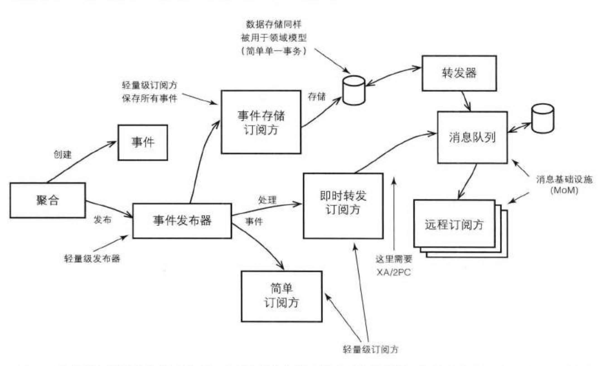

# 领域事件

[TOC]

## 概览

在最早期 Evans 的《领域驱动设计》 一书中并未提及领域事件，这是因为该概念是在书出版后才提出来的。

先看下当前对领域事件的定义：

> 领域专家所关心的，发生在领域中的一些事件。将领域中所发生的活动建模成一系列的离散事件。每个事件都用领域对象来表示。领域事件是领域模型的组成部分，表示领域中所发生的事情。

### 何时使用领域事件

对于领域事件，最方便的识别方式就是从领域专家口中得到。当领域专家提到如下词汇时，则暗示存在领域事件：

- 当...
- 如果发生...
- 当...的时候，请通知我
- 发生...时

根据你的组织文化，可能还有更多的事件用语。

### 为什么使用领域事件

当领域事件到达目的地之后（目的地：本地系统上下文、外部系统上下文），我们通常都将领域事件用于维护一致性：

- 消除两阶段提交（全局事务）
- 支持聚合原则

为什么说可以指出聚合原则？首先看下聚合原则：

> 单个事务只允许对一个聚合实例进行修改，由此产生的其他修改，必须在单独的事务中完成。

通过这个方式，本地限界上下文的其他聚合实例可以通过领域事件方式予以同步。

此外，也可以时本地系统和远程系统解耦，提升协作服务的可伸缩性。

下图是一个领域事件的产生、存储、分发和使用示意图：

## 建模领域事件

在建模领域事件时，我们应该根据限界上下文中的通用语言来命名事件及其属性。

若事件由聚合上的命令方法产生，那么我们通常根据该操作方法的名字来命名事件：

- 命令方法：BacklogItem::commitTo(Sprint aSprint)
- 事件输出：BacklogItemCommited
