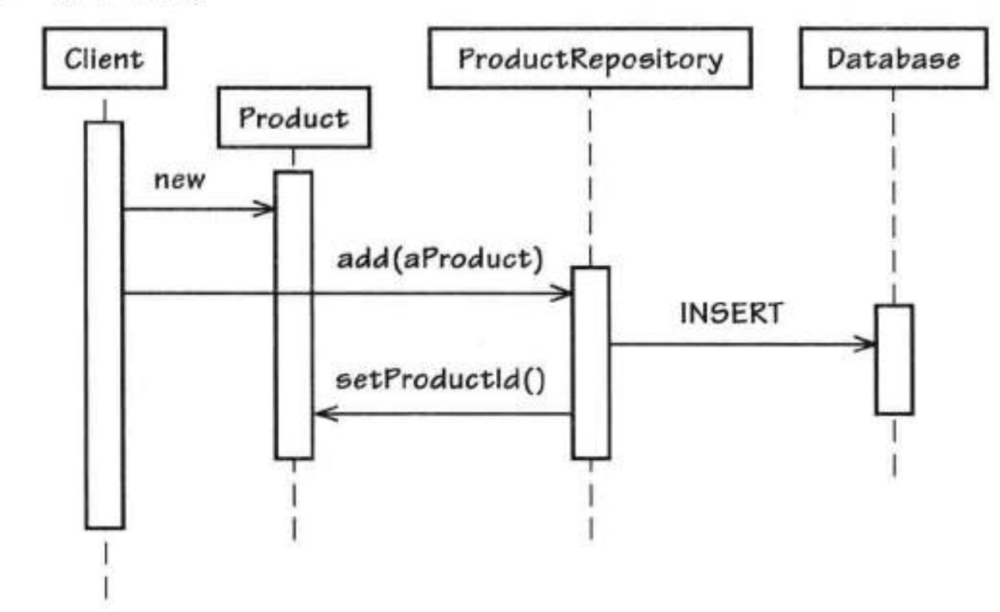

# 实体

[TOC]

## 概览

于我个人理解，分析建模得到的领域模型，不应该区分实体或值对象，因为领域模型是对问题域的建模，而实体以及值对象是在实现阶段才会进行考虑的。

因此，我认为 DDD 中的实体，是在分析建模完成后，在出数据模型前，或者在代码实现类层面，进行的区分。

> 当我们需要考虑一个对象的个性特征，或者需要区分不同的对象时，我们引入实体这个领域概念。

实体允许在其生命周期内发生改变，因此这引出了实体的两大特征：

1. 唯一的身份标识
1. 可变性

这两个特征也是实体和值对象的区别。

> 我们通过标识对对象进行区分，而不是属性，此时我们应该将标识作为主要的模型定义。同时，我们需要保持简单的类定义，并且关注对象在其生命周期中的连续性和唯一标识性。我们不应该通过对象的状态形式和历史来区分不同的实体对象。

## 实体唯一标识

在设计实体时，我们应该首先考虑实体的本质特征，特别是实体的唯一标识。

我们通过什么来记录唯一标识？我们可以通过**值对象**记录唯一标识，因为值对象是不变的，这也可以保证实体身份的稳定性，同时也可以处理与身份 ID 相关的行为（因为 ID 可能并非就是个随机数或自增数，完全包含了时间、机器 IP 等信息）。

以下是一些常用的创建实体身份标识的策略：

1. 用户提供一个或多个初始唯一值作为输入。
1. 程序内部通过算法自动生成的身份标识。
1. 持久化存储生成的唯一标识。
1. 另一个限界上下文决定出的唯一标识，作为程序的输入。

### 用户提供

若用户提供的输入是唯一的（业务上要求），那么很自然的就可以使用用户输入作为唯一标识（例如用户输入身份证号，游戏昵称等）。

这样的复杂性主要是用户自己生成很高质量的标识：标识很可能是不正确的。

例如若用户输入的名字作为唯一标识，那么用户在输入并点击确定后，发现名字拼写错误，需要修改怎么办？这样的代价是比较大的。

因此，这也的方式慎用。若同时满足以下条件，则也可以使用该方法：

1. 标识将来会继续使用，不会发生变化。
1. 有工作审批流来确保标识的正确性。

### 应用程序生成

这个其实比较常见的，现在主流喜欢使用 UUID 的方式进行生成，可参考 [UUID](https://en.wikipedia.org/wiki/Universally_unique_identifier)。

UUID 的生成通常而言是比较快的，但是其仍然需要调用系统函数（例如获取当前时间、随机数等）。若对于性能要求很高的场景，还可以这么做：

- 将 UUID 实例缓存起来，使其在背后不断的向缓存中填入新的 UUID 值。

因为 UUID 是随机的，所以即便系统宕机导致缓存的 UUID 丢失，也不会有什么影响。

除了 UUID，我们也可以使用一些更具可读性的标识：

```java
// AMP 表示敏捷项目管理上下文
// P 表示产品 Product
// 08-14-2012 表示创建时间
// F36AB21C 是一个随机字符串，可以取自 UUID
String rawId = "AMP-P-08-14-2012-F36AB21C";

ProductId productId = new ProductId(rawId);

Date productCreationDate = productId.creationDate();
```

这也的标识即满足唯一性，又具备可读性。同时，标识不使用原始字符串作为对象，而是专门用一个 `ProductId` 的对象，这也可以方便获取其中的一些有价值的数据。

```java
public class Product extends Entity {
    private ProductId productId;

    public Date creationDate() {
        return this.productId().creationDate();
    }
}
```

对于标识的创建，我们可以使用**资源库**的形式：

```java
// 当然，领域代码中使用的是 ProductRepository 对象来获取的 ID

public class HibernateProductRepository implements ProductRepository {
    public ProductId nextIdentity() {
        return new ProductId(java.util.UUID.randomUUID().toString().toUpperCase());
    }
}
```

### 持久化机制生成

持久化机制生成 ID 的方式有两种：

- 及早标识生成。通过 DB 构造 ID，然后再持久化。


- 延迟标识生成。在持久化数据时，DB 自动生成。



对于及早标识生成方案来说，有两个缺点：

- 性能
- 可用性

解决的一种方法是：将数据库列缓存在应用程序中。这个方式的缺点是服务器如果重启，那么将失去一部分标识的值空间。当然也可以找回，但是这会引入新的麻烦。

对于延迟标识生成，则不存在这类问题。但是一般而言不推荐延迟标识生成，主要是两个原因：

1. 涉及到构建多个实体时，因为此时还不存在 ID，所以这些实体之间无法进行比较。
1. 进行领域事件通知时，因为实体还未构造，所以通知中缺乏 ID。

我个人认为这两个说法，都是无稽之谈。我个人更偏向于，若采用延迟标识生成，则可能导致重试等带来的数据重复问题。

后面主要介绍及早标识生成方案。在 MySQL 中可以使用自增列：

- 首先是自增列初始化：

```txt
mysql > CREATE TABLE product_seq (nextval INT NOT NULL);

mysql > INSERT INTO product_seq VALUES (0);
```


- 然后就可以开始自增了：

```txt
mysql > UPDATE product_seq SET nextval = LAST_INSERT_ID(nextval + 1);

mysql > SELECT LAST_INSERT_ID();
+------------------+
| LAST_INSERT_ID() |
+------------------+
|                1 |
+------------------+
```

之所以不直接使用 `UPDATE product_seq SET nextval = nextval + 1`，是因为这种方式会在连接中缓存加后的结果，避免因为其他连接也在递增导致的竞争问题。

### 另一个上下文提供

实体可能来自另外一个上下文，同时会给出实体的唯一标识。

在自治系统中，我们可以将对象限定到本地对象中，这包括两个方面：

- 外部系统提供的实体，缓存到本地系统。
- 将外部概念翻译到本地的概念。

如果我们希望系统充分自治，那么我们可以为另一个上下文的实体，提供一个自己上下文的 ID。

### 委派标识

通常数据库规范、ORM 等要求对象必须有一个 int 类型主键，这些是物理层面所提出的要求，并非是领域层面的要求。

因此，这将会导致两种标识的存在：

- 一种为领域所用，一般叫做业务主键。
- 一种为物理机制所用，一般叫做委派标识。

对外界来说，最好将委派标识隐藏起来。

## 发现实体

### 实体本质特征

### 实体关键行为

### 实体的角色和职责

## 创建实体

## 验证实体

### 验证实体属性

### 验证实体整体对象

### 验证对象组合