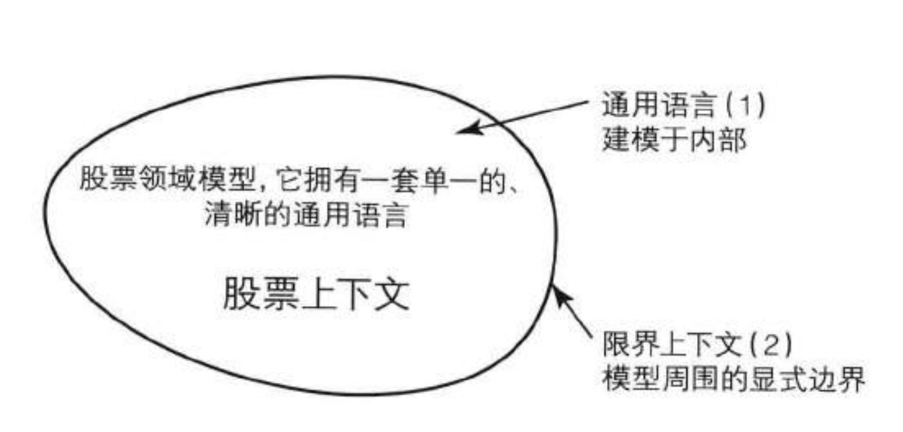
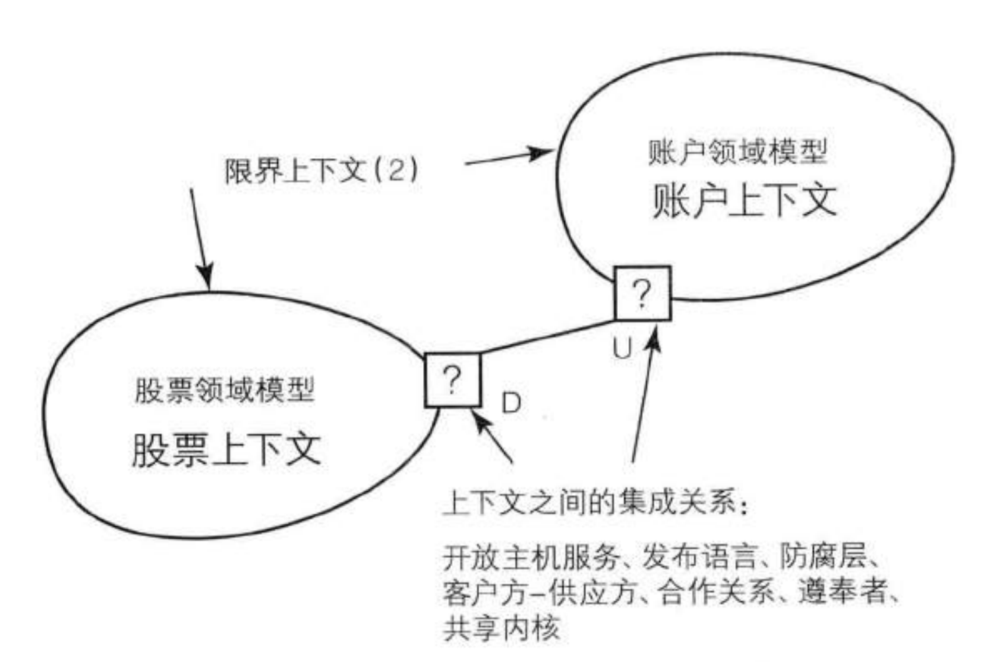

# 实现领域驱动设计

[TOC]

## 概览

**战略建模**

限界上下文是一个概念性的边界，领域模型便工作于其中：

注意，战略建模中，限界上下文最关心的并非上下文中的结构，而是区分上下文的边界。

在战略设计过程中，会有上下文映射图（即上下文之间的关系，以及集成方式）：

**架构**

限界上下文作为解域，每个限界上下文都可以有自己的独立架构。

目前主流比较喜欢使用六边形架构（目前已经逐步流行整洁架构，其本质上是类似的架构）。

**战术建模**

战术建模包括：

- 实体
- 值对象
- 聚合
- 领域服务
- 资源库
- 领域事件
- 模块

## 索引

1. [架构](arch/readme.md)
1. [实体](entity/readme.md)
1. [值对象](valueobject/readme.md)
1. [领域事件](domain-event/readme.md)
