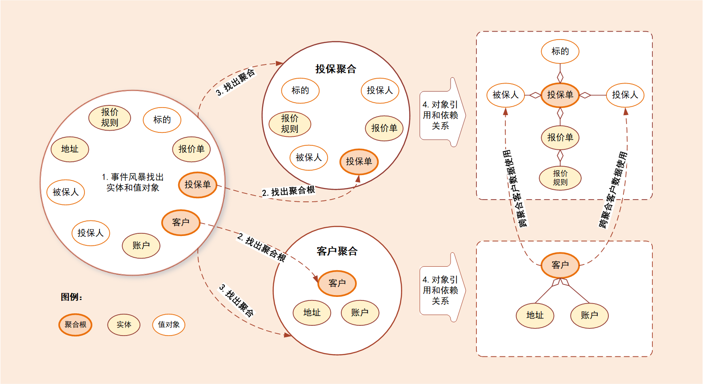

# 聚合

[TOC]

## 概览

我们会根据一些业务操作和行为找出实体（Entity）或值对象（ValueObject），进而将**业务关联紧密的实体和值对象进行组合，构成聚合**，再根据业务语义将多个聚合划定到同一个限界上下文（Bounded Context）中，并在限界上下文内完成领域建模。

## 聚合

实体一般对应业务对象，它具有业务属性和业务行为；而值对象主要是属性集合，对实体的状态和特征进行描述。

聚合就是由业务和逻辑紧密关联的实体和值对象组合而成的，**聚合是数据修改和持久化的基本单元**，每一个聚合对应一个仓储，实现数据的持久化。

聚合有一个**聚合根和上下文边界**，这个边界根据业务单一职责和高内聚原则，定义了聚合内部应该包含哪些实体和值对象，而聚合之间的边界是松耦合的。按照这种方式设计出来的微服务很自然就是“高内聚、低耦合”的。

聚合在 DDD 分层架构里属于领域层，领域层包含了多个聚合，共同实现核心业务逻辑。

聚合内实体以充血模型实现个体业务能力，以及业务逻辑的高内聚。

跨多个实体的业务逻辑通过**领域服务**来实现，跨多个聚合的业务逻辑通过**应用服务**来实现：

- 有的业务场景需要**同一个聚合**的 A 和 B 两个实体来共同完成，我们就可以将这段业务逻辑用**领域服务**来实现；
- 有的业务逻辑需要聚合 C 和聚合 D 中的两个服务共同完成，这时你就可以用**应用服务**来组合这两个服务。

## 聚合根

聚合根的主要目的是为了避免由于复杂数据模型缺少统一的业务规则控制，而导致聚合、实体之间数据不一致性的问题。

聚合根也称为**根实体**，它不仅是实体，还是聚合的管理者：

- 首先它作为实体本身，拥有实体的属性和业务行为，实现自身的业务逻辑。
- 其次它作为聚合的管理者，在聚合内部负责协调实体和值对象按照固定的业务规则协同完成共同的业务逻辑。
- 最后在聚合之间，它还是聚合对外的接口人，以聚合根 ID 关联的方式接受外部任务和请求，在上下文内实现聚合之间的业务协同。

也就是说，聚合之间通过聚合根 ID 关联引用，如果需要访问其它聚合的实体，就要先访问聚合根，再导航到聚合内部实体，外部对象不能直接访问聚合内实体。

## 怎样设计聚合？

聚合设计步骤：

- DDD 领域建模通常采用事件风暴，它通常采用用例分析、场景分析和用户旅程分析等方法，通过头脑风暴列出所有可能的业务行为和事件。
- 找出产生这些行为的领域对象，并梳理领域对象之间的关系。
- 在这些领域对象中找出聚合根。
- 找出与聚合根业务紧密关联的实体和值对象，将其构建为聚合。

这是一个投保示例：

- 第 1 步：采用事件风暴，根据业务行为，梳理出在投保过程中发生这些行为的所有的实体和值对象，比如投保单、标的、客户、被保人等等。
- 第 2 步：从众多实体中选出适合作为对象管理者的根实体，也就是聚合根。图中的聚合根分别是投保单和客户实体。
  - 判断一个实体是否是聚合根，你可以结合以下场景分析：
    - 是否有独立的生命周期？
    - 是否有全局唯一 ID？
    - 是否可以创建或修改其它对象？
    - 是否有专门的模块来管这个实体。
- 第 3 步：根据业务单一职责和高内聚原则，找出**与聚合根关联的所有紧密依赖的实体和值对象**。
  - 构建出 1 个包含聚合根（唯一）、多个实体和值对象的对象集合，这个集合就是聚合。
  - 在图中我们构建了客户和投保这两个聚合。
- 第 4 步：在聚合内根据聚合根、实体和值对象的依赖关系，画出对象的引用和依赖模型。
- 第 5 步：多个聚合根据业务语义和上下文一起划分到同一个限界上下文内。

这里我需要说明一下：投保人和被保人的数据，是通过关联客户 ID 从客户聚合中获取的，在投保聚合里它们是投保单的值对象，这些值对象的数据是客户的冗余数据，即使未来客户聚合的数据发生了变更，也不会影响投保单的值对象数据。

## 聚合的一些设计原则

聚合设计原则如下：

1. 在一致性边界内建模真正的不变条件。聚合内有一套不变的业务规则，各实体和值对象按照统一的业务规则运行，实现对象数据的一致性，边界之外的任何东西都与该聚合无关。
2. 设计小聚合。如果聚合设计得过大，聚合会因为包含过多的实体，导致实体之间的管理过于复杂，高频操作时会出现并发冲突或者数据库锁，最终导致系统可用性变差。而小聚合设计则可以降低由于业务过大导致聚合重构的可能性，让领域模型更能适应业务的变化。
3. 通过唯一标识引用其它聚合。聚合之间是通过关联外部聚合根 ID 的方式引用，而不是直接对象引用的方式。
4. 在边界之外使用最终一致性。聚合内数据强一致性，而聚合之间数据最终一致性。在一次事务中，最多只能更改一个聚合的状态。
5. 通过应用层实现跨聚合的服务调用。为实现微服务内聚合之间的解耦，以及未来以聚合为单位的微服务组合和拆分，应避免跨聚合的领域服务调用和跨聚合的数据库表关联。

## 总结

聚合的特点：

- 高内聚、低耦合
- 它是领域模型中最底层的边界
- 可以作为拆分微服务的最小单位，但我不建议你对微服务过度拆分。但在对性能有极致要求的场景中，聚合可以独立作为一个微服务，以满足版本的高频发布和极致的弹性伸缩能力。

一个微服务可以包含多个聚合，聚合之间的边界是微服务内天然的**逻辑边界**。有了这个逻辑边界，在微服务架构演进时就可以以聚合为单位进行拆分和组合了。

聚合根的特点：

- 聚合根是实体，有实体的特点，具有**全局唯一标识**，有独立的生命周期。
- 一个聚合只有一个聚合根，聚合根在聚合内对实体和值对象采用直接对象引用的方式进行组织和协调，聚合根与聚合根之间通过 ID 关联的方式实现聚合之间的协同。

实体的特点：

- 有 ID 标识，通过 ID 判断相等性，ID 在聚合内唯一即可。
- 状态可变，它依附于聚合根，其生命周期由聚合根管理。
- 实体一般会持久化，但与数据库持久化对象不一定是一对一的关系。
- 实体可以引用聚合内的聚合根、实体和值对象。

值对象的特点：

- 无 ID
- 不可变
- 无生命周期，用完即扔。

值对象之间通过属性值判断相等性。它的核心本质是值，是一组概念完整的属性组成的集合，用于描述实体的状态和特征。值对象尽量只引用值对象。
