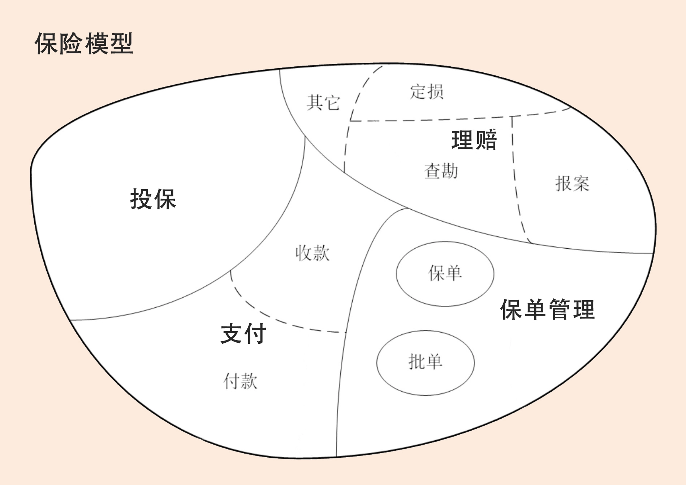

# 限界上下文：定义领域边界的利器

[TOC]

## 概览

通用语言定义上下文含义，限界上下文则定义领域边界，以确保每个上下文含义在它特定的边界内都具有唯一的含义，领域模型则存在于这个边界之内。

## 什么是通用语言？

怎么理解通用语言这个概念呢？

> 在事件风暴过程中，通过团队交流达成共识的，能够简单、清晰、准确描述业务涵义和规则的语言就是通用语言。

通用语言的价值也就很明了了，它可以解决交流障碍这个问题，使领域专家和开发人员能够协同合作，从而确保业务需求的正确表达。

## 什么是限界上下文？

DDD 在战略设计上提出了“限界上下文”这个概念，用来确定语义所在的领域边界。

我们可以将限界上下文拆解为两个词：限界和上下文。

- 限界就是领域的边界
- 上下文则是语义环境

通过领域的限界上下文，我们就可以在统一的领域边界内用统一的语言进行交流。

## 限界上下文和微服务的关系

领域可以拆分为多个子领域，一个领域相当于一个问题域，领域拆分为子域的过程就是大问题拆分为小问题的过程。

在这个图里面保险领域被拆分为：投保、支付、保单管理和理赔四个子域。

子域还可根据需要进一步拆分为子子域，比如，支付子域可继续拆分为收款和付款子子域。**拆到一定程度后，有些子子域的领域边界就可能变成限界上下文的边界了。**

子域可能会包含多个限界上下文，如理赔子域就包括报案、查勘和定损等多个限界上下文（限界上下文与理赔的子子域领域边界重合）。也有可能子域本身的边界就是限界上下文边界，如投保子域。
