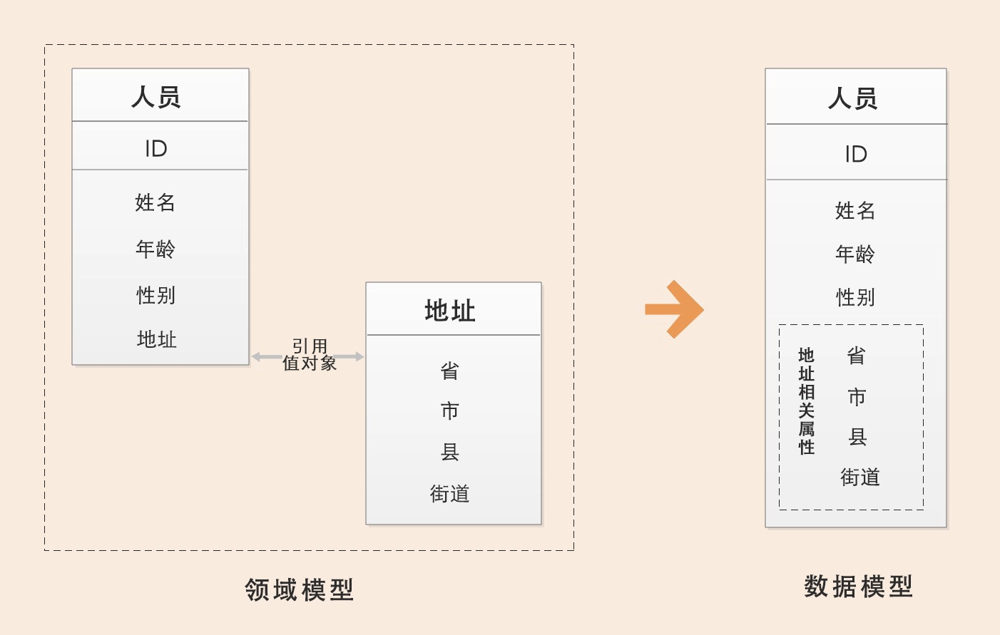
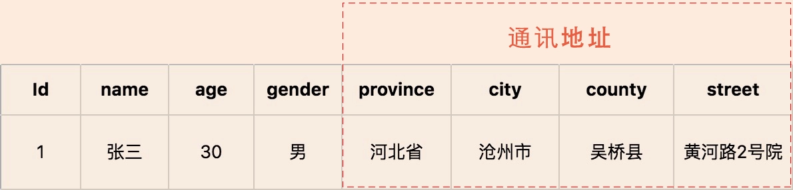
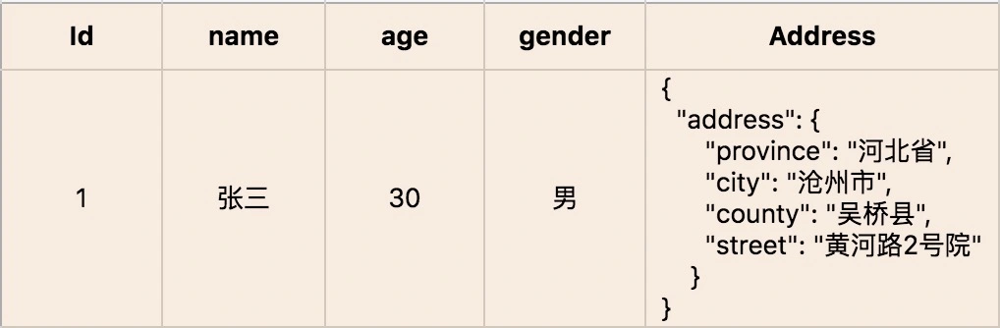

# 实体和值对象

[TOC]

## 实体

在 DDD 中有这样一类对象，它们拥有**唯一标识符**，且标识符在历经各种状态变更后仍能保持一致。

对这些对象而言，重要的不是其属性，**而是其延续性和标识**，对象的延续性和标识会跨越甚至超出软件的生命周期，我们把这样的对象称为实体。

### 1. 实体的业务形态

在战略设计时，实体是领域模型的一个重要对象：领域模型中的实体是多个属性、操作或行为的载体。

### 2. 实体的代码形态

在代码模型中，实体的表现形式是**实体类**，这个类包含了实体的属性和方法，通过这些方法实现实体自身的业务逻辑。

在 DDD 里，这些实体类通常采用**充血模型**，与这个实体相关的所有业务逻辑都在实体类的方法中实现，跨多个实体的领域逻辑则在领域服务中实现。

### 3. 实体的运行形态

实体以 DO（领域对象）的形式存在，**每个实体对象都有唯一的 ID**。

我们可以对一个实体对象进行多次修改，修改后的数据和原来的数据可能会大不相同。但是，由于它们拥有相同的 ID，它们依然是同一个实体。

比如商品是商品上下文的一个实体，通过唯一的商品 ID 来标识，不管这个商品的数据如何变化，商品的 ID 一直保持不变，它始终是同一个商品。

### 4. 实体的数据库形态

与传统数据模型设计优先不同：

> DDD 是先构建领域模型，针对实际业务场景构建实体对象和行为，再将实体对象映射到数据持久化对象。

实体映射数据模型：

映射方式 | 描述 | 场景解释 | 示例
-|-|-|-
1 : 0 | 1 个实体映射 0 个数据持久化对象 | 有些实体只是暂驻静态内存的一个运行态实体，它不需要持久化。| 基于多个价格配置数据计算后生成的折扣实体。
1 : 1 | 1 个实体映射 1 个数据持久化对象 | 大多数可能都是这个场景。| 订单实体，对应 1 个订单数据实体。
1 : N | 1 个实体映射多个数据持久化对象 | 通常由于技术原因，一个实体可能存储为多个数据持久化对象，但是它们的业务含义都是一个业务含义的实体。 | 订单实体拆为写模型和读模型。
N : 1 | 多个实体映射为 1 个数据持久化对象 | 通常由于技术原因（提升性能，减少查询次数），将多个实体存储在一起。 | 客户和账户两个实体可根据需要从一个持久化对象中生成。


## 值对象

在 DDD 中用来描述领域的特定方面，并且是一个没有标识符的对象，叫作值对象。

> 通过对象属性值来识别的对象，它将多个相关属性组合为一个概念整体。

值对象描述了领域中的一件东西，这个东西是**不可变**的，它将不同的相关属性组合成了一个概念整体。当度量和描述改变时，可以用另外一个值对象予以替换。它可以和其它值对象进行相等性比较，且不会对协作对象造成副作用。



在领域建模的过程中，值对象可以保证属性归类的清晰和概念的完整性，避免属性零碎。

### 1. 值对象的业务形态

值对象的属性集虽然在物理上独立出来了，但在逻辑上它仍然是实体属性的一部分，用于描述实体的特征。

本质上：

- 实体是看得到、摸得着的实实在在的业务对象，实体具有业务属性、业务行为和业务逻辑。
- 值对象只是若干个属性的集合，只有数据初始化操作和有限的不涉及修改数据的行为，基本不包含业务逻辑。

### 2. 值对象的代码形态

值对象在代码中有这样两种形态：

- 如果值对象是单一属性，则直接定义为实体类的属性；
- 如果值对象是属性集合，则把它设计为 Class 类，Class 将具有整体概念的多个属性归集到属性集合，这样的值对象没有 ID，会被实体整体引用。

```java
// 实体的代码类，有主键
public class person {
    public String id;           // 值对象 人员唯一主键
    public String name;         // 值对象
    public int age;             // 值对象
    public boolean gender;      // 值对象
    public Address address;     // 值对象
}

// 值对象的代码类，无主键
public class Address {
    public String province;     // 值对象
    public String city;         // 值对象
    public String county;       // 值对象
    public String street;       // 值对象
}
```

### 3. 值对象的运行形态

值对象创建后就不允许修改了，只能用另外一个值对象来整体替换。

值对象嵌入到实体的话，有这样两种不同的数据格式，也可以说是两种方式：

- 属性嵌入的方式
- 序列化大对象的方式

以属性嵌入的方式形成的人员实体对象，地址值对象直接以属性值嵌入人员实体中：



以序列化大对象的方式形成的人员实体对象，地址值对象被序列化成大对象 Json 串后，嵌入人员实体中：



### 4. 值对象的数据库形态

实体和数据模型设计通常有两种解决方案：

- 第一是把地址值对象的所有属性都放到人员实体表中，创建人员实体，创建人员数据表。会破坏地址的业务涵义和概念完整性；
- 第二是创建人员和地址两个实体，同时创建人员和地址两张表。增加了不必要的实体和表，需要处理多个实体和表的关系，从而增加了数据库设计的复杂性。

**如何既不破环业务概念含义，又不将数据库设计复杂化呢？值对象的优势就体现出来了：**

- 在领域建模时，我们可以把地址作为值对象，人员作为实体，这样就可以保留地址的业务涵义和概念完整性。
- 在数据建模时，我们可以将地址的属性值嵌入人员实体数据库表中，只创建人员数据库表。这样既可以兼顾业务含义和表达，又不增加数据库的复杂度。

## 实体和值对象的关系

实体和值对象是微服务底层的最基础的对象，一起实现实体最基本的核心领域逻辑。

DDD 提倡从领域模型设计出发，而不是先设计数据模型：

- 传统的数据模型设计通常是一个表对应一个实体，一个主表关联多个从表。
- 当实体表太多的时候就很容易陷入无穷无尽的复杂的数据库设计，领域模型就很容易被数据模型绑架。
- 值对象的诞生，在一定程度上，和实体是互补的。

同样的对象在不同的场景下，可能会设计出不同的结果：

- 在某些场景中，地址会被某一实体引用，它只承担描述实体的作用，并且它的值只能整体替换，这时候你就可以将地址设计为值对象，比如收货地址。
- 在某些场景中，地址会被经常修改，地址是作为一个独立对象存在的，这时候它应该设计为实体，比如行政区划中的地址信息维护。
