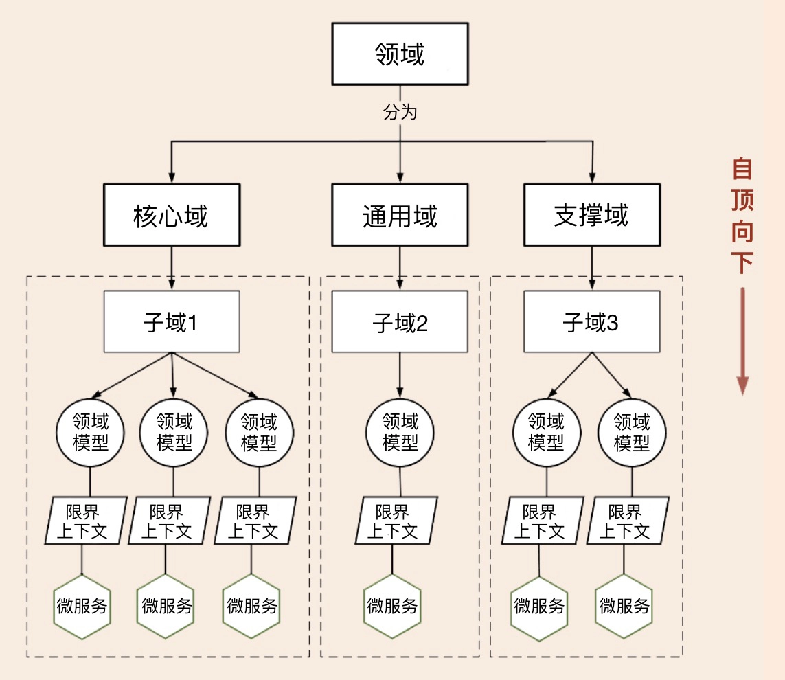
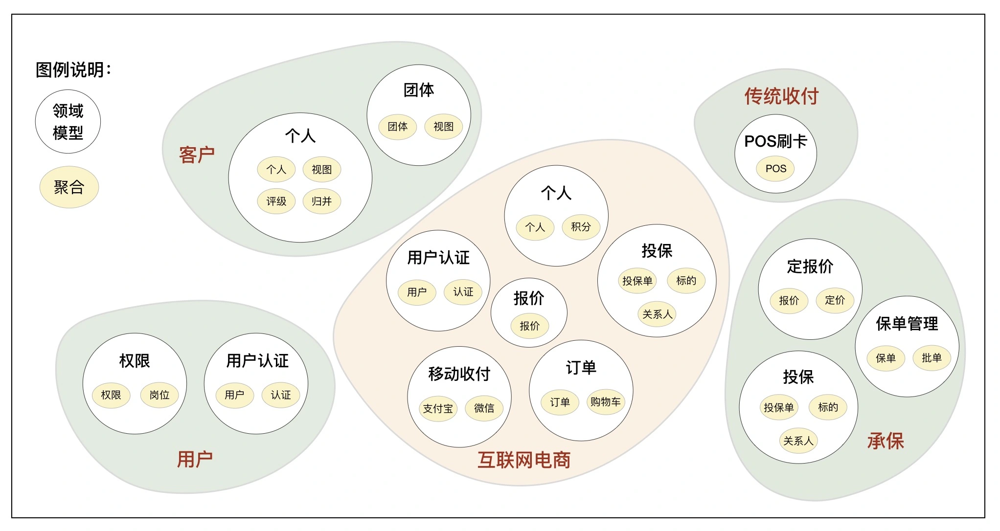

# 重构中台

[TOC]

## 概述

进入两千年后，随着互联网应用的快速发展，很多传统企业开始触网，建设自己的互联网电商平台。后来又随着微信和 App 等移动互联应用的兴起，又形成了新一轮的移动应用热潮。这些移动互联应用大多面向个人或者第三方，市场和需求变化快，需要以更敏捷的速度适应市场变化，为了保持快速响应能力和频繁发版的要求，很多时候这些移动互联网应用是独立于传统核心系统建设的，但两者承载的业务大部分又都是同质的，因此很容易出现业务能力重叠的问题。

在阿里巴巴提出中台战略后，很多企业又紧跟它的步伐，高举中台大旗，轰轰烈烈地开始了数字化转型之路。

那么传统企业在中台转型时，该如何从错综复杂的业务中构建中台业务模型呢？

## 传统企业应用分析

## 如何避免重复造轮子？

## 如何构建中台业务模型？

#### 1. 自顶向下的策略

第一种策略是自顶向下。这种策略是先做顶层设计，从最高领域逐级分解为中台，分别建立领域模型，根据业务属性分为通用中台或核心中台。领域建模过程主要基于业务现状，暂时不考虑系统现状。

自顶向下的策略适用于全新的应用系统建设，或旧系统推倒重建的情况。

### 2. 自底向上的策略

第二种策略是自底向上。这种策略是基于业务和系统现状完成领域建模。首先分别完成系统所在业务域的领域建模；然后对齐业务域，找出具有同类或相似业务功能的领域模型，对比分析领域模型的差异，重组领域对象，重构领域模型。这个过程会沉淀公共和复用的业务能力，会将分散的业务模型整合。

自底向上策略适用于遗留系统业务模型的演进式重构。

