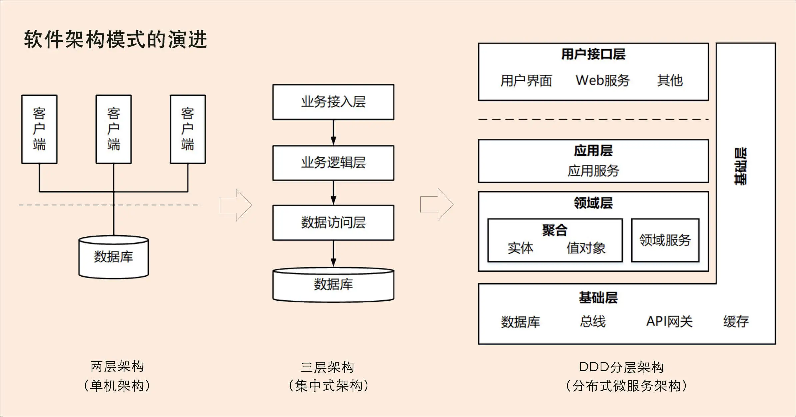
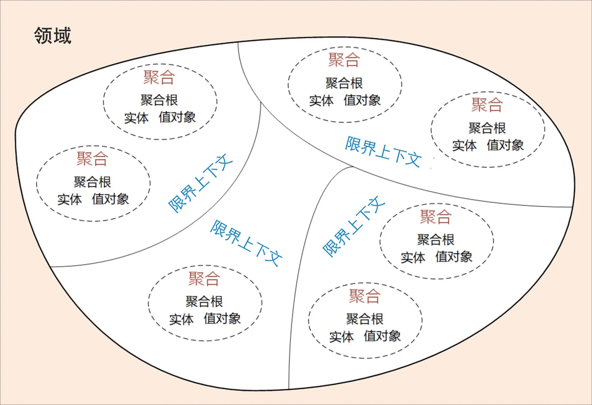

# 微服务设计为什么要选择 DDD

软件架构模式大体来说经历了从单机、集中式到分布式微服务架构三个阶段的演进：

- 第一阶段是单机架构：采用面向过程的设计方法，系统包括客户端 UI 层和数据库两层，采用 C/S 架构模式，整个系统围绕数据库驱动设计和开发，并且总是从设计数据库和字段开始。
- 第二阶段是集中式架构：采用面向对象的设计方法，系统包括业务接入层、业务逻辑层和数据库层，采用经典的三层架构（其实就是单体应用）。
- 第三阶段是分布式微服务架构：随着微服务架构理念的提出，集中式架构正向分布式微服务架构演进。

随着分布式技术的快速兴起，我们已经进入到了微服务架构时代。微服务架构可以很好地实现应用之间的解耦，解决单体应用扩展性和弹性伸缩能力不足的问题。

## 微服务设计和拆分的困境

微服务实践过程中也产生了不少的争论和疑惑：

- 微服务的粒度应该多大呀？
- 微服务到底应该如何拆分和设计呢？
- 微服务的边界应该在哪里？

微服务拆分困境产生的根本原因就是不知道业务或者微服务的边界到底在什么地方。

换句话说，确定了**业务边界和应用边界**，这个困境也就迎刃而解了。

这里 DDD 就来了：

> DDD 核心思想是通过领域驱动设计方法定义领域模型，从而确定业务和应用边界，保证业务模型与代码模型的一致性。

有些熟悉 DDD 设计方法的软件工程师在进行微服务设计时，发现可以利用 DDD 设计方法来建立领域模型，划分领域边界，再根据这些领域边界从业务视角来划分微服务边界。

按照 DDD 方法设计出的微服务的业务和应用边界都非常合理，可以很好地实现微服务内部和外部的“高内聚、低耦合”。于是越来越多的人开始把 DDD 作为微服务设计的指导思想。

## 为什么 DDD 适合微服务

DDD 是一种处理高度复杂领域的设计思想：

- 它试图分离技术实现的复杂性
- 围绕业务概念构建领域模型来控制业务的复杂性
- 解决软件难以理解，难以演进的问题。

DDD 不是架构，而是一种架构设计方法论，它通过边界划分将复杂业务领域简单化，帮我们设计出清晰的领域和应用边界，可以很容易地实现架构演进。

- DDD 战略设计会建立域模型，领域模型可以用于指导微服务的设计和拆分。
- 事件风暴是建立领域模型的主要方法，它是一个**从发散到收敛**的过程。
  - 它通常采用用例分析、场景分析和用户旅程分析，尽可能全面不遗漏地分解业务领域，并梳理领域对象之间的关系，这是一个发散的过程。
  - 事件风暴过程会产生很多的实体、命令、事件等领域对象，我们将这些领域对象从不同的维度进行聚类，形成如聚合、限界上下文等边界，建立领域模型，这就是一个收敛的过程。

我们可以用三步来划定领域模型和微服务的边界：

- 第一步：在事件风暴中梳理业务过程中的用户操作、事件以及外部依赖关系等，根据这些要素梳理出领域实体等领域对象。
- 第二步：根据领域实体之间的业务关联性，将业务紧密相关的实体进行组合形成聚合，同时确定聚合中的聚合根、值对象和实体。在这个图里，聚合之间的边界是**第一层边界**，它们在**同一个微服务实例中运行**，这个边界是逻辑边界，所以用虚线表示。
- 第三步：根据业务及语义边界等因素，将一个或者多个聚合划定在一个限界上下文内，形成领域模型。在这个图里，限界上下文之间的边界是**第二层边界**，这一层边界可能就是未来**微服务的边界**，不同限界上下文内的领域逻辑被隔离在不同的微服务实例中运行，物理上相互隔离，所以是物理边界，边界之间用实线来表示。
