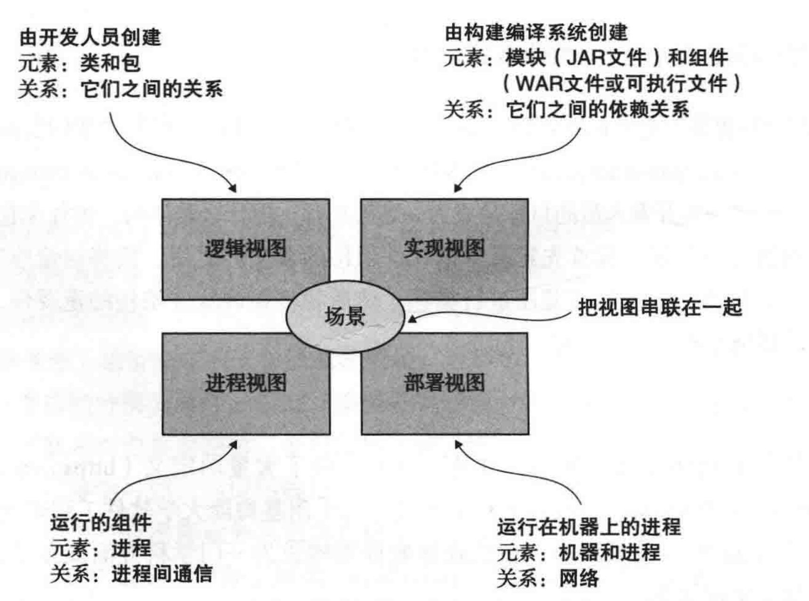
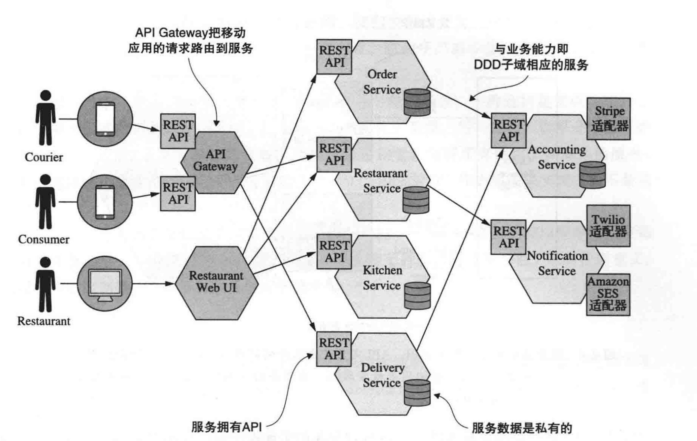
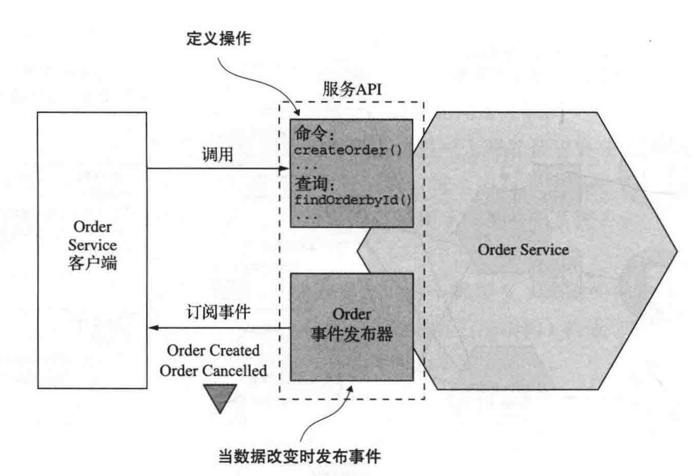
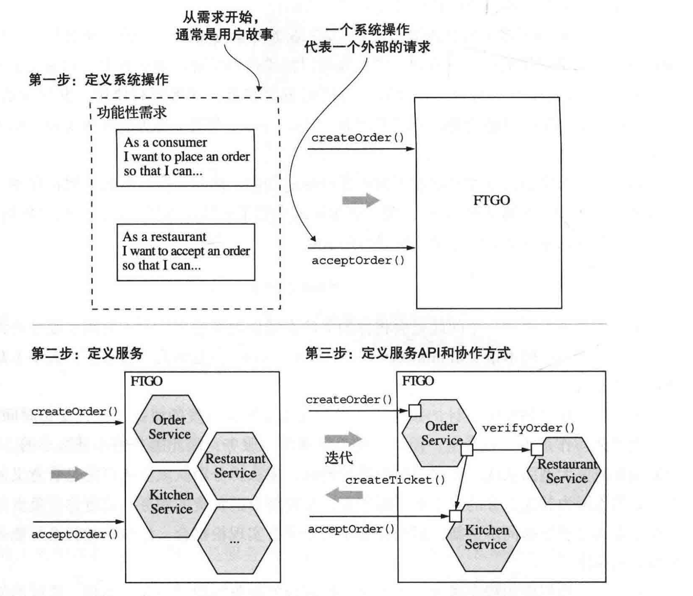
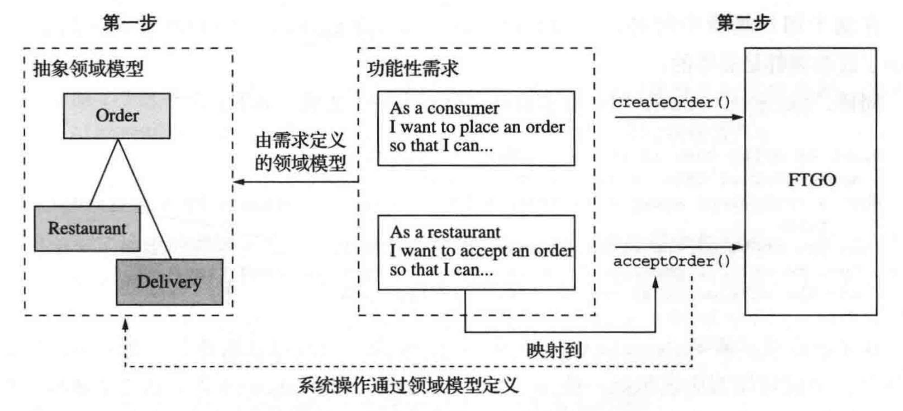
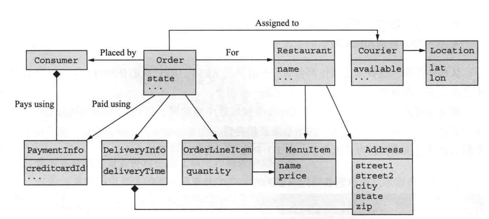
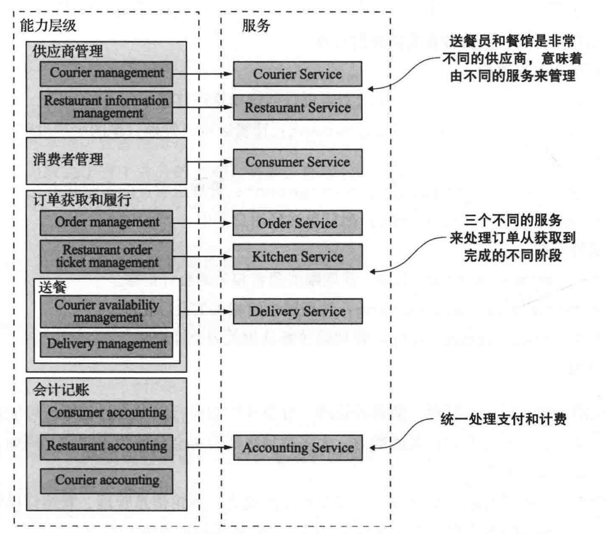

# 微服务的拆分

[TOC]

## 概览

## 微服务架构是什么

软件的架构是一种抽象的结构，它由软件的**各个组成部分**和**这些部分之间的依赖关系**构成。

微服务架构虽然描述了一种功能分解，但是它留下了几个未解决的问题：

- 微服务架构如何与软件架构的概念相结合
- 什么是服务
- 服务的规模

软件架构是多维的，因此有多种方式对它进行表示。

### 软件架构是什么

软件架构的定义非常多，一般主流采用 Len Bass 的观点：

> 计算机系统的软件架构是构建这个系统所需要的一组结构，包括软件元素、它们之间的关系、以及两者的属性。

本质是将软件分解为元素（element）和元素之间的关系（relation）：

- 分解促进了劳动和知识的分工。
- 分解定义了软件元素的交互方式。

很多时候，我们会用多个视角来看待软件架构。一个经典的视图集是 4+1 视图：

每一个视图只描述了架构的一个特定方面，每个视图都是特定的元素和它们的关系。

视图 | 描述 | 元素 | 关系
-|-|-|
逻辑视图 | 开发人员创建的软件元素。| 类和包。 | 类和包之间的关系，包括继承、关联和依赖。
实现视图 | 构建编译系统的输出。 | 代码的模块和组件。组件是由模块组成的可执行或可部署单元。  Java 中，模块是 JAR 文件，组件是 WAR 文件或可执行 JAR 文件。 | 模块之间的依赖关系，以及组件和模块之间的组合关系。

### 架构为什么重要

应用程序有两个层面的需求：

- 功能性需求，决定应用程序做什么。通常包含在用例或者用户故事中。
- 非功能性需求，也叫做质量属性。

功能性需求可以用任何架构实现，但是非功能性需求由架构来满足和实现。

### 什么是架构风格？

特定架构风格提供了有限的元素（组件）和关系（连接器）：

> 架构风格根据结构组织模式定义了一系列此类系统。更具体的说，架构风格确定可以在该风格的实例中使用的组件和连接器的词汇表，以及关于如何组织它们的一组约束。

**分层式风格**

分层架构将元素按层的方式组织，每层都有明确的职责，同时限制了它们的依赖关系。每一层只能依赖于紧邻其下方的层（严格分层）或其下面的任何层（松散分层）。

分层架构可以应用到 4+1 视图中去，流行的三层架构主要应用于逻辑视图分层。它将程序的类组织到以下层中：

- 表现层：实现用户界面或外部 API 的代码。
- 业务逻辑层：包含业务逻辑。
- 数据持久化层：实现与数据库的交互。

**六边形风格**

### 微服务架构是一种架构风格

单体架构和微服务架构，都是一种架构风格。

单体架构：将应用程序构建为单个可执行和可部署组件。

- 它的实现视图是：单个可执行文件。
- 单体应用可以具有六边形架构风格的**逻辑视图**。

微服务架构：将应用程序构建为松耦合、可独立部署的一组服务 。

- 它的实现视图是：多个组件构成（一组可执行文件）。
  - 它的组件是服务。
  - 它的连接器是这些组件之间的通信协议。
- 每个服务都有自己的逻辑视图。

FTGO 的微服务架构，由多个服务组成：

微服务架构强加的关键限制是：服务松耦合。

**什么是服务？**

服务是一个单一的、可独立部署的软件组件，它实现一些有用的功能。

FTGO 的 Order Service：

开发人员无法绕过服务的 API 直接访问服务的内部方法或数据，因此微服务架构强制实现了应用程序的模块化。

**什么是松耦合？**

微服务架构的最核心特性是服务之间需要松耦合。

**微服务的大小并不重要**

## 为应用程序定义微服务架构

这是一个三步流程：

1. 定义系统操作
1. 定义服务
1. 定义服务 API 和协作方式

该流程的第一步，将应用程序的需求提炼成各种关键请求，这些请求并非实现细节，而更像是与系统的交互，一般称作系统操作。

该流程的第二步，是确定如何分解服务。有几种策略可供选择：

- 源于业务架构学派的策略：定义与业务能力相对应的服务。
- 围绕 DDD 划分的子域来分解和设计服务。

这些概念都是围绕业务概念，而非技术概念分解和设计服务。

该流程的第三步，确定每个服务的 API。为此，将第一步中每个系统操作分配给对应的服务：

- 服务可能自己完成操作。
- 服务也可能与其他服务协同完成操作。

服务的分解带来了一些问题和挑战：

1. 网络延迟。划分服务后，带来的网络调用，带来更多的耗时。
1. 降低可用性。
1. 服务之间的数据一致性。
1. 上帝类。这种实体广泛应用在整个应用程序中。可以通过 DDD 消除。

### 识别系统操作

起点是应用程序的需求，包括用户故事和相关用户场景。

通过两个步骤识别和定义系统操作：

第一步是做领域建模，得到领域模型。

第二步根据领域模型中的实体，描述系统操作。

**创建抽象领域模型**

与领域专家充分沟通，分析用户故事和场景中出现的名词。

例如 Place Order 用户故事：

例如 Accept Order 用户故事：

经过几轮迭代分析后，最终得到抽象领域模型的关键类：

作用如下：

类 | 作用
-|-
Consumer | 下订单的用户。
Order | 用户下的订单，用来描述订单并跟踪状态。
OrderLineItem | Order 中的一个条目。
DeliveryInfo | 送餐的时间和地址。
Restaurant | 为用户准备生产订单的餐馆，同时也要发起送货。
Courier | 送餐员负责把订单送到用户手里。
Address |
Location |

**定义系统操作**

### 根据业务能力进行服务拆分

**业务能力**，是一个来自于**业务架构建模**的术语。是指的一些能够为公司或组织产生价值的商业活动。

特定业务的业务能力，取决于这个业务的类型。例如：

- 保险公司的业务能力通常包括：承保、理赔管理、账务和合规。
- 在线商店的业务能力通常包括：订单管理、库存管理和发货。

组织的业务能力，通常是指的这个组织是**做什么**，这是业务对外提供的最根本价值，一次你它们通常都是稳定的。使用何种方式来提供这样的价值，是容易变化的。

**注意：**

- 从这个角度看，其实**业务能力**和**业务用例**的概念是类似的。

一个组织有哪些业务能力，是通过对组织的目标、结构和商业流程的分析得来的。而一个业务能力还能有子能力。

FTGO 的业务能力：

- 供应商管理：
  - Courier management 送餐员相关信息管理
  - Restaurant information management 餐馆菜单和其他信息管理
- 消费者管理：消费者有关信息的管理
- 订单获取和履行：
  - Order management 消费者可以创建和管理订单
  - Restaurant order management 餐馆可以管理订单的生产过程
  - Courier availability management 管理送餐员的实时状态
  - Delivery management 把订单送到用户手中
- 会计记账
  - Consumer accounting 管理消费者相关记账
  - Restaurant accounting 管理餐厅相关记账
  - Courier accounting 管理送餐员相关记账
- 其他

一旦确定了业务能力，就可以为每个能力定义服务：顶级能力至少一个服务，子能力可以合并成一个服务。通常这是一个比较主观的判断。

使用业务能力来划分的好处是：

- 业务能力是稳定的，最终架构也相对稳定。架构中的各个组件（即服务），会随着时间变化而变化，但是架构仍然保持不变。
- 通常公司组织架构也是按照业务能力来划得，这样组织架构和服务的分配更为容易。

### 根据子域进行划分

