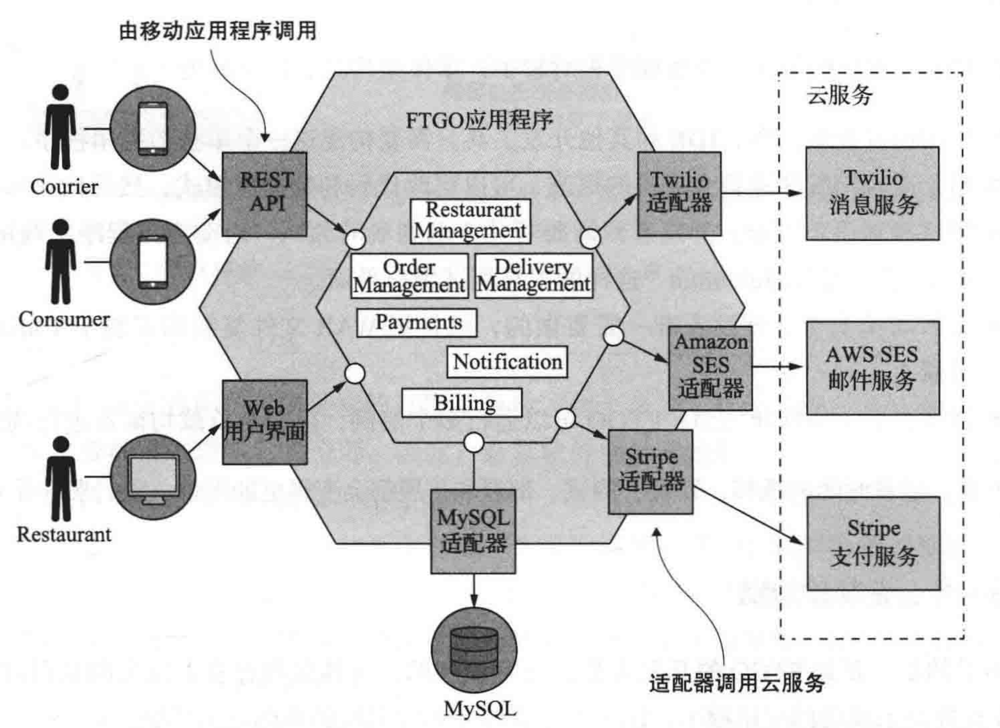
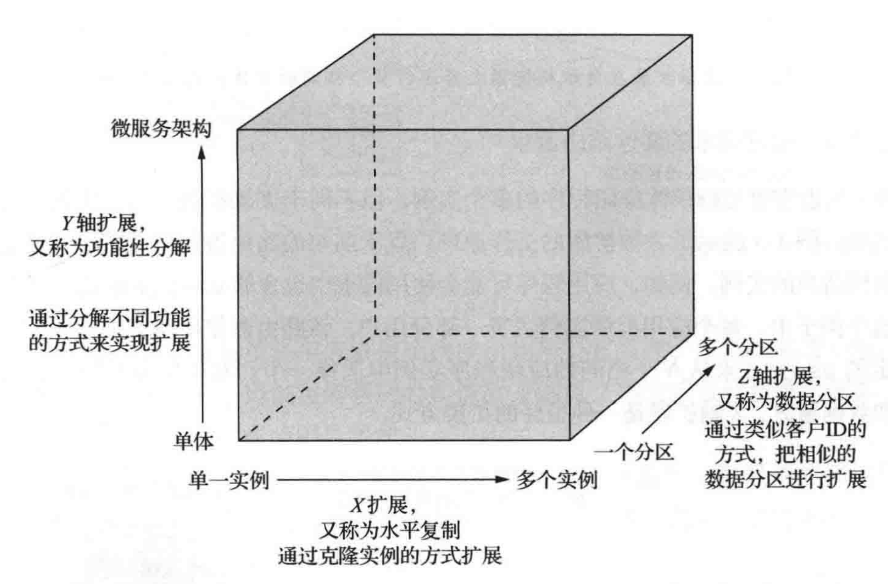
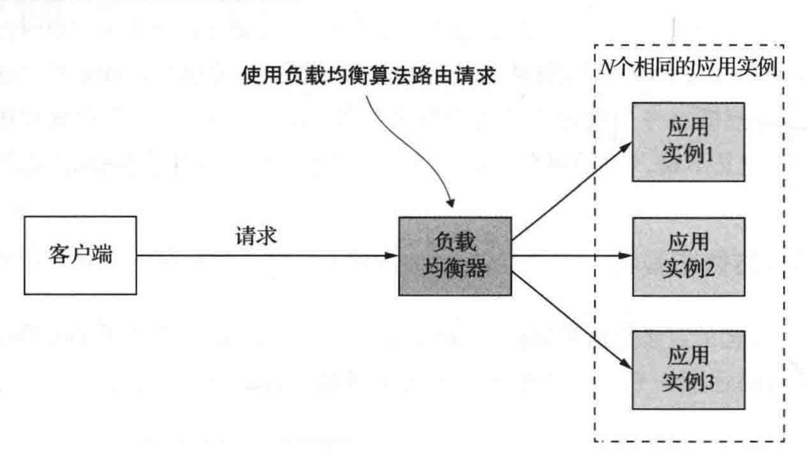
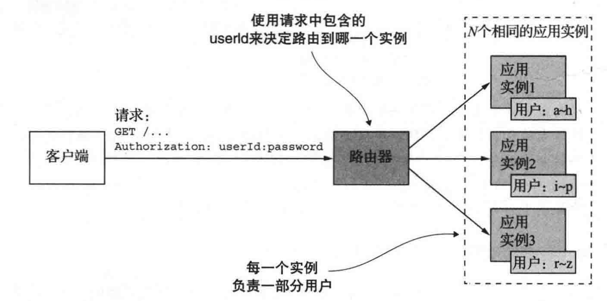
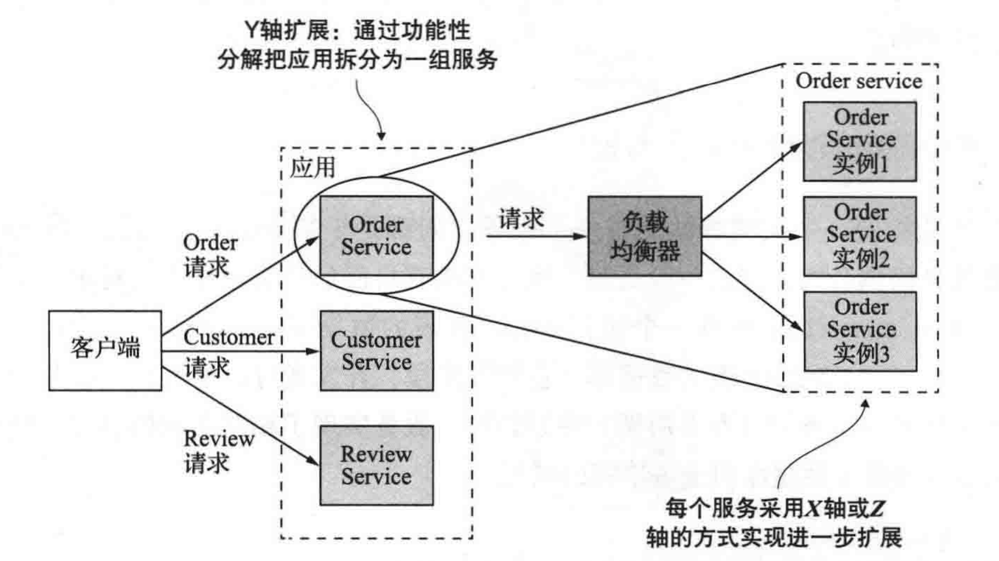
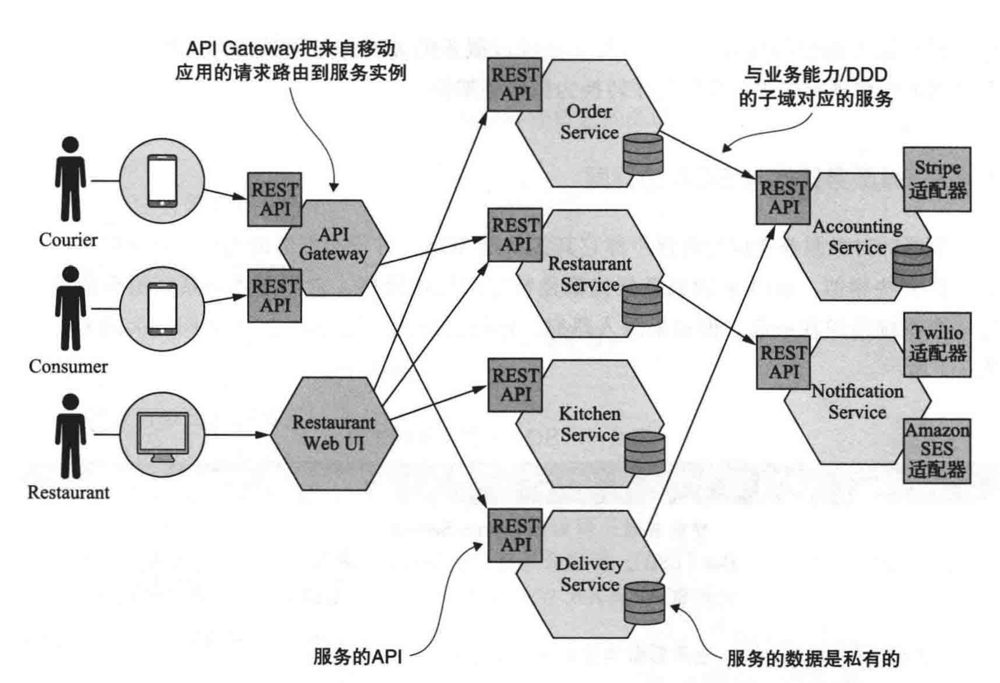
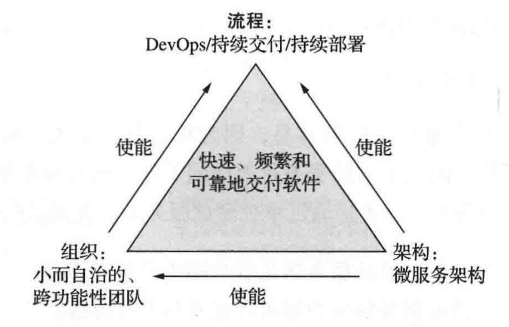

# 逃离单体地狱

[TOC]

## 概览

该书结合一个实际示例来进行：Food To Go（后续简称 FTGO）一个全美领先的在线餐饮速递企业。

核心业务：

- 消费者（Consumer）使用 FTGO 的网站或者移动应用在本地餐馆（Restaurant）下订单。
- FTGO 协调一个由送餐员（Courier）组成的快递网络来完成订单食品（Order）的运送（Delivery）。
- FTGO 需要给参观和送餐员支付费用（Payment）。

业务逻辑的典型模块包括：

- Order Management
- Delivery Management
- Billing
- Payments

### FTGO 应用架构

FTGO 是一个六边形架构：

适配器用来完成和外部系统的对接工作：

- 入站适配器
  - rest api
  - web api
- 出站适配器
  - 访问 MySQL 数据库
  - 调用 Twilio 和 Stripe 云服务

尽管这是个六边形，做了模块化，但实际上这个应用是被整体打包成了一个单一 WAR 文件。

### 单体应用的好处

FTGO 早期，应用相对较小，单体架构具有以下好处：

- 应用开发简单
- 易于对应用程序进行大规模的更改
- 测试相对简单直观
- 部署简单明了
- 横向扩展不费吹灰之力

但是随着时间的推移，开发、测试、部署和扩展会变得更加困难。

## 拯救之道：微服务架构

**软件架构对功能性需求影响不大**，可以说，在任何一个架构上，都能实现一组用例（应用的功能性需求）。

架构的重要性在于它影响了**非功能性需求**，也称为**质量属性**。

随着 FTGO 的增长，各种质量属性浮出水面，最显著的就是：

- 可维护性
- 可扩展性
- 可测试性

### 扩展立方体和服务

受《The Art of Scalability》的启发，这里提出了可扩展模型：扩展立方体。

扩展立方体，定义了三种不同的应用程序扩展方法：

- X 轴，在多个相同实例之间实现请求的负载均衡。
- Z 轴，根据请求的属性路由请求。
- Y 轴，将应用程序拆分为多个服务。

**X 轴扩展：多个实例之间实现负载均衡**

**Z 轴扩展：根据请求属性路由**

**Y 轴扩展：根据功能把应用拆分为服务**

X 和 Z 轴都解决了吞吐量和可用性问题，但是没有解决开发问题和应用复杂性（本质上就是可修改性问题）。

为了解决这个问题，我们将单体应用拆分为一组服务。

服务本质上是一个麻雀虽小五章俱全的应用程序，实现了一组相关的功能。

对微服务架构的概括性定义是：

> 把应用程序功能性分解为一组服务的架构风格。

这里并没有定义任何与规模相关的内容，重要的是：

- 每一个服务都是由一组专注的、内聚的功能职责组成。

### 微服务架构作为模块化的一种形式

### 每个服务都有自己的库

### FTGO 的微服务架构

前端服务包括：

- API Gateway，提供消费者和快递员的 Mobile App 使用的 REST API。
- 餐馆的 Web UI，实现餐馆用来管理菜单和订单流程的 Web 用户界面。

后端服务包括：

- Order Service，管理订单
- Delivery Service，管理从餐馆到客户之间的订单派送（送餐）
- Restaurant Service，维护餐馆的有关信息
- Kitchen Service，管理订单的准备过程
- Accounting Service，管理账单和付款

每个后端服务都有一个 REST API 和自己私有的数据库。

### 微服务架构与 SOA

某些针对微服务架构的批判声称它其实就是 SOA，并没有新鲜内容。

视角 | SOA | 微服务
-|-|-
服务间通信 | 智能管道，例如 ESB，往往采用重量级协议，例如 SOAP 或其他 WS 标准 | 使哑管道，例如消息代理，或者服务之间点对点通信，使用 REST 或 gRPC 类的轻量级协议。
数据管理 | 全局数据模型并共享数据库 | 
典型服务的规模 | 较大的单体应用 | 较小的服务

## 微服务之上：流程和组织

除了拥有正确的架构外，成功的软件开发还需要在：组织、开发、交付流程方面做一些工作。

关系如下：

### 进行软件开发和交付的组织

团队人过多后，会因为沟通成本的增大，导致效率的下降，因此一般会将团队拆成多个小团队，人员规模平均 8~12 人。

每个团队有自己明确的职责，负责一个或多个服务。

**逆向康威定律：**

- 在使用微服务架构交付软件时，需要考虑康威定律：设计系统的组织......往往被组织架构所限制，最终设计的结果是这些组织沟通结构的副本。
- 换句话说，应用程序的架构，往往反应了开发它的组织结构。因此，反向应用康威定律：设计你的企业组织，使其结构与微服务架构一一对应。这样做，可以让你的开发团队与服务一样松耦合。
