# REST

[TOC]

## 软件架构

### 风格

一种架构风格是一组协作的架构约束，这些约束限制了架构元素的角色和功能，以及在任何一个遵循该风格的架构中允许存在的元素之间的关系。

> An architectural style is a coordinated set of architectural constraints that restricts the roles/features of architectural elements and the allowed relationships among those elements within any architecture that conforms to that style.

风格是一种用来对架构进行分类和定义它们的公共特征的机制，正因为他们具有公共特征，因此一提到该风格的架构，就能理解其大致的样子（例如当提到 CS 架构就知道是客户端服务器的模式）。

因此，架构风格其实是架构的模式（类似设计模式），是对架构的抽象。这其实和建筑风格的含义也类似：

> An architectural style is a set of characteristics and features that make a building or other structure notable or historically identifiable.

因为架构的关键点就是其中的组件，以及组件的交互，所以对于架构风格换句话说就是：

> 每一种风格都为组件的交互提供了一种抽象，并且通过忽略架构中其余部分的偶然性细节，来捕获一种交互模式的本质特征。

因为架构风格是架构的抽象，所以新的架构能够被定义为特定风格的实例。

一种特定的架构可能是由多种架构风格组成的。同样地，能够通过将多种基本风格组合为单个风格来形成一种混合风格（例如 CS 和 LS 组合成 LCS）。

## 基于网络的应用架构

### 关键关注的架构属性

这里列举的并非架构属性的全面清单，还有一些额外的属性，有时候也被称为**软件质量（Software Qualities）**。

后续提到的**交互**，指的是两个组件之间的数据传输。

### 性能

一个基于网络的应用，性能考虑的首要方面是应用的需求，然后是所选择的交互风格，接着是实现的架构，最后是每个组件的实现。

> The performance of a network-based application is bound first by the application requirements, then by the chosen interaction style, followed by the realized architecture, and finally by the implementation of each component. 

换句话说，软件不能避免为了该软件所必需的基本成本。

> In other words, software cannot avoid the basic cost of achieving the application needs.

例如，如果应用软件需要数据位于系统 A，并由系统 B 来处理：

- 无法避免将数据从 A 移动到 B。
- 数据从 A 移动到 B 的多次交互的成本不可能少于单独一次从 A 到 B 的交互。
- 无论架构的质量如何，交互的速度再快也不可能比一个组件实现生产数据，它的接收者消费数据所需的总时间更快。

#### 网络性能

网络性能这个度量手段用来描述通信的指标：

- 吞吐量（throughput）：是信息在组件之间转移的速率。
- 负载（overhead）：可分为初始设置的负载和每次交互的负载，这种区分有助于识别能够跨多个交互共享设置负载的连接器。overhead 在其他地方会翻译成 “开销”，即传输应用数据的额外部分。
- 带宽（bandwidth）：是在一个特定的网络连接之上可用的最大的吞吐量。
- 可用带宽（usable bandwidth）：是指应用实际可用的那部分带宽。

**注意：**

- 这里提到的负载是 overhead，而不是 payload。payload 代表实际需要传输的应用数据，overhead 是指的传送 payload 所需要的额外数据，例如 TCP 头部。可以参考 [what is overhead, payload, and header](https://stackoverflow.com/questions/24879959/what-is-overhead-payload-and-header)。

#### 用户可觉察的性能

**用户可觉察的性能**与**网络性能**的区别是：

- 一个动作的性能是根据其对于使用一个应用的用户的影响来度量，而不是根据网络移动信息的速率来度量。

更加关注用户的感受，而影响用户感受的主要有两方面指标：

- 延迟（latency）：是指从触发初次请求到得到第一个响应指示之间持续的时间。延迟主要有以下几个点：
  1. 应用识别出触发动作的事件所需的时间；
  1. 在组件之间建立交互所需的时间（例如建立 TCP 连接三次握手的耗时）；
  1. 在组件间传输交互数据所需的时间；
  1. 组件处理每个交互所需的时间；
  1. 在应用能够呈现一个可用的结果之前，完成数据的转移和处理交互的结果所需的时间。
- 完成时间（completion）是完成一个应用动作所花费的时间。完成时间取决于所有上述的延迟点。

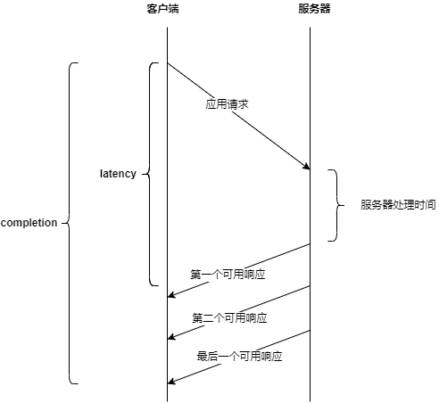

**注意：**

- 对延迟进行优化的设计常常会产生延长完成时间的副作用，反之亦然。

#### 网络效率

最佳的应用性能是通过不使用网络而获得的。

> The best application performance is obtained by not using the network.

这基本上意味着对于一个基于网络的应用，最高效的架构风格是：`能够有效地将对于网络的使用减到最少的架构风格`。

要做到对网络使用的减少：

- 可以通过重用先前的交互（缓存）。
- 减少与用户动作相关的网络交互（复制数据和关闭连接操作）。
- 通过将对数据的处理移到距离数据源更近的地方（移动代码）来减少某些交互的必要性。

### 可伸缩性

> Scalability refers to the ability of the architecture to support large numbers of components, or interactions among components, within an active configuration. 

> Scalability can be improved by simplifying components, by distributing services across many components (decentralizing the interactions), and by controlling interactions and configurations as a result of monitoring.

**注意：**

- 论文中说的有点复杂，简单理解就是应用能够纵向扩容、水平扩容的能力。

### 简单性

### 可修改性

#### 可进化性

进化性代表了一个组件实现能够被改变而不会对其他组件产生负面影响的程度。

分为两个方面：

- 静态可进化性，基本上就是指的代码级别的修改。通常依赖于其实现是否加强了架构的抽象，因此这并非是任何特定架构风格所独有的。
- 动态可进化性，受到风格的影响。

#### 可扩展性

#### 可定制性

#### 可配置性

配置性是指：

组件可以支持在部署后（post-deployment）对于组件，或者对于组件配置的修改。这样组件能够使用新的服务或者新的数据元素类型。

很明显，可配置性既与可扩展性有关，也与可重用性有关。

#### 可重用性

如果一个应用的架构中的组件、连接器或数据元素能够在不做修改的情况下在其他应用中重用，那么该架构就具有可重用性。

### 可见性

风格也能够通过限制必须使用通用性的接口，或者提供访问监视功能的方法，来影响基于网络的应用中交互的可见性。

在这种情况下，可见性是指一个组件对于其他两个组件之间的交互进行监视或仲裁的能力。

### 可移植性

如果软件能够在不同的环境下运行，软件就是可移植的。

### 可靠性

从应用的架构角度来说，可靠性可以被看作当在组件、连接器或数据之中出现部分故障时，一个架构容易受到系统层面故障影响的程度。

架构风格能够通过以下方法提高可靠性：

- 避免单点故障
- 增加冗余
- 允许监视
- 用可恢复的动作来缩小故障的范围

## 基于网络的架构风格

当将架构风格应用于一种作为原型的基于网络的超媒体系统的架构时，将会导致一系列架构属性。

### 数据流风格（Data-flow Styles）

风格 | 继承于 | 网络性能 | 用户可查觉性 | 效率 | 可伸缩性 | 简单性 | 可进化性 | 可扩展性 | 可定制性 | 可配置性 | 可重用性 | 可见性 | 可移植性 | 可靠性
-|-|-|-|-|-|-|-|-|-|-|-|-|-|-
PF | | | ± | + | + | + | | + | + | | |
UPF | PF | - | ± | | | ++ | + | + | | ++ | ++ | + | |	 	 

#### 管道和过滤器（Pipe and Filter，PF）

在管道和过滤器风格中，每个组件（过滤器）从其输入端读取数据流并在其输出端产生数据流。

通常对输入流应用一种转换并增量地处理它们，以使输出在输入被完全处理完之前就能够开始。

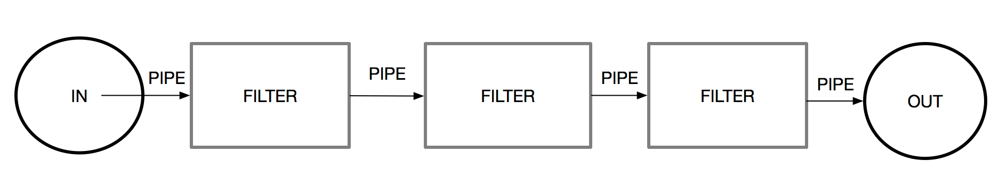

管道和过滤器风格的几个有利的属性：

- PF 允许设计者将系统全部的输入/输出看作个别的过滤器行为的简单组合（简单性）；
- PF 支持重用：任何两个过滤器都能够被连接（hooked）在一起，只要它们允许数据在它们之间传输（可重用性）；即过滤器很容易复用。
- PF 系统能够很容易地被维护和增强：新的过滤器能够被添加到现有的系统中（可扩展性）；
- 旧的过滤器能够被改进后的过滤器所替代（可进化性）；
- PF 允许一些特定类型的专门性分析（可验证性）
- PF 天生支持并发执行（用户可觉察的性能）。

#### 统一管道和过滤器（Uniform Pipe and Filter，UPF）

统一管道和过滤器风格在 PF 风格的基础上，添加了一个约束，即所有过滤器必须具有相同的接口。

在 Linux 或 Unix 中，统一管道意味着使用标准的管道：

- STDIN，标准输入
- STDOUT，标准输出
- STDERR，标准错误输出

在过滤器中，只需要使用这三个标准管道，就能够随意排列组合独立开发的过滤器，从而形成新的应用。这也**简化**了理解一个特定的过滤器如何工作的任务。

但是因为 STDIN、STDOUT 等无法直接传递结构体，必须要做序列化后传输，同时接收方需要反序列化，因此**降低了网络性能**。

### 复制风格（Replication Styles）

风格 | 继承于 | 网络性能 | 用户可查觉性 | 效率 | 可伸缩性 | 简单性 | 可进化性 | 可扩展性 | 可定制性 | 可配置性 | 可重用性 | 可见性 | 可移植性 | 可靠性
-|-|-|-|-|-|-|-|-|-|-|-|-|-|-
RR | | | ++ | | + | + | | | | | | | | +
$ | RR | | + | + | + | | | | | | | | |	 	 

#### 复制仓库（Replicated Repository，RR）

系统通过利用多个进程提供相同的服务，来改善数据的可访问性（accessibility of data）和服务的可伸缩性（scalability of service）。MySQL 主从复制就是一种 RR。

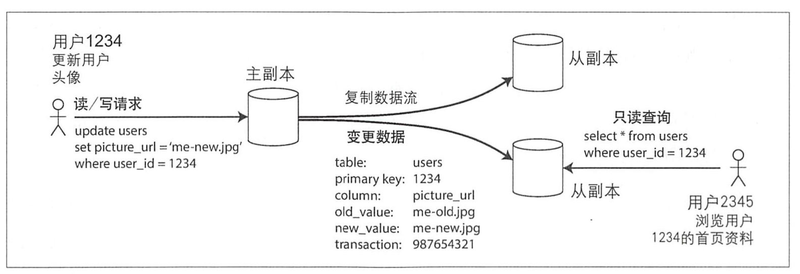

RR 风格的主要优点在于：

- 改善了**用户可觉察性**，实现途径是通过减少处理正常请求的延迟（本质上是把请求处理的负载分散到多个机器）。
- 改善了**可靠性**，Master 故障时支持部分操作（如 Slave 还可以支持读），Slave 故障时没有影响。
- 天然要求组件具有**可伸缩性**。

#### 缓存（Cache，$）

复制仓库风格的一种变体是缓存风格：复制个别请求的结果，以便可以被后面的请求重用。

通常有两种缓存方式：

- 行延迟复制（lazy replication）：当复制一个请求的尚未缓存的响应数据时，根据引用的局部性（locality of reference）和兴趣的趋同性（commonality of interest），将有用的数据项复制到缓存中以备稍后重用。
- 主动复制（active replication）：基于预测到的请求来预先获取可缓存的数据项。

**注意：**

- 延迟复制论文中说的有点复杂，简单来说就是请求来了后，缓存起来。
- 主动复制，一个简单的例子就是数据预热。

相比于 RR，缓存风格的性能更好，但是首次请求因为没有数据，所以用户可查觉性会降低（如果延迟大，则会非常严重）。

### 分层风格（Hierarchical Styles）

#### 客户-服务器（Client-Server，CS）

CS 风格在基于网络的应用的架构风格中最为常见：

- 服务器组件提供了一组服务，并监听对这些服务的请求。服务器通常是一个永不终止的进程，并且常常为多个客户端提供服务。
- 客户端组件通过一个连接器将请求发送到服务器，希望服务器处理。

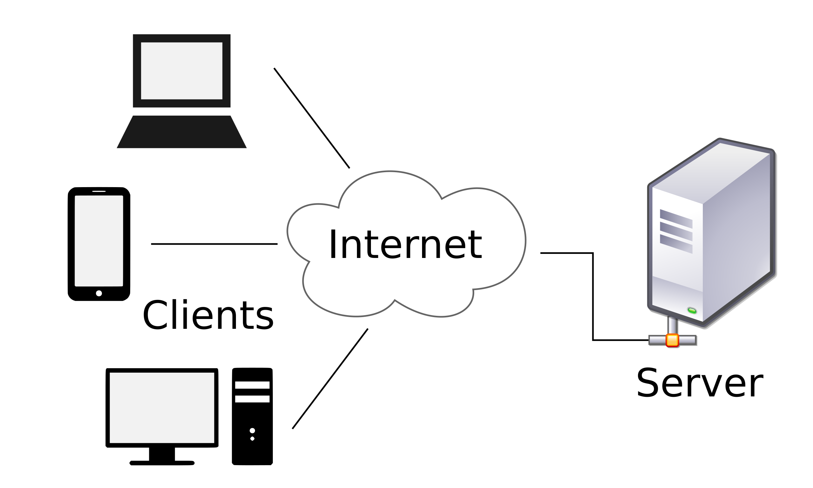

CS 的有利点是：

- 分离关注点是在客户-服务器约束背后的原则，优化了**简单性**。
- 功能的适当分离会简化服务器组件，从而提高**可伸缩性**。
- 将所有的用户接口（即用户界面）功能移到客户端组件中，只要接口不发生改变，这种分离允许两种类型的组件独立地**进化**。

#### 分层系统（Layered System，LS）

一个分层系统是按照层次来组织的，每一层为在其之上的层提供服务，并且使用在其之下的层所提供的服务：

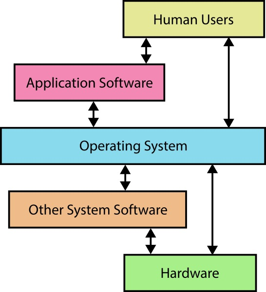

LS 的典型示例是 TCP/IP 和 OSI 协议栈。

分层的优点在于：

- 分层系统通过对相邻的外部层之外的所有层隐藏内部层，减少了跨越多层的耦合，从而改善了可进化性和可重用性。

分层的缺点在于：

- 增加了处理数据的开销和延迟，降低了用户可觉察的性能。

#### 分层-客户-服务器（Layered-Client-Server，LCS）

尽管分层系统被看作一种“单纯”的风格，但是它在基于网络的系统中的使用仅限于与客户-服务器风格相结合，形成 LCS。

LCS 相比于 CS，添加了 Proxy 组件和 Gateway 组件：

- 一个代理组件作为一个或多个客户端组件的共享服务器（a shared server），它接收请求并进行可能的转换后将其转发给服务器。
- 一个网关组件在客户端或代理看起来像是一个正常的服务器，但是事实上它将请求进行可能的转换后转发给了它的“内部层”（inner-layer）服务器。

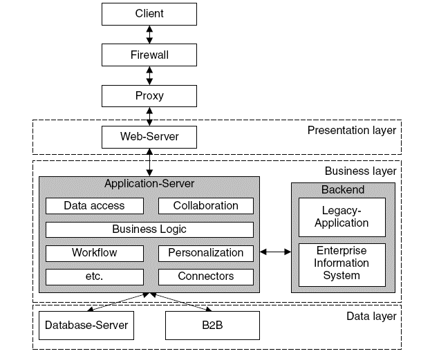

#### 客户-无状态-服务器（Client-Stateless-Server，CSS）

客户-无状态-服务器风格源自客户-服务器风格，并且添加了额外的约束：在服务器组件之上不允许有会话状态。

从客户端发到服务器的每个请求必须包含理解请求所必需的全部信息，不能利用任何保存在服务器上的上下文（context），会话状态全部保存在客户端。

主要有三方面优势：

- 可见性的改善是因为监视系统再也不必为了确定请求的全部性质而查看多个请求的数据。
- 可靠性的改善是因为这些约束简化了从部分故障中恢复的任务。
- 可伸缩性的改善是因为不必保存多个请求之间的状态，允许服务器组件迅速释放资源并进一步简化其实现。

因为每次都要 Client 发送上下文，因此会降低网络性能。

#### 客户-缓存-无状态-服务器（Client-Cache-Stateless-Server，C$SS）

一个缓存在客户端和服务器之间扮演一个仲裁者：早先请求的响应能够（如果它们被认为是可缓存的）被重用，以响应稍后的相同请求，如果将该请求转发到服务器，得到的响应可能与缓存中已有的响应相同。

它们有可能部分或全部消除一些交互，从而提高**效率**和**用户可觉察的性能**。

#### 分层-客户-缓存-无状态-服务器（Layered-Client-Cache-Stateless-Server，LC$SS）

分层-客户-缓存-无状态-服务器风格通过添加代理和/或网关组件，继承了 LCS 和 C$SS。使用此风格的范例系统是 Internet 域名系统（DNS）。

#### 远程会话（Remote Session，RS）

RS 风格是 CS 风格的一种变体，并且和无状态的相反。它试图使客户端组件的复杂性最小化或者使得它们的可重用性最大化。

每个客户端在服务器上启动一个会话，然后调用服务器的一系列服务，最后退出会话。应用状态被完全保存在服务器上。

例如 TELNET 等通用客户端。

RS 风格的优点是：

- 集中维护在服务器的接口更加容易；
- 当对功能进行扩展时，减少了已部署的客户端中的不一致问题；
- 如果交互利用了服务器上扩展的会话上下文，它能够提高效率。

RS 的缺点是：

- 由于要在服务器上保存应用状态，降低了服务器的可伸缩性；
- 因为监视程序必须要知道服务器的完整状态，降低了交互的可见性。

#### 远程数据访问（Remote Data Access，RDA）

### 移动代码风格

移动代码指的是，动态地改变在处理过程与数据源或结果目的地之间的距离。

风格 | 继承于 | 网络性能 | 用户可查觉性 | 效率 | 可伸缩性 | 简单性 | 可进化性 | 可扩展性 | 可定制性 | 可配置性 | 可重用性 | 可见性 | 可移植性 | 可靠性
-|-|-|-|-|-|-|-|-|-|-|-|-|-|-
VM | | | | | | ± | | + | | | | - | + |
REV | CS + VM | | | + | - | ± | | + | + | | | - | + | -
COD | CS + VM | | + | + | + | ± | | + | | + | | - | | 
MA | REV + COD | | + | ++ | | ± | | ++ | + | + | | - | + | 

#### 虚拟机（Virtual Machine，VM）

所有的移动代码风格的基础是 VM 风格，这里的 VM 不是指的对操作系统的虚拟，而是脚本语言的引擎，例如 JAVA 虚拟机。

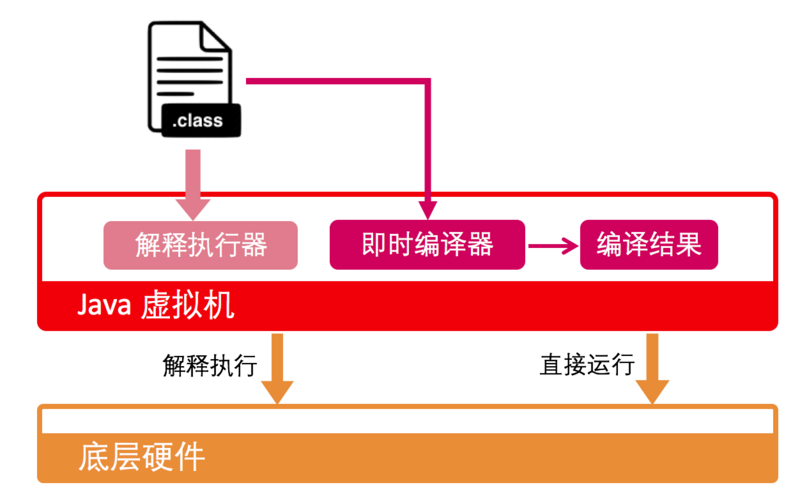

虚拟机带来的主要好处是：

- 在一个特定平台上分离了指令（instruction）和实现（implementation），提升了**可移植性**。
- 并且使**可扩展性**变得容易。

VM 的主要缺点在于：

- 因为难以简单地通过查看代码来了解可执行代码将要做什么事情，因此降低了**可见性**。
- 由于需要对求值环境（evaluation environment）进行管理，也降低了**简单性**，但在一些情况下可以通过简化静态的功能（static functionality）得到补偿。

#### 远程求值（Remote Evaluation，REV）

REV 来自于 VM 和 CS 风格。

一个客户端组件必须要知道如何来执行一个服务，但缺少执行此服务所必需的资源（CPU 周期、数据源等等），这些资源恰好位于一个远程站点上。

客户端将如何执行服务的代码发送给远程站点上的一个服务器组件，服务器组件使用可用的资源来执行代码，然后将执行结果发送回客户端。

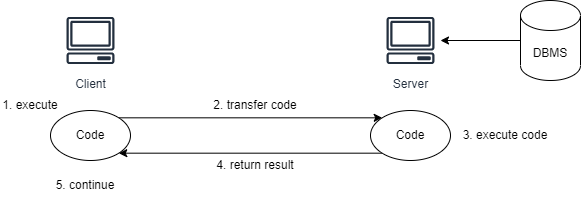

远程求值风格的优点包括：

- 能够定制服务器组件的服务，这改善了**可扩展性**和**可定制性**；
- 当代码能够使它的动作适应于服务器内部的环境（而不是客户端做出一系列交互来做同样的事情）时，能够得到更好的**效率**；

REV 的缺点在于：

- 由于需要管理求值的环境，降低了**简单性**，但在一些情况下可以通过简化静态的服务器功能得到补偿。
- **可伸缩性**降低了，但是可以通过服务器对执行环境的管理（杀掉长期运行的代码，或当资源紧张时杀掉大量消耗资源的代码）加以改善。
- 会导致与部分故障和可靠性相关的难题。
- 最大的限制是，由于客户端发送代码而不是标准化的查询，因此缺乏**可见性**。
- 如果服务器无法信任客户端，缺乏可见性会导致明显的部署问题。

个人认为早期 PHP 等在服务器上渲染页面，直接返回浏览器 HTML，就是一种 REV。

#### 按需代码（Code on Demand，COD）

COD 是 REV 反过来，Client 知道资源如何获取，但是不知道怎么处理，由 Server 将处理代码发送给 Client 进行处理。

> a client component has access to a set of resources, but not the know-how on how to process them. It sends a request to a remote server for the code representing that know-how, receives that code, and executes it locally.

COD 风格的优点包括：

- 能够为一个已部署的客户端添加功能，改善了**可扩展性**和**可配置性**；
- 当代码能够使它的动作适应于客户端的环境，并在本地与用户交互而不是通过远程交互时，能够得到更好的**用户可觉察性能**和**效率**。
- 由于服务器将工作交给了客户端（否则将消耗服务器的资源），从而改善了服务器的**可伸缩性**。

COD 风格的缺点包括：

- 由于需要管理求值环境，降低了**简单性**，但在一些情况下可以通过简化静态的客户端功能得到补偿。
- 像远程求值风格一样，最大的限制是由于服务器发送代码而不是简单的数据，因此缺乏**可见性**。如果客户端无法信任服务器，缺乏可见性会导致明显的部署问题。

个人认为现在的 vue.js 等将很多逻辑做到 client，就是一种 COD（毕竟执行的代码还是放在 Server 上的）。

#### 分层-按需代码-客户-缓存-无状态-服务器（Layered-Code-on-Demand-Client-Cache-Stateless-Server，LCODC$SS）

这里是作为架构风格互补的例子：

因为代码被看作不过是另一种数据元素，因此这并不会妨碍LC$SS 风格的优点。

该风格的一个例子是 HotJava Web 浏览器[java.sun.com]，它允许 applet 和协议扩展作为有类型的媒体（typed media）来下载。

LCODC$SS 风格的优点和缺点正是 COD 风格和 LC$SS 风格的优点和缺点的组合。

#### 移动代理（Mobile Agent，MA）

一个完整的计算组件，与它的状态、必需的代码、执行任务所需的数据一起被移动到远程站点。

该风格可以看作来源于远程求值风格和按需代码风格，因为移动性是同时以这两种方式工作的（传了代码、资源给对端进行执行）。

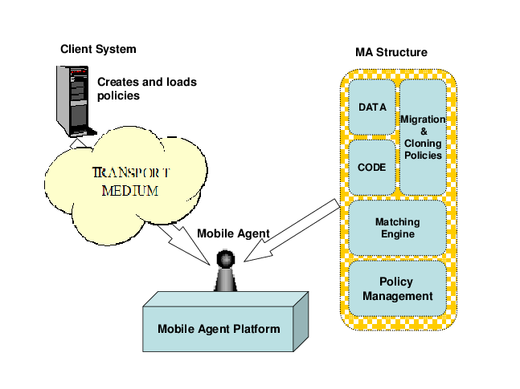

### 点对点风格

#### 基于事件的集成（Event-based Integration，EBI）

#### C2

#### 分布式对象（Distributed Objects，DO）

DO 风格将系统组织为结对进行交互的组件的集合。

一个对象是一个实体，这个实体封装了：

- 一些私有的状态信息或数据、操作数据的一组相关的操作或过程
- 一个可能存在的控制线程，这种封装使得它们能够被整体地看作单个的单元

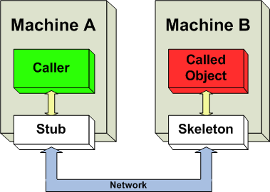

通常，一个对象的状态对于所有其他对象而言，是完全隐藏和受到保护的。检查或修改对象状态的唯一方法是：

- 对该对象的一个公共的、可访问的操作发起请求或调用。

这样就为每个对象创建了一个良好定义的接口，在对象的操作实现和它的状态信息保持私有的同时，公开操作对象的规格，这样做改善了可进化性。

其实 JAVA RMI、RPC 等就是 DO 的实际应用例子。

一个对象为了与另一个对象交互，它必须知道另一个对象的标识。当一个对象的标识改变时，它必须对所有显式调用它的其他对象做修改。

这就必需要有一些控制器对象来负责维护系统的状态，以完成应用的需求。分布式对象系统的核心问题包括：对象管理、对象交互管理和资源管理。

#### 被代理的分布式对象（Brokered Distributed Objects，BDO）

为了降低对象标识的影响，现代分布式对象系统通常使用一种或更多种中间风格来辅助通信。

## REST 的推导

REST 中文翻译中也经常称之为 “表现层状态转移”。

## REST 架构元素

REST 风格是对`分布式超媒体系统中的架构元素`的一种抽象：

> The Representational State Transfer (REST) style is an abstraction of the architectural elements within a distributed hypermedia system.

REST 忽略了组件实现和协议语法的细节，以便聚焦于以下几个方面：

- 组件的角色
- 组件之间的交互之上的约束
- 组件对重要数据元素的解释

### 数据元素

一个分布式超媒体系统的架构师仅拥有三种基本的选项：

1. 在数据的所在地对数据进行呈现，并向接收者发送一个固定格式的映象（a fixed-format image）；
1. 将数据和呈现引擎封装起来并将两者一起发送给接收者；
1. 发送原始数据和一些描述数据类型的元数据，这样接收者就能够选择它们自己的呈现引擎。

REST 提供的是所有三种选项的一个混合体。

数据元素 | 现代 Web 示例
-|-
资源 | 一个超文本引用意图指向的概念上的目标
资源标识符 | URL、URN
表述（Representations） | HTML 文档、JPEG 图片
表述元数据 | 媒体类型、最后修改时间
资源元数据 | 源链接、alternates、vary
控制数据 | if-modified-since、cache-control

#### 资源和资源标识符

REST 对于信息的核心抽象是资源。

任何能够被命名的信息都能够作为一个资源：一份文档或一张图片、一个与时间相关的服务（例如，“洛杉矶今日的天气”）、一个其他资源的集合、一个非虚拟的对象（例如，人）等等。

一个资源是到一组实体的概念上的映射，而不是在任何特定时刻与该映射相关联的实体本身。

更精确地说，资源 R 是一个随时间变化的成员函数 MR(t)，该函数将时间 t **映射**到等价的一个实体或值的集合，集合中的值可能是资源的**表述**或资源的标识符。

一个资源可以映射到空集，这允许在一个概念的实现存在之前引用这个概念。

这里也同时对静态资源和动态资源做了说明：

- 一些资源在它们被创建后的任何时刻来检查，它们都对应着相同的值的集合，从这个意义上说它们是静态的。
- 动态资源所对应的值则会随时间而频繁地变化。

对于一个资源来说，唯一必须是静态的是映射的语义，因为语义才是区别资源的关键。

对资源的这一抽象的定义使得 Web 架构的核心功能得以实现：

- 首先，它通过包含了很多信息来源而没有人为地通过类型或实现对它们加以区分，从而实现了通用性。
- 其次，它允许引用到表述的延迟绑定（late binding），从而支持基于请求的性质来进行内容协商。
- 最后，它允许一个创作者引用一个概念而不是引用此概念的某个单独的表述，从而使得当表述改变时无须修改所有的现有链接（假设创作者使用了正确的标识符）。

#### 表述（Representations）

REST 组件通过以下方式在一个资源上执行动作：

- **使用一个表述来捕获资源的当前的或预期的状态、在组件之间传递该表述。**

一个表述是一个字节序列，以及描述这些字节的表述元数据。表述的其他常用但不够精确的名称包括：文档、文件、HTTP 消息实体、实例或变量。

表述的组成：

- 数据
- 描述数据的元数据，分为两种：
  - 表述元数据（特定于所提供的表述，例如媒体类型从，编码类型等）
  - 资源元数据（关于资源的元数据，并非特定于所提供的表述）
- 描述元数据的元数据组成（例如对消息完整性的验证）

控制数据，不属于表述的组成，但它定义了组件之间的消息的用途。例如通过 if-modified-since 修改缓存的行为。

### 连接器

REST 使用多种不同的连接器类型来对访问资源和转移资源表述的活动进行封装。

REST 连接器：

连接器 | 现代 Internet 例子 | 备注
-|-|-
客户端 | libwww、libwww-perl
服务器 | libwww、Apache API、NSAPI
缓存 | 浏览器缓存、Akamai 缓存网络
解析器（resolver） | DNS
隧道（tunnel） | SOCKS、HTTP 连接之后的 SSL

所有的 REST 交互都是无状态的。也就是说，无论之前有任何其他请求，每个请求都包含了连接器理解该请求所必需的全部信息。

无状态这个约束能够实现四个功能：

1. 它使得连接器无需保存请求之间的应用状态，从而降低了物理资源的消耗并改善了可伸缩性；
1. 它允许对交互进行并行处理，处理机制无需理解交互的语义；
1. 它允许中间组件孤立地查看并理解一个请求，当需要对服务作出动态安排时，这是必需要满足的；
1. 它强制每个请求都必须包含可能会影响到一个已缓存响应的可重用性的所有信息。

连接器传入参数：

- 请求的控制数据
- 一个表示请求的目标的资源标识符
- 一个可选的表述

连接器其传出参数：

- 响应的控制数据
- 可选的资源元数据
- 一个可选的表述组成。

从一种抽象的观点来看，调用是同步的，但是传入参数和传出参数都可以作为数据流来传递。换句话说，处理可以在完全知道参数的值之前进行，从而避免了对于大量数据转移进行批量处理而产生的延迟。

主要的连接器类型是客户端和服务器。两者之间的本质区别是：

- 客户端通过发送请求来发起通信；
- 服务器侦听连接并对请求作出响应，以便为其服务提供访问的途径。
- 一个组件可能包括客户端和服务器两种连接器。

第三种连接器类型是缓存连接器：可以位于客户端或服务器连接器的接口处，以便保存当前交互的可缓存的响应，这样它们就能够被以后的请求交互来重用。

- 客户端可以使用缓存来避免重复的网络通信。
- 服务器可以使用缓存来避免重复执行生成响应的处理。

一个解析器负责将部分或完整的资源标识符翻译成创建组件间连接所需的网络地址信息。

### 组件

REST 组件根据它们在整个的应用动作（application action）中的角色来进行分类：

组件 | 现代 Web 实例
-|-
来源服务器（Origin Server） | Apache HTTP、微软 IIS
网关（Gateway） | Squid、CGI、反向代理
代理（proxy） | CERN 代理、Netscape 代理、Gauntlet
用户代理（user agent） | Netscape Navigator、Lynx、MOMspider

**用户代理：**

> 一个用户代理使用一个客户端连接器发起请求，并成为响应的最终接收者。最常见的例子是一个 Web 浏览器，它提供了对信息服务的访问途径，并且根据应用的需要呈现服务的响应。

**来源服务器：**

> 一个来源服务器使用一个服务器连接器管理被请求资源的名字空间。来源服务器是其资源表述的权威数据来源，并且必须是任何想要修改资源的值的请求的最终接收者。

每个来源服务器都为其服务提供了一个以资源的层次结构形式出现的通用的接口。资源的实现细节被隐藏在这一接口的背后。

**代理组件：**

由客户端选择的中间组件，用来为其他的服务、数据转换、性能增强（performance enhancement）、或安全保护（security protection）提供接口封装。

**网关（也叫作反向代理）组件：**

由网络或来源服务器强加的中间组件，用来为其他的服务、数据转换、性能增强，或安全增强（security enforcement）提供接口封装。

需要注意的是，代理和网关之间的区别是，何时使用代理是由客户端来决定的。

## REST 架构视图

使用架构视图来描述这些元素如何协作以形成一个架构。

为了展示 REST 的设计原则，需要使用三种视图——过程视图、连接器视图、数据视图。

### 过程视图

过程视图的主要作用是，通过展示数据在系统中的流动路径，得出组件之间的交互关系。

**注意：**

- 一个真实系统的交互通常会涉及到大量的组件，导致整体的视图因受到细节的干扰而模糊不清。

一个用户代理正处在三个并行交互（a、b 和 c）的中途：

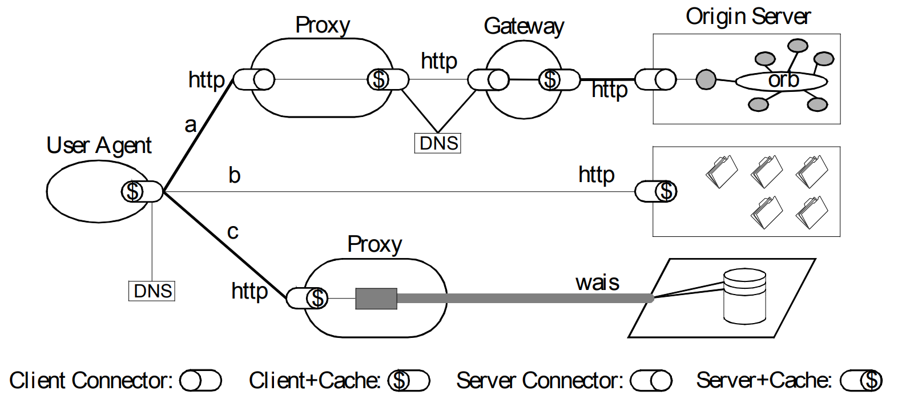

请求(a)：

- 被发送到一个本地代理
- 代理随后访问一个通过 DNS 查找发现的缓存网关
- 网关将这个请求转发到一个能够满足该请求的来源服务器
- 来源服务器的内部资源由一个封装过的对象请求代理（object request broker）架构来定义。

请求(b)：

- 直接发送到一个来源服务器，它能够通过自己的缓存来满足这个请求。

请求(c)：

- 被发送到一个代理
- 代理它能够直接访问 WAIS（一种与 Web 架构分离的信息服务），并将 WAIS 的响应翻译为一种通用的连接器接口能够识别的格式。

每一个组件只知道与它们自己的客户端或服务器连接器的交互；整个过程拓扑是我们的视图的产物。

### 连接器视图

架构的连接器视图集中于组件之间的通信机制。对一个基于 REST 的架构而言，我们对定义通用资源接口的约束尤其感兴趣。

客户端连接器检查资源标识符，以便为每个请求选择一个合适的通信机制。

Web 的主要转移协议是 HTTP，但是 REST 架构也包括了对来自 Web 出现之前就已存在的网络服务器的资源，包括 FTP、Gopher 和 WAIS 的无缝地访问。

### 数据视图

一个架构的数据视图展示了信息在组件之间流动时的应用状态。

组件之间的交互以动态改变尺寸的消息的形式来进行：

- 小粒度的或中等粒度的消息用来控制交互的语义
- 应用的大部分工作需要通过包含一个完整的资源表述的大粒度消息来完成。

请求的语义的最常见形式是获取资源的一个表述（例如 HTTP 中的“GET”方法），通常我们可以对其进行缓存以便以后重用。

REST 将所有的控制状态（control state）都浓缩在从交互的响应中接收到的表述之中。其目的是通过使服务器无须维护当前请求之外的客户端状态，从而改善服务器的可伸缩性。

一个应用状态因此由以下几方面来定义：

- 阻塞的请求（pending requests）
- 相连接的组件（有些可能是过滤被缓冲的数据）的拓扑结构
- 连接器上活跃的请求
- 请求响应中表述的数据流
- 当用户代理接收到这些表述时对表述的处理

为基于 REST 的架构主要通过转移资源的表述来进行通信，所以延迟会同时受到通信协议的设计和表述数据格式的设计两方面的影响。

REST 的模型应用是一个引擎，它通过检查和选择当前的表述集合中的状态跃迁选项，从一个状态移动到下一个状态。

**注意：**

- 资源本身是在 Server 的，传递资源 ID 也是无状态的。

## 经验与评估

### Web 标准化

### REST 应用于 URI

统一资源标识符（URI）既是 Web 架构的最简单的元素，也是最重要的元素。URI 标准定义术语 “资源” 本身也是通过 REST 来定义的。

URI 还有很多的名称：WWW 地址、通用文档标识符、通用资源标识符、以及最后出现的统一资源定位器（URL）和统一资源名称（URN）的组合。

### REST 应用于 HTTP

## 参考文献

1. [架构风格与基于网络的软件架构设计](https://docs.huihoo.com/rest/REST_cn.pdf)
1. [软件架构风格software architecture style 总结](https://zhuanlan.zhihu.com/p/84605649)
1. [什么是 RESTful API？](https://aws.amazon.com/cn/what-is/restful-api/)
1. [what is overhead, payload, and header](https://stackoverflow.com/questions/24879959/what-is-overhead-payload-and-header)
1. [What's the difference between Architectural Patterns and Architectural Styles?](https://stackoverflow.com/questions/3958316/whats-the-difference-between-architectural-patterns-and-architectural-styles)