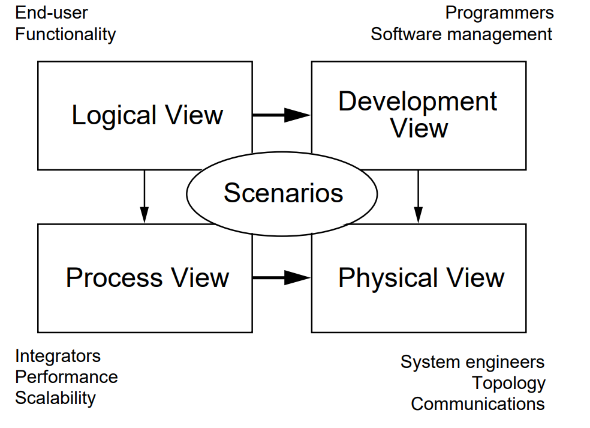
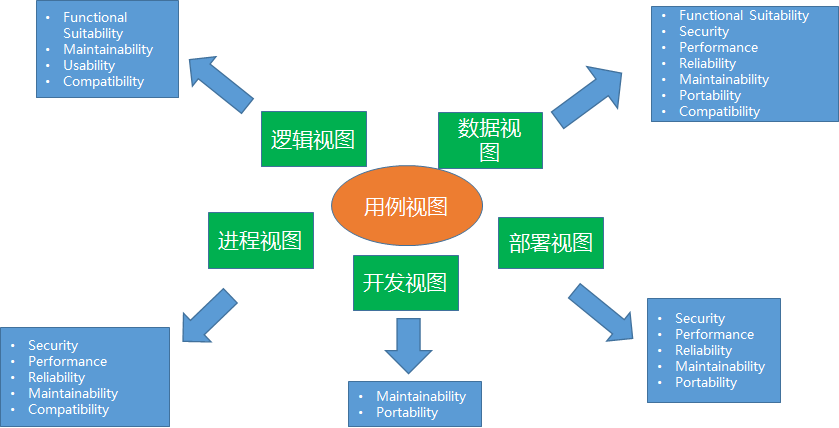

# RUP: 4+1

[TOC]

## 概览

RUP 4+1 表示了 5 种视图，如下所示：

视图描述如下表所示：

视图名称 | 中文名 | 视图描述
-|-|-
Logic View | 逻辑视图 | -
Process View | 进程视图 | -
Development View | 开发视图 | -
Physical View | 物理视图 | -
Scenarios | 用例视图 | -

## 5+1 视图

RUP 4+1 是在 1995 年提出的架构视图了，而现在越来越多的开始使用 5+1 视图了：

相比于 RUP 4+1，增加了数据视图。具体内容请参考 [架构视图：5+1 视图](../view51/readme.md)。

## References

1. [Architectural Blueprints—The “4+1” View Model of Software Architecture](https://www.cs.ubc.ca/~gregor/teaching/papers/4+1view-architecture.pdf)
