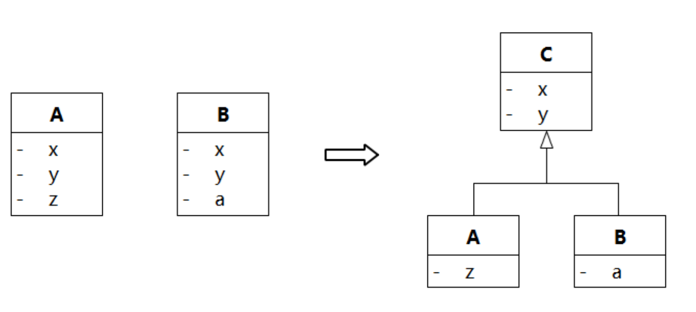

# 软件方法——业务建模和需求

[TOC]

## 概述

本文是对《软件方法上》一书的概括梳理。

软件方法官网：

http://www.umlchina.com/book/softmeth.htm

题目自测链接：

http://www.umlchina.com/book/softmethbarcode.htm

## 建模和 URL

《软件方法》一书中，聚焦了两个点：需求和设计。

对此，需求和设计的目的是：

- 软件开发中，需求工作的目的是：`让系统更加好卖`。
- 软件开发中，设计工作的目的是：`降低开发维护成本`。

之所以聚焦于此，是因为：

```txt
利润 = 收入 - 成本
```

换句话说，也就是：

```txt
利润 = 需求 - 设计
```

我们要赚钱，就要把需求做的好（增加收入），把设计也做的好（减少成本）。

需求（功能）和设计并不能直接映射，《软件方法》一书中使用**人体功能**举例：

> 人体的功能是走路、跑步、跳跃等，但是设计人体结构时不会直接从需求（功能）映射到设计，得到 “走路子系统”、“跑步子系统”。反而我们人体结构的子系统设计是 “呼吸子系统”、“消化子系统”、“神经子系统”。

需求和设计的区别如下：

需求 | 设计
-|-
卖的视角 | 做的视角
具体 | 抽象
产品当项目做 | 项目当产品做

### 建模工作流

进行建模时，主要是有以下几步：

序号 | 工作流 | 描述 | 输出
-|-|-|-
1 | 业务建模 | 描述组织内各系统的协作在，是的组织可以为其他组织提供有价值的服务。<br>我们研发的系统只不过是组织为了提供更好的服务，而购买的零件。| 1. 愿景<br>2. 业务用例图<br>3. 业务序列图
2 | 需求建模 | 为了解决组织的问题，系统需要具有的能力，这包括：功能性需求和非功能性需求。| 系统用例图
3 | 分析建模 | 为了满足功能需求，系统需要封装核心域机制。| 1. 分析序列图<br>2. 概念模型<br>3. 状态机图（可选）<br>4. 系统上下文图
4 | 设计建模 | 核心域机制如何映射到特定平台上的实现。| 1. 数据模型<br>2. -

### UML 应用于建模工作

UML 图形一共有十四种，可见下图叶子节点所示：


通常我们并不会用上所有的 UML 图形，根据建模工作流不同的阶段，推荐使用的 UML 图是不同的，如下表所示：

工作流 | 思考焦点 | 可选 UML 元素 | 推荐 UML 元素
-|-|-|-
业务建模 | 组织内系统之间 | 用例图、类图、序列图、活动图 | 例图、类图、序列图
需求 | 系统边界 | 用例图、序列图、状态机图、活动图、文本 | 用例图、文本
分析 | 系统内核心域 | 类图、序列图、状态机图、活动图、通信图、包图 | 类图、序列图、（状态机图）
设计 | 系统内各域之间 | 类图、序列图、状态机图、活动图、通信图、组件图、部署图、时间图、组合结构图、包图 | 不画，代码即设计

**注意：**

- 本人并不赞同设计阶段不做任何画图。例如设计阶段可以拆分子系统，将领域实体映射到数据库表等。

## 愿景（业务建模）

愿景是业务建模的第一步，一切的需求均来源于愿景，同时愿景也是需求的重要性排序的唯一依据。

那什么是愿景？《软件方法》中指出：

> 在目标组织代表（老大）看来，引进系统给组织带来的改进。

也就是说，找愿景本质就是在找：

- 卖给谁？
- 对他有什么好处？

最终我们会在建模中得到愿景：


### 定位目标组织和老大

首先我们要定位我们卖给谁，卖给谁分为两个部分：

- 目标组织：待引入系统将改进其流程的组织。可以是一个机构，也可以是一个人群。
- 老大：目标组织的代表。老大是一个具体的人，是最优先照顾利益的那个人。

即我们要做的东西，需要思考卖给的目标组织是谁，谁使用我们的系统。更加`口语话`的描述：

- 目标组织，即**用户**。
- 老大，即**用户代表**。

为了找到对应的组织和老大，通常需要分三种情况来考虑：

序号 | 情况 | 系统改进范围 | 定位老大的步骤
-|-|-|-
1 | 针对人群的非定制系统 | 某个人群 | 1）定位目标人群；<br>2）定位老大
2 | 针对某特定机构的定制系统 | 某特定机构 | 1）定位机构范围；<br>2）定位机构的老大
3 | 针对某类机构的非定制系统 | 某类机构 | 1）定位机构范围<br>2）定位目标机构；<br>3）定位机构的老大

#### 定位情况1：定位目标人群和老大

该情况的系统，通常是改善个人的工作，但是并没有某个特定的个人，即所有人都可以购买和使用。例如 QQ、WeChat 等。

即使如此，也要做出取舍，思考最先照顾哪个人群的利益，因为不同人群对系统的要求是不同的。例如 QQ 更加针对年轻人，可乐更加针对青少年，红牛针对熬夜加班的打工族。

我们需要强迫自己思考细分领域：

> 定位目标人群和老大的思考方法是不断追问 “谁比谁更像” 并且 “为什么”。

需要警惕以下**错误**：

- 从功能加上 “人群” 二字得到目标人群（错误示例：餐厅的目标人群是“吃饭人群”，正确示例：餐厅的目标人群是“四川人”，即川菜馆）。
- 老大的选择吃窝边草（错误示例：目标人群是邻居王大爷。正确的做法应该是深入一线调研，找出具有代表意义的老大）。
- 虚构老大（需要深入一线掉哟，找出具有事实上存在的，具有代表意义的老大，当然也要给出原因）。

#### 定位情况2：定位机构范围和老大

该情况的系统，改进的目标组织是个机构，机构可能是一个公司、一个政府单位、一个部门、一个小组、一个家庭。

**注意：**

- 这里`目标组织`和`目标机构`，是相同的概念。

可能一次性并没办法确定机构范围，经常回进行反复调整：

- 如果所圈定的目标机构内部的流程和改进相关度太低，则可能机构圈大了。
- 如果发现改进的流程还未涉及，则可能圈小了。

这里有两种快速确定的方法：

- 从系统名字考虑能否推测范围。例如 “XXX 企业管理系统”，目标组织很可能就是 XXX 企业。
- 画个圈，把大多数可能被替换的系统框进去，观察其所属。

需要警惕以下**错误**：

- 目标机构的 IT 主管是老大。目标机构的 IT 部门及其老大通常是对接方，而不是要改善他们的流程，改善的是业务部门的流程。
- 机构之上的大领导是老大。
- 谁出钱谁就是老大。
- 把其他涉众（受影响的人）当作老大。

#### 定位情况3：定位目标机构

该情况下，系统为某一类机构服务（而不是某个特定机构），因此我们需要定位目标机构，方法情况 1 中定位目标人群是类似的。

### 提炼改进目标

当我们确认了目标组织和老大后，就需要再确定愿景中的改进目标，即对目标组织和老大有什么好处。

并且改进目标应该是`可以度量的`。

改进目标是 `系统改善组织行为的指标`，而不是 `系统能做某事`，后者是系统的功能性需求。

正确的目标示例：

- 提高回访订单转化率
- 减少每张处理订单需要的人力
- 缩短评估贷款风险的周期

特别的，我们针对形容词形式的目标需要额外注意，要深挖内涵，思考度量方式。例如：

- 更规范。思考目前是什么不规范，通过这样的思考得到的度量可能是 “格式不合格的报表所占比例”。
- 更方便。思考目前是什么不方便。通过这样的思考得到的度量可能是 “完成一张订单的平均操作次数”。
- 更高效。思考目前是什么不高效。通过这样的思考得到的度量可能是 “从受理到发证的时间周期”。

也可以通过倒推的方式思考：假设没有这个系统，涉众需要付出什么代价。

同时，我们应该要明确，改进的目标是系统带来的，而非是过大的目标，或者其他业务机制带来的目标。

当有多个目标时，需要对目标排序，尤其是根据老大的关心程度进行排序。

## 业务用例图（业务建模）

在找准组织以及组织的目标后，就可以对组织进一步分析了。

`业务` 一次通常是指的核心域只是，但是 `业务建模` 中的 `业务` 一次，代表的是组织级别的知识。

也就是说 `业务建模` 等于 `组织建模`。

业务建模真实的目的是为了得到待引进软件系统的需求（即得到需求建模的`系统用例图`）。

在业务建模工作流中，我们回从两个视角来研究组织：

- 组织是价值的集合（外观），用业务用例图表示。
- 组织是系统的集合（内部），用业务序列图表示。

本节主要是针对业务用例图，及其两个组成：

- 业务执行者（Business Actor）
- 业务用例（Business User Case）

### 识别业务执行者

什么是业务执行者？按《软件方法》中的描述：

> 以某组织为研究对象，在组织之外和组织交互的其他组织（人群或机构）就是该组织的执行者。

**注意：**

- 因为是业务建模（组织建模），所以执行者一定得是组织（人群或者机构），而不能是系统。
- 业务执行者一定是组织外的，而不是组织内的。
- 组织内的人叫做业务工人（Business Worker），业务工人不会在业务用例图中反应出来，因为他们是组织内的人（业务用例图是外观）。
- 组织内的系统叫做业务实体（Business Entity），业务实体不会在业务用例图中反应出来，因为他们是组织内的系统（业务用例图是外观）。

下图错误原因是业务执行者标识成了`系统`：


把观察的焦点对准组织的边界，看看边界外有哪些人群或机构和它交互，交互可以是主动，也可以是被动的：

- 主执行者：业务执行者需要用到组织的价值。
- 辅助执行者：组织需要借助该执行者实现的价值。

**注意：**

- 不能机械的认为主执行者被动收到组织的请求，就是被动的（能够获得组织的价值，就是主执行者）。
- 主动业务执行者、被动业务执行者以及目标组织的抽象级别应该一致。
- 定时驱动的动作，一定不能把时间设置成业务执行者。
  - 系统定时的目的一定是为了实现系统的某个功能，系统的功能需要让组织对业务执行者输出价值（没有输出价值，就极可能是伪需求）。
- 系统用例图的执行者不可照此识别。
- `执行者不能被替换`，但是业务工人和业务实体可以（替换就是把图中的词删掉，能不能找个别的词，能找到就是能替换）。

《软件方法》中为主执行者和辅助执行者提供了一个示例（目标组织是 UMLChain）：


《软件方法》对此的解读是：

> “出版社→推广书籍→外部译者” 可以这样解读：为了给出版社提供推广书籍的服务，UMLChina 靠自己的力量不足以完成，需要找外部译者帮忙。或者这样解读：出版社向 UMLChina“购买”服务，UMLChina 向外部译者“购买”服务。

对于业务工人（Business Worker）和业务实体（Business Entity）需要进行额外的强调：

前者属于组织中的人群，后者属于组织中的系统，但是`属于`一词并**不代表物理上**的属于，而是在**责任层面**。即组织提供价值，是否需要它的参与。

例如：

- 医院的保安签约的劳动合同并非和医院，但是以医院为目标组织时，保安可以作为医院中的业务工人进行建模。
- 商户使用微信支付时，微信支付可以作为商户组织内的系统（业务实体）进行建模。

那么可能就有疑问了，业务工人、业务实体与辅助执行者都为完成组织的价值做贡献，那他们的区别是什么？

- 业务工人、业务实体是可以被替换的（保安可以被替换，所以保安是业务工人）。
- 执行者（包括辅助执行者）是不能被替换的。

执行者的 “不能替换” 一词，可以帮助建模人员思考组织的最本质的价值提供给谁（主执行者），以及真正需要的是谁（辅助执行者）来完成价值。

### 识别业务用例

业务用例指业务执行者希望通过和所研究组织交互获得的价值。

业务用例代表了组织的本质价值，很难变化，例如：商业银行提供的业务用例是 1）存款；2）取款；3）转账。


变化的是业务用例的实现：业务流程。业务流程可以看作是业务用例的实现，业务流程可以随着时代的变化而变化，但是业务用例很少发生变化。

这个思路对改进业务流程有非常大的帮助：先归纳出组织对外提供什么价值，再思考如何优化组织内部流程来实现这些价值。

什么是价值？

> 价值是期望和承诺的平衡点、买卖的平衡点。

不同的目标组织所提供的价值是不同的：


**注意：**

- 业务用例是相对离散的，通常不应该拆成多个步骤。因为业务用例就是价值本身。

识别系统用例的核心思路有两个：

1. 从业务执行者开始，思考执行者和组织交互的目的。
1. 观察组织内部的活动，一直问为什么，直到推出外部的某个业务执行者。

需要警惕以下错误：

1. 把业务工人的行为当作业务用例
1. 业务用例引随待引入系统伸缩
1. 把害怕漏掉的扩展路径片段提升为业务用例
1. 管理型业务用例

## 业务建模——业务序列图

在我们得到业务用例图后，就需要思考如何描述用例的实现，然后改进它。

### 描述业务流程的手段

我们通过什么方式来描述用例的业务流程呢？

通常而言有三种：

手段 | 描述 | 优点 | 缺点
-|-|-|-
文本 | 也就是用例的需求规约，描述为了实现用例，系统（或人）和系统（或人）之间交互的的每个步骤。| 非常详细的列出了每个步骤，甚至还可以列出非功能性需求。| 文本的形式从视觉上来看不够直观，理解起来费劲儿。
活动图 | 是一种流程图划分泳道的呈现方式。| 流行，且足够灵活。| 灵活意味着极可能导致复杂，并且主流的活动图很少把非人系统考虑进去。
序列图 | 把业务流程看作是一系列业务对象之间为了完成用例而进行的协作。| 直观，简单。| 不够灵活，对于复杂判断难以表达。

对于活动图的示例：


对于序列图的示例：


我们在业务建模时，不需要非常灵活的活动图，也不需要不够直观的文本呢，通常使用序列图。

**注意：**

- 系统用例的描述，通常需要详细的步骤，因此对于系统用例的描述可以使用文本。同时系统用例往往涉及到非功能需求，也可以通过文本进行描述。

### 业务序列图要点

业务序列图的要点可以概括为：

- 消息代表责任分配，而不是数据流动。
- 抽象级别是系统（或人）之间的协作。
- 只画核心域相关的系统。
- 把时间看作特殊的业务实体。

业务序列图，对象之间的交互是通过方法，那么业务序列图中的方法到底代表什么含义呢？

按《软件方法》中的描述：

> A 指向 B 的消息，代表 “A 请求 B 做某事”，或者 “A 调用 B 做某事的服务”。

所以，做某事是 B 的一个责任，消息代表这责任的转移，B 需要有做某事的能力。

**注意：**

- 业务序列图中的消息，代表的动作是责任，并且该动作不是 A 做某事，而是 B 做某事。
- 消息名称种不用带 “请求” 二字。
- 数据仅作为责任动作的输入输出的参数。

业务建模的研究对象是组织，因此出现在业务序列图生命线上的对象，最小颗粒是系统，包括人或非人系统：

- 业务执行者（主或辅助）
- 业务工人
- 业务实体

**注意：**

- 领域实体的概念无需出现在业务序列图中（例如订单实体，它通常是出现在分析序列图中）。
- 无需将非常细节的交互表露出来，细节的交互更多是放在分析序列图中。

我们通常而言只需要画出核心域相关的系统，那我们怎么判断是否为核心域呢？通常而言，判断错了也没关系，当后续发现列出来的系统和整个流程的改进没什么关系，再删掉就行了。

除此外，我们需要把时间看作特殊的业务实体。在《软件方法》中，把时间看作是一个我们所开发系统外的一个系统，且整个时间就只有一个时间系统。

时间系统驱动我们系统内部的`定时器类`，来触发时间相关的任务：


消息代表责任，我们让系统做的事情，需要系统真的能完成。

### 现状业务序列图

我们为了通过开发新系统改进当前流程，那么就要梳理出当前业务现状，以便找出其中的问题。

最重要的是，终于实际。需要警惕以下错误：

- 把想象中的改进当成了现状。
- 把现状理解为纯手工。通常而言，当前世界很少有纯手工的流程了，这不是二十年前。
- 把现状理解为 “开发团队未参与之前”。
- 把现状理解为规范。规范并不代表现状，实际可能会和规范有不同的地方，需要找出来。
- 认为自己是创新，没有现状。
- 认为自己做的是产品，没有现状。我们需要考虑目标组织的现状，找对目标组织，就很容易梳理了。

### 改进业务序列图

在有了现状业务序列图后，就要思考引入系统可以带来什么改进。

场景的模式有以下几种：

- 改进模式一：物流变信息流。即以系统的信息传递，代替原始的人和人之间信息传递。


- 改进模式二：改善信息流转。即通过引入新系统，减少人和众多系统的交互（人和太多系统交互，会让人的操作变得非常复杂）。


- 改进模式三：封装领域逻辑。即将人大脑中的核心域知识封装进系统，由系统完成领域逻辑。


除此外，《软件方法》还提到了通过阿布思考法来考虑如何进行改进：

- 第一步，假设由充足的资源去解决问题，得到一个完美的方案。
- 第二步，用手上现有的资源去山寨这个完美方案。

## 需求建模——系统用例图

业务建模的边界是组织，需求建模的边界时系统。在业务建模完成后，我们就需要放大其中需要研究的系统，思考该系统的用例图。

通常而言，业务序列图就可以直接导出系统用例图了。

系统用例图中有两个重要的元素：

- 系统执行者
- 系统用例

既然是系统用例图，那么首先我们需要思考，什么是系统：

> 封装了自身的数据和行为，能独立对外提供服务的东西才能称为系统。

### 系统执行者要点

系统执行者的定义：

> 在所研究的系统外，与该系统发生 “功能性交互” 的其他系统。

系统执行者不是所研究系统的一部分，而是边界外的另外一个系统。那么边界到底是什么含义呢？

> 系统边界不是物理的边界，而是责任的边界。

用更通俗的话来说，当 A 系统在 B 系统之外的意思是：实现系统 A 不属于研究系统 B 的研发团队的责任。

系统执行者必须和系统有交互，否则不能算是系统的执行者。例如旅客通过营业员进行购票，营业员使用售票系统售票，来实现旅客购票的期望。

除此外，交互一定是功能性交互（系统的功能需求），不能是非功能性交互：

- 例如通过 Windows 操作系统来和其他系统进行交互，属于非功能性交互。
- 例如标准输入输出设备系统和其他系统进行交互，属于非功能性交互。

Proxy 类型的系统（例如 Nginx、XForm 等），主要是实现用例中间的一个代理，功能本身并不是为 Proxy 提供的，因此 Proxy 系统不能称为系统执行者。

### 识别系统执行者

如果有了业务建模，则可以直接从业务序列图中推导出系统用例图。

### 系统用例要点

系统用例通常可以从业务序列图中获得，除此外我们还需要思考以下几点（也可以帮助我们反向思考业务序列图是否正确）：

- 价值是买卖的平衡点（即买者需要，卖者也能提供）。我们不应该思考系统 “做什么”，而是思考系统 “卖什么”（买房不一定是执行者，也可能是涉众）。
- 价值不等于 “可以这样做”。系统可以拿来做这个事情，但是这可能并不是系统的目标价值，这不算系统用例。
- 增删改查用例的根源是涉及映射需求。
- 不应该多个执行者 “复用” 用例。
- 系统用例不存在层次问题。
- 用例命名应该是动宾结构。

**注意：**

- 用例不一定是给执行者提供价值，但是一定是给涉众提供价值。例如时间系统作为执行者，它不需要系统给时间提供什么价值，但是一定是有个涉众的需要得到了满足。
- 《软件方法》一书中提到系统用例不应该通过 `<<include>>` 来进行用例的步骤划分，这一点是存在争议的。`<<include>>` 的目的之一其实就是为了对用例步骤的简化，特别是简化了用例规约。

### 识别系统用例

如果有了业务建模，则可以直接从业务序列图中推导出系统用例图。

系统用例有**主执行者**和**辅助执行者**：

- 主执行者：发起用例交互的系统。
- 辅助执行者：在交互过程中被动参与进来的。

**注意：**

- 系统将会借助辅助执行者的力量完成用例。
- 系统完成用例，对辅助执行者是强依赖的。若不是强依赖的，则不是辅助执行者。
- 一般来说，辅助执行者非人的情况较多。当发现辅助执行者是人的时候，需要特别小心。

`A ---> 用例 ---> B` 的含义是：系统为 A 提供用例，需要 B 的帮忙。

## 需求建模——用例规约

用例图标识了系统的目标，但是对于完整的需求而言这是不够的。我们需要为每个用例编写用例规约：

> 用例规约就是以用例为核心来组织需求内容的需求规约。

本质上，一个用例暗含了执行者与系统的的多次交互，用例规约会将这些交互描绘出来。

用例规约通常包含以下内容：

- 前置条件
- 后置条件
- 涉众利益
- 基本路径
- 补充路径
- 补充约束
  - 字段里欸包
  - 业务规则
  - 质量需求
  - 设计约束


### 前置条件和后置条件

前置条件和后置条件，以契约的形式表达需求。通过前置和后置条件，系统用例对外给出了承诺：

> 在满足前置条件时开始，按照主要基本步骤走，系统就能达到后置条件。

简而言之：

- 前置条件，用例开始前，系统需要满足的约束。
- 后置条件，用例成功结束后，系统需要满足的条件。

**注意：**

- 系统实现用例可能存在多个分叉的路径，后置条件只考虑基本路径。
- 前置条件和后置条件，都一定是系统可以检测到的（通常系统自身的状态，以及和系统的交互是可以检测到的，其他都可以认为无法检测）。
- 前置条件，必须是用例开始前可以检测到的。
- 前置后置条件，用核心词汇描述。避免 “系统正常运行”，“网络连接正常” 等废话。

### 涉众利益

需求由涉众利益的冲突和平衡来决定，因此我们需要首先识别涉众，再找到他们的利益。

我们通常如何寻找涉众呢？可以使用以下方式：

- 人类执行者。系统执行者不算。
- 上游，即执行者为系统提供的输入，相应的输入来源是什么，它可能是涉众。
- 下游，即系统做某个用例时，产生的后果会对他人带来影响，它可能是涉众。如果影响的是系统，那可能会影响系统背后的人。
- 信息的主人。和 “上游” 有点类似，但更加强调是数据的主人。

通常，我们如果梳理了业务序列图，其中就可以找打大部分的涉众了。

确认了涉众后，我们需要考虑每个涉众的利益，这个没有标准，只能靠思考和经验。但我们应该清醒的认识到，涉众利益是不会轻易改变的，如果一个涉众利益经常变化，那么多半找错涉众利益了。

### 基本路径

一个用例会有多个场景，其中有一个场景描述了最成功（或者最常见）的情况，这个场景被称作基本路径。

执行者和系统通常需要多个回合的交互，一个回合的交互通常由以下四部组成（即交互四部曲）：

- 请求
- 验证
- 改变
- 回应


通常而言，四步并非必填，但是请求是必须的，另外三步至少有一个。

**注意：**

- 和前置后置条件，路径上只能是系统能感知或承诺的内容。换而言之，一定是和系统的交互，没有和系统交互的部分不必写上去。
- 使用主动语句理清责任。
- 主语只能是`主执行者`或者`系统`。
- 使用核心域描述路径。
- 不要设计界面细节（本质上是因为界面细节通常不涉及核心域，例如我们不会关心通过按钮，还说通过其他方式来提交信息）。
- 不要设计交互细节。
- 需求是 “不这样不行”。

### 扩展路径

基本路径上的每个步骤，都有可能发生意外，其中某些意外是系统要处理的，这些路径通常就是扩展路径。

**注意：**

- 这里一定是意外，即处理异常情况。如果发现有不是意外的扩展路径，那需要思考下是否可以隔离成两个用例的基本路径，或者是合并为一条路径（例如有无缓存，可以合并为获取数据一个）。

扩展路径的标号方法，是再扩展步骤的数学序号加上字母序号：


任何牵涉到辅助执行者（即外部系统），都需要加补充路径，作为辅助执行者处理失败的意外处理。

**注意：**

- 能感知和要处理的意外才是扩展，例如 ATM 无法感知和处理用户心脏比突发的意外。
- 设计技能不足导致的错误不算扩展。因此系统内的代码 bug 等不算。
- 不引起交互行为变化的选择不是扩展。例如读数据库和读缓存，本质上都是读数据，交互行为不会有变化。这种规则上的区别，适合放到`补充规约`中。
- 界面跳转部署扩展。

### 补充约束

路径里面描述的需求往往是不完整的，例如：

- 工作人员输入讲座信息（讲座有些什么信息？）。
- 系统验证讲座信息充分（什么才算充分，验证什么内容？）。

为了解决路径中不完整的需求，我们添加补充约束。

补充约束前面的序号，代表了对应的路径的序号（路径的序号是唯一的，有分支则会加小写字母）。

我们通常会提供这些补充约束：

- 字段列表。描述某个领域的概念细节。
- 业务规则。描述步骤中系统运输的一些规则（例如校验规则等）。
- 质量需求，又叫做 `非功能性需求`，包括了：
  - 易用性（通常用户和系统交互过多，易用性越差）。
  - 性能。
  - 可用性。
  - 可支持性。
- 设计约束，在实现系统时必须遵守的一些约束，包括界面样式，报表格式，平台，语言等。这些虽然是设计部分的内容，但是一些重要的涉众可能会对设计提出要求，这也算需求的一部分，即设计约束。

## 需求启发

需求启发，即我们如何获得需求素材？

需求启发是独立于业务建模和需求建模的，要求我们在建模前了解涉众的真实需要，这样才能得到高质量的需求模型。

为了得到高质量的需求，我们可以通过以下方式：

- 和涉众交流的形式应该采用视图，而不是模型

不要用 UML 和涉众交流，因为涉众很可能并不懂 URL，应该用各种视图（例如大领导用 PPT，中层干部用文档，操作工用界面原型），会更方便涉众理解。

- 和涉众交流的内容应该聚焦涉众利益，而不是需求。

涉众不能直接提需求，因为涉众的需求只会站在自己的角度，实际的需求应该是各个涉众利益平衡后的结果。

因此，我们也不应该让涉众承担提需求的责任。

### 需求启发手段

需求启发，即获得需求素材，那我们怎么去得到我们的需求呢？通常有以下手段可以启发我们得到需求：

- 研究资料。为了获得核心域的初步知识，为下一步的启发工作做准备。
- 问卷调查。有个比较有意思的点，如何排除无效问卷？可以设置很难犯错误的诱导问题，如果问卷在该问题上犯错，就认为是无效问卷。
- 访谈，需要注意以下几个方面：
  - 涉众。选择访谈涉众需要名副其实，不能是涉众的领导。需要经验丰富的涉众。
  - 需求人员。需求人员的态度应该让涉众感觉自己被尊重，因为系统的出现可能对他们不利，我们要暗示他：“我们来这里是为了帮助您把工作做得更好”。
  - 问题。聚焦业务流程和涉众利益，而非直接提出系统需求。
  - 环境。在涉众的工作环境里访谈。
- 观察。在涉众旁边观察他的工作，甚至亲身体验。
- 研究竞争对手。

### 需求人员的素质培养

一个优秀的需求人员需要的素质有：

- 好奇心
- 探索里
- 沟通力
- 表达力
- 热情

## 分析建模——分析类图

在业务建模和需求建模时，思考的一直是系统之外的内容，接着我们需要深入分析每个用例。

需要清醒的认识到：

- 分析建模中使用到的对象，是一个逻辑概念，并非实际的物理概念，没有设计任何内存、 网络、硬盘。
- 对象的创建和交互也是逻辑概念。设计建模时，才会将这些对象映射成实际的物理概念。

分析建模，需要针对核心域。什么是核心域？

> 一个软件系统封装了若干领域的知识，其中一个领域的知识代表了系统的核心竞争力，是系统和其他系统区分的关键所在。这个领域称为"核心域"，其他领域称为"非核心域"。

换而言之，核心域是业务，非核心域是技术。但这个阐述并不严谨，如果我们研究的是基础设施系统时，核心域就是技术本身了（当然也会有更底层的非核心领的技术）。

《软件方法》一书中有个很特别的观点，非常适用于当下一些钻研底层的风气：

> 谓“底层”也只是另一个领域的知识，那个领域自有另外的人去研究。玩票式的钻研，在真正专注研究这个领域的研究者看来，实在是不值一提。但是人性的弱点如此，正如钱钟书所说：“蝙蝠碰见鸟就充作鸟，碰见兽就充作兽。人比蝙蝠就聪明多了。他会把蝙蝠的方法反过来施用：在鸟类里偏要充兽，表示脚踏实地；在兽类里偏要充鸟，表示高超出世。向武人卖弄风雅，向文人装作英雄；”

### 识别类和属性

分析建模时，会有三个重要的类：

类型 | 构造性 | 责任 | 和用例的关系 | 命名
-|-|-|-|-
边界类 | `<<boundary>>` | 输入、输出以及简单的过滤 | 每个有接口的外系统，都需要映射一个边界类 | 外系统名词 + 接口
控制类 | `<<control>>` | 控制用例流，为实体类分配责任 | 每个用例映射一个控制类 | 用例名词 + 控制
实体类 | `<<business entity>>` | 系统的核心，封装领域逻辑和数据 | 用例和实体的关系是多对多的 | 领域概念名称


外系统，可以理解为系统主执行者和辅助执行者，可以是人、时间和系统。下面是一个映射示例：


分析工作流的边界类不暗示任何实现方案。在总责任相等的前提下，它和实现的映射是多样的，可以用图形界面实现，也可以用非图形界面（包括文本、声音）实现。

一个用例的不同分析类的协作，大致如下：

1. 执行者先把消息发给边界类对象
1. 边界类对象，将消息发送给控制类对象
1. 控制类对象，用于拆解责任，将拆解后的责任分配给实体类对象的聚合根去完成
1. 聚合根实体对象，再分配给其他对象


很明显，边界类、控制类不用可以去寻找，可以直接通过外系统和用例映射。但是核心的实体类，就需要去分析需求，进而得到实体类。

### 识别实体类和属性

我们在梳理系统用例时，会梳理出用例规约，用例规约就是我们挖掘出实体类及其初步属性的开始。为了得到完整的实体，通常会将用例挨个分析，并将所有实体绘制而出。

下图是《软件方法》中有个实体类图示例：


在初步的实体类中，可能存在一些粗糙的属性，这是我们后面会进一步精化的。主要有以下几点：

1. 中英文命名风格在团队内尽量统一。此外，英文名使用单数。

2. 名字中不带冗余信息，例如`类`、`Class`。

3. 属性前面不用加类名：


4. 命名要保持一致。

5. 切勿照猫画虎：
   1. 类图像用例图
   1. 类图像流程图
   1. 类长得像报表

6. 使用核心域术语

7. 属性要直接描述类

如果把类和属性连在一起说 “类的属性”，应该能说得通，否则类和属性就是不搭的，这时候应该找到或建立合适的类，把属性移进去。

下图中 “联系人的组织名称”，很明显说不通。


**注意：**

- 如果确定每个联系人只就职于一个组织，而且系统只关注组织的名称，可以将 “名称” 合并到 “联系人” 成为一个属性 “组织名称”。
- 这种做法一旦涉及到变动可能成本会比较高。

一定不要放一个主键在类里面，因为这个是设计层面的问题，现阶段主要是各个实体的关系：


**注意：**

- 有一种特殊属性的状态，这个比较特殊，需要反过来：“属性的类” 应该能说的通。例如 “已通知的联系人”、“待支付的订单”。

8. 属性在本领域内不可再分解

《软件方法》中指出：

> 如果属性再分解就得到其他领域的概念，那么这个属性可以留在类中。如果可以继续分解成本领域的概念，可以考虑把这个属性独立出去变成另一个类。

这个理解起来有点费劲儿，其实就是如果属性是哥复杂属性，里面还能被拆分，那就应该独立出来。


8. 多重性大于 1 的属性

有些属性是像一个数组一样的，会有多个，例如电话可能会有电话1，电话2，电话3等等。

此时应该把多重性大于 1 的属性分离到另一个类，设置要进一步抽象：


9. 属性对所有对象都有意义

如果某些属性只对部分对象有意义，则应该将那部分属性分解到子类中。如下图所示：


### 识别类之间的关系

识别了类和属性后，我们可以判断类和类之间的关系。

**注意：**

- 类、属性、关系的判断是不断循环迭代，最后得到正确的类图。

类之间的关系主要有三种：

- 泛化
- 关联
  - 普通关联
  - 聚合
  - 组合
- 依赖

当 A 和 B 的关系排除了泛化和关联后，如果 A 发生变化，B 也需要修改，则意味着 B 依赖 A。通常方法参数中使用某个对象时，即意味着对该对象的依赖。

#### 识别泛化关系

1. 直接形成

即思考 “A 是 B 的一种吗？”，再反过来思考 “B 是 A 的一种吗？”。

2. 自上而下（从特殊到一般）

发现类图上已有的两个类有共同特征，于是抽出共同的超类。



3. 自下而上（从一般到特殊）

即发现一个类的属性，并不适合该类的所有对象，此时需要考虑进行子类划分。


#### 识别关联关系

关联关系分为三种形式：

- 普通关联
- 聚合
- 组合

聚合/组合相比于普通关联，体现了一个类由其他几个类构成的情况。即 `Is part of` 的关系。

在《软件方法》中，聚合/组合的识别更多考虑的意义是责任的划分：通过聚合/组合，使整体把部分封闭起来。

> 在责任分配时，不管外部对象想要发消息给聚合/组合结构里的哪一个对象，都应该先把消息发给整体对象，再由整体对象分解和分配给聚合/组合里的对象


类图上会有很多类，类之间关系的密切程度不一样。

有些类相互之间关系更密切，当推断或观察到这些类之间的协作的频率远超过它们和外部其他类的协作频率时，通过聚合/组合来封装它们是合算的，因为这样可以大大减少外部对这些类调用的复杂度。

通过组合和聚合的方式，相当于把类图分区，每个区找一个区长作为责任起点。

聚合/组合都是用来分配责任，那么聚合与组合怎么识别呢？组合是比聚合更加强的依赖关系，需要满足以下条件才会变成组合：

- 整体对象被销毁，部分对象也销毁。（一定是考虑整体被销毁，部分是否会被销毁，而不是考虑部分被销毁，整体是否会被销毁）
- 部分对象只属于一个整体对象。
- 整体对象负责部分对象的创建和销毁。

**注意：**

- 聚合/组合务必慎用，没有充分证据，最好使用普通关联。

对于关联，我们可以使用关联名，或者角色名来进行描述，更能体现出领域信息，例如：


聚合/组合最好也加上角色名或关联名。

对于关联名，最好加上阅读方向，方便进行理解领域知识。如果工具不支持阅读方向，可以将关联名偏向于某一次来表达阅读方向，如：


此外，关联可以是双向的，也可以是单向的。如果没有加箭头，其实就是代表的双向关联。


那应该使用双向关联还说单向关联呢？《软件方法》一书中给出了指南：

> 一开始对模型的内涵把握不到位，可以保留双向关联，但随着对领域内涵的深入理解，应该尽可能把关联改为单向关联。这样可以从根源上防备循环访问和调用。

那么如果使用了单向关联，究竟应该是 A 指向 B，或者是 B 指向 A 呢？《软件方法》一书中统一给出了指南：

> 系统更关心谁的状态，关心谁，谁就应该知道得越多。

#### 关联的多重性

关联的多重性，即两端允许的对象数量，可选的如下：

表示 | 含义
-|-
1 | 1
0..1 | 0 到 1
\* 或 0..\* | 0 到多
1..\* | 1 到多
具体数字如 2..8 | 2 到 8

什么时候使用多重性？《软件方法》的建议是：

> 很多建模人员纠结于多重性选择哪个好，过早分散了精力。先统一使用 “1” 或 “*” 就可以了，等到有更清晰的认识以后再考虑是否修改。

使用多重性时，只能选取一个代表性的时间快照的对象多重性，千万不要把多个时间快照合并在一起。例如一个男人在不同的时刻可能有不同的妻子，但是一个时刻只会有一个妻子，因此多重性不能是多。

根据多重性的不同，自反关联可以表达出不同的组织形状：


通过自反关联可以帮助我们简化模型。例如，当泛化结构很深的时候，为了简化模型，可以使用泛化转关联（自反关联）：


下图是一个有关联细节的类图：


## FAQ

1. 业务工人和业务实体都是组织内，那么组织的边界划分的依据到底是什么？
1. 辅助执行者通过一个系统来参与时，是把这个系统画成业务实体吗？
1. 组织并没有管理时间的职责，为什么时间算是业务实体？
1. Proxy 类型的系统，可以是系统执行者吗？
