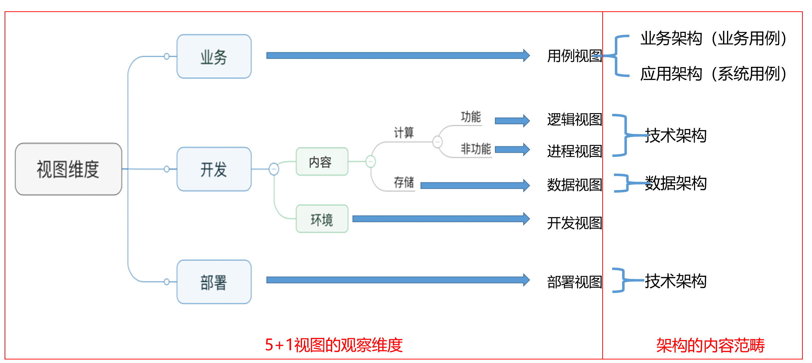

# 架构视图：5+1 视图

[TOC]

## 概览

5+1 视图主要来源于 [RUP: 4+1](../rup41/readme.md)。

5+1 视图主要包括如下视图：

视图描述如下表所示：

视图名称 | 视图描述
-|-
用例视图 | -
逻辑视图 | 逻辑视图描述系统功能相关的架构与关键用例实现。
进程视图 | -
开发视图 | -
物理视图 | 描述物理部署的设计如何满足相关的质量目标。

> 对于需要用到多个视图进行表达的问题，需要在各个视图之间围绕同一问题建立关联，例如：跨城容灾，可能涉及进程视图和部署视图，需要各个视图就跨城容灾问题建立关联

视图是对架构的描述，我们来看看这些视图描述了架构的哪些方面：

那么每个视图应该输出什么内容呢，这些输出又该由哪些角色来承担呢？请参考下表：

- 用例视图：

视图 | 输出内容 | 角色
-|-|-
用例视图 | 子域划分 | 业务架构师（主）
用例视图 | 关键业务用例 | 业务架构师（主）
用例视图 | 关键系统用例 | 产品经理（主）、业务架构师

- 逻辑视图：

视图 | 输出内容 | 角色
-|-|-
逻辑视图 | 限界上下文划分 | 业务架构师（主）
逻辑视图 | 限界上下文间的集成 | 技术架构师（主）、测试负责人
逻辑视图 | 限界上下文内的分层 | 技术架构师（主）
逻辑视图 | 分层内的组件结构 | 技术架构师（主）、测试负责人
逻辑视图 | 用例开发设计 | 开发负责人（主）、测试负责人

- 模型视图：

视图 | 输出内容 | 角色
-|-|-
进程视图 | 非功能开发设计 | 开发负责人（主）、技术架构师、测试负责人

- 数据视图：

视图 | 输出内容 | 角色
-|-|-
数据视图 | 表结构设计（E-R图、KV表） | 开发负责人（主）、数据库架构师（或DBA）
数据视图 | 分库分表策略 | 开发负责人（主）、数据库架构师（或DBA）
数据视图 | 缓存策略 | 开发负责人（主）、数据库架构师（或DBA）
数据视图 | 存储过程与触发器设计 | 开发负责人（主）、数据库架构师（或DBA）

- 开发视图：

视图 | 输出内容 | 角色
-|-|-
开发视图 | 模块组织结构图 | 开发负责人（主），技术架构师

- 部署视图：

视图 | 输出内容 | 角色
-|-|-
部署视图 | 部署视图 | 运维负责人（主），技术架构师

## 用例视图

用例视图主要输出三方面内容：

- 领域划分
- 关键业务用例
- 关键系统用例

### 子域划分

要点 | 描述
-|-
目标 | 识别挑战，定位正确的问题
范围 | 当前业务竞争环境下的所有需要考虑的业务问题
表示法 | 价值对比图、子域划分图
工具 | 由业务部门指定
指南 | 请参考 DDD 中领域和子域部分

子域划分是根据业务的，下表可以作为一个参考，提供一个简单的思路：

归属子域 | 判断条件
-|-
核心域 | 事关成败的主要矛盾是什么？
支撑域 | 事关成败的次要矛盾是什么？
通用域 | 与特定问题无关的基本条件要满足什么？

这部分主要输出：

**1. 子域划分**

通过对业务进行划分，得到各个子域：

**2. 价值对比图**

在有了子域划分后，我们怎么得到我们的核心域呢？价值对比图是一个比较好的方式。

换句话说，也就是通过比较、分析价值，得出核心域的结论，主要是有以下输出：

类别 | 内容
-|-
价值比较图 | 通过可视化的方式，给出不同产品对于子域的优势劣势。
价值分析 | 分析各个产品在不同子域上的价值。
结论 | 从子域中根据价值，提取出核心域。

### 关键用例

要点 | 描述
-|-
目标 | 描述架构要解决的问题相关的业务背景信息
范围 | 愿景、涉众利益、业务用例、业务流程以及推导出的核心系统用例
表示法 | 能用 UML 表达的，不用其它方式表达
工具 | 由业务部门指定
指南 | 请参考 《软件方法》

这部分主要输出：

- 愿景
- 涉众利益
- 业务建模（主要指业务用例 + 业务序列图）
- 需求建模（主要指系统用例）
- 分析建模（主要指分析序列图）

## 逻辑视图

逻辑视图描述系统功能相关的架构与关键用例实现，包括：

- 限界上下文划分和集成
- 限界上下文内的分层架构
- 分层内的组件结构
- 系统用例的实现（设计序列图）

> 描述用例实现的时候，仅仅描述单个会话（Session）中的处理逻辑，不涉及并发请求问题，并发请求问题属于非功能需求，在进程视图中描述。

### 限界上下文的划分和集成

要点 | 描述
-|-
目标 | 描述明确的限界上下文及其边界，说明如何满足逻辑视图中相关质量目标的要求。
范围 | 解决方案内的所有上下文。
内容 | 限界上下文关系结构；限界上下文系统集成。
表示法 | 限界上下文关系结构图；限界上下文系统集成图。
工具 | PPT、EA、UML
指南 | 请参考 DDD 的限界上下文。

**限界上下文关系结构**

该结构用圆圈加文字表示上下文，BC（限界上下文）的集成关系存在方向，上游 BC 使用 U 表示，下游使用 D 表示，并且在连线两侧使用方框中的缩写表示集成模式。

**限界上下文间的集成**

集成图通过 UML 部署图进行表示：

**注意：**

- 不同上下文之间可以直接读取访问，但不可直接写入访问，上下文之间的写入访问，应该采用事件异步的方式，也就是说，不同上下文的写入，应该采用 BASE 事务。基于消息的集成模式，其成功取决于上下文之间业务的松耦合设计

### 限界上下文的分层

要点 | 描述
-|-
目标 | 描述采用的分层逻辑如何满足整洁架构原则、如何满足相关质量目标。
范围 | 架构分层、层间隔离级别以及各层的职责描述。
内容 | 分层结构图，以及各层的隔离级别；分层职责描述。
表示法 | UML 包图 + 文本 + 列表，能用 UML 的不用其它表示法。
工具 | PPT、EA、UML。
指南 | 请参考 DDD 的架构分层。

一个简单的分层如下：

现在主流的限界上下文分层应该满足整洁架构，下图分层又内向外：

分层 | 包含的对象类型 | 职责描述
- | - | -
领域层 | 业务组件 Facade | • 以业务组件为单元，为领域层提供远程访问的服务接口，负责与基础设施层交互，以获取领域模型以及相关其它数据，并实际调用领域模型或领域服务完成操作； • 负责调用仓储服务接口对聚合进行持久化操作。
领域层 | 领域模型 | 执行核心业务逻辑操作。
领域层 | 领域服务 | 执行独立于聚合之外的公共操作。
应用层 | 应用服务 | • 是用例的 Facade，每个用例一个应用服务，一个应用服务就是一个控制类； • 当与领域模型处于同一进程时用于加载、操作和持久化领域模型，否则，通过业务组件Facade操作领域模型； • 执行已定义的流程编排逻辑； • 通过查询服务读取数据。
应用层 | 流程编排服务 | 对已经编排的流程状态机的封装，控制不同流程状态下展示的界面及可执行的操作。
应用层 | 仓储服务接口 | 当应用服务与领域模型处于同一进程时。应用服务通过该接口执行领域模型的持久化操作，否则，该接口处于领域层中，业务组件 Facade 通过该接口执行领域模型的持久化操作。
端口适配器层 | 数据交换 | 仓储服务实现、查询服务、ORM、DAO、服务接口适配器等。
框架与驱动程序层 | 公共应用管理 | 会话管理、事务控制、权限控制、日志记录、异常处理等。
框架与驱动程序层 | API | 安全、路由、负载均衡、服务发现、服务监控等。
框架与驱动程序层 | 数据传输 | 邮件、消息队列。
框架与驱动程序层 | 数据存储 | 数据库、缓存等。

**分层内的组件结构**

要点 | 描述
-|-
目标 | 描述的限界上下文内的组件结构如何满足整洁架构原则、如何满足相关质量目标。
范围 | 各个组件的关系与职责，需要说明每个组件所在的分层。
内容 | 组件架构设计图；组件说明。
表示法 | UML 组件图 + 文本。
工具 | PPT、EA、UML。
指南 | 请参考《整洁架构之道》的组件部分。

上图和限界上下文分层是由密切关系的：

- 蓝色表示`框架与驱动程序层`。
- 绿色表示`端口适配器层`。
- 红色表示`应用层`。
- 黄色表示`领域层`。

## 部署视图

要点 | 描述
-|-
目标 | 描述物理部署的设计，如何满足相关的质量目标。
范围 | 表达逻辑视图中的实例的部署方式。
内容 | 第一层：系统全景结构图；第二层：容器视图；第三层：组件视图。
表示法 | UML 部署图 + 文本。
工具 | PPT、EA、UML。
指南 | 请参考 C4Model 的前三层。

部署视图其实和 C4Model 的前三层概念高度相似，甚至可以说基本一致。

**第一层：系统全景结构图**

描述系统间关系：

**第二层：容器视图**

系统内部的容器视图。容器是指的：可以独立部署的节点。

**第三层：组件视图**

容器内的组件。组件对应到业务组件或技术组件，是最终用于分发的物理制品。

## 参考文献

1. [Architectural Blueprints—The “4+1” View Model of Software Architecture](https://www.cs.ubc.ca/~gregor/teaching/papers/4+1view-architecture.pdf)
