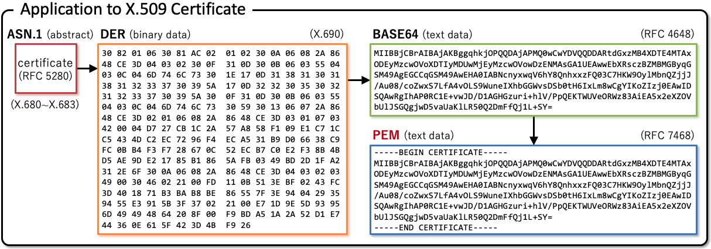

# 安全基础设施

[TOC]

## 概览

在业界的安全实践中，有非常复杂的安全基础设施，以及相关的标准，导致衍生出来了非常多个概览并且难以理解，例如：

- X.509 Certificate
- DER
- PEM
- ASN.1
- PKCS
- ...

本文试图学习这些安全基础设施，并进行记录，方便后续翻阅。

下图是一个简单的 PEM 证书格式的生产流程：

## 附录：参考文献

1. [PKCS](https://en.wikipedia.org/wiki/PKCS)
1. [写给工程师：关于证书（certificate）和公钥基础设施（PKI）的一切](http://arthurchiao.art/blog/everything-about-pki-zh/)